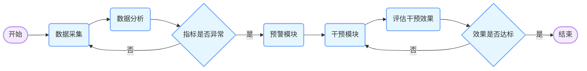

# 金融市场流动性枯竭预警与干预系统

> 关键词：金融市场、流动性枯竭、预警系统、干预系统、风险管理

> 摘要：本文聚焦于金融市场流动性枯竭预警与干预系统。首先介绍了该系统研究的背景、目的、预期读者等信息。接着阐述了核心概念，包括流动性枯竭等概念的原理和架构，并给出了相应的文本示意图和Mermaid流程图。详细讲解了核心算法原理，用Python代码进行了具体实现。对涉及的数学模型和公式进行了推导和举例说明。通过项目实战，从开发环境搭建到源代码实现与解读，深入分析了系统的实际构建。探讨了系统在不同金融场景中的实际应用，推荐了相关的学习资源、开发工具框架以及论文著作。最后总结了系统未来的发展趋势与挑战，还给出了常见问题的解答和扩展阅读参考资料，旨在为金融领域从业者和研究者提供全面且深入的技术指导。

## 1. 背景介绍 
### 1.1 目的和范围
金融市场的稳定运行对于全球经济的健康发展至关重要，而流动性是金融市场的生命线。当金融市场出现流动性枯竭时，资产价格可能会大幅下跌，交易无法正常进行，甚至引发系统性金融风险。本系统的目的在于构建一个能够及时准确预警金融市场流动性枯竭情况，并提供有效干预策略的系统。其范围涵盖了各类金融市场，如股票市场、债券市场、外汇市场等，旨在为金融机构、监管部门等提供决策支持，降低流动性风险带来的损失。

### 1.2 预期读者
本文的预期读者主要包括金融机构的风险管理部门人员、金融市场监管机构工作人员、金融科技领域的开发者和研究者。对于金融从业者，可通过本系统更好地管理流动性风险；对于开发者和研究者，本系统的设计思路和技术实现可作为研究和开发金融相关系统的参考。

### 1.3 文档结构概述
本文将按照以下结构进行阐述：首先介绍系统相关的核心概念和它们之间的联系；接着详细讲解核心算法原理及具体操作步骤，并给出Python代码实现；然后介绍系统涉及的数学模型和公式，进行详细推导和举例说明；通过项目实战展示系统的实际开发过程，包括开发环境搭建、源代码实现和代码解读；探讨系统在实际金融场景中的应用；推荐相关的学习资源、开发工具框架和论文著作；最后总结系统未来的发展趋势与挑战，给出常见问题的解答和扩展阅读参考资料。

### 1.4 术语表
#### 1.4.1 核心术语定义
- **金融市场流动性**：指金融资产能够以合理价格迅速交易的能力。高流动性意味着资产可以在不显著影响价格的情况下快速买卖。
- **流动性枯竭**：当金融市场中的流动性突然大幅下降，导致资产难以以合理价格交易，甚至出现有价无市的情况。
- **预警系统**：通过监测一系列与流动性相关的指标，提前发现流动性枯竭的迹象并发出警报的系统。
- **干预系统**：在预警系统发出警报后，采取一系列措施来缓解流动性枯竭状况，维持金融市场稳定的系统。

#### 1.4.2 相关概念解释
- **系统性金融风险**：指由于金融体系内部或外部因素引发的，可能导致整个金融系统崩溃的风险。流动性枯竭是引发系统性金融风险的重要因素之一。
- **市场深度**：衡量市场在不影响价格的情况下能够吸收的交易量大小的指标。市场深度越大，流动性越好。
- **买卖价差**：指金融资产的买入价和卖出价之间的差额。买卖价差越大，说明市场流动性越差。

#### 1.4.3 缩略词列表
- **VaR**：Value at Risk，风险价值，用于衡量在一定置信水平下和一定持有期内，投资组合可能遭受的最大损失。
- **LCR**：Liquidity Coverage Ratio，流动性覆盖率，用于衡量金融机构在短期面临流动性压力时，是否有足够的优质流动性资产来应对。

## 2. 核心概念与联系 

### 核心概念原理
#### 流动性枯竭原理
金融市场的流动性受到多种因素的影响，包括宏观经济环境、政策变化、投资者情绪等。当这些因素发生不利变化时，投资者可能会同时大量抛售资产，导致市场上的卖盘远远超过买盘，从而使资产价格急剧下跌，交易变得困难，最终引发流动性枯竭。例如，在金融危机期间，投资者对市场前景极度悲观，纷纷抛售股票等资产，导致股票市场流动性迅速枯竭。

#### 预警系统原理
预警系统通过实时监测一系列与流动性相关的指标，如交易量、买卖价差、市场深度等，并利用数据分析和机器学习算法对这些指标进行分析，当指标出现异常变化时，系统会发出警报。例如，当某只股票的交易量突然大幅下降，买卖价差急剧扩大时，预警系统可能会判断该股票市场出现流动性枯竭的风险，并发出相应的警报。

#### 干预系统原理
干预系统在预警系统发出警报后启动，其目的是通过采取一系列措施来缓解流动性枯竭状况。这些措施包括央行注入流动性、金融机构调整资产配置、政府出台相关政策等。例如，央行可以通过公开市场操作，如购买债券等方式向市场注入流动性，增加市场上的资金供应，从而缓解流动性枯竭的压力。

### 架构的文本示意图
```plaintext
金融市场流动性枯竭预警与干预系统
|-- 数据采集模块
|   |-- 市场数据采集
|   |   |-- 股票市场数据
|   |   |-- 债券市场数据
|   |   |-- 外汇市场数据
|   |-- 宏观经济数据采集
|   |   |-- GDP数据
|   |   |-- 利率数据
|   |   |-- 通货膨胀数据
|-- 数据分析模块
|   |-- 指标计算
|   |   |-- 交易量
|   |   |-- 买卖价差
|   |   |-- 市场深度
|   |-- 模型训练
|   |   |-- 机器学习模型
|   |   |-- 时间序列模型
|-- 预警模块
|   |-- 阈值设定
|   |-- 警报触发
|-- 干预模块
|   |-- 策略制定
|   |-- 措施执行
```

### Mermaid流程图


## 3. 核心算法原理 & 具体操作步骤 

### 核心算法原理
本系统主要使用机器学习中的支持向量机（SVM）算法和时间序列分析中的ARIMA模型来进行流动性枯竭的预警。

#### 支持向量机（SVM）原理
支持向量机是一种有监督的机器学习算法，其基本思想是在特征空间中找到一个最优的超平面，使得不同类别的样本能够被最大程度地分开。在本系统中，我们将正常市场状态和流动性枯竭状态作为两个不同的类别，通过训练SVM模型来区分这两种状态。

#### ARIMA模型原理
ARIMA（Autoregressive Integrated Moving Average）模型是一种常用的时间序列分析模型，它结合了自回归（AR）、差分（I）和移动平均（MA）三个部分。ARIMA模型通过对时间序列数据的历史值进行分析，来预测未来的值。在本系统中，我们使用ARIMA模型来预测与流动性相关的指标，如交易量、买卖价差等，当预测值出现异常时，发出预警。

### 具体操作步骤及Python代码实现

#### 数据准备
首先，我们需要收集金融市场的历史数据，包括交易量、买卖价差等指标。以下是一个简单的Python代码示例，用于读取CSV文件中的数据：
```python
import pandas as pd

# 读取数据
data = pd.read_csv('financial_data.csv')

# 提取需要的特征
features = data[['volume', 'spread']]
labels = data['status']  # 0表示正常状态，1表示流动性枯竭状态
```

#### 数据预处理
在使用数据之前，我们需要对数据进行预处理，包括数据清洗、归一化等操作。以下是一个简单的数据预处理代码示例：
```python
from sklearn.preprocessing import StandardScaler
from sklearn.model_selection import train_test_split

# 数据归一化
scaler = StandardScaler()
features_scaled = scaler.fit_transform(features)

# 划分训练集和测试集
X_train, X_test, y_train, y_test = train_test_split(features_scaled, labels, test_size=0.2, random_state=42)
```

#### 训练SVM模型
```python
from sklearn.svm import SVC

# 创建SVM模型
svm_model = SVC(kernel='linear')

# 训练模型
svm_model.fit(X_train, y_train)

# 预测
y_pred = svm_model.predict(X_test)
```

#### 训练ARIMA模型
```python
from statsmodels.tsa.arima.model import ARIMA

# 假设我们要预测交易量
volume_data = data['volume']

# 拟合ARIMA模型
model = ARIMA(volume_data, order=(1, 1, 1))
model_fit = model.fit()

# 预测未来值
forecast = model_fit.get_forecast(steps=10)
forecast_mean = forecast.predicted_mean
```

#### 预警触发
当SVM模型预测结果为流动性枯竭状态，或者ARIMA模型预测的指标值超出正常范围时，触发预警。以下是一个简单的预警触发代码示例：
```python
# 假设我们设置交易量的正常范围为[1000, 5000]
if forecast_mean[0] < 1000 or forecast_mean[0] > 5000:
    print("交易量异常，触发预警！")

if y_pred[0] == 1:
    print("SVM模型预测为流动性枯竭状态，触发预警！")
```

## 4. 数学模型和公式 & 详细讲解 & 举例说明 

### 支持向量机（SVM）数学模型和公式
#### 基本原理
在一个二维特征空间中，假设有两类样本点，我们希望找到一个最优的超平面 $w^T x + b = 0$ 来将这两类样本点分开，其中 $w$ 是超平面的法向量，$b$ 是偏置项。对于一个样本点 $x_i$，如果它属于正类，则有 $w^T x_i + b \geq 1$；如果它属于负类，则有 $w^T x_i + b \leq -1$。我们的目标是找到 $w$ 和 $b$，使得两类样本点到超平面的间隔最大。

#### 目标函数
SVM的目标函数可以表示为：
$$
\min_{w, b} \frac{1}{2} \| w \|^2
$$
约束条件为：
$$
y_i (w^T x_i + b) \geq 1, \quad i = 1, 2, \cdots, n
$$
其中 $y_i$ 是样本点 $x_i$ 的标签，$n$ 是样本的数量。

#### 拉格朗日对偶问题
为了解决上述有约束的优化问题，我们引入拉格朗日乘子 $\alpha_i \geq 0$，构造拉格朗日函数：
$$
L(w, b, \alpha) = \frac{1}{2} \| w \|^2 - \sum_{i=1}^{n} \alpha_i (y_i (w^T x_i + b) - 1)
$$
对 $w$ 和 $b$ 求偏导数并令其为0，得到：
$$
w = \sum_{i=1}^{n} \alpha_i y_i x_i
$$
$$
\sum_{i=1}^{n} \alpha_i y_i = 0
$$
将上述结果代入拉格朗日函数，得到拉格朗日对偶问题：
$$
\max_{\alpha} \sum_{i=1}^{n} \alpha_i - \frac{1}{2} \sum_{i=1}^{n} \sum_{j=1}^{n} \alpha_i \alpha_j y_i y_j x_i^T x_j
$$
约束条件为：
$$
\sum_{i=1}^{n} \alpha_i y_i = 0
$$
$$
\alpha_i \geq 0, \quad i = 1, 2, \cdots, n
$$

#### 举例说明
假设我们有两个样本点 $x_1 = [1, 1]$，$x_2 = [2, 2]$，对应的标签 $y_1 = 1$，$y_2 = -1$。我们可以通过求解拉格朗日对偶问题来找到最优的超平面。

### ARIMA模型数学模型和公式
#### 基本原理
ARIMA模型的一般形式为 $ARIMA(p, d, q)$，其中 $p$ 是自回归阶数，$d$ 是差分阶数，$q$ 是移动平均阶数。

#### 自回归（AR）部分
自回归模型的形式为：
$$
y_t = c + \sum_{i=1}^{p} \phi_i y_{t-i} + \epsilon_t
$$
其中 $y_t$ 是时间序列在 $t$ 时刻的值，$c$ 是常数项，$\phi_i$ 是自回归系数，$\epsilon_t$ 是白噪声。

#### 差分（I）部分
差分是为了使时间序列变得平稳。对于一阶差分，有：
$$
\Delta y_t = y_t - y_{t-1}
$$

#### 移动平均（MA）部分
移动平均模型的形式为：
$$
y_t = c + \epsilon_t + \sum_{i=1}^{q} \theta_i \epsilon_{t-i}
$$
其中 $\theta_i$ 是移动平均系数。

#### ARIMA模型的综合形式
将AR、I、MA三个部分结合起来，得到ARIMA模型的综合形式：
$$
\Delta^d y_t = c + \sum_{i=1}^{p} \phi_i \Delta^d y_{t-i} + \epsilon_t + \sum_{i=1}^{q} \theta_i \epsilon_{t-i}
$$

#### 举例说明
假设我们有一个时间序列 $y = [1, 2, 3, 4, 5]$，我们可以使用 $ARIMA(1, 1, 1)$ 模型来对其进行建模。首先进行一阶差分：
$$
\Delta y = [2 - 1, 3 - 2, 4 - 3, 5 - 4] = [1, 1, 1, 1]
$$
然后使用自回归和移动平均部分进行建模。

## 5. 项目实战：代码实际案例和详细解释说明 

### 5.1  开发环境搭建
#### 操作系统
本项目可以在Windows、Linux或Mac OS等主流操作系统上进行开发。建议使用Linux系统，如Ubuntu，因为它对Python和相关库的支持较好。

#### Python环境
安装Python 3.7及以上版本。可以从Python官方网站（https://www.python.org/downloads/）下载安装包进行安装。

#### 相关库安装
使用pip命令安装以下必要的库：
```sh
pip install pandas numpy scikit-learn statsmodels matplotlib
```
- **pandas**：用于数据处理和分析。
- **numpy**：用于数值计算。
- **scikit-learn**：提供了丰富的机器学习算法和工具。
- **statsmodels**：用于时间序列分析和统计建模。
- **matplotlib**：用于数据可视化。

### 5.2  源代码详细实现和代码解读
以下是一个完整的金融市场流动性枯竭预警与干预系统的源代码示例：
```python
import pandas as pd
import numpy as np
from sklearn.preprocessing import StandardScaler
from sklearn.model_selection import train_test_split
from sklearn.svm import SVC
from statsmodels.tsa.arima.model import ARIMA
import matplotlib.pyplot as plt

# 读取数据
def read_data(file_path):
    data = pd.read_csv(file_path)
    return data

# 数据预处理
def preprocess_data(data):
    features = data[['volume', 'spread']]
    labels = data['status']
    
    # 数据归一化
    scaler = StandardScaler()
    features_scaled = scaler.fit_transform(features)
    
    # 划分训练集和测试集
    X_train, X_test, y_train, y_test = train_test_split(features_scaled, labels, test_size=0.2, random_state=42)
    
    return X_train, X_test, y_train, y_test

# 训练SVM模型
def train_svm_model(X_train, y_train):
    svm_model = SVC(kernel='linear')
    svm_model.fit(X_train, y_train)
    return svm_model

# 训练ARIMA模型
def train_arima_model(data):
    volume_data = data['volume']
    model = ARIMA(volume_data, order=(1, 1, 1))
    model_fit = model.fit()
    return model_fit

# 预警触发
def trigger_alert(svm_model, X_test, arima_model):
    # SVM模型预测
    y_pred = svm_model.predict(X_test)
    
    # ARIMA模型预测
    forecast = arima_model.get_forecast(steps=10)
    forecast_mean = forecast.predicted_mean
    
    # 假设交易量的正常范围为[1000, 5000]
    if forecast_mean[0] < 1000 or forecast_mean[0] > 5000:
        print("交易量异常，触发预警！")
    
    if y_pred[0] == 1:
        print("SVM模型预测为流动性枯竭状态，触发预警！")

# 主函数
def main():
    file_path = 'financial_data.csv'
    data = read_data(file_path)
    
    X_train, X_test, y_train, y_test = preprocess_data(data)
    
    svm_model = train_svm_model(X_train, y_train)
    arima_model = train_arima_model(data)
    
    trigger_alert(svm_model, X_test, arima_model)
    
    # 绘制交易量时间序列图
    volume_data = data['volume']
    plt.plot(volume_data)
    plt.xlabel('Time')
    plt.ylabel('Volume')
    plt.title('Volume Time Series')
    plt.show()

if __name__ == "__main__":
    main()
```

### 5.3  代码解读与分析
#### 读取数据
`read_data` 函数使用 `pandas` 库的 `read_csv` 函数读取CSV文件中的金融市场数据。

#### 数据预处理
`preprocess_data` 函数提取了交易量和买卖价差作为特征，将市场状态作为标签。使用 `StandardScaler` 对特征进行归一化处理，然后使用 `train_test_split` 函数将数据划分为训练集和测试集。

#### 训练SVM模型
`train_svm_model` 函数创建了一个线性核的SVM模型，并使用训练集数据进行训练。

#### 训练ARIMA模型
`train_arima_model` 函数使用 `ARIMA` 模型对交易量时间序列数据进行建模和训练。

#### 预警触发
`trigger_alert` 函数使用训练好的SVM模型和ARIMA模型进行预测，当预测结果出现异常时，触发预警。

#### 主函数
`main` 函数调用了上述各个函数，完成了数据读取、预处理、模型训练、预警触发等操作，并使用 `matplotlib` 库绘制了交易量的时间序列图。

## 6. 实际应用场景 
### 金融机构风险管理
金融机构，如银行、证券公司等，可以使用本系统来监测其投资组合的流动性风险。当系统发出流动性枯竭预警时，金融机构可以及时调整资产配置，减少风险暴露。例如，银行可以提前准备足够的流动性资金，以应对可能出现的资金紧张情况；证券公司可以减少高风险资产的持有，增加流动性较好的资产。

### 金融市场监管
金融市场监管机构可以利用本系统对整个金融市场的流动性状况进行实时监测。当发现市场出现流动性枯竭的迹象时，监管机构可以采取相应的干预措施，如调整货币政策、出台相关监管政策等，以维护金融市场的稳定。例如，央行可以通过公开市场操作向市场注入流动性，缓解市场资金紧张的局面。

### 投资决策支持
投资者可以使用本系统提供的预警信息来辅助投资决策。当系统发出流动性枯竭预警时，投资者可以选择减少投资或者调整投资策略，避免在流动性较差的市场环境中遭受损失。例如，投资者可以将资金从股票市场转移到债券市场或货币市场，以提高资金的安全性和流动性。

## 7. 工具和资源推荐
### 7.1 学习资源推荐
#### 7.1.1 书籍推荐
- 《金融市场学》：系统介绍了金融市场的基本概念、运行机制和各类金融工具，是学习金融市场的经典教材。
- 《机器学习》：周志华著，全面介绍了机器学习的基本原理、算法和应用，对于理解本系统中使用的机器学习算法有很大帮助。
- 《时间序列分析：预测与控制》：详细讲解了时间序列分析的理论和方法，是学习ARIMA模型等时间序列分析技术的重要参考书籍。

#### 7.1.2 在线课程
- Coursera上的“Financial Markets”课程：由耶鲁大学教授罗伯特·席勒（Robert Shiller）讲授，深入介绍了金融市场的各个方面。
- edX上的“Machine Learning”课程：由斯坦福大学教授吴恩达（Andrew Ng）讲授，是机器学习领域的经典在线课程。
- 中国大学MOOC上的“时间序列分析”课程：由国内知名高校的教授授课，系统讲解了时间序列分析的理论和方法。

#### 7.1.3 技术博客和网站
- Medium：上面有很多关于金融科技、机器学习等领域的优质博客文章，可以及时了解最新的技术动态和研究成果。
- Towards Data Science：专注于数据科学和机器学习领域，提供了大量的技术教程和案例分析。
- 金融界网站：提供了丰富的金融市场数据和资讯，对于了解金融市场的实际情况有很大帮助。

### 7.2 开发工具框架推荐
#### 7.2.1 IDE和编辑器
- PyCharm：是一款专门为Python开发设计的集成开发环境（IDE），具有代码自动补全、调试、版本控制等强大功能，非常适合开发Python项目。
- Jupyter Notebook：是一个基于网页的交互式开发环境，支持Python、R等多种编程语言，方便进行数据探索、模型实验和结果展示。

#### 7.2.2 调试和性能分析工具
- pdb：Python自带的调试器，可以帮助开发者逐行调试代码，查找代码中的错误。
- cProfile：Python的性能分析工具，可以统计代码中各个函数的执行时间和调用次数，帮助开发者优化代码性能。

#### 7.2.3 相关框架和库
- TensorFlow：是一个开源的机器学习框架，提供了丰富的深度学习算法和工具，可用于构建更复杂的金融市场预测模型。
- PyTorch：也是一个流行的深度学习框架，具有动态图机制，易于使用和调试，适合进行研究和开发。
- Scikit-learn：是一个简单易用的机器学习库，提供了各种机器学习算法和工具，如分类、回归、聚类等，可用于快速实现本系统中的机器学习模型。

### 7.3 相关论文著作推荐
#### 7.3.1 经典论文
- “On the Pricing of Corporate Debt: The Risk Structure of Interest Rates”：由Merton提出的经典论文，为金融风险定价提供了重要的理论基础。
- “A Simple Model of Capital Market Equilibrium with Incomplete Information”：由Lintner提出的论文，对资本资产定价模型进行了拓展和完善。

#### 7.3.2 最新研究成果
- 可以关注《Journal of Financial Economics》、《Review of Financial Studies》等国际顶级金融学术期刊，了解金融市场流动性风险管理领域的最新研究成果。

#### 7.3.3 应用案例分析
- 可以参考一些大型金融机构的年度报告和研究报告，了解它们在金融市场流动性风险管理方面的实践经验和应用案例。

## 8. 总结：未来发展趋势与挑战
### 未来发展趋势
#### 智能化和自动化
随着人工智能和机器学习技术的不断发展，金融市场流动性枯竭预警与干预系统将越来越智能化和自动化。系统可以自动学习和适应市场变化，实时调整预警阈值和干预策略，提高系统的准确性和效率。

#### 多数据融合
未来的系统将不仅仅依赖于传统的金融市场数据，还会融合更多的外部数据，如社交媒体数据、宏观经济数据、新闻舆情数据等。通过多数据融合，可以更全面地了解市场情况，提高预警的准确性。

#### 全球化和跨市场监测
随着金融市场的全球化发展，金融市场之间的关联性越来越强。未来的系统将实现全球化和跨市场监测，能够同时监测多个国家和地区的金融市场，及时发现潜在的系统性金融风险。

### 挑战
#### 数据质量和隐私问题
金融市场数据的质量和隐私问题是系统面临的重要挑战之一。数据的不准确、不完整或被篡改可能会导致预警结果的错误。同时，金融数据涉及到大量的个人隐私和商业机密，如何在保证数据安全和隐私的前提下，有效地利用数据是一个亟待解决的问题。

#### 模型的准确性和稳定性
机器学习和时间序列分析模型的准确性和稳定性是系统的核心。然而，金融市场具有高度的复杂性和不确定性，模型可能无法准确地捕捉市场变化。如何提高模型的准确性和稳定性，减少模型的误差和偏差，是系统开发和优化的关键。

#### 监管和合规问题
金融市场受到严格的监管，系统的开发和应用需要遵守相关的法律法规和监管要求。如何确保系统的设计和运行符合监管要求，避免违规行为，是系统开发者需要面对的挑战之一。

## 9. 附录：常见问题与解答
### 问题1：如何选择合适的机器学习算法？
解答：选择合适的机器学习算法需要考虑多个因素，如数据的特点、问题的类型、模型的复杂度等。对于本系统，由于我们的目标是进行分类和预测，支持向量机（SVM）和ARIMA模型是比较合适的选择。SVM适用于处理二分类问题，能够在高维空间中找到最优的超平面；ARIMA模型适用于时间序列数据的预测，能够捕捉数据的趋势和季节性。

### 问题2：如何确定预警阈值？
解答：预警阈值的确定需要结合历史数据和实际经验。可以通过分析历史数据中流动性枯竭事件发生时的指标值，确定一个合理的阈值范围。同时，还可以使用统计方法，如均值、标准差等，来确定阈值。在实际应用中，需要不断地调整和优化阈值，以提高预警的准确性。

### 问题3：系统的干预措施有哪些？
解答：系统的干预措施包括央行注入流动性、金融机构调整资产配置、政府出台相关政策等。央行可以通过公开市场操作、降低利率等方式向市场注入流动性；金融机构可以减少高风险资产的持有，增加流动性较好的资产；政府可以出台相关的财政政策和监管政策，来稳定金融市场。

## 10. 扩展阅读 & 参考资料
### 扩展阅读
- 《金融风险管理》：全面介绍了金融风险管理的理论和方法，对于深入理解金融市场流动性风险管理有很大帮助。
- 《人工智能：现代方法》：系统介绍了人工智能的基本概念、算法和应用，对于了解人工智能在金融领域的应用有重要参考价值。

### 参考资料
- 《Python数据分析实战》：提供了丰富的Python数据分析案例和代码，对于学习Python在金融数据处理和分析中的应用有很大帮助。
- 《金融时间序列分析》：详细讲解了金融时间序列分析的理论和方法，是学习金融时间序列分析的重要参考书籍。

作者：AI天才研究院/AI Genius Institute & 禅与计算机程序设计艺术 /Zen And The Art of Computer Programming