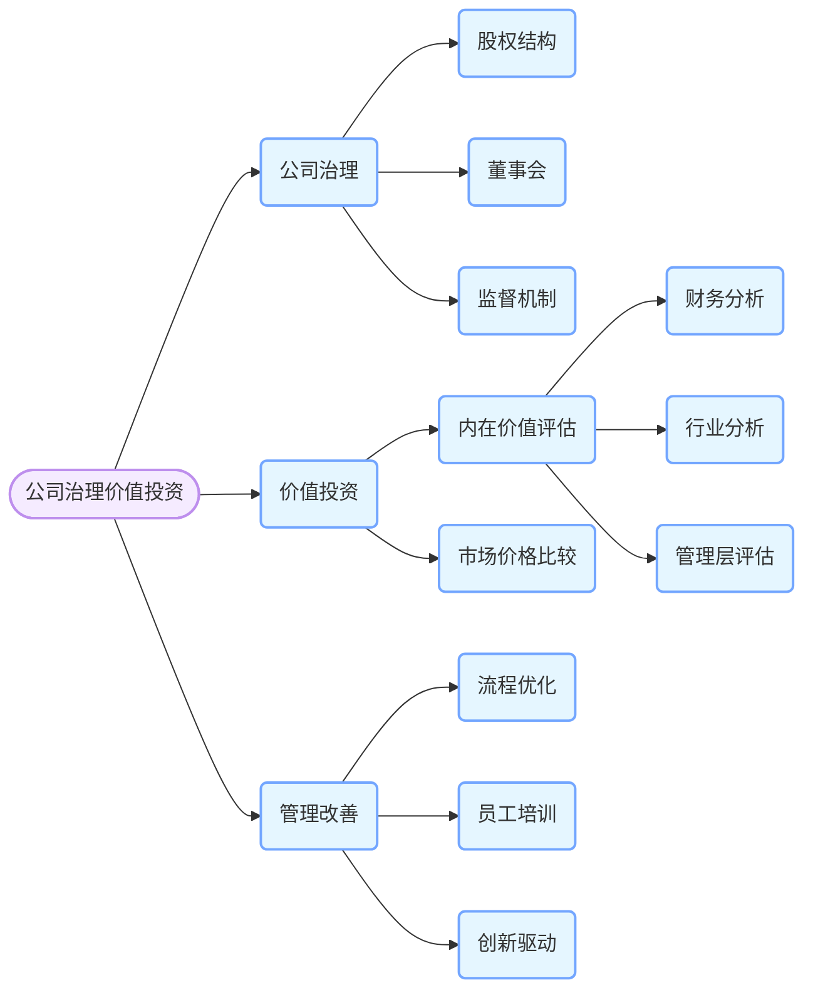

# 马丁·惠特曼的公司治理价值投资：推动管理改善

> 关键词：马丁·惠特曼、公司治理、价值投资、管理改善、投资策略

> 摘要：本文深入探讨了马丁·惠特曼所倡导的公司治理价值投资理念，即通过推动企业管理改善来实现投资价值的提升。文章首先介绍了该投资理念产生的背景、目的、预期读者等内容；接着阐述了核心概念与联系，包括公司治理、价值投资等关键概念的原理和架构；详细讲解了相关的核心算法原理及具体操作步骤，并结合数学模型和公式进行分析；通过项目实战案例展示了如何运用该投资理念进行实际操作；分析了该投资理念的实际应用场景；推荐了相关的学习资源、开发工具框架以及论文著作；最后总结了其未来发展趋势与挑战，并给出常见问题解答和扩展阅读参考资料，旨在为投资者提供全面且深入的关于马丁·惠特曼公司治理价值投资理念的知识体系。

## 1. 背景介绍 
### 1.1 目的和范围
马丁·惠特曼是价值投资领域的杰出代表人物，他的公司治理价值投资理念独树一帜。本文的目的在于全面解析这一理念，探讨如何通过积极参与公司治理来推动企业管理的改善，从而为投资者创造价值。范围涵盖该投资理念的理论基础、核心算法、数学模型、实际应用案例以及相关的工具和资源等方面。通过深入研究，帮助投资者更好地理解和运用这一投资策略，在复杂多变的市场环境中做出更明智的投资决策。

### 1.2 预期读者
本文预期读者主要包括专业投资者、金融分析师、企业管理人员以及对价值投资理论和实践感兴趣的学者和学生。专业投资者可以从本文中获取新的投资思路和方法，优化自己的投资组合；金融分析师能够深入了解公司治理对企业价值的影响，为客户提供更准确的投资建议；企业管理人员可以借鉴相关理念，改善自身企业的治理结构和管理水平；学者和学生则可以将本文作为研究价值投资领域的参考资料，拓展学术视野。

### 1.3 文档结构概述
本文将按照以下结构展开：首先介绍背景信息，包括目的、预期读者和文档结构等；接着阐述核心概念与联系，通过文本示意图和 Mermaid 流程图清晰展示各概念之间的关系；详细讲解核心算法原理和具体操作步骤，并结合 Python 代码进行说明；运用数学模型和公式进一步分析该投资理念；通过项目实战案例展示实际应用过程；分析该投资理念的实际应用场景；推荐相关的学习资源、开发工具框架和论文著作；最后总结未来发展趋势与挑战，给出常见问题解答和扩展阅读参考资料。

### 1.4 术语表
#### 1.4.1 核心术语定义
- **公司治理**：指的是通过一套包括正式或非正式的、内部或外部的制度或机制来协调公司与所有利益相关者之间的利益关系，以保证公司决策的科学性、公正性和有效性，从而维护各方面的利益。
- **价值投资**：一种投资策略，其核心是寻找被市场低估的资产，通过长期持有这些资产，等待其价值回归或提升，从而获得投资回报。
- **管理改善**：企业通过优化内部管理流程、提升管理效率、加强团队建设等方式，提高企业的运营水平和竞争力。

#### 1.4.2 相关概念解释
- **利益相关者**：包括股东、债权人、员工、供应商、客户等与企业有利益关联的个人或组织。公司治理需要平衡这些利益相关者的利益，以实现企业的可持续发展。
- **市场低估**：指市场对企业的估值低于其内在价值。价值投资者通过深入分析企业的财务状况、行业前景等因素，发现这些被低估的企业。

#### 1.4.3 缩略词列表
- **ROE**：Return on Equity，净资产收益率，衡量企业运用自有资本的效率。
- **PE**：Price-to-Earnings Ratio，市盈率，反映股票价格与每股收益之间的关系。

## 2. 核心概念与联系 

### 核心概念原理
- **公司治理原理**：公司治理的核心是建立有效的制衡机制，确保管理层的决策符合股东和其他利益相关者的利益。良好的公司治理结构包括合理的股权结构、独立的董事会、有效的监督机制等。通过这些机制，可以减少管理层的道德风险和机会主义行为，提高企业的决策质量和运营效率。
- **价值投资原理**：价值投资基于企业的内在价值进行投资决策。内在价值是指企业未来现金流的折现值。价值投资者通过分析企业的财务报表、行业竞争地位、管理层能力等因素，评估企业的内在价值。当市场价格低于内在价值时，认为该企业被低估，从而进行投资。
- **管理改善原理**：管理改善是提升企业价值的重要途径。通过优化管理流程、提高员工素质、加强创新能力等方式，可以提高企业的生产效率、降低成本、增加市场份额，从而提升企业的盈利能力和竞争力。

### 架构的文本示意图
```plaintext
公司治理价值投资
|
|-- 公司治理
|   |-- 股权结构
|   |-- 董事会
|   |-- 监督机制
|
|-- 价值投资
|   |-- 内在价值评估
|   |   |-- 财务分析
|   |   |-- 行业分析
|   |   |-- 管理层评估
|   |-- 市场价格比较
|
|-- 管理改善
|   |-- 流程优化
|   |-- 员工培训
|   |-- 创新驱动
```

### Mermaid 流程图


## 3. 核心算法原理 & 具体操作步骤 

### 核心算法原理
在马丁·惠特曼的公司治理价值投资中，核心算法主要围绕企业内在价值的评估和管理改善的效果评估。以下是一个简化的企业内在价值评估算法：

企业内在价值 $V$ 可以通过以下公式计算：
$$V = \sum_{t=1}^{n} \frac{FCF_t}{(1 + r)^t} + \frac{TV}{(1 + r)^n}$$
其中，$FCF_t$ 表示第 $t$ 年的自由现金流，$r$ 表示折现率，$n$ 表示预测期数，$TV$ 表示终值。

### 具体操作步骤
#### 步骤 1：筛选潜在投资目标
通过财务指标（如低市盈率、低市净率等）和行业前景分析，筛选出可能被低估的企业。以下是一个简单的 Python 代码示例，用于筛选低市盈率的股票：
```python
import pandas as pd

# 假设这是一个包含股票信息的 DataFrame
data = {
    '股票代码': ['000001', '000002', '000003'],
    '市盈率': [10, 20, 5]
}
df = pd.DataFrame(data)

# 筛选市盈率低于 10 的股票
low_pe_stocks = df[df['市盈率'] < 10]
print(low_pe_stocks)
```

#### 步骤 2：深入分析企业基本面
对筛选出的企业进行深入的基本面分析，包括财务分析、行业分析和管理层评估。财务分析可以使用各种财务比率，如净资产收益率、毛利率等。以下是一个计算净资产收益率的 Python 代码示例：
```python
# 假设这是一个包含企业财务信息的 DataFrame
financial_data = {
    '净利润': [100, 200, 150],
    '净资产': [1000, 2000, 1500]
}
financial_df = pd.DataFrame(financial_data)

# 计算净资产收益率
financial_df['净资产收益率'] = financial_df['净利润'] / financial_df['净资产']
print(financial_df)
```

#### 步骤 3：评估公司治理结构
分析企业的股权结构、董事会组成和监督机制等。可以通过查阅企业的年报、公告等资料获取相关信息。

#### 步骤 4：制定管理改善方案
根据企业的实际情况，制定针对性的管理改善方案，如优化生产流程、加强市场营销等。

#### 步骤 5：投资并推动管理改善
在评估企业具有投资价值后，进行投资，并积极参与企业的治理，推动管理改善方案的实施。

#### 步骤 6：持续监控和评估
定期监控企业的经营状况和财务指标，评估管理改善的效果，并根据情况调整投资策略。

## 4. 数学模型和公式 & 详细讲解 & 举例说明 

### 企业内在价值评估模型
如前面所述，企业内在价值 $V$ 的计算公式为：
$$V = \sum_{t=1}^{n} \frac{FCF_t}{(1 + r)^t} + \frac{TV}{(1 + r)^n}$$

#### 详细讲解
- **自由现金流 $FCF_t$**：指企业在满足了所有运营成本和资本支出后剩余的现金流量。它是企业能够自由支配的现金，反映了企业的实际盈利能力。
- **折现率 $r$**：用于将未来的现金流折现到当前的价值。折现率的选择通常考虑无风险利率、市场风险溢价和企业特定风险等因素。
- **预测期数 $n$**：指预测企业自由现金流的时间段。通常根据企业的行业特点和发展阶段来确定。
- **终值 $TV$**：指预测期结束后企业的价值。终值的计算方法有多种，常见的是使用永续增长模型：
$$TV = \frac{FCF_{n+1}}{r - g}$$
其中，$FCF_{n+1}$ 表示预测期结束后下一年的自由现金流，$g$ 表示永续增长率。

### 举例说明
假设一家企业的预测期为 5 年，每年的自由现金流分别为 100 万元、120 万元、130 万元、140 万元和 150 万元。折现率为 10%，预测期结束后的永续增长率为 3%。首先计算预测期内自由现金流的折现值：
$$
\begin{align*}
PV_{FCF} &= \frac{100}{(1 + 0.1)^1} + \frac{120}{(1 + 0.1)^2} + \frac{130}{(1 + 0.1)^3} + \frac{140}{(1 + 0.1)^4} + \frac{150}{(1 + 0.1)^5}\\
&= \frac{100}{1.1} + \frac{120}{1.21} + \frac{130}{1.331} + \frac{140}{1.4641} + \frac{150}{1.61051}\\
&\approx 90.91 + 99.17 + 97.67 + 95.66 + 93.14\\
&= 476.55 \text{（万元）}
\end{align*}
$$

然后计算终值：
$$
\begin{align*}
FCF_{6} &= 150 \times (1 + 0.03) = 154.5 \text{（万元）}\\
TV &= \frac{154.5}{0.1 - 0.03}\\
&= \frac{154.5}{0.07}\\
&\approx 2207.14 \text{（万元）}
\end{align*}
$$

终值的折现值为：
$$PV_{TV} = \frac{2207.14}{(1 + 0.1)^5} \approx \frac{2207.14}{1.61051} \approx 1370.46 \text{（万元）}$$

企业的内在价值为：
$$V = PV_{FCF} + PV_{TV} = 476.55 + 1370.46 = 1847.01 \text{（万元）}$$

## 5. 项目实战：代码实际案例和详细解释说明 

### 5.1  开发环境搭建
#### 安装 Python
首先需要安装 Python 环境，建议使用 Python 3.7 及以上版本。可以从 Python 官方网站（https://www.python.org/downloads/）下载并安装。

#### 安装必要的库
在命令行中使用以下命令安装所需的库：
```sh
pip install pandas numpy matplotlib
```
- `pandas`：用于数据处理和分析。
- `numpy`：用于数值计算。
- `matplotlib`：用于数据可视化。

### 5.2  源代码详细实现和代码解读
以下是一个完整的 Python 代码示例，用于实现企业内在价值的评估：
```python
import numpy as np
import matplotlib.pyplot as plt

# 定义自由现金流、折现率、预测期数和永续增长率
fcfs = np.array([100, 120, 130, 140, 150])
r = 0.1
n = len(fcfs)
g = 0.03

# 计算预测期内自由现金流的折现值
discount_factors = np.array([(1 + r) ** i for i in range(1, n + 1)])
pv_fcfs = fcfs / discount_factors
total_pv_fcfs = np.sum(pv_fcfs)

# 计算终值
fcfs_n_plus_1 = fcfs[-1] * (1 + g)
tv = fcfs_n_plus_1 / (r - g)
pv_tv = tv / ((1 + r) ** n)

# 计算企业内在价值
intrinsic_value = total_pv_fcfs + pv_tv

# 打印结果
print(f"预测期内自由现金流的折现值: {total_pv_fcfs} 万元")
print(f"终值的折现值: {pv_tv} 万元")
print(f"企业内在价值: {intrinsic_value} 万元")

# 可视化预测期内自由现金流的折现值
plt.bar(range(1, n + 1), pv_fcfs)
plt.xlabel('年份')
plt.ylabel('折现值（万元）')
plt.title('预测期内自由现金流的折现值')
plt.show()
```

### 代码解读与分析
- **自由现金流和参数定义**：使用 `np.array` 定义了每年的自由现金流 `fcfs`，以及折现率 `r`、预测期数 `n` 和永续增长率 `g`。
- **预测期内自由现金流折现值计算**：通过 `discount_factors` 计算每年的折现因子，然后将自由现金流除以折现因子得到折现值 `pv_fcfs`，最后使用 `np.sum` 计算预测期内自由现金流折现值的总和 `total_pv_fcfs`。
- **终值计算**：先计算预测期结束后下一年的自由现金流 `fcfs_n_plus_1`，然后使用永续增长模型计算终值 `tv`，最后将终值折现得到 `pv_tv`。
- **企业内在价值计算**：将预测期内自由现金流折现值总和和终值折现值相加得到企业内在价值 `intrinsic_value`。
- **可视化**：使用 `matplotlib` 库绘制柱状图，展示预测期内自由现金流的折现值。

## 6. 实际应用场景 
### 股票投资
投资者可以运用马丁·惠特曼的公司治理价值投资理念，筛选出被低估且具有良好治理结构的企业进行投资。通过积极参与企业治理，推动管理改善，提升企业价值，从而获得投资回报。例如，投资者发现一家传统制造业企业，其市盈率低于行业平均水平，但公司治理存在一定问题，管理层效率低下。投资者可以通过购买该企业股票，进入董事会，推动企业进行管理改革，如优化生产流程、加强成本控制等，提高企业的盈利能力和市场竞争力，进而使股票价格上涨。

### 私募股权投资
私募股权投资机构在选择投资项目时，可以关注企业的公司治理和管理水平。对于那些具有潜力但治理和管理存在不足的企业，投资机构可以在投资后，利用自身的资源和经验，帮助企业改善管理，提升企业价值。例如，私募股权投资机构投资一家初创科技企业，发现企业的研发管理和市场推广能力较弱。投资机构可以引入专业的管理团队，优化研发流程，加强市场推广，提高企业的产品竞争力和市场份额，为企业的后续发展和上市打下基础。

### 企业并购
在企业并购过程中，收购方可以运用公司治理价值投资理念，评估目标企业的价值和治理状况。对于那些被低估但具有改善潜力的企业，收购方可以通过并购后进行管理整合和治理优化，实现协同效应，提升企业整体价值。例如，一家大型企业收购一家小型竞争对手，发现目标企业拥有独特的技术和市场渠道，但管理混乱，成本过高。收购方可以通过整合双方的资源，优化目标企业的管理流程，降低成本，提高企业的盈利能力和市场地位。

## 7. 工具和资源推荐
### 7.1 学习资源推荐
#### 7.1.1 书籍推荐
- 《价值投资：从格雷厄姆到巴菲特》：系统介绍了价值投资的理论和实践，包括马丁·惠特曼等价值投资大师的投资理念和方法。
- 《公司治理》：全面阐述了公司治理的基本概念、理论和实践，对于理解公司治理在价值投资中的作用具有重要意义。
- 《财务报表分析与证券定价》：帮助读者掌握财务报表分析的方法和技巧，为评估企业内在价值提供了重要工具。

#### 7.1.2 在线课程
- Coursera 上的“价值投资原理与实践”课程：由知名商学院教授授课，深入讲解价值投资的理论和实践案例。
- edX 上的“公司治理与企业社会责任”课程：介绍公司治理的相关理论和实践，以及企业社会责任对公司治理的影响。

#### 7.1.3 技术博客和网站
- 雪球网：国内知名的投资交流平台，有大量关于价值投资的讨论和分析文章。
- Seeking Alpha：国外专业的投资研究网站，提供全球范围内的股票分析和投资建议。

### 7.2 开发工具框架推荐
#### 7.2.1 IDE和编辑器
- PyCharm：功能强大的 Python 集成开发环境，提供代码编辑、调试、版本控制等功能。
- Jupyter Notebook：交互式的开发环境，适合进行数据分析和模型验证。

#### 7.2.2 调试和性能分析工具
- pdb：Python 内置的调试工具，可用于调试 Python 代码。
- cProfile：Python 标准库中的性能分析工具，可用于分析代码的执行时间和性能瓶颈。

#### 7.2.3 相关框架和库
- Pandas：用于数据处理和分析的 Python 库，提供了丰富的数据结构和数据操作方法。
- NumPy：用于数值计算的 Python 库，提供了高效的数组操作和数学函数。
- Matplotlib：用于数据可视化的 Python 库，可绘制各种类型的图表。

### 7.3 相关论文著作推荐
#### 7.3.1 经典论文
- “The Theory of the Firm: Managerial Behavior, Agency Costs and Ownership Structure”：该论文提出了代理成本理论，阐述了公司治理的重要性。
- “Value Investing: The Use of Historical Financial Statement Information to Separate Winners from Losers”：研究了如何利用历史财务报表信息进行价值投资。

#### 7.3.2 最新研究成果
- 关注《Journal of Financial Economics》《The Journal of Finance》等顶级金融学术期刊，了解公司治理和价值投资领域的最新研究动态。

#### 7.3.3 应用案例分析
- 《案例分析：公司治理与价值创造》：通过实际案例分析，展示了如何通过改善公司治理提升企业价值。

## 8. 总结：未来发展趋势与挑战
### 未来发展趋势
- **数字化转型与公司治理**：随着信息技术的快速发展，企业的数字化转型将对公司治理产生深远影响。例如，区块链技术可以提高企业信息的透明度和安全性，大数据分析可以为企业决策提供更准确的依据。价值投资者需要关注企业在数字化转型方面的进展，评估其对公司治理和企业价值的影响。
- **ESG 投资与公司治理**：环境、社会和治理（ESG）因素在投资决策中的重要性日益增加。企业的 ESG 表现不仅关系到其长期可持续发展，也影响到投资者的声誉和投资回报。未来，价值投资者将更加注重企业的 ESG 表现，通过推动企业改善 ESG 治理，实现投资价值的提升。
- **国际化投资与公司治理**：随着全球经济一体化的发展，投资者的投资范围将越来越广泛。不同国家和地区的公司治理模式和法律法规存在差异，价值投资者需要了解和适应这些差异，寻找具有投资价值的国际企业，并通过参与其公司治理，推动管理改善。

### 挑战
- **信息不对称**：在投资过程中，投资者往往难以获取企业的全面和准确信息，存在信息不对称的问题。这可能导致投资者对企业的价值评估出现偏差，影响投资决策的准确性。
- **管理改善的难度**：推动企业管理改善是一个复杂的过程，涉及到企业内部的利益调整和文化变革。投资者可能面临来自企业管理层和员工的阻力，难以实现预期的管理改善效果。
- **市场波动和不确定性**：金融市场的波动和不确定性增加了价值投资的难度。即使投资者选择了具有投资价值的企业，市场的短期波动也可能导致股票价格下跌，影响投资回报。

## 9. 附录：常见问题与解答
### 问题 1：如何判断企业的公司治理是否良好？
解答：可以从以下几个方面进行判断：股权结构是否合理，是否存在一股独大或股权过于分散的情况；董事会是否独立、专业，能够有效监督管理层；监督机制是否健全，包括内部审计、外部审计等；信息披露是否及时、准确、完整等。

### 问题 2：价值投资是否适合所有投资者？
解答：价值投资需要投资者具备一定的财务知识和分析能力，能够深入研究企业的基本面。同时，价值投资通常需要长期持有，投资者需要有足够的耐心和风险承受能力。因此，价值投资并不适合所有投资者，投资者应根据自己的投资目标、风险偏好和投资经验来选择适合自己的投资策略。

### 问题 3：如何推动企业进行管理改善？
解答：投资者可以通过以下方式推动企业进行管理改善：进入企业董事会，参与企业决策；与企业管理层沟通，提出合理的建议和意见；引入外部专业机构，为企业提供管理咨询和培训服务；通过股东提案等方式，促使企业采取行动。

## 10. 扩展阅读 & 参考资料
### 扩展阅读
- 《聪明的投资者》：本杰明·格雷厄姆的经典著作，对价值投资理念进行了深入阐述。
- 《巴菲特致股东的信》：沃伦·巴菲特每年写给股东的信，包含了他的投资思想和经验。

### 参考资料
- 相关企业的年报、公告等公开信息。
- 金融数据库，如 Wind 资讯、同花顺等，提供了丰富的金融数据和分析工具。

作者：AI天才研究院/AI Genius Institute & 禅与计算机程序设计艺术 /Zen And The Art of Computer Programming