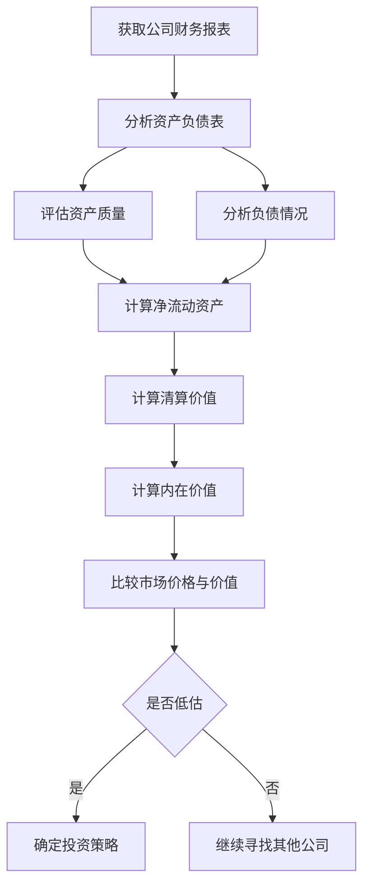

# 马丁·惠特曼的资产负债表套利方法

> 关键词：马丁·惠特曼、资产负债表套利、价值投资、财务分析、套利策略

> 摘要：本文深入探讨了马丁·惠特曼的资产负债表套利方法。首先介绍了该方法产生的背景及相关基本概念，接着详细阐述了其核心算法原理、数学模型与公式。通过实际项目案例，对该套利方法的具体实现步骤和代码进行解读分析。同时，探讨了该方法在实际金融市场中的应用场景，并推荐了相关的学习资源、开发工具框架以及论文著作。最后总结了该方法的未来发展趋势与挑战，还提供了常见问题的解答和扩展阅读参考资料，旨在为读者全面呈现资产负债表套利方法的全貌，助力读者理解和运用这一投资策略。

## 1. 背景介绍 
### 1.1 目的和范围
本文的目的在于全面深入地剖析马丁·惠特曼的资产负债表套利方法。该方法是一种独特的价值投资策略，在金融投资领域具有重要的理论和实践意义。通过对这一方法的研究，我们可以更好地理解如何从公司的资产负债表中挖掘投资机会，实现资产的增值。本文的范围涵盖了该方法的核心概念、算法原理、数学模型、实际应用案例等多个方面，旨在为投资者、金融分析师以及对价值投资感兴趣的人士提供一个系统、全面的学习和参考资料。

### 1.2 预期读者
本文的预期读者主要包括以下几类人群：
1. **投资者**：无论是个人投资者还是机构投资者，都可以从本文中学习到一种新的投资策略，提高投资决策的准确性和成功率。
2. **金融分析师**：帮助他们更好地理解公司的财务状况，从资产负债表中发现潜在的投资价值和风险，提升财务分析的能力。
3. **金融专业学生**：为他们提供一个深入学习价值投资理论和实践的案例，丰富其专业知识体系。
4. **对金融投资感兴趣的人士**：让他们对资产负债表套利方法有一个初步的了解，激发他们对金融投资领域的兴趣。

### 1.3 文档结构概述
本文将按照以下结构进行阐述：
1. **背景介绍**：介绍本文的目的、预期读者、文档结构概述以及相关术语表。
2. **核心概念与联系**：详细解释资产负债表套利方法的核心概念，包括其原理和架构，并通过文本示意图和 Mermaid 流程图进行直观展示。
3. **核心算法原理 & 具体操作步骤**：阐述该方法的核心算法原理，并使用 Python 源代码详细说明具体的操作步骤。
4. **数学模型和公式 & 详细讲解 & 举例说明**：介绍相关的数学模型和公式，并通过具体例子进行详细讲解。
5. **项目实战：代码实际案例和详细解释说明**：通过一个实际的项目案例，展示资产负债表套利方法的具体实现过程，包括开发环境搭建、源代码实现和代码解读。
6. **实际应用场景**：探讨该方法在实际金融市场中的应用场景。
7. **工具和资源推荐**：推荐相关的学习资源、开发工具框架以及论文著作。
8. **总结：未来发展趋势与挑战**：总结资产负债表套利方法的未来发展趋势和面临的挑战。
9. **附录：常见问题与解答**：解答读者在学习和应用该方法过程中可能遇到的常见问题。
10. **扩展阅读 & 参考资料**：提供相关的扩展阅读材料和参考资料，方便读者进一步深入学习。

### 1.4 术语表
#### 1.4.1 核心术语定义
1. **资产负债表套利**：通过对公司资产负债表的深入分析，发现资产价值被低估或负债被高估的情况，从而进行投资操作以获取利润的一种投资策略。
2. **价值投资**：一种基于公司内在价值进行投资的策略，投资者通过分析公司的财务状况、经营业绩等因素，寻找被市场低估的股票进行投资。
3. **净流动资产**：公司流动资产减去流动负债后的余额，反映了公司在短期内可变现的资产净值。
4. **清算价值**：公司在清算时，将其资产变现并偿还债务后剩余的价值。

#### 1.4.2 相关概念解释
1. **财务报表分析**：对公司的财务报表（包括资产负债表、利润表、现金流量表等）进行分析，以了解公司的财务状况、经营成果和现金流量情况。
2. **内在价值**：公司的真实价值，通常通过对公司未来现金流的折现计算得出。
3. **市场价格**：股票在证券市场上的交易价格，受到市场供求关系、投资者情绪等多种因素的影响。

#### 1.4.3 缩略词列表
1. **PB**：市净率（Price-to-Book Ratio），即股票价格与每股净资产的比率。
2. **PE**：市盈率（Price-to-Earnings Ratio），即股票价格与每股收益的比率。

## 2. 核心概念与联系 
### 核心概念原理
马丁·惠特曼的资产负债表套利方法基于价值投资的理念，核心思想是通过对公司资产负债表的细致分析，寻找那些资产价值被市场低估的公司。该方法认为，市场有时会因为各种原因（如短期业绩波动、行业负面消息等）而对公司的资产价值做出错误的定价，投资者可以通过深入研究资产负债表，发现这些被低估的机会，并进行投资。

具体来说，该方法关注以下几个方面：
1. **资产质量**：评估公司资产的真实性、流动性和盈利能力。例如，固定资产是否存在减值风险，存货是否存在积压等问题。
2. **负债情况**：分析公司的负债规模、负债结构和偿债能力。高负债可能会给公司带来较大的财务风险，而低负债则可能意味着公司的财务状况较为稳健。
3. **净流动资产**：净流动资产是衡量公司短期偿债能力和资产价值的重要指标。如果公司的净流动资产高于其市场价值，那么该公司可能被低估。
4. **清算价值**：考虑公司在清算时的价值，即如果公司停止经营，将其资产变现并偿还债务后剩余的价值。如果清算价值高于市场价值，那么该公司可能具有投资价值。

### 架构的文本示意图
```plaintext
资产负债表套利方法架构
|-- 财务报表分析
|   |-- 资产负债表
|   |   |-- 资产分析
|   |   |   |-- 流动资产
|   |   |   |   |-- 货币资金
|   |   |   |   |-- 应收账款
|   |   |   |   |-- 存货
|   |   |   |-- 非流动资产
|   |   |       |-- 固定资产
|   |   |       |-- 无形资产
|   |   |-- 负债分析
|   |       |-- 流动负债
|   |       |   |-- 短期借款
|   |       |   |-- 应付账款
|   |       |-- 非流动负债
|   |           |-- 长期借款
|   |           |-- 应付债券
|   |-- 利润表
|   |-- 现金流量表
|-- 价值评估
|   |-- 内在价值计算
|   |-- 清算价值计算
|-- 投资决策
|   |-- 比较市场价格与价值
|   |-- 确定投资策略
```

### Mermaid 流程图


## 3. 核心算法原理 & 具体操作步骤 
### 核心算法原理
资产负债表套利方法的核心算法原理主要围绕对公司资产和负债的评估以及价值的计算。具体来说，包括以下几个步骤：
1. **数据收集**：收集公司的财务报表，包括资产负债表、利润表和现金流量表。
2. **资产分析**：对公司的各项资产进行分析，评估其质量和价值。例如，对于存货，可以通过分析存货周转率来判断其是否存在积压问题；对于固定资产，可以考虑其折旧政策是否合理。
3. **负债分析**：分析公司的负债规模、负债结构和偿债能力。可以通过计算资产负债率、流动比率等指标来评估公司的负债状况。
4. **价值计算**：计算公司的净流动资产、清算价值和内在价值。净流动资产可以通过流动资产减去流动负债得到；清算价值可以通过对公司各项资产进行估算并扣除负债得到；内在价值可以通过对公司未来现金流的折现计算得出。
5. **比较与决策**：将计算得到的价值与公司的市场价格进行比较，如果价值高于市场价格，则认为该公司被低估，可以考虑进行投资。

### 具体操作步骤（Python 源代码）
```python
import pandas as pd

# 假设我们已经获取了公司的财务报表数据，并存储在 DataFrame 中
# 示例数据，实际应用中需要从真实数据源获取
balance_sheet = pd.DataFrame({
    '流动资产': [1000, 1200, 1500],
    '流动负债': [800, 900, 1000],
    '非流动资产': [2000, 2200, 2500],
    '非流动负债': [1500, 1600, 1800]
}, index=['Year 1', 'Year 2', 'Year 3'])

# 步骤 1: 计算净流动资产
balance_sheet['净流动资产'] = balance_sheet['流动资产'] - balance_sheet['流动负债']

# 步骤 2: 计算总资产和总负债
balance_sheet['总资产'] = balance_sheet['流动资产'] + balance_sheet['非流动资产']
balance_sheet['总负债'] = balance_sheet['流动负债'] + balance_sheet['非流动负债']

# 步骤 3: 计算清算价值（简单假设清算时资产按账面价值的 80% 变现）
balance_sheet['清算价值'] = balance_sheet['总资产'] * 0.8 - balance_sheet['总负债']

# 步骤 4: 假设我们已经获取了公司的市场价格数据（示例数据）
market_prices = pd.Series([1200, 1300, 1400], index=['Year 1', 'Year 2', 'Year 3'])

# 步骤 5: 比较清算价值和市场价格
balance_sheet['是否低估'] = balance_sheet['清算价值'] > market_prices

print(balance_sheet)
```
### 代码解释
1. **数据准备**：使用 `pandas` 库创建一个 `DataFrame` 来存储公司的资产负债表数据。
2. **计算净流动资产**：通过流动资产减去流动负债得到净流动资产。
3. **计算总资产和总负债**：将流动资产和非流动资产相加得到总资产，将流动负债和非流动负债相加得到总负债。
4. **计算清算价值**：假设清算时资产按账面价值的 80% 变现，用总资产乘以 0.8 再减去总负债得到清算价值。
5. **比较清算价值和市场价格**：创建一个 `Series` 来存储市场价格数据，然后比较清算价值和市场价格，判断公司是否被低估。

## 4. 数学模型和公式 & 详细讲解 & 举例说明 
### 数学模型和公式
1. **净流动资产（NCAV）**
$$NCAV = 流动资产 - 流动负债$$
净流动资产反映了公司在短期内可变现的资产净值。如果公司的净流动资产高于其市场价值，那么该公司可能被低估。

2. **资产负债率（Debt-to-Asset Ratio）**
$$资产负债率 = \frac{总负债}{总资产} \times 100\%$$
资产负债率衡量了公司的负债水平，反映了公司的财务风险。一般来说，资产负债率越低，公司的财务状况越稳健。

3. **流动比率（Current Ratio）**
$$流动比率 = \frac{流动资产}{流动负债}$$
流动比率衡量了公司的短期偿债能力。一般来说，流动比率大于 1 表示公司具有较好的短期偿债能力。

4. **清算价值（Liquidation Value）**
$$清算价值 = 资产变现价值 - 总负债$$
资产变现价值需要根据公司各项资产的实际情况进行估算，例如，存货可能需要打折变现，固定资产可能需要考虑折旧和市场需求等因素。

### 详细讲解
1. **净流动资产**：净流动资产是一个重要的指标，它可以帮助投资者判断公司的短期财务状况。如果公司的净流动资产为正，说明公司在短期内有足够的资产来偿还债务。如果净流动资产高于市场价值，那么投资者可以认为该公司的股票具有一定的安全边际。
2. **资产负债率**：资产负债率反映了公司的负债水平。高资产负债率意味着公司的财务风险较高，可能面临偿债压力。投资者在分析公司时，通常会比较同行业公司的资产负债率，以判断该公司的负债水平是否合理。
3. **流动比率**：流动比率衡量了公司的短期偿债能力。如果流动比率大于 1，说明公司的流动资产足以偿还流动负债。一般来说，流动比率越高，公司的短期偿债能力越强。但是，过高的流动比率也可能意味着公司的资产利用效率不高。
4. **清算价值**：清算价值是公司在清算时的价值。如果清算价值高于市场价值，那么投资者可以认为该公司的股票被低估。但是，计算清算价值需要对公司的各项资产进行准确的估算，这在实际操作中可能存在一定的难度。

### 举例说明
假设某公司的财务报表数据如下：
| 项目 | 金额（万元） |
| --- | --- |
| 流动资产 | 2000 |
| 流动负债 | 1500 |
| 非流动资产 | 3000 |
| 非流动负债 | 2000 |
| 市场价格 | 1800 |

1. **计算净流动资产**
$$NCAV = 2000 - 1500 = 500（万元）$$
2. **计算资产负债率**
$$总资产 = 2000 + 3000 = 5000（万元）$$
$$总负债 = 1500 + 2000 = 3500（万元）$$
$$资产负债率 = \frac{3500}{5000} \times 100\% = 70\%$$
3. **计算流动比率**
$$流动比率 = \frac{2000}{1500} \approx 1.33$$
4. **计算清算价值（假设资产变现价值为总资产的 80%）**
$$资产变现价值 = 5000 \times 0.8 = 4000（万元）$$
$$清算价值 = 4000 - 3500 = 500（万元）$$

由于清算价值（500 万元）低于市场价格（1800 万元），从这个角度来看，该公司的股票可能没有被低估。

## 5. 项目实战：代码实际案例和详细解释说明 
### 5.1  开发环境搭建
1. **安装 Python**：从 Python 官方网站（https://www.python.org/downloads/） 下载并安装 Python 3.x 版本。
2. **安装必要的库**：使用 `pip` 命令安装 `pandas`、`numpy` 等必要的库。
```bash
pip install pandas numpy
```
3. **选择开发工具**：可以选择 PyCharm、Jupyter Notebook 等开发工具。例如，安装 Jupyter Notebook：
```bash
pip install jupyter
```
启动 Jupyter Notebook：
```bash
jupyter notebook
```

### 5.2  源代码详细实现和代码解读
```python
import pandas as pd
import numpy as np

# 步骤 1: 读取财务报表数据（假设数据存储在 CSV 文件中）
balance_sheet_data = pd.read_csv('balance_sheet.csv')

# 步骤 2: 数据预处理
# 处理缺失值
balance_sheet_data = balance_sheet_data.fillna(0)

# 步骤 3: 计算关键指标
# 计算净流动资产
balance_sheet_data['净流动资产'] = balance_sheet_data['流动资产'] - balance_sheet_data['流动负债']

# 计算总资产和总负债
balance_sheet_data['总资产'] = balance_sheet_data['流动资产'] + balance_sheet_data['非流动资产']
balance_sheet_data['总负债'] = balance_sheet_data['流动负债'] + balance_sheet_data['非流动负债']

# 计算资产负债率
balance_sheet_data['资产负债率'] = balance_sheet_data['总负债'] / balance_sheet_data['总资产']

# 计算流动比率
balance_sheet_data['流动比率'] = balance_sheet_data['流动资产'] / balance_sheet_data['流动负债']

# 步骤 4: 计算清算价值（假设资产变现价值为总资产的 80%）
balance_sheet_data['清算价值'] = balance_sheet_data['总资产'] * 0.8 - balance_sheet_data['总负债']

# 步骤 5: 读取市场价格数据（假设数据存储在 CSV 文件中）
market_price_data = pd.read_csv('market_price.csv')

# 步骤 6: 合并数据
merged_data = pd.merge(balance_sheet_data, market_price_data, on='日期')

# 步骤 7: 判断是否低估
merged_data['是否低估'] = merged_data['清算价值'] > merged_data['市场价格']

# 步骤 8: 保存结果
merged_data.to_csv('result.csv', index=False)

print(merged_data)
```
### 代码解读
1. **读取数据**：使用 `pandas` 的 `read_csv` 函数读取财务报表数据和市场价格数据。
2. **数据预处理**：处理缺失值，将缺失值填充为 0。
3. **计算关键指标**：计算净流动资产、总资产、总负债、资产负债率、流动比率和清算价值。
4. **合并数据**：将财务报表数据和市场价格数据按日期进行合并。
5. **判断是否低估**：比较清算价值和市场价格，判断公司是否被低估。
6. **保存结果**：将计算结果保存到 CSV 文件中。

### 5.3  代码解读与分析
1. **数据处理**：通过数据预处理，确保数据的完整性和准确性。处理缺失值可以避免在计算过程中出现错误。
2. **指标计算**：通过计算关键指标，可以全面了解公司的财务状况。例如，净流动资产可以反映公司的短期偿债能力，资产负债率可以反映公司的财务风险。
3. **比较判断**：通过比较清算价值和市场价格，可以判断公司是否被低估。这是资产负债表套利方法的核心步骤之一。
4. **结果保存**：将计算结果保存到 CSV 文件中，方便后续分析和查看。

## 6. 实际应用场景 
### 股票投资
在股票投资中，资产负债表套利方法可以帮助投资者筛选出被低估的股票。投资者可以通过分析公司的资产负债表，计算其净流动资产、清算价值等指标，并与市场价格进行比较。如果发现某些股票的价值被低估，投资者可以考虑买入这些股票，等待市场价格回归其内在价值，从而获得投资收益。

### 并购重组
在并购重组过程中，资产负债表套利方法可以帮助收购方评估目标公司的价值。收购方可以通过分析目标公司的资产负债表，了解其资产质量、负债情况和清算价值等信息，从而确定合理的收购价格。同时，该方法也可以帮助目标公司发现自身的价值，在谈判中争取更有利的条件。

### 不良资产处置
在不良资产处置中，资产负债表套利方法可以帮助投资者评估不良资产的价值。投资者可以通过分析不良资产所属公司的资产负债表，了解其资产状况和负债情况，从而判断是否值得投资。如果发现不良资产的价值被低估，投资者可以通过收购、重组等方式实现资产的增值。

### 风险投资
在风险投资中，资产负债表套利方法可以帮助投资者评估创业公司的价值。虽然创业公司的财务状况可能不够稳定，但通过分析其资产负债表，投资者可以了解其资产结构、资金来源等信息，从而判断其潜在的投资价值。同时，该方法也可以帮助投资者识别创业公司的风险，制定合理的投资策略。

## 7. 工具和资源推荐
### 7.1 学习资源推荐
#### 7.1.1 书籍推荐
1. 《安全边际》（Margin of Safety）：作者是塞思·卡拉曼（Seth Klarman），这本书深入阐述了价值投资的理念和方法，对资产负债表套利方法也有相关的讨论。
2. 《聪明的投资者》（The Intelligent Investor）：作者是本杰明·格雷厄姆（Benjamin Graham），被誉为价值投资的经典之作，书中介绍了许多基于财务报表分析的投资策略。
3. 《财务报表分析与证券定价》（Financial Statement Analysis and Security Valuation）：作者是斯蒂芬·佩因曼（Stephen Penman），这本书系统地介绍了财务报表分析的方法和技术，以及如何运用这些方法进行证券定价。

#### 7.1.2 在线课程
1. Coursera 上的“Financial Markets”：由耶鲁大学教授罗伯特·席勒（Robert Shiller）授课，课程涵盖了金融市场的基本原理和投资策略，对资产负债表分析有一定的讲解。
2. edX 上的“Financial Accounting”：由哈佛商学院教授授课，课程主要介绍了财务会计的基本概念和方法，有助于学习者理解财务报表。

#### 7.1.3 技术博客和网站
1. Seeking Alpha（https://seekingalpha.com/）：一个提供金融市场分析和投资建议的网站，有许多关于价值投资和资产负债表分析的文章。
2. ValueWalk（https://www.valuewalk.com/）：专注于价值投资领域的博客，提供了丰富的投资研究和分析内容。

### 7.2 开发工具框架推荐
#### 7.2.1 IDE和编辑器
1. PyCharm：一款功能强大的 Python 集成开发环境，提供了代码编辑、调试、版本控制等多种功能，适合开发复杂的数据分析和投资策略程序。
2. Jupyter Notebook：一个交互式的开发环境，支持多种编程语言，适合进行数据探索和分析。

#### 7.2.2 调试和性能分析工具
1. pdb：Python 自带的调试工具，可以帮助开发者调试代码，定位问题。
2. cProfile：Python 的性能分析工具，可以帮助开发者分析代码的性能瓶颈，优化代码。

#### 7.2.3 相关框架和库
1. pandas：一个强大的数据处理和分析库，提供了丰富的数据结构和函数，适合处理财务报表数据。
2. numpy：一个用于科学计算的库，提供了高效的数组操作和数学函数，在数据分析和计算中经常使用。

### 7.3 相关论文著作推荐
#### 7.3.1 经典论文
1. “The Interpretation of Financial Statements” by Benjamin Graham and Spencer B. Meredith：这篇论文是本杰明·格雷厄姆关于财务报表分析的经典之作，对资产负债表的分析方法有深入的探讨。
2. “Value Investing: The Use of Historical Financial Statement Information to Separate Winners from Losers” by Joseph D. Piotroski：该论文提出了一种基于财务报表信息的价值投资策略，对资产负债表套利方法有一定的参考价值。

#### 7.3.2 最新研究成果
可以关注《Journal of Financial Economics》、《Review of Financial Studies》等金融领域的顶级学术期刊，获取关于资产负债表分析和价值投资的最新研究成果。

#### 7.3.3 应用案例分析
一些投资机构和学者会发布关于资产负债表套利方法的应用案例分析，可以通过搜索相关的研究报告和学术论文获取这些案例，学习实际应用中的经验和技巧。

## 8. 总结：未来发展趋势与挑战
### 未来发展趋势
1. **数字化和智能化**：随着信息技术的不断发展，资产负债表套利方法将越来越多地借助数字化和智能化工具进行分析。例如，利用大数据分析技术可以更全面地收集和处理公司的财务数据，利用人工智能算法可以更准确地评估公司的价值。
2. **跨学科融合**：资产负债表套利方法将与其他学科（如经济学、管理学、统计学等）进行更深入的融合。例如，结合经济学理论可以更好地理解市场的运行机制，结合管理学知识可以更好地评估公司的管理水平和战略规划。
3. **国际化发展**：随着全球经济一体化的不断推进，资产负债表套利方法将在国际金融市场中得到更广泛的应用。投资者可以通过分析不同国家和地区的公司资产负债表，寻找全球范围内的投资机会。

### 挑战
1. **数据质量和可靠性**：资产负债表套利方法依赖于准确、可靠的财务数据。然而，在实际应用中，财务数据可能存在造假、失真等问题，这给投资者的分析和决策带来了困难。
2. **市场有效性**：市场的有效性是资产负债表套利方法面临的一个重要挑战。如果市场是完全有效的，那么公司的市场价格将反映其内在价值，投资者很难通过分析资产负债表找到被低估的股票。然而，实际市场往往存在一定的无效性，但这种无效性的程度和持续时间是不确定的。
3. **复杂的财务报表**：现代公司的财务报表越来越复杂，包含了大量的会计政策和估计。投资者需要具备较高的财务分析能力和专业知识，才能准确理解和分析财务报表。
4. **竞争压力**：随着资产负债表套利方法的普及，越来越多的投资者开始关注和使用这一方法，市场竞争也越来越激烈。这可能导致被低估的股票越来越难以找到，投资机会逐渐减少。

## 9. 附录：常见问题与解答
### 1. 资产负债表套利方法适用于所有公司吗？
不是。资产负债表套利方法更适用于那些资产价值相对稳定、财务状况较为透明的公司。对于一些高科技公司、创新型公司等，由于其资产主要以无形资产（如技术、专利等）为主，资产价值难以准确评估，该方法的适用性可能会受到限制。

### 2. 如何判断财务数据的真实性和可靠性？
可以从以下几个方面进行判断：
1. **审计报告**：查看公司的审计报告，审计意见可以反映财务数据的可靠性。
2. **行业比较**：将公司的财务数据与同行业其他公司进行比较，如果存在明显异常，可能需要进一步调查。
3. **财务指标分析**：分析公司的财务指标，如资产负债率、流动比率等，如果指标出现异常波动，可能存在财务数据造假的风险。

### 3. 资产负债表套利方法的投资周期一般是多久？
投资周期没有固定的标准，取决于市场情况和公司的实际情况。一般来说，资产负债表套利方法是一种长期投资策略，投资者需要耐心等待市场价格回归公司的内在价值。投资周期可能从几个月到几年不等。

### 4. 如何处理资产负债表中的无形资产？
无形资产的评估相对较为复杂，需要根据具体情况进行处理。对于一些具有明确价值和市场需求的无形资产（如专利、商标等），可以参考市场交易价格或专业评估机构的评估结果进行估值。对于一些难以量化的无形资产（如品牌价值、企业文化等），可以在分析时综合考虑其对公司未来发展的影响。

## 10. 扩展阅读 & 参考资料
### 扩展阅读
1. 《巴菲特致股东的信》（Letters to Shareholders of Berkshire Hathaway）：巴菲特的投资理念和方法对资产负债表套利方法有一定的启发，可以深入了解巴菲特的投资思想。
2. 《金融炼金术》（The Alchemy of Finance）：作者是乔治·索罗斯（George Soros），书中介绍了索罗斯的投资哲学和方法，对投资者的思维方式有一定的启发。

### 参考资料
1. 公司的财务报表和年报：可以从公司的官方网站、证券交易所网站等渠道获取。
2. 金融数据库：如 Bloomberg、Wind 等，提供了丰富的金融数据和分析工具。
3. 学术期刊和研究报告：可以从图书馆、学术数据库等渠道获取相关的学术期刊和研究报告。

作者：AI天才研究院/AI Genius Institute & 禅与计算机程序设计艺术 /Zen And The Art of Computer Programming