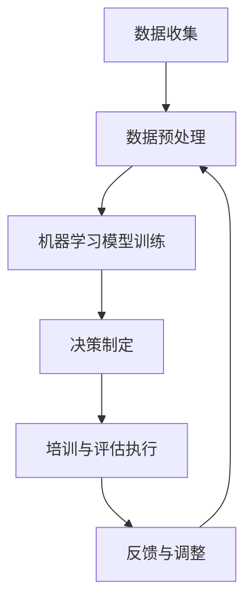

# AI Agent在企业培训与技能评估中的创新应用

> 关键词：AI Agent、企业培训、技能评估、创新应用、智能学习、人才发展

> 摘要：本文聚焦于AI Agent在企业培训与技能评估领域的创新应用。随着人工智能技术的飞速发展，AI Agent凭借其智能化、个性化等特点，为企业的人才培养和评估带来了全新的机遇和变革。文章首先介绍了相关背景知识，包括目的、预期读者等内容；接着阐述了AI Agent的核心概念与联系，通过示意图和流程图展示其原理和架构；详细讲解了核心算法原理及具体操作步骤，并用Python代码进行阐述；探讨了相关数学模型和公式；结合项目实战给出代码案例及详细解释；分析了AI Agent在企业培训与技能评估中的实际应用场景；推荐了学习资源、开发工具框架以及相关论文著作；最后总结了未来发展趋势与挑战，并对常见问题进行了解答，还提供了扩展阅读和参考资料，旨在全面深入地探讨AI Agent在企业培训与技能评估中的创新应用，为企业和相关从业者提供有价值的参考。

## 1. 背景介绍 
### 1.1 目的和范围
在当今竞争激烈的商业环境中，企业的持续发展离不开高素质的人才队伍。企业培训与技能评估是提升员工能力、确保企业竞争力的关键环节。传统的企业培训和技能评估方式存在效率低、缺乏个性化、评估标准不够精准等问题。本文章的目的在于探讨AI Agent如何在企业培训与技能评估中实现创新应用，以解决传统方式存在的不足。范围涵盖了AI Agent的基本原理、在企业培训与技能评估中的具体应用场景、相关算法和技术实现，以及对未来发展趋势的展望等方面。

### 1.2 预期读者
本文的预期读者包括企业人力资源管理者、培训与发展专家、人工智能技术开发者、教育科技领域的从业者以及对企业培训与技能评估创新应用感兴趣的研究人员和学者。

### 1.3 文档结构概述
本文将按照以下结构展开：首先介绍背景知识，包括目的、预期读者和文档结构概述等内容；然后阐述AI Agent的核心概念与联系，通过文本示意图和Mermaid流程图展示其原理和架构；详细讲解核心算法原理及具体操作步骤，并用Python代码进行阐述；探讨相关数学模型和公式；结合项目实战给出代码案例及详细解释；分析AI Agent在企业培训与技能评估中的实际应用场景；推荐学习资源、开发工具框架以及相关论文著作；最后总结未来发展趋势与挑战，解答常见问题，并提供扩展阅读和参考资料。

### 1.4 术语表
#### 1.4.1 核心术语定义
- **AI Agent（人工智能代理）**：是一种能够感知环境、进行决策并采取行动以实现特定目标的智能实体。它可以基于人工智能技术，如机器学习、自然语言处理等，模拟人类的智能行为。
- **企业培训**：企业为了提高员工的知识、技能和工作绩效，对员工进行的有计划、有组织的培养和训练活动。
- **技能评估**：对员工所具备的知识、技能和能力进行测量和评价的过程，以确定员工的能力水平和发展潜力。

#### 1.4.2 相关概念解释
- **机器学习**：是一门多领域交叉学科，涉及概率论、统计学、逼近论、凸分析、算法复杂度理论等多门学科。它专门研究计算机怎样模拟或实现人类的学习行为，以获取新的知识或技能，重新组织已有的知识结构使之不断改善自身的性能。
- **自然语言处理**：是计算机科学领域与人工智能领域中的一个重要方向。它研究能实现人与计算机之间用自然语言进行有效通信的各种理论和方法，包括自然语言理解和自然语言生成等方面。

#### 1.4.3 缩略词列表
- **ML（Machine Learning）**：机器学习
- **NLP（Natural Language Processing）**：自然语言处理

## 2. 核心概念与联系 

### 核心概念原理
AI Agent在企业培训与技能评估中的应用基于其智能化和自适应的特点。AI Agent可以通过感知员工的学习行为、知识掌握情况等信息，利用机器学习算法对这些数据进行分析和处理，从而为员工提供个性化的培训方案和精准的技能评估。

AI Agent的核心原理包括以下几个方面：
- **感知**：通过各种传感器或接口收集员工的学习数据，如学习时间、答题正确率、操作记录等。
- **决策**：基于感知到的数据，利用机器学习模型进行分析和推理，制定出适合员工的培训计划和评估策略。
- **行动**：根据决策结果，向员工提供个性化的学习资源、指导和反馈，或者进行技能评估和评价。

### 架构的文本示意图
AI Agent在企业培训与技能评估中的架构可以分为以下几个层次：
- **数据层**：负责收集和存储员工的学习数据，包括学习记录、测试成绩、操作日志等。
- **算法层**：利用机器学习、自然语言处理等算法对数据层的数据进行分析和处理，提取有价值的信息。
- **决策层**：根据算法层的分析结果，制定培训计划和评估策略。
- **应用层**：将决策层的结果应用到实际的培训和评估中，向员工提供个性化的学习资源和反馈。

### Mermaid流程图


这个流程图展示了AI Agent在企业培训与技能评估中的工作流程。首先，通过各种方式收集员工的学习数据，然后对数据进行预处理，包括清洗、转换等操作。接着，利用预处理后的数据训练机器学习模型，根据模型的结果制定决策，包括培训计划和评估策略。最后，执行培训和评估，并根据反馈结果对整个流程进行调整和优化。

## 3. 核心算法原理 & 具体操作步骤 

### 核心算法原理
在AI Agent的应用中，常用的核心算法包括机器学习算法和自然语言处理算法。

#### 机器学习算法
- **决策树算法**：决策树是一种基于树结构进行决策的算法。在企业培训与技能评估中，可以根据员工的学习数据构建决策树，根据决策树的分支进行分类和预测。例如，根据员工的答题正确率、学习时间等特征，预测员工是否需要加强某方面的培训。
- **神经网络算法**：神经网络是一种模仿人类神经系统的算法，具有强大的非线性映射能力。在企业培训与技能评估中，可以利用神经网络对员工的学习数据进行建模，预测员工的学习效果和发展潜力。

#### 自然语言处理算法
- **文本分类算法**：可以对员工的学习反馈、评价等文本数据进行分类，例如将反馈分为满意、不满意、建议等类别，以便更好地了解员工的需求和意见。
- **情感分析算法**：可以分析员工的文本数据中的情感倾向，例如积极、消极、中性等，从而更好地了解员工的情绪状态。

### 具体操作步骤

#### 数据收集
- 收集员工的学习记录，包括学习时间、学习内容、答题正确率等。
- 收集员工的操作日志，包括在培训系统中的操作行为、错误记录等。
- 收集员工的反馈和评价，包括文本反馈和问卷调查结果。

#### 数据预处理
- 清洗数据，去除噪声和异常值。
- 对数据进行标准化处理，将不同类型的数据统一到相同的尺度上。
- 对文本数据进行分词、词性标注等处理。

#### 模型训练
- 选择合适的机器学习和自然语言处理算法。
- 将预处理后的数据分为训练集和测试集。
- 使用训练集对模型进行训练，调整模型的参数，以提高模型的性能。

#### 决策制定
- 根据训练好的模型，对员工的学习数据进行分析和预测。
- 根据分析和预测结果，制定个性化的培训计划和评估策略。

#### 培训与评估执行
- 根据制定的培训计划，向员工提供个性化的学习资源和指导。
- 根据评估策略，对员工进行技能评估和评价。

#### 反馈与调整
- 收集员工的反馈和评价，了解培训和评估的效果。
- 根据反馈结果，对模型和决策进行调整和优化。

### Python源代码详细阐述

```python
# 示例：使用决策树算法进行员工培训需求预测

import pandas as pd
from sklearn.model_selection import train_test_split
from sklearn.tree import DecisionTreeClassifier
from sklearn.metrics import accuracy_score

# 数据收集和预处理
data = pd.read_csv('employee_learning_data.csv')  # 假设数据存储在CSV文件中
X = data.drop('training_need', axis=1)  # 特征数据
y = data['training_need']  # 标签数据

# 划分训练集和测试集
X_train, X_test, y_train, y_test = train_test_split(X, y, test_size=0.2, random_state=42)

# 模型训练
model = DecisionTreeClassifier()
model.fit(X_train, y_train)

# 模型预测
y_pred = model.predict(X_test)

# 模型评估
accuracy = accuracy_score(y_test, y_pred)
print(f"模型准确率: {accuracy}")

# 根据预测结果制定培训计划
for i in range(len(y_pred)):
    if y_pred[i] == 1:
        print(f"员工 {i} 需要加强培训")
    else:
        print(f"员工 {i} 目前不需要额外培训")
```

这段代码首先读取员工的学习数据，然后将数据分为特征数据和标签数据。接着，将数据划分为训练集和测试集，使用决策树算法对模型进行训练。训练完成后，使用测试集对模型进行预测，并计算模型的准确率。最后，根据预测结果为员工制定培训计划。

## 4. 数学模型和公式 & 详细讲解 & 举例说明 

### 决策树算法的数学模型和公式
决策树算法的核心是选择最优的特征进行划分，常用的划分准则有信息增益、信息增益比和基尼指数等。

#### 信息增益
信息增益是指划分前后信息熵的变化量。信息熵是衡量数据不确定性的指标，其计算公式为：
$$H(X)=-\sum_{i=1}^{n}p(x_i)\log_2p(x_i)$$
其中，$X$ 是一个随机变量，$p(x_i)$ 是 $X$ 取值为 $x_i$ 的概率。

信息增益的计算公式为：
$$IG(D,A)=H(D)-H(D|A)$$
其中，$D$ 是数据集，$A$ 是特征，$H(D)$ 是数据集 $D$ 的信息熵，$H(D|A)$ 是在特征 $A$ 条件下数据集 $D$ 的条件熵。

#### 举例说明
假设有一个数据集 $D$ 包含 10 个样本，其中 6 个样本的标签为正类，4 个样本的标签为负类。则数据集 $D$ 的信息熵为：
$$H(D)=-\frac{6}{10}\log_2\frac{6}{10}-\frac{4}{10}\log_2\frac{4}{10}\approx0.971$$

假设有一个特征 $A$，将数据集 $D$ 划分为两个子集 $D_1$ 和 $D_2$，其中 $D_1$ 包含 4 个样本，3 个正类，1 个负类；$D_2$ 包含 6 个样本，3 个正类，3 个负类。则在特征 $A$ 条件下数据集 $D$ 的条件熵为：
$$H(D|A)=\frac{4}{10}(-\frac{3}{4}\log_2\frac{3}{4}-\frac{1}{4}\log_2\frac{1}{4})+\frac{6}{10}(-\frac{3}{6}\log_2\frac{3}{6}-\frac{3}{6}\log_2\frac{3}{6})\approx0.811$$

信息增益为：
$$IG(D,A)=H(D)-H(D|A)\approx0.971 - 0.811 = 0.16$$

### 神经网络算法的数学模型和公式
神经网络由输入层、隐藏层和输出层组成，神经元之间通过权重连接。神经元的输出可以表示为：
$$y = f(\sum_{i=1}^{n}w_ix_i + b)$$
其中，$x_i$ 是输入信号，$w_i$ 是权重，$b$ 是偏置，$f$ 是激活函数。

常用的激活函数有 sigmoid 函数、ReLU 函数等。

#### sigmoid 函数
$$\sigma(x)=\frac{1}{1 + e^{-x}}$$

#### ReLU 函数
$$f(x)=\max(0,x)$$

#### 举例说明
假设有一个简单的神经网络，输入层有 2 个神经元，隐藏层有 3 个神经元，输出层有 1 个神经元。输入信号为 $x_1 = 0.5$，$x_2 = 0.3$，隐藏层的权重和偏置分别为：
$$W_1=\begin{bmatrix}0.2 & 0.4\\0.3 & 0.5\\0.1 & 0.6\end{bmatrix}, b_1=\begin{bmatrix}0.1\\0.2\\0.3\end{bmatrix}$$
输出层的权重和偏置分别为：
$$W_2=\begin{bmatrix}0.7\\0.8\\0.9\end{bmatrix}, b_2 = 0.4$$

首先计算隐藏层的输入：
$$z_1 = W_1\begin{bmatrix}x_1\\x_2\end{bmatrix}+b_1=\begin{bmatrix}0.2\times0.5 + 0.4\times0.3 + 0.1\\0.3\times0.5 + 0.5\times0.3 + 0.2\\0.1\times0.5 + 0.6\times0.3 + 0.3\end{bmatrix}=\begin{bmatrix}0.32\\0.5\\0.53\end{bmatrix}$$

假设使用 sigmoid 激活函数，则隐藏层的输出为：
$$a_1 = \sigma(z_1)=\begin{bmatrix}\frac{1}{1 + e^{-0.32}}\\\frac{1}{1 + e^{-0.5}}\\\frac{1}{1 + e^{-0.53}}\end{bmatrix}\approx\begin{bmatrix}0.579\\0.622\\0.629\end{bmatrix}$$

然后计算输出层的输入：
$$z_2 = W_2^Ta_1 + b_2 = 0.7\times0.579 + 0.8\times0.622 + 0.9\times0.629 + 0.4\approx1.53$$

输出层的输出为：
$$y = \sigma(z_2)=\frac{1}{1 + e^{-1.53}}\approx0.82$$

## 5. 项目实战：代码实际案例和详细解释说明 

### 5.1  开发环境搭建
#### 操作系统
可以选择 Windows、Linux 或 macOS 等常见的操作系统。

#### 编程语言和库
- **Python**：选择 Python 3.x 版本。
- **机器学习库**：安装 `scikit-learn`、`tensorflow` 或 `pytorch` 等机器学习库。
- **数据处理库**：安装 `pandas`、`numpy` 等数据处理库。
- **可视化库**：安装 `matplotlib`、`seaborn` 等可视化库。

#### 开发工具
可以选择 PyCharm、Jupyter Notebook 等开发工具。

### 5.2  源代码详细实现和代码解读
以下是一个使用 `tensorflow` 实现的简单神经网络模型，用于员工技能评估的示例代码：

```python
import tensorflow as tf
from tensorflow.keras.models import Sequential
from tensorflow.keras.layers import Dense
import numpy as np
import pandas as pd
from sklearn.model_selection import train_test_split
from sklearn.preprocessing import StandardScaler

# 数据收集和预处理
data = pd.read_csv('employee_skill_data.csv')  # 假设数据存储在CSV文件中
X = data.drop('skill_level', axis=1).values
y = data['skill_level'].values

# 数据标准化
scaler = StandardScaler()
X = scaler.fit_transform(X)

# 划分训练集和测试集
X_train, X_test, y_train, y_test = train_test_split(X, y, test_size=0.2, random_state=42)

# 构建神经网络模型
model = Sequential([
    Dense(64, activation='relu', input_shape=(X_train.shape[1],)),
    Dense(32, activation='relu'),
    Dense(1, activation='sigmoid')
])

# 编译模型
model.compile(optimizer='adam', loss='binary_crossentropy', metrics=['accuracy'])

# 训练模型
model.fit(X_train, y_train, epochs=50, batch_size=32, validation_data=(X_test, y_test))

# 模型评估
test_loss, test_acc = model.evaluate(X_test, y_test)
print(f"测试集损失: {test_loss}, 测试集准确率: {test_acc}")

# 预测新数据
new_data = np.array([[0.5, 0.3, 0.2, 0.4]])  # 假设新数据
new_data = scaler.transform(new_data)
prediction = model.predict(new_data)
print(f"预测结果: {prediction}")
```

### 5.3  代码解读与分析
- **数据收集和预处理**：首先读取员工的技能数据，将特征数据和标签数据分离。然后使用 `StandardScaler` 对特征数据进行标准化处理，将数据的均值变为 0，标准差变为 1，以提高模型的训练效果。
- **划分训练集和测试集**：使用 `train_test_split` 函数将数据划分为训练集和测试集，测试集占总数据的 20%。
- **构建神经网络模型**：使用 `Sequential` 模型构建一个简单的神经网络，包含一个输入层、两个隐藏层和一个输出层。输入层的神经元数量根据特征数据的维度确定，隐藏层使用 ReLU 激活函数，输出层使用 sigmoid 激活函数，用于二分类问题。
- **编译模型**：使用 `adam` 优化器和 `binary_crossentropy` 损失函数编译模型，并设置评估指标为准确率。
- **训练模型**：使用 `fit` 函数对模型进行训练，设置训练的轮数为 50，批次大小为 32，并使用测试集进行验证。
- **模型评估**：使用 `evaluate` 函数对模型在测试集上的性能进行评估，输出测试集的损失和准确率。
- **预测新数据**：对新的员工技能数据进行预测，首先对新数据进行标准化处理，然后使用训练好的模型进行预测，输出预测结果。

## 6. 实际应用场景 
### 个性化培训
AI Agent可以根据员工的学习能力、知识水平和职业发展目标，为员工提供个性化的培训方案。例如，对于一个销售团队的员工，AI Agent可以根据其销售业绩、客户反馈等数据，分析其在销售技巧、产品知识等方面的优势和不足，然后为其推荐针对性的培训课程和学习资源，如线上视频课程、线下培训讲座等。

### 实时学习支持
在员工学习过程中，AI Agent可以实时提供帮助和支持。当员工遇到问题时，AI Agent可以通过自然语言处理技术理解员工的问题，并提供相应的解答和指导。例如，在员工进行在线课程学习时，AI Agent可以实时监测员工的学习进度和遇到的困难，及时提供提示和建议，帮助员工更好地理解和掌握知识。

### 动态技能评估
AI Agent可以对员工的技能进行动态评估，实时跟踪员工的技能提升情况。通过收集员工在工作中的表现数据，如项目完成情况、工作成果等，AI Agent可以使用机器学习算法对员工的技能水平进行评估和预测。例如，在一个软件开发项目中，AI Agent可以根据开发人员的代码质量、开发效率等数据，实时评估其编程技能水平，并根据评估结果为其提供进一步的培训和发展建议。

### 人才选拔和招聘
在企业的人才选拔和招聘过程中，AI Agent可以帮助企业更准确地评估候选人的技能和能力。通过分析候选人的简历、面试表现等数据，AI Agent可以使用自然语言处理和机器学习算法对候选人的技能水平、职业素养等进行评估和预测，为企业提供更科学的招聘决策依据。例如，AI Agent可以对候选人的简历进行关键词提取和分析，评估其与岗位要求的匹配度，提高招聘效率和准确性。

### 培训效果评估
AI Agent可以对企业培训的效果进行评估，帮助企业了解培训的成效和存在的问题。通过收集员工在培训前后的知识掌握情况、工作绩效等数据，AI Agent可以使用统计分析和机器学习算法对培训效果进行评估和分析，为企业优化培训方案提供参考。例如，AI Agent可以分析员工在培训后的考试成绩、工作表现等数据，评估培训对员工技能提升和工作绩效的影响，从而确定培训的有效性和改进方向。

## 7. 工具和资源推荐
### 7.1 学习资源推荐
#### 7.1.1 书籍推荐
- 《机器学习》（周志华著）：这本书全面介绍了机器学习的基本概念、算法和应用，是机器学习领域的经典教材。
- 《深度学习》（Ian Goodfellow、Yoshua Bengio 和 Aaron Courville 著）：该书系统地介绍了深度学习的理论和实践，是深度学习领域的权威著作。
- 《自然语言处理入门》（何晗著）：本书适合初学者，详细介绍了自然语言处理的基本概念、算法和应用。

#### 7.1.2 在线课程
- Coursera 上的《机器学习》课程（Andrew Ng 教授主讲）：该课程是机器学习领域的经典在线课程，讲解深入浅出，适合初学者。
- edX 上的《深度学习》课程：由知名高校和企业的专家授课，内容丰富，涵盖了深度学习的各个方面。
- 网易云课堂上的《自然语言处理实战》课程：通过实际案例讲解自然语言处理的应用，具有很强的实践性。

#### 7.1.3 技术博客和网站
- 机器之心：提供人工智能领域的最新技术动态、研究成果和应用案例。
- 知乎：有很多关于人工智能的讨论和分享，可以学习到不同的观点和经验。
- GitHub：可以找到很多开源的人工智能项目和代码，学习他人的优秀代码和实现思路。

### 7.2 开发工具框架推荐
#### 7.2.1 IDE和编辑器
- PyCharm：是一款专门为 Python 开发设计的集成开发环境，具有强大的代码编辑、调试和自动完成等功能。
- Jupyter Notebook：是一个交互式的开发环境，适合进行数据分析和机器学习实验，方便代码的编写、运行和展示。
- Visual Studio Code：是一款轻量级的代码编辑器，支持多种编程语言，具有丰富的插件和扩展功能。

#### 7.2.2 调试和性能分析工具
- TensorBoard：是 TensorFlow 提供的可视化工具，可以帮助用户可视化模型的训练过程、性能指标等信息。
- PyTorch Profiler：是 PyTorch 提供的性能分析工具，可以帮助用户分析模型的性能瓶颈，优化代码。
- cProfile：是 Python 内置的性能分析工具，可以帮助用户分析代码的运行时间和函数调用情况。

#### 7.2.3 相关框架和库
- Scikit-learn：是一个简单易用的机器学习库，提供了各种机器学习算法和工具，适合初学者和快速开发。
- TensorFlow：是一个开源的深度学习框架，由 Google 开发，具有强大的计算能力和广泛的应用。
- PyTorch：是一个开源的深度学习框架，由 Facebook 开发，具有动态图的特点，适合研究和开发。

### 7.3 相关论文著作推荐
#### 7.3.1 经典论文
- “Gradient-Based Learning Applied to Document Recognition”（Yann LeCun、Léon Bottou、Yoshua Bengio 和 Patrick Haffner 著）：该论文介绍了卷积神经网络（CNN）在手写数字识别中的应用，是深度学习领域的经典论文。
- “Attention Is All You Need”（Ashish Vaswani 等人著）：该论文提出了 Transformer 模型，是自然语言处理领域的重要突破。
- “A Unified Approach to Interpreting Model Predictions”（Scott Lundberg 和 Su-In Lee 著）：该论文提出了 SHAP 值，用于解释机器学习模型的预测结果。

#### 7.3.2 最新研究成果
- 关注顶级学术会议，如 NeurIPS、ICML、ACL 等，这些会议上发表的论文代表了人工智能领域的最新研究成果。
- 关注知名学术期刊，如 Journal of Artificial Intelligence Research、Artificial Intelligence 等，这些期刊上发表的论文具有较高的学术水平。

#### 7.3.3 应用案例分析
- 《人工智能案例集》：收集了人工智能在各个领域的应用案例，包括医疗、金融、交通等，具有很强的参考价值。
- 各大企业的技术博客，如 Google AI Blog、Facebook AI Research 等，会分享企业在人工智能领域的应用案例和技术经验。

## 8. 总结：未来发展趋势与挑战
### 未来发展趋势
- **更加智能化和个性化**：AI Agent将不断提升其智能化水平，能够更深入地理解员工的需求和特点，提供更加个性化的培训和评估服务。例如，根据员工的情绪状态、学习风格等因素，动态调整培训方案和学习资源。
- **与虚拟现实和增强现实技术结合**：未来，AI Agent可能会与虚拟现实（VR）和增强现实（AR）技术相结合，为员工提供更加沉浸式的培训体验。例如，在虚拟环境中进行模拟训练，让员工更加真实地感受工作场景和任务。
- **跨企业和跨行业的应用**：随着人工智能技术的发展，AI Agent可能会在跨企业和跨行业之间得到更广泛的应用。例如，建立一个共享的培训和评估平台，不同企业的员工可以在平台上进行学习和交流，提高整个行业的人才素质。
- **与其他技术的融合**：AI Agent将与大数据、物联网、区块链等技术融合，实现更加全面和深入的应用。例如，通过物联网设备收集员工的工作数据，结合大数据分析和区块链的可信性，为员工提供更准确的技能评估和培训建议。

### 挑战
- **数据隐私和安全问题**：AI Agent的应用需要收集和处理大量的员工数据，这涉及到数据隐私和安全问题。企业需要采取有效的措施保护员工的数据安全，防止数据泄露和滥用。
- **技术的可解释性**：人工智能模型往往具有较高的复杂性，其决策过程难以理解和解释。在企业培训与技能评估中，需要确保AI Agent的决策具有可解释性，以便员工和管理者能够理解和信任其结果。
- **员工的接受度**：一些员工可能对AI Agent的应用存在疑虑和抵触情绪，担心自己的工作被取代或受到不公平的评估。企业需要加强对员工的宣传和培训，提高员工对AI Agent的接受度和认可度。
- **技术更新换代快**：人工智能技术发展迅速，新的算法和模型不断涌现。企业需要不断投入资源进行技术更新和升级，以确保AI Agent的性能和应用效果。

## 9. 附录：常见问题与解答
### 1. AI Agent在企业培训与技能评估中的应用是否会取代人力资源管理者？
不会。AI Agent在企业培训与技能评估中可以提供辅助和支持，但不能完全取代人力资源管理者。人力资源管理者具有丰富的经验和判断力，能够处理复杂的人际关系和情感问题，而这些是AI Agent目前难以做到的。AI Agent可以帮助人力资源管理者提高工作效率和准确性，但最终的决策和管理仍需要人力资源管理者来完成。

### 2. AI Agent的应用需要企业具备哪些条件？
企业需要具备一定的技术基础和数据资源。首先，企业需要有足够的计算资源来支持AI Agent的运行，包括服务器、存储设备等。其次，企业需要收集和整理员工的相关数据，如学习记录、工作绩效等，以便AI Agent进行分析和处理。此外，企业还需要有专业的技术人员来进行AI Agent的开发、维护和管理。

### 3. 如何确保AI Agent的评估结果公平公正？
为了确保AI Agent的评估结果公平公正，需要从多个方面进行考虑。首先，在数据收集阶段，要确保数据的准确性和完整性，避免数据偏差。其次，在模型训练阶段，要选择合适的算法和参数，进行充分的验证和测试，确保模型的性能和稳定性。此外，还可以引入人工审核和监督机制，对AI Agent的评估结果进行审核和调整，以确保结果的公平公正。

### 4. AI Agent的应用成本高吗？
AI Agent的应用成本因企业的具体需求和规模而异。一般来说，AI Agent的开发和部署需要一定的技术和资金投入，包括硬件设备、软件开发、人员培训等方面。但是，随着人工智能技术的发展和普及，相关的成本也在逐渐降低。此外，AI Agent的应用可以提高企业的培训效率和员工的工作绩效，从长远来看，可以为企业带来更大的收益。

## 10. 扩展阅读 & 参考资料
### 扩展阅读
- 《人工智能时代的人力资源管理》：深入探讨了人工智能技术在人力资源管理领域的应用和发展趋势。
- 《智能时代：大数据与智能革命重新定义未来》：介绍了大数据和人工智能技术对社会和经济的影响。
- 《未来简史：从智人到神人》：探讨了人类在未来科技发展下的进化和发展方向。

### 参考资料
- 相关的学术论文和研究报告，如 IEEE Transactions on Neural Networks and Learning Systems、ACM Transactions on Intelligent Systems and Technology 等期刊上的论文。
- 人工智能领域的专业书籍和教材，如《人工智能：一种现代的方法》《Python 机器学习》等。
- 各大企业和机构发布的技术文档和白皮书，如 Google、Microsoft、IBM 等公司的相关资料。