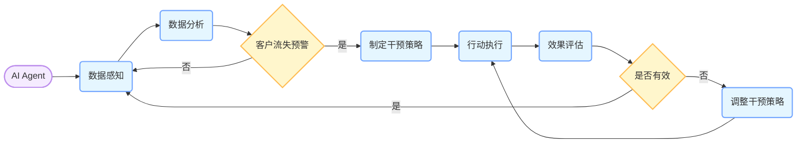

# AI Agent在企业客户流失预警与干预策略制定中的应用

> 关键词：AI Agent、客户流失预警、干预策略、企业应用、人工智能

> 摘要：本文聚焦于AI Agent在企业客户流失预警与干预策略制定中的应用。首先介绍相关背景，包括目的、预期读者等内容。接着阐述AI Agent及客户流失预警等核心概念与联系，深入剖析其原理和架构。详细讲解核心算法原理并给出Python代码示例，同时介绍相关数学模型和公式。通过项目实战展示代码实现与解读，探讨实际应用场景。推荐相关工具和资源，最后总结未来发展趋势与挑战，解答常见问题并提供扩展阅读与参考资料，旨在全面呈现AI Agent在企业客户管理中的重要作用和应用方法。

## 1. 背景介绍 
### 1.1 目的和范围
在当今竞争激烈的商业环境中，客户是企业生存和发展的关键资源。客户流失不仅意味着企业失去了现有的收入来源，还可能影响企业的声誉和市场份额。因此，企业迫切需要有效的方法来预测客户流失并及时采取干预措施。本文章的目的在于探讨AI Agent在企业客户流失预警与干预策略制定中的应用，为企业提供一种基于人工智能技术的解决方案。

范围涵盖了AI Agent的基本概念、客户流失预警的原理和方法、干预策略的制定原则，以及如何将这些技术应用到实际的企业客户管理中。同时，通过项目实战和具体案例分析，展示AI Agent在客户流失预警与干预中的实际效果和应用价值。

### 1.2 预期读者
本文的预期读者包括企业管理人员、市场营销人员、客户关系管理专员、数据分析师以及对人工智能技术在企业应用感兴趣的技术人员。对于企业管理人员和市场营销人员，本文可以帮助他们了解如何利用AI Agent来提高客户留存率，制定更有效的营销策略；对于数据分析师和技术人员，本文提供了详细的技术原理和实现方法，有助于他们在实际项目中应用相关技术。

### 1.3 文档结构概述
本文将按照以下结构进行组织：
1. **背景介绍**：介绍文章的目的、预期读者和文档结构概述，以及相关术语的定义和解释。
2. **核心概念与联系**：阐述AI Agent、客户流失预警和干预策略的核心概念，以及它们之间的联系和工作原理。
3. **核心算法原理 & 具体操作步骤**：详细介绍用于客户流失预警的核心算法原理，并给出具体的操作步骤和Python代码示例。
4. **数学模型和公式 & 详细讲解 & 举例说明**：介绍相关的数学模型和公式，对其进行详细讲解，并通过具体例子说明其应用。
5. **项目实战：代码实际案例和详细解释说明**：通过一个实际的项目案例，展示如何使用AI Agent进行客户流失预警和干预策略的制定，包括开发环境搭建、源代码实现和代码解读。
6. **实际应用场景**：探讨AI Agent在不同行业和企业中的实际应用场景和效果。
7. **工具和资源推荐**：推荐相关的学习资源、开发工具和框架，以及相关的论文著作。
8. **总结：未来发展趋势与挑战**：总结AI Agent在客户流失预警与干预中的应用现状，分析未来的发展趋势和面临的挑战。
9. **附录：常见问题与解答**：解答读者在阅读和应用过程中可能遇到的常见问题。
10. **扩展阅读 & 参考资料**：提供相关的扩展阅读材料和参考资料，方便读者进一步深入学习。

### 1.4 术语表
#### 1.4.1 核心术语定义
- **AI Agent（人工智能智能体）**：是一种能够感知环境、自主决策并采取行动以实现特定目标的智能实体。在客户流失预警与干预中，AI Agent可以通过分析客户数据，预测客户流失的可能性，并制定相应的干预策略。
- **客户流失预警**：是指通过对客户行为数据、交易数据等多源数据的分析，预测客户是否有流失的倾向，以便企业及时采取措施进行挽留。
- **干预策略**：是指企业为了防止客户流失而采取的一系列措施，包括个性化的营销活动、客户关怀措施、服务改进等。

#### 1.4.2 相关概念解释
- **数据挖掘**：是指从大量的数据中提取有价值的信息和知识的过程。在客户流失预警中，数据挖掘技术可以用于发现客户行为的模式和规律，从而预测客户流失的可能性。
- **机器学习**：是一门多领域交叉学科，涉及概率论、统计学、逼近论、凸分析、算法复杂度理论等多门学科。它专门研究计算机怎样模拟或实现人类的学习行为，以获取新的知识或技能，重新组织已有的知识结构使之不断改善自身的性能。在客户流失预警中，机器学习算法可以用于构建预测模型，对客户流失的可能性进行预测。
- **深度学习**：是机器学习的一个分支领域，它是一种基于对数据进行表征学习的方法。深度学习通过构建具有很多层的神经网络模型，自动从数据中学习到复杂的特征和模式，在图像识别、语音识别、自然语言处理等领域取得了显著的成果。在客户流失预警中，深度学习算法可以用于处理高维、复杂的客户数据，提高预测的准确性。

#### 1.4.3 缩略词列表
- **AI**：Artificial Intelligence，人工智能
- **ML**：Machine Learning，机器学习
- **DL**：Deep Learning，深度学习
- **CRM**：Customer Relationship Management，客户关系管理

## 2. 核心概念与联系 

### AI Agent的概念与原理
AI Agent是一种具有自主性、反应性、社会性和适应性的智能实体。它能够感知环境中的信息，根据自身的目标和知识进行决策，并采取相应的行动来实现目标。在客户流失预警与干预的场景中，AI Agent可以通过以下方式工作：
1. **数据感知**：AI Agent可以从企业的CRM系统、交易系统、社交媒体等多个数据源中收集客户的行为数据、交易数据、反馈数据等信息。
2. **数据分析与决策**：AI Agent利用机器学习、深度学习等算法对收集到的数据进行分析，构建客户流失预测模型，预测客户流失的可能性。根据预测结果，AI Agent可以制定相应的干预策略。
3. **行动执行**：AI Agent可以将制定好的干预策略传达给企业的相关部门或人员，如市场营销部门、客户服务部门等，由他们来执行具体的干预措施。同时，AI Agent可以对干预措施的执行效果进行跟踪和评估，根据评估结果调整干预策略。

### 客户流失预警的原理与方法
客户流失预警的基本原理是通过对客户历史数据的分析，发现客户行为的模式和规律，建立客户流失预测模型。当新的客户数据出现时，将其输入到预测模型中，根据模型的输出结果判断客户是否有流失的倾向。

常见的客户流失预警方法包括：
1. **基于规则的方法**：根据业务经验和领域知识，制定一系列的规则来判断客户是否有流失的倾向。例如，如果客户在过去三个月内没有进行任何交易，或者频繁投诉，就认为该客户有流失的风险。
2. **基于机器学习的方法**：利用机器学习算法，如逻辑回归、决策树、随机森林、支持向量机等，对客户数据进行建模，预测客户流失的可能性。这些算法可以自动从数据中学习到客户行为的模式和规律，提高预测的准确性。
3. **基于深度学习的方法**：对于高维、复杂的客户数据，深度学习算法，如神经网络、循环神经网络、卷积神经网络等，可以更好地提取数据中的特征和模式，提高预测的性能。

### 干预策略的制定原则
干预策略的制定需要根据客户流失的原因和客户的特征进行个性化设计。一般来说，干预策略的制定原则包括以下几点：
1. **及时性**：在发现客户有流失倾向时，要及时采取干预措施，避免客户流失的发生。
2. **个性化**：根据客户的特征和需求，制定个性化的干预策略。例如，对于高价值客户，可以提供更优惠的价格、更优质的服务；对于因服务质量问题而可能流失的客户，可以及时改进服务。
3. **有效性**：干预策略要能够有效地解决客户流失的问题，提高客户的满意度和忠诚度。
4. **成本效益**：在制定干预策略时，要考虑成本效益原则，确保干预措施的成本在企业可承受的范围内，同时能够带来最大的收益。

### 核心概念的联系
AI Agent、客户流失预警和干预策略之间存在着紧密的联系。AI Agent是实现客户流失预警和干预策略制定的智能工具。它通过数据感知和分析，实现客户流失预警；根据预警结果，制定相应的干预策略，并执行和评估干预措施。客户流失预警是干预策略制定的前提和基础，只有准确地预测客户流失的可能性，才能制定出有效的干预策略。干预策略的执行效果又可以反馈给AI Agent，用于改进客户流失预测模型和优化干预策略。

### 文本示意图
```plaintext
|---------------------|              |---------------------|              |---------------------|
|      AI Agent       |              |  Customer Churn      |              |  Intervention        |
|                     |              |   Prediction         |              |   Strategies         |
|---------------------|              |---------------------|              |---------------------|
| - Data Perception   | ------------ | - Rule - based       | ------------ | - Timeliness         |
| - Data Analysis     |              | - Machine Learning   |              | - Personalization    |
| - Decision - Making |              | - Deep Learning      |              | - Effectiveness      |
| - Action Execution  |              |                     |              | - Cost - Benefit     |
| - Evaluation        |              |                     |              |                     |
|---------------------|              |---------------------|              |---------------------|
```

### Mermaid流程图


## 3. 核心算法原理 & 具体操作步骤 

### 逻辑回归算法原理
逻辑回归是一种常用的二分类算法，在客户流失预警中，可以将客户分为流失和非流失两类。逻辑回归的基本原理是通过一个逻辑函数（也称为Sigmoid函数）将线性回归的输出映射到[0, 1]的区间内，用于表示事件发生的概率。

逻辑函数的表达式为：
$$\sigma(z)=\frac{1}{1 + e^{-z}}$$
其中，$z$ 是线性回归的输出，$z = \theta_0+\theta_1x_1+\theta_2x_2+\cdots+\theta_nx_n$，$\theta_i$ 是模型的参数，$x_i$ 是输入特征。

逻辑回归的目标是找到一组最优的参数 $\theta$，使得模型对训练数据的似然函数最大。似然函数的表达式为：
$$L(\theta)=\prod_{i = 1}^{m}y_i\sigma(z_i)+(1 - y_i)(1 - \sigma(z_i))$$
其中，$m$ 是训练数据的样本数，$y_i$ 是第 $i$ 个样本的真实标签（0或1），$\sigma(z_i)$ 是第 $i$ 个样本的预测概率。

为了方便计算，通常对似然函数取对数，得到对数似然函数：
$$\ell(\theta)=\sum_{i = 1}^{m}y_i\log(\sigma(z_i))+(1 - y_i)\log(1 - \sigma(z_i))$$

通过梯度下降等优化算法，可以找到使对数似然函数最大的参数 $\theta$。

### 具体操作步骤
1. **数据收集与预处理**：从企业的CRM系统、交易系统等数据源中收集客户的行为数据、交易数据等信息。对数据进行清洗、缺失值处理、特征选择和特征编码等预处理操作，将数据转换为适合模型训练的格式。
2. **数据集划分**：将预处理后的数据划分为训练集、验证集和测试集。训练集用于模型的训练，验证集用于模型的调优，测试集用于评估模型的性能。
3. **模型训练**：使用训练集数据对逻辑回归模型进行训练，通过梯度下降等优化算法找到最优的模型参数。
4. **模型评估**：使用验证集和测试集数据对训练好的模型进行评估，常用的评估指标包括准确率、召回率、F1值、ROC曲线等。
5. **预测与干预**：使用训练好的模型对新的客户数据进行预测，根据预测结果判断客户是否有流失的倾向。对于有流失倾向的客户，制定相应的干预策略。

### Python代码示例
```python
import pandas as pd
from sklearn.model_selection import train_test_split
from sklearn.linear_model import LogisticRegression
from sklearn.preprocessing import StandardScaler
from sklearn.metrics import accuracy_score, recall_score, f1_score

# 1. 数据收集与预处理
# 假设数据存储在CSV文件中
data = pd.read_csv('customer_data.csv')

# 分离特征和标签
X = data.drop('churn', axis=1)
y = data['churn']

# 特征标准化
scaler = StandardScaler()
X = scaler.fit_transform(X)

# 2. 数据集划分
X_train, X_test, y_train, y_test = train_test_split(X, y, test_size=0.2, random_state=42)

# 3. 模型训练
model = LogisticRegression()
model.fit(X_train, y_train)

# 4. 模型评估
y_pred = model.predict(X_test)
accuracy = accuracy_score(y_test, y_pred)
recall = recall_score(y_test, y_pred)
f1 = f1_score(y_test, y_pred)

print(f"Accuracy: {accuracy}")
print(f"Recall: {recall}")
print(f"F1 - score: {f1}")

# 5. 预测与干预
new_data = pd.read_csv('new_customer_data.csv')
new_data = scaler.transform(new_data)
predictions = model.predict(new_data)

# 对于预测为流失的客户，制定干预策略
for i, pred in enumerate(predictions):
    if pred == 1:
        print(f"Customer {i} is predicted to churn. Implement intervention strategy.")
```

## 4. 数学模型和公式 & 详细讲解 & 举例说明 

### 逻辑回归的数学模型和公式
逻辑回归的数学模型基于线性回归模型，通过逻辑函数将线性回归的输出映射到概率空间。

线性回归模型的表达式为：
$$z = \theta_0+\theta_1x_1+\theta_2x_2+\cdots+\theta_nx_n=\theta^Tx$$
其中，$\theta = [\theta_0, \theta_1, \cdots, \theta_n]^T$ 是模型的参数向量，$x = [1, x_1, x_2, \cdots, x_n]^T$ 是输入特征向量。

逻辑函数（Sigmoid函数）的表达式为：
$$\sigma(z)=\frac{1}{1 + e^{-z}}$$

逻辑回归模型的预测概率为：
$$P(y = 1|x)=\sigma(\theta^Tx)=\frac{1}{1 + e^{-\theta^Tx}}$$
$$P(y = 0|x)=1 - P(y = 1|x)=\frac{e^{-\theta^Tx}}{1 + e^{-\theta^Tx}}$$

### 似然函数和对数似然函数
似然函数是用来衡量模型参数 $\theta$ 对训练数据的拟合程度的函数。对于逻辑回归模型，似然函数的表达式为：
$$L(\theta)=\prod_{i = 1}^{m}P(y_i|x_i)=\prod_{i = 1}^{m}[P(y_i = 1|x_i)]^{y_i}[P(y_i = 0|x_i)]^{1 - y_i}$$
其中，$m$ 是训练数据的样本数，$y_i$ 是第 $i$ 个样本的真实标签（0或1），$P(y_i|x_i)$ 是第 $i$ 个样本的预测概率。

为了方便计算，通常对似然函数取对数，得到对数似然函数：
$$\ell(\theta)=\log(L(\theta))=\sum_{i = 1}^{m}[y_i\log(P(y_i = 1|x_i))+(1 - y_i)\log(P(y_i = 0|x_i))]$$
$$=\sum_{i = 1}^{m}[y_i\log(\sigma(\theta^Tx_i))+(1 - y_i)\log(1 - \sigma(\theta^Tx_i))]$$

### 梯度下降算法
梯度下降算法是一种常用的优化算法，用于找到使对数似然函数最大的参数 $\theta$。梯度下降算法的基本思想是沿着对数似然函数的梯度方向更新参数 $\theta$，直到达到局部最优解。

对数似然函数的梯度为：
$$\nabla\ell(\theta)=\sum_{i = 1}^{m}(y_i - \sigma(\theta^Tx_i))x_i$$

梯度下降算法的更新公式为：
$$\theta_{j+1}=\theta_j+\alpha\nabla\ell(\theta_j)$$
其中，$\alpha$ 是学习率，控制每次更新的步长。

### 举例说明
假设我们有一个简单的客户流失预警数据集，包含两个特征 $x_1$ 和 $x_2$，以及一个标签 $y$（0表示非流失，1表示流失）。数据集如下：

| $x_1$ | $x_2$ | $y$ |
|---|---|---|
| 1 | 2 | 0 |
| 2 | 3 | 0 |
| 3 | 4 | 1 |
| 4 | 5 | 1 |

我们可以使用逻辑回归模型对这个数据集进行训练。

首先，初始化参数 $\theta = [0, 0, 0]^T$，学习率 $\alpha = 0.1$。

对于第一个样本 $(x_1 = 1, x_2 = 2, y = 0)$：
$$z=\theta_0+\theta_1x_1+\theta_2x_2=0 + 0\times1+0\times2 = 0$$
$$\sigma(z)=\frac{1}{1 + e^{-0}} = 0.5$$

对数似然函数的梯度为：
$$\nabla\ell(\theta)_1=(y_1 - \sigma(\theta^Tx_1))x_1=(0 - 0.5)\times[1, 1, 2]=[-0.5, -0.5, -1]$$

更新参数：
$$\theta_1=\theta_0+\alpha\nabla\ell(\theta)_0=[0, 0, 0]+0.1\times[-0.5, -0.5, -1]=[-0.05, -0.05, -0.1]$$

重复以上步骤，对所有样本进行迭代更新，直到达到收敛条件。

## 5. 项目实战：代码实际案例和详细解释说明 

### 5.1  开发环境搭建
#### 操作系统
可以选择Windows、Linux或macOS等主流操作系统。本项目推荐使用Linux系统，如Ubuntu 18.04及以上版本，因为Linux系统在数据处理和机器学习开发方面具有更好的性能和稳定性。

#### 编程语言
使用Python作为开发语言，Python具有丰富的科学计算和机器学习库，如NumPy、Pandas、Scikit - learn、TensorFlow等，非常适合用于客户流失预警和干预策略制定的项目开发。

#### 开发工具
推荐使用Anaconda作为Python的集成开发环境，Anaconda包含了Python解释器、常用的科学计算库和开发工具，方便进行项目的开发和管理。同时，可以使用Jupyter Notebook或PyCharm等开发工具进行代码的编写和调试。

#### 安装必要的库
在Anaconda环境中，可以使用以下命令安装必要的库：
```bash
pip install numpy pandas scikit-learn matplotlib seaborn
```

### 5.2  源代码详细实现和代码解读
#### 数据加载与预处理
```python
import pandas as pd
from sklearn.preprocessing import StandardScaler
from sklearn.model_selection import train_test_split

# 加载数据
data = pd.read_csv('customer_churn_data.csv')

# 查看数据基本信息
print(data.info())

# 分离特征和标签
X = data.drop('Churn', axis=1)
y = data['Churn']

# 处理分类特征（使用独热编码）
categorical_cols = X.select_dtypes(include=['object']).columns
X = pd.get_dummies(X, columns=categorical_cols)

# 特征标准化
scaler = StandardScaler()
X_scaled = scaler.fit_transform(X)

# 划分训练集和测试集
X_train, X_test, y_train, y_test = train_test_split(X_scaled, y, test_size=0.2, random_state=42)
```
**代码解读**：
- `pd.read_csv('customer_churn_data.csv')`：使用Pandas库读取客户流失数据集。
- `data.drop('Churn', axis=1)`：将标签列 `Churn` 从特征数据中分离出来。
- `pd.get_dummies(X, columns=categorical_cols)`：对分类特征进行独热编码，将分类变量转换为数值变量，以便模型能够处理。
- `StandardScaler()`：使用 `StandardScaler` 对特征数据进行标准化处理，使得特征数据具有零均值和单位方差，有助于提高模型的训练效果。
- `train_test_split(X_scaled, y, test_size=0.2, random_state=42)`：将数据集划分为训练集和测试集，测试集占总数据的20%。

#### 模型训练与评估
```python
from sklearn.ensemble import RandomForestClassifier
from sklearn.metrics import accuracy_score, recall_score, f1_score

# 初始化随机森林分类器
model = RandomForestClassifier(n_estimators=100, random_state=42)

# 模型训练
model.fit(X_train, y_train)

# 模型预测
y_pred = model.predict(X_test)

# 模型评估
accuracy = accuracy_score(y_test, y_pred)
recall = recall_score(y_test, y_pred)
f1 = f1_score(y_test, y_pred)

print(f"Accuracy: {accuracy}")
print(f"Recall: {recall}")
print(f"F1 - score: {f1}")
```
**代码解读**：
- `RandomForestClassifier(n_estimators=100, random_state=42)`：初始化一个随机森林分类器，`n_estimators` 表示森林中树的数量。
- `model.fit(X_train, y_train)`：使用训练集数据对随机森林模型进行训练。
- `model.predict(X_test)`：使用训练好的模型对测试集数据进行预测。
- `accuracy_score(y_test, y_pred)`、`recall_score(y_test, y_pred)` 和 `f1_score(y_test, y_pred)`：分别计算模型的准确率、召回率和F1值，用于评估模型的性能。

#### 干预策略制定
```python
# 预测新客户的流失概率
new_customers = pd.read_csv('new_customers_data.csv')
new_customers = pd.get_dummies(new_customers, columns=categorical_cols)
new_customers_scaled = scaler.transform(new_customers)
churn_probabilities = model.predict_proba(new_customers_scaled)[:, 1]

# 制定干预策略
threshold = 0.7
for i, prob in enumerate(churn_probabilities):
    if prob >= threshold:
        print(f"Customer {i} has a high probability of churn ({prob}). Implement intervention strategy.")
    else:
        print(f"Customer {i} has a low probability of churn ({prob}). No intervention needed.")
```
**代码解读**：
- `model.predict_proba(new_customers_scaled)[:, 1]`：使用训练好的模型预测新客户的流失概率。
- `threshold = 0.7`：设置一个概率阈值，当客户的流失概率大于等于该阈值时，认为客户有较高的流失风险，需要实施干预策略。
- 通过遍历新客户的流失概率，根据阈值判断是否需要实施干预策略。

### 5.3  代码解读与分析
#### 数据预处理的重要性
数据预处理是机器学习项目中非常重要的一步。在本项目中，对分类特征进行独热编码可以将分类变量转换为数值变量，使得模型能够处理。特征标准化可以消除特征之间的量纲差异，提高模型的训练效果。如果不进行数据预处理，模型可能会受到特征量纲的影响，导致训练效果不佳。

#### 模型选择与调优
在本项目中，选择了随机森林分类器作为客户流失预警模型。随机森林是一种集成学习算法，它通过组合多个决策树来提高模型的性能和稳定性。在实际应用中，可以尝试不同的模型，如逻辑回归、支持向量机、神经网络等，并使用交叉验证等方法进行模型调优，选择最优的模型和参数。

#### 干预策略的制定
干预策略的制定需要根据业务需求和实际情况进行调整。在本项目中，通过设置一个概率阈值来判断客户是否有流失风险，并制定相应的干预策略。在实际应用中，可以根据客户的价值、流失原因等因素，制定更加个性化的干预策略，提高干预的效果。

## 6. 实际应用场景 

### 电信行业
在电信行业，客户流失是一个普遍存在的问题。电信运营商可以使用AI Agent对客户的通话记录、上网流量、套餐使用情况等数据进行分析，预测客户是否有流失的倾向。对于有流失倾向的客户，AI Agent可以根据客户的特征和需求，制定个性化的干预策略，如提供优惠套餐、赠送流量、提供专属客服等，以提高客户的满意度和忠诚度。

### 金融行业
在金融行业，客户流失可能会导致银行、证券等金融机构的资产损失。金融机构可以使用AI Agent对客户的账户信息、交易记录、信用评级等数据进行分析，预测客户是否有流失的风险。对于高风险客户，AI Agent可以及时采取措施进行挽留，如提供个性化的理财产品、降低贷款利率、提供增值服务等。

### 电商行业
在电商行业，客户的忠诚度相对较低，容易受到竞争对手的影响而流失。电商平台可以使用AI Agent对客户的浏览记录、购买记录、评价信息等数据进行分析，预测客户是否有流失的可能性。对于可能流失的客户，AI Agent可以通过发送个性化的促销邮件、提供优惠券、推荐相关商品等方式进行挽留。

### 零售行业
在零售行业，客户流失会影响企业的销售额和市场份额。零售企业可以使用AI Agent对客户的购物频率、购买金额、商品偏好等数据进行分析，预测客户是否有流失的倾向。对于有流失倾向的客户，AI Agent可以制定相应的干预策略，如提供会员专属福利、举办促销活动、提供个性化的推荐等。

## 7. 工具和资源推荐
### 7.1 学习资源推荐
#### 7.1.1 书籍推荐
- 《Python机器学习》：本书详细介绍了Python在机器学习中的应用，包括数据预处理、模型选择、模型评估等内容，适合初学者入门。
- 《深度学习》：由深度学习领域的三位先驱Ian Goodfellow、Yoshua Bengio和Aaron Courville撰写，是深度学习领域的经典著作，深入介绍了深度学习的原理和算法。
- 《数据挖掘：概念与技术》：本书全面介绍了数据挖掘的基本概念、算法和应用，是数据挖掘领域的权威教材。

#### 7.1.2 在线课程
- Coursera上的“机器学习”课程：由斯坦福大学的Andrew Ng教授主讲，是机器学习领域的经典课程，介绍了机器学习的基本概念、算法和应用。
- edX上的“深度学习基础”课程：由DeepLearning.AI提供，深入介绍了深度学习的原理和算法，包括神经网络、卷积神经网络、循环神经网络等。
- 阿里云天池平台的“人工智能实战营”：提供了丰富的人工智能实战项目和教程，帮助学习者快速掌握人工智能技术。

#### 7.1.3 技术博客和网站
- Medium：是一个开放的技术博客平台，有很多关于人工智能、机器学习、数据挖掘等领域的优秀文章。
- Towards Data Science：专注于数据科学和机器学习领域的技术博客，提供了很多实用的技术文章和案例分析。
- Kaggle：是一个数据科学竞赛平台，有很多数据科学和机器学习的数据集、代码和竞赛，是学习和实践的好平台。

### 7.2 开发工具框架推荐
#### 7.2.1 IDE和编辑器
- PyCharm：是一款专业的Python集成开发环境，具有代码自动补全、调试、版本控制等功能，适合大型Python项目的开发。
- Jupyter Notebook：是一个交互式的开发环境，支持Python、R等多种编程语言，适合数据探索、模型训练和可视化等工作。
- Visual Studio Code：是一款轻量级的代码编辑器，支持多种编程语言和插件，具有丰富的扩展功能，适合快速开发和调试。

#### 7.2.2 调试和性能分析工具
- TensorBoard：是TensorFlow提供的可视化工具，可以用于查看模型的训练过程、损失函数曲线、准确率曲线等，帮助调试和优化模型。
- PyTorch Profiler：是PyTorch提供的性能分析工具，可以用于分析模型的性能瓶颈，如计算时间、内存占用等，帮助优化模型的性能。
- cProfile：是Python标准库中的性能分析工具，可以用于分析Python代码的性能瓶颈，找出运行时间较长的函数和代码段。

#### 7.2.3 相关框架和库
- Scikit - learn：是一个简单易用的机器学习库，提供了丰富的机器学习算法和工具，如分类、回归、聚类、降维等，适合初学者和快速开发。
- TensorFlow：是一个开源的深度学习框架，由Google开发，提供了丰富的深度学习模型和工具，如神经网络、卷积神经网络、循环神经网络等，适合大规模深度学习项目的开发。
- PyTorch：是一个开源的深度学习框架，由Facebook开发，具有动态图的特点，适合研究和开发深度学习模型。

### 7.3 相关论文著作推荐
#### 7.3.1 经典论文
- “A Logical Calculus of the Ideas Immanent in Nervous Activity”：由Warren McCulloch和Walter Pitts于1943年发表，提出了神经元的数学模型，为神经网络的发展奠定了基础。
- “Learning Representations by Back - Propagating Errors”：由David Rumelhart、Geoffrey Hinton和Ronald Williams于1986年发表，介绍了反向传播算法，使得神经网络的训练变得可行。
- “ImageNet Classification with Deep Convolutional Neural Networks”：由Alex Krizhevsky、Ilya Sutskever和Geoffrey Hinton于2012年发表，提出了AlexNet模型，在ImageNet图像分类竞赛中取得了巨大成功，开启了深度学习的热潮。

#### 7.3.2 最新研究成果
- 关注顶级学术会议，如NeurIPS（神经信息处理系统大会）、ICML（国际机器学习会议）、CVPR（计算机视觉与模式识别会议）等，这些会议上发表的论文代表了人工智能领域的最新研究成果。
- 关注知名学术期刊，如Journal of Artificial Intelligence Research（JAIR）、Artificial Intelligence等，这些期刊上发表的论文具有较高的学术水平和影响力。

#### 7.3.3 应用案例分析
- 各大科技公司的官方博客，如Google AI Blog、Facebook AI Research等，会分享一些人工智能技术在实际应用中的案例和经验。
- 行业报告和研究机构的分析报告，如Gartner、IDC等发布的报告，会对人工智能技术在不同行业的应用现状和发展趋势进行分析和预测。

## 8. 总结：未来发展趋势与挑战
### 未来发展趋势
#### 智能化程度不断提高
随着人工智能技术的不断发展，AI Agent在客户流失预警与干预中的智能化程度将不断提高。AI Agent将能够更加准确地感知客户的需求和行为，自动调整干预策略，提高客户的满意度和忠诚度。

#### 多模态数据融合
未来，AI Agent将不仅依赖于结构化的客户数据，还将融合多模态数据，如文本、图像、语音等。通过对多模态数据的分析，AI Agent可以更全面地了解客户的需求和情感，提高客户流失预警的准确性和干预策略的有效性。

#### 与其他技术的融合
AI Agent将与区块链、物联网等技术进行融合。例如，通过区块链技术可以确保客户数据的安全性和隐私性；通过物联网技术可以实时获取客户的设备使用数据，为客户流失预警和干预提供更多的信息。

#### 个性化服务的深化
未来，AI Agent将能够根据客户的个性化需求和偏好，提供更加个性化的服务和干预策略。例如，根据客户的兴趣爱好推荐相关的产品和服务，根据客户的情绪状态提供相应的关怀和支持。

### 面临的挑战
#### 数据质量和安全问题
客户数据的质量和安全是AI Agent在客户流失预警与干预中面临的重要挑战。数据质量不佳可能会导致模型的训练效果不佳，影响客户流失预警的准确性。同时，客户数据的安全和隐私问题也需要得到重视，防止数据泄露和滥用。

#### 算法的可解释性
深度学习等复杂算法在客户流失预警中取得了较好的效果，但这些算法往往缺乏可解释性。在实际应用中，企业需要了解模型的决策过程和依据，以便更好地制定干预策略。因此，提高算法的可解释性是一个亟待解决的问题。

#### 技术人才短缺
AI Agent的开发和应用需要具备人工智能、机器学习、数据挖掘等多方面知识的技术人才。目前，这类技术人才相对短缺，企业在招聘和培养相关人才方面面临一定的困难。

#### 业务场景的复杂性
不同行业和企业的业务场景具有复杂性和多样性，AI Agent需要根据不同的业务场景进行定制化开发和优化。如何快速适应不同的业务场景，提高AI Agent的通用性和适应性，是一个挑战。

## 9. 附录：常见问题与解答
### 1. AI Agent在客户流失预警中的准确率有多高？
AI Agent在客户流失预警中的准确率受到多种因素的影响，如数据质量、模型选择、特征工程等。一般来说，通过合理的数据预处理、模型选择和调优，准确率可以达到70% - 90%左右。但在实际应用中，需要根据具体的业务场景和数据情况进行评估和优化。

### 2. 如何选择适合的客户流失预警模型？
选择适合的客户流失预警模型需要考虑以下因素：
- 数据类型和规模：如果数据量较小，可以选择简单的模型，如逻辑回归、决策树等；如果数据量较大且复杂，可以选择深度学习模型，如神经网络。
- 模型的可解释性：如果需要了解模型的决策过程和依据，建议选择可解释性较强的模型，如逻辑回归、决策树。
- 模型的性能：可以使用交叉验证等方法对不同的模型进行评估和比较，选择性能最优的模型。

### 3. 如何制定有效的干预策略？
制定有效的干预策略需要考虑以下几点：
- 了解客户流失的原因：通过对客户数据的分析，了解客户流失的原因，如价格、服务质量、产品功能等。
- 个性化定制：根据客户的特征和需求，制定个性化的干预策略。例如，对于高价值客户，可以提供更优惠的价格、更优质的服务；对于因服务质量问题而可能流失的客户，可以及时改进服务。
- 成本效益：在制定干预策略时，要考虑成本效益原则，确保干预措施的成本在企业可承受的范围内，同时能够带来最大的收益。

### 4. AI Agent在客户流失预警与干预中需要哪些数据？
AI Agent在客户流失预警与干预中需要的数据包括但不限于以下几类：
- 客户基本信息：如年龄、性别、职业、收入等。
- 客户行为数据：如购买记录、浏览记录、登录次数等。
- 客户交易数据：如交易金额、交易频率、交易时间等。
- 客户反馈数据：如投诉记录、评价信息等。

### 5. 如何保证客户数据的安全和隐私？
保证客户数据的安全和隐私可以采取以下措施：
- 数据加密：对客户数据进行加密处理，防止数据在传输和存储过程中被泄露。
- 访问控制：设置严格的访问权限，只有授权人员才能访问客户数据。
- 匿名化处理：在数据使用过程中，对客户数据进行匿名化处理，保护客户的隐私。
- 合规性管理：遵守相关的法律法规和行业标准，如《网络安全法》、《数据保护法》等。

## 10. 扩展阅读 & 参考资料
### 扩展阅读
- 《人工智能时代的客户关系管理》：深入探讨了人工智能技术在客户关系管理中的应用和发展趋势。
- 《数据驱动的营销决策》：介绍了如何通过数据分析和挖掘来支持营销决策，提高营销效果。
- 《智能商业》：阐述了智能商业的概念和模式，以及人工智能技术在商业领域的应用。

### 参考资料
- 《机器学习》（周志华著）
- 《深度学习》（Ian Goodfellow、Yoshua Bengio、Aaron Courville著）
- 《数据挖掘：概念与技术》（Jiawei Han、Jian Pei、Jianwen Yin著）
- Scikit - learn官方文档：https://scikit - learn.org/
- TensorFlow官方文档：https://www.tensorflow.org/
- PyTorch官方文档：https://pytorch.org/