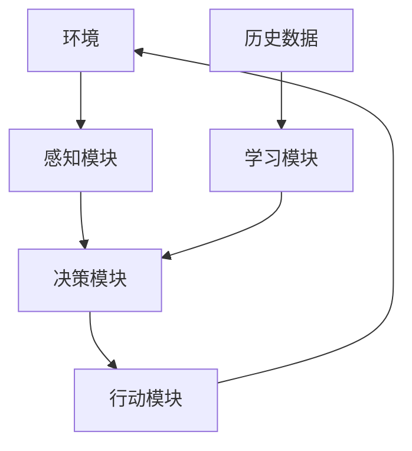

# AI Agent在企业数字化转型中的战略定位与实施路径

> 关键词：AI Agent、企业数字化转型、战略定位、实施路径、智能自动化

> 摘要：本文聚焦于AI Agent在企业数字化转型中的重要作用，深入探讨其战略定位与实施路径。首先介绍了研究的背景、目的、预期读者等信息，阐述了AI Agent的核心概念与联系，包括其原理和架构。详细讲解了相关核心算法原理及具体操作步骤，并结合数学模型和公式进行深入剖析。通过项目实战展示了AI Agent在实际场景中的代码实现与应用，分析了其实际应用场景。同时推荐了学习、开发工具框架以及相关论文著作等资源。最后总结了AI Agent在企业数字化转型中的未来发展趋势与挑战，并提供常见问题解答与扩展阅读参考资料，旨在为企业在数字化转型过程中合理应用AI Agent提供全面且深入的指导。

## 1. 背景介绍 
### 1.1 目的和范围
在当今数字化时代，企业面临着日益激烈的市场竞争和快速变化的商业环境。数字化转型已成为企业提升竞争力、实现可持续发展的关键战略。AI Agent作为人工智能领域的重要技术，具有自主决策、智能交互等特性，能够为企业的数字化转型带来新的机遇和突破。本文章的目的在于深入探讨AI Agent在企业数字化转型中的战略定位，明确其在企业不同业务环节中的价值和作用；同时，详细阐述AI Agent在企业中实施的路径，包括从规划、部署到应用的各个阶段，为企业提供可操作的指导方案。本文的范围涵盖了AI Agent的基本概念、技术原理、应用场景，以及在企业数字化转型中的具体实施过程和相关案例分析。

### 1.2 预期读者
本文的预期读者主要包括企业的高层管理人员，如CEO、CTO等，他们需要从战略层面了解AI Agent对企业数字化转型的意义和价值，以便做出合理的决策。企业的IT部门人员，包括软件工程师、系统架构师等，他们对AI Agent的技术原理和实施细节感兴趣，希望通过本文获取相关的技术知识和实践经验。此外，对企业数字化转型和AI Agent技术发展趋势关注的研究人员、行业分析师等也可以从本文中获得有价值的信息。

### 1.3 文档结构概述
本文将按照以下结构进行阐述：首先介绍AI Agent的背景信息，包括目的、预期读者和文档结构概述等内容。接着深入探讨AI Agent的核心概念与联系，包括其原理、架构和工作流程。然后详细讲解AI Agent的核心算法原理及具体操作步骤，结合Python代码进行说明。之后介绍相关的数学模型和公式，并通过具体例子进行解释。通过项目实战展示AI Agent在企业中的代码实现和应用。分析AI Agent在企业中的实际应用场景。推荐学习、开发工具框架以及相关论文著作等资源。总结AI Agent在企业数字化转型中的未来发展趋势与挑战。提供常见问题解答和扩展阅读参考资料。

### 1.4 术语表
#### 1.4.1 核心术语定义
- **AI Agent（人工智能智能体）**：是一种能够感知环境、自主决策并采取行动以实现特定目标的软件实体或系统。它可以通过与环境的交互不断学习和优化自身的行为。
- **企业数字化转型**：指企业利用数字技术对业务流程、组织架构、商业模式等进行全面的变革和创新，以提高企业的效率、竞争力和创新能力。
- **智能自动化**：结合人工智能和自动化技术，实现业务流程的自动化执行和优化，减少人工干预，提高工作效率和质量。

#### 1.4.2 相关概念解释
- **环境感知**：AI Agent通过各种传感器或接口获取环境信息的过程，这些信息可以是文本、图像、音频等多种形式。
- **决策制定**：AI Agent根据感知到的环境信息和自身的目标，运用一定的算法和模型进行分析和推理，做出相应的决策。
- **行动执行**：AI Agent根据决策结果采取相应的行动，与环境进行交互，以实现自身的目标。

#### 1.4.3 缩略词列表
- **AI**：Artificial Intelligence（人工智能）
- **ML**：Machine Learning（机器学习）
- **DL**：Deep Learning（深度学习）

## 2. 核心概念与联系 

### 2.1 AI Agent的原理
AI Agent的基本原理是基于感知 - 决策 - 行动的循环过程。它首先通过各种传感器或接口感知周围的环境信息，然后对这些信息进行分析和处理，运用预先定义的规则、算法或模型进行决策，最后根据决策结果采取相应的行动，对环境产生影响。在这个过程中，AI Agent还可以通过学习机制不断优化自己的决策和行动策略，以更好地适应环境的变化。

### 2.2 AI Agent的架构
AI Agent的架构通常包括感知模块、决策模块、行动模块和学习模块。感知模块负责收集环境信息，如通过摄像头获取图像信息、通过麦克风获取音频信息等。决策模块根据感知到的信息进行分析和推理，制定相应的决策。行动模块根据决策结果执行具体的行动，如控制机器人的运动、发送消息等。学习模块则通过对历史数据和经验的学习，不断改进AI Agent的性能和行为。

### 2.3 AI Agent与企业数字化转型的联系
AI Agent在企业数字化转型中具有重要的作用。它可以帮助企业实现业务流程的自动化和智能化，提高工作效率和质量。例如，在客户服务领域，AI Agent可以自动回答客户的问题，提供个性化的服务，提高客户满意度。在生产制造领域，AI Agent可以实时监测生产设备的运行状态，预测设备故障，及时采取维护措施，提高生产效率和设备可靠性。此外，AI Agent还可以帮助企业挖掘数据价值，发现潜在的商业机会，推动企业的创新和发展。

### 2.4 文本示意图
AI Agent的工作原理和架构可以用以下文本示意图表示：

AI Agent
|-- 感知模块
|   |-- 环境信息收集
|-- 决策模块
|   |-- 信息分析与推理
|   |-- 决策制定
|-- 行动模块
|   |-- 行动执行
|-- 学习模块
|   |-- 历史数据学习
|   |-- 性能优化

### 2.5 Mermaid流程图


## 3. 核心算法原理 & 具体操作步骤 

### 3.1 核心算法原理
AI Agent的核心算法包括机器学习算法、深度学习算法、强化学习算法等。以下以强化学习算法为例，介绍其基本原理。

强化学习是一种通过智能体与环境进行交互，不断尝试不同的行动，以获得最大累积奖励的学习方法。智能体在环境中执行一个行动后，会收到一个奖励信号，该信号反映了该行动的好坏程度。智能体的目标是通过不断学习，找到一个最优的策略，使得在长期的交互过程中获得的累积奖励最大。

### 3.2 具体操作步骤
#### 3.2.1 定义环境和智能体
首先，需要定义强化学习的环境和智能体。环境包括状态空间、行动空间和奖励函数，智能体包括策略函数和价值函数。

#### 3.2.2 初始化参数
初始化智能体的策略函数和价值函数的参数。

#### 3.2.3 交互过程
智能体在环境中不断执行行动，根据当前的状态选择一个行动，执行该行动后，环境会返回下一个状态和奖励信号。智能体根据奖励信号更新自己的策略函数和价值函数。

#### 3.2.4 终止条件
当达到预设的终止条件，如达到最大迭代次数或获得足够的奖励时，交互过程结束。

### 3.3 Python源代码详细阐述
以下是一个简单的强化学习示例，使用OpenAI Gym库实现一个CartPole环境的智能体。

```python
import gym
import numpy as np

# 创建CartPole环境
env = gym.make('CartPole-v1')

# 初始化参数
learning_rate = 0.1
discount_factor = 0.99
epsilon = 0.1
num_episodes = 1000

# 初始化Q表
state_space_size = env.observation_space.shape[0]
action_space_size = env.action_space.n
q_table = np.zeros((state_space_size, action_space_size))

# 训练智能体
for episode in range(num_episodes):
    state = env.reset()
    done = False
    total_reward = 0

    while not done:
        # 选择行动
        if np.random.uniform(0, 1) < epsilon:
            action = env.action_space.sample()
        else:
            action = np.argmax(q_table[state, :])

        # 执行行动
        next_state, reward, done, _ = env.step(action)

        # 更新Q表
        q_table[state, action] = (1 - learning_rate) * q_table[state, action] + \
                                 learning_rate * (reward + discount_factor * np.max(q_table[next_state, :]))

        state = next_state
        total_reward += reward

    print(f"Episode {episode}: Total Reward = {total_reward}")

# 测试智能体
state = env.reset()
done = False
total_reward = 0

while not done:
    action = np.argmax(q_table[state, :])
    next_state, reward, done, _ = env.step(action)
    state = next_state
    total_reward += reward

print(f"Test: Total Reward = {total_reward}")

# 关闭环境
env.close()
```

### 3.4 代码解释
- 首先，导入必要的库，创建CartPole环境。
- 初始化学习率、折扣因子、探索率等参数，以及Q表。
- 在训练过程中，智能体根据当前状态选择行动，执行行动后更新Q表。
- 训练结束后，测试智能体的性能。
- 最后关闭环境。

## 4. 数学模型和公式 & 详细讲解 & 举例说明 

### 4.1 强化学习的数学模型
强化学习的数学模型可以用马尔可夫决策过程（MDP）来描述。MDP由一个四元组 $(S, A, P, R)$ 组成，其中：
- $S$ 是状态空间，表示环境的所有可能状态。
- $A$ 是行动空间，表示智能体可以采取的所有行动。
- $P(s'|s, a)$ 是状态转移概率，表示在状态 $s$ 下采取行动 $a$ 后转移到状态 $s'$ 的概率。
- $R(s, a)$ 是奖励函数，表示在状态 $s$ 下采取行动 $a$ 后获得的奖励。

### 4.2 Q学习算法的数学公式
Q学习算法是一种基于价值的强化学习算法，其目标是学习一个最优的动作价值函数 $Q(s, a)$，表示在状态 $s$ 下采取行动 $a$ 后获得的最大累积奖励。Q学习算法的更新公式为：

$$Q(s, a) \leftarrow (1 - \alpha)Q(s, a) + \alpha(R(s, a) + \gamma \max_{a'} Q(s', a'))$$

其中：
- $\alpha$ 是学习率，控制每次更新的步长。
- $\gamma$ 是折扣因子，控制未来奖励的重要性。
- $s$ 是当前状态，$a$ 是当前行动，$s'$ 是下一个状态。

### 4.3 详细讲解
- 学习率 $\alpha$：$\alpha$ 的取值范围在 $[0, 1]$ 之间。当 $\alpha = 1$ 时，智能体完全忽略之前的Q值，只根据当前的奖励进行更新；当 $\alpha = 0$ 时，智能体不进行更新，Q值保持不变。
- 折扣因子 $\gamma$：$\gamma$ 的取值范围在 $[0, 1]$ 之间。当 $\gamma$ 接近 1 时，智能体更注重未来的奖励；当 $\gamma$ 接近 0 时，智能体只关注当前的奖励。

### 4.4 举例说明
假设智能体在一个简单的网格世界中，状态空间 $S = \{s_1, s_2, s_3\}$，行动空间 $A = \{a_1, a_2\}$。当前状态 $s = s_1$，采取行动 $a = a_1$ 后转移到状态 $s' = s_2$，获得奖励 $R(s, a) = 1$。已知 $Q(s_1, a_1) = 0.5$，$Q(s_2, a_1) = 0.6$，$Q(s_2, a_2) = 0.7$，学习率 $\alpha = 0.1$，折扣因子 $\gamma = 0.9$。

根据Q学习算法的更新公式，计算 $Q(s_1, a_1)$ 的更新值：

$$
\begin{align*}
Q(s_1, a_1) &\leftarrow (1 - 0.1) \times 0.5 + 0.1 \times (1 + 0.9 \times \max\{0.6, 0.7\}) \\
&= 0.9 \times 0.5 + 0.1 \times (1 + 0.9 \times 0.7) \\
&= 0.45 + 0.1 \times (1 + 0.63) \\
&= 0.45 + 0.1 \times 1.63 \\
&= 0.45 + 0.163 \\
&= 0.613
\end{align*}
$$

## 5. 项目实战：代码实际案例和详细解释说明 

### 5.1  开发环境搭建
#### 5.1.1 安装Python
首先，需要安装Python编程语言。可以从Python官方网站（https://www.python.org/downloads/） 下载适合自己操作系统的Python版本，并按照安装向导进行安装。

#### 5.1.2 安装必要的库
在项目中，需要使用一些Python库，如OpenAI Gym、NumPy等。可以使用pip命令进行安装：

```sh
pip install gym numpy
```

### 5.2  源代码详细实现和代码解读
以下是一个更完整的AI Agent在企业客户服务场景中的示例代码，使用基于规则的AI Agent实现自动回复客户问题。

```python
# 定义问题 - 答案映射
question_answer_mapping = {
    "产品价格是多少": "产品价格根据不同型号和配置有所不同，请您提供具体的产品型号，我们将为您提供准确的价格信息。",
    "产品何时发货": "一般情况下，我们会在收到订单后的24小时内发货，特殊情况会另行通知。",
    "如何退换货": "如果您需要退换货，请在收到产品后的7天内联系我们的客服人员，并提供相关的订单信息和退换货原因，我们将为您处理。"
}

# 定义AI Agent类
class CustomerServiceAgent:
    def __init__(self):
        self.question_answer_mapping = question_answer_mapping

    def answer_question(self, question):
        if question in self.question_answer_mapping:
            return self.question_answer_mapping[question]
        else:
            return "很抱歉，您的问题我暂时无法回答，请您稍等，我们会有专业的客服人员与您联系。"

# 测试AI Agent
if __name__ == "__main__":
    agent = CustomerServiceAgent()
    questions = ["产品价格是多少", "产品何时发货", "如何退换货", "产品质量如何"]
    for question in questions:
        answer = agent.answer_question(question)
        print(f"问题: {question}")
        print(f"答案: {answer}")
        print()
```

### 5.3  代码解读与分析
- **问题 - 答案映射**：定义了一个字典 `question_answer_mapping`，存储常见问题和对应的答案。
- **AI Agent类**：定义了一个 `CustomerServiceAgent` 类，其中 `__init__` 方法初始化问题 - 答案映射，`answer_question` 方法根据用户的问题查找对应的答案，如果找不到则返回默认信息。
- **测试部分**：创建 `CustomerServiceAgent` 类的实例，遍历问题列表，调用 `answer_question` 方法获取答案并打印。

这个示例展示了一个简单的基于规则的AI Agent在客户服务场景中的应用。在实际应用中，可以使用更复杂的技术，如自然语言处理、机器学习等，来提高AI Agent的智能水平。

## 6. 实际应用场景 

### 6.1 客户服务
AI Agent可以在客户服务领域发挥重要作用。它可以自动回答客户的常见问题，提供实时的帮助和支持。例如，在电商平台中，AI Agent可以回答客户关于产品信息、订单状态、退换货政策等问题，提高客户服务效率和满意度。在银行、电信等行业，AI Agent可以处理客户的咨询、投诉等业务，减轻客服人员的工作压力。

### 6.2 生产制造
在生产制造领域，AI Agent可以实现生产过程的自动化和智能化。它可以实时监测生产设备的运行状态，预测设备故障，及时采取维护措施，提高设备的可靠性和生产效率。例如，在汽车制造企业中，AI Agent可以控制机器人的操作，实现零部件的自动装配和检测。在化工企业中，AI Agent可以优化生产工艺参数，提高产品质量和产量。

### 6.3 供应链管理
AI Agent可以在供应链管理中发挥重要作用。它可以实时跟踪货物的运输状态，优化物流路线，提高物流效率。例如，在电商物流中，AI Agent可以根据订单信息和库存情况，自动分配货物的配送路线和配送方式。在制造业供应链中，AI Agent可以协调供应商、生产商和经销商之间的关系，实现供应链的协同运作。

### 6.4 市场营销
AI Agent可以在市场营销领域提供个性化的服务和推荐。它可以分析客户的行为数据和偏好，为客户提供个性化的产品推荐和营销活动。例如，在电商平台中，AI Agent可以根据客户的浏览历史、购买记录等信息，推荐适合客户的产品。在社交媒体平台中，AI Agent可以根据用户的兴趣爱好，推送个性化的广告和内容。

## 7. 工具和资源推荐
### 7.1 学习资源推荐
#### 7.1.1 书籍推荐
- 《人工智能：一种现代的方法》：全面介绍了人工智能的基本概念、算法和应用，是人工智能领域的经典教材。
- 《强化学习：原理与Python实现》：详细介绍了强化学习的原理和算法，并通过Python代码进行实现和讲解。
- 《Python机器学习》：介绍了Python在机器学习领域的应用，包括各种机器学习算法的原理和实现。

#### 7.1.2 在线课程
- Coursera上的“人工智能基础”课程：由知名高校的教授授课，系统地介绍了人工智能的基本概念和技术。
- edX上的“强化学习”课程：深入讲解了强化学习的原理和应用，通过实际案例进行分析和实践。
- 阿里云开发者社区的“Python人工智能实战”课程：结合实际项目，介绍了Python在人工智能领域的应用和实践。

#### 7.1.3 技术博客和网站
- Medium：上面有很多关于人工智能和AI Agent的技术文章和研究成果。
- Towards Data Science：专注于数据科学和人工智能领域的技术博客，提供了很多有价值的技术文章和案例分析。
- AI Stack Exchange：一个人工智能领域的问答社区，可以在这里提问和交流相关技术问题。

### 7.2 开发工具框架推荐
#### 7.2.1 IDE和编辑器
- PyCharm：一款专业的Python集成开发环境，提供了丰富的功能和插件，方便开发和调试Python代码。
- Visual Studio Code：一款轻量级的代码编辑器，支持多种编程语言，具有丰富的插件生态系统。
- Jupyter Notebook：一种交互式的开发环境，适合进行数据分析和机器学习实验。

#### 7.2.2 调试和性能分析工具
- pdb：Python自带的调试工具，可以帮助开发者定位和解决代码中的问题。
- cProfile：Python的性能分析工具，可以分析代码的运行时间和资源消耗情况。
- TensorBoard：一个可视化工具，用于查看和分析深度学习模型的训练过程和性能。

#### 7.2.3 相关框架和库
- OpenAI Gym：一个用于开发和比较强化学习算法的工具包，提供了多种环境和接口。
- TensorFlow：一个开源的机器学习框架，广泛应用于深度学习领域，提供了丰富的工具和接口。
- PyTorch：一个开源的深度学习框架，具有简洁的API和高效的性能，受到很多研究者和开发者的喜爱。

### 7.3 相关论文著作推荐
#### 7.3.1 经典论文
- “Reinforcement Learning: A Survey”：对强化学习的发展历程和主要算法进行了全面的综述。
- “Playing Atari with Deep Reinforcement Learning”：介绍了深度强化学习在Atari游戏中的应用，开创了深度强化学习的先河。
- “Attention Is All You Need”：提出了Transformer模型，在自然语言处理领域取得了巨大的成功。

#### 7.3.2 最新研究成果
- 关注顶级学术会议，如NeurIPS、ICML、CVPR等，这些会议上发表了很多关于AI Agent和人工智能的最新研究成果。
- 关注知名学术期刊，如Journal of Artificial Intelligence Research、Artificial Intelligence等，这些期刊上发表了很多高质量的研究论文。

#### 7.3.3 应用案例分析
- 可以在ACM Digital Library、IEEE Xplore等数据库中查找关于AI Agent在企业数字化转型中的应用案例分析，了解实际应用中的经验和教训。

## 8. 总结：未来发展趋势与挑战
### 8.1 未来发展趋势
- **智能化程度不断提高**：随着人工智能技术的不断发展，AI Agent的智能化程度将不断提高，能够处理更加复杂和多样化的任务。例如，AI Agent将具备更强的自然语言理解和生成能力，能够与人类进行更加自然和流畅的交互。
- **与其他技术深度融合**：AI Agent将与物联网、大数据、区块链等技术深度融合，实现更加智能和高效的应用。例如，在工业互联网中，AI Agent可以与物联网设备进行实时交互，实现设备的智能控制和优化管理。
- **应用领域不断拓展**：AI Agent的应用领域将不断拓展，除了客户服务、生产制造、供应链管理等领域，还将在医疗、教育、金融等领域发挥重要作用。例如，在医疗领域，AI Agent可以辅助医生进行疾病诊断和治疗方案制定。

### 8.2 挑战
- **数据隐私和安全问题**：AI Agent需要大量的数据进行训练和学习，这些数据可能包含用户的个人隐私信息。因此，如何保护数据的隐私和安全是一个重要的挑战。
- **算法可解释性问题**：一些复杂的AI Agent算法，如深度学习算法，具有很强的黑盒性，难以解释其决策过程和结果。这在一些关键领域，如医疗、金融等，可能会带来信任问题。
- **伦理和法律问题**：随着AI Agent的广泛应用，可能会带来一些伦理和法律问题，如AI Agent的责任认定、人工智能的权利和义务等。需要建立相应的伦理和法律框架来规范AI Agent的发展和应用。

## 9. 附录：常见问题与解答
### 9.1 AI Agent与传统软件有什么区别？
AI Agent具有自主决策和智能交互的能力，能够根据环境的变化自动调整自己的行为。而传统软件通常是按照预先编写的程序执行固定的任务，缺乏自主学习和适应能力。

### 9.2 AI Agent的训练需要多长时间？
AI Agent的训练时间取决于多个因素，如算法的复杂度、数据的规模、计算资源的性能等。一些简单的AI Agent可能只需要几分钟或几小时的训练时间，而一些复杂的AI Agent可能需要数天、数周甚至数月的训练时间。

### 9.3 如何评估AI Agent的性能？
可以从多个方面评估AI Agent的性能，如任务完成的准确率、效率、稳定性等。对于强化学习的AI Agent，可以使用累积奖励、平均奖励等指标来评估其性能。

### 9.4 AI Agent在企业中的实施成本高吗？
AI Agent在企业中的实施成本包括硬件设备、软件系统、人员培训等方面的费用。实施成本的高低取决于企业的具体需求和应用场景。一些简单的基于规则的AI Agent实施成本相对较低，而一些复杂的基于机器学习和深度学习的AI Agent实施成本相对较高。

## 10. 扩展阅读 & 参考资料
### 10.1 扩展阅读
- 《人工智能时代的企业转型》：深入探讨了人工智能技术对企业转型的影响和挑战，提供了一些企业数字化转型的实践案例和经验。
- 《智能时代：大数据与智能革命重新定义未来》：介绍了大数据和人工智能技术的发展趋势，以及它们对社会和经济的影响。

### 10.2 参考资料
- OpenAI官方文档：https://openai.com/
- TensorFlow官方文档：https://www.tensorflow.org/
- PyTorch官方文档：https://pytorch.org/