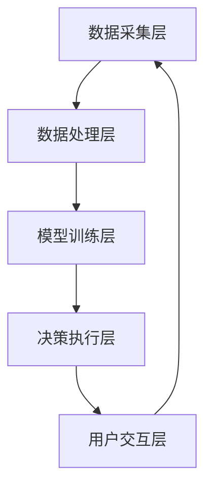

# AI Agent在员工健康与福利管理中的应用前景

> 关键词：AI Agent、员工健康、福利管理、应用前景、智能系统

> 摘要：本文聚焦于AI Agent在员工健康与福利管理中的应用前景。随着科技的不断发展，AI Agent的应用范围日益广泛。在员工健康与福利管理领域，AI Agent凭借其智能、高效等特性，为企业的管理带来了新的思路和方法。文章首先介绍了相关背景，包括目的、预期读者等内容；接着阐述了AI Agent的核心概念与联系，通过文本示意图和Mermaid流程图进行直观展示；详细讲解了其核心算法原理及具体操作步骤，结合Python源代码；还探讨了相关的数学模型和公式，并举例说明；通过项目实战给出代码实际案例及详细解释；分析了实际应用场景；推荐了相关的工具和资源；最后总结了未来发展趋势与挑战，解答常见问题并提供扩展阅读与参考资料，全面深入地探讨了AI Agent在该领域的应用前景。

## 1. 背景介绍 
### 1.1 目的和范围
在当今竞争激烈的商业环境中，企业越来越重视员工的健康与福利管理。良好的员工健康状况和完善的福利体系不仅有助于提高员工的工作效率和满意度，还能增强企业的凝聚力和竞争力。本文章的目的在于深入探讨AI Agent在员工健康与福利管理中的应用前景，分析其可能带来的优势和挑战。范围涵盖了AI Agent在员工健康监测、福利规划、个性化服务等多个方面的应用，旨在为企业管理者、人力资源专家以及相关技术人员提供全面的参考和启示。

### 1.2 预期读者
本文的预期读者包括企业管理者、人力资源部门工作人员、从事员工健康与福利管理的专业人士、人工智能领域的研究人员和开发者等。对于企业管理者和人力资源专业人士，本文将帮助他们了解AI Agent在员工健康与福利管理中的潜在价值，为决策提供依据；对于人工智能领域的研究人员和开发者，本文将为他们提供在该领域的应用场景和研究方向。

### 1.3 文档结构概述
本文将按照以下结构进行阐述：首先介绍背景信息，包括目的、预期读者和文档结构概述等；接着阐述AI Agent的核心概念与联系，通过文本示意图和流程图进行直观展示；详细讲解核心算法原理及具体操作步骤，结合Python源代码；探讨相关的数学模型和公式，并举例说明；通过项目实战给出代码实际案例及详细解释；分析实际应用场景；推荐相关的工具和资源；最后总结未来发展趋势与挑战，解答常见问题并提供扩展阅读与参考资料。

### 1.4 术语表
#### 1.4.1 核心术语定义
- **AI Agent（人工智能代理）**：是一种能够感知环境、自主决策并采取行动以实现特定目标的智能实体。它可以根据预设的规则和算法，对输入的信息进行处理和分析，并做出相应的决策和响应。
- **员工健康与福利管理**：指企业为保障员工的身体健康、提供合理的福利待遇而进行的一系列管理活动，包括健康监测、福利规划、员工关怀等方面。

#### 1.4.2 相关概念解释
- **智能系统**：是指具备智能特征的系统，能够模拟人类的智能行为，如感知、学习、推理、决策等。AI Agent是智能系统的一种具体实现形式。
- **个性化服务**：根据用户的个性化需求和特征，提供针对性的服务和建议。在员工健康与福利管理中，AI Agent可以通过对员工数据的分析，为员工提供个性化的健康建议和福利方案。

#### 1.4.3 缩略词列表
- **AI**：Artificial Intelligence（人工智能）
- **ML**：Machine Learning（机器学习）
- **DL**：Deep Learning（深度学习）

## 2. 核心概念与联系 
### 核心概念原理
AI Agent的核心原理基于人工智能技术，包括机器学习、深度学习、自然语言处理等。它通过感知环境中的信息，如员工的健康数据、福利需求等，将这些信息输入到预先训练好的模型中进行分析和处理。模型根据输入的数据进行推理和决策，生成相应的行动方案。例如，AI Agent可以根据员工的健康数据判断员工是否存在健康风险，并提供相应的健康建议；根据员工的工作年限、职位等信息，为员工推荐合适的福利方案。

### 架构的文本示意图
AI Agent在员工健康与福利管理中的架构可以分为以下几个层次：
1. **数据采集层**：负责收集员工的各种数据，包括健康数据（如体检报告、运动数据、睡眠数据等）、个人信息（如年龄、性别、职位等）、福利需求信息等。数据来源可以包括可穿戴设备、企业内部系统、员工调查问卷等。
2. **数据处理层**：对采集到的数据进行清洗、预处理和特征提取。清洗数据是为了去除噪声和错误数据，预处理包括数据归一化、标准化等操作，特征提取是为了提取出对决策有重要影响的特征。
3. **模型训练层**：使用机器学习或深度学习算法对处理后的数据进行训练，生成预测模型和决策模型。例如，可以使用分类算法对员工的健康风险进行分类，使用推荐算法为员工推荐福利方案。
4. **决策执行层**：AI Agent根据训练好的模型对新输入的数据进行推理和决策，生成相应的行动方案。例如，根据员工的健康风险分类结果，为员工提供个性化的健康建议；根据员工的福利需求和企业的福利政策，为员工推荐合适的福利方案。
5. **用户交互层**：负责与员工和企业管理者进行交互，将AI Agent的决策结果反馈给用户，并接收用户的反馈和指令。交互方式可以包括网页界面、手机应用、语音交互等。

### Mermaid流程图

这个流程图展示了AI Agent在员工健康与福利管理中的工作流程。数据从采集层开始，经过处理、训练、决策等环节，最终将结果反馈给用户，用户的反馈又可以作为新的数据重新进入采集层，形成一个闭环的系统。

## 3. 核心算法原理 & 具体操作步骤 
### 核心算法原理
在AI Agent在员工健康与福利管理中，常用的算法包括机器学习算法和深度学习算法。以下以决策树算法和推荐系统算法为例进行介绍。

#### 决策树算法
决策树是一种基于树结构进行决策的算法。它通过对数据的特征进行划分，将数据空间划分为不同的区域，每个区域对应一个决策结果。在员工健康与福利管理中，决策树可以用于对员工的健康风险进行分类。例如，根据员工的年龄、血压、血糖等特征，将员工分为低风险、中风险和高风险三类。

#### 推荐系统算法
推荐系统算法用于根据用户的历史行为和偏好，为用户推荐相关的物品或服务。在员工健康与福利管理中，推荐系统可以用于为员工推荐合适的福利方案。例如，根据员工的职位、工作年限、健康状况等信息，为员工推荐适合的保险、培训课程等福利。

### 具体操作步骤
#### 数据准备
1. 收集员工的健康数据、个人信息、福利需求等数据。
2. 对数据进行清洗和预处理，去除噪声和错误数据，进行数据归一化和标准化等操作。

#### 模型训练
1. 选择合适的算法，如决策树算法、推荐系统算法等。
2. 将处理后的数据划分为训练集和测试集。
3. 使用训练集对模型进行训练，调整模型的参数，直到模型的性能达到满意的程度。

#### 模型评估
1. 使用测试集对训练好的模型进行评估，计算模型的准确率、召回率、F1值等指标。
2. 根据评估结果，对模型进行优化和改进。

#### 决策执行
1. 将新的员工数据输入到训练好的模型中，进行推理和决策。
2. 根据决策结果，为员工提供相应的健康建议和福利方案。

### Python源代码实现
以下是一个使用决策树算法对员工健康风险进行分类的Python示例代码：
```python
import pandas as pd
from sklearn.model_selection import train_test_split
from sklearn.tree import DecisionTreeClassifier
from sklearn.metrics import accuracy_score

# 读取数据
data = pd.read_csv('employee_health_data.csv')

# 提取特征和标签
X = data.drop('health_risk', axis=1)
y = data['health_risk']

# 划分训练集和测试集
X_train, X_test, y_train, y_test = train_test_split(X, y, test_size=0.2, random_state=42)

# 创建决策树分类器
clf = DecisionTreeClassifier()

# 训练模型
clf.fit(X_train, y_train)

# 预测
y_pred = clf.predict(X_test)

# 计算准确率
accuracy = accuracy_score(y_test, y_pred)
print(f"模型准确率: {accuracy}")
```
在这个示例中，我们首先读取员工的健康数据，然后提取特征和标签。接着，我们将数据划分为训练集和测试集，创建决策树分类器并进行训练。最后，我们使用测试集对模型进行评估，计算模型的准确率。

## 4. 数学模型和公式 & 详细讲解 & 举例说明 
### 决策树算法的数学模型和公式
决策树算法的核心是通过对数据的特征进行划分，构建一个树状结构。在划分特征时，常用的指标是信息增益和基尼指数。

#### 信息增益
信息增益是衡量特征对分类结果的影响程度的指标。它的计算公式为：
$$IG(D, A) = H(D) - H(D|A)$$
其中，$IG(D, A)$ 表示特征 $A$ 对数据集 $D$ 的信息增益，$H(D)$ 表示数据集 $D$ 的信息熵，$H(D|A)$ 表示在已知特征 $A$ 的条件下，数据集 $D$ 的条件信息熵。

信息熵的计算公式为：
$$H(D) = -\sum_{k=1}^{K}p_k\log_2p_k$$
其中，$p_k$ 表示数据集 $D$ 中第 $k$ 类样本的比例，$K$ 表示类别数。

条件信息熵的计算公式为：
$$H(D|A) = \sum_{v=1}^{V}\frac{|D^v|}{|D|}H(D^v)$$
其中，$V$ 表示特征 $A$ 的取值个数，$D^v$ 表示特征 $A$ 取值为 $v$ 的样本子集。

#### 基尼指数
基尼指数是衡量数据集的纯度的指标。它的计算公式为：
$$Gini(D) = 1 - \sum_{k=1}^{K}p_k^2$$
在划分特征时，我们选择基尼指数最小的特征作为划分特征。

### 详细讲解
信息增益和基尼指数都是用于衡量特征对分类结果的影响程度的指标。信息增益越大，说明特征对分类结果的影响越大；基尼指数越小，说明数据集的纯度越高。在决策树算法中，我们通过不断选择信息增益最大或基尼指数最小的特征进行划分，构建决策树。

### 举例说明
假设我们有一个员工健康数据集，包含员工的年龄、血压、血糖等特征，以及员工的健康风险分类（低风险、中风险、高风险）。我们可以使用信息增益或基尼指数来选择最优的划分特征。例如，计算年龄特征的信息增益或基尼指数，然后选择信息增益最大或基尼指数最小的特征作为划分特征，将数据集划分为不同的子集。接着，在每个子集中继续选择最优的划分特征，直到满足停止条件（如子集的样本数小于某个阈值或所有样本属于同一类别）。

## 5. 项目实战：代码实际案例和详细解释说明 
### 5.1  开发环境搭建
#### 安装Python
首先，需要安装Python开发环境。可以从Python官方网站（https://www.python.org/downloads/）下载适合自己操作系统的Python版本，并按照安装向导进行安装。

#### 安装必要的库
在项目中，我们需要使用一些Python库，如pandas、scikit-learn等。可以使用pip命令进行安装：
```sh
pip install pandas scikit-learn
```

### 5.2  源代码详细实现和代码解读
以下是一个完整的项目实战代码示例，实现了一个基于推荐系统算法的员工福利推荐系统：
```python
import pandas as pd
from sklearn.metrics.pairwise import cosine_similarity

# 读取员工数据和福利数据
employee_data = pd.read_csv('employee_data.csv')
benefit_data = pd.read_csv('benefit_data.csv')

# 提取员工特征和福利特征
employee_features = employee_data[['age', 'job_level', 'years_of_service']]
benefit_features = benefit_data[['coverage', 'cost', 'popularity']]

# 计算员工和福利之间的相似度
similarity_matrix = cosine_similarity(employee_features, benefit_features)

# 为每个员工推荐福利
recommended_benefits = []
for i in range(len(employee_data)):
    top_benefit_indices = similarity_matrix[i].argsort()[-3:][::-1]
    recommended_benefit_names = benefit_data.iloc[top_benefit_indices]['benefit_name'].tolist()
    recommended_benefits.append(recommended_benefit_names)

# 将推荐结果添加到员工数据中
employee_data['recommended_benefits'] = recommended_benefits

# 保存结果
employee_data.to_csv('employee_benefit_recommendations.csv', index=False)
```
### 代码解读
1. **数据读取**：使用pandas库读取员工数据和福利数据。
2. **特征提取**：从员工数据和福利数据中提取相关的特征，如员工的年龄、职位级别、工作年限，福利的覆盖范围、成本、受欢迎程度等。
3. **相似度计算**：使用余弦相似度计算员工和福利之间的相似度。余弦相似度是一种常用的相似度度量方法，用于衡量两个向量之间的夹角余弦值，值越接近1表示越相似。
4. **福利推荐**：为每个员工选择相似度最高的前3个福利作为推荐结果。
5. **结果保存**：将推荐结果添加到员工数据中，并保存为CSV文件。

### 5.3  代码解读与分析
这个项目实战代码实现了一个简单的员工福利推荐系统。通过计算员工和福利之间的相似度，为每个员工推荐合适的福利方案。代码的优点是简单易懂，易于实现。但是，也存在一些局限性，如特征选择可能不够全面，相似度计算方法可能不够准确等。在实际应用中，可以根据具体情况进行改进和优化。

## 6. 实际应用场景 
### 员工健康监测
AI Agent可以通过与可穿戴设备、健康监测系统等连接，实时收集员工的健康数据，如心率、血压、运动步数等。根据这些数据，AI Agent可以对员工的健康状况进行评估和监测，及时发现潜在的健康风险，并为员工提供个性化的健康建议。例如，如果员工的心率持续偏高，AI Agent可以提醒员工注意休息，并建议进行进一步的检查。

### 福利规划与推荐
AI Agent可以根据员工的个人信息、工作表现、健康状况等因素，为员工制定个性化的福利规划。例如，对于工作年限较长、业绩突出的员工，可以推荐更高级别的保险福利；对于有健康问题的员工，可以推荐相关的健康管理服务。同时，AI Agent还可以根据员工的实时需求，为员工推荐合适的福利方案，提高员工的满意度。

### 员工关怀与沟通
AI Agent可以通过自然语言处理技术，与员工进行实时沟通和交流。例如，员工可以通过聊天机器人咨询福利政策、健康问题等，AI Agent可以及时给予解答和建议。此外，AI Agent还可以在员工生日、节假日等特殊时期，发送祝福和关怀信息，增强员工的归属感和忠诚度。

### 数据分析与决策支持
AI Agent可以对员工的健康数据、福利使用情况等进行分析，为企业管理者提供决策支持。例如，通过分析员工的健康数据，企业管理者可以了解员工的整体健康状况，制定相应的健康管理策略；通过分析福利使用情况，企业管理者可以了解员工的福利需求，优化福利政策。

## 7. 工具和资源推荐
### 7.1 学习资源推荐
#### 7.1.1 书籍推荐
- 《Python机器学习》：介绍了Python在机器学习中的应用，包括各种机器学习算法的原理和实现。
- 《人工智能：一种现代的方法》：全面介绍了人工智能的基本概念、算法和应用，是人工智能领域的经典教材。
- 《推荐系统实践》：详细介绍了推荐系统的原理、算法和应用，适合对推荐系统感兴趣的读者。

#### 7.1.2 在线课程
- Coursera上的“机器学习”课程：由斯坦福大学教授Andrew Ng主讲，是机器学习领域的经典课程。
- edX上的“人工智能基础”课程：介绍了人工智能的基本概念、算法和应用。
- Udemy上的“Python数据科学和机器学习实战”课程：结合Python和机器学习算法，介绍了数据科学和机器学习的实践应用。

#### 7.1.3 技术博客和网站
- Medium：是一个技术博客平台，有很多关于人工智能、机器学习等领域的优秀文章。
- Towards Data Science：专注于数据科学和机器学习领域的技术博客，提供了很多实用的教程和案例。
- Kaggle：是一个数据科学竞赛平台，提供了很多数据集和竞赛项目，可以学习到很多实际应用的经验。

### 7.2 开发工具框架推荐
#### 7.2.1 IDE和编辑器
- PyCharm：是一款专业的Python集成开发环境，提供了丰富的功能和插件，适合Python开发。
- Jupyter Notebook：是一个交互式的开发环境，适合进行数据探索和分析，以及机器学习模型的开发和测试。
- Visual Studio Code：是一款轻量级的代码编辑器，支持多种编程语言，有丰富的插件和扩展。

#### 7.2.2 调试和性能分析工具
- PySnooper：是一个简单易用的Python调试工具，可以自动记录函数的调用过程和变量的值。
- cProfile：是Python内置的性能分析工具，可以分析代码的性能瓶颈。
- TensorBoard：是TensorFlow的可视化工具，可以用于可视化训练过程和模型结构。

#### 7.2.3 相关框架和库
- scikit-learn：是一个常用的Python机器学习库，提供了各种机器学习算法和工具。
- TensorFlow：是一个开源的深度学习框架，由Google开发，广泛应用于各种深度学习任务。
- PyTorch：是一个开源的深度学习框架，由Facebook开发，具有动态图的特点，适合快速开发和实验。

### 7.3 相关论文著作推荐
#### 7.3.1 经典论文
- “A Course in Machine Learning”：由Hal Daumé III撰写，是机器学习领域的经典教材，全面介绍了机器学习的基本概念、算法和应用。
- “Deep Learning”：由Ian Goodfellow、Yoshua Bengio和Aaron Courville撰写，是深度学习领域的经典教材，详细介绍了深度学习的原理、算法和应用。
- “Recommender Systems Handbook”：由Francesco Ricci、Lior Rokach和Bracha Shapira编辑，是推荐系统领域的经典著作，全面介绍了推荐系统的原理、算法和应用。

#### 7.3.2 最新研究成果
- 关注顶级学术会议，如NeurIPS（神经信息处理系统大会）、ICML（国际机器学习会议）、KDD（知识发现与数据挖掘会议）等，这些会议上会发布很多最新的研究成果。
- 阅读相关的学术期刊，如Journal of Artificial Intelligence Research（JAIR）、Artificial Intelligence（AI）等，这些期刊上会发表很多高质量的研究论文。

#### 7.3.3 应用案例分析
- 可以关注一些知名企业的技术博客和案例分享，如Google、Facebook、Amazon等，了解他们在人工智能、机器学习等领域的应用案例和实践经验。
- 参考一些行业报告和研究机构的分析，如Gartner、Forrester等，了解行业的发展趋势和应用案例。

## 8. 总结：未来发展趋势与挑战
### 未来发展趋势
#### 智能化程度不断提高
随着人工智能技术的不断发展，AI Agent在员工健康与福利管理中的智能化程度将不断提高。它将能够更加准确地感知员工的需求和健康状况，提供更加个性化、智能化的服务和建议。

#### 与其他技术的融合
AI Agent将与物联网、大数据、区块链等技术深度融合，实现更加全面、高效的员工健康与福利管理。例如，通过物联网技术可以实时收集员工的健康数据，通过大数据技术可以对海量数据进行分析和挖掘，通过区块链技术可以保证数据的安全和隐私。

#### 应用场景不断拓展
AI Agent在员工健康与福利管理中的应用场景将不断拓展。除了现有的健康监测、福利规划、员工关怀等应用场景外，还将涉及到员工培训、职业发展等更多领域。

### 挑战
#### 数据安全和隐私问题
AI Agent在员工健康与福利管理中需要收集和处理大量的员工数据，如健康数据、个人信息等。这些数据的安全和隐私问题是一个重要的挑战。企业需要采取有效的措施，保障数据的安全和隐私，防止数据泄露和滥用。

#### 算法的可解释性
AI Agent的决策过程往往是基于复杂的算法和模型，这些算法和模型的可解释性较差。在员工健康与福利管理中，员工和企业管理者需要了解AI Agent的决策依据和过程，以便做出合理的决策。因此，提高算法的可解释性是一个重要的挑战。

#### 员工接受度
员工对AI Agent的接受度也是一个挑战。一些员工可能对AI Agent的应用存在疑虑和担忧，担心自己的隐私和权益受到侵犯。企业需要加强对员工的宣传和培训，提高员工对AI Agent的认识和接受度。

## 9. 附录：常见问题与解答
### 1. AI Agent在员工健康与福利管理中的应用是否会取代人力资源部门的工作？
不会。AI Agent在员工健康与福利管理中的应用是对人力资源部门工作的补充和优化，而不是取代。人力资源部门的工作人员具有丰富的经验和专业知识，能够处理一些复杂的人际关系和决策问题。AI Agent可以帮助人力资源部门提高工作效率，提供更加准确的决策支持，但不能完全替代人力资源部门的工作。

### 2. AI Agent的应用是否会增加企业的成本？
AI Agent的应用可能会在短期内增加企业的成本，如购买相关的技术设备、开发和维护AI Agent系统等。但从长期来看，AI Agent的应用可以提高员工的工作效率和满意度，降低员工的健康风险和流失率，从而为企业带来更大的经济效益。因此，企业需要综合考虑成本和效益，合理评估AI Agent的应用价值。

### 3. 如何保障AI Agent处理员工数据的安全和隐私？
企业可以采取以下措施保障AI Agent处理员工数据的安全和隐私：
- 加强数据加密：对员工数据进行加密处理，防止数据在传输和存储过程中被窃取。
- 访问控制：设置严格的访问权限，只有授权人员才能访问员工数据。
- 匿名化处理：对员工数据进行匿名化处理，在不影响数据分析和应用的前提下，保护员工的个人隐私。
- 定期审计和评估：定期对数据安全和隐私措施进行审计和评估，及时发现和解决问题。

## 10. 扩展阅读 & 参考资料
### 扩展阅读
- 《智能时代》：吴军著，介绍了人工智能技术对社会和经济的影响，以及未来的发展趋势。
- 《人类简史：从动物到上帝》：尤瓦尔·赫拉利著，探讨了人类的发展历程和未来的命运，对理解人工智能的发展和应用有一定的启示。
- 《奇点临近》：雷·库兹韦尔著，预测了人工智能技术的发展将导致人类社会发生巨大的变革。

### 参考资料
- 相关的学术论文和研究报告，如IEEE、ACM等学术组织发表的论文。
- 行业标准和规范，如ISO、IEC等国际标准组织发布的标准。
- 企业的官方文档和技术博客，如Google、Facebook等企业的技术分享。