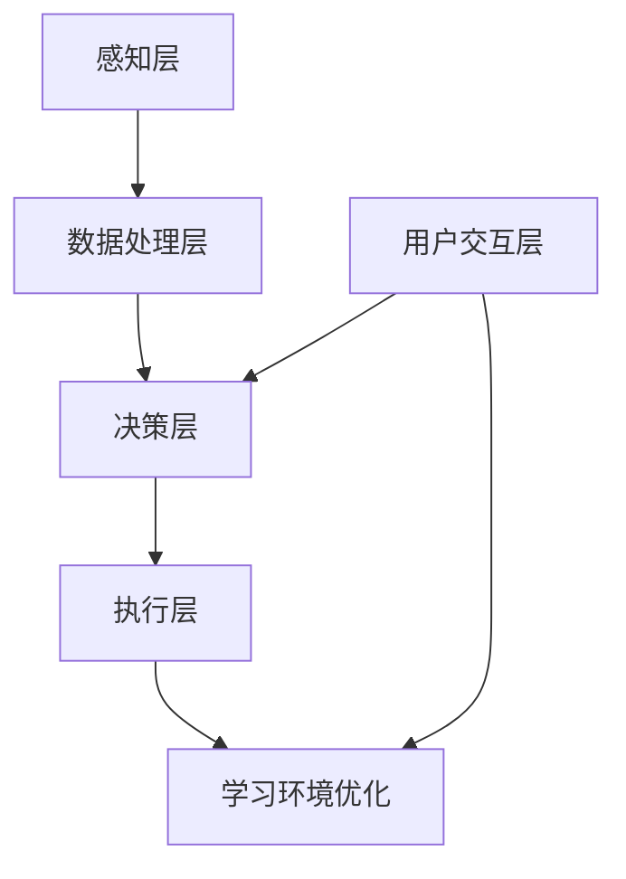

# AI Agent在智能书桌中的学习环境优化

> 关键词：AI Agent、智能书桌、学习环境优化、人工智能、智能硬件、人机交互、环境感知

> 摘要：本文聚焦于AI Agent在智能书桌中的应用，旨在探讨如何利用AI Agent实现学习环境的优化。首先介绍了相关背景知识，包括目的、预期读者、文档结构和术语表。接着阐述了AI Agent与智能书桌的核心概念及联系，给出了原理和架构的文本示意图与Mermaid流程图。详细讲解了核心算法原理并给出Python源代码示例，同时介绍了相关数学模型和公式。通过项目实战，展示了代码实际案例及详细解释。分析了AI Agent在智能书桌中的实际应用场景，推荐了相关的工具和资源。最后总结了未来发展趋势与挑战，并提供了常见问题解答和扩展阅读参考资料，为推动AI Agent在智能书桌领域的应用与发展提供了全面的技术参考。

## 1. 背景介绍 
### 1.1 目的和范围
随着科技的飞速发展，人们对于学习环境的要求越来越高。智能书桌作为一种新兴的学习辅助设备，正逐渐走进人们的生活。本文章的目的在于深入探讨如何利用AI Agent技术对智能书桌的学习环境进行优化，提高学习效率和学习体验。范围涵盖了AI Agent的基本原理、在智能书桌中的应用架构、相关算法实现、实际应用场景以及未来发展趋势等方面。

### 1.2 预期读者
本文预期读者包括对人工智能、智能硬件领域感兴趣的技术爱好者，从事相关研究的科研人员，智能书桌产品的开发人员和设计师，以及关注学习环境优化的教育工作者和学生家长等。

### 1.3 文档结构概述
本文共分为十个部分。第一部分为背景介绍，阐述了文章的目的、预期读者、文档结构和术语表；第二部分介绍核心概念与联系，包括AI Agent和智能书桌的原理及架构；第三部分讲解核心算法原理和具体操作步骤，通过Python代码详细阐述；第四部分介绍数学模型和公式，并举例说明；第五部分进行项目实战，包括开发环境搭建、源代码实现和代码解读；第六部分分析实际应用场景；第七部分推荐相关工具和资源；第八部分总结未来发展趋势与挑战；第九部分为附录，解答常见问题；第十部分提供扩展阅读和参考资料。

### 1.4 术语表
#### 1.4.1 核心术语定义
- **AI Agent（人工智能智能体）**：是一种能够感知环境，根据内部的决策机制进行推理和决策，并采取行动以实现特定目标的软件或硬件实体。
- **智能书桌**：集成了多种传感器和智能设备，能够感知学习环境和用户状态，并通过智能算法进行相应调整的书桌。
- **学习环境优化**：通过对学习环境中的光照、温度、湿度、噪音等因素进行监测和调整，创造一个有利于学习的环境。

#### 1.4.2 相关概念解释
- **环境感知**：智能书桌通过各种传感器获取学习环境中的物理信息，如光照强度、温度、湿度、噪音水平等。
- **人机交互**：用户与智能书桌之间通过各种输入输出设备进行信息交流和控制的过程。
- **决策机制**：AI Agent根据环境感知信息和用户需求，运用一定的算法和规则进行推理和决策，以确定最佳的行动方案。

#### 1.4.3 缩略词列表
- **AI**：Artificial Intelligence，人工智能
- **IoT**：Internet of Things，物联网

## 2. 核心概念与联系 

### 核心概念原理
AI Agent是人工智能领域的一个重要概念，它基于感知、决策和行动的循环过程。在智能书桌的应用场景中，AI Agent通过各种传感器感知学习环境的状态，如光照强度、温度、湿度、噪音水平等，以及用户的行为和状态，如坐姿、专注度等。然后，AI Agent根据预设的规则和算法进行推理和决策，确定需要采取的行动，如调整灯光亮度、调节空调温度、提醒用户纠正坐姿等。最后，AI Agent通过智能书桌的执行设备来执行这些行动，从而实现对学习环境的优化。

智能书桌是一个集成了多种传感器和执行设备的智能硬件系统。传感器包括光照传感器、温度传感器、湿度传感器、噪音传感器、摄像头等，用于感知学习环境和用户状态。执行设备包括灯光控制器、空调控制器、电动升降装置、语音提示器等，用于实现对学习环境的调整和对用户的提醒。

### 架构的文本示意图
智能书桌的AI Agent架构主要包括以下几个部分：
1. **感知层**：由各种传感器组成，负责收集学习环境和用户状态的信息。
2. **数据处理层**：对感知层收集到的数据进行预处理，如滤波、特征提取等。
3. **决策层**：AI Agent的核心部分，根据数据处理层提供的数据和预设的规则和算法进行推理和决策。
4. **执行层**：由各种执行设备组成，负责执行决策层下达的指令，实现对学习环境的调整和对用户的提醒。
5. **用户交互层**：提供用户与智能书桌之间的交互界面，如触摸屏、语音交互设备等，方便用户设置参数和获取信息。

### Mermaid流程图


## 3. 核心算法原理 & 具体操作步骤 

### 核心算法原理
在智能书桌的学习环境优化中，常用的核心算法包括机器学习算法和规则引擎算法。

#### 机器学习算法
机器学习算法可以通过对大量的历史数据进行学习，建立环境状态与最佳调整策略之间的映射关系。例如，使用神经网络算法可以对用户的坐姿、专注度等状态进行分类和预测，从而及时提醒用户纠正不良习惯。

以下是一个简单的Python示例，使用Scikit-learn库中的支持向量机（SVM）算法对用户的坐姿状态进行分类：
```python
from sklearn import svm
from sklearn.model_selection import train_test_split
from sklearn.metrics import accuracy_score
import numpy as np

# 模拟训练数据
X = np.array([[1, 2], [2, 3], [3, 4], [4, 5], [5, 6], [6, 7], [7, 8], [8, 9], [9, 10], [10, 11]])
y = np.array([0, 0, 0, 1, 1, 1, 1, 1, 1, 1])  # 0表示不良坐姿，1表示良好坐姿

# 划分训练集和测试集
X_train, X_test, y_train, y_test = train_test_split(X, y, test_size=0.2, random_state=42)

# 创建SVM分类器
clf = svm.SVC(kernel='linear')

# 训练模型
clf.fit(X_train, y_train)

# 预测
y_pred = clf.predict(X_test)

# 计算准确率
accuracy = accuracy_score(y_test, y_pred)
print(f"Accuracy: {accuracy}")
```

#### 规则引擎算法
规则引擎算法则是根据预设的规则和条件进行推理和决策。例如，当光照强度低于某个阈值时，自动调整灯光亮度；当温度高于某个阈值时，自动开启空调等。

以下是一个简单的Python示例，实现一个基本的规则引擎：
```python
class RuleEngine:
    def __init__(self):
        self.rules = []

    def add_rule(self, condition, action):
        self.rules.append((condition, action))

    def evaluate(self, environment_state):
        for condition, action in self.rules:
            if condition(environment_state):
                action()

# 示例规则和动作
def light_condition(environment_state):
    return environment_state['light_intensity'] < 50

def adjust_light():
    print("Adjusting light brightness...")

# 创建规则引擎
rule_engine = RuleEngine()

# 添加规则
rule_engine.add_rule(light_condition, adjust_light)

# 模拟环境状态
environment_state = {'light_intensity': 40}

# 评估规则
rule_engine.evaluate(environment_state)
```

### 具体操作步骤
1. **数据收集**：通过各种传感器收集学习环境和用户状态的信息。
2. **数据预处理**：对收集到的数据进行滤波、特征提取等预处理操作。
3. **模型训练**：使用机器学习算法对历史数据进行训练，建立环境状态与最佳调整策略之间的映射关系；或者编写规则引擎的规则。
4. **决策推理**：根据当前的环境状态和用户需求，使用训练好的模型或规则引擎进行推理和决策。
5. **执行行动**：根据决策结果，控制智能书桌的执行设备进行相应的调整和提醒。

## 4. 数学模型和公式 & 详细讲解 & 举例说明 

### 机器学习模型中的数学原理
#### 支持向量机（SVM）
支持向量机的目标是找到一个最优的超平面，将不同类别的样本分开。对于线性可分的情况，超平面的方程可以表示为：
$$w^T x + b = 0$$
其中，$w$ 是超平面的法向量，$x$ 是样本向量，$b$ 是偏置项。

SVM的优化目标是最大化间隔，即找到满足以下约束条件的 $w$ 和 $b$：
$$y_i(w^T x_i + b) \geq 1, i = 1, 2, \cdots, n$$
同时最小化 $\frac{1}{2} \|w\|^2$。

#### 神经网络
神经网络由多个神经元组成，每个神经元的输出可以表示为：
$$y = f(\sum_{i=1}^{n} w_i x_i + b)$$
其中，$w_i$ 是输入 $x_i$ 的权重，$b$ 是偏置项，$f$ 是激活函数。

### 规则引擎中的逻辑判断公式
规则引擎中的规则通常可以表示为一个逻辑表达式，例如：
$$\text{condition} = \text{light_intensity} < 50$$
当这个逻辑表达式的值为真时，就执行相应的动作。

### 举例说明
假设我们使用SVM算法对用户的坐姿状态进行分类。我们收集了一些用户的坐姿数据，每个数据包含两个特征：身体倾斜角度和眼睛与书本的距离。我们将这些数据分为训练集和测试集，使用SVM算法进行训练和预测。

在规则引擎的例子中，我们根据光照强度来调整灯光亮度。当光照强度低于50勒克斯时，就执行调整灯光亮度的动作。

## 5. 项目实战：代码实际案例和详细解释说明 

### 5.1  开发环境搭建
1. **硬件环境**：选择合适的智能书桌硬件平台，如Raspberry Pi等，连接各种传感器和执行设备，如光照传感器、温度传感器、灯光控制器等。
2. **软件环境**：安装Python开发环境，推荐使用Python 3.x版本。安装相关的库，如Scikit-learn、RPi.GPIO等。

### 5.2  源代码详细实现和代码解读
以下是一个完整的智能书桌学习环境优化的Python代码示例：
```python
import RPi.GPIO as GPIO
import time
import random

# 模拟传感器读取
def read_light_intensity():
    return random.randint(0, 100)

# 模拟执行设备控制
def adjust_light(brightness):
    print(f"Adjusting light brightness to {brightness}...")

# 规则引擎
class RuleEngine:
    def __init__(self):
        self.rules = []

    def add_rule(self, condition, action):
        self.rules.append((condition, action))

    def evaluate(self, environment_state):
        for condition, action in self.rules:
            if condition(environment_state):
                action()

# 规则和动作
def light_condition(environment_state):
    return environment_state['light_intensity'] < 50

def light_action():
    adjust_light(80)

# 创建规则引擎
rule_engine = RuleEngine()

# 添加规则
rule_engine.add_rule(light_condition, light_action)

try:
    while True:
        # 读取环境状态
        light_intensity = read_light_intensity()
        environment_state = {'light_intensity': light_intensity}

        # 评估规则
        rule_engine.evaluate(environment_state)

        time.sleep(1)

except KeyboardInterrupt:
    print("Program terminated by user.")
finally:
    GPIO.cleanup()
```
### 代码解读与分析
1. **传感器读取**：`read_light_intensity` 函数模拟了光照传感器的读取操作，返回一个随机的光照强度值。
2. **执行设备控制**：`adjust_light` 函数模拟了灯光控制器的控制操作，打印出调整灯光亮度的信息。
3. **规则引擎**：`RuleEngine` 类实现了一个简单的规则引擎，包含添加规则和评估规则的方法。
4. **规则和动作**：`light_condition` 函数定义了一个光照强度的条件，`light_action` 函数定义了相应的动作。
5. **主循环**：在主循环中，不断读取环境状态，评估规则，并执行相应的动作。

## 6. 实际应用场景 
### 个性化学习环境定制
AI Agent可以根据用户的个人习惯和偏好，定制个性化的学习环境。例如，根据用户的生物钟调整灯光的颜色和亮度，在不同的时间段提供适合学习的光照环境；根据用户对温度和湿度的偏好，自动调节空调和加湿器的运行状态。

### 学习状态监测与提醒
通过摄像头和传感器，AI Agent可以实时监测用户的学习状态，如坐姿、专注度等。当用户出现不良坐姿时，及时提醒用户纠正；当用户注意力不集中时，通过语音提示等方式提醒用户回到学习状态。

### 学习资源推荐
AI Agent可以根据用户的学习内容和进度，推荐相关的学习资源，如书籍、在线课程、学习资料等。例如，当用户正在学习数学课程时，推荐相关的数学辅导书籍和在线视频教程。

### 智能节能
AI Agent可以根据学习环境的实际情况，智能地控制电器设备的运行，实现节能的目的。例如，当学习区域无人时，自动关闭灯光和电器设备；根据光照强度自动调节灯光亮度，减少能源浪费。

## 7. 工具和资源推荐
### 7.1 学习资源推荐
#### 7.1.1 书籍推荐
- 《人工智能：一种现代的方法》：全面介绍了人工智能的基本概念、算法和应用，是人工智能领域的经典教材。
- 《机器学习》：详细讲解了机器学习的各种算法和模型，是学习机器学习的重要参考书籍。
- 《Python数据分析实战》：介绍了使用Python进行数据分析的方法和技巧，对于处理智能书桌收集到的数据非常有帮助。

#### 7.1.2 在线课程
- Coursera上的“机器学习”课程：由斯坦福大学的Andrew Ng教授授课，是学习机器学习的经典在线课程。
- edX上的“人工智能基础”课程：系统地介绍了人工智能的基本概念和方法。
- 中国大学MOOC上的“Python语言程序设计”课程：适合初学者学习Python编程。

#### 7.1.3 技术博客和网站
- Medium：有很多关于人工智能和智能硬件的技术博客文章，提供了最新的技术动态和实践经验。
- AI Stack Exchange：一个专门讨论人工智能问题的问答社区，可以在这里获取专业的技术解答。
- 开源中国：提供了丰富的开源项目和技术文章，对于学习智能书桌开发非常有帮助。

### 7.2 开发工具框架推荐
#### 7.2.1 IDE和编辑器
- PyCharm：一款专业的Python集成开发环境，提供了丰富的代码编辑、调试和测试功能。
- Visual Studio Code：一款轻量级的代码编辑器，支持多种编程语言，有丰富的插件扩展功能。
- Jupyter Notebook：一个交互式的开发环境，适合进行数据探索和模型训练。

#### 7.2.2 调试和性能分析工具
- PDB：Python自带的调试器，可以帮助开发者调试代码。
- cProfile：Python的性能分析工具，可以分析代码的性能瓶颈。
- TensorBoard：TensorFlow的可视化工具，可以帮助开发者可视化模型训练过程和结果。

#### 7.2.3 相关框架和库
- Scikit-learn：一个强大的机器学习库，提供了各种机器学习算法和工具。
- TensorFlow：一个开源的深度学习框架，广泛应用于图像识别、自然语言处理等领域。
- RPi.GPIO：树莓派的GPIO控制库，方便开发者控制树莓派的硬件接口。

### 7.3 相关论文著作推荐
#### 7.3.1 经典论文
- “Support-Vector Networks”：介绍了支持向量机的基本原理和算法，是支持向量机领域的经典论文。
- “Gradient-Based Learning Applied to Document Recognition”：介绍了卷积神经网络在文档识别中的应用，是深度学习领域的经典论文。

#### 7.3.2 最新研究成果
- 在IEEE Transactions on Artificial Intelligence、ACM Transactions on Intelligent Systems and Technology等期刊上发表的关于AI Agent和智能硬件的最新研究成果。

#### 7.3.3 应用案例分析
- 一些关于智能书桌和智能家居的应用案例分析报告，可以帮助开发者了解实际应用中的技术和经验。

## 8. 总结：未来发展趋势与挑战
### 未来发展趋势
1. **更加智能化**：AI Agent将具备更强的学习和推理能力，能够更加准确地感知学习环境和用户状态，提供更加个性化的学习环境优化方案。
2. **多模态交互**：智能书桌将支持更多的交互方式，如手势识别、眼动追踪等，提高人机交互的效率和体验。
3. **与教育资源深度融合**：AI Agent将与教育资源平台深度融合，为用户提供更加全面的学习支持，如智能辅导、学习规划等。
4. **物联网集成**：智能书桌将与更多的物联网设备集成，实现更加智能化的家居控制和学习环境优化。

### 挑战
1. **数据隐私和安全**：智能书桌收集了大量的用户数据，如何保证数据的隐私和安全是一个重要的挑战。
2. **算法的可解释性**：AI Agent使用的机器学习和深度学习算法往往是黑盒模型，如何提高算法的可解释性，让用户理解决策的依据，是一个需要解决的问题。
3. **硬件成本和性能**：智能书桌需要集成多种传感器和执行设备，如何降低硬件成本，提高硬件性能，是实现大规模应用的关键。
4. **用户接受度**：用户对于智能书桌这种新兴产品的接受度还需要进一步提高，如何设计出更加符合用户需求和习惯的产品，是一个挑战。

## 9. 附录：常见问题与解答
### 1. 智能书桌的AI Agent是如何工作的？
AI Agent通过传感器感知学习环境和用户状态，将收集到的数据进行处理和分析，然后根据预设的规则和算法进行推理和决策，最后控制执行设备对学习环境进行优化和对用户进行提醒。

### 2. 智能书桌的传感器有哪些？
常见的传感器包括光照传感器、温度传感器、湿度传感器、噪音传感器、摄像头等。

### 3. 如何保证智能书桌的数据安全？
可以采用数据加密、访问控制、安全审计等技术手段来保证数据的安全。同时，在设计智能书桌的系统架构时，要遵循安全原则，防止数据泄露和恶意攻击。

### 4. 智能书桌的AI Agent可以学习用户的习惯吗？
可以。AI Agent可以通过机器学习算法对用户的历史数据进行学习，从而了解用户的习惯和偏好，提供更加个性化的服务。

### 5. 智能书桌的硬件成本高吗？
智能书桌的硬件成本取决于所采用的传感器和执行设备的种类和数量。随着技术的发展和规模的扩大，硬件成本有望逐渐降低。

## 10. 扩展阅读 & 参考资料
### 扩展阅读
- 《智能硬件开发实战》：介绍了智能硬件开发的相关技术和实践经验。
- 《物联网技术与应用》：详细讲解了物联网的基本原理和应用场景。

### 参考资料
- 相关的学术论文和研究报告，如IEEE、ACM等学术组织发表的关于AI Agent和智能硬件的论文。
- 智能书桌和相关传感器、执行设备的产品说明书和技术文档。
- 开源项目的代码和文档，如GitHub上的相关项目。