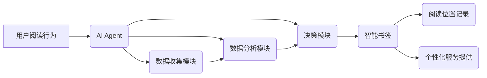

# AI Agent在智能书签中的阅读习惯优化

> 关键词：AI Agent、智能书签、阅读习惯、优化算法、用户行为分析

> 摘要：本文深入探讨了AI Agent在智能书签中对阅读习惯进行优化的相关技术与应用。首先介绍了研究的背景和目的，阐述了相关核心概念及其联系，详细讲解了核心算法原理与具体操作步骤，并结合数学模型和公式进行说明。通过项目实战展示了代码的实际案例和详细解释，分析了其在不同场景下的实际应用。此外，还推荐了相关的学习资源、开发工具框架以及论文著作。最后总结了未来发展趋势与挑战，并提供了常见问题解答和参考资料，旨在为读者全面呈现AI Agent在智能书签阅读习惯优化方面的技术全貌。

## 1. 背景介绍 
### 1.1 目的和范围
随着数字化阅读的普及，人们每天接触到大量的电子书籍、文章等阅读内容。智能书签作为一种辅助阅读的工具，其功能也在不断发展。本研究的目的在于探讨如何利用AI Agent技术对智能书签进行优化，以更好地适应和满足用户的阅读习惯。范围涵盖了从AI Agent的基本原理到智能书签的具体应用，包括算法的设计、实现以及实际场景中的测试和优化。

### 1.2 预期读者
本文预期读者包括对人工智能、软件开发、阅读工具优化等领域感兴趣的专业人士，如程序员、软件架构师、人工智能研究者等。同时，也适合对智能阅读工具有深入了解需求的普通用户。

### 1.3 文档结构概述
本文首先介绍背景信息，包括目的、预期读者和文档结构。接着阐述核心概念与联系，详细讲解核心算法原理和具体操作步骤，并给出数学模型和公式。通过项目实战展示代码案例和分析，探讨实际应用场景。推荐相关的工具和资源，总结未来发展趋势与挑战，最后提供常见问题解答和参考资料。

### 1.4 术语表
#### 1.4.1 核心术语定义
- **AI Agent（人工智能智能体）**：是一种能够感知环境、做出决策并采取行动以实现特定目标的智能实体。在本文中，AI Agent用于分析用户的阅读行为，为智能书签提供优化策略。
- **智能书签**：是一种数字化的书签工具，除了记录阅读位置外，还具备根据用户阅读习惯提供个性化服务的功能。
- **阅读习惯**：指用户在阅读过程中表现出的各种行为模式，如阅读速度、阅读时间、阅读偏好等。

#### 1.4.2 相关概念解释
- **用户行为分析**：通过收集和分析用户在阅读过程中的各种行为数据，如点击、滚动、停留时间等，来了解用户的阅读习惯和需求。
- **个性化推荐**：根据用户的阅读习惯和偏好，为用户推荐相关的阅读内容或提供个性化的阅读服务。

#### 1.4.3 缩略词列表
- **AI**：Artificial Intelligence（人工智能）
- **ML**：Machine Learning（机器学习）
- **DL**：Deep Learning（深度学习）

## 2. 核心概念与联系 

### 核心概念原理
AI Agent在智能书签中的应用主要基于用户行为分析和机器学习算法。AI Agent通过感知用户的阅读行为，如阅读位置、阅读时间、阅读速度等，收集相关数据。然后，利用机器学习算法对这些数据进行分析和建模，以了解用户的阅读习惯和偏好。基于这些分析结果，AI Agent可以为智能书签提供优化策略，如自动标记重要内容、推荐相关阅读材料、调整阅读界面等。

### 架构的文本示意图
```plaintext
用户阅读行为 --> AI Agent（数据收集模块、数据分析模块、决策模块） --> 智能书签（阅读位置记录、个性化服务提供）
```

### Mermaid流程图


## 3. 核心算法原理 & 具体操作步骤 

### 核心算法原理
本系统主要使用聚类算法和推荐算法。聚类算法用于将用户的阅读行为进行分类，以便更好地了解用户的阅读习惯。推荐算法则根据用户的阅读习惯和偏好，为用户推荐相关的阅读内容。

### 具体操作步骤

#### 数据收集
通过智能书签记录用户的阅读行为数据，包括阅读时间、阅读位置、阅读速度、点击行为等。

#### 数据预处理
对收集到的数据进行清洗、归一化等预处理操作，以提高数据的质量和可用性。

#### 聚类分析
使用K-Means聚类算法对用户的阅读行为数据进行聚类，将用户分为不同的阅读群体。

#### 推荐算法
根据用户所在的阅读群体和历史阅读记录，使用协同过滤算法为用户推荐相关的阅读内容。

### Python源代码实现

```python
import numpy as np
from sklearn.cluster import KMeans
from sklearn.preprocessing import StandardScaler

# 数据收集（示例数据）
reading_data = np.array([
    [30, 100, 200],  # 阅读时间、阅读位置、阅读速度
    [60, 200, 300],
    [45, 150, 250],
    [90, 300, 400]
])

# 数据预处理
scaler = StandardScaler()
scaled_data = scaler.fit_transform(reading_data)

# 聚类分析
kmeans = KMeans(n_clusters=2, random_state=42)
kmeans.fit(scaled_data)

# 打印聚类结果
print("聚类标签:", kmeans.labels_)

# 推荐算法（简单示例）
def recommend_content(user_id, cluster_labels, reading_data):
    user_cluster = cluster_labels[user_id]
    cluster_indices = np.where(cluster_labels == user_cluster)[0]
    similar_users_data = reading_data[cluster_indices]
    # 这里可以根据具体需求实现更复杂的推荐逻辑
    recommended_content = []
    for data in similar_users_data:
        if data[0] > 50:  # 简单示例：阅读时间大于50的相关内容
            recommended_content.append(data)
    return recommended_content

# 推荐示例
user_id = 0
recommended_content = recommend_content(user_id, kmeans.labels_, reading_data)
print("推荐内容:", recommended_content)
```

## 4. 数学模型和公式 & 详细讲解 & 举例说明 

### K-Means聚类算法数学模型
K-Means聚类算法的目标是将数据集 $X = \{x_1, x_2, ..., x_n\}$ 划分为 $K$ 个簇 $C = \{C_1, C_2, ..., C_K\}$，使得簇内的样本点到簇中心的距离之和最小。数学公式表示为：

$$
\min_{C}\sum_{k=1}^{K}\sum_{x_i\in C_k}||x_i - \mu_k||^2
$$

其中，$\mu_k$ 是第 $k$ 个簇的中心，$||x_i - \mu_k||$ 表示样本点 $x_i$ 到簇中心 $\mu_k$ 的距离。

### 详细讲解
K-Means聚类算法的基本步骤如下：
1. 随机初始化 $K$ 个簇中心 $\mu_1, \mu_2, ..., \mu_K$。
2. 对于每个样本点 $x_i$，计算其到各个簇中心的距离，将其分配到距离最近的簇中。
3. 重新计算每个簇的中心 $\mu_k$。
4. 重复步骤2和3，直到簇中心不再变化或达到最大迭代次数。

### 举例说明
假设有一个二维数据集 $X = \{(1, 2), (2, 3), (8, 9), (9, 10)\}$，我们要将其划分为2个簇。

1. 随机初始化簇中心：$\mu_1 = (1, 2)$，$\mu_2 = (8, 9)$。
2. 计算每个样本点到簇中心的距离：
    - 对于样本点 $(1, 2)$，到 $\mu_1$ 的距离为 $0$，到 $\mu_2$ 的距离为 $\sqrt{(1 - 8)^2 + (2 - 9)^2} \approx 9.899$，所以将其分配到簇 $C_1$。
    - 对于样本点 $(2, 3)$，到 $\mu_1$ 的距离为 $\sqrt{(2 - 1)^2 + (3 - 2)^2} \approx 1.414$，到 $\mu_2$ 的距离为 $\sqrt{(2 - 8)^2 + (3 - 9)^2} \approx 8.485$，所以将其分配到簇 $C_1$。
    - 对于样本点 $(8, 9)$，到 $\mu_1$ 的距离为 $\sqrt{(8 - 1)^2 + (9 - 2)^2} \approx 9.899$，到 $\mu_2$ 的距离为 $0$，所以将其分配到簇 $C_2$。
    - 对于样本点 $(9, 10)$，到 $\mu_1$ 的距离为 $\sqrt{(9 - 1)^2 + (10 - 2)^2} \approx 11.314$，到 $\mu_2$ 的距离为 $\sqrt{(9 - 8)^2 + (10 - 9)^2} \approx 1.414$，所以将其分配到簇 $C_2$。
3. 重新计算簇中心：
    - 簇 $C_1$ 的中心：$\mu_1 = \frac{(1, 2) + (2, 3)}{2} = (1.5, 2.5)$。
    - 簇 $C_2$ 的中心：$\mu_2 = \frac{(8, 9) + (9, 10)}{2} = (8.5, 9.5)$。
4. 重复步骤2和3，直到簇中心不再变化。

## 5. 项目实战：代码实际案例和详细解释说明 

### 5.1  开发环境搭建
- **操作系统**：Windows 10 或 Linux（如 Ubuntu）
- **编程语言**：Python 3.7 及以上
- **开发工具**：PyCharm 或 VS Code
- **相关库**：NumPy、Pandas、Scikit-learn、Matplotlib

### 5.2  源代码详细实现和代码解读

```python
import numpy as np
import pandas as pd
from sklearn.cluster import KMeans
from sklearn.preprocessing import StandardScaler
import matplotlib.pyplot as plt

# 数据收集（从 CSV 文件读取）
data = pd.read_csv('reading_data.csv')

# 数据预处理
# 提取需要的特征
features = data[['reading_time', 'reading_position', 'reading_speed']]
scaler = StandardScaler()
scaled_features = scaler.fit_transform(features)

# 聚类分析
kmeans = KMeans(n_clusters=3, random_state=42)
kmeans.fit(scaled_features)

# 为数据添加聚类标签
data['cluster_label'] = kmeans.labels_

# 可视化聚类结果
plt.scatter(data['reading_time'], data['reading_position'], c=data['cluster_label'], cmap='viridis')
plt.xlabel('Reading Time')
plt.ylabel('Reading Position')
plt.title('K-Means Clustering of Reading Behavior')
plt.show()

# 推荐算法
def recommend_content(user_id, data):
    user_cluster = data.loc[user_id, 'cluster_label']
    cluster_data = data[data['cluster_label'] == user_cluster]
    similar_users = cluster_data[cluster_data.index != user_id]
    # 简单示例：推荐阅读时间较长的用户的阅读内容
    recommended_users = similar_users[similar_users['reading_time'] > data.loc[user_id, 'reading_time']]
    recommended_content = recommended_users['reading_content'].tolist()
    return recommended_content

# 推荐示例
user_id = 0
recommended_content = recommend_content(user_id, data)
print("推荐内容:", recommended_content)
```

### 5.3  代码解读与分析
1. **数据收集**：从 CSV 文件中读取用户的阅读行为数据。
2. **数据预处理**：提取需要的特征，并使用 `StandardScaler` 对数据进行标准化处理，以消除不同特征之间的量纲差异。
3. **聚类分析**：使用 `KMeans` 算法将用户分为3个簇，并将聚类标签添加到数据中。
4. **可视化**：使用 `matplotlib` 库绘制散点图，直观地展示聚类结果。
5. **推荐算法**：根据用户所在的簇，推荐阅读时间较长的用户的阅读内容。

## 6. 实际应用场景 
### 个性化阅读体验
AI Agent可以根据用户的阅读习惯，为用户提供个性化的阅读体验。例如，根据用户的阅读速度调整阅读界面的字体大小和行间距，根据用户的阅读偏好推荐相关的书籍和文章。

### 阅读进度管理
智能书签可以记录用户的阅读进度，并根据用户的阅读习惯预测用户的阅读时间和剩余阅读量。同时，还可以提醒用户继续阅读，帮助用户更好地管理阅读进度。

### 阅读内容推荐
通过分析用户的阅读行为和偏好，AI Agent可以为用户推荐相关的阅读内容。例如，根据用户的阅读历史推荐同一作者的其他作品，或者推荐与用户当前阅读内容相关的书籍和文章。

### 阅读行为分析
智能书签可以收集用户的阅读行为数据，为出版机构和作者提供有价值的信息。例如，分析用户的阅读偏好和需求，帮助出版机构和作者更好地了解市场需求，优化书籍和文章的内容和推广策略。

## 7. 工具和资源推荐
### 7.1 学习资源推荐
#### 7.1.1 书籍推荐
- 《Python 机器学习》：详细介绍了 Python 在机器学习领域的应用，包括各种机器学习算法的原理和实现。
- 《人工智能：一种现代的方法》：全面介绍了人工智能的基本概念、算法和应用，是人工智能领域的经典教材。
- 《深度学习》：深入探讨了深度学习的原理和应用，是深度学习领域的权威著作。

#### 7.1.2 在线课程
- Coursera 上的《机器学习》课程：由 Andrew Ng 教授主讲，是机器学习领域的经典课程。
- edX 上的《人工智能基础》课程：系统介绍了人工智能的基本概念和算法。
- Udemy 上的《Python 数据科学和机器学习实战》课程：结合实际案例，介绍了 Python 在数据科学和机器学习领域的应用。

#### 7.1.3 技术博客和网站
- Medium：是一个技术博客平台，有很多关于人工智能、机器学习的优秀文章。
- Towards Data Science：专注于数据科学和机器学习领域的技术分享和讨论。
- AI Stack Exchange：是一个人工智能领域的问答社区，可以在这里获取专业的技术解答和建议。

### 7.2 开发工具框架推荐
#### 7.2.1 IDE和编辑器
- PyCharm：是一款专业的 Python 集成开发环境，提供了丰富的代码编辑、调试和项目管理功能。
- VS Code：是一款轻量级的代码编辑器，支持多种编程语言，有丰富的插件生态系统。

#### 7.2.2 调试和性能分析工具
- Py-Spy：是一个 Python 性能分析工具，可以帮助开发者找出代码中的性能瓶颈。
- PDB：是 Python 内置的调试器，可以帮助开发者调试代码中的错误。

#### 7.2.3 相关框架和库
- Scikit-learn：是一个常用的机器学习库，提供了各种机器学习算法的实现。
- TensorFlow：是一个开源的深度学习框架，广泛应用于图像识别、自然语言处理等领域。
- PyTorch：是另一个流行的深度学习框架，具有简洁易用的特点。

### 7.3 相关论文著作推荐
#### 7.3.1 经典论文
- 《A Logical Calculus of the Ideas Immanent in Nervous Activity》：由 Warren McCulloch 和 Walter Pitts 发表，是人工智能领域的经典论文，提出了神经元模型。
- 《Learning Representations by Back-propagating Errors》：由 David Rumelhart、Geoffrey Hinton 和 Ronald Williams 发表，介绍了反向传播算法，是深度学习领域的重要突破。

#### 7.3.2 最新研究成果
- 《Attention Is All You Need》：提出了 Transformer 模型，在自然语言处理领域取得了巨大成功。
- 《Generative Adversarial Nets》：介绍了生成对抗网络（GAN），为生成式模型的发展做出了重要贡献。

#### 7.3.3 应用案例分析
- 《Using Machine Learning to Improve Reading Comprehension》：分析了如何使用机器学习技术提高阅读理解能力。
- 《Personalized Reading Recommendations Based on User Behavior Analysis》：介绍了基于用户行为分析的个性化阅读推荐系统的设计和实现。

## 8. 总结：未来发展趋势与挑战
### 未来发展趋势
- **更智能化的推荐**：随着人工智能技术的不断发展，AI Agent在智能书签中的应用将更加智能化。未来的智能书签将能够更准确地理解用户的阅读需求和偏好，提供更加个性化、精准的阅读推荐。
- **多模态融合**：除了文本信息，未来的智能书签将能够融合图像、音频等多模态信息，为用户提供更加丰富、生动的阅读体验。
- **与其他智能设备的集成**：智能书签将与其他智能设备（如智能手表、智能眼镜等）进行集成，实现跨设备的阅读体验。用户可以在不同的设备上随时随地继续阅读，并获得一致的个性化服务。

### 挑战
- **数据隐私和安全**：AI Agent在智能书签中的应用需要收集大量的用户阅读行为数据，这涉及到用户的隐私和数据安全问题。如何确保用户数据的隐私和安全，是未来发展需要解决的重要问题。
- **算法复杂度和效率**：随着数据量的增加和算法的不断优化，算法的复杂度也会相应增加。如何在保证算法准确性的前提下，提高算法的效率，是需要解决的另一个挑战。
- **用户接受度**：用户对于智能书签的功能和使用方式可能存在一定的认知和接受度问题。如何设计出简单易用、符合用户习惯的智能书签，提高用户的接受度，也是未来发展需要考虑的问题。

## 9. 附录：常见问题与解答
### 1. 如何确保用户数据的隐私和安全？
可以采用数据加密、匿名化处理等技术手段，确保用户数据在收集、存储和传输过程中的安全性。同时，严格遵守相关的法律法规和隐私政策，不将用户数据泄露给第三方。

### 2. 智能书签的推荐算法是如何工作的？
智能书签的推荐算法主要基于用户的阅读行为数据和机器学习算法。通过对用户的阅读历史、阅读时间、阅读速度等数据进行分析，建立用户的阅读模型，然后根据模型为用户推荐相关的阅读内容。

### 3. 智能书签可以在哪些设备上使用？
智能书签可以在多种设备上使用，如手机、平板电脑、电脑等。只要设备支持相关的应用程序或浏览器插件，就可以使用智能书签。

### 4. 如何提高智能书签的性能？
可以通过优化算法、提高数据处理效率、采用分布式计算等技术手段来提高智能书签的性能。同时，定期对智能书签进行维护和升级，确保其性能的稳定性和可靠性。

## 10. 扩展阅读 & 参考资料
### 扩展阅读
- 《智能时代》：介绍了人工智能技术在各个领域的应用和发展趋势。
- 《人类简史：从动物到上帝》：探讨了人类的进化和发展历程，以及人工智能对人类社会的影响。

### 参考资料
- 相关学术论文和研究报告
- 开源代码库和技术文档
- 行业新闻和资讯网站