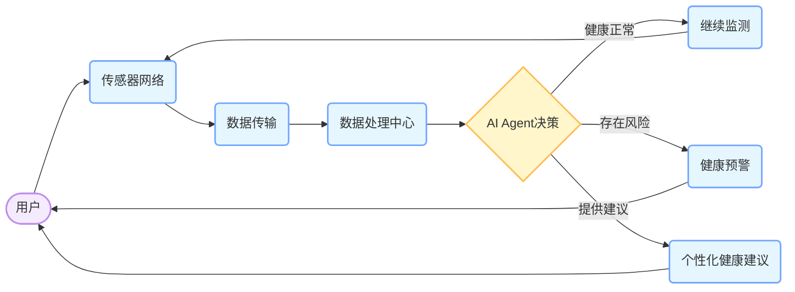

# AI Agent在智能健康监测中的实践

> 关键词：AI Agent、智能健康监测、医疗人工智能、健康数据处理、实时监测

> 摘要：本文聚焦于AI Agent在智能健康监测中的实践应用。随着科技的发展，智能健康监测日益重要，AI Agent凭借其智能决策、自主学习等特性为该领域带来了新的活力。文章深入探讨了AI Agent的核心概念、算法原理、数学模型，通过项目实战展示其在智能健康监测中的具体实现，分析了其实际应用场景，推荐了相关学习资源、开发工具和论文著作，最后总结了未来发展趋势与挑战，并提供常见问题解答及参考资料，旨在为相关领域的研究和实践提供全面而深入的指导。

## 1. 背景介绍 
### 1.1 目的和范围
智能健康监测旨在利用先进的技术手段，对个体的健康状况进行实时、准确的监测和评估，以实现疾病的早期预防、诊断和治疗。AI Agent作为一种智能化的软件实体，具有自主决策、学习和交互的能力，将其应用于智能健康监测领域，可以提高监测的效率和准确性，为用户提供个性化的健康服务。本文的范围涵盖了AI Agent在智能健康监测中的基本概念、核心算法、数学模型、实际应用案例等方面，旨在全面介绍AI Agent在该领域的实践应用。

### 1.2 预期读者
本文预期读者包括从事医疗人工智能、智能健康监测、软件工程等领域的科研人员、开发人员、工程师，以及对智能健康监测技术感兴趣的医疗从业者和普通用户。

### 1.3 文档结构概述
本文共分为十个部分。第一部分介绍背景信息，包括目的和范围、预期读者、文档结构概述和术语表；第二部分阐述AI Agent和智能健康监测的核心概念与联系，并给出相应的示意图和流程图；第三部分讲解AI Agent在智能健康监测中应用的核心算法原理及具体操作步骤，包含Python源代码；第四部分介绍相关的数学模型和公式，并进行详细讲解和举例说明；第五部分通过项目实战展示代码实际案例，并进行详细解释说明；第六部分分析AI Agent在智能健康监测中的实际应用场景；第七部分推荐相关的工具和资源，包括学习资源、开发工具框架和论文著作；第八部分总结未来发展趋势与挑战；第九部分为附录，提供常见问题与解答；第十部分列出扩展阅读和参考资料。

### 1.4 术语表
#### 1.4.1 核心术语定义
- **AI Agent（人工智能代理）**：是一种能够感知环境、自主决策并采取行动以实现特定目标的软件实体。它可以根据环境的变化和自身的经验进行学习和调整。
- **智能健康监测**：利用传感器、信息技术等手段，对个体的生理参数、生活习惯等健康相关信息进行实时、连续的监测和分析，以评估健康状况、预警疾病风险。
- **医疗人工智能**：将人工智能技术应用于医疗领域，包括疾病诊断、治疗方案推荐、健康管理等方面。

#### 1.4.2 相关概念解释
- **传感器网络**：由多个传感器节点组成的网络，用于采集个体的生理参数，如心率、血压、体温等。
- **数据挖掘**：从大量的数据中提取有价值的信息和知识的过程，在智能健康监测中可用于分析健康数据，发现潜在的健康问题。
- **机器学习**：让计算机通过数据学习模式和规律，从而进行预测和决策的技术，是AI Agent实现智能决策和学习的重要手段。

#### 1.4.3 缩略词列表
- **IoT（Internet of Things）**：物联网，指通过各种信息传感器、射频识别技术、全球定位系统等技术，实现物与物、物与人的泛在连接，实现对物品和过程的智能化感知、识别和管理。
- **ML（Machine Learning）**：机器学习
- **DL（Deep Learning）**：深度学习

## 2. 核心概念与联系 
### 2.1 AI Agent的核心概念
AI Agent是一种具有自主性、反应性、社会性和适应性的软件实体。自主性意味着它可以在没有人类干预的情况下自主地感知环境、做出决策并采取行动；反应性表示它能够对环境的变化做出及时的响应；社会性体现为它可以与其他Agent或人类进行交互；适应性则指它能够根据环境的变化和自身的经验进行学习和调整。

AI Agent通常由感知模块、决策模块和行动模块组成。感知模块负责收集环境信息，如健康监测中的生理参数数据；决策模块根据感知到的信息和自身的知识、目标进行决策；行动模块则根据决策结果执行相应的行动，如发出健康预警、提供健康建议等。

### 2.2 智能健康监测的核心概念
智能健康监测是一个综合性的系统，它利用各种传感器技术、通信技术和信息技术，对个体的健康状况进行实时、连续的监测和分析。智能健康监测系统通常包括传感器节点、数据传输模块、数据处理模块和应用服务模块。传感器节点负责采集个体的生理参数和生活习惯等信息；数据传输模块将采集到的数据传输到数据处理中心；数据处理模块对数据进行清洗、分析和挖掘，以提取有价值的信息；应用服务模块则根据分析结果为用户提供个性化的健康服务，如健康评估、疾病预警、健康建议等。

### 2.3 AI Agent与智能健康监测的联系
AI Agent在智能健康监测中扮演着重要的角色。它可以作为智能健康监测系统的核心决策单元，根据实时采集的健康数据进行分析和判断，做出智能决策。例如，当监测到用户的心率异常时，AI Agent可以根据预设的规则和模型，判断用户是否存在健康风险，并及时发出预警。此外，AI Agent还可以通过学习用户的健康数据和行为习惯，为用户提供个性化的健康建议和干预措施，提高用户的健康管理水平。

### 2.4 文本示意图
AI Agent在智能健康监测中的应用可以用以下示意图表示：

用户（佩戴传感器设备） -> 传感器网络（采集生理参数） -> 数据传输（通过IoT技术） -> 数据处理中心（AI Agent进行数据分析和决策） -> 应用服务（健康预警、健康建议等）

### 2.5 Mermaid流程图


## 3. 核心算法原理 & 具体操作步骤 
### 3.1 核心算法原理
在智能健康监测中，AI Agent常用的算法包括机器学习算法和深度学习算法。下面以支持向量机（SVM）和循环神经网络（RNN）为例，介绍其核心算法原理。

#### 3.1.1 支持向量机（SVM）
支持向量机是一种二分类模型，其基本思想是在特征空间中找到一个最优的超平面，使得不同类别的样本能够被最大程度地分开。对于线性可分的数据集，SVM通过求解以下优化问题来找到最优超平面：

$$\min_{w,b} \frac{1}{2} \|w\|^2$$
$$s.t. \quad y_i(w^T x_i + b) \geq 1, \quad i = 1,2,\cdots,n$$

其中，$w$ 是超平面的法向量，$b$ 是偏置，$x_i$ 是第 $i$ 个样本，$y_i \in \{-1,1\}$ 是第 $i$ 个样本的类别标签，$n$ 是样本数量。

对于线性不可分的数据集，SVM引入了松弛变量 $\xi_i$ 和惩罚参数 $C$，将优化问题转化为：

$$\min_{w,b,\xi} \frac{1}{2} \|w\|^2 + C \sum_{i=1}^{n} \xi_i$$
$$s.t. \quad y_i(w^T x_i + b) \geq 1 - \xi_i, \quad \xi_i \geq 0, \quad i = 1,2,\cdots,n$$

#### 3.1.2 循环神经网络（RNN）
循环神经网络是一种专门处理序列数据的神经网络，其主要特点是在网络中引入了循环结构，使得网络能够对序列中的历史信息进行记忆和利用。RNN的基本单元是一个神经元，其输入包括当前时刻的输入 $x_t$ 和上一时刻的隐藏状态 $h_{t-1}$，输出为当前时刻的隐藏状态 $h_t$，计算公式如下：

$$h_t = \tanh(W_{hh} h_{t-1} + W_{xh} x_t + b_h)$$

其中，$W_{hh}$ 是隐藏状态到隐藏状态的权重矩阵，$W_{xh}$ 是输入到隐藏状态的权重矩阵，$b_h$ 是隐藏状态的偏置。

### 3.2 具体操作步骤
#### 3.2.1 数据采集
使用各种传感器设备采集用户的生理参数，如心率、血压、体温等，并将采集到的数据传输到数据处理中心。

#### 3.2.2 数据预处理
对采集到的数据进行清洗、归一化等预处理操作，以提高数据的质量和可用性。

#### 3.2.3 特征提取
从预处理后的数据中提取有代表性的特征，如均值、标准差、峰度等，作为模型的输入。

#### 3.2.4 模型训练
使用支持向量机或循环神经网络等算法对提取的特征进行训练，得到预测模型。

#### 3.2.5 模型评估
使用测试数据集对训练好的模型进行评估，计算模型的准确率、召回率等指标，评估模型的性能。

#### 3.2.6 决策与应用
将训练好的模型集成到AI Agent中，AI Agent根据实时采集的健康数据进行预测和决策，如发出健康预警、提供健康建议等。

### 3.3 Python源代码实现
以下是一个使用支持向量机进行心率异常检测的Python示例代码：

```python
import numpy as np
from sklearn import svm
from sklearn.model_selection import train_test_split
from sklearn.metrics import accuracy_score

# 生成示例数据
np.random.seed(0)
normal_heart_rates = np.random.normal(loc=70, scale=5, size=100)
abnormal_heart_rates = np.random.normal(loc=100, scale=10, size=100)

X = np.concatenate((normal_heart_rates, abnormal_heart_rates)).reshape(-1, 1)
y = np.concatenate((np.zeros(100), np.ones(100)))

# 划分训练集和测试集
X_train, X_test, y_train, y_test = train_test_split(X, y, test_size=0.2, random_state=42)

# 创建SVM分类器
clf = svm.SVC(kernel='linear')

# 训练模型
clf.fit(X_train, y_train)

# 预测
y_pred = clf.predict(X_test)

# 评估模型
accuracy = accuracy_score(y_test, y_pred)
print(f"模型准确率: {accuracy}")
```

## 4. 数学模型和公式 & 详细讲解 & 举例说明 
### 4.1 支持向量机的数学模型和公式
支持向量机的目标是在特征空间中找到一个最优的超平面，使得不同类别的样本能够被最大程度地分开。对于线性可分的数据集，我们可以将超平面表示为：

$$w^T x + b = 0$$

其中，$w$ 是超平面的法向量，$b$ 是偏置，$x$ 是样本点。

为了找到最优超平面，我们需要最大化不同类别的样本到超平面的间隔。间隔可以定义为：

$$\gamma = \frac{2}{\|w\|}$$

因此，支持向量机的优化问题可以表示为：

$$\min_{w,b} \frac{1}{2} \|w\|^2$$
$$s.t. \quad y_i(w^T x_i + b) \geq 1, \quad i = 1,2,\cdots,n$$

其中，$y_i \in \{-1,1\}$ 是第 $i$ 个样本的类别标签，$n$ 是样本数量。

为了解决这个优化问题，我们可以使用拉格朗日乘子法，引入拉格朗日乘子 $\alpha_i \geq 0$，得到拉格朗日函数：

$$L(w,b,\alpha) = \frac{1}{2} \|w\|^2 - \sum_{i=1}^{n} \alpha_i (y_i(w^T x_i + b) - 1)$$

对 $w$ 和 $b$ 求偏导数并令其为0，得到：

$$\frac{\partial L}{\partial w} = w - \sum_{i=1}^{n} \alpha_i y_i x_i = 0$$
$$\frac{\partial L}{\partial b} = -\sum_{i=1}^{n} \alpha_i y_i = 0$$

将上述结果代入拉格朗日函数，得到对偶问题：

$$\max_{\alpha} \sum_{i=1}^{n} \alpha_i - \frac{1}{2} \sum_{i=1}^{n} \sum_{j=1}^{n} \alpha_i \alpha_j y_i y_j x_i^T x_j$$
$$s.t. \quad \sum_{i=1}^{n} \alpha_i y_i = 0, \quad \alpha_i \geq 0, \quad i = 1,2,\cdots,n$$

求解对偶问题得到最优的拉格朗日乘子 $\alpha^*$，然后可以计算出最优的 $w^*$ 和 $b^*$：

$$w^* = \sum_{i=1}^{n} \alpha_i^* y_i x_i$$
$$b^* = y_j - w^{*T} x_j$$

其中，$j$ 是满足 $0 < \alpha_j^* < C$ 的任意一个样本。

### 4.2 举例说明
假设我们有一个二维的线性可分数据集，包含两个类别：正类和负类。数据集如下：

| 样本编号 | $x_1$ | $x_2$ | 类别标签 $y$ |
| ---- | ---- | ---- | ---- |
| 1 | 1 | 2 | 1 |
| 2 | 2 | 3 | 1 |
| 3 | 3 | 1 | -1 |
| 4 | 4 | 2 | -1 |

我们可以使用支持向量机来找到最优超平面。首先，将数据集代入对偶问题的目标函数和约束条件中，得到：

$$\max_{\alpha} \alpha_1 + \alpha_2 + \alpha_3 + \alpha_4 - \frac{1}{2} (\alpha_1^2 + \alpha_2^2 + \alpha_3^2 + \alpha_4^2 + 2\alpha_1\alpha_2 + 2\alpha_1\alpha_3 + 2\alpha_1\alpha_4 + 2\alpha_2\alpha_3 + 2\alpha_2\alpha_4 + 2\alpha_3\alpha_4)$$
$$s.t. \quad \alpha_1 + \alpha_2 - \alpha_3 - \alpha_4 = 0, \quad \alpha_i \geq 0, \quad i = 1,2,3,4$$

通过求解这个对偶问题，我们可以得到最优的拉格朗日乘子 $\alpha^*$，然后计算出最优的 $w^*$ 和 $b^*$，从而得到最优超平面。

### 4.3 循环神经网络的数学模型和公式
循环神经网络的基本单元是一个神经元，其输入包括当前时刻的输入 $x_t$ 和上一时刻的隐藏状态 $h_{t-1}$，输出为当前时刻的隐藏状态 $h_t$，计算公式如下：

$$h_t = \tanh(W_{hh} h_{t-1} + W_{xh} x_t + b_h)$$

其中，$W_{hh}$ 是隐藏状态到隐藏状态的权重矩阵，$W_{xh}$ 是输入到隐藏状态的权重矩阵，$b_h$ 是隐藏状态的偏置。

循环神经网络的输出可以通过以下公式计算：

$$y_t = W_{hy} h_t + b_y$$

其中，$W_{hy}$ 是隐藏状态到输出的权重矩阵，$b_y$ 是输出的偏置。

### 4.4 举例说明
假设我们有一个简单的循环神经网络，输入维度为2，隐藏维度为3，输出维度为1。在某个时刻 $t$，输入 $x_t = [1, 2]^T$，上一时刻的隐藏状态 $h_{t-1} = [0.1, 0.2, 0.3]^T$。权重矩阵和偏置如下：

$$W_{xh} = \begin{bmatrix} 0.1 & 0.2 \\ 0.3 & 0.4 \\ 0.5 & 0.6 \end{bmatrix}$$
$$W_{hh} = \begin{bmatrix} 0.7 & 0.8 & 0.9 \\ 0.1 & 0.2 & 0.3 \\ 0.4 & 0.5 & 0.6 \end{bmatrix}$$
$$b_h = \begin{bmatrix} 0.1 \\ 0.2 \\ 0.3 \end{bmatrix}$$
$$W_{hy} = \begin{bmatrix} 0.1 & 0.2 & 0.3 \end{bmatrix}$$
$$b_y = [0.1]$$

首先，计算当前时刻的隐藏状态 $h_t$：

$$W_{xh} x_t = \begin{bmatrix} 0.1 & 0.2 \\ 0.3 & 0.4 \\ 0.5 & 0.6 \end{bmatrix} \begin{bmatrix} 1 \\ 2 \end{bmatrix} = \begin{bmatrix} 0.5 \\ 1.1 \\ 1.7 \end{bmatrix}$$

$$W_{hh} h_{t-1} = \begin{bmatrix} 0.7 & 0.8 & 0.9 \\ 0.1 & 0.2 & 0.3 \\ 0.4 & 0.5 & 0.6 \end{bmatrix} \begin{bmatrix} 0.1 \\ 0.2 \\ 0.3 \end{bmatrix} = \begin{bmatrix} 0.5 \\ 0.14 \\ 0.32 \end{bmatrix}$$

$$W_{hh} h_{t-1} + W_{xh} x_t + b_h = \begin{bmatrix} 0.5 \\ 0.14 \\ 0.32 \end{bmatrix} + \begin{bmatrix} 0.5 \\ 1.1 \\ 1.7 \end{bmatrix} + \begin{bmatrix} 0.1 \\ 0.2 \\ 0.3 \end{bmatrix} = \begin{bmatrix} 1.1 \\ 1.44 \\ 2.32 \end{bmatrix}$$

$$h_t = \tanh(W_{hh} h_{t-1} + W_{xh} x_t + b_h) = \begin{bmatrix} \tanh(1.1) \\ \tanh(1.44) \\ \tanh(2.32) \end{bmatrix} \approx \begin{bmatrix} 0.80 \\ 0.90 \\ 0.98 \end{bmatrix}$$

然后，计算当前时刻的输出 $y_t$：

$$y_t = W_{hy} h_t + b_y = \begin{bmatrix} 0.1 & 0.2 & 0.3 \end{bmatrix} \begin{bmatrix} 0.80 \\ 0.90 \\ 0.98 \end{bmatrix} + 0.1 \approx 0.65$$

## 5. 项目实战：代码实际案例和详细解释说明 
### 5.1  开发环境搭建
#### 5.1.1 安装Python
首先，需要安装Python开发环境。可以从Python官方网站（https://www.python.org/downloads/）下载适合自己操作系统的Python版本，并按照安装向导进行安装。

#### 5.1.2 安装必要的库
在智能健康监测项目中，需要使用一些Python库，如NumPy、Pandas、Scikit-learn、TensorFlow等。可以使用以下命令进行安装：

```bash
pip install numpy pandas scikit-learn tensorflow
```

#### 5.1.3 选择开发工具
可以选择PyCharm、Jupyter Notebook等开发工具进行代码编写和调试。

### 5.2  源代码详细实现和代码解读
以下是一个使用深度学习模型进行心率预测的项目实战代码：

```python
import numpy as np
import pandas as pd
from sklearn.preprocessing import MinMaxScaler
from tensorflow.keras.models import Sequential
from tensorflow.keras.layers import LSTM, Dense
import matplotlib.pyplot as plt

# 读取数据
data = pd.read_csv('heart_rate_data.csv')
heart_rates = data['heart_rate'].values.reshape(-1, 1)

# 数据预处理
scaler = MinMaxScaler(feature_range=(0, 1))
scaled_heart_rates = scaler.fit_transform(heart_rates)

# 划分训练集和测试集
train_size = int(len(scaled_heart_rates) * 0.8)
train_data = scaled_heart_rates[:train_size]
test_data = scaled_heart_rates[train_size:]

# 准备训练数据
def create_dataset(dataset, time_step=1):
    X, Y = [], []
    for i in range(len(dataset)-time_step-1):
        a = dataset[i:(i+time_step), 0]
        X.append(a)
        Y.append(dataset[i + time_step, 0])
    return np.array(X), np.array(Y)

time_step = 100
X_train, y_train = create_dataset(train_data, time_step)
X_test, y_test = create_dataset(test_data, time_step)

# 调整输入数据的形状
X_train = X_train.reshape(X_train.shape[0], X_train.shape[1], 1)
X_test = X_test.reshape(X_test.shape[0], X_test.shape[1], 1)

# 创建LSTM模型
model = Sequential()
model.add(LSTM(50, return_sequences=True, input_shape=(time_step, 1)))
model.add(LSTM(50, return_sequences=True))
model.add(LSTM(50))
model.add(Dense(1))
model.compile(optimizer='adam', loss='mean_squared_error')

# 训练模型
model.fit(X_train, y_train, epochs=100, batch_size=64, verbose=1)

# 预测
train_predict = model.predict(X_train)
test_predict = model.predict(X_test)

# 反归一化
train_predict = scaler.inverse_transform(train_predict)
test_predict = scaler.inverse_transform(test_predict)

# 绘制结果
look_back = time_step
trainPredictPlot = np.empty_like(heart_rates)
trainPredictPlot[:, :] = np.nan
trainPredictPlot[look_back:len(train_predict)+look_back, :] = train_predict

testPredictPlot = np.empty_like(heart_rates)
testPredictPlot[:, :] = np.nan
testPredictPlot[len(train_predict)+(look_back*2)+1:len(heart_rates)-1, :] = test_predict

plt.plot(heart_rates, label='Actual Heart Rate')
plt.plot(trainPredictPlot, label='Train Predict')
plt.plot(testPredictPlot, label='Test Predict')
plt.legend()
plt.show()
```

### 5.3  代码解读与分析
#### 5.3.1 数据读取与预处理
- 使用 `pandas` 库读取包含心率数据的CSV文件。
- 使用 `MinMaxScaler` 对心率数据进行归一化处理，将数据缩放到0到1的范围内。

#### 5.3.2 划分训练集和测试集
- 将归一化后的数据按照80%和20%的比例划分为训练集和测试集。

#### 5.3.3 准备训练数据
- 定义 `create_dataset` 函数，将时间序列数据转换为适合LSTM模型输入的格式。
- 将训练集和测试集分别转换为输入特征 `X` 和目标值 `Y`。

#### 5.3.4 创建LSTM模型
- 使用 `Sequential` 模型构建一个包含三个LSTM层和一个全连接层的深度学习模型。
- 使用 `adam` 优化器和均方误差损失函数进行模型编译。

#### 5.3.5 训练模型
- 使用 `fit` 方法对模型进行训练，设置训练轮数为100，批量大小为64。

#### 5.3.6 预测与反归一化
- 使用训练好的模型对训练集和测试集进行预测。
- 使用 `scaler.inverse_transform` 对预测结果进行反归一化处理，得到实际的心率值。

#### 5.3.7 绘制结果
- 使用 `matplotlib` 库绘制实际心率值、训练集预测值和测试集预测值的折线图，直观展示模型的预测效果。

## 6. 实际应用场景 
### 6.1 个人健康管理
AI Agent可以集成到智能手环、智能手表等可穿戴设备中，实时监测用户的心率、血压、睡眠质量等生理参数。根据监测数据，AI Agent可以为用户提供个性化的健康建议，如运动计划、饮食建议、休息提醒等，帮助用户更好地管理自己的健康。

### 6.2 疾病预警与诊断
在医疗机构中，AI Agent可以辅助医生进行疾病预警和诊断。通过对患者的病历、检查报告、生理参数等多源数据进行分析，AI Agent可以发现潜在的健康问题，并及时发出预警。此外，AI Agent还可以利用机器学习和深度学习算法对疾病进行诊断，为医生提供决策支持。

### 6.3 远程医疗
AI Agent在远程医疗中也具有重要的应用价值。通过远程监测患者的健康状况，AI Agent可以实时了解患者的病情变化，并及时与医生进行沟通。医生可以根据AI Agent提供的信息，为患者提供远程诊断和治疗建议，实现远程医疗服务。

### 6.4 健康保险
健康保险公司可以利用AI Agent对投保人的健康状况进行评估和监测。通过分析投保人的健康数据，AI Agent可以为保险公司提供风险评估报告，帮助保险公司制定合理的保险费率。同时，AI Agent还可以为投保人提供健康管理服务，促进投保人的健康，降低保险赔付风险。

## 7. 工具和资源推荐
### 7.1 学习资源推荐
#### 7.1.1 书籍推荐
- 《机器学习》（周志华著）：全面介绍了机器学习的基本概念、算法和应用，是机器学习领域的经典教材。
- 《深度学习》（Ian Goodfellow、Yoshua Bengio和Aaron Courville著）：系统阐述了深度学习的理论和实践，是深度学习领域的权威著作。
- 《Python机器学习实战》（Sebastian Raschka和Vahid Mirjalili著）：通过实际案例介绍了如何使用Python进行机器学习项目开发，适合初学者学习。

#### 7.1.2 在线课程
- Coursera上的“机器学习”课程（Andrew Ng教授主讲）：是一门非常经典的机器学习入门课程，介绍了机器学习的基本概念、算法和应用。
- edX上的“深度学习微硕士学位项目”：提供了深度学习领域的系统学习课程，包括神经网络、卷积神经网络、循环神经网络等内容。
- 中国大学MOOC上的“人工智能基础”课程：介绍了人工智能的基本概念、算法和应用，适合初学者了解人工智能领域。

#### 7.1.3 技术博客和网站
- Medium：是一个技术博客平台，上面有很多关于人工智能、机器学习、深度学习等领域的优秀文章。
- arXiv：是一个预印本论文平台，提供了大量关于人工智能、机器学习、深度学习等领域的最新研究成果。
- Kaggle：是一个数据科学竞赛平台，上面有很多关于机器学习、深度学习等领域的实际案例和数据集，可以帮助学习者提高实践能力。

### 7.2 开发工具框架推荐
#### 7.2.1 IDE和编辑器
- PyCharm：是一款专门为Python开发设计的集成开发环境，具有代码编辑、调试、自动补全、版本控制等功能，适合Python项目开发。
- Jupyter Notebook：是一个交互式的开发环境，支持Python、R等多种编程语言，适合数据探索、模型训练和可视化等工作。
- Visual Studio Code：是一款轻量级的代码编辑器，支持多种编程语言和插件扩展，适合快速开发和调试。

#### 7.2.2 调试和性能分析工具
- TensorBoard：是TensorFlow的可视化工具，可以帮助开发者可视化模型的训练过程、网络结构、指标变化等信息，方便调试和优化模型。
- PyTorch Profiler：是PyTorch的性能分析工具，可以帮助开发者分析模型的性能瓶颈，优化模型的运行效率。
- cProfile：是Python的内置性能分析工具，可以帮助开发者分析Python代码的性能瓶颈，优化代码的运行效率。

#### 7.2.3 相关框架和库
- TensorFlow：是一个开源的机器学习框架，提供了丰富的深度学习模型和工具，支持分布式训练和部署。
- PyTorch：是一个开源的深度学习框架，具有动态计算图、易于使用等特点，适合快速开发和研究。
- Scikit-learn：是一个开源的机器学习库，提供了丰富的机器学习算法和工具，适合初学者学习和使用。

### 7.3 相关论文著作推荐
#### 7.3.1 经典论文
- “Support-Vector Networks”（Cortes和Vapnik著）：首次提出了支持向量机的概念和算法，是支持向量机领域的经典论文。
- “Long Short-Term Memory”（Hochreiter和Schmidhuber著）：首次提出了长短期记忆网络（LSTM）的概念和算法，是循环神经网络领域的经典论文。
- “ImageNet Classification with Deep Convolutional Neural Networks”（Krizhevsky、Sutskever和Hinton著）：首次提出了深度卷积神经网络（CNN）在图像分类任务中的应用，是深度学习领域的经典论文。

#### 7.3.2 最新研究成果
- 关注顶级学术会议如NeurIPS、ICML、CVPR等的最新研究成果，了解AI Agent和智能健康监测领域的最新技术和发展趋势。
- 关注顶级学术期刊如Journal of Artificial Intelligence Research、Artificial Intelligence等的最新研究论文，了解相关领域的前沿研究。

#### 7.3.3 应用案例分析
- 参考相关的学术论文和技术报告，了解AI Agent在智能健康监测中的实际应用案例，学习其实现方法和经验教训。
- 关注行业内的优秀企业和创新项目，了解他们在智能健康监测领域的实践经验和创新成果。

## 8. 总结：未来发展趋势与挑战
### 8.1 未来发展趋势
#### 8.1.1 多模态数据融合
未来的智能健康监测系统将不仅仅依赖于单一的生理参数数据，而是会融合多种模态的数据，如生理参数、影像数据、基因数据等。AI Agent将能够对这些多模态数据进行综合分析和处理，提供更全面、准确的健康评估和诊断。

#### 8.1.2 个性化健康服务
随着人们对健康管理的需求不断提高，未来的智能健康监测系统将更加注重个性化服务。AI Agent将能够根据用户的个体差异，如年龄、性别、基因、生活习惯等，为用户提供个性化的健康建议和干预措施，实现精准健康管理。

#### 8.1.3 与物联网和区块链技术的结合
物联网技术的发展将使得智能健康监测设备更加普及和智能化，能够实时、准确地采集用户的健康数据。区块链技术的应用将保障健康数据的安全和隐私，实现数据的可信共享和流通。AI Agent将与物联网和区块链技术深度融合，构建更加安全、高效的智能健康监测生态系统。

#### 8.1.4 强化学习在健康监测中的应用
强化学习是一种通过智能体与环境进行交互来学习最优策略的机器学习方法。未来，强化学习将在智能健康监测中得到更广泛的应用。例如，AI Agent可以通过强化学习算法，根据用户的健康状况和行为习惯，动态调整健康干预策略，提高健康管理的效果。

### 8.2 挑战
#### 8.2.1 数据质量和隐私保护
智能健康监测系统需要处理大量的用户健康数据，数据的质量和隐私保护是至关重要的。数据质量问题可能会影响AI Agent的决策准确性，而隐私泄露问题则会引起用户的担忧。因此，如何保证数据的质量和安全，是智能健康监测领域面临的重要挑战。

#### 8.2.2 算法可解释性
AI Agent在智能健康监测中通常使用复杂的机器学习和深度学习算法，这些算法的可解释性较差。在医疗领域，医生和患者需要了解AI Agent的决策依据，以便做出合理的决策。因此，如何提高算法的可解释性，是智能健康监测领域需要解决的问题。

#### 8.2.3 技术标准和规范
目前，智能健康监测领域缺乏统一的技术标准和规范，不同的设备和系统之间的数据格式、接口协议等存在差异，这给数据的共享和集成带来了困难。因此，制定统一的技术标准和规范，是促进智能健康监测领域发展的关键。

#### 8.2.4 伦理和法律问题
AI Agent在智能健康监测中的应用涉及到一系列的伦理和法律问题，如责任认定、数据所有权、算法偏见等。如何解决这些伦理和法律问题，保障用户的合法权益，是智能健康监测领域需要面对的挑战。

## 9. 附录：常见问题与解答
### 9.1 什么是AI Agent？
AI Agent是一种能够感知环境、自主决策并采取行动以实现特定目标的软件实体。它可以根据环境的变化和自身的经验进行学习和调整。

### 9.2 AI Agent在智能健康监测中有哪些优势？
AI Agent在智能健康监测中具有以下优势：
- 智能决策：能够根据实时采集的健康数据进行分析和判断，做出智能决策。
- 个性化服务：可以根据用户的个体差异，为用户提供个性化的健康建议和干预措施。
- 实时监测：能够实时、连续地监测用户的健康状况，及时发现潜在的健康问题。
- 学习和适应能力：可以通过学习用户的健康数据和行为习惯，不断优化自身的决策和服务。

### 9.3 如何保证智能健康监测数据的安全和隐私？
可以采取以下措施保证智能健康监测数据的安全和隐私：
- 数据加密：对采集到的健康数据进行加密处理，防止数据在传输和存储过程中被泄露。
- 访问控制：设置严格的访问权限，只有授权的人员才能访问健康数据。
- 匿名化处理：对健康数据进行匿名化处理，去除用户的个人身份信息，保护用户的隐私。
- 区块链技术：利用区块链技术的去中心化、不可篡改等特性，保障健康数据的安全和可信共享。

### 9.4 AI Agent在智能健康监测中的决策依据是什么？
AI Agent在智能健康监测中的决策依据主要包括以下几个方面：
- 健康数据：实时采集的用户生理参数、生活习惯等健康数据。
- 医学知识：存储在知识库中的医学知识和专家经验。
- 机器学习模型：通过对大量健康数据的学习和训练得到的机器学习模型。
- 规则和策略：预设的规则和策略，如健康预警阈值、健康干预策略等。

### 9.5 如何评估AI Agent在智能健康监测中的性能？
可以从以下几个方面评估AI Agent在智能健康监测中的性能：
- 准确性：评估AI Agent的决策和预测结果与实际情况的符合程度。
- 召回率：评估AI Agent能够正确识别出的健康问题的比例。
- 特异性：评估AI Agent能够正确识别出健康个体的比例。
- 及时性：评估AI Agent能够及时发现健康问题并发出预警的能力。
- 用户满意度：评估用户对AI Agent提供的健康服务的满意度。

## 10. 扩展阅读 & 参考资料
### 10.1 扩展阅读
- 《人工智能：现代方法》（Stuart Russell和Peter Norvig著）：全面介绍了人工智能的基本概念、算法和应用，是人工智能领域的经典教材。
- 《数据挖掘：概念与技术》（Jiawei Han、Jian Pei和Jianying Yin著）：系统阐述了数据挖掘的理论和实践，是数据挖掘领域的权威著作。
- 《智能医疗：从概念到实践》（Mark D. Ryan和David J. Hanley著）：介绍了智能医疗的基本概念、技术和应用，对AI Agent在智能健康监测中的应用有深入的探讨。

### 10.2 参考资料
- 相关学术论文和研究报告，如发表在IEEE Transactions on Biomedical Engineering、Journal of Medical Internet Research等期刊上的论文。
- 行业标准和规范，如国际标准化组织（ISO）、电气和电子工程师协会（IEEE）等发布的相关标准。
- 智能健康监测设备和系统的技术文档和用户手册。