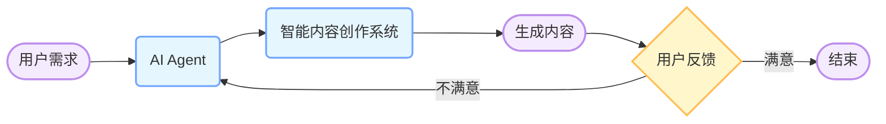

# AI Agent在智能内容创作中的应用

> 关键词：AI Agent、智能内容创作、自然语言处理、机器学习、自动化创作、内容生成、智能交互

> 摘要：本文深入探讨了AI Agent在智能内容创作中的应用。首先介绍了相关背景，包括目的范围、预期读者等内容。接着阐述了AI Agent及智能内容创作的核心概念与联系，展示了其原理和架构。详细讲解了核心算法原理及具体操作步骤，并结合数学模型和公式进行分析。通过项目实战案例，对代码实现和解读进行了深入剖析。探讨了AI Agent在智能内容创作中的实际应用场景，推荐了相关的学习资源、开发工具框架以及论文著作。最后总结了未来发展趋势与挑战，提供了常见问题解答和扩展阅读参考资料，旨在全面呈现AI Agent在智能内容创作领域的重要作用和发展前景。

## 1. 背景介绍 
### 1.1 目的和范围
随着人工智能技术的飞速发展，AI Agent在各个领域的应用越来越广泛，智能内容创作领域也不例外。本文的目的在于全面深入地探讨AI Agent在智能内容创作中的应用，涵盖从基本概念到实际应用案例的各个方面，分析其技术原理、优势和面临的挑战，为相关研究人员、开发者以及对该领域感兴趣的读者提供一个系统的参考。范围包括AI Agent的核心概念、相关算法原理、数学模型，以及在智能内容创作中的具体应用场景和实际项目案例等。

### 1.2 预期读者
本文预期读者包括但不限于人工智能领域的研究人员、软件开发者、内容创作者、技术爱好者、相关专业的学生等。对于研究人员，本文可以提供最新的技术动态和研究思路；对于开发者，可作为技术实现的参考指南；对于内容创作者，有助于了解如何借助AI Agent提升创作效率和质量；对于技术爱好者和学生，可以作为了解该领域的入门资料。

### 1.3 文档结构概述
本文首先介绍背景信息，包括目的范围、预期读者等。接着阐述AI Agent和智能内容创作的核心概念与联系，展示其原理和架构。然后详细讲解核心算法原理及具体操作步骤，结合数学模型和公式进行分析。通过项目实战案例，对代码实现和解读进行深入剖析。探讨AI Agent在智能内容创作中的实际应用场景，推荐相关的学习资源、开发工具框架以及论文著作。最后总结未来发展趋势与挑战，提供常见问题解答和扩展阅读参考资料。

### 1.4 术语表
#### 1.4.1 核心术语定义
- **AI Agent（人工智能智能体）**：是一种能够感知环境、根据感知信息进行决策并采取行动以实现特定目标的智能实体。它可以自主地与环境进行交互，通过学习和推理来适应不同的任务和场景。
- **智能内容创作**：指利用人工智能技术，如自然语言处理、机器学习等，自动或辅助生成各种类型的内容，包括文本、图像、视频等。

#### 1.4.2 相关概念解释
- **自然语言处理（NLP）**：是人工智能的一个重要分支，主要研究如何让计算机理解、处理和生成人类语言。在智能内容创作中，NLP技术用于文本的生成、语法检查、语义理解等任务。
- **机器学习（ML）**：是一门多领域交叉学科，涉及概率论、统计学、逼近论、凸分析、算法复杂度理论等多门学科。它专门研究计算机怎样模拟或实现人类的学习行为，以获取新的知识或技能，重新组织已有的知识结构使之不断改善自身的性能。在AI Agent中，机器学习算法用于训练智能体，使其能够从数据中学习规律，提高决策和行动的准确性。

#### 1.4.3 缩略词列表
- **NLP**：Natural Language Processing（自然语言处理）
- **ML**：Machine Learning（机器学习）
- **AI**：Artificial Intelligence（人工智能）

## 2. 核心概念与联系 
### 2.1 AI Agent核心概念原理
AI Agent的核心原理基于感知、决策和行动三个关键环节。感知模块负责收集环境信息，例如在智能内容创作中，感知模块可以获取用户的需求、当前的内容创作状态等信息。决策模块根据感知到的信息，运用各种算法和模型进行推理和判断，确定下一步的行动策略。行动模块则根据决策结果，执行相应的操作，如生成文本、修改内容等。

AI Agent的架构通常包括以下几个部分：
- **环境接口**：用于与外部环境进行交互，接收环境信息并将智能体的行动反馈给环境。
- **感知器**：负责从环境接口中提取有用的信息，并将其转换为智能体能够处理的格式。
- **决策器**：根据感知器提供的信息，运用各种算法和模型进行决策，选择最优的行动方案。
- **执行器**：根据决策器的决策结果，执行相应的行动，与环境进行交互。

### 2.2 智能内容创作核心概念原理
智能内容创作的核心原理是利用人工智能技术，特别是自然语言处理和机器学习技术，对大量的文本数据进行学习和分析，从而生成符合用户需求的内容。在自然语言处理方面，主要涉及文本生成、语法检查、语义理解等技术。在机器学习方面，通过训练各种模型，如神经网络模型、循环神经网络模型等，让计算机能够学习到文本的模式和规律，从而生成高质量的内容。

智能内容创作的架构通常包括以下几个部分：
- **数据采集模块**：负责收集各种类型的文本数据，如新闻、小说、论文等。
- **数据预处理模块**：对采集到的数据进行清洗、标注、分词等预处理操作，以便后续的模型训练。
- **模型训练模块**：使用预处理后的数据对各种机器学习模型进行训练，优化模型的参数。
- **内容生成模块**：根据用户的需求和训练好的模型，生成相应的内容。

### 2.3 AI Agent与智能内容创作的联系
AI Agent与智能内容创作之间存在着密切的联系。AI Agent可以作为智能内容创作的核心驱动力量，通过感知用户的需求和环境信息，运用决策模块选择合适的创作策略，然后通过执行器生成相应的内容。在智能内容创作过程中，AI Agent可以不断地与用户进行交互，根据用户的反馈调整创作策略，提高内容的质量和符合度。同时，智能内容创作的相关技术和数据也可以为AI Agent的训练和优化提供支持，使其能够更好地适应不同的创作任务和场景。

### 2.4 文本示意图
AI Agent在智能内容创作中的应用架构可以用以下文本示意图表示：

用户需求 -> AI Agent（感知模块 -> 决策模块 -> 执行模块） -> 智能内容创作系统（数据采集 -> 数据预处理 -> 模型训练 -> 内容生成） -> 生成内容 -> 用户反馈 -> AI Agent（更新感知和决策）

### 2.5 Mermaid流程图


## 3. 核心算法原理 & 具体操作步骤 
### 3.1 核心算法原理
在AI Agent应用于智能内容创作中，常用的核心算法包括基于规则的算法、机器学习算法和深度学习算法等。

#### 3.1.1 基于规则的算法
基于规则的算法是一种传统的人工智能算法，它通过预先定义的规则来进行决策和行动。在智能内容创作中，基于规则的算法可以用于语法检查、词汇选择等任务。例如，定义一些语法规则和词汇搭配规则，当生成的文本不符合这些规则时，进行相应的修改。

#### 3.1.2 机器学习算法
机器学习算法通过对大量的数据进行学习，从中发现规律和模式，从而进行预测和决策。在智能内容创作中，常用的机器学习算法包括决策树、支持向量机、朴素贝叶斯等。这些算法可以用于文本分类、情感分析等任务，帮助AI Agent更好地理解用户需求和文本内容。

#### 3.1.3 深度学习算法
深度学习算法是机器学习的一个分支，它通过构建多层神经网络来学习数据的特征和模式。在智能内容创作中，深度学习算法被广泛应用于文本生成、图像生成等任务。例如，基于循环神经网络（RNN）、长短时记忆网络（LSTM）、门控循环单元（GRU）等模型的文本生成算法，可以生成高质量的自然语言文本。

### 3.2 具体操作步骤
以下是AI Agent在智能内容创作中的具体操作步骤，以文本生成任务为例，使用Python语言实现：

#### 3.2.1 数据准备
首先，需要收集和准备大量的文本数据，例如新闻、小说、论文等。然后对数据进行预处理，包括清洗、标注、分词等操作。

```python
import re
import jieba

# 清洗文本数据
def clean_text(text):
    text = re.sub(r'[^\u4e00-\u9fa5a-zA-Z0-9]', ' ', text)
    text = text.strip()
    return text

# 分词
def tokenize_text(text):
    tokens = jieba.lcut(text)
    return tokens

# 示例数据
data = "这是一个示例文本，用于演示数据预处理过程。"
cleaned_data = clean_text(data)
tokenized_data = tokenize_text(cleaned_data)
print("清洗后的数据：", cleaned_data)
print("分词后的数据：", tokenized_data)
```

#### 3.2.2 模型训练
选择合适的深度学习模型，例如LSTM模型，对预处理后的数据进行训练。

```python
import numpy as np
from tensorflow.keras.preprocessing.text import Tokenizer
from tensorflow.keras.preprocessing.sequence import pad_sequences
from tensorflow.keras.models import Sequential
from tensorflow.keras.layers import Embedding, LSTM, Dense

# 准备训练数据
texts = ["这是一个示例句子", "另一个示例句子"]
tokenizer = Tokenizer()
tokenizer.fit_on_texts(texts)
sequences = tokenizer.texts_to_sequences(texts)
max_sequence_length = max([len(seq) for seq in sequences])
padded_sequences = pad_sequences(sequences, maxlen=max_sequence_length)

# 构建LSTM模型
model = Sequential()
model.add(Embedding(input_dim=len(tokenizer.word_index) + 1, output_dim=100, input_length=max_sequence_length))
model.add(LSTM(128))
model.add(Dense(len(tokenizer.word_index) + 1, activation='softmax'))

# 编译模型
model.compile(loss='categorical_crossentropy', optimizer='adam')

# 训练模型
model.fit(padded_sequences, np.zeros((len(padded_sequences), len(tokenizer.word_index) + 1)), epochs=10)
```

#### 3.2.3 内容生成
使用训练好的模型，根据用户的需求生成相应的文本内容。

```python
# 生成文本
def generate_text(model, tokenizer, seed_text, max_length, num_words):
    for _ in range(num_words):
        token_list = tokenizer.texts_to_sequences([seed_text])[0]
        token_list = pad_sequences([token_list], maxlen=max_length)
        predicted = model.predict(token_list, verbose=0)
        predicted_index = np.argmax(predicted)
        output_word = ""
        for word, index in tokenizer.word_index.items():
            if index == predicted_index:
                output_word = word
                break
        seed_text += " " + output_word
    return seed_text

# 示例生成
seed_text = "这是"
generated_text = generate_text(model, tokenizer, seed_text, max_sequence_length, 5)
print("生成的文本：", generated_text)
```

## 4. 数学模型和公式 & 详细讲解 & 举例说明 
### 4.1 机器学习模型的数学基础
#### 4.1.1 线性回归模型
线性回归模型是一种基本的机器学习模型，用于预测连续值。其数学模型可以表示为：

$$y = \theta_0 + \theta_1x_1 + \theta_2x_2 + \cdots + \theta_nx_n + \epsilon$$

其中，$y$ 是预测值，$x_1, x_2, \cdots, x_n$ 是输入特征，$\theta_0, \theta_1, \cdots, \theta_n$ 是模型的参数，$\epsilon$ 是误差项。

线性回归模型的目标是找到一组最优的参数 $\theta$，使得预测值 $y$ 与真实值之间的误差最小。常用的损失函数是均方误差（MSE）：

$$MSE = \frac{1}{m}\sum_{i=1}^{m}(y^{(i)} - \hat{y}^{(i)})^2$$

其中，$m$ 是样本数量，$y^{(i)}$ 是第 $i$ 个样本的真实值，$\hat{y}^{(i)}$ 是第 $i$ 个样本的预测值。

通过最小化均方误差，可以得到最优的参数 $\theta$。在实际应用中，可以使用梯度下降法等优化算法来求解最优参数。

#### 4.1.2 逻辑回归模型
逻辑回归模型是一种用于分类问题的机器学习模型。其数学模型可以表示为：

$$P(y = 1|x) = \frac{1}{1 + e^{-z}}$$

其中，$P(y = 1|x)$ 是样本 $x$ 属于正类的概率，$z = \theta_0 + \theta_1x_1 + \theta_2x_2 + \cdots + \theta_nx_n$ 是线性组合。

逻辑回归模型的目标是找到一组最优的参数 $\theta$，使得模型对样本的分类准确率最高。常用的损失函数是对数损失函数：

$$J(\theta) = -\frac{1}{m}\sum_{i=1}^{m}[y^{(i)}\log(P(y^{(i)} = 1|x^{(i)})) + (1 - y^{(i)})\log(1 - P(y^{(i)} = 1|x^{(i)}))]$$

其中，$m$ 是样本数量，$y^{(i)}$ 是第 $i$ 个样本的真实标签，$P(y^{(i)} = 1|x^{(i)})$ 是第 $i$ 个样本属于正类的概率。

同样，可以使用梯度下降法等优化算法来求解最优参数。

### 4.2 深度学习模型的数学基础
#### 4.2.1 神经网络模型
神经网络模型是一种复杂的深度学习模型，由多个神经元组成。每个神经元的输出可以表示为：

$$a_j^{[l]} = f(\sum_{i=1}^{n_{l-1}}w_{ji}^{[l]}a_i^{[l-1]} + b_j^{[l]})$$

其中，$a_j^{[l]}$ 是第 $l$ 层第 $j$ 个神经元的输出，$w_{ji}^{[l]}$ 是第 $l$ 层第 $j$ 个神经元与第 $l - 1$ 层第 $i$ 个神经元之间的权重，$b_j^{[l]}$ 是第 $l$ 层第 $j$ 个神经元的偏置，$f$ 是激活函数。

常用的激活函数包括 sigmoid 函数、ReLU 函数等。

神经网络模型的目标是通过调整权重和偏置，使得模型对输入数据的预测结果与真实结果之间的误差最小。常用的损失函数是交叉熵损失函数：

$$J(W, b) = -\frac{1}{m}\sum_{i=1}^{m}\sum_{k=1}^{K}y_k^{(i)}\log(\hat{y}_k^{(i)})$$

其中，$m$ 是样本数量，$K$ 是类别数量，$y_k^{(i)}$ 是第 $i$ 个样本的真实标签的第 $k$ 个分量，$\hat{y}_k^{(i)}$ 是第 $i$ 个样本的预测标签的第 $k$ 个分量。

可以使用反向传播算法来计算损失函数对权重和偏置的梯度，然后使用梯度下降法等优化算法来更新权重和偏置。

#### 4.2.2 循环神经网络模型
循环神经网络（RNN）是一种专门用于处理序列数据的深度学习模型。其数学模型可以表示为：

$$h_t = f(W_{hh}h_{t-1} + W_{xh}x_t + b_h)$$
$$y_t = g(W_{hy}h_t + b_y)$$

其中，$h_t$ 是第 $t$ 时刻的隐藏状态，$x_t$ 是第 $t$ 时刻的输入，$W_{hh}$ 是隐藏状态到隐藏状态的权重，$W_{xh}$ 是输入到隐藏状态的权重，$W_{hy}$ 是隐藏状态到输出的权重，$b_h$ 和 $b_y$ 分别是隐藏状态和输出的偏置，$f$ 和 $g$ 分别是激活函数。

循环神经网络的训练过程与普通神经网络类似，也可以使用反向传播算法和梯度下降法等优化算法来更新权重和偏置。

### 4.3 举例说明
假设我们有一个简单的线性回归问题，数据集包含以下样本：

| $x$ | $y$ |
|---|---|
| 1 | 2 |
| 2 | 4 |
| 3 | 6 |

我们可以使用线性回归模型来拟合这些数据。根据线性回归模型的数学公式 $y = \theta_0 + \theta_1x$，我们的目标是找到最优的 $\theta_0$ 和 $\theta_1$，使得均方误差最小。

首先，计算均方误差：

$$MSE = \frac{1}{3}[(2 - (\theta_0 + \theta_1\times1))^2 + (4 - (\theta_0 + \theta_1\times2))^2 + (6 - (\theta_0 + \theta_1\times3))^2]$$

然后，对 $\theta_0$ 和 $\theta_1$ 求偏导数，并令偏导数等于 0，求解最优的 $\theta_0$ 和 $\theta_1$。

经过计算，可以得到 $\theta_0 = 0$，$\theta_1 = 2$，此时线性回归模型为 $y = 2x$，可以很好地拟合这些数据。

## 5. 项目实战：代码实际案例和详细解释说明 
### 5.1  开发环境搭建
#### 5.1.1 安装Python
首先，需要安装Python开发环境。可以从Python官方网站（https://www.python.org/downloads/） 下载适合自己操作系统的Python版本，并按照安装向导进行安装。

#### 5.1.2 安装必要的库
在智能内容创作项目中，需要安装一些必要的Python库，如TensorFlow、Keras、jieba等。可以使用以下命令进行安装：

```bash
pip install tensorflow
pip install keras
pip install jieba
```

### 5.2  源代码详细实现和代码解读
以下是一个基于LSTM模型的文本生成项目的完整代码示例：

```python
import numpy as np
from tensorflow.keras.preprocessing.text import Tokenizer
from tensorflow.keras.preprocessing.sequence import pad_sequences
from tensorflow.keras.models import Sequential
from tensorflow.keras.layers import Embedding, LSTM, Dense
import jieba

# 数据准备
def clean_text(text):
    text = re.sub(r'[^\u4e00-\u9fa5a-zA-Z0-9]', ' ', text)
    text = text.strip()
    return text

def tokenize_text(text):
    tokens = jieba.lcut(text)
    return tokens

# 示例数据
texts = ["这是一个示例句子", "另一个示例句子"]
cleaned_texts = [clean_text(text) for text in texts]
tokenized_texts = [tokenize_text(text) for text in cleaned_texts]

# 构建词汇表
tokenizer = Tokenizer()
tokenizer.fit_on_texts(tokenized_texts)
total_words = len(tokenizer.word_index) + 1

# 准备训练数据
input_sequences = []
for line in tokenized_texts:
    token_list = tokenizer.texts_to_sequences([line])[0]
    for i in range(1, len(token_list)):
        n_gram_sequence = token_list[:i+1]
        input_sequences.append(n_gram_sequence)

max_sequence_length = max([len(x) for x in input_sequences])
input_sequences = pad_sequences(input_sequences, maxlen=max_sequence_length)

# 划分输入和输出
xs, labels = input_sequences[:,:-1], input_sequences[:,-1]

# 对输出进行one-hot编码
ys = np.eye(total_words)[labels]

# 构建LSTM模型
model = Sequential()
model.add(Embedding(total_words, 100, input_length=max_sequence_length - 1))
model.add(LSTM(128))
model.add(Dense(total_words, activation='softmax'))

# 编译模型
model.compile(loss='categorical_crossentropy', optimizer='adam')

# 训练模型
model.fit(xs, ys, epochs=100, verbose=1)

# 生成文本
def generate_text(model, tokenizer, seed_text, max_length, num_words):
    for _ in range(num_words):
        token_list = tokenizer.texts_to_sequences([seed_text])[0]
        token_list = pad_sequences([token_list], maxlen=max_length - 1)
        predicted = model.predict(token_list, verbose=0)
        predicted_index = np.argmax(predicted)
        output_word = ""
        for word, index in tokenizer.word_index.items():
            if index == predicted_index:
                output_word = word
                break
        seed_text += " " + output_word
    return seed_text

# 示例生成
seed_text = "这是"
generated_text = generate_text(model, tokenizer, seed_text, max_sequence_length, 5)
print("生成的文本：", generated_text)
```

### 5.3  代码解读与分析
#### 5.3.1 数据准备部分
- `clean_text` 函数用于清洗文本数据，去除非中文字符、英文字符和数字的字符。
- `tokenize_text` 函数使用 jieba 库对文本进行分词。
- 对示例数据进行清洗和分词处理后，使用 `Tokenizer` 类构建词汇表。
- 准备训练数据时，将每个句子拆分成多个 n-gram 序列，并使用 `pad_sequences` 函数对序列进行填充，使其长度一致。
- 划分输入和输出，将输出进行 one-hot 编码。

#### 5.3.2 模型构建部分
- 使用 `Sequential` 类构建一个顺序模型。
- 添加一个 `Embedding` 层，将输入的词汇索引转换为向量表示。
- 添加一个 `LSTM` 层，用于处理序列数据。
- 添加一个 `Dense` 层，使用 `softmax` 激活函数输出每个词汇的概率。
- 编译模型，使用 `categorical_crossentropy` 损失函数和 `adam` 优化器。

#### 5.3.3 模型训练部分
使用 `fit` 方法对模型进行训练，训练 100 个 epoch。

#### 5.3.4 文本生成部分
- `generate_text` 函数根据输入的种子文本，不断预测下一个词汇，并将其添加到种子文本中，直到生成指定数量的词汇。
- 最后，使用示例种子文本生成文本并输出。

## 6. 实际应用场景 
### 6.1 新闻写作
AI Agent可以用于新闻写作，通过收集和分析大量的新闻数据，学习新闻的写作风格和模式。当有新的新闻事件发生时，AI Agent可以根据事件的相关信息，快速生成新闻稿件。例如，在体育赛事、财经新闻等领域，AI Agent可以实时生成比赛结果报道、财经分析等内容，大大提高新闻写作的效率。

### 6.2 广告文案创作
在广告领域，AI Agent可以根据产品的特点和目标受众，生成吸引人的广告文案。通过分析市场数据和消费者心理，AI Agent可以选择合适的词汇和表达方式，提高广告的效果。例如，在电商平台上，AI Agent可以为商品生成个性化的广告文案，吸引用户购买。

### 6.3 故事创作
AI Agent可以辅助故事创作，提供创意灵感和情节构思。通过学习大量的故事作品，AI Agent可以了解故事的结构和元素，根据用户的需求生成故事大纲或部分情节。例如，在游戏开发中，AI Agent可以为游戏剧情生成故事背景和任务情节，丰富游戏的内容。

### 6.4 学术论文辅助写作
在学术研究领域，AI Agent可以帮助学者进行论文写作。通过分析学术文献，AI Agent可以提供相关的研究背景、理论基础和实验方法等信息，辅助学者组织论文结构和撰写内容。例如，在撰写综述性论文时，AI Agent可以帮助收集和整理相关文献，提取关键信息，提高论文的质量和效率。

## 7. 工具和资源推荐
### 7.1 学习资源推荐
#### 7.1.1 书籍推荐
- 《Python深度学习》：由 Francois Chollet 所著，全面介绍了Python和深度学习的基础知识，以及如何使用Keras和TensorFlow进行深度学习模型的开发。
- 《机器学习》：由周志华所著，系统地介绍了机器学习的基本概念、算法和应用，是机器学习领域的经典教材。
- 《自然语言处理入门》：由何晗所著，详细介绍了自然语言处理的基本技术和方法，包括分词、词性标注、命名实体识别等。

#### 7.1.2 在线课程
- Coursera 上的“深度学习专项课程”：由 Andrew Ng 教授授课，全面介绍了深度学习的理论和实践，包括神经网络、卷积神经网络、循环神经网络等。
- edX 上的“自然语言处理”：由哥伦比亚大学的教授授课，深入讲解了自然语言处理的各种技术和应用。
- 中国大学MOOC上的“人工智能基础”：由国内知名高校的教授授课，系统地介绍了人工智能的基本概念、算法和应用。

#### 7.1.3 技术博客和网站
- Medium：一个技术博客平台，有很多关于人工智能、机器学习和自然语言处理的优质文章。
- Towards Data Science：专注于数据科学和机器学习领域的技术博客，提供了很多实用的技术教程和案例分析。
- arXiv：一个预印本服务器，提供了大量的学术论文，包括人工智能、机器学习等领域的最新研究成果。

### 7.2 开发工具框架推荐
#### 7.2.1 IDE和编辑器
- PyCharm：一款专业的Python集成开发环境，提供了丰富的代码编辑、调试和项目管理功能。
- Jupyter Notebook：一个交互式的开发环境，适合进行数据探索、模型训练和代码演示。
- Visual Studio Code：一款轻量级的代码编辑器，支持多种编程语言，有丰富的插件和扩展功能。

#### 7.2.2 调试和性能分析工具
- TensorBoard：TensorFlow 提供的可视化工具，可以用于查看模型的训练过程、损失函数曲线、网络结构等信息。
- PyTorch Profiler：PyTorch 提供的性能分析工具，可以帮助开发者分析模型的性能瓶颈，优化代码。
- cProfile：Python 内置的性能分析工具，可以用于分析 Python 代码的运行时间和调用关系。

#### 7.2.3 相关框架和库
- TensorFlow：一个开源的深度学习框架，提供了丰富的深度学习模型和工具，广泛应用于图像识别、自然语言处理等领域。
- PyTorch：另一个开源的深度学习框架，具有动态图的特点，适合进行快速的模型开发和实验。
- NLTK：自然语言处理工具包，提供了丰富的自然语言处理功能，如分词、词性标注、命名实体识别等。
- SpaCy：一个高效的自然语言处理库，提供了快速的分词、词性标注、依存句法分析等功能。

### 7.3 相关论文著作推荐
#### 7.3.1 经典论文
- “Attention Is All You Need”：提出了Transformer模型，是自然语言处理领域的重要突破，为后续的BERT、GPT等模型奠定了基础。
- “ImageNet Classification with Deep Convolutional Neural Networks”：介绍了AlexNet模型，开创了深度学习在图像识别领域的先河。
- “Long Short-Term Memory”：提出了长短时记忆网络（LSTM），解决了传统循环神经网络的梯度消失问题，在序列数据处理中得到了广泛应用。

#### 7.3.2 最新研究成果
- 关注顶级学术会议，如NeurIPS（神经信息处理系统大会）、ICML（国际机器学习会议）、ACL（计算语言学协会年会）等，这些会议上的论文代表了人工智能、机器学习和自然语言处理领域的最新研究成果。
- 关注知名学术期刊，如Journal of Artificial Intelligence Research（JAIR）、Artificial Intelligence（AI）、ACM Transactions on Intelligent Systems and Technology（TIST）等，这些期刊上的论文具有较高的学术水平和影响力。

#### 7.3.3 应用案例分析
- 一些知名公司和研究机构会发布他们在人工智能和智能内容创作领域的应用案例，如Google、OpenAI、百度等。可以通过他们的官方网站、博客和技术报告了解这些应用案例，学习他们的实践经验和技术方法。

## 8. 总结：未来发展趋势与挑战
### 8.1 未来发展趋势
#### 8.1.1 更加智能化和个性化
未来的AI Agent将更加智能化，能够更好地理解用户的需求和意图，提供更加个性化的内容创作服务。例如，根据用户的历史创作记录、兴趣爱好和阅读习惯，生成符合用户风格和需求的内容。

#### 8.1.2 多模态内容创作
随着人工智能技术的发展，AI Agent将不仅能够生成文本内容，还能够生成图像、视频、音频等多模态内容。例如，根据文本描述生成相应的图像或视频，实现更加丰富和生动的内容创作。

#### 8.1.3 与人类创作者的深度协作
AI Agent将与人类创作者进行更加深度的协作，成为人类创作者的得力助手。例如，在创作过程中，AI Agent可以提供创意灵感、优化内容结构、检查语法错误等，帮助人类创作者提高创作效率和质量。

#### 8.1.4 跨领域应用
AI Agent在智能内容创作领域的应用将不断拓展到其他领域，如教育、医疗、金融等。例如，在教育领域，AI Agent可以根据学生的学习情况生成个性化的学习资料和教学方案；在医疗领域，AI Agent可以辅助医生撰写病历和诊断报告。

### 8.2 挑战
#### 8.2.1 数据质量和隐私问题
AI Agent的训练需要大量的高质量数据，但是数据的收集和标注过程可能存在质量问题。同时，数据的隐私和安全也是一个重要的问题，如何保护用户的隐私和数据安全是需要解决的挑战。

#### 8.2.2 模型可解释性问题
深度学习模型通常是黑盒模型，其决策过程和结果难以解释。在智能内容创作中，用户可能需要了解AI Agent生成内容的依据和原因，因此如何提高模型的可解释性是一个亟待解决的问题。

#### 8.2.3 伦理和法律问题
AI Agent在智能内容创作中的应用可能会引发一系列的伦理和法律问题，如内容的版权归属、虚假信息的传播等。如何制定相应的伦理和法律规范，引导AI Agent的合理应用是需要解决的挑战。

#### 8.2.4 技术局限性
目前的AI Agent技术还存在一定的局限性，如生成内容的质量和创造力有待提高，对复杂语义和语境的理解能力有限等。如何突破这些技术局限性，提高AI Agent的性能和能力是未来的研究方向。

## 9. 附录：常见问题与解答
### 9.1 什么是AI Agent？
AI Agent是一种能够感知环境、根据感知信息进行决策并采取行动以实现特定目标的智能实体。它可以自主地与环境进行交互，通过学习和推理来适应不同的任务和场景。

### 9.2 AI Agent在智能内容创作中有哪些优势？
AI Agent在智能内容创作中的优势包括提高创作效率、提供创意灵感、保证内容的一致性和准确性、实现个性化创作等。

### 9.3 如何训练AI Agent进行智能内容创作？
训练AI Agent进行智能内容创作通常需要以下步骤：数据准备、模型选择、模型训练和模型评估。首先，需要收集和准备大量的文本数据，并对其进行预处理。然后，选择合适的机器学习或深度学习模型，如LSTM、Transformer等。接着，使用预处理后的数据对模型进行训练，优化模型的参数。最后，使用评估指标对训练好的模型进行评估，调整模型的参数，直到达到满意的效果。

### 9.4 AI Agent生成的内容质量如何保证？
可以通过以下方法保证AI Agent生成的内容质量：使用高质量的训练数据、选择合适的模型和算法、进行人工审核和修正、不断优化模型的参数等。

### 9.5 AI Agent会取代人类创作者吗？
不会。AI Agent虽然可以在智能内容创作中发挥重要作用，但它不能完全取代人类创作者。人类创作者具有独特的创造力、情感和判断力，能够创造出具有深度和内涵的作品。AI Agent可以作为人类创作者的助手，帮助人类创作者提高创作效率和质量。

## 10. 扩展阅读 & 参考资料
### 10.1 扩展阅读
- 《AI未来进行式》：由李开复和王咏刚所著，探讨了人工智能在各个领域的应用和未来发展趋势。
- 《智能时代》：由吴军所著，介绍了人工智能对社会和经济的影响，以及如何在智能时代中生存和发展。
- 《深度学习实战：基于Python的智能系统构建》：详细介绍了如何使用Python和深度学习框架进行智能系统的开发，包括图像识别、自然语言处理等应用。

### 10.2 参考资料
- 相关学术论文和研究报告，可以通过学术数据库，如IEEE Xplore、ACM Digital Library、Web of Science等进行查找。
- 开源代码库，如GitHub上的相关项目，可以参考其中的代码实现和技术文档。
- 官方文档和技术博客，如TensorFlow、PyTorch等框架的官方文档，以及相关公司和研究机构的技术博客。