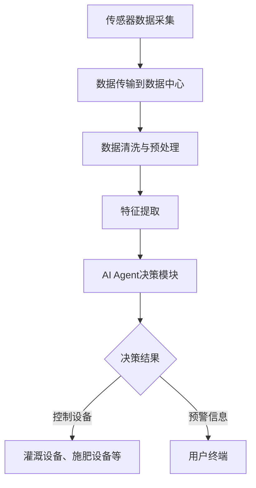

# AI Agent在智能农作物生长监测中的实践

> 关键词：AI Agent、智能农作物生长监测、传感器技术、机器学习、数据分析、精准农业、物联网

> 摘要：本文聚焦于AI Agent在智能农作物生长监测中的实践应用。首先介绍了该领域的研究背景和意义，阐述了相关核心概念及联系，包括AI Agent的工作原理和与农作物生长监测的关联。详细讲解了核心算法原理，通过Python代码进行了具体步骤的说明，并给出了相关数学模型和公式。通过项目实战，展示了如何搭建开发环境、实现源代码以及对代码进行解读分析。探讨了AI Agent在智能农作物生长监测中的实际应用场景，推荐了学习资源、开发工具框架和相关论文著作。最后总结了未来发展趋势与挑战，解答了常见问题，并提供了扩展阅读和参考资料，旨在为相关领域的研究者和从业者提供全面且深入的技术指导和实践经验。

## 1. 背景介绍 
### 1.1 目的和范围
随着全球人口的不断增长，对粮食的需求也日益增加。传统的农作物种植方式面临着诸多挑战，如资源利用效率低、病虫害防治不及时、产量不稳定等。智能农作物生长监测作为精准农业的重要组成部分，旨在利用先进的技术手段实时获取农作物的生长信息，为科学决策提供依据，从而提高农作物的产量和质量，实现农业的可持续发展。

本文的范围主要围绕AI Agent在智能农作物生长监测中的应用展开，涵盖了从数据采集、处理、分析到决策支持的整个过程，包括相关技术的原理、算法实现、实际应用案例以及未来发展趋势等方面。

### 1.2 预期读者
本文预期读者包括农业领域的科研人员、农业技术推广人员、农业生产企业的技术人员、对智能农业感兴趣的程序员和数据分析师，以及相关专业的学生等。这些读者可能希望了解AI Agent在农作物生长监测中的具体应用，掌握相关技术和方法，以便在实际工作或学习中进行应用和创新。

### 1.3 文档结构概述
本文共分为十个部分。第一部分介绍了AI Agent在智能农作物生长监测中的背景，包括目的、预期读者和文档结构概述等内容；第二部分阐述了核心概念与联系，解释了AI Agent和智能农作物生长监测的原理，并通过流程图展示其关联；第三部分详细讲解了核心算法原理和具体操作步骤，结合Python代码进行说明；第四部分给出了相关的数学模型和公式，并进行详细讲解和举例；第五部分通过项目实战，展示了开发环境搭建、源代码实现和代码解读分析；第六部分探讨了AI Agent在智能农作物生长监测中的实际应用场景；第七部分推荐了学习资源、开发工具框架和相关论文著作；第八部分总结了未来发展趋势与挑战；第九部分解答了常见问题；第十部分提供了扩展阅读和参考资料。

### 1.4 术语表
#### 1.4.1 核心术语定义
- **AI Agent（人工智能代理）**：是一种能够感知环境、进行推理和决策，并采取行动以实现特定目标的智能实体。在智能农作物生长监测中，AI Agent可以根据传感器采集的数据，对农作物的生长状况进行分析和判断，并给出相应的决策建议。
- **智能农作物生长监测**：利用传感器、物联网、人工智能等技术，实时获取农作物的生长环境信息（如温度、湿度、光照等）和生长状态信息（如株高、叶面积、病虫害情况等），并对这些信息进行分析和处理，以实现对农作物生长过程的精准监测和管理。
- **传感器技术**：是指用于检测和测量各种物理量、化学量和生物量的技术。在智能农作物生长监测中，常用的传感器包括温度传感器、湿度传感器、光照传感器、土壤水分传感器、图像传感器等。
- **机器学习**：是一门多领域交叉学科，涉及概率论、统计学、逼近论、凸分析、算法复杂度理论等多门学科。它专门研究计算机怎样模拟或实现人类的学习行为，以获取新的知识或技能，重新组织已有的知识结构使之不断改善自身的性能。在智能农作物生长监测中，机器学习算法可以用于对传感器数据进行分析和预测，如预测农作物的生长趋势、病虫害发生概率等。
- **物联网（IoT）**：是通过各种信息传感器、射频识别技术、全球定位系统、红外感应器、激光扫描器等各种装置与技术，实时采集任何需要监控、 连接、互动的物体或过程，采集其声、光、热、电、力学、化学、生物、位置等各种需要的信息，通过各类可能的网络接入，实现物与物、物与人的泛在连接，实现对物品和过程的智能化感知、识别和管理。在智能农作物生长监测中，物联网技术可以实现传感器数据的实时传输和共享。

#### 1.4.2 相关概念解释
- **精准农业**：是一种基于信息技术和人工智能的现代农业生产方式，它通过对农田信息的实时监测和分析，实现对农作物种植、施肥、灌溉、病虫害防治等生产环节的精准管理，以提高农业生产效率和资源利用效率，减少环境污染。智能农作物生长监测是精准农业的重要支撑技术之一。
- **数据采集**：是指从各种数据源（如传感器、数据库、文件等）中收集数据的过程。在智能农作物生长监测中，数据采集主要通过传感器获取农作物的生长环境和生长状态信息。
- **数据分析**：是指对采集到的数据进行清洗、预处理、特征提取、建模和预测等操作，以发现数据中蕴含的规律和信息。在智能农作物生长监测中，数据分析可以帮助我们了解农作物的生长状况，预测生长趋势，制定科学的管理决策。

#### 1.4.3 缩略词列表
- **AI**：Artificial Intelligence（人工智能）
- **IoT**：Internet of Things（物联网）
- **ML**：Machine Learning（机器学习）
- **GPS**：Global Positioning System（全球定位系统）
- **GIS**：Geographic Information System（地理信息系统）

## 2. 核心概念与联系 
### 2.1 AI Agent原理
AI Agent是一种具有自主性、反应性、社会性和主动性的智能实体。它可以感知环境中的信息，根据自身的知识和目标进行推理和决策，并采取相应的行动来影响环境。AI Agent的基本结构包括感知模块、决策模块和执行模块。

感知模块负责收集环境中的信息，如传感器数据、图像数据等。决策模块根据感知模块提供的信息，结合自身的知识和目标，进行推理和决策，选择合适的行动方案。执行模块则根据决策模块的指令，采取相应的行动，如控制灌溉设备、施肥设备等。

### 2.2 智能农作物生长监测原理
智能农作物生长监测主要基于传感器技术和物联网技术。通过在农田中部署各种传感器，实时采集农作物的生长环境信息（如温度、湿度、光照等）和生长状态信息（如株高、叶面积、病虫害情况等）。这些传感器数据通过物联网网络传输到数据中心，在数据中心进行清洗、预处理和分析。数据分析的结果可以通过可视化界面展示给用户，用户可以根据这些信息对农作物的生长过程进行实时监测和管理。

### 2.3 两者联系
AI Agent在智能农作物生长监测中起着关键的作用。AI Agent可以作为智能农作物生长监测系统的核心决策模块，根据传感器采集的数据，对农作物的生长状况进行实时分析和判断。例如，当AI Agent检测到土壤水分含量低于设定阈值时，它可以自动控制灌溉设备进行灌溉；当检测到农作物出现病虫害时，它可以及时发出预警，并给出相应的防治建议。

以下是AI Agent在智能农作物生长监测中的工作流程Mermaid流程图：


## 3. 核心算法原理 & 具体操作步骤 
### 3.1 核心算法原理
在智能农作物生长监测中，常用的核心算法包括机器学习算法和深度学习算法。这里以支持向量机（SVM）算法为例，介绍其在农作物病虫害分类中的应用原理。

支持向量机是一种有监督的机器学习算法，它的基本思想是在特征空间中找到一个最优的超平面，使得不同类别的样本能够被最大程度地分开。在农作物病虫害分类中，我们可以将不同病虫害的图像特征作为输入，将病虫害的类别作为输出，通过训练支持向量机模型，使其能够对未知的病虫害图像进行分类。

### 3.2 具体操作步骤
#### 3.2.1 数据收集
首先，我们需要收集大量的农作物病虫害图像数据。这些图像数据可以通过实地拍摄、网络下载等方式获取。同时，我们需要对这些图像数据进行标注，即标记出每张图像对应的病虫害类别。

#### 3.2.2 数据预处理
对收集到的图像数据进行预处理，包括图像裁剪、缩放、归一化等操作，以提高图像数据的质量和一致性。

#### 3.2.3 特征提取
从预处理后的图像数据中提取特征，常用的特征包括颜色特征、纹理特征、形状特征等。这里我们使用直方图特征作为示例。

#### 3.2.4 模型训练
将提取的特征和对应的病虫害类别作为训练数据，使用支持向量机算法进行模型训练。

#### 3.2.5 模型评估
使用测试数据对训练好的模型进行评估，计算模型的准确率、召回率等指标，以评估模型的性能。

#### 3.2.6 模型应用
将训练好的模型应用到实际的农作物病虫害分类中，对未知的病虫害图像进行分类。

### 3.3 Python源代码实现
```python
import numpy as np
from sklearn import svm
from sklearn.model_selection import train_test_split
from sklearn.metrics import accuracy_score
from skimage import io, color, feature

# 数据收集和预处理
def load_images_and_labels(image_paths, labels):
    images = []
    for path in image_paths:
        image = io.imread(path)
        image = color.rgb2gray(image)
        image = feature.hog(image)  # 特征提取
        images.append(image)
    images = np.array(images)
    labels = np.array(labels)
    return images, labels

# 模型训练和评估
def train_and_evaluate(images, labels):
    X_train, X_test, y_train, y_test = train_test_split(images, labels, test_size=0.2, random_state=42)
    clf = svm.SVC(kernel='linear')
    clf.fit(X_train, y_train)
    y_pred = clf.predict(X_test)
    accuracy = accuracy_score(y_test, y_pred)
    print(f"模型准确率: {accuracy}")
    return clf

# 示例数据
image_paths = ['path/to/image1.jpg', 'path/to/image2.jpg', ...]
labels = ['disease1', 'disease2', ...]

# 加载数据
images, labels = load_images_and_labels(image_paths, labels)

# 训练和评估模型
model = train_and_evaluate(images, labels)
```

## 4. 数学模型和公式 & 详细讲解 & 举例说明 
### 4.1 支持向量机数学模型
支持向量机的目标是在特征空间中找到一个最优的超平面，使得不同类别的样本能够被最大程度地分开。对于二分类问题，假设我们有一个训练数据集 $D = \{(x_1, y_1), (x_2, y_2), ..., (x_n, y_n)\}$，其中 $x_i \in \mathbb{R}^d$ 是样本的特征向量，$y_i \in \{-1, +1\}$ 是样本的类别标签。

超平面的方程可以表示为：
$$w^T x + b = 0$$
其中 $w \in \mathbb{R}^d$ 是超平面的法向量，$b \in \mathbb{R}$ 是偏置项。

支持向量机的优化目标是最大化间隔，即：
$$\max_{\omega, b} \frac{2}{\|\omega\|}$$
$$\text{s.t. } y_i(\omega^T x_i + b) \geq 1, i = 1, 2, ..., n$$

为了方便求解，我们可以将上述问题转化为其对偶问题：
$$\min_{\alpha} \frac{1}{2} \sum_{i=1}^{n} \sum_{j=1}^{n} \alpha_i \alpha_j y_i y_j x_i^T x_j - \sum_{i=1}^{n} \alpha_i$$
$$\text{s.t. } \sum_{i=1}^{n} \alpha_i y_i = 0$$
$$\alpha_i \geq 0, i = 1, 2, ..., n$$
其中 $\alpha_i$ 是拉格朗日乘子。

### 4.2 详细讲解
支持向量机的核心思想是通过寻找最优的超平面来实现分类。间隔是指超平面到最近样本点的距离，最大化间隔可以提高模型的泛化能力。在实际应用中，我们通常使用核函数将低维空间中的数据映射到高维空间，使得数据在高维空间中更容易被分开。

### 4.3 举例说明
假设我们有一个二维数据集，包含两个类别的样本点。我们可以使用支持向量机算法找到一个最优的超平面，将这两个类别的样本点分开。以下是一个简单的Python示例代码：
```python
import numpy as np
import matplotlib.pyplot as plt
from sklearn import svm

# 生成示例数据
X = np.array([[3, 4], [1, 4], [2, 3], [6, -1], [7, -1], [5, -3]])
y = np.array([-1, -1, -1, 1, 1, 1])

# 训练支持向量机模型
clf = svm.SVC(kernel='linear')
clf.fit(X, y)

# 绘制样本点
plt.scatter(X[:, 0], X[:, 1], c=y, cmap=plt.cm.Paired)

# 绘制超平面
ax = plt.gca()
xlim = ax.get_xlim()
ylim = ax.get_ylim()

xx = np.linspace(xlim[0], xlim[1], 30)
yy = np.linspace(ylim[0], ylim[1], 30)
YY, XX = np.meshgrid(yy, xx)
xy = np.vstack([XX.ravel(), YY.ravel()]).T
Z = clf.decision_function(xy).reshape(XX.shape)

ax.contour(XX, YY, Z, colors='k', levels=[-1, 0, 1], alpha=0.5, linestyles=['--', '-', '--'])

plt.show()
```
在这个示例中，我们使用支持向量机算法找到了一个最优的超平面，将两个类别的样本点分开。通过绘制超平面和间隔边界，我们可以直观地看到支持向量机的分类效果。

## 5. 项目实战：代码实际案例和详细解释说明 
### 5.1  开发环境搭建
#### 5.1.1 硬件环境
- **传感器设备**：包括温度传感器、湿度传感器、光照传感器、土壤水分传感器、图像传感器等。这些传感器可以实时采集农作物的生长环境和生长状态信息。
- **数据传输设备**：如网关、路由器等，用于将传感器采集的数据传输到数据中心。
- **服务器**：用于存储和处理传感器采集的数据，可以选择云服务器或本地服务器。

#### 5.1.2 软件环境
- **操作系统**：可以选择Linux系统，如Ubuntu、CentOS等，也可以选择Windows系统。
- **编程语言**：Python是智能农作物生长监测中常用的编程语言，因为它具有丰富的科学计算库和机器学习库。
- **开发工具**：可以选择PyCharm、Jupyter Notebook等开发工具。
- **数据库**：可以选择MySQL、MongoDB等数据库，用于存储传感器采集的数据和模型训练结果。

### 5.2  源代码详细实现和代码解读
#### 5.2.1 数据采集模块
```python
import serial
import time

# 串口通信参数
ser = serial.Serial('/dev/ttyUSB0', 9600, timeout=1)

def read_sensor_data():
    try:
        if ser.is_open:
            line = ser.readline().decode('utf-8').strip()
            data = line.split(',')
            temperature = float(data[0])
            humidity = float(data[1])
            soil_moisture = float(data[2])
            return temperature, humidity, soil_moisture
    except Exception as e:
        print(f"读取传感器数据时出错: {e}")
    return None, None, None

while True:
    temperature, humidity, soil_moisture = read_sensor_data()
    if temperature is not None and humidity is not None and soil_moisture is not None:
        print(f"温度: {temperature} °C, 湿度: {humidity} %, 土壤湿度: {soil_moisture} %")
    time.sleep(5)
```
**代码解读**：这段代码实现了通过串口通信读取传感器数据的功能。首先，我们创建了一个串口对象，指定了串口设备和波特率。然后，定义了一个函数 `read_sensor_data` 用于读取传感器数据，并将其解析为温度、湿度和土壤湿度。最后，使用一个无限循环不断读取传感器数据，并打印出来。

#### 5.2.2 数据存储模块
```python
import mysql.connector

# 数据库连接参数
mydb = mysql.connector.connect(
    host="localhost",
    user="your_username",
    password="your_password",
    database="agriculture"
)

mycursor = mydb.cursor()

def save_sensor_data(temperature, humidity, soil_moisture):
    sql = "INSERT INTO sensor_data (temperature, humidity, soil_moisture) VALUES (%s, %s, %s)"
    val = (temperature, humidity, soil_moisture)
    mycursor.execute(sql, val)
    mydb.commit()
    print(mycursor.rowcount, "条记录插入成功。")
```
**代码解读**：这段代码实现了将传感器数据存储到MySQL数据库的功能。首先，我们创建了一个数据库连接对象，并指定了数据库的连接参数。然后，定义了一个函数 `save_sensor_data` 用于将温度、湿度和土壤湿度数据插入到数据库中的 `sensor_data` 表中。

#### 5.2.3 数据分析模块
```python
import pandas as pd
from sklearn.linear_model import LinearRegression

# 从数据库中读取数据
df = pd.read_sql("SELECT * FROM sensor_data", mydb)

# 特征选择
X = df[['temperature', 'humidity']]
y = df['soil_moisture']

# 模型训练
model = LinearRegression()
model.fit(X, y)

# 预测
new_data = pd.DataFrame({'temperature': [25], 'humidity': [60]})
prediction = model.predict(new_data)
print(f"预测土壤湿度: {prediction[0]} %")
```
**代码解读**：这段代码实现了对传感器数据进行分析和预测的功能。首先，我们使用 `pandas` 库从数据库中读取传感器数据。然后，选择温度和湿度作为特征，土壤湿度作为目标变量。接着，使用线性回归模型对数据进行训练。最后，使用训练好的模型对新的温度和湿度数据进行土壤湿度预测。

### 5.3  代码解读与分析
#### 5.3.1 数据采集模块分析
数据采集模块的主要功能是从传感器设备中读取数据。在实际应用中，我们需要根据不同的传感器设备和通信协议进行相应的调整。同时，为了保证数据的准确性和稳定性，我们可以添加数据校验和错误处理机制。

#### 5.3.2 数据存储模块分析
数据存储模块的主要功能是将传感器数据存储到数据库中。在选择数据库时，我们需要考虑数据的存储容量、读写性能和安全性等因素。同时，为了提高数据的查询效率，我们可以对数据库表进行索引优化。

#### 5.3.3 数据分析模块分析
数据分析模块的主要功能是对传感器数据进行分析和预测。在选择分析算法时，我们需要根据数据的特点和分析目标进行选择。同时，为了提高模型的性能，我们可以进行数据预处理、特征工程和模型调优等操作。

## 6. 实际应用场景 
### 6.1 灌溉决策支持
AI Agent可以根据土壤水分传感器采集的数据，实时监测土壤的水分含量。当土壤水分含量低于设定的阈值时，AI Agent可以自动控制灌溉设备进行灌溉，以保证农作物的正常生长。同时，AI Agent还可以根据天气预测信息，调整灌溉计划，避免过度灌溉或灌溉不足。

### 6.2 病虫害预警
AI Agent可以通过图像传感器采集农作物的图像数据，使用机器学习算法对图像进行分析，识别农作物是否受到病虫害的侵害。当检测到病虫害时，AI Agent可以及时发出预警，并给出相应的防治建议，帮助农民及时采取措施，减少病虫害对农作物的损失。

### 6.3 施肥管理
AI Agent可以根据土壤养分传感器采集的数据，分析土壤的养分含量。根据农作物的生长阶段和需求，AI Agent可以制定合理的施肥计划，自动控制施肥设备进行施肥，以提高农作物的产量和质量。

### 6.4 生长趋势预测
AI Agent可以对传感器采集的历史数据进行分析，建立农作物生长模型。通过对模型的训练和优化，AI Agent可以预测农作物的生长趋势，如株高、叶面积、产量等，为农民提供科学的决策依据。

## 7. 工具和资源推荐
### 7.1 学习资源推荐
#### 7.1.1 书籍推荐
- 《机器学习》（周志华著）：本书全面介绍了机器学习的基本概念、算法和应用，是机器学习领域的经典教材。
- 《深度学习》（Ian Goodfellow、Yoshua Bengio、Aaron Courville著）：本书系统地介绍了深度学习的基本原理、算法和应用，是深度学习领域的权威著作。
- 《Python数据分析实战》（Sebastian Raschka著）：本书介绍了使用Python进行数据分析的基本方法和技巧，包括数据采集、清洗、分析和可视化等方面。

#### 7.1.2 在线课程
- Coursera平台上的“Machine Learning”课程（Andrew Ng教授主讲）：该课程是机器学习领域的经典在线课程，全面介绍了机器学习的基本概念、算法和应用。
- edX平台上的“Deep Learning Specialization”课程（Andrew Ng教授主讲）：该课程是深度学习领域的权威在线课程，系统地介绍了深度学习的基本原理、算法和应用。
- 中国大学MOOC平台上的“Python语言程序设计”课程（嵩天教授主讲）：该课程是Python语言的入门课程，介绍了Python语言的基本语法和编程技巧。

#### 7.1.3 技术博客和网站
- Medium（https://medium.com/）：一个汇聚了众多技术专家和爱好者的博客平台，提供了丰富的技术文章和经验分享。
- Towards Data Science（https://towardsdatascience.com/）：一个专注于数据科学和机器学习领域的技术博客，提供了大量的优质文章和案例分析。
- 博客园（https://www.cnblogs.com/）：一个国内知名的技术博客平台，提供了丰富的技术文章和代码分享。

### 7.2 开发工具框架推荐
#### 7.2.1 IDE和编辑器
- PyCharm：一款专业的Python集成开发环境，提供了丰富的代码编辑、调试、测试等功能。
- Jupyter Notebook：一个交互式的编程环境，支持Python、R等多种编程语言，适合数据探索和分析。
- Visual Studio Code：一款轻量级的代码编辑器，支持多种编程语言和插件扩展，具有丰富的功能和良好的用户体验。

#### 7.2.2 调试和性能分析工具
- PySnooper：一个简单易用的Python调试工具，可以自动记录函数的执行过程和变量的值。
- cProfile：Python标准库中的性能分析工具，可以帮助我们找出代码中的性能瓶颈。
- TensorBoard：一个用于可视化深度学习模型训练过程和结果的工具，可以帮助我们更好地理解模型的性能和行为。

#### 7.2.3 相关框架和库
- NumPy：一个用于科学计算的Python库，提供了高效的数组操作和数学函数。
- Pandas：一个用于数据处理和分析的Python库，提供了丰富的数据结构和数据操作方法。
- Scikit-learn：一个用于机器学习的Python库，提供了丰富的机器学习算法和工具。
- TensorFlow：一个开源的深度学习框架，提供了丰富的深度学习模型和工具。
- PyTorch：一个开源的深度学习框架，具有简洁易用的接口和高效的计算性能。

### 7.3 相关论文著作推荐
#### 7.3.1 经典论文
- Cortes, C., & Vapnik, V. (1995). Support-vector networks. Machine learning, 20(3), 273-297. （支持向量机的经典论文）
- LeCun, Y., Bengio, Y., & Hinton, G. (2015). Deep learning. nature, 521(7553), 436-444. （深度学习的经典综述论文）
- Ng, A. Y. (2004). Feature selection, L 1 vs. L 2 regularization, and rotational invariance. In Proceedings of the twenty-first international conference on Machine learning (p. 78). （特征选择和正则化的经典论文）

#### 7.3.2 最新研究成果
- 可以关注国际知名学术会议如NeurIPS（神经信息处理系统大会）、ICML（国际机器学习会议）、CVPR（计算机视觉与模式识别会议）等的最新研究成果，以及相关领域的顶级学术期刊如Journal of Artificial Intelligence Research（JAIR）、Artificial Intelligence（AI）等的最新论文。

#### 7.3.3 应用案例分析
- 可以参考一些农业领域的实际应用案例，如《精准农业：原理与实践》等书籍，以及相关的技术报告和研究论文，了解AI Agent在智能农作物生长监测中的实际应用效果和经验教训。

## 8. 总结：未来发展趋势与挑战
### 8.1 未来发展趋势
#### 8.1.1 多传感器融合
未来，智能农作物生长监测系统将融合更多类型的传感器，如高光谱传感器、无人机遥感传感器等，以获取更全面、更准确的农作物生长信息。多传感器融合可以提高数据的质量和可靠性，为AI Agent的决策提供更有力的支持。

#### 8.1.2 深度学习与强化学习的应用
深度学习和强化学习技术将在智能农作物生长监测中得到更广泛的应用。深度学习可以对复杂的图像、视频等数据进行分析和处理，提高病虫害识别、生长状态评估等任务的准确性。强化学习可以帮助AI Agent在动态环境中学习最优的决策策略，实现对农作物生长过程的自适应控制。

#### 8.1.3 智能农业机器人的发展
智能农业机器人将成为未来智能农作物生长监测的重要组成部分。智能农业机器人可以携带各种传感器和执行设备，在农田中进行自主巡逻、数据采集和作业执行。AI Agent可以与智能农业机器人进行协同工作，实现对农作物生长过程的全方位监测和管理。

#### 8.1.4 农业大数据与云计算的结合
随着传感器技术的不断发展，智能农作物生长监测系统将产生大量的数据。农业大数据和云计算技术的结合可以实现对这些数据的高效存储、管理和分析。通过对农业大数据的挖掘和分析，可以发现更多的农业生产规律和知识，为AI Agent的决策提供更科学的依据。

### 8.2 挑战
#### 8.2.1 数据质量和可靠性
传感器采集的数据可能存在噪声、缺失值等问题，影响数据的质量和可靠性。此外，不同传感器之间的数据可能存在不一致性，需要进行数据融合和校准。提高数据质量和可靠性是智能农作物生长监测面临的重要挑战之一。

#### 8.2.2 算法复杂度和计算资源
深度学习和强化学习算法通常具有较高的复杂度，需要大量的计算资源和时间进行训练和优化。在实际应用中，如何在有限的计算资源下实现高效的算法是一个挑战。

#### 8.2.3 模型可解释性
深度学习模型通常是黑盒模型，其决策过程难以解释。在智能农作物生长监测中，农民需要了解AI Agent的决策依据，以便做出合理的决策。提高模型的可解释性是智能农作物生长监测面临的另一个挑战。

#### 8.2.4 标准和规范
目前，智能农作物生长监测领域还缺乏统一的标准和规范。不同的传感器设备、数据格式、算法模型等可能存在不兼容的问题，影响系统的集成和互操作性。制定统一的标准和规范是智能农作物生长监测发展的必然趋势。

## 9. 附录：常见问题与解答
### 9.1 传感器数据不准确怎么办？
传感器数据不准确可能是由于传感器故障、安装位置不当、环境干扰等原因引起的。可以定期对传感器进行校准和维护，检查传感器的安装位置是否正确，避免传感器受到环境干扰。同时，可以采用多传感器融合的方法，提高数据的准确性和可靠性。

### 9.2 如何选择合适的机器学习算法？
选择合适的机器学习算法需要考虑数据的特点、分析目标和计算资源等因素。如果数据是线性可分的，可以选择线性分类算法，如逻辑回归、支持向量机等；如果数据是非线性的，可以选择非线性分类算法，如决策树、神经网络等。同时，还需要考虑算法的复杂度和计算资源的限制。

### 9.3 如何提高模型的性能？
可以通过数据预处理、特征工程、模型调优等方法提高模型的性能。数据预处理可以去除数据中的噪声和缺失值，提高数据的质量；特征工程可以提取更有代表性的特征，提高模型的特征表达能力；模型调优可以通过调整模型的参数，找到最优的模型配置。

### 9.4 如何保证系统的安全性？
为了保证系统的安全性，可以采取以下措施：对传感器设备进行加密传输，防止数据被窃取；对服务器进行安全防护，安装防火墙、入侵检测系统等安全软件；对用户进行身份认证和授权，确保只有授权用户才能访问系统；定期对系统进行安全审计和漏洞扫描，及时发现和修复安全漏洞。

## 10. 扩展阅读 & 参考资料
### 10.1 扩展阅读
- 《智能农业：从概念到实践》：本书介绍了智能农业的基本概念、技术和应用，包括智能农作物生长监测、智能农机装备、智能农产品加工等方面的内容。
- 《农业物联网技术与应用》：本书系统地介绍了农业物联网的基本原理、技术和应用，包括传感器技术、无线通信技术、云计算技术等方面的内容。
- 《人工智能与农业现代化》：本书探讨了人工智能在农业现代化中的应用前景和挑战，包括AI Agent在智能农作物生长监测、农业机器人、农产品质量检测等方面的应用。

### 10.2 参考资料
- 相关传感器设备的技术手册和用户指南。
- 相关数据库的官方文档和教程。
- 相关机器学习和深度学习框架的官方文档和教程。
- 相关学术会议和期刊上的研究论文。