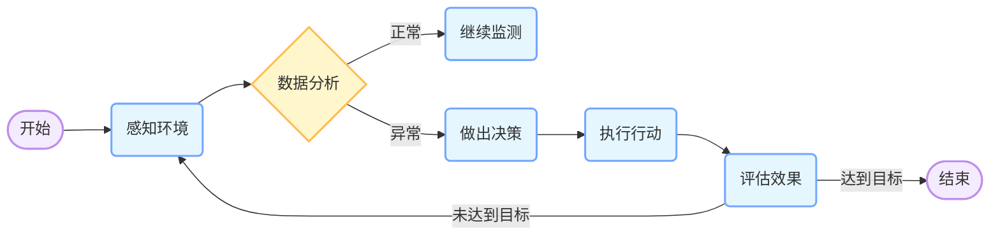

# AI Agent在智能制造中的实践案例

> 关键词：AI Agent、智能制造、实践案例、智能决策、自动化生产

> 摘要：本文聚焦于AI Agent在智能制造中的实践案例，旨在深入探讨其应用原理、实现方法以及在实际生产中的效果。通过详细介绍AI Agent的核心概念、算法原理、数学模型等内容，结合具体的项目实战案例，阐述了AI Agent如何提升智能制造的效率、质量和灵活性。同时，分析了AI Agent在不同应用场景中的作用，并推荐了相关的学习资源、开发工具和论文著作。最后，总结了AI Agent在智能制造领域的未来发展趋势与挑战，为相关领域的研究和实践提供参考。

## 1. 背景介绍 
### 1.1 目的和范围
随着制造业的快速发展，智能制造成为推动产业升级的关键力量。AI Agent作为一种智能化的软件实体，能够感知环境、做出决策并执行相应的动作，在智能制造中具有巨大的应用潜力。本文的目的在于通过实际案例，深入探讨AI Agent在智能制造中的应用，包括其原理、实现方法和实际效果。范围涵盖了AI Agent在生产调度、质量控制、设备维护等多个方面的实践应用。

### 1.2 预期读者
本文预期读者包括智能制造领域的工程师、研究人员、技术管理人员，以及对AI Agent和智能制造感兴趣的学生和爱好者。通过阅读本文，读者可以了解AI Agent在智能制造中的应用原理和实践经验，为相关项目的实施提供参考。

### 1.3 文档结构概述
本文首先介绍AI Agent和智能制造的背景知识，包括相关术语和概念。接着阐述AI Agent的核心概念与联系，通过文本示意图和Mermaid流程图展示其原理和架构。然后详细讲解AI Agent的核心算法原理和具体操作步骤，结合Python源代码进行说明。之后介绍AI Agent在智能制造中的数学模型和公式，并通过举例进行详细讲解。通过具体的项目实战案例，展示AI Agent在智能制造中的实际应用，包括开发环境搭建、源代码实现和代码解读。分析AI Agent在不同实际应用场景中的作用，推荐相关的学习资源、开发工具和论文著作。最后总结AI Agent在智能制造领域的未来发展趋势与挑战，并提供常见问题的解答和扩展阅读参考资料。

### 1.4 术语表
#### 1.4.1 核心术语定义
- **AI Agent（人工智能智能体）**：是一种能够感知环境、做出决策并执行相应动作的智能化软件实体。它可以根据环境的变化自主地调整自己的行为，以实现特定的目标。
- **智能制造**：是一种基于新一代信息技术，贯穿于设计、生产、管理、服务等制造活动各个环节，具有信息深度自感知、智慧优化自决策、精准控制自执行等功能的先进制造过程、系统与模式的总称。
- **生产调度**：是指根据生产任务和资源状况，合理安排生产活动的顺序和时间，以提高生产效率和资源利用率。
- **质量控制**：是指为了确保产品或服务质量满足规定的要求，而采取的一系列技术和管理措施。
- **设备维护**：是指为了保持设备的正常运行状态，延长设备的使用寿命，而采取的一系列维护和保养措施。

#### 1.4.2 相关概念解释
- **多智能体系统（Multi-Agent System，MAS）**：是由多个AI Agent组成的系统，这些智能体之间可以通过通信和协作来完成复杂的任务。
- **强化学习（Reinforcement Learning，RL）**：是一种机器学习方法，智能体通过与环境进行交互，根据环境反馈的奖励信号来学习最优的行为策略。
- **知识图谱（Knowledge Graph）**：是一种语义网络，用于表示实体之间的关系和知识，为AI Agent提供丰富的背景知识和推理能力。

#### 1.4.3 缩略词列表
- **AI**：Artificial Intelligence，人工智能
- **MAS**：Multi-Agent System，多智能体系统
- **RL**：Reinforcement Learning，强化学习
- **PLC**：Programmable Logic Controller，可编程逻辑控制器

## 2. 核心概念与联系 
### 2.1 AI Agent的核心概念
AI Agent是一种具有自主性、反应性、社会性和学习性的智能化软件实体。自主性是指AI Agent能够独立地感知环境、做出决策并执行相应的动作；反应性是指AI Agent能够根据环境的变化及时做出响应；社会性是指AI Agent能够与其他智能体进行通信和协作；学习性是指AI Agent能够通过与环境的交互不断学习和改进自己的行为。

### 2.2 AI Agent与智能制造的联系
AI Agent在智能制造中具有重要的作用。它可以应用于生产调度、质量控制、设备维护等多个环节，提高生产效率、保证产品质量、降低设备故障率。例如，在生产调度中，AI Agent可以根据订单需求、设备状态和人员情况，实时调整生产计划，优化生产流程；在质量控制中，AI Agent可以通过对生产数据的实时监测和分析，及时发现质量问题并采取相应的措施；在设备维护中，AI Agent可以通过对设备运行状态的实时监测和预测，提前安排设备维护计划，减少设备故障停机时间。

### 2.3 文本示意图
AI Agent在智能制造中的应用可以用以下文本示意图表示：

AI Agent通过传感器感知生产环境中的各种数据，包括设备状态、生产进度、产品质量等。然后，AI Agent对这些数据进行分析和处理，结合自身的知识和经验，做出决策。最后，AI Agent通过执行器将决策转化为具体的行动，如调整设备参数、安排生产任务、触发报警等。同时，AI Agent还可以与其他智能体进行通信和协作，共同完成复杂的任务。

### 2.4 Mermaid流程图


该流程图展示了AI Agent在智能制造中的工作流程。首先，AI Agent感知生产环境中的数据，然后对数据进行分析。如果数据正常，则继续监测；如果数据异常，则做出决策并执行相应的行动。最后，评估行动的效果，如果达到目标则结束流程，否则继续循环。

## 3. 核心算法原理 & 具体操作步骤 
### 3.1 核心算法原理
AI Agent在智能制造中常用的算法包括强化学习、深度学习、遗传算法等。这里以强化学习为例，介绍其核心算法原理。

强化学习是一种通过智能体与环境进行交互来学习最优行为策略的机器学习方法。智能体在环境中执行某个动作后，会得到一个奖励信号，该信号表示该动作的好坏程度。智能体的目标是通过不断地尝试和学习，找到一种能够最大化长期奖励的行为策略。

强化学习的核心算法包括Q学习（Q-Learning）、深度Q网络（Deep Q-Network，DQN）等。这里以Q学习为例，介绍其算法原理。

Q学习是一种基于值函数的强化学习算法，它通过学习一个Q值函数来表示在某个状态下执行某个动作的预期奖励。Q值函数的更新公式如下：

$$Q(s,a) \leftarrow Q(s,a) + \alpha [r + \gamma \max_{a'} Q(s',a') - Q(s,a)]$$

其中，$Q(s,a)$ 表示在状态 $s$ 下执行动作 $a$ 的Q值，$\alpha$ 是学习率，$r$ 是执行动作 $a$ 后得到的即时奖励，$\gamma$ 是折扣因子，$s'$ 是执行动作 $a$ 后转移到的下一个状态，$\max_{a'} Q(s',a')$ 表示在下一个状态 $s'$ 下执行所有可能动作中Q值最大的那个动作的Q值。

### 3.2 具体操作步骤
下面是使用Q学习算法实现AI Agent在智能制造中进行生产调度的具体操作步骤：

#### 3.2.1 定义状态空间和动作空间
状态空间是指AI Agent在生产环境中可能处于的所有状态的集合，例如设备状态、生产进度、订单需求等。动作空间是指AI Agent在某个状态下可以执行的所有动作的集合，例如安排生产任务、调整设备参数等。

#### 3.2.2 初始化Q值表
Q值表是一个二维表格，用于存储在每个状态下执行每个动作的Q值。初始时，Q值表中的所有Q值都可以设置为0。

#### 3.2.3 循环执行以下步骤直到达到终止条件
- **选择动作**：根据当前状态，使用某种策略（如 $\epsilon$-贪心策略）选择一个动作。
- **执行动作**：在生产环境中执行选择的动作，得到即时奖励和下一个状态。
- **更新Q值表**：根据Q值更新公式更新当前状态和动作的Q值。
- **更新当前状态**：将下一个状态作为当前状态。

#### 3.2.4 输出最优策略
当达到终止条件后，根据Q值表输出最优策略，即每个状态下应该执行的最优动作。

### 3.3 Python源代码实现
```python
import numpy as np

# 定义状态空间和动作空间
num_states = 10
num_actions = 5

# 初始化Q值表
Q = np.zeros((num_states, num_actions))

# 定义参数
alpha = 0.1  # 学习率
gamma = 0.9  # 折扣因子
epsilon = 0.1  # 贪心策略的epsilon值
num_episodes = 1000  # 训练的回合数

# 定义环境的转移函数和奖励函数
def transition(state, action):
    # 简单示例：随机转移到下一个状态
    next_state = np.random.randint(num_states)
    return next_state

def reward(state, action, next_state):
    # 简单示例：随机生成奖励
    return np.random.randint(-1, 2)

# 训练过程
for episode in range(num_episodes):
    state = np.random.randint(num_states)  # 随机初始化状态
    done = False
    while not done:
        # 选择动作
        if np.random.uniform(0, 1) < epsilon:
            action = np.random.randint(num_actions)  # 随机选择动作
        else:
            action = np.argmax(Q[state, :])  # 选择Q值最大的动作
        
        # 执行动作
        next_state = transition(state, action)
        r = reward(state, action, next_state)
        
        # 更新Q值表
        Q[state, action] = Q[state, action] + alpha * (r + gamma * np.max(Q[next_state, :]) - Q[state, action])
        
        # 更新当前状态
        state = next_state
        
        # 判断是否达到终止条件
        if np.random.uniform(0, 1) < 0.1:  # 简单示例：以10%的概率终止
            done = True

# 输出最优策略
optimal_policy = np.argmax(Q, axis=1)
print("最优策略:", optimal_policy)
```

该代码实现了一个简单的Q学习算法，用于在一个离散的状态空间和动作空间中学习最优策略。在实际应用中，需要根据具体的生产环境和任务需求，定义合适的状态空间、动作空间、转移函数和奖励函数。

## 4. 数学模型和公式 & 详细讲解 & 举例说明 
### 4.1 数学模型
AI Agent在智能制造中的数学模型可以用马尔可夫决策过程（Markov Decision Process，MDP）来描述。马尔可夫决策过程是一个五元组 $(S, A, P, R, \gamma)$，其中：
- $S$ 是状态空间，表示AI Agent在生产环境中可能处于的所有状态的集合。
- $A$ 是动作空间，表示AI Agent在某个状态下可以执行的所有动作的集合。
- $P$ 是状态转移概率函数，表示在状态 $s$ 下执行动作 $a$ 后转移到状态 $s'$ 的概率，即 $P(s'|s,a)$。
- $R$ 是奖励函数，表示在状态 $s$ 下执行动作 $a$ 后转移到状态 $s'$ 所得到的即时奖励，即 $R(s,a,s')$。
- $\gamma$ 是折扣因子，用于衡量未来奖励的重要性，取值范围为 $[0, 1]$。

### 4.2 公式讲解
#### 4.2.1 状态价值函数
状态价值函数 $V(s)$ 表示在状态 $s$ 下，遵循某个策略 $\pi$ 所能获得的长期期望奖励，定义如下：

$$V^{\pi}(s) = \mathbb{E}_{\pi} \left[ \sum_{t=0}^{\infty} \gamma^t R_{t+1} | S_0 = s \right]$$

其中，$\mathbb{E}_{\pi}$ 表示在策略 $\pi$ 下的期望，$R_{t+1}$ 是在时刻 $t+1$ 得到的即时奖励，$S_0$ 是初始状态。

#### 4.2.2 动作价值函数
动作价值函数 $Q(s,a)$ 表示在状态 $s$ 下执行动作 $a$，然后遵循某个策略 $\pi$ 所能获得的长期期望奖励，定义如下：

$$Q^{\pi}(s,a) = \mathbb{E}_{\pi} \left[ \sum_{t=0}^{\infty} \gamma^t R_{t+1} | S_0 = s, A_0 = a \right]$$

其中，$A_0$ 是初始动作。

#### 4.2.3 最优状态价值函数和最优动作价值函数
最优状态价值函数 $V^*(s)$ 和最优动作价值函数 $Q^*(s,a)$ 分别表示在所有可能的策略中，在状态 $s$ 下所能获得的最大长期期望奖励和在状态 $s$ 下执行动作 $a$ 所能获得的最大长期期望奖励，定义如下：

$$V^*(s) = \max_{\pi} V^{\pi}(s)$$

$$Q^*(s,a) = \max_{\pi} Q^{\pi}(s,a)$$

#### 4.2.4 贝尔曼方程
贝尔曼方程是马尔可夫决策过程中的一个重要方程，它描述了状态价值函数和动作价值函数之间的关系。对于最优状态价值函数和最优动作价值函数，贝尔曼方程分别为：

$$V^*(s) = \max_{a \in A} \sum_{s' \in S} P(s'|s,a) [R(s,a,s') + \gamma V^*(s')]$$

$$Q^*(s,a) = \sum_{s' \in S} P(s'|s,a) [R(s,a,s') + \gamma \max_{a' \in A} Q^*(s',a')]$$

### 4.3 举例说明
假设有一个简单的生产调度问题，状态空间 $S = \{s_1, s_2, s_3\}$，动作空间 $A = \{a_1, a_2\}$，状态转移概率函数 $P$ 和奖励函数 $R$ 如下表所示：

| $s$ | $a$ | $s'$ | $P(s'|s,a)$ | $R(s,a,s')$ |
|---|---|---|---|---|
| $s_1$ | $a_1$ | $s_1$ | 0.5 | 1 |
| $s_1$ | $a_1$ | $s_2$ | 0.5 | 2 |
| $s_1$ | $a_2$ | $s_2$ | 1 | 3 |
| $s_2$ | $a_1$ | $s_2$ | 0.6 | 4 |
| $s_2$ | $a_1$ | $s_3$ | 0.4 | 5 |
| $s_2$ | $a_2$ | $s_3$ | 1 | 6 |
| $s_3$ | $a_1$ | $s_3$ | 1 | 7 |
| $s_3$ | $a_2$ | $s_3$ | 1 | 8 |

折扣因子 $\gamma = 0.9$。

我们可以使用贝尔曼方程来计算最优状态价值函数和最优动作价值函数。首先，初始化 $V^*(s)$ 和 $Q^*(s,a)$ 为0，然后迭代更新直到收敛。

迭代过程如下：

- 初始时：$V^*(s_1) = V^*(s_2) = V^*(s_3) = 0$，$Q^*(s_1,a_1) = Q^*(s_1,a_2) = Q^*(s_2,a_1) = Q^*(s_2,a_2) = Q^*(s_3,a_1) = Q^*(s_3,a_2) = 0$。

- 第一次迭代：
  - 对于状态 $s_1$：
    - $Q^*(s_1,a_1) = 0.5 \times (1 + 0.9 \times 0) + 0.5 \times (2 + 0.9 \times 0) = 1.5$
    - $Q^*(s_1,a_2) = 1 \times (3 + 0.9 \times 0) = 3$
    - $V^*(s_1) = \max\{1.5, 3\} = 3$
  - 对于状态 $s_2$：
    - $Q^*(s_2,a_1) = 0.6 \times (4 + 0.9 \times 0) + 0.4 \times (5 + 0.9 \times 0) = 4.4$
    - $Q^*(s_2,a_2) = 1 \times (6 + 0.9 \times 0) = 6$
    - $V^*(s_2) = \max\{4.4, 6\} = 6$
  - 对于状态 $s_3$：
    - $Q^*(s_3,a_1) = 1 \times (7 + 0.9 \times 0) = 7$
    - $Q^*(s_3,a_2) = 1 \times (8 + 0.9 \times 0) = 8$
    - $V^*(s_3) = \max\{7, 8\} = 8$

- 继续迭代，直到 $V^*(s)$ 和 $Q^*(s,a)$ 收敛。

最终得到的最优状态价值函数和最优动作价值函数就是在这个生产调度问题中，每个状态下的最大长期期望奖励和每个状态下执行每个动作的最大长期期望奖励。

## 5. 项目实战：代码实际案例和详细解释说明 
### 5.1  开发环境搭建
#### 5.1.1 操作系统
选择适合开发的操作系统，如Windows、Linux或macOS。这里以Ubuntu 20.04为例进行说明。

#### 5.1.2 编程语言和开发工具
选择Python作为开发语言，因为Python具有丰富的机器学习和深度学习库，适合用于实现AI Agent。推荐使用Anaconda来管理Python环境，安装步骤如下：

1. 从Anaconda官网下载适合自己操作系统的Anaconda安装包。
2. 打开终端，进入下载目录，执行以下命令进行安装：
```bash
bash Anaconda3-2023.07-2-Linux-x86_64.sh
```
3. 按照安装向导的提示完成安装。
4. 安装完成后，重启终端，输入以下命令验证Anaconda是否安装成功：
```bash
conda --version
```

#### 5.1.3 安装必要的库
在Anaconda环境中，使用以下命令安装必要的库：
```bash
conda install numpy pandas scikit-learn tensorflow keras matplotlib
```

### 5.2  源代码详细实现和代码解读
#### 5.2.1 案例背景
假设我们要实现一个AI Agent来进行简单的生产设备故障预测和维护调度。设备有三种状态：正常、预警和故障，AI Agent可以执行三种动作：继续监测、维护和更换设备。

#### 5.2.2 代码实现
```python
import numpy as np
import random

# 定义状态空间和动作空间
states = ['normal', 'warning', 'fault']
actions = ['monitor', 'maintain', 'replace']

# 初始化Q值表
Q = np.zeros((len(states), len(actions)))

# 定义参数
alpha = 0.1  # 学习率
gamma = 0.9  # 折扣因子
epsilon = 0.1  # 贪心策略的epsilon值
num_episodes = 1000  # 训练的回合数

# 定义环境的转移函数和奖励函数
def transition(state, action):
    if state == 'normal':
        if action == 'monitor':
            next_state = random.choices(states, weights=[0.9, 0.1, 0])[0]
        elif action == 'maintain':
            next_state = 'normal'
        else:
            next_state = 'normal'
    elif state == 'warning':
        if action == 'monitor':
            next_state = random.choices(states, weights=[0.3, 0.6, 0.1])[0]
        elif action == 'maintain':
            next_state = random.choices(states, weights=[0.8, 0.2, 0])[0]
        else:
            next_state = 'normal'
    else:
        if action == 'monitor':
            next_state = 'fault'
        elif action == 'maintain':
            next_state = random.choices(states, weights=[0.2, 0.3, 0.5])[0]
        else:
            next_state = 'normal'
    return next_state

def reward(state, action, next_state):
    if state == 'normal':
        if action == 'monitor':
            return 1
        elif action == 'maintain':
            return -1
        else:
            return -5
    elif state == 'warning':
        if action == 'monitor':
            return -2
        elif action == 'maintain':
            return 3
        else:
            return -3
    else:
        if action == 'monitor':
            return -10
        elif action == 'maintain':
            return -5
        else:
            return 5

# 训练过程
for episode in range(num_episodes):
    state_index = random.randint(0, len(states) - 1)  # 随机初始化状态
    done = False
    while not done:
        state = states[state_index]
        # 选择动作
        if np.random.uniform(0, 1) < epsilon:
            action_index = random.randint(0, len(actions) - 1)  # 随机选择动作
        else:
            action_index = np.argmax(Q[state_index, :])  # 选择Q值最大的动作
        action = actions[action_index]
        
        # 执行动作
        next_state = transition(state, action)
        next_state_index = states.index(next_state)
        r = reward(state, action, next_state)
        
        # 更新Q值表
        Q[state_index, action_index] = Q[state_index, action_index] + alpha * (r + gamma * np.max(Q[next_state_index, :]) - Q[state_index, action_index])
        
        # 更新当前状态
        state_index = next_state_index
        
        # 判断是否达到终止条件
        if next_state == 'normal' and action == 'monitor':
            done = True

# 输出最优策略
optimal_policy = {}
for i, state in enumerate(states):
    action_index = np.argmax(Q[i, :])
    optimal_policy[state] = actions[action_index]
print("最优策略:", optimal_policy)
```

#### 5.2.3 代码解读
1. **状态空间和动作空间定义**：定义了设备的三种状态（正常、预警、故障）和AI Agent可以执行的三种动作（继续监测、维护、更换设备）。
2. **Q值表初始化**：使用 `np.zeros` 函数初始化Q值表，所有Q值初始化为0。
3. **参数设置**：设置学习率 `alpha`、折扣因子 `gamma`、贪心策略的 `epsilon` 值和训练的回合数 `num_episodes`。
4. **转移函数和奖励函数定义**：`transition` 函数根据当前状态和执行的动作，返回下一个状态；`reward` 函数根据当前状态、执行的动作和下一个状态，返回即时奖励。
5. **训练过程**：使用Q学习算法进行训练，通过不断地与环境交互，更新Q值表。
6. **输出最优策略**：训练完成后，根据Q值表输出每个状态下的最优动作。

### 5.3  代码解读与分析
#### 5.3.1 代码优点
- **简单易懂**：代码结构清晰，使用了基本的Python和NumPy库，易于理解和修改。
- **可扩展性**：可以根据实际需求，扩展状态空间、动作空间、转移函数和奖励函数，以适应不同的生产环境和任务需求。
- **灵活性**：使用Q学习算法，具有一定的灵活性，可以通过调整参数来优化性能。

#### 5.3.2 代码缺点
- **局限性**：Q学习算法适用于离散的状态空间和动作空间，对于连续的状态空间和动作空间，需要进行离散化处理，可能会导致信息丢失。
- **收敛速度**：Q学习算法的收敛速度较慢，需要较多的训练回合才能得到较好的结果。

#### 5.3.3 改进建议
- **使用深度学习算法**：对于复杂的生产环境和任务需求，可以使用深度学习算法，如深度Q网络（DQN）、策略梯度算法等，以提高性能和收敛速度。
- **引入知识图谱**：引入知识图谱，为AI Agent提供丰富的背景知识和推理能力，提高决策的准确性和可靠性。

## 6. 实际应用场景 
### 6.1 生产调度
在生产调度中，AI Agent可以根据订单需求、设备状态、人员情况等因素，实时调整生产计划，优化生产流程。例如，AI Agent可以根据设备的实时运行状态，合理安排设备的使用顺序，避免设备的过度使用和闲置；可以根据订单的紧急程度和优先级，合理分配生产任务，提高生产效率和客户满意度。

### 6.2 质量控制
在质量控制中，AI Agent可以通过对生产数据的实时监测和分析，及时发现质量问题并采取相应的措施。例如，AI Agent可以通过对生产过程中的传感器数据进行分析，预测产品的质量状况，提前发现潜在的质量问题；可以根据质量问题的严重程度，自动调整生产参数或触发报警，确保产品质量符合要求。

### 6.3 设备维护
在设备维护中，AI Agent可以通过对设备运行状态的实时监测和预测，提前安排设备维护计划，减少设备故障停机时间。例如，AI Agent可以通过对设备的振动、温度、压力等参数进行分析，预测设备的故障概率，提前安排维护人员进行维护；可以根据设备的维护历史和性能数据，优化维护策略，提高设备的可靠性和使用寿命。

### 6.4 供应链管理
在供应链管理中，AI Agent可以通过对供应链数据的实时监测和分析，优化供应链流程，提高供应链的效率和灵活性。例如，AI Agent可以根据供应商的交货时间、质量、价格等因素，选择最优的供应商；可以根据客户的需求预测，合理安排库存水平，避免库存积压和缺货现象的发生。

## 7. 工具和资源推荐
### 7.1 学习资源推荐
#### 7.1.1 书籍推荐
- 《人工智能：一种现代的方法》（Artificial Intelligence: A Modern Approach）：这本书是人工智能领域的经典教材，全面介绍了人工智能的基本概念、算法和应用。
- 《强化学习：原理与Python实现》（Reinforcement Learning: An Introduction）：这本书是强化学习领域的经典教材，详细介绍了强化学习的基本原理、算法和应用。
- 《深度学习》（Deep Learning）：这本书是深度学习领域的经典教材，全面介绍了深度学习的基本概念、算法和应用。

#### 7.1.2 在线课程
- Coursera上的“人工智能基础”（Foundations of Artificial Intelligence）课程：该课程由斯坦福大学的教授授课，全面介绍了人工智能的基本概念、算法和应用。
- edX上的“强化学习”（Reinforcement Learning）课程：该课程由伯克利大学的教授授课，详细介绍了强化学习的基本原理、算法和应用。
- 吴恩达的“深度学习专项课程”（Deep Learning Specialization）：该课程由吴恩达教授授课，全面介绍了深度学习的基本概念、算法和应用。

#### 7.1.3 技术博客和网站
- Medium：Medium上有很多关于人工智能、机器学习和深度学习的技术博客，涵盖了最新的研究成果和实践经验。
- arXiv：arXiv是一个预印本平台，提供了大量的关于人工智能、机器学习和深度学习的研究论文。
- 机器之心：机器之心是一个专注于人工智能领域的媒体平台，提供了最新的技术资讯、研究成果和实践案例。

### 7.2 开发工具框架推荐
#### 7.2.1 IDE和编辑器
- PyCharm：PyCharm是一款专门为Python开发设计的集成开发环境，具有代码编辑、调试、版本控制等功能。
- Visual Studio Code：Visual Studio Code是一款轻量级的代码编辑器，支持多种编程语言，具有丰富的插件和扩展功能。

#### 7.2.2 调试和性能分析工具
- TensorBoard：TensorBoard是TensorFlow提供的一个可视化工具，用于可视化训练过程中的各种指标和数据，帮助用户调试和优化模型。
- PyTorch Profiler：PyTorch Profiler是PyTorch提供的一个性能分析工具，用于分析模型的性能瓶颈和资源使用情况，帮助用户优化模型性能。

#### 7.2.3 相关框架和库
- TensorFlow：TensorFlow是一个开源的机器学习框架，由Google开发，支持深度学习、强化学习等多种算法。
- PyTorch：PyTorch是一个开源的深度学习框架，由Facebook开发，具有动态图和静态图两种模式，易于使用和调试。
- Stable Baselines3：Stable Baselines3是一个基于PyTorch的强化学习库，提供了多种强化学习算法的实现，易于使用和扩展。

### 7.3 相关论文著作推荐
#### 7.3.1 经典论文
- “Q-Learning”（Watkins, C. J. C. H., & Dayan, P. (1992)）：这篇论文是Q学习算法的经典论文，详细介绍了Q学习算法的原理和实现。
- “Playing Atari with Deep Reinforcement Learning”（Mnih, V., et al. (2013)）：这篇论文是深度Q网络（DQN）算法的经典论文，首次将深度学习和强化学习相结合，在Atari游戏中取得了很好的效果。
- “Proximal Policy Optimization Algorithms”（Schulman, J., et al. (2017)）：这篇论文是近端策略优化（PPO）算法的经典论文，提出了一种高效的策略优化算法，在多个领域取得了很好的效果。

#### 7.3.2 最新研究成果
- 关注顶级学术会议，如NeurIPS（神经信息处理系统大会）、ICML（国际机器学习会议）、CVPR（计算机视觉与模式识别会议）等，这些会议上会发表很多关于人工智能、机器学习和深度学习的最新研究成果。
- 关注顶级学术期刊，如Journal of Artificial Intelligence Research（JAIR）、Artificial Intelligence（AI）、Machine Learning（ML）等，这些期刊上会发表很多关于人工智能、机器学习和深度学习的高质量研究论文。

#### 7.3.3 应用案例分析
- 关注工业界的实践案例和白皮书，如西门子、博世、富士康等公司的智能制造实践案例，这些案例可以帮助我们了解AI Agent在实际生产中的应用效果和挑战。
- 关注开源项目和竞赛，如Kaggle上的相关竞赛和开源项目，这些项目可以帮助我们学习和实践AI Agent在不同领域的应用。

## 8. 总结：未来发展趋势与挑战
### 8.1 未来发展趋势
#### 8.1.1 智能化程度不断提高
随着人工智能技术的不断发展，AI Agent的智能化程度将不断提高。未来的AI Agent将具备更强的感知能力、决策能力和学习能力，能够更好地适应复杂多变的生产环境。

#### 8.1.2 多智能体协作更加紧密
在智能制造中，往往需要多个AI Agent协同工作来完成复杂的任务。未来，多智能体系统的协作将更加紧密，智能体之间将能够更好地进行通信、协调和合作，提高整个生产系统的效率和灵活性。

#### 8.1.3 与物联网、大数据等技术深度融合
AI Agent将与物联网、大数据等技术深度融合，实现对生产过程的全面感知和实时控制。通过物联网技术，AI Agent可以获取更多的生产数据；通过大数据技术，AI Agent可以对这些数据进行分析和挖掘，为决策提供更有力的支持。

#### 8.1.4 应用领域不断拓展
AI Agent在智能制造中的应用领域将不断拓展，除了生产调度、质量控制、设备维护等传统领域，还将应用于产品设计、供应链管理、售后服务等领域，推动整个制造业的智能化升级。

### 8.2 挑战
#### 8.2.1 数据安全和隐私问题
在智能制造中，AI Agent需要处理大量的生产数据，这些数据包含了企业的核心机密和客户的隐私信息。因此，数据安全和隐私问题是AI Agent在智能制造中面临的重要挑战之一。

#### 8.2.2 算法复杂度和计算资源需求
随着AI Agent的智能化程度不断提高，其算法复杂度和计算资源需求也将不断增加。如何在有限的计算资源下，实现高效的算法优化和模型训练，是AI Agent在智能制造中面临的另一个重要挑战。

#### 8.2.3 人机协作问题
在智能制造中，AI Agent需要与人类操作员进行协作。如何实现人机之间的有效协作，提高人机协作的效率和安全性，是AI Agent在智能制造中面临的又一个重要挑战。

#### 8.2.4 标准和规范问题
目前，AI Agent在智能制造中的应用还缺乏统一的标准和规范。如何制定统一的标准和规范，确保AI Agent的互操作性和兼容性，是AI Agent在智能制造中面临的一个重要挑战。

## 9. 附录：常见问题与解答
### 9.1 AI Agent与传统自动化系统有什么区别？
AI Agent与传统自动化系统的主要区别在于其智能化程度。传统自动化系统通常是基于预设的规则和程序进行工作，缺乏自主决策和学习能力；而AI Agent具有自主性、反应性、社会性和学习性，能够根据环境的变化自主地调整自己的行为，以实现特定的目标。

### 9.2 AI Agent在智能制造中的应用需要具备哪些条件？
AI Agent在智能制造中的应用需要具备以下条件：
- 数据基础：需要有大量的生产数据作为支撑，以便AI Agent进行学习和决策。
- 算法支持：需要有合适的算法来实现AI Agent的功能，如强化学习、深度学习等。
- 计算资源：需要有足够的计算资源来支持AI Agent的运行和训练。
- 人员素质：需要有具备相关知识和技能的人员来开发、部署和维护AI Agent。

### 9.3 如何评估AI Agent在智能制造中的应用效果？
可以从以下几个方面评估AI Agent在智能制造中的应用效果：
- 生产效率：评估AI Agent是否提高了生产效率，如缩短了生产周期、提高了设备利用率等。
- 产品质量：评估AI Agent是否提高了产品质量，如降低了次品率、提高了产品的一致性等。
- 成本控制：评估AI Agent是否降低了生产成本，如减少了设备故障停机时间、降低了能源消耗等。
- 灵活性和适应性：评估AI Agent是否提高了生产系统的灵活性和适应性，如能够快速响应市场需求的变化、调整生产计划等。

### 9.4 AI Agent在智能制造中的应用是否会导致人员失业？
AI Agent在智能制造中的应用不会导致人员失业，而是会促进人员的职业转型和升级。虽然AI Agent可以替代一些重复性、规律性的工作，但在智能制造中，仍然需要人类操作员进行监控、维护、管理等工作。同时，AI Agent的应用也会创造一些新的就业机会，如AI Agent的开发、部署和维护等。

## 10. 扩展阅读 & 参考资料
### 10.1 扩展阅读
- 《智能制造发展战略研究》
- 《工业4.0：即将来袭的第四次工业革命》
- 《人工智能时代：人类将何去何从》

### 10.2 参考资料
- 相关学术论文和研究报告
- 工业界的实践案例和白皮书
- 开源项目和竞赛的相关资料