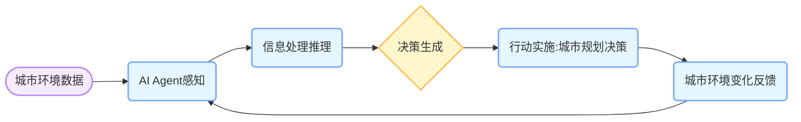

# AI Agent在智能城市规划决策中的角色

> 关键词：AI Agent、智能城市规划、决策支持、人工智能、城市治理、数据驱动、多智能体系统

> 摘要：本文聚焦于AI Agent在智能城市规划决策中的角色。随着城市化进程的加速和信息技术的飞速发展，智能城市规划成为解决城市发展诸多问题的关键途径。AI Agent作为人工智能领域的重要技术，能够通过感知、推理、决策和行动等功能，在智能城市规划决策的各个环节发挥重要作用。文章深入探讨了AI Agent的核心概念、算法原理、数学模型，结合项目实战案例详细阐述其应用，分析实际应用场景，推荐相关工具和资源，最后总结其未来发展趋势与挑战，旨在为理解和应用AI Agent提升智能城市规划决策水平提供全面的参考。

## 1. 背景介绍 
### 1.1 目的和范围
本文章的目的在于全面深入地探讨AI Agent在智能城市规划决策中所扮演的角色。范围涵盖了AI Agent的基本概念、技术原理、在智能城市规划决策中的具体应用、相关的数学模型和算法，以及通过实际项目案例来展示其实际效果。同时，还将对AI Agent在智能城市规划决策领域的未来发展趋势和面临的挑战进行分析和展望。

### 1.2 预期读者
本文预期读者包括城市规划领域的专业人员，如城市规划师、城市设计师等，他们可以通过本文了解AI Agent技术如何为城市规划决策提供新的思路和方法；人工智能领域的研究人员和开发者，他们可以从智能城市规划的实际需求出发，进一步优化和拓展AI Agent技术；城市治理的决策者和管理者，他们能够借助本文认识到AI Agent在提升城市规划决策科学性和效率方面的价值；以及对智能城市和人工智能技术感兴趣的普通读者，帮助他们了解相关领域的前沿动态。

### 1.3 文档结构概述
本文首先介绍背景信息，包括目的、预期读者和文档结构概述等内容。接着阐述AI Agent的核心概念与联系，通过文本示意图和Mermaid流程图展示其原理和架构。然后详细讲解AI Agent的核心算法原理及具体操作步骤，使用Python源代码进行阐述。之后介绍相关的数学模型和公式，并举例说明。通过项目实战部分，展示代码实际案例并进行详细解释。分析AI Agent在智能城市规划决策中的实际应用场景。推荐相关的工具和资源，包括学习资源、开发工具框架和相关论文著作。最后总结AI Agent在智能城市规划决策中的未来发展趋势与挑战，并提供常见问题与解答以及扩展阅读和参考资料。

### 1.4 术语表
#### 1.4.1 核心术语定义
- **AI Agent（人工智能智能体）**：是一个能够感知环境、进行推理和决策，并采取行动以实现特定目标的计算机程序或系统。它可以自主地与环境进行交互，根据环境的变化调整自己的行为。
- **智能城市规划**：是指利用现代信息技术，如物联网、大数据、人工智能等，对城市的空间布局、基础设施、资源利用等进行全面、系统、科学的规划和管理，以提高城市的运行效率、居民生活质量和可持续发展能力。
- **决策支持**：是指为决策者提供信息、分析工具和建议，帮助他们在复杂的情况下做出更明智、更科学的决策。

#### 1.4.2 相关概念解释
- **多智能体系统（Multi - Agent System，MAS）**：由多个AI Agent组成的系统，这些智能体之间可以相互通信、协作和竞争，以共同完成一个或多个复杂的任务。在智能城市规划决策中，不同类型的AI Agent可以组成多智能体系统，如交通智能体、能源智能体等，它们通过协作来优化城市规划决策。
- **数据驱动决策**：是指基于大量的数据和数据分析结果来进行决策。在智能城市规划中，AI Agent可以收集和分析城市中的各种数据，如人口数据、交通数据、环境数据等，为规划决策提供数据支持。

#### 1.4.3 缩略词列表
- **AI**：Artificial Intelligence，人工智能
- **MAS**：Multi - Agent System，多智能体系统
- **GIS**：Geographic Information System，地理信息系统

## 2. 核心概念与联系 

### AI Agent的基本原理
AI Agent的核心原理基于感知、推理、决策和行动四个关键环节。感知环节中，AI Agent通过各种传感器或数据接口收集环境信息，例如在智能城市规划中，它可以收集城市的地理信息、人口分布、交通流量等数据。推理环节是AI Agent对感知到的信息进行分析和处理的过程，运用知识表示和推理算法，挖掘数据中的规律和关系。决策环节则根据推理结果，结合预设的目标和约束条件，选择最优的行动方案。最后，行动环节是AI Agent将决策结果转化为实际行动，对环境产生影响。

### AI Agent与智能城市规划决策的联系
在智能城市规划决策中，AI Agent可以作为一个独立的决策者或决策辅助工具。作为独立决策者，AI Agent可以根据城市的现状和发展目标，自主地制定城市规划方案。作为决策辅助工具，AI Agent可以为城市规划者提供数据支持、分析结果和决策建议，帮助他们做出更科学、更合理的决策。

### 文本示意图
AI Agent在智能城市规划决策中的工作流程可以用以下文本示意图表示：

城市环境数据（地理、人口、交通等） -> AI Agent（感知） -> 信息处理（推理） -> 决策生成 -> 行动实施（城市规划决策） -> 反馈（城市环境变化） -> AI Agent（再次感知）

### Mermaid流程图


## 3. 核心算法原理 & 具体操作步骤 

### 核心算法原理
AI Agent的核心算法包括搜索算法、机器学习算法和强化学习算法等。这里以强化学习算法为例进行详细阐述。

强化学习是一种通过智能体与环境进行交互，不断尝试不同的行动，并根据环境给予的奖励信号来学习最优行动策略的算法。在智能城市规划决策中，AI Agent可以将城市规划决策问题看作一个强化学习问题，通过不断尝试不同的规划方案，并根据城市发展的效果（如交通拥堵缓解程度、能源消耗降低程度等）来调整自己的决策策略。

### Python源代码详细阐述
以下是一个简单的基于Q - learning算法的强化学习示例，用于模拟AI Agent在智能城市规划决策中的决策过程。

```python
import numpy as np

# 定义环境参数
num_states = 10  # 状态数量
num_actions = 5  # 行动数量
gamma = 0.9  # 折扣因子
alpha = 0.1  # 学习率

# 初始化Q表
Q = np.zeros((num_states, num_actions))

# 定义奖励函数
def get_reward(state, action):
    # 这里简单模拟奖励，实际应用中需要根据具体情况定义
    if state == 5 and action == 2:
        return 10
    else:
        return -1

# 定义状态转移函数
def get_next_state(state, action):
    # 这里简单模拟状态转移，实际应用中需要根据具体情况定义
    return (state + action) % num_states

# Q - learning算法
def q_learning(num_episodes):
    for episode in range(num_episodes):
        state = np.random.randint(0, num_states)  # 随机初始化状态
        done = False
        while not done:
            # 选择行动
            if np.random.uniform(0, 1) < 0.1:  # 探索率
                action = np.random.randint(0, num_actions)
            else:
                action = np.argmax(Q[state, :])
            
            # 获取奖励和下一个状态
            reward = get_reward(state, action)
            next_state = get_next_state(state, action)
            
            # 更新Q表
            Q[state, action] = Q[state, action] + alpha * (reward + gamma * np.max(Q[next_state, :]) - Q[state, action])
            
            # 判断是否结束
            if state == 5 and action == 2:
                done = True
            state = next_state
    return Q

# 训练模型
Q = q_learning(1000)

# 打印最终的Q表
print("Final Q - table:")
print(Q)
```

### 具体操作步骤
1. **环境建模**：将智能城市规划决策问题抽象为一个强化学习环境，定义状态空间、行动空间和奖励函数。
2. **初始化Q表**：将Q表初始化为全零矩阵。
3. **训练过程**：通过多个训练周期，AI Agent在环境中不断尝试不同的行动，根据奖励信号更新Q表。
4. **决策过程**：在实际应用中，AI Agent根据Q表选择最优行动，做出城市规划决策。

## 4. 数学模型和公式 & 详细讲解 & 举例说明 

### 数学模型
在强化学习中，常用的数学模型是马尔可夫决策过程（Markov Decision Process，MDP）。MDP可以用一个五元组 $<S, A, P, R, \gamma>$ 表示，其中：
- $S$ 是状态空间，表示环境中所有可能的状态。
- $A$ 是行动空间，表示智能体可以采取的所有行动。
- $P$ 是状态转移概率，表示在状态 $s$ 采取行动 $a$ 后转移到状态 $s'$ 的概率，即 $P(s'|s, a)$。
- $R$ 是奖励函数，表示在状态 $s$ 采取行动 $a$ 后获得的即时奖励，即 $R(s, a)$。
- $\gamma$ 是折扣因子，取值范围为 $[0, 1]$，用于衡量未来奖励的重要性。

### 公式
Q - learning算法的核心更新公式为：
$$Q(s, a) \leftarrow Q(s, a) + \alpha [R(s, a) + \gamma \max_{a'} Q(s', a') - Q(s, a)]$$
其中：
- $Q(s, a)$ 表示在状态 $s$ 采取行动 $a$ 的Q值。
- $\alpha$ 是学习率，控制每次更新的步长。
- $R(s, a)$ 是在状态 $s$ 采取行动 $a$ 获得的即时奖励。
- $\gamma$ 是折扣因子。
- $s'$ 是采取行动 $a$ 后转移到的下一个状态。
- $\max_{a'} Q(s', a')$ 表示在下一个状态 $s'$ 下所有可能行动的最大Q值。

### 详细讲解
Q - learning算法的目标是通过不断更新Q表，使得Q值能够逼近最优的行动价值函数。在每次更新中，算法根据即时奖励和下一个状态的最大Q值来更新当前状态和行动的Q值。学习率 $\alpha$ 控制了每次更新的步长，折扣因子 $\gamma$ 则平衡了即时奖励和未来奖励的重要性。

### 举例说明
假设在智能城市规划决策中，状态 $s$ 表示城市的交通拥堵程度，行动 $a$ 表示采取的交通管理措施（如增加公交线路、建设新的道路等）。奖励函数 $R(s, a)$ 可以根据交通拥堵缓解的程度来定义，如果采取的措施有效地缓解了交通拥堵，则给予正奖励；否则给予负奖励。通过Q - learning算法，AI Agent可以学习到在不同交通拥堵状态下应该采取的最优交通管理措施。

## 5. 项目实战：代码实际案例和详细解释说明 

### 5.1  开发环境搭建
- **操作系统**：推荐使用Linux或Windows操作系统。
- **编程语言**：Python 3.x
- **开发工具**：推荐使用PyCharm或Jupyter Notebook作为开发环境。
- **相关库**：需要安装NumPy、Matplotlib等库，可以使用以下命令进行安装：
```bash
pip install numpy matplotlib
```

### 5.2  源代码详细实现和代码解读
以下是一个更完整的基于强化学习的智能城市规划决策模拟代码：

```python
import numpy as np
import matplotlib.pyplot as plt

# 定义环境参数
num_states = 20  # 状态数量
num_actions = 3  # 行动数量
gamma = 0.9  # 折扣因子
alpha = 0.1  # 学习率
num_episodes = 1000  # 训练周期数

# 初始化Q表
Q = np.zeros((num_states, num_actions))

# 定义奖励函数
def get_reward(state, action):
    # 简单模拟奖励，根据不同的状态和行动给予不同的奖励
    if state < 5 and action == 0:
        return 5
    elif state >= 5 and state < 10 and action == 1:
        return 8
    elif state >= 10 and action == 2:
        return 10
    else:
        return -2

# 定义状态转移函数
def get_next_state(state, action):
    # 简单模拟状态转移，根据不同的行动转移到不同的状态
    if action == 0:
        return (state + 1) % num_states
    elif action == 1:
        return (state + 2) % num_states
    else:
        return (state + 3) % num_states

# Q - learning算法
def q_learning(num_episodes):
    rewards_per_episode = []
    for episode in range(num_episodes):
        state = np.random.randint(0, num_states)  # 随机初始化状态
        total_reward = 0
        done = False
        while not done:
            # 选择行动
            if np.random.uniform(0, 1) < 0.1:  # 探索率
                action = np.random.randint(0, num_actions)
            else:
                action = np.argmax(Q[state, :])
            
            # 获取奖励和下一个状态
            reward = get_reward(state, action)
            next_state = get_next_state(state, action)
            
            # 更新Q表
            Q[state, action] = Q[state, action] + alpha * (reward + gamma * np.max(Q[next_state, :]) - Q[state, action])
            
            # 累计奖励
            total_reward += reward
            
            # 判断是否结束
            if state == 15 and action == 2:
                done = True
            state = next_state
        
        rewards_per_episode.append(total_reward)
    return Q, rewards_per_episode

# 训练模型
Q, rewards_per_episode = q_learning(num_episodes)

# 打印最终的Q表
print("Final Q - table:")
print(Q)

# 绘制奖励曲线
plt.plot(rewards_per_episode)
plt.xlabel('Episode')
plt.ylabel('Total Reward')
plt.title('Total Reward per Episode')
plt.show()
```

### 代码解读与分析
- **环境参数定义**：定义了状态数量、行动数量、折扣因子、学习率和训练周期数等参数。
- **Q表初始化**：将Q表初始化为全零矩阵。
- **奖励函数**：根据不同的状态和行动给予不同的奖励，模拟智能城市规划决策中的奖励机制。
- **状态转移函数**：根据不同的行动转移到不同的状态，模拟智能城市规划决策中的状态变化。
- **Q - learning算法**：在每个训练周期中，AI Agent不断尝试不同的行动，根据奖励信号更新Q表，并记录每个周期的总奖励。
- **结果展示**：打印最终的Q表，并绘制每个周期的总奖励曲线，用于观察训练效果。

## 6. 实际应用场景 
### 交通规划决策
AI Agent可以收集城市的交通流量、道路状况、人口分布等数据，通过分析和推理，为交通规划决策提供建议。例如，根据不同区域的交通需求，AI Agent可以建议优化公交线路、建设新的道路或设置交通信号灯的时间间隔等。

### 能源管理决策
在能源管理方面，AI Agent可以监测城市的能源消耗情况，如电力、燃气等。根据能源需求预测和能源供应情况，AI Agent可以制定能源分配方案，优化能源利用效率。例如，在高峰时段，AI Agent可以建议调整工业生产的能源使用，优先保障居民生活用电。

### 土地利用规划决策
AI Agent可以综合考虑城市的人口增长、经济发展、环境要求等因素，对土地利用进行规划。例如，根据不同区域的功能需求，AI Agent可以建议合理划分住宅区、商业区、工业区和公共绿地等，提高土地利用效率。

### 公共服务设施布局决策
AI Agent可以分析城市居民的需求分布，为公共服务设施的布局提供决策支持。例如，根据人口密度和居民的出行距离，AI Agent可以建议合理设置学校、医院、图书馆等公共服务设施的位置和规模，提高公共服务的可达性和公平性。

## 7. 工具和资源推荐
### 7.1 学习资源推荐
#### 7.1.1 书籍推荐
- 《人工智能：一种现代的方法》（Artificial Intelligence: A Modern Approach）：这是一本经典的人工智能教材，全面介绍了人工智能的基本概念、算法和应用，包括AI Agent的相关内容。
- 《强化学习：原理与Python实现》：详细介绍了强化学习的原理和算法，并通过Python代码进行实现，对于理解AI Agent中的强化学习算法非常有帮助。

#### 7.1.2 在线课程
- Coursera上的“人工智能基础”课程：由知名高校的教授授课，系统地介绍了人工智能的基础知识和技术，包括AI Agent的相关内容。
- edX上的“强化学习”课程：深入讲解了强化学习的理论和实践，通过实际案例和编程作业帮助学习者掌握强化学习算法。

#### 7.1.3 技术博客和网站
- Medium上的人工智能相关博客：有很多人工智能领域的专家和爱好者分享他们的研究成果和实践经验，包括AI Agent在不同领域的应用。
- arXiv.org：是一个开放获取的学术预印本平台，提供了大量关于人工智能和智能城市规划的最新研究论文。

### 7.2 开发工具框架推荐
#### 7.2.1 IDE和编辑器
- PyCharm：是一款专业的Python集成开发环境，提供了丰富的代码编辑、调试和项目管理功能，适合开发基于Python的AI Agent应用。
- Jupyter Notebook：是一个交互式的开发环境，支持Python等多种编程语言，方便进行代码的编写、测试和可视化展示。

#### 7.2.2 调试和性能分析工具
- Py-Spy：是一个用于Python代码性能分析的工具，可以帮助开发者找出代码中的性能瓶颈，优化AI Agent的运行效率。
- PDB：是Python自带的调试器，方便开发者进行代码调试，定位和解决问题。

#### 7.2.3 相关框架和库
- OpenAI Gym：是一个用于开发和比较强化学习算法的工具包，提供了多种模拟环境和接口，方便开发者进行强化学习算法的实验和测试。
- Stable Baselines3：是一个基于PyTorch的强化学习库，提供了多种预训练的强化学习算法和模型，方便开发者快速实现和应用强化学习算法。

### 7.3 相关论文著作推荐
#### 7.3.1 经典论文
- “Reinforcement Learning: A Survey”：这是一篇关于强化学习的经典综述论文，全面介绍了强化学习的发展历程、基本概念和算法。
- “Multi - Agent Systems: A Modern Approach to Distributed Artificial Intelligence”：对多智能体系统进行了深入的研究和探讨，为理解AI Agent在多智能体环境中的协作和决策提供了理论基础。

#### 7.3.2 最新研究成果
- 关注顶级学术会议如AAAI、IJCAI、NeurIPS等上发表的关于AI Agent和智能城市规划的最新研究论文，了解该领域的前沿动态和研究趋势。

#### 7.3.3 应用案例分析
- 查阅相关的学术期刊和行业报告，了解AI Agent在实际智能城市规划项目中的应用案例和效果分析，从中获取实践经验和启示。

## 8. 总结：未来发展趋势与挑战
### 未来发展趋势
- **多智能体协作增强**：未来的智能城市规划决策将涉及更多类型的AI Agent，它们之间的协作将更加紧密和复杂。例如，交通智能体、能源智能体和环境智能体等将通过多智能体系统进行协作，共同优化城市的整体运行效率。
- **与新兴技术融合**：AI Agent将与物联网、大数据、区块链等新兴技术深度融合。物联网提供了更丰富的城市环境数据，大数据为AI Agent的分析和决策提供了强大的支持，区块链则可以保证数据的安全性和可信度。
- **自主学习和进化能力提升**：AI Agent将具备更强的自主学习和进化能力，能够根据城市环境的变化自动调整决策策略，不断优化城市规划方案。

### 挑战
- **数据隐私和安全问题**：AI Agent在智能城市规划决策中需要收集和处理大量的城市数据，这些数据涉及居民的隐私和城市的安全。如何保证数据的隐私和安全是一个亟待解决的问题。
- **算法的可解释性**：目前的AI Agent算法，尤其是深度学习和强化学习算法，往往具有较高的复杂度和黑盒性，其决策过程难以解释。在智能城市规划决策中，需要算法具有较好的可解释性，以便决策者理解和信任AI Agent的决策结果。
- **社会接受度**：智能城市规划决策涉及到城市居民的利益和生活方式的改变，AI Agent的应用可能会引起部分居民的担忧和抵触。如何提高社会对AI Agent在智能城市规划决策中应用的接受度是一个重要的挑战。

## 9. 附录：常见问题与解答
### 问题1：AI Agent在智能城市规划决策中的应用是否会取代人类决策者？
解答：不会。AI Agent在智能城市规划决策中主要起到辅助决策的作用，它可以为人类决策者提供数据支持、分析结果和决策建议。但城市规划决策涉及到很多复杂的社会、文化和政治因素，需要人类决策者的经验、智慧和判断力。AI Agent和人类决策者可以相互补充，共同提高城市规划决策的科学性和合理性。

### 问题2：如何保证AI Agent在智能城市规划决策中的决策质量？
解答：可以从以下几个方面保证决策质量：一是选择合适的算法和模型，并进行充分的训练和优化；二是收集和处理准确、全面的城市数据，为AI Agent的决策提供可靠的依据；三是对AI Agent的决策结果进行评估和验证，及时发现和纠正决策中的错误和偏差；四是结合人类决策者的经验和判断力，对AI Agent的决策结果进行综合分析和判断。

### 问题3：AI Agent在智能城市规划决策中会面临哪些技术难题？
解答：AI Agent在智能城市规划决策中会面临数据处理和分析的难题，如数据的噪声、缺失和不一致性等；算法的复杂度和效率问题，如强化学习算法的收敛速度慢、计算资源需求大等；多智能体系统的协作和协调问题，如智能体之间的通信、冲突解决和利益分配等。

## 10. 扩展阅读 & 参考资料
### 扩展阅读
- 阅读关于智慧城市建设的相关政策文件和报告，了解国家和地方政府对智能城市规划决策的要求和方向。
- 关注智能城市规划领域的前沿研究动态，如新型城市规划理论和方法的研究，以及智能城市实践案例的分析。

### 参考资料
- 相关的学术论文、书籍和技术报告，如前面推荐的书籍和论文。
- 智能城市规划相关的行业标准和规范，如城市规划设计标准、数据采集和处理规范等。
- 政府部门和相关机构发布的统计数据和信息，如城市人口统计、交通流量统计等。