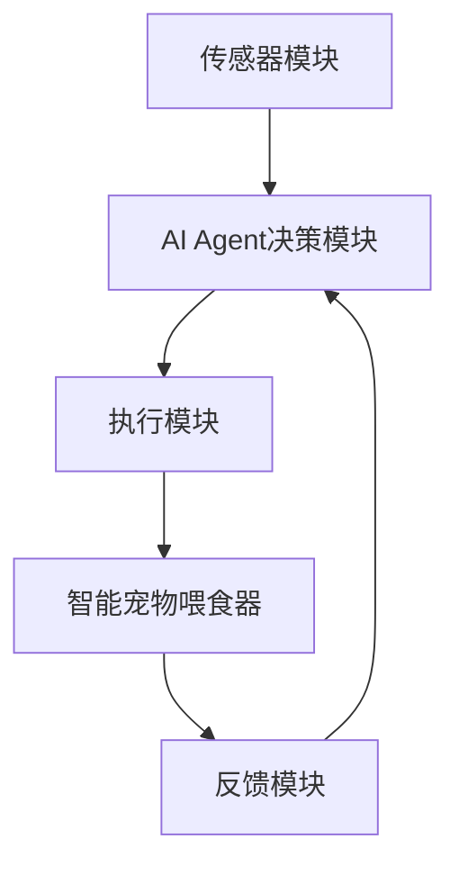

# AI Agent在智能宠物喂食器中的定量控制

> 关键词：AI Agent、智能宠物喂食器、定量控制、机器学习、传感器技术、自动化、物联网

> 摘要：本文聚焦于AI Agent在智能宠物喂食器定量控制中的应用。随着宠物市场的不断发展，智能宠物喂食器的需求日益增长，而实现精准的定量控制是其关键功能之一。AI Agent凭借其智能决策和学习能力，能够根据宠物的不同需求和状态，精确控制喂食量。文章深入探讨了AI Agent的核心概念、相关算法原理，结合数学模型进行详细分析，并通过项目实战展示其在智能宠物喂食器中的具体实现，介绍了实际应用场景、相关工具和资源，最后对未来发展趋势与挑战进行总结，为智能宠物喂食器的定量控制技术发展提供全面的参考。

## 1. 背景介绍 
### 1.1 目的和范围
随着人们生活水平的提高，宠物饲养越来越普遍，人们对宠物生活质量的关注度也日益增加。智能宠物喂食器作为一种能够为宠物提供定时、定量食物的设备，具有重要的现实意义。本文章的目的在于深入探讨AI Agent在智能宠物喂食器定量控制中的应用，详细阐述其技术原理、实现方法和应用场景等内容。范围涵盖了从AI Agent的基本概念到在智能宠物喂食器中具体的算法实现、项目实战，以及相关工具资源的推荐和未来发展趋势的分析。

### 1.2 预期读者
本文预期读者包括对智能宠物设备、人工智能技术、嵌入式系统开发等领域感兴趣的技术爱好者，从事相关领域研究和开发的科研人员、工程师，以及关注宠物生活品质提升，希望深入了解智能宠物喂食器技术原理的宠物主人。

### 1.3 文档结构概述
本文首先介绍AI Agent和智能宠物喂食器定量控制的背景信息，包括目的、预期读者和文档结构等。接着阐述核心概念与联系，通过文本示意图和Mermaid流程图展示AI Agent与智能宠物喂食器定量控制的关系。然后详细讲解核心算法原理和具体操作步骤，结合Python源代码进行说明。再介绍相关的数学模型和公式，并举例说明。之后通过项目实战展示代码实际案例和详细解释。随后介绍实际应用场景。接着推荐相关的工具和资源，包括学习资源、开发工具框架和相关论文著作。最后总结未来发展趋势与挑战，提供常见问题与解答和扩展阅读及参考资料。

### 1.4 术语表
#### 1.4.1 核心术语定义
- **AI Agent（人工智能代理）**：是一种能够感知环境，根据感知到的信息进行决策，并采取行动以实现特定目标的智能实体。
- **智能宠物喂食器**：一种具备智能化功能，能够根据预设条件或实时需求为宠物提供食物的设备。
- **定量控制**：精确地控制输出的食物量，使其符合预定的标准或要求。

#### 1.4.2 相关概念解释
- **机器学习**：是一门多领域交叉学科，涉及概率论、统计学、逼近论、凸分析、算法复杂度理论等多门学科。它专门研究计算机怎样模拟或实现人类的学习行为，以获取新的知识或技能，重新组织已有的知识结构使之不断改善自身的性能。
- **传感器技术**：是关于从自然信源获取信息，并对之进行处理（变换）和识别的一门多学科交叉的现代科学与工程技术，它涉及传感器（又称换能器）、信息处理和识别的规划设计、开发、制/建造、测试、应用及评价改进等活动。

#### 1.4.3 缩略词列表
- **AI**：Artificial Intelligence（人工智能）
- **IoT**：Internet of Things（物联网）

## 2. 核心概念与联系 
### 核心概念原理
AI Agent的工作原理基于感知、决策和行动三个主要环节。在智能宠物喂食器的场景中，AI Agent通过各种传感器感知宠物的相关信息，如宠物的体重、进食习惯、活动量等环境信息，然后根据这些信息进行决策，确定合适的喂食量，最后控制喂食器执行喂食操作。

智能宠物喂食器的定量控制是指根据宠物的需求，精确地提供固定量的食物。这需要对喂食机构进行精确的控制，确保每次输出的食物量一致。

### 架构的文本示意图
AI Agent与智能宠物喂食器定量控制的架构可以描述为：传感器模块负责收集宠物和环境的信息，将其传输给AI Agent的决策模块。决策模块根据预设的规则和机器学习模型进行分析和决策，生成控制指令。控制指令发送给执行模块，执行模块控制喂食器的机械结构进行定量喂食。同时，反馈模块将实际的喂食情况反馈给AI Agent，以便进行调整和优化。

### Mermaid流程图


## 3. 核心算法原理 & 具体操作步骤 
### 算法原理讲解
在智能宠物喂食器的定量控制中，我们可以使用基于规则的算法和机器学习算法相结合的方式。基于规则的算法根据宠物的基本信息（如体重、年龄等）和预设的喂养标准来确定初始的喂食量。机器学习算法则通过对宠物的进食历史数据进行分析，不断调整喂食量，以适应宠物的个体差异和变化。

以下是一个简单的基于Python的示例代码，用于演示基于规则的喂食量计算：

```python
# 定义宠物信息类
class Pet:
    def __init__(self, weight, age):
        self.weight = weight
        self.age = age

    def get_recommended_feeding_amount(self):
        # 简单的基于体重和年龄的喂食量计算规则
        if self.age < 1:
            return self.weight * 0.05
        else:
            return self.weight * 0.03

# 创建宠物实例
pet = Pet(5, 2)
# 计算推荐喂食量
feeding_amount = pet.get_recommended_feeding_amount()
print(f"推荐喂食量: {feeding_amount} 克")
```

### 具体操作步骤
1. **数据收集**：通过传感器收集宠物的体重、进食时间、进食量等信息。
2. **数据预处理**：对收集到的数据进行清洗、归一化等处理，以便后续的分析和使用。
3. **规则制定**：根据宠物的基本信息和常见的喂养标准，制定初始的喂食量计算规则。
4. **模型训练**：使用机器学习算法对宠物的进食历史数据进行训练，得到能够预测宠物需求的模型。
5. **决策生成**：AI Agent根据当前的宠物信息和训练好的模型，生成喂食量的决策。
6. **控制执行**：将决策转化为控制指令，发送给喂食器的执行机构，实现定量喂食。
7. **反馈调整**：根据实际的喂食情况和宠物的反应，对模型和规则进行调整和优化。

## 4. 数学模型和公式 & 详细讲解 & 举例说明 
### 数学模型
在智能宠物喂食器的定量控制中，可以使用线性回归模型来预测宠物的喂食量。线性回归模型的基本形式为：

$$y = \beta_0 + \beta_1x_1 + \beta_2x_2 + \cdots + \beta_nx_n + \epsilon$$

其中，$y$ 是预测的喂食量，$x_1, x_2, \cdots, x_n$ 是影响喂食量的因素（如宠物的体重、年龄、活动量等），$\beta_0, \beta_1, \cdots, \beta_n$ 是模型的参数，$\epsilon$ 是误差项。

### 详细讲解
线性回归模型的目标是找到一组最优的参数 $\beta_0, \beta_1, \cdots, \beta_n$，使得预测值 $y$ 与实际值之间的误差最小。通常使用最小二乘法来求解这些参数。最小二乘法的目标是最小化误差平方和：

$$S(\beta) = \sum_{i=1}^{m}(y_i - \hat{y}_i)^2$$

其中，$y_i$ 是实际的喂食量，$\hat{y}_i$ 是预测的喂食量，$m$ 是样本数量。

### 举例说明
假设我们只考虑宠物的体重 $x$ 作为影响喂食量的因素，线性回归模型可以简化为：

$$y = \beta_0 + \beta_1x + \epsilon$$

我们有以下一组样本数据：

| 宠物体重 (kg) | 喂食量 (g) |
| ------------- | ---------- |
| 3             | 100        |
| 4             | 120        |
| 5             | 140        |
| 6             | 160        |

使用最小二乘法求解参数 $\beta_0$ 和 $\beta_1$，可以得到：

$$\beta_1 = \frac{\sum_{i=1}^{m}(x_i - \bar{x})(y_i - \bar{y})}{\sum_{i=1}^{m}(x_i - \bar{x})^2}$$

$$\beta_0 = \bar{y} - \beta_1\bar{x}$$

其中，$\bar{x}$ 和 $\bar{y}$ 分别是 $x$ 和 $y$ 的平均值。

计算得到 $\beta_1 = 20$，$\beta_0 = 40$，则线性回归模型为：

$$y = 40 + 20x$$

当宠物体重为 7 kg 时，预测的喂食量为：

$$y = 40 + 20 \times 7 = 180 \text{ g}$$

## 5. 项目实战：代码实际案例和详细解释说明 
### 5.1  开发环境搭建
- **硬件环境**：选择合适的智能宠物喂食器硬件平台，如基于Arduino或Raspberry Pi的开发板，配备称重传感器、电机驱动模块等。
- **软件环境**：安装Python开发环境，以及相关的库，如`numpy`、`pandas`、`scikit-learn`等。

### 5.2  源代码详细实现和代码解读
以下是一个完整的智能宠物喂食器定量控制的Python代码示例：

```python
import numpy as np
from sklearn.linear_model import LinearRegression

# 模拟收集到的宠物体重和喂食量数据
weights = np.array([3, 4, 5, 6]).reshape(-1, 1)
feeding_amounts = np.array([100, 120, 140, 160])

# 创建线性回归模型
model = LinearRegression()
# 训练模型
model.fit(weights, feeding_amounts)

# 定义宠物类
class Pet:
    def __init__(self, weight):
        self.weight = weight

    def get_recommended_feeding_amount(self, model):
        # 使用训练好的模型预测喂食量
        return model.predict([[self.weight]])[0]

# 创建宠物实例
pet = Pet(7)
# 计算推荐喂食量
recommended_feeding_amount = pet.get_recommended_feeding_amount(model)
print(f"推荐喂食量: {recommended_feeding_amount} 克")
```

### 5.3  代码解读与分析
1. **数据准备**：使用`numpy`数组模拟收集到的宠物体重和喂食量数据。
2. **模型创建与训练**：使用`sklearn`库中的`LinearRegression`类创建线性回归模型，并使用收集到的数据进行训练。
3. **宠物类定义**：定义一个`Pet`类，其中包含一个方法`get_recommended_feeding_amount`，用于根据训练好的模型预测宠物的喂食量。
4. **预测与输出**：创建宠物实例，调用`get_recommended_feeding_amount`方法计算推荐喂食量，并输出结果。

## 6. 实际应用场景 
### 家庭场景
在家庭中，主人可能因为工作等原因无法按时给宠物喂食。智能宠物喂食器结合AI Agent的定量控制功能，可以根据宠物的需求，定时、定量地为宠物提供食物，确保宠物的饮食健康。

### 宠物店场景
宠物店中通常饲养着多只宠物，每只宠物的需求可能不同。智能宠物喂食器可以根据每只宠物的信息，精确地为它们提供食物，提高管理效率。

### 宠物寄养场景
在宠物寄养机构，宠物的饮食需要得到严格的控制。AI Agent的定量控制功能可以确保每只寄养宠物都能得到合适的食物量，保证宠物的健康和安全。

## 7. 工具和资源推荐
### 7.1 学习资源推荐
#### 7.1.1 书籍推荐
- 《机器学习》（周志华）：全面介绍了机器学习的基本概念、算法和应用，是学习机器学习的经典教材。
- 《Python机器学习实战》（Sebastian Raschka）：通过实际案例介绍了如何使用Python实现机器学习算法，适合初学者。

#### 7.1.2 在线课程
- Coursera上的“Machine Learning”（Andrew Ng）：由著名的机器学习专家Andrew Ng教授授课，是学习机器学习的优质课程。
- 网易云课堂上的“人工智能基础课程”：系统地介绍了人工智能的基本概念和技术。

#### 7.1.3 技术博客和网站
- Medium：上面有很多关于人工智能、机器学习的技术文章和案例分享。
- 机器之心：专注于人工智能领域的资讯和技术解读。

### 7.2 开发工具框架推荐
#### 7.2.1 IDE和编辑器
- PyCharm：功能强大的Python集成开发环境，提供代码编辑、调试、版本控制等功能。
- Visual Studio Code：轻量级的代码编辑器，支持多种编程语言和插件扩展。

#### 7.2.2 调试和性能分析工具
- Py-Spy：用于分析Python代码的性能瓶颈。
- PDB：Python自带的调试工具，方便调试代码。

#### 7.2.3 相关框架和库
- TensorFlow：开源的机器学习框架，广泛应用于深度学习领域。
- Keras：基于TensorFlow的高级神经网络API，易于使用。

### 7.3 相关论文著作推荐
#### 7.3.1 经典论文
- “A Logical Calculus of the Ideas Immanent in Nervous Activity”（Warren S. McCulloch and Walter Pitts）：提出了人工神经网络的基本模型。
- “Learning Representations by Back-propagating Errors”（David E. Rumelhart, Geoffrey E. Hinton, and Ronald J. Williams）：介绍了反向传播算法，是神经网络发展的重要里程碑。

#### 7.3.2 最新研究成果
- 关注顶级学术会议如NeurIPS、ICML等的最新论文，了解人工智能领域的最新研究动态。

#### 7.3.3 应用案例分析
- 查阅相关的学术期刊和行业报告，了解AI Agent在智能设备中的实际应用案例和效果。

## 8. 总结：未来发展趋势与挑战
### 未来发展趋势
- **智能化程度不断提高**：AI Agent将能够更准确地感知宠物的需求和状态，实现更加个性化的定量控制。
- **与其他智能设备的融合**：智能宠物喂食器将与智能家居系统、宠物健康监测设备等进行融合，提供更加全面的宠物服务。
- **云服务的应用**：通过云服务，可以实现对宠物喂食数据的远程管理和分析，方便主人随时了解宠物的饮食情况。

### 挑战
- **数据安全与隐私问题**：智能宠物喂食器收集的宠物信息和主人的相关数据需要得到有效的保护，防止数据泄露。
- **算法的准确性和鲁棒性**：AI Agent的决策算法需要不断优化，以提高在不同环境和情况下的准确性和鲁棒性。
- **成本问题**：提高智能宠物喂食器的性能和功能可能会增加成本，如何在保证质量的前提下降低成本是一个挑战。

## 9. 附录：常见问题与解答
### 问题1：智能宠物喂食器的定量控制精度能达到多少？
答：定量控制精度取决于传感器的精度、机械结构的设计和算法的优化程度。一般来说，精度可以达到几克甚至更高。

### 问题2：AI Agent如何适应不同宠物的需求？
答：AI Agent通过收集宠物的历史数据，使用机器学习算法进行训练，不断调整决策模型，以适应不同宠物的需求和变化。

### 问题3：智能宠物喂食器在断电或网络故障时怎么办？
答：一些智能宠物喂食器具备本地存储和离线工作的功能，在断电或网络故障时可以按照预设的程序进行喂食。同时，也可以设置备用电源以保证设备的正常运行。

## 10. 扩展阅读 & 参考资料
### 扩展阅读
- 《人工智能：现代方法》（Stuart Russell and Peter Norvig）：全面介绍了人工智能的理论和方法。
- 《深度学习》（Ian Goodfellow, Yoshua Bengio, and Aaron Courville）：深入探讨了深度学习的原理和应用。

### 参考资料
- 相关的学术论文、技术报告和行业标准。
- 智能宠物喂食器的产品说明书和技术文档。