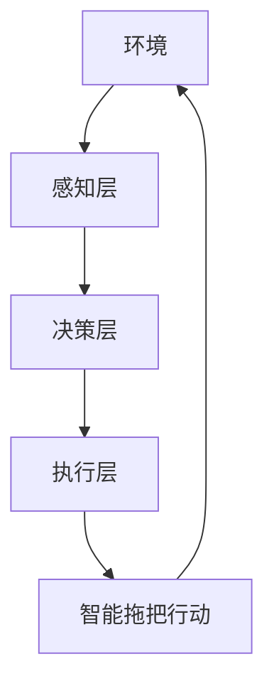

# AI Agent在智能拖把中的清洁效率优化

> 关键词：AI Agent、智能拖把、清洁效率、优化算法、路径规划

> 摘要：本文聚焦于AI Agent在智能拖把中的应用，旨在深入探讨如何通过AI技术优化智能拖把的清洁效率。首先介绍了相关背景知识，包括研究目的、预期读者等内容。接着阐述了AI Agent和智能拖把的核心概念及联系，详细讲解了核心算法原理与具体操作步骤，并结合数学模型和公式进行分析。通过项目实战展示了代码实现及解读，分析了实际应用场景。最后推荐了相关工具和资源，总结了未来发展趋势与挑战，还提供了常见问题解答和参考资料，为智能拖把清洁效率的优化提供全面的技术支持和理论依据。

## 1. 背景介绍 
### 1.1 目的和范围
随着智能家居市场的不断发展，智能拖把作为一种重要的清洁设备，受到了越来越多消费者的关注。然而，目前智能拖把在清洁效率方面仍存在一些问题，如清洁路径不合理、清洁时间过长等。本研究的目的是通过引入AI Agent技术，优化智能拖把的清洁策略，提高其清洁效率。研究范围涵盖了AI Agent的基本原理、智能拖把的工作机制、以及两者结合的具体实现方法。

### 1.2 预期读者
本文预期读者包括智能家居领域的研究人员、智能拖把的开发工程师、对AI技术在清洁设备中应用感兴趣的技术爱好者，以及相关专业的学生等。希望通过本文的介绍，能为他们在智能拖把清洁效率优化方面提供有益的参考和思路。

### 1.3 文档结构概述
本文首先介绍相关背景知识，包括研究目的、预期读者和文档结构等内容。接着阐述AI Agent和智能拖把的核心概念及联系，通过文本示意图和Mermaid流程图进行展示。然后详细讲解核心算法原理与具体操作步骤，结合Python源代码进行说明。之后分析数学模型和公式，并举例说明。通过项目实战展示代码实现及解读，分析实际应用场景。最后推荐相关工具和资源，总结未来发展趋势与挑战，提供常见问题解答和参考资料。

### 1.4 术语表
#### 1.4.1 核心术语定义
- **AI Agent**：即人工智能智能体，是一种能够感知环境、进行决策并采取行动以实现特定目标的智能实体。在智能拖把中，AI Agent可以根据环境信息制定清洁策略。
- **智能拖把**：具备一定智能功能的清洁设备，能够自动完成地面清洁任务，通常配备有传感器、控制器和清洁部件等。
- **清洁效率**：指智能拖把在单位时间内完成的清洁工作量，通常用清洁面积、清洁质量等指标来衡量。

#### 1.4.2 相关概念解释
- **路径规划**：是指智能拖把在清洁过程中，根据环境信息和清洁目标，规划出一条最优的清洁路径，以提高清洁效率。
- **环境感知**：智能拖把通过各种传感器（如激光雷达、摄像头等）获取周围环境的信息，包括障碍物的位置、地面的类型等，为路径规划和清洁决策提供依据。

#### 1.4.3 缩略词列表
- **SLAM**：Simultaneous Localization and Mapping，同时定位与地图构建，用于智能拖把在未知环境中实时创建地图并确定自身位置。
- **ROS**：Robot Operating System，机器人操作系统，为智能拖把的开发提供了一个开源的软件框架。

## 2. 核心概念与联系 
### 核心概念原理
AI Agent的核心原理是基于感知、决策和行动的循环过程。在智能拖把中，AI Agent通过传感器感知环境信息，如地面的脏污程度、障碍物的位置等。然后，根据这些信息进行决策，选择合适的清洁策略和路径。最后，控制智能拖把执行相应的行动，完成清洁任务。

智能拖把的工作原理是通过电机驱动清洁部件（如拖布）对地面进行擦拭，同时利用传感器获取环境信息，以实现自主导航和清洁。

### 架构的文本示意图
智能拖把的整体架构可以分为三个层次：感知层、决策层和执行层。感知层主要负责获取环境信息，包括传感器的硬件设备和数据处理模块。决策层是AI Agent的核心，根据感知层提供的信息进行决策，生成清洁策略和路径规划。执行层则根据决策层的指令，控制智能拖把的运动和清洁操作。

### Mermaid流程图


## 3. 核心算法原理 & 具体操作步骤 
### 核心算法原理
在智能拖把中，常用的核心算法包括路径规划算法和清洁策略优化算法。路径规划算法的目标是找到一条最优的清洁路径，以减少清洁时间和能耗。常见的路径规划算法有A*算法、Dijkstra算法等。

清洁策略优化算法则根据地面的脏污程度和清洁目标，选择合适的清洁模式和力度。例如，对于脏污较严重的区域，可以采用多次清洁或加大清洁力度的策略。

### 具体操作步骤
1. **环境感知**：智能拖把通过传感器获取环境信息，包括障碍物的位置、地面的类型和脏污程度等。
2. **地图构建**：利用SLAM算法根据环境信息构建地图，确定智能拖把的当前位置和环境布局。
3. **路径规划**：根据地图信息和清洁目标，使用路径规划算法生成最优的清洁路径。
4. **清洁决策**：根据地面的脏污程度和清洁路径，选择合适的清洁模式和力度。
5. **执行清洁**：智能拖把按照规划的路径和清洁策略执行清洁任务。
6. **实时更新**：在清洁过程中，实时更新环境信息和地图，根据新的信息调整清洁策略和路径。

### Python源代码详细阐述
以下是一个简单的A*路径规划算法的Python实现示例：
```python
import heapq

class Node:
    def __init__(self, x, y, g=float('inf'), h=float('inf'), parent=None):
        self.x = x
        self.y = y
        self.g = g
        self.h = h
        self.f = g + h
        self.parent = parent

    def __lt__(self, other):
        return self.f < other.f

def heuristic(a, b):
    return abs(a[0] - b[0]) + abs(a[1] - b[1])

def a_star(grid, start, goal):
    open_list = []
    closed_set = set()

    start_node = Node(start[0], start[1], 0, heuristic(start, goal))
    heapq.heappush(open_list, start_node)

    while open_list:
        current = heapq.heappop(open_list)

        if (current.x, current.y) == goal:
            path = []
            while current:
                path.append((current.x, current.y))
                current = current.parent
            return path[::-1]

        closed_set.add((current.x, current.y))

        neighbors = [(current.x + 1, current.y), (current.x - 1, current.y),
                     (current.x, current.y + 1), (current.x, current.y - 1)]

        for neighbor in neighbors:
            if 0 <= neighbor[0] < len(grid) and 0 <= neighbor[1] < len(grid[0]) and grid[neighbor[0]][neighbor[1]] == 0:
                if neighbor in closed_set:
                    continue

                tentative_g = current.g + 1
                neighbor_node = Node(neighbor[0], neighbor[1], tentative_g, heuristic(neighbor, goal), current)

                found = False
                for i, node in enumerate(open_list):
                    if node.x == neighbor[0] and node.y == neighbor[1]:
                        if tentative_g < node.g:
                            open_list[i] = neighbor_node
                            heapq.heapify(open_list)
                        found = True
                        break

                if not found:
                    heapq.heappush(open_list, neighbor_node)

    return None

# 示例使用
grid = [
    [0, 0, 0, 0],
    [0, 1, 1, 0],
    [0, 0, 0, 0],
    [0, 0, 0, 0]
]
start = (0, 0)
goal = (3, 3)
path = a_star(grid, start, goal)
print(path)
```
在上述代码中，我们定义了一个`Node`类来表示地图中的节点，包含节点的坐标、代价和启发式值等信息。`heuristic`函数用于计算节点到目标节点的启发式距离。`a_star`函数实现了A*路径规划算法，通过优先队列（堆）来管理开放列表，不断扩展节点直到找到目标节点或开放列表为空。最后，我们给出了一个示例使用，展示了如何调用`a_star`函数进行路径规划。

## 4. 数学模型和公式 & 详细讲解 & 举例说明 
### 路径规划的数学模型
在路径规划中，我们可以将地图抽象为一个图 $G=(V, E)$，其中 $V$ 是节点集合，$E$ 是边集合。每个节点表示地图中的一个位置，边表示节点之间的连接关系。

设 $s$ 为起始节点，$g$ 为目标节点，$c(u, v)$ 表示从节点 $u$ 到节点 $v$ 的代价。路径规划的目标是找到一条从 $s$ 到 $g$ 的路径 $P=(v_0, v_1, \cdots, v_n)$，使得路径的总代价 $C(P)=\sum_{i=0}^{n-1} c(v_i, v_{i+1})$ 最小。

### A*算法的公式
A*算法是一种启发式搜索算法，通过评估节点的代价 $f(n)$ 来选择下一个扩展的节点。$f(n)$ 的计算公式为：
$$f(n)=g(n)+h(n)$$
其中，$g(n)$ 表示从起始节点到节点 $n$ 的实际代价，$h(n)$ 表示从节点 $n$ 到目标节点的启发式估计代价。

### 举例说明
假设我们有一个 $4\times4$ 的地图，起始节点为 $(0, 0)$，目标节点为 $(3, 3)$，地图中存在一些障碍物（用1表示）。我们可以使用上述的A*算法进行路径规划。

初始时，起始节点的 $g(0)=0$，$h(0)=6$（使用曼哈顿距离作为启发式函数），$f(0)=6$。然后，我们将起始节点加入开放列表。

在每次迭代中，我们从开放列表中选择 $f$ 值最小的节点进行扩展。例如，当扩展到节点 $(1, 0)$ 时，$g(1)=1$，$h(1)=5$，$f(1)=6$。

通过不断扩展节点，最终找到从起始节点到目标节点的路径。在这个例子中，找到的路径可能是 $[(0, 0), (1, 0), (2, 0), (3, 0), (3, 1), (3, 2), (3, 3)]$。

## 5. 项目实战：代码实际案例和详细解释说明 
### 5.1  开发环境搭建
#### 硬件环境
- 智能拖把开发板，如基于树莓派的智能拖把开发平台。
- 传感器设备，包括激光雷达、摄像头、红外传感器等，用于环境感知。
- 电机驱动模块，用于控制智能拖把的运动。

#### 软件环境
- 操作系统：Ubuntu 18.04或更高版本。
- 机器人操作系统（ROS）：安装ROS Melodic或Noetic版本。
- Python环境：Python 3.6或更高版本。

### 5.2  源代码详细实现和代码解读
#### 环境感知模块
```python
import rospy
from sensor_msgs.msg import LaserScan

class EnvironmentPerception:
    def __init__(self):
        rospy.init_node('environment_perception', anonymous=True)
        self.laser_sub = rospy.Subscriber('/scan', LaserScan, self.laser_callback)
        self.obstacle_distance = None

    def laser_callback(self, data):
        # 获取激光雷达数据
        ranges = data.ranges
        # 计算最近障碍物距离
        min_distance = min(ranges)
        self.obstacle_distance = min_distance
        rospy.loginfo("Obstacle distance: %f", min_distance)

    def get_obstacle_distance(self):
        return self.obstacle_distance

if __name__ == '__main__':
    perception = EnvironmentPerception()
    rospy.spin()
```
在上述代码中，我们创建了一个`EnvironmentPerception`类，用于获取激光雷达数据并计算最近障碍物的距离。通过订阅ROS的`/scan`话题，在回调函数`laser_callback`中处理激光雷达数据。

#### 路径规划模块
```python
import rospy
from nav_msgs.msg import OccupancyGrid
from geometry_msgs.msg import PoseStamped
from nav_msgs.srv import GetPlan
import numpy as np

class PathPlanning:
    def __init__(self):
        rospy.init_node('path_planning', anonymous=True)
        self.map_sub = rospy.Subscriber('/map', OccupancyGrid, self.map_callback)
        self.map = None
        self.get_plan_service = rospy.ServiceProxy('/move_base/make_plan', GetPlan)

    def map_callback(self, data):
        # 获取地图数据
        width = data.info.width
        height = data.info.height
        self.map = np.array(data.data).reshape((height, width))

    def get_path(self, start, goal):
        if self.map is None:
            rospy.logwarn("Map not available yet.")
            return None

        start_pose = PoseStamped()
        start_pose.header.frame_id = 'map'
        start_pose.pose.position.x = start[0]
        start_pose.pose.position.y = start[1]

        goal_pose = PoseStamped()
        goal_pose.header.frame_id = 'map'
        goal_pose.pose.position.x = goal[0]
        goal_pose.pose.position.y = goal[1]

        try:
            plan = self.get_plan_service(start_pose, goal_pose, 0.0)
            path = [(pose.pose.position.x, pose.pose.position.y) for pose in plan.plan.poses]
            return path
        except rospy.ServiceException as e:
            rospy.logerr("Service call failed: %s", e)
            return None

if __name__ == '__main__':
    planner = PathPlanning()
    start = (0, 0)
    goal = (5, 5)
    path = planner.get_path(start, goal)
    if path:
        rospy.loginfo("Path: %s", path)
```
在路径规划模块中，我们创建了一个`PathPlanning`类，用于获取地图数据并调用ROS的路径规划服务`/move_base/make_plan`来生成路径。通过订阅`/map`话题获取地图信息，在`get_path`方法中设置起始点和目标点，调用服务获取路径。

### 5.3  代码解读与分析
#### 环境感知模块
- 该模块通过订阅激光雷达数据，实时获取障碍物的距离信息。这对于智能拖把的避障和路径规划非常重要。
- 在`laser_callback`函数中，我们使用`min`函数计算最近障碍物的距离，并将其存储在`obstacle_distance`变量中。

#### 路径规划模块
- 该模块通过订阅地图数据，获取环境的地图信息。然后，利用ROS的路径规划服务生成从起始点到目标点的路径。
- 在`get_path`方法中，我们创建了起始点和目标点的`PoseStamped`消息，并调用路径规划服务。如果服务调用成功，将路径信息提取出来并返回。

## 6. 实际应用场景 
### 家庭清洁
在家庭环境中，智能拖把可以利用AI Agent技术，根据房间的布局和地面的脏污程度，自动规划清洁路径，提高清洁效率。例如，对于卧室、客厅等不同区域，可以采用不同的清洁策略，对于经常活动的区域可以增加清洁次数。

### 商业场所清洁
在商业场所，如办公室、商场等，智能拖把可以在非营业时间进行自动清洁。通过AI Agent的环境感知和路径规划功能，能够快速、高效地完成大面积的清洁任务，减少对正常营业的影响。

### 工业厂房清洁
在工业厂房中，地面可能会有油污、灰尘等污染物。智能拖把可以结合AI Agent技术，根据不同的污染物类型和分布情况，选择合适的清洁模式和清洁剂，提高清洁效果和效率。

## 7. 工具和资源推荐
### 7.1 学习资源推荐
#### 7.1.1 书籍推荐
- 《人工智能：一种现代的方法》：全面介绍了人工智能的基本概念、算法和应用，是学习AI Agent的经典教材。
- 《机器人学导论》：涵盖了机器人的运动学、动力学、控制和感知等方面的知识，对于理解智能拖把的工作原理有很大帮助。

#### 7.1.2 在线课程
- Coursera上的“人工智能基础”课程：由知名高校教授授课，系统地介绍了人工智能的基础知识和算法。
- edX上的“机器人操作系统（ROS）基础”课程：详细讲解了ROS的使用方法和开发技巧，适合智能拖把开发人员学习。

#### 7.1.3 技术博客和网站
- 机器人之家（https://www.robotfan.com/）：提供了丰富的机器人技术文章和资源，包括智能拖把的开发案例和经验分享。
- ROS官方文档（http://wiki.ros.org/）：ROS的官方文档，包含了ROS的详细介绍、教程和API文档，是学习ROS的重要参考资料。

### 7.2 开发工具框架推荐
#### 7.2.1 IDE和编辑器
- PyCharm：一款功能强大的Python集成开发环境，提供了代码编辑、调试、版本控制等功能，适合智能拖把开发中的Python代码编写。
- Visual Studio Code：一款轻量级的代码编辑器，支持多种编程语言和插件扩展，方便进行多语言开发和项目管理。

#### 7.2.2 调试和性能分析工具
- gdb：GNU调试器，可用于调试C、C++等语言编写的代码，帮助开发人员定位和解决程序中的错误。
- cProfile：Python的性能分析工具，可用于分析Python代码的运行时间和资源消耗情况，优化代码性能。

#### 7.2.3 相关框架和库
- OpenCV：开源计算机视觉库，提供了丰富的图像处理和计算机视觉算法，可用于智能拖把的视觉感知和环境识别。
- NumPy：Python的数值计算库，提供了高效的数组操作和数学函数，可用于智能拖把的数据处理和算法实现。

### 7.3 相关论文著作推荐
#### 7.3.1 经典论文
- “A* Search Algorithm”：介绍了A*搜索算法的原理和应用，是路径规划领域的经典论文。
- “Simultaneous Localization and Mapping (SLAM): Part I”：对同时定位与地图构建（SLAM）技术进行了系统的介绍，为智能拖把的环境感知和地图构建提供了理论基础。

#### 7.3.2 最新研究成果
- 关注IEEE Robotics and Automation Letters、Journal of Field Robotics等期刊，这些期刊发表了智能机器人领域的最新研究成果，包括智能拖把清洁效率优化的相关研究。

#### 7.3.3 应用案例分析
- 一些国际知名的智能家电企业，如iRobot、科沃斯等，会在其官方网站或技术报告中分享智能清洁设备的应用案例和技术经验，可以参考学习。

## 8. 总结：未来发展趋势与挑战
### 未来发展趋势
- **智能化程度不断提高**：随着AI技术的不断发展，智能拖把的智能化程度将不断提高。例如，AI Agent将能够更好地理解用户的需求，根据用户的习惯和环境变化自动调整清洁策略。
- **多机器人协作**：未来，可能会出现多个智能拖把协同工作的场景，通过机器人之间的通信和协作，提高清洁效率和覆盖范围。
- **与其他智能家居设备的集成**：智能拖把将与其他智能家居设备，如智能音箱、智能摄像头等进行集成，实现更加便捷的控制和管理。

### 挑战
- **环境适应性**：智能拖把在不同的环境中可能会遇到各种复杂的情况，如不规则的房间布局、不同类型的障碍物等，如何提高智能拖把的环境适应性是一个挑战。
- **数据安全和隐私**：智能拖把在工作过程中会收集大量的环境信息和用户数据，如何保障数据的安全和隐私是一个重要问题。
- **成本控制**：提高智能拖把的清洁效率通常需要采用更先进的技术和设备，这可能会增加产品的成本。如何在提高性能的同时控制成本，是企业面临的一个挑战。

## 9. 附录：常见问题与解答
### 1. 智能拖把的清洁效果如何保证？
智能拖把通过AI Agent技术进行路径规划和清洁决策，能够根据地面的脏污程度选择合适的清洁模式和力度。同时，一些智能拖把还配备了多种清洁部件和清洁剂，以提高清洁效果。

### 2. 智能拖把在遇到障碍物时如何处理？
智能拖把通常配备有多种传感器，如激光雷达、红外传感器等，用于感知障碍物的位置。当遇到障碍物时，AI Agent会根据障碍物的信息重新规划路径，绕过障碍物继续进行清洁。

### 3. 智能拖把的续航能力如何？
智能拖把的续航能力取决于其电池容量和清洁模式。一般来说，智能拖把的续航时间在1-2小时左右。一些智能拖把还具备自动回充功能，当电量不足时会自动返回充电座进行充电。

### 4. 智能拖把的维护和保养需要注意什么？
智能拖把的维护和保养主要包括清洁拖布、清理集尘盒、检查传感器等。定期清洁拖布可以保证清洁效果，清理集尘盒可以防止灰尘堵塞。同时，要注意避免传感器受到损坏，保持其正常工作。

## 10. 扩展阅读 & 参考资料
### 扩展阅读
- 《智能家居：未来生活的新趋势》：介绍了智能家居的发展现状和未来趋势，包括智能清洁设备的应用前景。
- 《人工智能与机器人技术》：深入探讨了人工智能和机器人技术的结合，为智能拖把的技术发展提供了更广阔的视野。

### 参考资料
- [iRobot官方网站](https://www.irobot.com/)
- [科沃斯官方网站](https://www.ecovacs.com/)
- [ROS官方文档](http://wiki.ros.org/)
- [OpenCV官方文档](https://docs.opencv.org/)
- [NumPy官方文档](https://numpy.org/doc/)