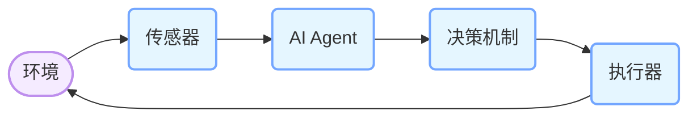
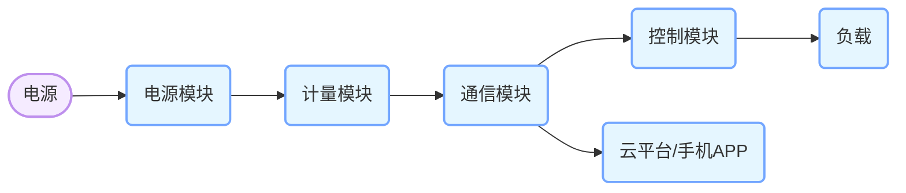

# AI Agent在智能插座中的能源使用优化

> 关键词：AI Agent、智能插座、能源使用优化、物联网、机器学习、节能、智能家居

> 摘要：本文围绕AI Agent在智能插座中的能源使用优化展开深入探讨。首先介绍了研究的背景、目的和范围等基础信息，阐述了AI Agent、智能插座等核心概念及其联系。详细讲解了相关核心算法原理，通过Python代码进行了具体实现步骤的说明，同时给出了相应的数学模型和公式并举例。在项目实战部分，搭建了开发环境，给出了源代码实现和解读。探讨了AI Agent在智能插座中能源使用优化的实际应用场景，推荐了学习资源、开发工具框架和相关论文著作。最后总结了未来发展趋势与挑战，提供了常见问题解答和扩展阅读参考资料，旨在为实现智能插座的能源高效利用提供全面的技术指导和理论支持。

## 1. 背景介绍 
### 1.1 目的和范围
随着全球能源问题的日益突出，提高能源利用效率已成为各个领域的重要任务。智能家居作为未来家居发展的趋势，其中智能插座作为连接电器和电源的关键设备，其能源使用优化具有重要意义。本研究的目的在于探讨如何利用AI Agent技术实现智能插座的能源使用优化，减少能源浪费，提高能源利用效率。

研究范围涵盖了AI Agent的基本原理和技术，智能插座的工作机制和功能，以及如何将AI Agent应用于智能插座中进行能源使用优化的具体方法和策略。同时，还将涉及到相关的算法、数学模型以及实际应用场景的分析。

### 1.2 预期读者
本文预期读者包括智能家居领域的研究人员、工程师、开发者，对能源管理和AI技术感兴趣的学生和爱好者，以及从事智能插座产品研发和生产的企业人员。希望通过本文的介绍，能为他们在智能插座能源使用优化方面提供理论和实践上的参考。

### 1.3 文档结构概述
本文将按照以下结构进行阐述：首先介绍核心概念与联系，让读者了解AI Agent和智能插座的基本原理和它们之间的关系；接着详细讲解核心算法原理和具体操作步骤，并给出Python代码示例；然后介绍相关的数学模型和公式，并进行详细讲解和举例说明；在项目实战部分，搭建开发环境，给出源代码实现和详细解读；探讨实际应用场景；推荐学习资源、开发工具框架和相关论文著作；最后总结未来发展趋势与挑战，提供常见问题解答和扩展阅读参考资料。

### 1.4 术语表
#### 1.4.1 核心术语定义
- **AI Agent（人工智能代理）**：是一种能够感知环境，根据环境信息做出决策并采取行动的智能实体。它可以通过学习和推理来不断优化自己的行为，以实现特定的目标。
- **智能插座**：是一种具备通信和控制功能的插座，能够实时监测电器的用电信息，如电流、电压、功率等，并可以通过网络远程控制插座的通断电。
- **能源使用优化**：指通过合理的控制和管理，使能源的使用更加高效、经济，减少能源浪费。

#### 1.4.2 相关概念解释
- **物联网（IoT）**：是指通过各种信息传感器、射频识别技术、全球定位系统等各种装置与技术，实时采集任何需要监控、 连接、互动的物体或过程，采集其声、光、热、电、力学、化学、生物、位置等各种需要的信息，通过各类可能的网络接入，实现物与物、物与人的泛在连接，实现对物品和过程的智能化感知、识别和管理。智能插座是物联网在智能家居领域的一个典型应用。
- **机器学习**：是一门多领域交叉学科，涉及概率论、统计学、逼近论、凸分析、算法复杂度理论等多门学科。它专门研究计算机怎样模拟或实现人类的学习行为，以获取新的知识或技能，重新组织已有的知识结构使之不断改善自身的性能。AI Agent在智能插座能源使用优化中可以利用机器学习算法来学习用户的用电习惯和电器的运行模式，从而实现优化控制。

#### 1.4.3 缩略词列表
- **IoT**：Internet of Things（物联网）
- **ML**：Machine Learning（机器学习）

## 2. 核心概念与联系 

### 2.1 AI Agent的原理
AI Agent可以被看作是一个在特定环境中运行的智能实体，它通过传感器感知环境信息，然后根据内部的决策机制做出决策，并通过执行器采取相应的行动。其基本原理可以用以下示意图表示：



AI Agent的工作流程如下：
1. **感知环境**：通过传感器获取环境中的各种信息，如电器的功率、使用时间等。
2. **决策**：AI Agent内部的决策机制根据感知到的信息进行分析和推理，做出相应的决策。
3. **行动**：通过执行器将决策转化为实际的行动，如控制智能插座的通断电。

### 2.2 智能插座的架构
智能插座一般由硬件和软件两部分组成。硬件部分主要包括电源模块、通信模块、计量模块和控制模块；软件部分包括嵌入式操作系统、通信协议栈和应用程序。其架构示意图如下：



智能插座的工作过程如下：
1. **电源供应**：电源模块为智能插座的各个模块提供稳定的电源。
2. **计量**：计量模块实时监测负载的用电信息，如电流、电压、功率等。
3. **通信**：通信模块将计量信息上传到云平台或手机APP，同时接收来自云平台或手机APP的控制指令。
4. **控制**：控制模块根据接收到的控制指令控制插座的通断电。

### 2.3 AI Agent与智能插座的联系
AI Agent可以与智能插座相结合，实现智能插座的能源使用优化。AI Agent可以通过智能插座的计量模块获取电器的用电信息，然后根据这些信息进行分析和决策，最后通过智能插座的控制模块控制插座的通断电。具体联系如下：
- **数据获取**：AI Agent从智能插座的计量模块获取电器的实时用电数据，如功率、电流、电压等。
- **决策制定**：AI Agent根据获取的数据，结合用户的用电习惯和电器的运行模式，制定优化的能源使用策略。
- **控制执行**：AI Agent将决策结果发送给智能插座的控制模块，控制模块根据指令控制插座的通断电，实现能源使用的优化。

## 3. 核心算法原理 & 具体操作步骤 

### 3.1 基于规则的控制算法
基于规则的控制算法是一种简单直观的能源使用优化算法，它根据预设的规则来控制智能插座的通断电。例如，可以设置在特定的时间段内关闭某些非必要的电器，或者当电器的功率超过一定阈值时自动关闭插座。

#### 3.1.1 算法原理
基于规则的控制算法的基本原理是定义一系列的规则，当满足这些规则时，执行相应的操作。规则可以根据时间、电器功率、用户设置等因素来定义。

#### 3.1.2 Python代码实现
```python
# 定义规则类
class Rule:
    def __init__(self, start_time, end_time, power_threshold, action):
        self.start_time = start_time
        self.end_time = end_time
        self.power_threshold = power_threshold
        self.action = action

    def check(self, current_time, current_power):
        if self.start_time <= current_time <= self.end_time and current_power > self.power_threshold:
            return self.action
        return None

# 定义智能插座类
class SmartSocket:
    def __init__(self):
        self.rules = []
        self.status = "on"

    def add_rule(self, rule):
        self.rules.append(rule)

    def update_status(self, current_time, current_power):
        for rule in self.rules:
            action = rule.check(current_time, current_power)
            if action is not None:
                self.status = action
                break

# 示例使用
socket = SmartSocket()
# 添加规则：在9:00 - 12:00期间，功率超过100W时关闭插座
rule = Rule(9, 12, 100, "off")
socket.add_rule(rule)

# 模拟当前时间和功率
current_time = 10
current_power = 120

socket.update_status(current_time, current_power)
print(f"插座状态: {socket.status}")
```

### 3.2 基于机器学习的预测算法
基于机器学习的预测算法可以通过学习用户的用电习惯和电器的运行模式，预测未来的用电需求，从而实现能源使用的优化。

#### 3.2.1 算法原理
基于机器学习的预测算法一般采用监督学习的方法，将历史用电数据作为训练集，训练一个预测模型。预测模型可以根据当前的时间、环境等因素预测未来的用电功率。然后根据预测结果，提前调整智能插座的通断电状态，以实现能源使用的优化。

#### 3.2.2 Python代码实现
```python
import numpy as np
from sklearn.linear_model import LinearRegression

# 生成示例数据
time = np.array([1, 2, 3, 4, 5, 6, 7, 8, 9, 10]).reshape(-1, 1)
power = np.array([10, 12, 15, 13, 16, 18, 20, 19, 22, 25])

# 训练线性回归模型
model = LinearRegression()
model.fit(time, power)

# 预测未来时间的功率
future_time = np.array([11]).reshape(-1, 1)
predicted_power = model.predict(future_time)

print(f"预测的功率: {predicted_power[0]}")
```

## 4. 数学模型和公式 & 详细讲解 & 举例说明 

### 4.1 基于规则的控制算法的数学模型
基于规则的控制算法可以用以下数学模型来表示：

设 $t$ 为当前时间，$P$ 为当前电器的功率，$t_{start}$ 和 $t_{end}$ 为规则的开始时间和结束时间，$P_{threshold}$ 为功率阈值，$A$ 为动作（$A = 1$ 表示关闭插座，$A = 0$ 表示保持插座开启）。则规则可以表示为：

$$
A = 
\begin{cases}
1, & \text{if } t_{start} \leq t \leq t_{end} \text{ and } P > P_{threshold} \\
0, & \text{otherwise}
\end{cases}
$$

**举例说明**：假设规则为在9:00 - 12:00期间，功率超过100W时关闭插座。即 $t_{start} = 9$，$t_{end} = 12$，$P_{threshold} = 100$。如果当前时间 $t = 10$，当前功率 $P = 120$，则满足条件 $t_{start} \leq t \leq t_{end}$ 且 $P > P_{threshold}$，所以 $A = 1$，即关闭插座。

### 4.2 基于机器学习的预测算法的数学模型
基于机器学习的线性回归预测算法的数学模型可以表示为：

$$
y = \beta_0 + \beta_1x_1 + \beta_2x_2 + \cdots + \beta_nx_n + \epsilon
$$

其中，$y$ 为预测的用电功率，$x_1, x_2, \cdots, x_n$ 为输入的特征，如时间、环境温度等，$\beta_0, \beta_1, \cdots, \beta_n$ 为模型的系数，$\epsilon$ 为误差项。

在简单线性回归的情况下，只有一个特征 $x$，则模型可以简化为：

$$
y = \beta_0 + \beta_1x + \epsilon
$$

模型的系数 $\beta_0$ 和 $\beta_1$ 可以通过最小二乘法来估计，使得预测值与实际值之间的误差平方和最小。

**举例说明**：假设我们使用时间作为唯一的特征来预测用电功率，通过训练得到模型的系数 $\beta_0 = 5$，$\beta_1 = 2$。则预测模型为 $y = 5 + 2x$。如果当前时间 $x = 11$，则预测的用电功率 $y = 5 + 2 \times 11 = 27$。

## 5. 项目实战：代码实际案例和详细解释说明 

### 5.1  开发环境搭建
#### 5.1.1 硬件环境
- **智能插座**：选择一款支持通信功能的智能插座，如小米智能插座、华为智能插座等。
- **开发板**：可以选择树莓派等开发板作为AI Agent的运行平台。
- **传感器**：如果需要获取更多的环境信息，可以添加温度传感器、湿度传感器等。

#### 5.1.2 软件环境
- **操作系统**：在开发板上安装Linux操作系统，如Raspbian。
- **编程语言**：使用Python作为开发语言。
- **开发工具**：可以使用PyCharm、VS Code等集成开发环境。

### 5.2  源代码详细实现和代码解读
#### 5.2.1 数据采集模块
```python
import serial

# 初始化串口通信
ser = serial.Serial('/dev/ttyUSB0', 9600)

def get_power_data():
    try:
        # 从串口读取数据
        data = ser.readline().decode('utf-8').strip()
        # 解析数据，假设数据格式为 "P:xxx"
        power = float(data.split(':')[1])
        return power
    except Exception as e:
        print(f"数据采集错误: {e}")
        return None
```
**代码解读**：该模块通过串口通信从智能插座的计量模块获取电器的功率数据。首先初始化串口通信，然后定义了一个 `get_power_data` 函数，该函数从串口读取数据，并解析出功率值。

#### 5.2.2 规则控制模块
```python
class Rule:
    def __init__(self, start_time, end_time, power_threshold, action):
        self.start_time = start_time
        self.end_time = end_time
        self.power_threshold = power_threshold
        self.action = action

    def check(self, current_time, current_power):
        if self.start_time <= current_time <= self.end_time and current_power > self.power_threshold:
            return self.action
        return None

class SmartSocket:
    def __init__(self):
        self.rules = []
        self.status = "on"

    def add_rule(self, rule):
        self.rules.append(rule)

    def update_status(self, current_time, current_power):
        for rule in self.rules:
            action = rule.check(current_time, current_power)
            if action is not None:
                self.status = action
                break

    def control_socket(self):
        if self.status == "on":
            # 发送开启插座的指令
            print("开启插座")
        else:
            # 发送关闭插座的指令
            print("关闭插座")
```
**代码解读**：该模块实现了基于规则的控制算法。定义了 `Rule` 类来表示规则，`SmartSocket` 类来表示智能插座。`SmartSocket` 类的 `add_rule` 方法用于添加规则，`update_status` 方法根据当前时间和功率更新插座的状态，`control_socket` 方法根据插座的状态发送相应的控制指令。

#### 5.2.3 主程序模块
```python
import time

# 初始化智能插座
socket = SmartSocket()
# 添加规则：在9:00 - 12:00期间，功率超过100W时关闭插座
rule = Rule(9, 12, 100, "off")
socket.add_rule(rule)

while True:
    # 获取当前时间
    current_time = time.localtime().tm_hour
    # 获取当前功率
    current_power = get_power_data()

    if current_power is not None:
        # 更新插座状态
        socket.update_status(current_time, current_power)
        # 控制插座
        socket.control_socket()

    # 每隔10秒采集一次数据
    time.sleep(10)
```
**代码解读**：主程序模块负责循环执行数据采集、状态更新和插座控制操作。首先初始化智能插座并添加规则，然后在一个无限循环中，获取当前时间和功率，根据规则更新插座的状态，并发送相应的控制指令。每隔10秒采集一次数据。

### 5.3  代码解读与分析
- **数据采集模块**：通过串口通信获取智能插座的功率数据，确保数据的实时性和准确性。
- **规则控制模块**：实现了基于规则的控制算法，根据预设的规则来控制插座的通断电，简单直观，易于实现。
- **主程序模块**：将数据采集和规则控制模块结合起来，形成一个完整的能源使用优化系统。通过循环执行数据采集和控制操作，不断调整插座的状态，实现能源使用的优化。

## 6. 实际应用场景 
### 6.1 家庭场景
在家庭场景中，AI Agent可以根据用户的生活习惯和电器的使用模式，优化智能插座的能源使用。例如，在用户离开家时，自动关闭非必要的电器，如电视、电脑等；在晚上睡觉时，自动关闭卧室的插座，避免电器待机耗电。同时，AI Agent还可以根据电价的峰谷时段，调整电器的使用时间，如在电价低谷时段开启洗衣机、热水器等大功率电器，降低用电成本。

### 6.2 商业场景
在商业场景中，AI Agent可以应用于写字楼、商场等场所的智能插座能源管理。例如，在办公时间结束后，自动关闭办公室的电器，如灯光、空调等；在商场营业时间结束后，自动关闭店铺的照明和电器设备。通过优化能源使用，降低商业场所的运营成本，提高能源利用效率。

### 6.3 工业场景
在工业场景中，AI Agent可以对工业设备的智能插座进行能源管理。例如，根据生产计划和设备的运行状态，合理安排设备的启动和停止时间，避免设备空转和不必要的能源消耗。同时，AI Agent还可以实时监测设备的用电情况，及时发现设备的故障和异常，提高设备的运行效率和可靠性。

## 7. 工具和资源推荐
### 7.1 学习资源推荐
#### 7.1.1 书籍推荐
- 《人工智能：一种现代的方法》：全面介绍了人工智能的基本概念、算法和应用，是人工智能领域的经典教材。
- 《Python机器学习实战》：通过实际案例介绍了Python在机器学习中的应用，适合初学者快速入门。
- 《智能家居技术与应用》：详细介绍了智能家居的技术原理和应用场景，对智能插座的开发和应用有很好的参考价值。

#### 7.1.2 在线课程
- Coursera上的“人工智能基础”课程：由知名大学的教授授课，系统地介绍了人工智能的基础知识和算法。
- edX上的“Python编程基础”课程：帮助学习者快速掌握Python编程语言。
- 中国大学MOOC上的“智能家居系统设计与实践”课程：结合实际项目，介绍了智能家居系统的设计和开发方法。

#### 7.1.3 技术博客和网站
- 机器之心：提供人工智能领域的最新技术和研究成果，以及相关的技术博客和案例分析。
- 开源中国：有丰富的开源项目和技术文章，对智能插座和物联网开发有很好的参考价值。
- 知乎：可以在知乎上搜索关于AI Agent、智能插座和能源管理的相关问题和回答，获取不同的观点和经验。

### 7.2 开发工具框架推荐
#### 7.2.1 IDE和编辑器
- PyCharm：一款专门为Python开发设计的集成开发环境，具有代码自动补全、调试、版本控制等功能，提高开发效率。
- VS Code：一款轻量级的代码编辑器，支持多种编程语言和插件扩展，适合快速开发和调试。
- Sublime Text：一款简洁高效的文本编辑器，具有快速打开、代码高亮等功能，适合进行简单的代码编辑。

#### 7.2.2 调试和性能分析工具
- Py-Spy：一款Python性能分析工具，可以实时监测Python程序的CPU使用率和函数调用情况，帮助开发者优化代码性能。
- pdb：Python自带的调试工具，可以在代码中设置断点，逐步执行代码，查看变量的值和程序的执行流程。
- Wireshark：一款网络协议分析工具，可以捕获和分析网络数据包，帮助开发者调试智能插座的通信功能。

#### 7.2.3 相关框架和库
- TensorFlow：一个开源的机器学习框架，提供了丰富的机器学习算法和工具，适合开发基于机器学习的AI Agent。
- PySerial：一个Python库，用于串口通信，方便与智能插座的计量模块进行数据交互。
- Flask：一个轻量级的Web框架，适合开发智能插座的云平台和手机APP后端服务。

### 7.3 相关论文著作推荐
#### 7.3.1 经典论文
- “Artificial Intelligence: A Modern Approach”：该论文系统地介绍了人工智能的基本概念、算法和应用，是人工智能领域的经典之作。
- “Machine Learning for Energy Management in Smart Grids”：探讨了机器学习在智能电网能源管理中的应用，对智能插座的能源使用优化有很好的参考价值。
- “Internet of Things: A Survey”：对物联网的技术原理、应用场景和发展趋势进行了全面的综述，为智能插座的开发和应用提供了理论基础。

#### 7.3.2 最新研究成果
- 关注IEEE Transactions on Smart Grid、ACM Transactions on Sensor Networks等学术期刊，了解AI Agent在智能插座能源使用优化方面的最新研究成果。
- 参加相关的学术会议，如ACM SIGKDD、IEEE International Conference on Smart Grid Communications等，与国内外的专家学者交流最新的研究进展。

#### 7.3.3 应用案例分析
- 参考一些实际的智能插座能源管理项目案例，如某智能家居公司的智能插座能源优化方案、某工业企业的设备智能插座能源管理系统等，了解AI Agent在实际应用中的具体实现方法和效果。

## 8. 总结：未来发展趋势与挑战
### 8.1 未来发展趋势
- **智能化程度不断提高**：随着AI技术的不断发展，AI Agent将具备更强的学习和推理能力，能够更加准确地预测用户的用电需求和电器的运行模式，实现更加智能化的能源使用优化。
- **与其他智能家居设备的集成**：智能插座将与其他智能家居设备，如智能灯具、智能窗帘、智能门锁等进行深度集成，实现整个家居环境的能源协同管理，提高能源利用效率。
- **云服务和大数据的应用**：通过云服务和大数据技术，智能插座可以存储和分析大量的用电数据，为用户提供更加个性化的能源管理方案，同时也为能源管理部门提供决策支持。

### 8.2 挑战
- **数据安全和隐私问题**：智能插座在运行过程中会收集大量的用户用电数据，这些数据涉及用户的隐私和安全。如何保证数据的安全和隐私，防止数据泄露和滥用，是一个亟待解决的问题。
- **算法的准确性和可靠性**：AI Agent的能源使用优化算法需要准确地预测用户的用电需求和电器的运行模式，但是由于用户行为的复杂性和电器运行的不确定性，算法的准确性和可靠性仍然面临挑战。
- **标准和规范的缺失**：目前智能插座和AI Agent领域缺乏统一的标准和规范，不同厂商的产品和系统之间存在兼容性问题，限制了智能插座能源使用优化技术的推广和应用。

## 9. 附录：常见问题与解答
### 9.1 智能插座的能源使用优化效果如何评估？
可以通过比较优化前后的用电量、用电成本等指标来评估智能插座的能源使用优化效果。同时，也可以使用能源效率、功率因数等技术指标来评估能源利用效率的提升情况。

### 9.2 AI Agent在智能插座中运行的稳定性如何保证？
可以通过以下措施来保证AI Agent在智能插座中运行的稳定性：选择可靠的硬件平台和操作系统，进行充分的测试和验证，采用冗余设计和容错机制，及时更新和维护软件等。

### 9.3 智能插座的能源使用优化是否会影响电器的正常使用？
合理的能源使用优化策略不会影响电器的正常使用。AI Agent会根据用户的用电习惯和电器的运行模式，在不影响电器正常功能的前提下，优化能源使用。例如，在用户离开家时关闭非必要的电器，在用户使用电器时保持插座正常供电。

## 10. 扩展阅读 & 参考资料
### 10.1 扩展阅读
- 《能源管理与节能技术》：深入介绍了能源管理的理论和方法，以及各种节能技术，对智能插座的能源使用优化有进一步的指导意义。
- 《物联网安全技术》：详细介绍了物联网安全的相关技术和方法，有助于解决智能插座能源使用优化过程中的数据安全和隐私问题。
- 《机器学习算法原理与实践》：对各种机器学习算法的原理和实现进行了深入讲解，为AI Agent在智能插座中的应用提供了更深入的技术支持。

### 10.2 参考资料
- 相关智能插座产品的技术文档和用户手册。
- 相关学术期刊和会议论文。
- 开源项目的代码和文档，如GitHub上的智能插座和AI Agent相关项目。