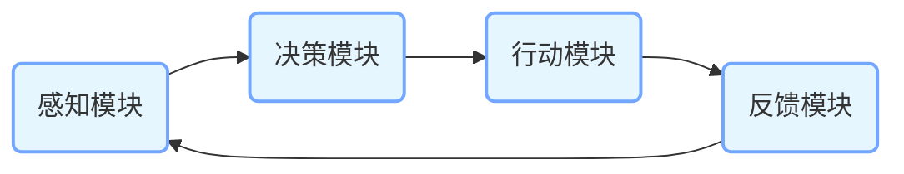

# AI Agent在智能材料设计中的角色

> 关键词：AI Agent、智能材料设计、机器学习、自动化、优化、材料性能预测、计算模拟

> 摘要：本文深入探讨了AI Agent在智能材料设计中的角色。随着材料科学的不断发展，传统的材料设计方法面临效率低、成本高的问题。AI Agent凭借其自动化、智能化的特点，能够在材料设计的多个环节发挥重要作用，包括材料性能预测、设计方案优化等。文章首先介绍了相关背景，阐述了AI Agent和智能材料设计的核心概念及联系，详细讲解了其核心算法原理与操作步骤，给出了数学模型和公式，通过项目实战展示了其应用，探讨了实际应用场景，推荐了相关工具和资源，最后总结了未来发展趋势与挑战，并对常见问题进行了解答。

## 1. 背景介绍 
### 1.1 目的和范围
智能材料设计旨在开发具有特定性能和功能的新型材料，以满足不同领域的需求，如航空航天、电子、能源等。传统的材料设计方法主要依赖于实验试错和经验积累，这不仅耗费大量的时间和资源，而且难以探索广阔的材料空间。AI Agent作为一种新兴的技术手段，为智能材料设计带来了新的机遇。本文的目的是全面探讨AI Agent在智能材料设计中的角色和作用，涵盖从基本概念到实际应用的各个方面，为材料科学家和相关研究人员提供深入的理解和实用的参考。

### 1.2 预期读者
本文预期读者包括材料科学领域的研究人员、工程师、研究生，以及对人工智能在材料科学中应用感兴趣的计算机科学家和技术爱好者。希望通过本文，能够帮助读者了解AI Agent在智能材料设计中的原理、方法和应用，促进跨学科的交流与合作。

### 1.3 文档结构概述
本文将按照以下结构进行阐述：首先介绍背景知识，包括目的、预期读者和文档结构概述；接着阐述AI Agent和智能材料设计的核心概念与联系，通过文本示意图和Mermaid流程图进行说明；然后详细讲解核心算法原理和具体操作步骤，并给出Python源代码；随后介绍数学模型和公式，并举例说明；通过项目实战展示AI Agent在智能材料设计中的具体应用；探讨实际应用场景；推荐相关的工具和资源；总结未来发展趋势与挑战；最后在附录中解答常见问题，并提供扩展阅读和参考资料。

### 1.4 术语表
#### 1.4.1 核心术语定义
- **AI Agent**：是一种能够感知环境、根据感知信息做出决策并采取行动的智能实体。在智能材料设计中，AI Agent可以自动搜索材料空间、预测材料性能、优化设计方案等。
- **智能材料设计**：是指利用计算机模拟、机器学习等技术，结合材料科学的知识，设计具有特定性能和功能的新型材料的过程。
- **材料性能预测**：通过对材料的结构、成分等信息进行分析和建模，预测材料的物理、化学性能的过程。
- **设计方案优化**：在给定的约束条件下，寻找最优的材料设计方案，以满足特定的性能和功能要求的过程。

#### 1.4.2 相关概念解释
- **机器学习**：是一门多领域交叉学科，涉及概率论、统计学、逼近论、凸分析、算法复杂度理论等多门学科。它专门研究计算机怎样模拟或实现人类的学习行为，以获取新的知识或技能，重新组织已有的知识结构使之不断改善自身的性能。在智能材料设计中，机器学习可用于材料性能预测、材料分类等任务。
- **计算模拟**：利用计算机模拟材料的微观结构和性能，如分子动力学模拟、量子力学计算等。计算模拟可以提供材料的原子尺度信息，为材料设计提供理论支持。

#### 1.4.3 缩略词列表
- **ML**：Machine Learning（机器学习）
- **MD**：Molecular Dynamics（分子动力学）
- **DFT**：Density Functional Theory（密度泛函理论）

## 2. 核心概念与联系 

### 核心概念原理
AI Agent是一种基于人工智能技术的智能实体，它具有感知、决策和行动的能力。在智能材料设计中，AI Agent可以感知材料的各种信息，如成分、结构、性能等，根据这些信息做出决策，如选择合适的材料设计方案、优化材料性能等，并采取相应的行动，如进行实验验证、调整设计参数等。

智能材料设计是一个复杂的过程，需要综合考虑材料的多个方面，如化学成分、晶体结构、微观组织等。传统的材料设计方法主要依赖于实验试错和经验积累，效率较低。而AI Agent可以利用机器学习、计算模拟等技术，快速搜索材料空间，预测材料性能，优化设计方案，从而提高材料设计的效率和准确性。

### 架构的文本示意图
AI Agent在智能材料设计中的架构可以分为以下几个部分：
1. **感知模块**：负责收集材料的各种信息，如实验数据、计算模拟结果、文献资料等。
2. **决策模块**：根据感知模块收集的信息，利用机器学习、优化算法等技术，做出决策，如选择合适的材料设计方案、优化材料性能等。
3. **行动模块**：根据决策模块的决策，采取相应的行动，如进行实验验证、调整设计参数等。
4. **反馈模块**：将行动模块的结果反馈给感知模块，以便AI Agent不断学习和改进。

### Mermaid流程图


## 3. 核心算法原理 & 具体操作步骤 

### 核心算法原理
在智能材料设计中，AI Agent常用的算法包括机器学习算法和优化算法。

#### 机器学习算法
机器学习算法可以用于材料性能预测、材料分类等任务。常见的机器学习算法包括线性回归、决策树、支持向量机、神经网络等。

以神经网络为例，神经网络是一种模仿人类神经系统的计算模型，由输入层、隐藏层和输出层组成。输入层接收材料的各种信息，如成分、结构等，隐藏层对输入信息进行处理和转换，输出层输出预测的材料性能。神经网络通过不断调整神经元之间的连接权重，来学习输入信息和输出信息之间的映射关系。

#### 优化算法
优化算法可以用于寻找最优的材料设计方案，以满足特定的性能和功能要求。常见的优化算法包括遗传算法、粒子群算法、模拟退火算法等。

以遗传算法为例，遗传算法是一种模仿生物进化过程的优化算法，通过模拟自然选择和遗传机制，不断迭代搜索最优解。遗传算法的基本操作包括选择、交叉和变异。选择操作根据个体的适应度值选择优良的个体，交叉操作将优良个体的基因进行交换，变异操作对个体的基因进行随机变异，从而产生新的个体。

### 具体操作步骤
以下是AI Agent在智能材料设计中的具体操作步骤：
1. **数据收集**：收集材料的各种信息，如实验数据、计算模拟结果、文献资料等。
2. **数据预处理**：对收集到的数据进行清洗、归一化、特征提取等预处理操作，以提高数据的质量和可用性。
3. **模型训练**：选择合适的机器学习算法和优化算法，利用预处理后的数据进行模型训练。
4. **材料性能预测**：利用训练好的模型对新材料的性能进行预测。
5. **设计方案优化**：根据预测的材料性能，利用优化算法寻找最优的材料设计方案。
6. **实验验证**：对优化后的设计方案进行实验验证，将实验结果反馈给AI Agent，以便不断学习和改进。

### Python源代码
以下是一个简单的Python示例，展示了如何使用神经网络进行材料性能预测：

```python
import numpy as np
from sklearn.neural_network import MLPRegressor
from sklearn.model_selection import train_test_split
from sklearn.preprocessing import StandardScaler

# 生成示例数据
np.random.seed(0)
X = np.random.rand(100, 5)  # 输入特征，假设每个样本有5个特征
y = np.random.rand(100)    # 目标值，假设是材料的某种性能

# 数据预处理
scaler = StandardScaler()
X_scaled = scaler.fit_transform(X)

# 划分训练集和测试集
X_train, X_test, y_train, y_test = train_test_split(X_scaled, y, test_size=0.2, random_state=42)

# 创建神经网络模型
model = MLPRegressor(hidden_layer_sizes=(10, 10), activation='relu', solver='adam', max_iter=1000)

# 模型训练
model.fit(X_train, y_train)

# 模型预测
y_pred = model.predict(X_test)

# 输出预测结果
print("预测结果:", y_pred)
```

## 4. 数学模型和公式 & 详细讲解 & 举例说明 

### 数学模型和公式
#### 神经网络
神经网络的数学模型可以表示为：

$$y = f\left(\sum_{i=1}^{n}w_{i}x_{i} + b\right)$$

其中，$y$ 是输出值，$x_{i}$ 是输入值，$w_{i}$ 是连接权重，$b$ 是偏置，$f$ 是激活函数。

常见的激活函数包括Sigmoid函数、ReLU函数等。

Sigmoid函数的公式为：

$$f(x) = \frac{1}{1 + e^{-x}}$$

ReLU函数的公式为：

$$f(x) = \max(0, x)$$

#### 遗传算法
遗传算法的适应度函数可以表示为：

$$F(x) = g(x)$$

其中，$F(x)$ 是适应度值，$g(x)$ 是目标函数。

选择操作的概率公式为：

$$P_{i} = \frac{F(x_{i})}{\sum_{j=1}^{N}F(x_{j})}$$

其中，$P_{i}$ 是个体 $x_{i}$ 被选择的概率，$N$ 是种群的大小。

交叉操作和变异操作的具体实现方式较为复杂，这里不再详细介绍。

### 详细讲解
#### 神经网络
神经网络通过不断调整连接权重和偏置，来学习输入信息和输出信息之间的映射关系。在训练过程中，使用损失函数来衡量预测值和真实值之间的差异，常用的损失函数包括均方误差（MSE）、交叉熵损失等。通过反向传播算法，计算损失函数对连接权重和偏置的梯度，然后使用优化算法（如随机梯度下降）来更新连接权重和偏置，以减小损失函数的值。

#### 遗传算法
遗传算法通过模拟自然选择和遗传机制，不断迭代搜索最优解。在每一代中，根据个体的适应度值选择优良的个体，进行交叉和变异操作，产生新的个体。适应度值越高的个体，被选择的概率越大。通过不断迭代，种群中的个体逐渐向最优解靠近。

### 举例说明
假设我们要设计一种具有特定强度和硬度的合金材料，我们可以使用神经网络来预测合金的强度和硬度，使用遗传算法来优化合金的成分。

首先，收集大量的合金材料的成分和性能数据，对数据进行预处理后，使用神经网络进行训练。训练好的神经网络可以根据合金的成分预测其强度和硬度。

然后，使用遗传算法来优化合金的成分。定义适应度函数为目标强度和硬度与预测强度和硬度之间的差异的倒数，差异越小，适应度值越高。通过遗传算法的选择、交叉和变异操作，不断迭代搜索最优的合金成分。

## 5. 项目实战：代码实际案例和详细解释说明 

### 5.1  开发环境搭建
#### 操作系统
推荐使用Linux或Windows操作系统。

#### 编程语言
使用Python 3.x版本。

#### 开发工具
推荐使用Anaconda作为Python的开发环境管理工具，使用Jupyter Notebook或PyCharm作为开发工具。

#### 安装必要的库
在命令行中执行以下命令安装必要的库：

```bash
pip install numpy pandas scikit-learn tensorflow keras
```

### 5.2  源代码详细实现和代码解读
以下是一个完整的项目实战案例，展示了如何使用AI Agent进行智能材料设计，具体任务是预测金属材料的屈服强度。

```python
import numpy as np
import pandas as pd
from sklearn.model_selection import train_test_split
from sklearn.preprocessing import StandardScaler
from sklearn.neural_network import MLPRegressor
from sklearn.metrics import mean_squared_error

# 数据加载
data = pd.read_csv('metal_materials.csv')  # 假设数据文件名为metal_materials.csv

# 数据预处理
X = data.drop('yield_strength', axis=1).values  # 输入特征
y = data['yield_strength'].values  # 目标值

# 数据标准化
scaler = StandardScaler()
X_scaled = scaler.fit_transform(X)

# 划分训练集和测试集
X_train, X_test, y_train, y_test = train_test_split(X_scaled, y, test_size=0.2, random_state=42)

# 创建神经网络模型
model = MLPRegressor(hidden_layer_sizes=(10, 10), activation='relu', solver='adam', max_iter=1000)

# 模型训练
model.fit(X_train, y_train)

# 模型预测
y_pred = model.predict(X_test)

# 评估模型
mse = mean_squared_error(y_test, y_pred)
print("均方误差:", mse)
```

### 代码解读与分析
1. **数据加载**：使用`pandas`库的`read_csv`函数加载金属材料的数据文件。
2. **数据预处理**：将输入特征和目标值分离，并使用`StandardScaler`对输入特征进行标准化处理，以提高模型的训练效果。
3. **划分训练集和测试集**：使用`train_test_split`函数将数据划分为训练集和测试集，测试集占总数据的20%。
4. **创建神经网络模型**：使用`MLPRegressor`创建一个多层感知器回归模型，设置隐藏层的大小为(10, 10)，激活函数为ReLU，优化器为Adam，最大迭代次数为1000。
5. **模型训练**：使用训练集对模型进行训练。
6. **模型预测**：使用训练好的模型对测试集进行预测。
7. **评估模型**：使用均方误差（MSE）来评估模型的性能，均方误差越小，模型的预测效果越好。

## 6. 实际应用场景 
### 新材料研发
AI Agent可以在新材料研发中发挥重要作用。通过对大量材料数据的分析和学习，AI Agent可以快速预测新材料的性能，帮助研究人员筛选出有潜力的材料体系。例如，在研发新型电池材料时，AI Agent可以根据材料的化学成分和晶体结构，预测其电池性能，如充放电容量、循环寿命等，从而加速新材料的研发进程。

### 材料性能优化
AI Agent可以用于优化现有材料的性能。通过调整材料的成分、工艺参数等，AI Agent可以寻找最优的设计方案，以提高材料的性能。例如，在钢铁生产中，AI Agent可以根据钢铁的成分和轧制工艺参数，预测其强度、韧性等性能，然后通过优化成分和工艺参数，提高钢铁的综合性能。

### 材料失效分析
AI Agent可以帮助进行材料失效分析。通过对材料失效数据的分析和学习，AI Agent可以识别材料失效的原因和机制，为材料的改进和预防提供依据。例如，在航空航天领域，AI Agent可以对飞机零部件的失效数据进行分析，找出失效的原因，如疲劳、腐蚀等，从而采取相应的措施，提高飞机的安全性和可靠性。

## 7. 工具和资源推荐
### 7.1 学习资源推荐
#### 7.1.1 书籍推荐
- 《机器学习》（周志华著）：全面介绍了机器学习的基本概念、算法和应用，是机器学习领域的经典教材。
- 《深度学习》（Ian Goodfellow、Yoshua Bengio和Aaron Courville著）：深入讲解了深度学习的原理、算法和实践，是深度学习领域的权威著作。
- 《材料科学与工程基础》（Donald R. Askeland、Pradeep P. Phule著）：系统介绍了材料科学与工程的基本概念、原理和方法，是材料科学领域的经典教材。

#### 7.1.2 在线课程
- Coursera平台上的“机器学习”课程（Andrew Ng教授主讲）：该课程是机器学习领域的经典在线课程，讲解了机器学习的基本概念、算法和应用。
- edX平台上的“深度学习基础”课程（deeplearning.ai提供）：该课程深入讲解了深度学习的原理、算法和实践。
- 中国大学MOOC平台上的“材料科学基础”课程：该课程系统介绍了材料科学的基本概念、原理和方法。

#### 7.1.3 技术博客和网站
- Medium上的Towards Data Science：该博客上有很多关于机器学习、人工智能等领域的技术文章和案例分析。
- Kaggle：一个数据科学竞赛平台，上面有很多关于数据挖掘、机器学习等领域的数据集和代码示例。
- Materials Project：一个提供材料数据和计算模拟工具的网站，可用于材料科学研究和智能材料设计。

### 7.2 开发工具框架推荐
#### 7.2.1 IDE和编辑器
- PyCharm：一款专门为Python开发设计的集成开发环境，具有代码编辑、调试、代码分析等功能。
- Jupyter Notebook：一个交互式的开发环境，支持Python、R等多种编程语言，适合进行数据探索、模型训练和结果展示。
- Visual Studio Code：一款轻量级的代码编辑器，支持多种编程语言和插件，可用于Python开发。

#### 7.2.2 调试和性能分析工具
- TensorBoard：一个用于可视化深度学习模型训练过程和结果的工具，可帮助用户分析模型的性能和训练情况。
- Scikit-learn的交叉验证和模型评估工具：可用于评估机器学习模型的性能和选择最优的模型参数。
- Profiler：Python的性能分析工具，可帮助用户找出代码中的性能瓶颈。

#### 7.2.3 相关框架和库
- TensorFlow：一个开源的深度学习框架，提供了丰富的深度学习模型和工具，可用于构建和训练神经网络。
- PyTorch：另一个开源的深度学习框架，具有动态计算图的特点，适合进行研究和开发。
- Scikit-learn：一个简单易用的机器学习库，提供了各种机器学习算法和工具，可用于数据预处理、模型训练和评估。

### 7.3 相关论文著作推荐
#### 7.3.1 经典论文
- “Deep Learning”（Yoshua Bengio、Ian Goodfellow和Aaron Courville著）：该论文是深度学习领域的经典综述论文，全面介绍了深度学习的原理、算法和应用。
- “Materials Informatics: From Data to Knowledge”（Kristin A. Persson等著）：该论文介绍了材料信息学的基本概念、方法和应用，探讨了如何利用数据和计算方法加速材料研发。

#### 7.3.2 最新研究成果
- 可以关注《Nature Materials》、《Science》、《Advanced Materials》等顶级学术期刊上的相关研究论文，了解AI Agent在智能材料设计中的最新研究成果。

#### 7.3.3 应用案例分析
- 可以参考一些实际应用案例分析的论文和报告，了解AI Agent在不同领域的智能材料设计中的具体应用和效果。

## 8. 总结：未来发展趋势与挑战
### 未来发展趋势
- **多学科融合**：AI Agent在智能材料设计中的应用将越来越多地与材料科学、物理学、化学、计算机科学等多学科进行融合，形成跨学科的研究和应用体系。
- **自动化和智能化**：随着AI技术的不断发展，AI Agent将越来越自动化和智能化，能够自主完成材料设计的各个环节，如数据收集、模型训练、设计方案优化等。
- **大数据和云计算**：大数据和云计算技术的发展将为AI Agent在智能材料设计中的应用提供更强大的计算能力和数据支持，加速材料研发的进程。
- **材料基因组计划**：材料基因组计划的推进将为AI Agent提供更多的材料数据和知识，促进AI Agent在智能材料设计中的应用和发展。

### 挑战
- **数据质量和数量**：AI Agent的性能和效果很大程度上依赖于数据的质量和数量。目前，材料数据存在数据质量不高、数据缺失、数据不一致等问题，需要进一步加强数据的收集、整理和管理。
- **模型解释性**：深度学习等机器学习模型通常是黑盒模型，缺乏解释性。在智能材料设计中，需要对模型的预测结果进行解释，以便研究人员理解和应用。
- **算法复杂度和计算资源**：一些复杂的AI算法需要大量的计算资源和时间，这限制了AI Agent在智能材料设计中的应用。需要开发更高效的算法和优化计算资源的利用。
- **跨学科人才培养**：AI Agent在智能材料设计中的应用需要跨学科的人才，既熟悉材料科学又掌握AI技术。目前，这类跨学科人才相对缺乏，需要加强跨学科人才的培养。

## 9. 附录：常见问题与解答
### 问题1：AI Agent在智能材料设计中的准确性如何保证？
解答：可以通过以下几个方面来保证AI Agent在智能材料设计中的准确性：
- 收集高质量、大量的数据，数据的质量和数量对模型的准确性有很大影响。
- 选择合适的机器学习算法和模型结构，不同的算法和模型结构适用于不同的问题。
- 进行充分的模型训练和验证，使用交叉验证等方法来评估模型的性能。
- 对模型进行优化和调整，不断改进模型的准确性。

### 问题2：AI Agent能否完全替代实验？
解答：目前AI Agent还不能完全替代实验。虽然AI Agent可以通过计算模拟和机器学习等方法预测材料的性能，但这些预测结果还需要通过实验来验证。实验可以提供真实的材料性能数据，为AI Agent的训练和优化提供依据。同时，实验还可以发现一些新的现象和问题，为材料科学的研究和发展提供新的思路。

### 问题3：如何选择适合智能材料设计的AI算法？
解答：选择适合智能材料设计的AI算法需要考虑以下几个因素：
- 问题的类型：不同的问题类型需要选择不同的算法，如分类问题可以选择决策树、支持向量机等算法，回归问题可以选择线性回归、神经网络等算法。
- 数据的特点：数据的规模、维度、分布等特点也会影响算法的选择。例如，对于大规模数据，可以选择随机梯度下降等高效的算法；对于高维数据，可以选择降维算法进行预处理。
- 算法的性能和复杂度：需要综合考虑算法的性能和复杂度，选择性能好、复杂度低的算法。

### 问题4：AI Agent在智能材料设计中的应用前景如何？
解答：AI Agent在智能材料设计中的应用前景非常广阔。随着AI技术的不断发展和材料科学的不断进步，AI Agent将在新材料研发、材料性能优化、材料失效分析等方面发挥越来越重要的作用。AI Agent可以加速材料研发的进程，降低研发成本，提高材料的性能和质量，为材料科学的发展带来新的机遇和挑战。

## 10. 扩展阅读 & 参考资料
- 相关学术期刊：《Journal of Materials Science》、《Acta Materialia》、《Journal of Chemical Information and Modeling》等。
- 相关会议：Materials Research Society (MRS) Meeting、American Chemical Society (ACS) National Meeting等。
- 相关书籍：《Materials Informatics: From Data to Knowledge》、《Machine Learning for Materials Science》等。
- 相关网站：Materials Project、AFLOWLIB.org等。