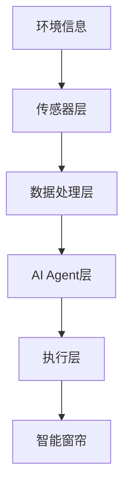

# AI Agent在智能窗帘中的昼夜节律调节

> 关键词：AI Agent、智能窗帘、昼夜节律调节、人工智能、智能家居、传感器、自动化控制

> 摘要：本文聚焦于AI Agent在智能窗帘昼夜节律调节中的应用。首先介绍了相关背景知识，包括目的范围、预期读者等内容。接着阐述了AI Agent、智能窗帘及昼夜节律调节的核心概念与联系，并给出相应的文本示意图和Mermaid流程图。详细讲解了核心算法原理和具体操作步骤，结合Python源代码进行分析。通过数学模型和公式进一步解释其工作原理，并举例说明。在项目实战部分，给出开发环境搭建、源代码实现与解读。探讨了其实际应用场景，推荐了学习资源、开发工具框架以及相关论文著作。最后总结未来发展趋势与挑战，还提供了常见问题解答和扩展阅读参考资料，旨在全面深入地探讨AI Agent在智能窗帘昼夜节律调节中的重要作用和实现方式。

## 1. 背景介绍 
### 1.1 目的和范围
随着智能家居概念的不断普及，人们对于家居环境的智能化和舒适度要求越来越高。昼夜节律是人体自然的生理节奏，与睡眠、情绪、新陈代谢等多个生理过程密切相关。智能窗帘作为智能家居的重要组成部分，通过合理的开合调节，可以有效影响室内的光照强度和时间，从而对人体的昼夜节律产生积极的影响。

本文的目的在于探讨如何利用AI Agent技术实现智能窗帘的昼夜节律调节功能。范围涵盖从核心概念的阐述、算法原理的讲解、数学模型的建立，到实际项目的开发和应用场景的分析，以及相关学习资源和工具的推荐等多个方面，力求为读者提供一个全面且深入的关于AI Agent在智能窗帘昼夜节律调节中的技术指南。

### 1.2 预期读者
本文预期读者包括但不限于以下几类人群：
- **智能家居开发者**：希望了解如何将AI Agent技术应用于智能窗帘开发，以实现更智能、更人性化的功能。
- **人工智能研究者**：对AI Agent在实际场景中的应用案例感兴趣，希望通过智能窗帘的昼夜节律调节案例深入了解AI Agent的工作原理和应用方式。
- **普通消费者**：对智能家居产品有一定了解，想进一步了解智能窗帘是如何实现昼夜节律调节，从而提高生活质量的。
- **相关专业学生**：如计算机科学、自动化、电子工程等专业的学生，可将本文作为学习AI Agent和智能家居相关知识的参考资料。

### 1.3 文档结构概述
本文将按照以下结构进行组织：
1. **背景介绍**：阐述文章的目的和范围、预期读者、文档结构概述以及相关术语表。
2. **核心概念与联系**：介绍AI Agent、智能窗帘和昼夜节律调节的核心概念，给出其原理和架构的文本示意图和Mermaid流程图。
3. **核心算法原理 & 具体操作步骤**：详细讲解实现智能窗帘昼夜节律调节的核心算法原理，并通过Python源代码进行说明。
4. **数学模型和公式 & 详细讲解 & 举例说明**：建立数学模型，给出相关公式并进行详细讲解，通过具体例子加深理解。
5. **项目实战：代码实际案例和详细解释说明**：包括开发环境搭建、源代码详细实现和代码解读。
6. **实际应用场景**：探讨AI Agent在智能窗帘昼夜节律调节中的实际应用场景。
7. **工具和资源推荐**：推荐学习资源、开发工具框架以及相关论文著作。
8. **总结：未来发展趋势与挑战**：总结AI Agent在智能窗帘昼夜节律调节中的发展趋势和面临的挑战。
9. **附录：常见问题与解答**：解答读者可能遇到的常见问题。
10. **扩展阅读 & 参考资料**：提供扩展阅读的建议和参考资料。

### 1.4 术语表
#### 1.4.1 核心术语定义
- **AI Agent（人工智能代理）**：是一种能够感知环境、根据感知信息进行决策，并采取行动以实现特定目标的智能实体。在智能窗帘的昼夜节律调节中，AI Agent可以根据环境信息（如时间、光照强度等）决定窗帘的开合状态。
- **智能窗帘**：是一种具备自动化控制功能的窗帘产品，可通过各种控制方式（如遥控器、手机APP、传感器等）实现窗帘的开合操作。
- **昼夜节律**：是指生命活动以24小时左右为周期的变动，包括睡眠 - 觉醒周期、体温、激素分泌等生理过程的周期性变化。

#### 1.4.2 相关概念解释
- **传感器**：用于感知环境信息的设备，如光照传感器可检测室内外的光照强度，时间传感器可获取当前时间信息。这些传感器为AI Agent提供决策所需的数据。
- **自动化控制**：通过计算机程序或电子设备自动控制设备的运行状态，在智能窗帘中，自动化控制可根据预设的规则或AI Agent的决策实现窗帘的自动开合。

#### 1.4.3 缩略词列表
- **AI**：Artificial Intelligence，人工智能
- **IoT**：Internet of Things，物联网

## 2. 核心概念与联系 
### 核心概念原理和架构的文本示意图
AI Agent在智能窗帘昼夜节律调节中的系统架构主要包括以下几个部分：
1. **传感器层**：由光照传感器、时间传感器等组成，负责收集环境信息，如室内外光照强度、当前时间等。
2. **数据处理层**：对传感器收集到的数据进行处理和分析，将原始数据转换为AI Agent可以理解的格式。
3. **AI Agent层**：根据数据处理层提供的信息，运用预设的算法和模型进行决策，确定智能窗帘的开合状态。
4. **执行层**：智能窗帘设备，根据AI Agent的决策执行相应的开合操作。

### Mermaid流程图

该流程图展示了整个系统的工作流程。首先，传感器层从环境中获取相关信息，然后将这些信息传输到数据处理层进行处理。处理后的数据被送到AI Agent层，AI Agent根据这些数据做出决策。最后，执行层根据AI Agent的决策控制智能窗帘的开合。

## 3. 核心算法原理 & 具体操作步骤 
### 核心算法原理
实现智能窗帘昼夜节律调节的核心算法主要基于时间和光照强度的综合判断。具体思路如下：
- 根据用户的昼夜节律习惯，设定不同时间段的光照需求。例如，早晨需要较强的光照来唤醒人体，晚上则需要较暗的环境来促进睡眠。
- 实时监测室内外的光照强度和当前时间。
- 将当前的光照强度和时间与预设的光照需求进行比较，根据比较结果决定智能窗帘的开合状态。

### 具体操作步骤
1. **初始化参数**：设定用户的昼夜节律时间表和不同时间段的光照阈值。
2. **数据采集**：通过光照传感器和时间传感器实时获取室内外光照强度和当前时间。
3. **数据处理**：对采集到的数据进行预处理，如滤波、归一化等，以提高数据的准确性。
4. **决策判断**：将当前的光照强度和时间与预设的光照需求进行比较，根据比较结果生成决策指令。
5. **执行控制**：将决策指令发送给智能窗帘设备，控制窗帘的开合状态。

### Python源代码实现
```python
import time
import random  # 模拟光照传感器数据

# 初始化参数
daylight_threshold = 500  # 白天光照阈值
nightlight_threshold = 100  # 晚上光照阈值
wakeup_time = 7  # 起床时间
bedtime = 22  # 睡觉时间

def get_current_time():
    """获取当前时间（小时）"""
    return time.localtime().tm_hour

def get_light_intensity():
    """模拟获取光照强度"""
    return random.randint(0, 1000)

def make_decision(current_time, light_intensity):
    """根据时间和光照强度做出决策"""
    if wakeup_time <= current_time < bedtime:
        if light_intensity < daylight_threshold:
            return "open"
        else:
            return "close"
    else:
        if light_intensity > nightlight_threshold:
            return "close"
        else:
            return "open"

def control_curtain(decision):
    """控制智能窗帘的开合"""
    if decision == "open":
        print("Opening the curtain...")
    else:
        print("Closing the curtain...")

while True:
    current_time = get_current_time()
    light_intensity = get_light_intensity()
    decision = make_decision(current_time, light_intensity)
    control_curtain(decision)
    time.sleep(60)  # 每分钟检查一次
```
### 代码解释
- `get_current_time` 函数：用于获取当前时间的小时数。
- `get_light_intensity` 函数：模拟光照传感器的数据，随机生成一个0到1000之间的整数作为光照强度。
- `make_decision` 函数：根据当前时间和光照强度做出决策，判断是打开还是关闭窗帘。
- `control_curtain` 函数：根据决策结果控制智能窗帘的开合，这里只是简单地打印信息，实际应用中需要与智能窗帘设备进行通信。
- 主循环：每分钟获取一次当前时间和光照强度，做出决策并控制窗帘的开合。

## 4. 数学模型和公式 & 详细讲解 & 举例说明 
### 数学模型
我们可以建立一个简单的数学模型来描述智能窗帘的昼夜节律调节过程。设 $t$ 为当前时间（小时），$I$ 为当前光照强度，$I_{day}$ 为白天光照阈值，$I_{night}$ 为晚上光照阈值，$t_{wake}$ 为起床时间，$t_{bed}$ 为睡觉时间。

决策函数 $D(t, I)$ 定义如下：
$$
D(t, I) = 
\begin{cases}
\text{open}, & \text{if } t_{wake} \leq t < t_{bed} \text{ and } I < I_{day} \\
\text{close}, & \text{if } t_{wake} \leq t < t_{bed} \text{ and } I \geq I_{day} \\
\text{close}, & \text{if } (t < t_{wake} \text{ or } t \geq t_{bed}) \text{ and } I > I_{night} \\
\text{open}, & \text{if } (t < t_{wake} \text{ or } t \geq t_{bed}) \text{ and } I \leq I_{night}
\end{cases}
$$

### 详细讲解
这个数学模型根据时间和光照强度的不同情况来决定智能窗帘的开合状态。在白天（$t_{wake} \leq t < t_{bed}$），如果光照强度低于白天光照阈值 $I_{day}$，则打开窗帘以增加室内光照；如果光照强度高于或等于 $I_{day}$，则关闭窗帘以减少室内光照。在晚上（$t < t_{wake}$ 或 $t \geq t_{bed}$），如果光照强度高于晚上光照阈值 $I_{night}$，则关闭窗帘以营造较暗的睡眠环境；如果光照强度低于或等于 $I_{night}$，则打开窗帘。

### 举例说明
假设 $t_{wake} = 7$，$t_{bed} = 22$，$I_{day} = 500$，$I_{night} = 100$。
- 当 $t = 8$，$I = 300$ 时，因为 $7 \leq 8 < 22$ 且 $300 < 500$，所以 $D(8, 300) = \text{open}$，即打开窗帘。
- 当 $t = 23$，$I = 150$ 时，因为 $23 \geq 22$ 且 $150 > 100$，所以 $D(23, 150) = \text{close}$，即关闭窗帘。

## 5. 项目实战：代码实际案例和详细解释说明 
### 5.1  开发环境搭建
#### 硬件环境
- **智能窗帘设备**：选择支持自动化控制的智能窗帘，如具备电机驱动和通信接口的产品。
- **传感器**：光照传感器和时间传感器，可选择常见的数字传感器，如BH1750光照传感器。
- **开发板**：如Arduino、Raspberry Pi等，用于连接传感器和智能窗帘设备，并运行控制程序。

#### 软件环境
- **开发语言**：Python，因为其具有丰富的库和易于学习的语法。
- **开发工具**：可选择PyCharm、Visual Studio Code等集成开发环境。
- **通信协议**：根据智能窗帘设备和传感器的接口，选择合适的通信协议，如I2C、SPI等。

### 5.2  源代码详细实现和代码解读
```python
import smbus  # 用于I2C通信
import time

# I2C总线和光照传感器地址
bus = smbus.SMBus(1)
address = 0x23

# 初始化光照传感器
def init_light_sensor():
    bus.write_byte(address, 0x10)  # 连续高分辨率模式

# 读取光照强度
def read_light_intensity():
    data = bus.read_i2c_block_data(address, 0x00, 2)
    light_intensity = (data[1] + (256 * data[0])) / 1.2
    return light_intensity

# 初始化参数
daylight_threshold = 500  # 白天光照阈值
nightlight_threshold = 100  # 晚上光照阈值
wakeup_time = 7  # 起床时间
bedtime = 22  # 睡觉时间

def get_current_time():
    """获取当前时间（小时）"""
    return time.localtime().tm_hour

def make_decision(current_time, light_intensity):
    """根据时间和光照强度做出决策"""
    if wakeup_time <= current_time < bedtime:
        if light_intensity < daylight_threshold:
            return "open"
        else:
            return "close"
    else:
        if light_intensity > nightlight_threshold:
            return "close"
        else:
            return "open"

# 模拟控制智能窗帘的函数
def control_curtain(decision):
    if decision == "open":
        print("Opening the curtain...")
        # 实际应用中，这里需要发送控制信号给智能窗帘设备
    else:
        print("Closing the curtain...")
        # 实际应用中，这里需要发送控制信号给智能窗帘设备

if __name__ == "__main__":
    init_light_sensor()
    while True:
        current_time = get_current_time()
        light_intensity = read_light_intensity()
        decision = make_decision(current_time, light_intensity)
        control_curtain(decision)
        time.sleep(60)  # 每分钟检查一次
```
### 代码解读
- `init_light_sensor` 函数：初始化光照传感器，将其设置为连续高分辨率模式。
- `read_light_intensity` 函数：通过I2C总线读取光照传感器的数据，并计算出光照强度。
- `get_current_time` 函数：获取当前时间的小时数。
- `make_decision` 函数：根据当前时间和光照强度做出决策，判断是打开还是关闭窗帘。
- `control_curtain` 函数：根据决策结果控制智能窗帘的开合，这里只是简单地打印信息，实际应用中需要与智能窗帘设备进行通信。
- 主程序：初始化光照传感器，然后进入一个无限循环，每分钟获取一次当前时间和光照强度，做出决策并控制窗帘的开合。

### 5.3  代码解读与分析
- **数据采集**：通过 `read_light_intensity` 函数从光照传感器读取光照强度数据，确保数据的准确性和实时性。
- **决策逻辑**：`make_decision` 函数根据时间和光照强度的比较结果做出决策，逻辑清晰，易于理解和扩展。
- **控制执行**：`control_curtain` 函数模拟了智能窗帘的控制过程，实际应用中需要根据智能窗帘设备的通信协议进行相应的修改。

## 6. 实际应用场景 
### 家庭场景
在家庭中，智能窗帘的昼夜节律调节功能可以帮助用户更好地适应自然的昼夜变化，提高睡眠质量。例如，在早晨，智能窗帘可以自动打开，让阳光进入房间，帮助用户自然醒来；在晚上，窗帘自动关闭，营造一个安静、黑暗的睡眠环境。

### 办公场景
在办公室中，智能窗帘可以根据不同的时间段和光照情况进行调节，提供舒适的办公环境。例如，在白天阳光强烈时，窗帘自动关闭，减少室内的眩光和热量；在阴天或光线较暗时，窗帘自动打开，增加室内的采光。

### 酒店场景
在酒店房间中，智能窗帘的昼夜节律调节功能可以为客人提供更加个性化的服务。客人可以根据自己的习惯设置窗帘的开合时间和光照强度，提高入住的舒适度。

## 7. 工具和资源推荐
### 7.1 学习资源推荐
#### 7.1.1 书籍推荐
- 《人工智能：一种现代的方法》：全面介绍了人工智能的基本概念、算法和应用，是学习人工智能的经典教材。
- 《智能家居系统设计与实现》：详细讲解了智能家居系统的设计原理和实现方法，包括智能窗帘等设备的控制技术。
- 《Python编程从入门到实践》：适合初学者学习Python编程，通过丰富的实例帮助读者掌握Python的基本语法和应用。

#### 7.1.2 在线课程
- Coursera上的“人工智能基础”课程：由知名高校的教授授课，系统地介绍了人工智能的基础知识和算法。
- edX上的“智能家居技术与应用”课程：深入讲解了智能家居的技术原理和实际应用案例。
- 中国大学MOOC上的“Python语言程序设计”课程：适合Python初学者，课程内容丰富，讲解详细。

#### 7.1.3 技术博客和网站
- Medium：上面有很多关于人工智能和智能家居的技术文章和案例分享。
- 开源中国：提供了大量的开源项目和技术文章，涵盖了智能家居开发的各个方面。
- 知乎：有很多关于人工智能和智能家居的讨论和经验分享，可以帮助读者拓宽视野。

### 7.2 开发工具框架推荐
#### 7.2.1 IDE和编辑器
- PyCharm：功能强大的Python集成开发环境，提供了代码编辑、调试、版本控制等一系列功能。
- Visual Studio Code：轻量级的代码编辑器，支持多种编程语言，通过安装插件可以实现Python开发的各种功能。
- Arduino IDE：专门用于Arduino开发板的集成开发环境，简单易用，适合初学者。

#### 7.2.2 调试和性能分析工具
- PDB：Python自带的调试工具，可以帮助开发者定位代码中的问题。
- Profiler：Python的性能分析工具，可以分析代码的执行时间和内存使用情况，帮助优化代码性能。
- Wireshark：网络协议分析工具，可用于调试智能窗帘设备和传感器之间的通信。

#### 7.2.3 相关框架和库
- Flask：轻量级的Python Web框架，可用于开发智能窗帘的控制接口和管理系统。
- TensorFlow：开源的机器学习框架，可用于实现更复杂的AI Agent算法，如基于深度学习的光照预测模型。
- RPi.GPIO：树莓派的GPIO控制库，可用于连接和控制智能窗帘设备和传感器。

### 7.3 相关论文著作推荐
#### 7.3.1 经典论文
- “Artificial Intelligence: A New Synthesis”：该论文对人工智能的发展历程和核心概念进行了系统的总结和阐述。
- “The Design and Implementation of a Smart Home System Based on Internet of Things”：介绍了基于物联网的智能家居系统的设计和实现方法。

#### 7.3.2 最新研究成果
- 关注IEEE Transactions on Smart Grid、ACM Transactions on Sensor Networks等学术期刊，了解关于智能窗帘和智能家居的最新研究成果。
- 参加国际人工智能会议（如IJCAI、AAAI）和智能家居领域的会议，获取最新的研究动态和技术趋势。

#### 7.3.3 应用案例分析
- 研究国内外知名智能家居企业的产品案例，如小米、华为等公司的智能窗帘产品，分析其功能特点和技术实现。
- 参考一些实际的智能家居项目案例，了解如何将AI Agent技术应用于智能窗帘的昼夜节律调节中。

## 8. 总结：未来发展趋势与挑战
### 未来发展趋势
- **个性化定制**：未来的智能窗帘将能够根据用户的个人习惯和生理特征，提供更加个性化的昼夜节律调节方案。例如，根据用户的睡眠质量数据和生物钟特点，自动调整窗帘的开合时间和光照强度。
- **与其他智能家居设备的集成**：智能窗帘将与其他智能家居设备（如智能灯光、智能空调等）实现更加紧密的集成，形成一个完整的智能家居生态系统。例如，当窗帘关闭时，智能灯光自动调暗，智能空调调整到节能模式。
- **智能化程度不断提高**：随着人工智能技术的不断发展，AI Agent将具备更强的学习和推理能力，能够更好地适应不同的环境和用户需求。例如，通过对环境数据的长期分析和学习，自动优化昼夜节律调节策略。

### 挑战
- **数据隐私和安全**：智能窗帘在运行过程中会收集大量的用户数据和环境信息，如何保障这些数据的隐私和安全是一个重要的挑战。需要采取有效的数据加密和访问控制措施，防止数据泄露和恶意攻击。
- **技术标准和兼容性**：目前智能家居市场上的设备和系统标准不统一，不同品牌的智能窗帘和传感器之间可能存在兼容性问题。需要建立统一的技术标准和通信协议，促进不同设备之间的互联互通。
- **用户接受度**：一些用户可能对智能窗帘的昼夜节律调节功能存在疑虑，担心其效果和可靠性。需要加强用户教育和宣传，提高用户对智能窗帘的认知和接受度。

## 9. 附录：常见问题与解答
### 1. 智能窗帘的昼夜节律调节功能是否需要联网？
部分智能窗帘的昼夜节律调节功能可以在本地实现，不需要联网。例如，通过预设的时间表和光照阈值进行控制。但如果需要实现更高级的功能，如远程控制、数据同步和云端分析等，则需要联网。

### 2. 光照传感器的精度对调节效果有多大影响？
光照传感器的精度会直接影响调节效果。如果传感器精度较低，可能会导致光照强度测量不准确，从而影响AI Agent的决策。因此，建议选择精度较高的光照传感器。

### 3. 智能窗帘的昼夜节律调节功能是否可以手动干预？
一般来说，智能窗帘的昼夜节律调节功能可以手动干预。用户可以通过遥控器、手机APP等方式随时控制窗帘的开合，以满足临时的需求。

### 4. 如何设置智能窗帘的昼夜节律时间表？
不同品牌的智能窗帘设置方法可能不同。一般可以通过手机APP或智能控制面板进行设置。在设置时，用户可以根据自己的生活习惯和需求，设定起床时间、睡觉时间和不同时间段的光照阈值。

## 10. 扩展阅读 & 参考资料
### 扩展阅读
- 《未来智能家居：科技与生活的完美融合》：深入探讨了智能家居的未来发展趋势和应用前景。
- 《人工智能在物联网中的应用》：介绍了人工智能技术在物联网领域的应用案例和发展趋势。

### 参考资料
- 相关智能窗帘产品的用户手册和技术文档。
- 人工智能和智能家居领域的学术论文和研究报告。
- 开源项目的代码库和文档，如GitHub上的相关项目。