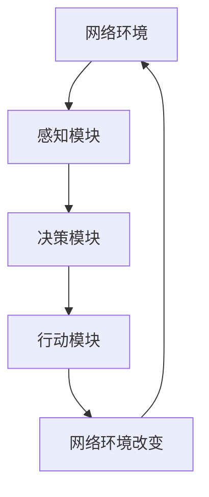

# AI Agent在智能网络安全防御中的角色

> 关键词：AI Agent、智能网络安全防御、自动化、威胁检测、响应策略、机器学习、深度强化学习

> 摘要：本文聚焦于AI Agent在智能网络安全防御中的角色。随着网络攻击手段日益复杂多样，传统网络安全防御方法面临诸多挑战，AI Agent凭借其自动化、智能决策等特性逐渐成为网络安全领域的关键技术。文章深入探讨了AI Agent的核心概念、工作原理和架构，详细阐述了其在威胁检测、响应等方面的算法原理和操作步骤，并结合数学模型进行理论分析。通过项目实战展示了AI Agent在实际网络安全防御中的应用，分析了其具体应用场景。同时，推荐了相关的学习资源、开发工具和论文著作。最后，对AI Agent在网络安全防御领域的未来发展趋势与挑战进行了总结和展望，旨在为网络安全领域的研究和实践提供全面的参考。

## 1. 背景介绍 
### 1.1 目的和范围
本文章的目的在于全面深入地探讨AI Agent在智能网络安全防御中所扮演的角色。随着信息技术的飞速发展，网络空间的安全问题变得愈发严峻，传统的网络安全防御手段已难以应对日益复杂的网络攻击。AI Agent作为一种新兴的智能技术，为网络安全防御带来了新的思路和方法。文章的范围涵盖了AI Agent的基本概念、核心算法、数学模型，以及其在实际网络安全防御中的应用案例和未来发展趋势等方面，旨在为网络安全从业者、研究人员以及对该领域感兴趣的读者提供一个系统的、全面的知识体系。

### 1.2 预期读者
本文预期读者主要包括网络安全领域的专业人士，如网络安全工程师、安全分析师、安全架构师等，他们可以从文章中获取AI Agent在网络安全防御中的最新技术和实践经验，为实际工作提供参考。同时，也适合计算机科学、信息安全等相关专业的学生和研究人员，帮助他们深入了解AI Agent在网络安全领域的应用原理和研究方向。此外，对网络安全和人工智能技术感兴趣的普通读者也可以通过本文初步了解AI Agent在网络安全防御中的重要作用。

### 1.3 文档结构概述
本文共分为十个部分。第一部分为背景介绍，阐述了文章的目的、范围、预期读者和文档结构概述，并对相关术语进行了定义和解释。第二部分介绍了AI Agent的核心概念与联系，包括其原理和架构，并通过文本示意图和Mermaid流程图进行直观展示。第三部分详细讲解了AI Agent在网络安全防御中的核心算法原理和具体操作步骤，同时给出Python源代码进行阐述。第四部分介绍了相关的数学模型和公式，并进行详细讲解和举例说明。第五部分通过项目实战，展示了AI Agent在网络安全防御中的代码实际案例，并对代码进行详细解释和分析。第六部分探讨了AI Agent在实际网络安全防御中的应用场景。第七部分推荐了学习资源、开发工具框架和相关论文著作。第八部分总结了AI Agent在网络安全防御领域的未来发展趋势与挑战。第九部分为附录，解答了常见问题。第十部分提供了扩展阅读和参考资料。

### 1.4 术语表
#### 1.4.1 核心术语定义
- **AI Agent（人工智能智能体）**：是一种能够感知环境、自主决策并采取行动以实现特定目标的智能实体。在网络安全防御中，AI Agent可以感知网络环境中的安全威胁，根据预设的规则或学习到的知识进行决策，并采取相应的防御措施。
- **智能网络安全防御**：利用人工智能、机器学习等先进技术，实现对网络安全威胁的自动化检测、分析和响应的一种网络安全防御模式。
- **威胁检测**：通过对网络流量、系统日志等数据的分析，发现潜在的网络安全威胁的过程。
- **响应策略**：在检测到网络安全威胁后，采取的一系列应对措施，如阻断攻击源、修复漏洞等。

#### 1.4.2 相关概念解释
- **机器学习**：是一门多领域交叉学科，涉及概率论、统计学、逼近论、凸分析、算法复杂度理论等多门学科。它专门研究计算机怎样模拟或实现人类的学习行为，以获取新的知识或技能，重新组织已有的知识结构使之不断改善自身的性能。在网络安全防御中，机器学习算法可以用于分析大量的网络数据，识别异常模式，从而检测网络安全威胁。
- **深度强化学习**：是强化学习与深度学习的结合，它通过智能体与环境进行交互，不断尝试不同的行动，并根据环境反馈的奖励信号来学习最优的行动策略。在网络安全防御中，深度强化学习可以用于优化AI Agent的响应策略，使其能够在复杂的网络环境中做出更有效的决策。

#### 1.4.3 缩略词列表
- **AI**：Artificial Intelligence（人工智能）
- **ML**：Machine Learning（机器学习）
- **RL**：Reinforcement Learning（强化学习）
- **DRL**：Deep Reinforcement Learning（深度强化学习）
- **IDS**：Intrusion Detection System（入侵检测系统）
- **IPS**：Intrusion Prevention System（入侵预防系统）

## 2. 核心概念与联系 
### 2.1 AI Agent的原理
AI Agent的核心原理基于感知 - 决策 - 行动的循环过程。首先，AI Agent通过各种传感器或数据接口感知网络环境中的信息，这些信息包括网络流量、系统日志、用户行为等。然后，AI Agent对感知到的信息进行分析和处理，根据预设的规则、学习到的知识或算法模型进行决策，判断是否存在安全威胁以及应该采取何种应对措施。最后，AI Agent根据决策结果采取相应的行动，如阻断攻击源、发出警报、修复漏洞等。

### 2.2 AI Agent的架构
AI Agent的架构通常包括感知模块、决策模块和行动模块。感知模块负责收集网络环境中的数据，将其转换为AI Agent能够处理的格式。决策模块是AI Agent的核心，它根据感知模块提供的数据进行分析和推理，制定响应策略。行动模块根据决策模块的指令，执行具体的防御行动。此外，AI Agent还可以包括学习模块，用于不断学习和更新自身的知识和技能，以适应不断变化的网络环境。

### 2.3 文本示意图
```plaintext
            +----------------+
            |   网络环境     |
            +----------------+
                    |
                    v
            +----------------+
            |   感知模块     |
            +----------------+
                    |
                    v
            +----------------+
            |   决策模块     |
            +----------------+
                    |
                    v
            +----------------+
            |   行动模块     |
            +----------------+
                    |
                    v
            +----------------+
            |  网络环境改变  |
            +----------------+
```

### 2.4 Mermaid流程图


## 3. 核心算法原理 & 具体操作步骤 
### 3.1 威胁检测算法原理
在网络安全防御中，威胁检测是AI Agent的重要任务之一。一种常用的威胁检测算法是基于机器学习的异常检测算法。其基本原理是通过对正常网络行为数据的学习，建立一个正常行为模型，然后将实时监测到的网络数据与该模型进行比较，如果偏差超过一定的阈值，则认为存在异常，可能是安全威胁。

以下是一个简单的基于Python的异常检测示例，使用Isolation Forest算法：

```python
import numpy as np
from sklearn.ensemble import IsolationForest

# 生成一些正常的网络流量数据作为训练集
np.random.seed(42)
normal_data = np.random.randn(100, 5)

# 训练Isolation Forest模型
clf = IsolationForest(contamination=0.1)
clf.fit(normal_data)

# 生成一些新的网络流量数据作为测试集
new_data = np.random.randn(10, 5)

# 进行异常检测
predictions = clf.predict(new_data)

# 输出检测结果
for i in range(len(new_data)):
    if predictions[i] == -1:
        print(f"数据 {new_data[i]} 可能是异常数据")
    else:
        print(f"数据 {new_data[i]} 是正常数据")
```

### 3.2 具体操作步骤
1. **数据收集**：从网络设备、系统日志等数据源收集网络流量、用户行为等数据。
2. **数据预处理**：对收集到的数据进行清洗、归一化、特征提取等处理，以提高数据质量和算法性能。
3. **模型训练**：使用训练集数据对机器学习模型进行训练，调整模型参数，使其能够准确地识别正常和异常行为。
4. **实时监测**：将实时监测到的网络数据输入到训练好的模型中，进行异常检测。
5. **结果分析**：根据模型的输出结果，判断是否存在安全威胁，并采取相应的响应措施。

### 3.3 响应策略生成算法原理
响应策略生成是AI Agent在检测到安全威胁后需要完成的任务。深度强化学习可以用于优化响应策略。其基本原理是将网络安全防御问题建模为一个马尔可夫决策过程（MDP），AI Agent作为智能体在环境中进行交互，通过不断尝试不同的行动，并根据环境反馈的奖励信号来学习最优的行动策略。

以下是一个简单的基于Python的深度强化学习示例，使用OpenAI Gym库：

```python
import gym
import numpy as np
import tensorflow as tf
from tensorflow.keras import layers

# 定义一个简单的神经网络模型
class Policy(tf.keras.Model):
    def __init__(self, num_actions):
        super(Policy, self).__init__()
        self.dense1 = layers.Dense(128, activation='relu')
        self.dense2 = layers.Dense(num_actions, activation='softmax')

    def call(self, inputs):
        x = self.dense1(inputs)
        return self.dense2(x)

# 初始化环境
env = gym.make('CartPole-v1')
num_actions = env.action_space.n

# 初始化策略网络
policy = Policy(num_actions)

# 定义优化器
optimizer = tf.keras.optimizers.Adam(learning_rate=0.01)

# 训练过程
num_episodes = 1000
for episode in range(num_episodes):
    state = env.reset()
    state = np.expand_dims(state, axis=0)
    episode_rewards = []
    with tf.GradientTape() as tape:
        for step in range(200):
            action_probs = policy(state)
            action = np.random.choice(num_actions, p=action_probs.numpy()[0])
            next_state, reward, done, _ = env.step(action)
            next_state = np.expand_dims(next_state, axis=0)
            episode_rewards.append(reward)
            if done:
                break
            state = next_state

        # 计算总奖励
        total_reward = sum(episode_rewards)

        # 计算损失
        action_masks = tf.one_hot(action, num_actions)
        log_probs = tf.nn.log_softmax(action_probs)
        loss = -tf.reduce_sum(tf.multiply(log_probs, action_masks)) * total_reward

    # 计算梯度并更新参数
    gradients = tape.gradient(loss, policy.trainable_variables)
    optimizer.apply_gradients(zip(gradients, policy.trainable_variables))

    if episode % 100 == 0:
        print(f"Episode {episode}: Total Reward = {total_reward}")

env.close()
```

### 3.4 具体操作步骤
1. **问题建模**：将网络安全防御问题建模为一个马尔可夫决策过程，定义状态空间、动作空间和奖励函数。
2. **策略网络初始化**：初始化一个神经网络作为策略网络，用于生成行动策略。
3. **智能体与环境交互**：智能体在网络环境中进行交互，不断尝试不同的行动，并记录状态、动作和奖励。
4. **策略更新**：根据记录的状态、动作和奖励，计算损失函数，使用梯度下降算法更新策略网络的参数。
5. **重复训练**：重复步骤3和4，直到策略网络收敛，得到最优的行动策略。

## 4. 数学模型和公式 & 详细讲解 & 举例说明 
### 4.1 异常检测的数学模型
在基于机器学习的异常检测中，常用的数学模型是概率密度估计模型。假设网络流量数据 $X = \{x_1, x_2, \cdots, x_n\}$ 是一个随机变量，其概率密度函数为 $p(x)$。我们的目标是通过对训练数据的学习，估计出 $p(x)$ 的参数。

对于高斯混合模型（GMM），其概率密度函数可以表示为：

$$p(x) = \sum_{k=1}^{K} \pi_k \mathcal{N}(x | \mu_k, \Sigma_k)$$

其中，$K$ 是混合成分的数量，$\pi_k$ 是第 $k$ 个混合成分的权重，满足 $\sum_{k=1}^{K} \pi_k = 1$，$\mathcal{N}(x | \mu_k, \Sigma_k)$ 是第 $k$ 个高斯分布的概率密度函数，$\mu_k$ 是均值向量，$\Sigma_k$ 是协方差矩阵。

### 4.2 详细讲解
高斯混合模型通过多个高斯分布的加权和来近似任意复杂的概率分布。在异常检测中，我们可以计算每个数据点 $x$ 的概率密度 $p(x)$，如果 $p(x)$ 低于某个阈值，则认为 $x$ 是异常数据。

### 4.3 举例说明
假设我们有一个二维的网络流量数据集，我们可以使用Python的 `sklearn` 库来拟合高斯混合模型，并进行异常检测：

```python
import numpy as np
from sklearn.mixture import GaussianMixture

# 生成一些正常的二维网络流量数据
np.random.seed(42)
normal_data = np.vstack([np.random.randn(50, 2) + [0, 0], np.random.randn(50, 2) + [5, 5]])

# 拟合高斯混合模型
gmm = GaussianMixture(n_components=2)
gmm.fit(normal_data)

# 生成一些新的数据点
new_data = np.array([[0.5, 0.5], [6, 6], [10, 10]])

# 计算每个数据点的概率密度
densities = gmm.score_samples(new_data)

# 设置阈值
threshold = -10

# 进行异常检测
for i in range(len(new_data)):
    if densities[i] < threshold:
        print(f"数据 {new_data[i]} 可能是异常数据")
    else:
        print(f"数据 {new_data[i]} 是正常数据")
```

### 4.4 深度强化学习的数学模型
在深度强化学习中，马尔可夫决策过程（MDP）是一个重要的数学模型。MDP可以用一个五元组 $(S, A, P, R, \gamma)$ 来表示，其中：
- $S$ 是状态空间，表示智能体在环境中可能处于的所有状态。
- $A$ 是动作空间，表示智能体可以采取的所有动作。
- $P$ 是状态转移概率函数，表示在状态 $s$ 采取动作 $a$ 后转移到状态 $s'$ 的概率，即 $P(s' | s, a)$。
- $R$ 是奖励函数，表示在状态 $s$ 采取动作 $a$ 后转移到状态 $s'$ 所获得的奖励，即 $R(s, a, s')$。
- $\gamma$ 是折扣因子，用于平衡短期奖励和长期奖励，取值范围为 $[0, 1]$。

智能体的目标是学习一个最优策略 $\pi^*$，使得在每个状态 $s$ 下采取的动作 $a$ 能够最大化长期累积奖励：

$$V^{\pi^*}(s) = \max_{\pi} \mathbb{E} \left[ \sum_{t=0}^{\infty} \gamma^t R(s_t, a_t, s_{t+1}) | s_0 = s, \pi \right]$$

其中，$V^{\pi^*}(s)$ 是最优状态价值函数，表示在最优策略 $\pi^*$ 下从状态 $s$ 开始的长期累积奖励的期望值。

### 4.5 详细讲解
深度强化学习通过神经网络来近似最优策略 $\pi^*$ 或最优状态价值函数 $V^{\pi^*}(s)$。智能体在环境中不断探索和学习，根据环境反馈的奖励信号来调整神经网络的参数，使得策略逐渐优化。

### 4.6 举例说明
在前面的深度强化学习示例中，我们使用一个简单的神经网络来近似策略 $\pi$。智能体在 `CartPole-v1` 环境中进行交互，根据环境反馈的奖励信号来更新神经网络的参数，以提高策略的性能。

## 5. 项目实战：代码实际案例和详细解释说明 
### 5.1  开发环境搭建
#### 5.1.1 安装Python
首先，确保你已经安装了Python 3.6或更高版本。可以从Python官方网站（https://www.python.org/downloads/） 下载并安装Python。

#### 5.1.2 安装必要的库
在项目中，我们需要使用一些Python库，如 `numpy`、`sklearn`、`tensorflow`、`gym` 等。可以使用以下命令来安装这些库：

```bash
pip install numpy sklearn tensorflow gym
```

### 5.2  源代码详细实现和代码解读
#### 5.2.1 基于机器学习的异常检测代码实现
```python
import numpy as np
from sklearn.ensemble import IsolationForest
from sklearn.model_selection import train_test_split
import pandas as pd

# 加载数据集
data = pd.read_csv('network_traffic.csv')
X = data.drop('label', axis=1).values
y = data['label'].values

# 划分训练集和测试集
X_train, X_test, y_train, y_test = train_test_split(X, y, test_size=0.2, random_state=42)

# 训练Isolation Forest模型
clf = IsolationForest(contamination=0.1)
clf.fit(X_train)

# 进行异常检测
predictions = clf.predict(X_test)

# 评估模型性能
from sklearn.metrics import accuracy_score, confusion_matrix
accuracy = accuracy_score(y_test, predictions)
conf_matrix = confusion_matrix(y_test, predictions)

print(f"Accuracy: {accuracy}")
print(f"Confusion Matrix: \n{conf_matrix}")
```

#### 5.2.2 代码解读
1. **数据加载**：使用 `pandas` 库加载网络流量数据集，将特征数据和标签数据分别存储在 `X` 和 `y` 中。
2. **数据划分**：使用 `train_test_split` 函数将数据集划分为训练集和测试集，其中测试集占比为20%。
3. **模型训练**：使用 `IsolationForest` 模型对训练集进行训练，设置异常数据的比例为0.1。
4. **异常检测**：使用训练好的模型对测试集进行异常检测，得到预测结果。
5. **性能评估**：使用 `accuracy_score` 和 `confusion_matrix` 函数评估模型的性能，输出准确率和混淆矩阵。

#### 5.2.3 基于深度强化学习的响应策略生成代码实现
```python
import gym
import numpy as np
import tensorflow as tf
from tensorflow.keras import layers

# 定义一个简单的神经网络模型
class Policy(tf.keras.Model):
    def __init__(self, num_actions):
        super(Policy, self).__init__()
        self.dense1 = layers.Dense(128, activation='relu')
        self.dense2 = layers.Dense(num_actions, activation='softmax')

    def call(self, inputs):
        x = self.dense1(inputs)
        return self.dense2(x)

# 初始化环境
env = gym.make('CartPole-v1')
num_actions = env.action_space.n

# 初始化策略网络
policy = Policy(num_actions)

# 定义优化器
optimizer = tf.keras.optimizers.Adam(learning_rate=0.01)

# 训练过程
num_episodes = 1000
for episode in range(num_episodes):
    state = env.reset()
    state = np.expand_dims(state, axis=0)
    episode_rewards = []
    with tf.GradientTape() as tape:
        for step in range(200):
            action_probs = policy(state)
            action = np.random.choice(num_actions, p=action_probs.numpy()[0])
            next_state, reward, done, _ = env.step(action)
            next_state = np.expand_dims(next_state, axis=0)
            episode_rewards.append(reward)
            if done:
                break
            state = next_state

        # 计算总奖励
        total_reward = sum(episode_rewards)

        # 计算损失
        action_masks = tf.one_hot(action, num_actions)
        log_probs = tf.nn.log_softmax(action_probs)
        loss = -tf.reduce_sum(tf.multiply(log_probs, action_masks)) * total_reward

    # 计算梯度并更新参数
    gradients = tape.gradient(loss, policy.trainable_variables)
    optimizer.apply_gradients(zip(gradients, policy.trainable_variables))

    if episode % 100 == 0:
        print(f"Episode {episode}: Total Reward = {total_reward}")

env.close()
```

#### 5.2.4 代码解读
1. **环境初始化**：使用 `gym.make` 函数初始化 `CartPole-v1` 环境，获取动作空间的大小。
2. **策略网络初始化**：定义一个简单的神经网络模型 `Policy`，并初始化策略网络。
3. **优化器定义**：使用 `Adam` 优化器，设置学习率为0.01。
4. **训练过程**：在每个训练周期中，智能体在环境中进行交互，根据策略网络生成的动作概率选择动作，并记录状态、动作和奖励。根据总奖励计算损失函数，使用梯度下降算法更新策略网络的参数。
5. **输出结果**：每100个训练周期输出一次总奖励，观察训练效果。

### 5.3  代码解读与分析
#### 5.3.1 异常检测代码分析
- **优点**：Isolation Forest算法是一种无监督学习算法，不需要标注的异常数据，适用于未知异常检测场景。该算法的计算效率较高，能够处理大规模数据集。
- **缺点**：异常数据比例的设置需要根据实际情况进行调整，否则可能会影响检测效果。该算法对数据的分布比较敏感，如果数据分布不均匀，可能会导致检测结果不准确。

#### 5.3.2 深度强化学习代码分析
- **优点**：深度强化学习可以自动学习最优的响应策略，适应复杂多变的网络环境。通过与环境的交互，智能体可以不断优化策略，提高防御效果。
- **缺点**：训练过程需要大量的计算资源和时间，收敛速度较慢。深度强化学习模型的可解释性较差，难以理解模型的决策过程。

## 6. 实际应用场景 
### 6.1 入侵检测与预防
AI Agent可以实时监测网络流量，通过分析网络数据包的特征和行为模式，及时发现潜在的入侵行为。一旦检测到入侵，AI Agent可以自动采取响应措施，如阻断攻击源、修改防火墙规则等，实现入侵预防。

### 6.2 恶意软件检测
AI Agent可以对文件、进程、网络连接等进行分析，识别恶意软件的特征和行为模式。通过机器学习和深度学习算法，AI Agent可以不断学习和更新恶意软件的特征库，提高恶意软件检测的准确率和效率。

### 6.3 漏洞管理
AI Agent可以自动扫描网络中的系统和设备，发现潜在的安全漏洞。根据漏洞的严重程度和影响范围，AI Agent可以制定相应的修复策略，并自动安排修复任务，提高漏洞修复的及时性和有效性。

### 6.4 安全态势感知
AI Agent可以收集和分析网络中的各种安全信息，如入侵事件、恶意软件感染、漏洞信息等，生成安全态势感知报告。通过可视化界面，安全管理员可以直观地了解网络的安全状况，及时采取措施应对安全威胁。

### 6.5 访问控制
AI Agent可以根据用户的身份、行为和环境信息，动态地调整访问控制策略。例如，对于高风险的用户或环境，AI Agent可以限制其访问权限，提高网络的安全性。

## 7. 工具和资源推荐
### 7.1 学习资源推荐
#### 7.1.1 书籍推荐
- 《人工智能：一种现代的方法》（Artificial Intelligence: A Modern Approach）：这是一本经典的人工智能教材，涵盖了人工智能的各个领域，包括搜索算法、知识表示、机器学习、自然语言处理等。
- 《机器学习》（Machine Learning）：由周志华教授编写，是一本全面介绍机器学习算法和理论的教材，适合初学者和有一定基础的读者。
- 《深度强化学习实战》（Deep Reinforcement Learning Hands-On）：详细介绍了深度强化学习的原理和实践，通过大量的代码示例帮助读者理解和应用深度强化学习算法。

#### 7.1.2 在线课程
- Coursera上的“机器学习”课程：由Andrew Ng教授主讲，是一门非常受欢迎的机器学习入门课程，通过视频讲解、编程作业和测验等方式帮助学生掌握机器学习的基本概念和算法。
- edX上的“深度强化学习”课程：由UC Berkeley的Pieter Abbeel教授主讲，深入介绍了深度强化学习的理论和实践，适合有一定机器学习基础的学生。
- 中国大学MOOC上的“人工智能基础”课程：由国内多所高校的知名教授联合授课，系统介绍了人工智能的基本概念、方法和应用，适合初学者。

#### 7.1.3 技术博客和网站
- Medium上的AI相关博客：Medium上有很多优秀的AI技术博客，如Towards Data Science、AI in Plain English等，这些博客会分享最新的AI研究成果和实践经验。
- arXiv.org：一个开放的学术论文预印本平台，提供了大量的AI相关论文，包括机器学习、深度学习、强化学习等领域的最新研究成果。
- 机器之心：一个专注于人工智能领域的科技媒体，提供了丰富的AI资讯、技术文章和行业报告。

### 7.2 开发工具框架推荐
#### 7.2.1 IDE和编辑器
- PyCharm：一款专门为Python开发设计的集成开发环境（IDE），提供了丰富的代码编辑、调试、测试等功能，适合开发Python项目。
- Jupyter Notebook：一个交互式的开发环境，支持多种编程语言，如Python、R等。Jupyter Notebook可以将代码、文本、图表等整合在一起，方便进行数据分析和模型开发。
- Visual Studio Code：一款轻量级的代码编辑器，支持多种编程语言和插件扩展。Visual Studio Code具有丰富的代码编辑功能和调试功能，适合快速开发和调试代码。

#### 7.2.2 调试和性能分析工具
- TensorBoard：TensorFlow的可视化工具，可以帮助用户可视化训练过程中的各种指标，如损失函数、准确率、梯度等，方便用户调试和优化模型。
- Py-Spy：一个轻量级的Python性能分析工具，可以实时监测Python程序的CPU使用情况和函数调用栈，帮助用户找出性能瓶颈。
- cProfile：Python标准库中的性能分析工具，可以统计Python程序中各个函数的执行时间和调用次数，帮助用户优化代码性能。

#### 7.2.3 相关框架和库
- TensorFlow：一个开源的机器学习框架，由Google开发和维护。TensorFlow提供了丰富的机器学习和深度学习算法，支持GPU加速，适合开发大规模的深度学习模型。
- PyTorch：一个开源的深度学习框架，由Facebook开发和维护。PyTorch具有动态计算图的特点，代码简洁易懂，适合快速开发和实验深度学习模型。
- Scikit-learn：一个简单易用的机器学习库，提供了各种机器学习算法和工具，如分类、回归、聚类、降维等，适合初学者和快速原型开发。

### 7.3 相关论文著作推荐
#### 7.3.1 经典论文
- “Learning Representations by Back-propagating Errors”：由David E. Rumelhart、Geoffrey E. Hinton和Ronald J. Williams发表于1986年，介绍了反向传播算法，是深度学习领域的经典论文之一。
- “Playing Atari with Deep Reinforcement Learning”：由Volodymyr Mnih等人发表于2013年，提出了深度Q网络（DQN）算法，开启了深度强化学习的新纪元。
- “A Survey on Intrusion Detection Systems: Techniques, datasets and challenges”：对入侵检测系统的技术、数据集和挑战进行了全面的综述，是网络安全领域的经典论文之一。

#### 7.3.2 最新研究成果
- 在arXiv.org和各大顶级学术会议（如NeurIPS、ICML、CVPR等）上可以找到AI Agent在网络安全防御领域的最新研究成果。这些研究成果涵盖了新的算法、模型和应用场景，代表了该领域的前沿技术。

#### 7.3.3 应用案例分析
- 一些安全厂商（如Palo Alto Networks、Cisco等）会发布AI Agent在网络安全防御中的应用案例分析报告。这些报告可以帮助读者了解AI Agent在实际应用中的效果和挑战，为实际项目提供参考。

## 8. 总结：未来发展趋势与挑战
### 8.1 未来发展趋势
#### 8.1.1 多模态融合
未来的AI Agent将融合多种模态的信息，如网络流量、系统日志、用户行为、图像、语音等，以更全面、准确地感知网络环境，提高威胁检测和响应的能力。

#### 8.1.2 自适应学习
AI Agent将具备更强的自适应学习能力，能够在不断变化的网络环境中快速学习和适应新的威胁模式，自动调整防御策略，提高防御的灵活性和有效性。

#### 8.1.3 协同防御
多个AI Agent将通过协作和通信，实现协同防御。例如，不同网络节点上的AI Agent可以共享威胁信息，共同制定和执行防御策略，提高整个网络的安全水平。

#### 8.1.4 与区块链结合
AI Agent与区块链技术的结合将为网络安全防御带来新的思路和方法。区块链的去中心化、不可篡改等特性可以提高AI Agent的可信度和安全性，同时也可以解决数据共享和隐私保护等问题。

### 8.2 挑战
#### 8.2.1 数据隐私和安全
AI Agent的训练和运行需要大量的数据，这些数据可能包含用户的敏感信息。如何保护数据的隐私和安全，防止数据泄露和滥用，是一个亟待解决的问题。

#### 8.2.2 算法可解释性
深度强化学习等AI算法的可解释性较差，难以理解模型的决策过程。在网络安全防御中，安全管理员需要了解AI Agent的决策依据，以便做出合理的判断和决策。因此，提高算法的可解释性是一个重要的挑战。

#### 8.2.3 对抗攻击
随着AI技术的发展，攻击者也开始利用AI技术进行对抗攻击，如生成对抗网络（GAN）可以生成恶意的网络流量或数据，欺骗AI Agent的检测系统。如何提高AI Agent的抗攻击能力，是一个需要研究的问题。

#### 8.2.4 计算资源和效率
深度强化学习等AI算法的训练和运行需要大量的计算资源和时间，如何在有限的计算资源下提高AI Agent的效率，是一个实际应用中需要解决的问题。

## 9. 附录：常见问题与解答
### 9.1 AI Agent在网络安全防御中的优势是什么？
AI Agent在网络安全防御中的优势主要包括自动化、智能决策、自适应学习等。AI Agent可以实时监测网络环境，自动发现和响应安全威胁，减少人工干预，提高防御效率。同时，AI Agent可以通过机器学习和深度学习算法不断学习和更新知识，适应不断变化的网络环境，提高防御的准确性和有效性。

### 9.2 AI Agent的训练数据从哪里获取？
AI Agent的训练数据可以从多个渠道获取，如网络设备的日志文件、网络流量数据、安全事件记录等。此外，还可以使用公开的数据集，如KDD Cup 99、NSL-KDD等。在实际应用中，需要对数据进行清洗、预处理和标注，以提高数据的质量和可用性。

### 9.3 如何评估AI Agent在网络安全防御中的性能？
可以使用多种指标来评估AI Agent在网络安全防御中的性能，如准确率、召回率、F1值、误报率、漏报率等。此外，还可以通过模拟攻击实验、实际应用测试等方式来评估AI Agent的防御效果和响应速度。

### 9.4 AI Agent与传统网络安全防御技术有什么区别？
传统网络安全防御技术主要基于规则和签名，需要人工定义和更新规则和签名，难以应对未知的安全威胁。而AI Agent可以通过机器学习和深度学习算法自动学习和识别安全威胁，具有更强的自适应能力和泛化能力。此外，AI Agent可以实现自动化的威胁检测和响应，提高防御效率。

## 10. 扩展阅读 & 参考资料
### 10.1 扩展阅读
- 《网络安全技术与实践》：介绍了网络安全的基本概念、技术和实践方法，包括防火墙、入侵检测、加密技术等。
- 《人工智能安全》：探讨了人工智能技术在安全领域的应用和挑战，以及如何保障人工智能系统的安全。
- 《深度强化学习：原理与Python实现》：详细介绍了深度强化学习的原理和Python实现方法，通过大量的代码示例帮助读者理解和应用深度强化学习算法。

### 10.2 参考资料
- 各安全厂商的官方网站，如Palo Alto Networks、Cisco、McAfee等，提供了丰富的网络安全技术文档和解决方案。
- 各大学术数据库，如IEEE Xplore、ACM Digital Library等，提供了大量的AI和网络安全领域的学术论文。
- 开源项目的官方文档和代码库，如TensorFlow、PyTorch、Scikit-learn等，提供了详细的使用说明和示例代码。