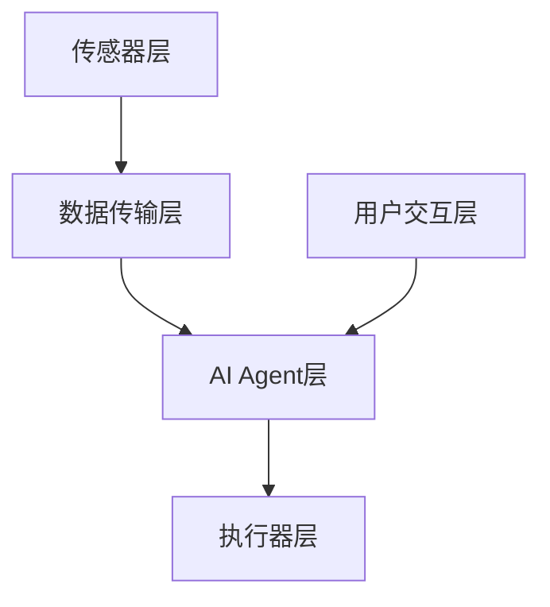

# AI Agent在智能花盆中的自动浇水系统

> 关键词：AI Agent、智能花盆、自动浇水系统、传感器、机器学习

> 摘要：本文深入探讨了AI Agent在智能花盆自动浇水系统中的应用。随着智能家居和人工智能技术的不断发展，将AI Agent引入智能花盆自动浇水系统具有重要的现实意义。文章首先介绍了相关背景知识，包括目的范围、预期读者等内容。接着详细阐述了核心概念与联系，通过文本示意图和Mermaid流程图直观呈现其架构。然后深入讲解了核心算法原理和具体操作步骤，并用Python源代码进行说明。同时给出了数学模型和公式，并举例说明。在项目实战部分，从开发环境搭建到源代码详细实现和解读进行了全面分析。还探讨了实际应用场景，推荐了相关工具和资源。最后对未来发展趋势与挑战进行总结，并提供了常见问题与解答以及扩展阅读和参考资料，旨在为相关领域的研究和实践提供全面且深入的参考。

## 1. 背景介绍 
### 1.1 目的和范围
随着人们生活水平的提高，越来越多的人开始关注室内外植物的种植和养护。然而，由于忙碌的生活节奏，人们可能无法及时为植物浇水，导致植物生长受到影响。智能花盆的自动浇水系统应运而生，它可以根据植物的需求自动浇水，为植物提供适宜的生长环境。本项目的目的是设计并实现一个基于AI Agent的智能花盆自动浇水系统，通过传感器实时监测土壤湿度等环境参数，利用AI Agent进行数据分析和决策，实现自动浇水的功能。

本项目的范围包括传感器的选择与安装、AI Agent的算法设计与实现、浇水装置的控制以及系统的整体集成和测试。

### 1.2 预期读者
本文的预期读者包括对智能家居、人工智能、嵌入式系统等领域感兴趣的技术爱好者，相关专业的学生，以及从事智能硬件开发、农业自动化等行业的工程师和研究人员。

### 1.3 文档结构概述
本文将按照以下结构进行组织：首先介绍相关的背景知识，包括目的、范围、预期读者和文档结构概述等内容。然后详细阐述核心概念与联系，包括AI Agent、智能花盆、自动浇水系统等概念的原理和架构。接着深入讲解核心算法原理和具体操作步骤，并用Python源代码进行说明。同时给出数学模型和公式，并举例说明。在项目实战部分，将介绍开发环境的搭建、源代码的详细实现和解读。之后探讨实际应用场景，推荐相关的工具和资源。最后对未来发展趋势与挑战进行总结，并提供常见问题与解答以及扩展阅读和参考资料。

### 1.4 术语表
#### 1.4.1 核心术语定义
- **AI Agent**：人工智能代理，是一种能够感知环境、进行决策并采取行动的智能实体。在本系统中，AI Agent根据传感器采集的数据进行分析和决策，控制浇水装置的工作。
- **智能花盆**：具备智能化功能的花盆，通常配备传感器和执行器，能够实时监测植物生长环境，并根据需求自动调节环境参数。
- **自动浇水系统**：一种能够根据植物的需求自动进行浇水的系统，通过传感器采集土壤湿度等信息，利用控制器控制浇水装置的开关。

#### 1.4.2 相关概念解释
- **传感器**：用于采集物理量的设备，如土壤湿度传感器、温度传感器等。在本系统中，传感器将土壤湿度等环境参数转换为电信号，供AI Agent进行分析。
- **执行器**：根据控制器的指令执行相应动作的设备，如水泵、电磁阀等。在本系统中，执行器根据AI Agent的决策控制浇水装置的开关。
- **机器学习**：一门多领域交叉学科，涉及概率论、统计学、逼近论、凸分析、算法复杂度理论等多门学科。它专门研究计算机怎样模拟或实现人类的学习行为，以获取新的知识或技能，重新组织已有的知识结构使之不断改善自身的性能。在本系统中，机器学习算法可用于对传感器数据进行分析和预测，提高系统的智能水平。

#### 1.4.3 缩略词列表
- **AI**：Artificial Intelligence，人工智能
- **IoT**：Internet of Things，物联网
- **PID**：Proportional-Integral-Derivative，比例-积分-微分

## 2. 核心概念与联系 
### 核心概念原理
#### AI Agent
AI Agent是智能花盆自动浇水系统的核心，它通过感知环境信息，利用内置的算法进行分析和决策，然后控制执行器采取相应的行动。AI Agent的工作原理可以分为以下几个步骤：
1. **感知**：通过传感器采集土壤湿度、温度、光照等环境参数。
2. **分析**：对采集到的数据进行处理和分析，判断植物的生长状态和需求。
3. **决策**：根据分析结果，制定相应的浇水策略。
4. **行动**：控制执行器（如水泵、电磁阀等）实现浇水操作。

#### 智能花盆
智能花盆是一个集成了传感器、执行器和控制器的智能化设备。它通过传感器实时监测植物生长环境的各项参数，如土壤湿度、温度、光照等，并将这些数据传输给AI Agent。AI Agent根据这些数据进行分析和决策，然后控制执行器对植物生长环境进行调节，如浇水、施肥、通风等。

#### 自动浇水系统
自动浇水系统是智能花盆的重要组成部分，它根据AI Agent的决策控制浇水装置的开关，实现自动浇水的功能。自动浇水系统通常由水泵、电磁阀、水管等组成，通过控制水泵和电磁阀的开关来控制水流的通断。

### 架构的文本示意图
智能花盆自动浇水系统的架构主要包括以下几个部分：
1. **传感器层**：负责采集土壤湿度、温度、光照等环境参数，将物理量转换为电信号。
2. **数据传输层**：将传感器采集到的数据传输到AI Agent所在的控制器。
3. **AI Agent层**：对采集到的数据进行分析和决策，制定浇水策略。
4. **执行器层**：根据AI Agent的决策控制浇水装置的开关，实现自动浇水的功能。
5. **用户交互层**：提供用户与系统进行交互的界面，用户可以通过手机APP、网页等方式查看植物生长状态和控制浇水系统。

### Mermaid流程图


## 3. 核心算法原理 & 具体操作步骤 
### 核心算法原理
在智能花盆自动浇水系统中，我们可以使用PID控制算法来实现对土壤湿度的精确控制。PID控制算法是一种经典的控制算法，它根据系统的误差（设定值与实际值之间的差值）来计算控制量，通过不断调整控制量来使系统的输出接近设定值。

PID控制算法的数学表达式为：
$$u(t) = K_p e(t) + K_i \int_{0}^{t} e(\tau) d\tau + K_d \frac{de(t)}{dt}$$
其中，$u(t)$ 是控制量，$e(t)$ 是误差，$K_p$ 是比例系数，$K_i$ 是积分系数，$K_d$ 是微分系数。

### 具体操作步骤
1. **设定目标湿度值**：根据植物的种类和生长阶段，设定一个合适的土壤湿度目标值。
2. **采集土壤湿度数据**：通过土壤湿度传感器实时采集土壤湿度数据。
3. **计算误差**：将采集到的土壤湿度数据与目标湿度值进行比较，计算误差。
4. **计算控制量**：根据PID控制算法的数学表达式，计算控制量。
5. **控制浇水装置**：根据计算得到的控制量，控制浇水装置的开关，调节土壤湿度。
6. **重复步骤2-5**：不断重复上述步骤，直到土壤湿度达到目标值。

### Python源代码实现
```python
class PIDController:
    def __init__(self, Kp, Ki, Kd):
        self.Kp = Kp
        self.Ki = Ki
        self.Kd = Kd
        self.prev_error = 0
        self.integral = 0

    def update(self, setpoint, current_value):
        error = setpoint - current_value
        self.integral += error
        derivative = error - self.prev_error
        output = self.Kp * error + self.Ki * self.integral + self.Kd * derivative
        self.prev_error = error
        return output

# 示例使用
if __name__ == "__main__":
    # 初始化PID控制器
    Kp = 1.0
    Ki = 0.1
    Kd = 0.01
    pid = PIDController(Kp, Ki, Kd)

    # 设定目标湿度值
    setpoint = 50

    # 模拟采集土壤湿度数据
    current_value = 30

    # 计算控制量
    control_output = pid.update(setpoint, current_value)

    print(f"控制量: {control_output}")
```

## 4. 数学模型和公式 & 详细讲解 & 举例说明 
### 数学模型和公式
在智能花盆自动浇水系统中，我们使用PID控制算法来实现对土壤湿度的精确控制。PID控制算法的数学表达式为：
$$u(t) = K_p e(t) + K_i \int_{0}^{t} e(\tau) d\tau + K_d \frac{de(t)}{dt}$$
其中，$u(t)$ 是控制量，$e(t)$ 是误差，$K_p$ 是比例系数，$K_i$ 是积分系数，$K_d$ 是微分系数。

### 详细讲解
- **比例项（$K_p e(t)$）**：比例项与当前误差成正比，它的作用是快速响应误差，使系统的输出尽快接近设定值。比例系数 $K_p$ 越大，系统的响应速度越快，但可能会导致系统超调过大。
- **积分项（$K_i \int_{0}^{t} e(\tau) d\tau$）**：积分项是误差的累积，它的作用是消除系统的稳态误差。积分系数 $K_i$ 越大，系统消除稳态误差的速度越快，但可能会导致系统出现积分饱和现象。
- **微分项（$K_d \frac{de(t)}{dt}$）**：微分项是误差的变化率，它的作用是预测误差的变化趋势，提前调整控制量，减少系统的超调。微分系数 $K_d$ 越大，系统的稳定性越好，但可能会导致系统对噪声过于敏感。

### 举例说明
假设我们要控制一个智能花盆的土壤湿度，目标湿度值为50%，当前土壤湿度值为30%。我们使用PID控制算法来计算控制量，设定比例系数 $K_p = 1.0$，积分系数 $K_i = 0.1$，微分系数 $K_d = 0.01$。

1. **计算误差**：$e(t) = 50 - 30 = 20$
2. **计算积分项**：假设之前的误差累积为0，则 $\int_{0}^{t} e(\tau) d\tau = 20$
3. **计算微分项**：假设上一次的误差为0，则 $\frac{de(t)}{dt} = 20 - 0 = 20$
4. **计算控制量**：$u(t) = 1.0 \times 20 + 0.1 \times 20 + 0.01 \times 20 = 20 + 2 + 0.2 = 22.2$

根据计算得到的控制量，我们可以控制浇水装置的开关，调节土壤湿度，使土壤湿度逐渐接近目标值。

## 5. 项目实战：代码实际案例和详细解释说明 
### 5.1  开发环境搭建
#### 硬件环境
- **智能花盆**：选择一个合适的智能花盆，配备土壤湿度传感器、水泵、电磁阀等设备。
- **开发板**：选择一款性能稳定的开发板，如Arduino、Raspberry Pi等。
- **电源**：为开发板和智能花盆设备提供稳定的电源。

#### 软件环境
- **开发工具**：选择适合开发板的开发工具，如Arduino IDE、Raspberry Pi的Raspbian系统等。
- **编程语言**：选择Python或C/C++等编程语言进行开发。
- **相关库**：安装与传感器、执行器控制相关的库，如Adafruit的传感器库、RPi.GPIO库等。

### 5.2  源代码详细实现和代码解读
```python
import time
import RPi.GPIO as GPIO
from gpiozero import MCP3008

# 定义土壤湿度传感器引脚
soil_moisture_channel = 0
# 定义水泵控制引脚
pump_pin = 17

# 初始化GPIO
GPIO.setmode(GPIO.BCM)
GPIO.setup(pump_pin, GPIO.OUT)

# 初始化PID控制器
Kp = 1.0
Ki = 0.1
Kd = 0.01
prev_error = 0
integral = 0

# 设定目标湿度值
setpoint = 50

# 读取土壤湿度数据
def read_soil_moisture():
    adc = MCP3008(channel=soil_moisture_channel)
    moisture_value = adc.value * 100
    return moisture_value

# PID控制算法
def pid_control(setpoint, current_value):
    global prev_error, integral
    error = setpoint - current_value
    integral += error
    derivative = error - prev_error
    output = Kp * error + Ki * integral + Kd * derivative
    prev_error = error
    return output

# 控制水泵开关
def control_pump(control_output):
    if control_output > 0:
        GPIO.output(pump_pin, GPIO.HIGH)
    else:
        GPIO.output(pump_pin, GPIO.LOW)

try:
    while True:
        # 读取土壤湿度数据
        current_value = read_soil_moisture()
        print(f"当前土壤湿度: {current_value}%")

        # 计算控制量
        control_output = pid_control(setpoint, current_value)
        print(f"控制量: {control_output}")

        # 控制水泵开关
        control_pump(control_output)

        # 延时一段时间
        time.sleep(1)

except KeyboardInterrupt:
    print("程序终止")
    GPIO.cleanup()
```

### 5.3  代码解读与分析
- **读取土壤湿度数据**：通过 `read_soil_moisture` 函数读取土壤湿度传感器的数据，并将其转换为百分比值。
- **PID控制算法**：通过 `pid_control` 函数实现PID控制算法，根据目标湿度值和当前土壤湿度值计算控制量。
- **控制水泵开关**：通过 `control_pump` 函数根据控制量控制水泵的开关，当控制量大于0时，水泵开启，否则水泵关闭。
- **主循环**：在主循环中，不断读取土壤湿度数据，计算控制量，控制水泵开关，并延时一段时间。

## 6. 实际应用场景 
### 家庭种植
在家庭种植中，智能花盆的自动浇水系统可以帮助用户更好地照顾植物。用户可以根据植物的种类和生长阶段设定合适的土壤湿度目标值，系统会自动根据土壤湿度情况进行浇水，避免因忘记浇水或浇水过多导致植物生长不良。

### 办公室绿化
在办公室环境中，智能花盆的自动浇水系统可以为办公室增添绿色，提高员工的工作环境质量。由于办公室人员工作繁忙，可能无法及时照顾植物，自动浇水系统可以确保植物得到适当的水分，保持良好的生长状态。

### 农业种植
在农业种植中，智能花盆的自动浇水系统可以应用于温室种植、垂直农场等场景。通过实时监测土壤湿度等环境参数，系统可以根据植物的需求精确地进行浇水，提高水资源的利用效率，降低生产成本。

## 7. 工具和资源推荐
### 7.1 学习资源推荐
#### 7.1.1 书籍推荐
- 《Python数据分析实战》：介绍了Python在数据分析领域的应用，包括数据处理、数据分析、数据可视化等方面的知识。
- 《机器学习实战》：通过实际案例介绍了机器学习的基本算法和应用，帮助读者快速掌握机器学习的基本原理和实现方法。
- 《嵌入式系统设计与开发》：介绍了嵌入式系统的基本原理、硬件设计、软件开发等方面的知识，适合从事嵌入式系统开发的读者阅读。

#### 7.1.2 在线课程
- Coursera上的《机器学习》课程：由斯坦福大学的Andrew Ng教授授课，是机器学习领域的经典课程，介绍了机器学习的基本算法和应用。
- edX上的《Python for Data Science》课程：介绍了Python在数据科学领域的应用，包括数据处理、数据分析、数据可视化等方面的知识。
- 中国大学MOOC上的《嵌入式系统原理与设计》课程：介绍了嵌入式系统的基本原理、硬件设计、软件开发等方面的知识。

#### 7.1.3 技术博客和网站
- Medium：一个技术博客平台，上面有很多关于人工智能、机器学习、嵌入式系统等领域的技术文章。
- Stack Overflow：一个技术问答社区，上面有很多关于编程、开发等方面的问题和解答。
- 开源中国：一个开源技术社区，上面有很多关于开源项目、技术文章等方面的内容。

### 7.2 开发工具框架推荐
#### 7.2.1 IDE和编辑器
- PyCharm：一款专业的Python集成开发环境，提供了代码编辑、调试、代码分析等功能。
- Visual Studio Code：一款轻量级的代码编辑器，支持多种编程语言，提供了丰富的插件扩展功能。
- Arduino IDE：一款专门用于Arduino开发的集成开发环境，提供了代码编辑、编译、上传等功能。

#### 7.2.2 调试和性能分析工具
- GDB：一款功能强大的调试工具，支持多种编程语言，可以帮助开发者调试程序。
- Valgrind：一款内存调试和性能分析工具，可以帮助开发者检测内存泄漏、内存越界等问题。
- Profiler：一种性能分析工具，可以帮助开发者分析程序的性能瓶颈，优化程序性能。

#### 7.2.3 相关框架和库
- NumPy：一个Python科学计算库，提供了高效的数组操作和数学函数。
- Pandas：一个Python数据处理库，提供了数据结构和数据分析工具。
- TensorFlow：一个开源的机器学习框架，提供了丰富的机器学习算法和工具。

### 7.3 相关论文著作推荐
#### 7.3.1 经典论文
- “A Logical Calculus of the Ideas Immanent in Nervous Activity”：由Warren S. McCulloch和Walter Pitts发表，提出了人工神经元模型，是神经网络领域的经典论文。
- “Learning Representations by Back-propagating Errors”：由David E. Rumelhart、Geoffrey E. Hinton和Ronald J. Williams发表，提出了反向传播算法，是神经网络领域的重要突破。

#### 7.3.2 最新研究成果
- 关注顶级学术会议和期刊，如NeurIPS、ICML、CVPR等，了解人工智能、机器学习等领域的最新研究成果。

#### 7.3.3 应用案例分析
- 参考相关的技术博客、开源项目和商业产品，了解智能花盆自动浇水系统等领域的应用案例和实践经验。

## 8. 总结：未来发展趋势与挑战
### 未来发展趋势
- **智能化程度不断提高**：随着人工智能技术的不断发展，智能花盆自动浇水系统的智能化程度将不断提高。系统将能够根据植物的生长状态、环境条件等因素自动调整浇水策略，实现更加精准的浇水控制。
- **与其他智能家居设备的集成**：智能花盆自动浇水系统将与其他智能家居设备进行集成，实现更加智能化的家居管理。例如，系统可以与智能音箱、智能摄像头等设备进行联动，用户可以通过语音指令或手机APP远程控制浇水系统，同时还可以实时查看植物的生长状态。
- **大数据和云计算的应用**：通过大数据和云计算技术，智能花盆自动浇水系统可以收集和分析大量的植物生长数据，为用户提供更加个性化的浇水建议和植物养护方案。同时，系统还可以实现远程监控和管理，提高系统的可靠性和稳定性。

### 挑战
- **传感器精度和可靠性**：传感器是智能花盆自动浇水系统的重要组成部分，其精度和可靠性直接影响系统的性能。目前，传感器的精度和可靠性还存在一定的问题，需要进一步提高。
- **算法的优化和改进**：PID控制算法等传统控制算法在智能花盆自动浇水系统中已经得到了广泛应用，但这些算法还存在一定的局限性。需要进一步研究和开发更加先进的控制算法，提高系统的控制精度和稳定性。
- **用户体验和安全性**：智能花盆自动浇水系统的用户体验和安全性也是需要关注的问题。系统需要提供简单易用的用户界面，方便用户进行操作和管理。同时，系统还需要保障用户数据的安全和隐私，防止数据泄露和恶意攻击。

## 9. 附录：常见问题与解答
### 问题1：土壤湿度传感器的精度如何保证？
答：为了保证土壤湿度传感器的精度，需要选择质量可靠的传感器产品，并按照正确的安装方法进行安装。同时，还需要定期对传感器进行校准和维护，确保传感器的性能稳定。

### 问题2：PID控制算法的参数如何调整？
答：PID控制算法的参数调整需要根据具体的应用场景和系统要求进行。一般来说，可以采用试错法、Ziegler-Nichols法等方法进行参数调整。在调整参数时，需要注意系统的响应速度、稳定性和超调量等指标，找到一个合适的参数组合。

### 问题3：系统出现故障如何排查？
答：当系统出现故障时，可以按照以下步骤进行排查：首先检查硬件连接是否正常，确保传感器、执行器等设备的连接牢固；然后检查软件代码是否存在错误，确保程序能够正常运行；最后检查系统的配置参数是否正确，确保系统的运行状态符合要求。

## 10. 扩展阅读 & 参考资料
### 扩展阅读
- 《人工智能：一种现代方法》：全面介绍了人工智能的基本概念、算法和应用，是人工智能领域的经典教材。
- 《物联网：技术、应用与标准》：介绍了物联网的基本原理、技术架构、应用场景和标准规范，适合对物联网领域感兴趣的读者阅读。

### 参考资料
- 相关传感器、执行器等设备的产品说明书和技术文档。
- 相关开源项目的代码和文档。
- 相关学术论文和研究报告。