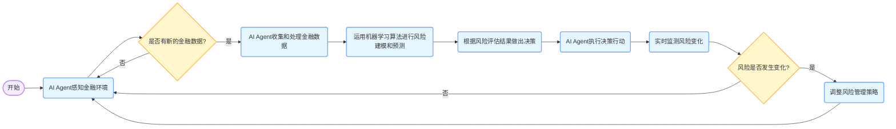

# AI Agent在智能金融风险评估中的应用

> 关键词：AI Agent、智能金融、风险评估、机器学习、数据分析、决策自动化、金融科技

> 摘要：本文聚焦于AI Agent在智能金融风险评估中的应用。首先介绍了相关背景，包括目的、预期读者、文档结构和术语表等内容。接着深入探讨了AI Agent和智能金融风险评估的核心概念及其联系，通过文本示意图和Mermaid流程图进行直观展示。详细阐述了核心算法原理，并用Python源代码进行说明，同时给出了数学模型和公式并举例讲解。在项目实战部分，从开发环境搭建到源代码实现与解读进行了全面分析。随后探讨了AI Agent在智能金融风险评估中的实际应用场景，推荐了相关的工具和资源，包括学习资源、开发工具框架和论文著作等。最后总结了未来发展趋势与挑战，提供了常见问题解答和扩展阅读与参考资料，旨在全面展现AI Agent在智能金融风险评估领域的重要作用和应用前景。

## 1. 背景介绍 
### 1.1 目的和范围
在金融领域，风险评估是保障金融稳定和可持续发展的关键环节。传统的金融风险评估方法往往依赖于人工经验和简单的统计模型，存在效率低、主观性强、难以处理复杂数据等问题。随着金融市场的不断发展和创新，金融产品和业务日益复杂，数据量呈爆炸式增长，传统方法已难以满足现代金融风险评估的需求。

AI Agent（人工智能代理）作为一种具有自主学习、推理和决策能力的智能体，能够在复杂的金融环境中自动收集、分析和处理大量数据，发现潜在的风险因素，并做出准确的风险评估和决策。本文章的目的在于深入探讨AI Agent在智能金融风险评估中的应用，包括其核心概念、算法原理、实际应用场景等，旨在为金融机构和相关从业者提供理论支持和实践指导，推动智能金融风险评估技术的发展和应用。

本文章的范围涵盖了AI Agent的基本原理、智能金融风险评估的主要内容和方法、AI Agent在不同金融场景中的应用案例，以及相关的工具和资源推荐等方面。

### 1.2 预期读者
本文预期读者包括金融机构的风险管理专家、数据分析师、投资经理、金融科技从业者、计算机科学领域的研究人员和开发者，以及对智能金融和AI Agent应用感兴趣的学生和爱好者。通过阅读本文，读者可以了解AI Agent在智能金融风险评估中的应用原理和方法，掌握相关的技术和工具，为实际工作和研究提供参考和借鉴。

### 1.3 文档结构概述
本文共分为十个部分：
1. 背景介绍：介绍文章的目的、范围、预期读者、文档结构和术语表等内容。
2. 核心概念与联系：阐述AI Agent和智能金融风险评估的核心概念，通过文本示意图和Mermaid流程图展示它们之间的联系。
3. 核心算法原理 & 具体操作步骤：详细讲解AI Agent在智能金融风险评估中使用的核心算法原理，并用Python源代码进行说明。
4. 数学模型和公式 & 详细讲解 & 举例说明：给出AI Agent在智能金融风险评估中的数学模型和公式，并进行详细讲解和举例说明。
5. 项目实战：代码实际案例和详细解释说明：从开发环境搭建到源代码实现与解读，全面分析AI Agent在智能金融风险评估中的实际应用案例。
6. 实际应用场景：探讨AI Agent在智能金融风险评估中的各种实际应用场景。
7. 工具和资源推荐：推荐相关的学习资源、开发工具框架和论文著作等。
8. 总结：未来发展趋势与挑战：总结AI Agent在智能金融风险评估中的未来发展趋势和面临的挑战。
9. 附录：常见问题与解答：提供常见问题的解答，帮助读者更好地理解和应用相关技术。
10. 扩展阅读 & 参考资料：提供扩展阅读的建议和相关参考资料，方便读者进一步深入学习和研究。

### 1.4 术语表
#### 1.4.1 核心术语定义
- **AI Agent（人工智能代理）**：是一种能够感知环境、自主学习、推理和决策的智能体，它可以根据预设的目标和规则，在复杂的环境中自动执行任务。
- **智能金融**：是指利用人工智能、大数据、区块链等新兴技术，对金融业务进行智能化改造和创新，提高金融服务的效率和质量，降低金融风险。
- **金融风险评估**：是指对金融机构或金融业务面临的各种风险进行识别、度量、分析和评价的过程，旨在为风险管理决策提供依据。
- **机器学习**：是一门多领域交叉学科，涉及概率论、统计学、逼近论、凸分析、算法复杂度理论等多门学科。它专门研究计算机怎样模拟或实现人类的学习行为，以获取新的知识或技能，重新组织已有的知识结构使之不断改善自身的性能。
- **数据分析**：是指用适当的统计分析方法对收集来的大量数据进行分析，提取有用信息和形成结论而对数据加以详细研究和概括总结的过程。

#### 1.4.2 相关概念解释
- **自主学习**：AI Agent能够通过与环境的交互，自动获取知识和经验，不断优化自身的行为和决策能力。
- **推理**：AI Agent能够根据已有的知识和信息，运用逻辑规则和算法进行推理，得出新的结论和判断。
- **决策**：AI Agent能够根据推理结果和预设的目标，在多个可行的方案中选择最优的行动方案。
- **金融风险**：包括信用风险、市场风险、流动性风险、操作风险等多种类型，是指金融机构或金融业务在经营过程中面临的各种不确定性和损失的可能性。

#### 1.4.3 缩略词列表
- **AI**：Artificial Intelligence（人工智能）
- **ML**：Machine Learning（机器学习）
- **DL**：Deep Learning（深度学习）
- **NLP**：Natural Language Processing（自然语言处理）
- **CV**：Computer Vision（计算机视觉）

## 2. 核心概念与联系 

### 2.1 AI Agent核心概念
AI Agent是人工智能领域中的一个重要概念，它是一个具有自主性、反应性、社会性和适应性的智能实体。自主性意味着AI Agent能够在没有人类直接干预的情况下，独立地执行任务和做出决策；反应性表示AI Agent能够感知环境的变化，并及时做出相应的反应；社会性指AI Agent可以与其他智能体或人类进行交互和协作；适应性则表明AI Agent能够根据环境的变化和自身的经验，不断调整和优化自己的行为。

AI Agent通常由感知模块、决策模块和执行模块组成。感知模块负责收集环境信息，决策模块根据感知到的信息进行推理和决策，执行模块则根据决策结果采取相应的行动。

### 2.2 智能金融风险评估核心概念
智能金融风险评估是指利用人工智能技术，对金融机构或金融业务面临的各种风险进行全面、准确、及时的评估。它结合了金融理论、数据分析、机器学习等多学科知识，通过对大量金融数据的挖掘和分析，发现潜在的风险因素，评估风险的大小和可能性，并提供相应的风险管理建议。

智能金融风险评估的主要内容包括信用风险评估、市场风险评估、流动性风险评估和操作风险评估等。信用风险评估主要评估借款人的还款能力和信用状况；市场风险评估主要分析市场价格波动对金融资产价值的影响；流动性风险评估主要考察金融机构或金融业务的资金流动性状况；操作风险评估主要关注金融机构内部操作流程和人员行为可能带来的风险。

### 2.3 核心概念联系的文本示意图
AI Agent与智能金融风险评估之间存在着紧密的联系。AI Agent可以作为智能金融风险评估的重要工具和手段，通过其自主学习、推理和决策能力，提高风险评估的效率和准确性。具体来说，AI Agent可以自动收集和处理金融数据，运用机器学习算法进行风险建模和预测，根据风险评估结果提供决策建议，并实时监测风险变化，及时调整风险管理策略。

另一方面，智能金融风险评估为AI Agent提供了应用场景和数据支持。金融领域丰富的数据资源为AI Agent的学习和训练提供了充足的素材，而复杂多变的金融风险环境则对AI Agent的能力提出了更高的要求，促使其不断发展和进化。

### 2.4 Mermaid流程图


## 3. 核心算法原理 & 具体操作步骤 

### 3.1 核心算法原理
在智能金融风险评估中，AI Agent常用的核心算法包括机器学习算法和深度学习算法。以下是几种常见算法的原理介绍：

#### 3.1.1 逻辑回归算法
逻辑回归是一种广泛应用于分类问题的机器学习算法，它通过对输入特征进行线性组合，然后使用逻辑函数将线性组合的结果映射到0到1之间的概率值，从而实现对样本的分类。逻辑回归的目标是找到一组最优的参数，使得模型对训练数据的预测概率最大。

逻辑函数的表达式为：
$$\sigma(z)=\frac{1}{1 + e^{-z}}$$
其中，$z$ 是输入特征的线性组合，即 $z = w_0 + w_1x_1 + w_2x_2 + \cdots + w_nx_n$，$w_i$ 是模型的参数，$x_i$ 是输入特征。

#### 3.1.2 决策树算法
决策树是一种基于树结构进行决策的机器学习算法，它通过对输入特征进行递归划分，将数据集划分为不同的子集，直到每个子集的样本属于同一类别或满足一定的终止条件。决策树的每个内部节点代表一个特征上的测试，每个分支代表一个测试输出，每个叶节点代表一个类别或值。

决策树的构建过程通常采用贪心算法，即每次选择最优的特征进行划分，使得划分后的子集纯度最高。常用的纯度度量指标包括信息增益、信息增益比和基尼指数等。

#### 3.1.3 神经网络算法
神经网络是一种模仿人类神经系统的深度学习算法，它由多个神经元组成的层状结构构成，包括输入层、隐藏层和输出层。每个神经元接收来自上一层神经元的输入，经过加权求和和非线性激活函数处理后，输出到下一层神经元。

神经网络通过不断调整神经元之间的连接权重，使得模型对输入数据的预测输出与真实输出之间的误差最小。常用的神经网络类型包括多层感知机（MLP）、卷积神经网络（CNN）和循环神经网络（RNN）等。

### 3.2 具体操作步骤
以下是AI Agent在智能金融风险评估中使用逻辑回归算法的具体操作步骤：

#### 3.2.1 数据收集和预处理
首先，AI Agent需要收集相关的金融数据，包括借款人的个人信息、信用记录、财务状况等。然后，对收集到的数据进行预处理，包括数据清洗、缺失值处理、特征选择和特征缩放等操作，以提高数据的质量和可用性。

#### 3.2.2 模型训练
将预处理后的数据划分为训练集和测试集，使用训练集数据对逻辑回归模型进行训练。训练过程中，通过最小化损失函数来优化模型的参数。逻辑回归常用的损失函数是对数损失函数，其表达式为：
$$L(y,\hat{y}) = - \frac{1}{N} \sum_{i=1}^{N} [y_i \log(\hat{y}_i) + (1 - y_i) \log(1 - \hat{y}_i)]$$
其中，$y_i$ 是真实标签，$\hat{y}_i$ 是模型的预测概率，$N$ 是样本数量。

#### 3.2.3 模型评估
使用测试集数据对训练好的模型进行评估，计算模型的准确率、召回率、F1值等评估指标，以评估模型的性能。

#### 3.2.4 风险评估和决策
将待评估的金融数据输入到训练好的模型中，得到预测的风险概率。根据风险概率和预设的阈值，做出相应的决策，如批准贷款、拒绝贷款或要求提供更多担保等。

### 3.3 Python源代码实现
```python
import numpy as np
from sklearn.linear_model import LogisticRegression
from sklearn.model_selection import train_test_split
from sklearn.metrics import accuracy_score

# 生成示例数据
np.random.seed(0)
X = np.random.randn(100, 5)
y = np.random.randint(0, 2, 100)

# 划分训练集和测试集
X_train, X_test, y_train, y_test = train_test_split(X, y, test_size=0.2, random_state=42)

# 创建逻辑回归模型
model = LogisticRegression()

# 训练模型
model.fit(X_train, y_train)

# 预测
y_pred = model.predict(X_test)

# 评估模型
accuracy = accuracy_score(y_test, y_pred)
print(f"模型准确率: {accuracy}")
```

## 4. 数学模型和公式 & 详细讲解 & 举例说明 

### 4.1 逻辑回归数学模型和公式
逻辑回归的数学模型可以表示为：
$$P(y = 1|x) = \sigma(w^T x + b)$$
其中，$P(y = 1|x)$ 表示在输入特征 $x$ 下，样本属于正类（$y = 1$）的概率，$\sigma$ 是逻辑函数，$w$ 是模型的权重向量，$b$ 是偏置项。

逻辑回归的目标是找到一组最优的参数 $w$ 和 $b$，使得模型对训练数据的似然函数最大。似然函数的表达式为：
$$L(w,b) = \prod_{i=1}^{N} [P(y_i = 1|x_i)]^{y_i} [1 - P(y_i = 1|x_i)]^{1 - y_i}$$
为了方便计算，通常对似然函数取对数，得到对数似然函数：
$$\log L(w,b) = \sum_{i=1}^{N} [y_i \log(P(y_i = 1|x_i)) + (1 - y_i) \log(1 - P(y_i = 1|x_i))]$$
在实际应用中，通常使用梯度下降法来优化对数似然函数，通过不断更新参数 $w$ 和 $b$，使得对数似然函数的值最大。

### 4.2 决策树数学模型和公式
决策树的数学模型可以表示为一个树结构，每个内部节点代表一个特征上的测试，每个分支代表一个测试输出，每个叶节点代表一个类别或值。

决策树的构建过程通常采用贪心算法，每次选择最优的特征进行划分，使得划分后的子集纯度最高。常用的纯度度量指标包括信息增益、信息增益比和基尼指数等。

#### 4.2.1 信息增益
信息增益是指在划分数据集前后信息熵的变化量，它表示使用某个特征进行划分后，数据集的不确定性减少的程度。信息增益的计算公式为：
$$IG(D,A) = H(D) - \sum_{v=1}^{V} \frac{|D^v|}{|D|} H(D^v)$$
其中，$IG(D,A)$ 表示使用特征 $A$ 对数据集 $D$ 进行划分的信息增益，$H(D)$ 是数据集 $D$ 的信息熵，$D^v$ 是数据集 $D$ 中特征 $A$ 取值为 $v$ 的子集，$V$ 是特征 $A$ 的取值个数。

信息熵的计算公式为：
$$H(D) = - \sum_{k=1}^{K} p_k \log_2 p_k$$
其中，$p_k$ 是数据集 $D$ 中属于第 $k$ 类的样本所占的比例，$K$ 是类别个数。

#### 4.2.2 信息增益比
信息增益比是在信息增益的基础上，考虑了特征的取值个数对划分效果的影响，它的计算公式为：
$$IGR(D,A) = \frac{IG(D,A)}{IV(A)}$$
其中，$IGR(D,A)$ 表示使用特征 $A$ 对数据集 $D$ 进行划分的信息增益比，$IV(A)$ 是特征 $A$ 的固有值，其计算公式为：
$$IV(A) = - \sum_{v=1}^{V} \frac{|D^v|}{|D|} \log_2 \frac{|D^v|}{|D|}$$

#### 4.2.3 基尼指数
基尼指数是另一种常用的纯度度量指标，它表示从数据集 $D$ 中随机抽取两个样本，其类别不一致的概率。基尼指数的计算公式为：
$$Gini(D) = 1 - \sum_{k=1}^{K} p_k^2$$
使用特征 $A$ 对数据集 $D$ 进行划分后的基尼指数为：
$$Gini(D,A) = \sum_{v=1}^{V} \frac{|D^v|}{|D|} Gini(D^v)$$

### 4.3 神经网络数学模型和公式
神经网络的数学模型可以表示为一个多层的非线性映射函数，它由多个神经元组成的层状结构构成，包括输入层、隐藏层和输出层。

每个神经元的输入输出关系可以表示为：
$$z_j = \sum_{i=1}^{n} w_{ji} x_i + b_j$$
$$a_j = f(z_j)$$
其中，$z_j$ 是神经元 $j$ 的输入，$w_{ji}$ 是神经元 $j$ 与上一层神经元 $i$ 之间的连接权重，$x_i$ 是上一层神经元 $i$ 的输出，$b_j$ 是神经元 $j$ 的偏置项，$a_j$ 是神经元 $j$ 的输出，$f$ 是激活函数。

常用的激活函数包括sigmoid函数、ReLU函数和tanh函数等。

神经网络的训练过程通常采用反向传播算法，通过不断调整神经元之间的连接权重，使得模型对输入数据的预测输出与真实输出之间的误差最小。误差函数通常采用均方误差（MSE）或交叉熵损失函数。

### 4.4 举例说明
#### 4.4.1 逻辑回归举例
假设我们要对借款人的信用风险进行评估，输入特征包括借款人的年龄、收入、负债等，输出是借款人是否违约（0表示不违约，1表示违约）。

我们收集了1000个借款人的相关数据，使用逻辑回归模型进行训练。训练完成后，对于一个新的借款人，其年龄为30岁，收入为5000元，负债为2000元，将这些特征输入到训练好的模型中，得到预测的违约概率为0.3。如果我们预设的阈值为0.5，则根据模型的预测结果，该借款人不会违约。

#### 4.4.2 决策树举例
假设我们要对股票的涨跌进行预测，输入特征包括股票的价格、成交量、市盈率等，输出是股票的涨跌情况（0表示跌，1表示涨）。

我们使用决策树算法对历史股票数据进行训练，得到一个决策树模型。对于一个新的股票，其价格为10元，成交量为10000股，市盈率为20，根据决策树模型的判断规则，该股票可能会涨。

#### 4.4.3 神经网络举例
假设我们要对金融市场的趋势进行预测，输入特征包括宏观经济数据、行业数据、公司财务数据等，输出是金融市场的趋势（如上涨、下跌、盘整）。

我们使用神经网络模型对大量的历史数据进行训练，训练完成后，对于一个新的时间点，将相关的输入特征输入到模型中，模型输出金融市场的趋势预测结果。

## 5. 项目实战：代码实际案例和详细解释说明 

### 5.1  开发环境搭建
#### 5.1.1 操作系统
可以选择Windows、Linux或macOS等操作系统，本案例以Windows 10为例。

#### 5.1.2 编程语言和开发工具
使用Python作为编程语言，推荐使用Anaconda作为Python的发行版本，它集成了许多常用的科学计算和数据分析库。开发工具可以选择PyCharm或Jupyter Notebook，本案例使用Jupyter Notebook。

#### 5.1.3 安装必要的库
在Anaconda Prompt中执行以下命令安装必要的库：
```sh
pip install pandas numpy scikit-learn matplotlib
```

### 5.2  源代码详细实现和代码解读
以下是一个使用逻辑回归算法进行信用风险评估的项目实战案例：

```python
import pandas as pd
import numpy as np
from sklearn.model_selection import train_test_split
from sklearn.linear_model import LogisticRegression
from sklearn.metrics import accuracy_score, classification_report
import matplotlib.pyplot as plt

# 1. 数据加载
data = pd.read_csv('credit_data.csv')

# 2. 数据预处理
# 处理缺失值
data = data.dropna()

# 分离特征和标签
X = data.drop('default', axis=1)
y = data['default']

# 特征缩放
from sklearn.preprocessing import StandardScaler
scaler = StandardScaler()
X_scaled = scaler.fit_transform(X)

# 3. 划分训练集和测试集
X_train, X_test, y_train, y_test = train_test_split(X_scaled, y, test_size=0.2, random_state=42)

# 4. 模型训练
model = LogisticRegression()
model.fit(X_train, y_train)

# 5. 模型预测
y_pred = model.predict(X_test)

# 6. 模型评估
accuracy = accuracy_score(y_test, y_pred)
print(f"模型准确率: {accuracy}")

# 打印分类报告
print(classification_report(y_test, y_pred))

# 7. 可视化特征重要性
coefficients = model.coef_[0]
feature_names = X.columns

plt.figure(figsize=(10, 6))
plt.bar(feature_names, coefficients)
plt.xlabel('特征')
plt.ylabel('系数')
plt.title('特征重要性')
plt.xticks(rotation=90)
plt.show()
```

### 5.3  代码解读与分析
#### 5.3.1 数据加载
使用`pandas`库的`read_csv`函数加载信用风险数据集`credit_data.csv`。

#### 5.3.2 数据预处理
- **处理缺失值**：使用`dropna`函数删除包含缺失值的行。
- **分离特征和标签**：将数据集分为特征矩阵`X`和标签向量`y`，其中`default`列作为标签。
- **特征缩放**：使用`StandardScaler`对特征矩阵进行标准化处理，使得每个特征的均值为0，标准差为1，以提高模型的训练效果。

#### 5.3.3 划分训练集和测试集
使用`train_test_split`函数将数据集划分为训练集和测试集，测试集占总数据集的20%。

#### 5.3.4 模型训练
创建一个逻辑回归模型对象`LogisticRegression`，并使用训练集数据对模型进行训练。

#### 5.3.5 模型预测
使用训练好的模型对测试集数据进行预测，得到预测结果`y_pred`。

#### 5.3.6 模型评估
- **准确率**：使用`accuracy_score`函数计算模型的准确率，即预测正确的样本数占总样本数的比例。
- **分类报告**：使用`classification_report`函数打印详细的分类报告，包括精确率、召回率、F1值等评估指标。

#### 5.3.7 可视化特征重要性
通过提取模型的系数`coefficients`，并使用`matplotlib`库绘制柱状图，展示每个特征的重要性。系数的绝对值越大，说明该特征对模型的影响越大。

## 6. 实际应用场景 

### 6.1 信用风险评估
在信贷业务中，AI Agent可以通过收集和分析借款人的个人信息、信用记录、财务状况等多源数据，运用机器学习算法建立信用风险评估模型，对借款人的信用风险进行准确评估。根据评估结果，金融机构可以决定是否批准贷款、确定贷款额度和利率等，从而降低信用风险，提高信贷业务的安全性和效率。

### 6.2 市场风险评估
金融市场的价格波动频繁且复杂，AI Agent可以实时监测市场数据，包括股票价格、债券收益率、汇率等，运用深度学习算法对市场趋势进行预测和分析，评估市场风险的大小和可能性。金融机构可以根据市场风险评估结果，调整投资组合，优化资产配置，降低市场风险对资产价值的影响。

### 6.3 流动性风险评估
流动性风险是指金融机构无法及时满足资金需求的风险。AI Agent可以通过分析金融机构的资产负债结构、资金流量等数据，建立流动性风险评估模型，实时监测流动性风险状况。当流动性风险超过预设阈值时，AI Agent可以自动发出预警信号，并提供相应的风险管理建议，如调整资产结构、增加资金储备等，以确保金融机构的资金流动性安全。

### 6.4 操作风险评估
操作风险是指由于金融机构内部操作流程不完善、人员失误、系统故障等原因导致的风险。AI Agent可以通过对金融机构的业务流程、操作记录、员工行为等数据进行分析，运用自然语言处理和机器学习算法，识别潜在的操作风险因素，评估操作风险的程度。金融机构可以根据操作风险评估结果，加强内部控制，优化业务流程，提高员工素质，降低操作风险的发生概率。

### 6.5 投资组合风险评估
在投资领域，AI Agent可以帮助投资者评估投资组合的风险状况。通过分析不同资产之间的相关性、风险收益特征等因素，AI Agent可以运用优化算法为投资者构建最优的投资组合，在满足投资者风险偏好的前提下，实现投资收益的最大化。同时，AI Agent可以实时监测投资组合的风险变化，及时调整投资策略，确保投资组合的风险控制在可接受的范围内。

## 7. 工具和资源推荐
### 7.1 学习资源推荐
#### 7.1.1 书籍推荐
- 《机器学习》（周志华著）：全面介绍了机器学习的基本概念、算法和应用，是机器学习领域的经典教材。
- 《深度学习》（Ian Goodfellow、Yoshua Bengio和Aaron Courville著）：深入讲解了深度学习的原理、算法和实践，是深度学习领域的权威著作。
- 《Python数据分析实战》（Sebastian Raschka著）：介绍了使用Python进行数据分析的方法和技巧，包括数据处理、数据可视化、机器学习等内容。

#### 7.1.2 在线课程
- Coursera平台的“机器学习”课程（Andrew Ng教授主讲）：该课程是机器学习领域的经典在线课程，系统地介绍了机器学习的基本概念、算法和应用。
- edX平台的“深度学习”课程（由MIT等知名高校的教授主讲）：深入讲解了深度学习的原理、算法和实践，适合有一定机器学习基础的学习者。
- 中国大学MOOC平台的“人工智能基础”课程：介绍了人工智能的基本概念、算法和应用，是人工智能领域的入门课程。

#### 7.1.3 技术博客和网站
- Medium：一个汇聚了众多技术专家和开发者的博客平台，上面有很多关于人工智能、机器学习和金融科技的优质文章。
- Towards Data Science：专注于数据科学和机器学习领域的技术博客，提供了大量的技术文章、教程和案例分析。
- Kaggle：一个数据科学竞赛平台，上面有很多关于金融数据挖掘和风险评估的竞赛和案例，同时也提供了丰富的数据集和代码资源。

### 7.2 开发工具框架推荐
#### 7.2.1 IDE和编辑器
- PyCharm：一款专业的Python集成开发环境，提供了丰富的代码编辑、调试、版本控制等功能，适合开发大型的Python项目。
- Jupyter Notebook：一个交互式的编程环境，支持Python、R等多种编程语言，适合数据探索、模型训练和可视化等工作。
- Visual Studio Code：一款轻量级的代码编辑器，支持多种编程语言和插件，具有强大的代码编辑和调试功能。

#### 7.2.2 调试和性能分析工具
- PDB：Python自带的调试工具，可以帮助开发者定位和解决代码中的问题。
- Py-Spy：一个性能分析工具，可以实时监测Python程序的性能，找出性能瓶颈。
- TensorBoard：一个用于可视化深度学习模型训练过程的工具，可以帮助开发者监控模型的训练进度、损失函数变化等情况。

#### 7.2.3 相关框架和库
- Scikit-learn：一个简单易用的机器学习库，提供了多种机器学习算法和工具，适合初学者和快速开发。
- TensorFlow：一个开源的深度学习框架，由Google开发，提供了丰富的深度学习模型和工具，支持分布式训练和部署。
- PyTorch：一个基于Python的深度学习框架，由Facebook开发，具有动态图和静态图两种模式，适合科研和快速迭代开发。

### 7.3 相关论文著作推荐
#### 7.3.1 经典论文
- 《A Logical Calculus of the Ideas Immanent in Nervous Activity》（Warren S. McCulloch和Walter Pitts著）：提出了神经元模型，是神经网络领域的经典论文。
- 《Learning Representations by Back-propagating Errors》（David E. Rumelhart、Geoffrey E. Hinton和Ronald J. Williams著）：介绍了反向传播算法，是深度学习领域的重要论文。
- 《The Nature of Statistical Learning Theory》（Vladimir N. Vapnik著）：系统地阐述了统计学习理论，是机器学习领域的经典著作。

#### 7.3.2 最新研究成果
- 关注顶级学术会议如NeurIPS、ICML、KDD等，这些会议上发表的论文代表了人工智能和机器学习领域的最新研究成果。
- 查阅知名学术期刊如Journal of Machine Learning Research、Artificial Intelligence等，这些期刊上发表的论文具有较高的学术水平和影响力。

#### 7.3.3 应用案例分析
- 阅读金融机构和科技公司发布的关于AI Agent在金融风险评估中的应用案例报告，了解实际应用中的经验和挑战。
- 参考相关的行业研究报告和白皮书，如毕马威、德勤等咨询公司发布的金融科技报告，了解行业发展趋势和前沿技术应用。

## 8. 总结：未来发展趋势与挑战

### 8.1 未来发展趋势
#### 8.1.1 智能化程度不断提高
随着人工智能技术的不断发展，AI Agent的智能化程度将不断提高。未来的AI Agent将具备更强的自主学习、推理和决策能力，能够在复杂的金融环境中自动发现问题、解决问题，为金融风险评估提供更加准确和高效的支持。

#### 8.1.2 多模态数据融合
金融数据的来源越来越多样化，包括文本、图像、音频等多模态数据。未来的AI Agent将能够更好地融合多模态数据，提取更丰富的信息，提高金融风险评估的准确性和全面性。

#### 8.1.3 与区块链技术结合
区块链技术具有去中心化、不可篡改、安全可靠等特点，与AI Agent结合可以提高金融数据的安全性和可信度，增强金融风险评估的有效性。例如，利用区块链技术记录金融交易数据，AI Agent可以对这些数据进行分析和评估，实现更加透明和可信的金融风险评估。

#### 8.1.4 个性化风险评估
不同的金融机构和客户具有不同的风险偏好和需求。未来的AI Agent将能够根据客户的个性化特征和需求，提供定制化的风险评估服务，满足不同客户的多样化需求。

### 8.2 面临的挑战
#### 8.2.1 数据质量和隐私保护
金融数据的质量和隐私保护是AI Agent在智能金融风险评估中面临的重要挑战。一方面，金融数据可能存在噪声、缺失值、错误等问题，影响模型的训练和预测效果；另一方面，金融数据涉及客户的隐私和敏感信息，需要采取有效的措施进行保护，防止数据泄露和滥用。

#### 8.2.2 模型可解释性
深度学习模型在金融风险评估中取得了很好的效果，但这些模型往往是黑盒模型，缺乏可解释性。在金融领域，模型的可解释性非常重要，因为金融决策需要有明确的依据和解释。因此，如何提高模型的可解释性是未来需要解决的关键问题之一。

#### 8.2.3 法律法规和监管政策
AI Agent在智能金融风险评估中的应用涉及到一系列的法律法规和监管政策问题。例如，如何确保AI Agent的决策符合法律法规和监管要求，如何对AI Agent的应用进行有效的监管等。随着AI Agent在金融领域的广泛应用，相关的法律法规和监管政策需要不断完善和更新。

#### 8.2.4 技术人才短缺
AI Agent在智能金融风险评估中的应用需要既懂人工智能技术又懂金融业务的复合型人才。目前，这类技术人才相对短缺，制约了AI Agent在金融领域的推广和应用。因此，培养和引进复合型技术人才是未来需要解决的重要问题之一。

## 9. 附录：常见问题与解答

### 9.1 什么是AI Agent？
AI Agent是一种能够感知环境、自主学习、推理和决策的智能体，它可以根据预设的目标和规则，在复杂的环境中自动执行任务。

### 9.2 AI Agent在智能金融风险评估中有哪些优势？
AI Agent在智能金融风险评估中的优势包括：能够自动收集和处理大量数据，提高风险评估的效率；具有强大的学习和推理能力，能够发现潜在的风险因素，提高风险评估的准确性；可以实时监测风险变化，及时调整风险管理策略，提高风险管理的及时性和有效性。

### 9.3 如何选择适合的AI Agent算法？
选择适合的AI Agent算法需要考虑多个因素，包括数据类型、问题类型、模型复杂度、可解释性等。例如，如果数据量较小且问题相对简单，可以选择逻辑回归、决策树等简单的机器学习算法；如果数据量较大且问题复杂，可以选择神经网络、深度学习等复杂的算法。同时，还需要根据具体的应用场景和需求，综合考虑模型的可解释性、计算效率等因素。

### 9.4 AI Agent在智能金融风险评估中会取代人类吗？
AI Agent在智能金融风险评估中不会取代人类，而是与人类相互协作。虽然AI Agent具有强大的数据分析和处理能力，但人类在金融领域的经验、判断力和决策能力是不可替代的。AI Agent可以为人类提供数据支持和决策建议，人类可以根据自己的经验和判断对AI Agent的结果进行评估和调整，从而实现更加准确和有效的金融风险评估。

### 9.5 如何确保AI Agent在智能金融风险评估中的安全性和可靠性？
确保AI Agent在智能金融风险评估中的安全性和可靠性需要采取多种措施，包括：加强数据安全和隐私保护，防止数据泄露和滥用；对AI Agent的模型进行严格的验证和测试，确保模型的准确性和稳定性；建立健全的监管机制，对AI Agent的应用进行有效的监管；加强对技术人才的培养和管理，提高他们的安全意识和技术水平。

## 10. 扩展阅读 & 参考资料

### 10.1 扩展阅读
- 《金融科技前沿：人工智能在金融领域的应用》：深入探讨了人工智能在金融领域的应用现状和未来发展趋势，包括AI Agent在金融风险评估中的应用案例和技术细节。
- 《智能金融时代：技术创新与金融变革》：介绍了智能金融的概念、技术和应用，分析了智能金融对金融行业的影响和挑战，对AI Agent在智能金融风险评估中的应用有一定的参考价值。
- 《数据驱动的金融风险管理》：强调了数据在金融风险管理中的重要性，介绍了如何利用数据分析和机器学习技术进行金融风险评估和管理，与AI Agent在智能金融风险评估中的应用密切相关。

### 10.2 参考资料
- [Scikit-learn官方文档](https://scikit-learn.org/stable/)：提供了Scikit-learn库的详细文档和教程，包括各种机器学习算法的使用方法和示例代码。
- [TensorFlow官方文档](https://www.tensorflow.org/)：提供了TensorFlow框架的详细文档和教程，包括深度学习模型的构建、训练和部署等方面的内容。
- [PyTorch官方文档](https://pytorch.org/)：提供了PyTorch框架的详细文档和教程，包括动态图和静态图的使用方法、深度学习模型的实现等方面的内容。