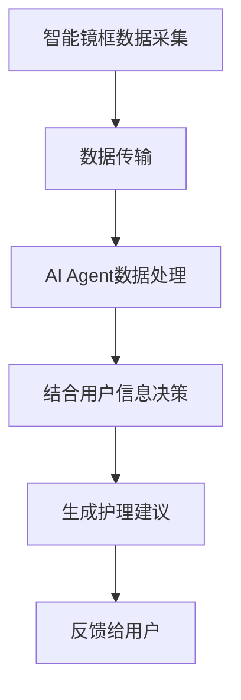

# AI Agent在智能镜框中的面部护理建议

> 关键词：AI Agent、智能镜框、面部护理、计算机视觉、机器学习、数据分析、个性化建议

> 摘要：本文聚焦于AI Agent在智能镜框中的应用，旨在探讨如何利用先进的人工智能技术为用户提供精准、个性化的面部护理建议。通过计算机视觉和机器学习算法，智能镜框能够实时捕捉面部图像，分析面部特征和皮肤状况，结合用户的个人信息和生活习惯，AI Agent生成针对性的护理方案。文章详细介绍了相关核心概念、算法原理、数学模型，通过项目实战展示了具体实现过程，阐述了实际应用场景，并推荐了相关的学习资源、开发工具和研究论文。最后，对AI Agent在智能镜框面部护理领域的未来发展趋势与挑战进行了总结与展望。

## 1. 背景介绍 
### 1.1 目的和范围
随着人们对健康和美容的关注度不断提高，对面部护理的需求也日益增长。传统的面部护理建议往往基于普遍的知识和经验，缺乏个性化和实时性。本研究的目的是将AI Agent集成到智能镜框中，利用其强大的数据分析和决策能力，结合计算机视觉技术，为用户提供个性化、实时的面部护理建议。

本研究的范围涵盖了AI Agent和智能镜框的技术原理、面部护理建议的生成算法、实际应用场景的探索以及相关技术的发展趋势等方面。通过对这些方面的研究，旨在为智能镜框在面部护理领域的应用提供理论支持和实践指导。

### 1.2 预期读者
本文预期读者包括人工智能领域的研究人员、软件开发人员、智能硬件设计师、美容护肤行业的专业人士以及对智能健康产品感兴趣的普通用户。对于研究人员，本文可以提供新的研究思路和方向；对于开发人员，可作为技术实现的参考；对于美容护肤专业人士，有助于了解如何利用先进技术提升服务质量；对于普通用户，能帮助他们更好地理解智能镜框在面部护理中的作用和价值。

### 1.3 文档结构概述
本文共分为十个部分。第一部分介绍研究的背景、目的、预期读者和文档结构概述，并对相关术语进行解释。第二部分阐述AI Agent、智能镜框、面部护理等核心概念及其联系，同时给出文本示意图和Mermaid流程图。第三部分详细讲解生成面部护理建议的核心算法原理，并使用Python源代码进行阐述。第四部分介绍相关的数学模型和公式，并通过举例进行详细说明。第五部分通过项目实战，介绍开发环境搭建、源代码实现和代码解读。第六部分探讨AI Agent在智能镜框中面部护理建议的实际应用场景。第七部分推荐相关的学习资源、开发工具框架和论文著作。第八部分总结未来发展趋势与挑战。第九部分为附录，解答常见问题。第十部分提供扩展阅读和参考资料。

### 1.4 术语表
#### 1.4.1 核心术语定义
- **AI Agent（人工智能代理）**：是一种能够感知环境、根据感知信息进行决策并采取行动的智能实体。在本文中，AI Agent通过分析智能镜框收集的面部数据，为用户生成面部护理建议。
- **智能镜框**：集成了摄像头、传感器、处理器等硬件设备的眼镜框架，能够实时捕捉面部图像和相关生理数据，并与AI Agent进行数据交互。
- **面部护理**：指通过各种方法和产品来维护和改善面部皮肤的健康和外观，包括清洁、保湿、防晒、抗皱等措施。

#### 1.4.2 相关概念解释
- **计算机视觉**：是一门研究如何使机器“看”的科学，通过图像处理和分析技术，让计算机从图像或视频中提取有价值的信息。在智能镜框中，计算机视觉技术用于识别面部特征和皮肤状况。
- **机器学习**：是人工智能的一个分支，通过让计算机从数据中学习模式和规律，从而实现预测和决策。在本文中，机器学习算法用于分析面部数据，生成个性化的护理建议。
- **数据分析**：指对大量数据进行收集、整理、分析和解释的过程，以发现数据中的有价值信息。在智能镜框的应用中，数据分析用于处理面部图像和生理数据，为AI Agent的决策提供支持。

#### 1.4.3 缩略词列表
- **AI**：Artificial Intelligence（人工智能）
- **CV**：Computer Vision（计算机视觉）
- **ML**：Machine Learning（机器学习）

## 2. 核心概念与联系 

### 核心概念原理
#### AI Agent
AI Agent是一种基于人工智能技术的智能实体，它通过感知环境中的信息，利用内置的算法和模型进行推理和决策，然后采取相应的行动。在智能镜框的面部护理应用中，AI Agent的主要功能是接收智能镜框收集的面部图像和相关生理数据，对这些数据进行分析和处理，结合用户的个人信息和生活习惯，生成个性化的面部护理建议。

#### 智能镜框
智能镜框是一种集成了多种传感器和计算设备的智能硬件。它通常配备有高清摄像头，用于实时捕捉面部图像；还可能配备有皮肤传感器，用于检测皮肤的湿度、油脂分泌等生理数据。智能镜框将收集到的数据通过无线通信技术传输给AI Agent，同时接收AI Agent生成的护理建议，并通过显示屏或语音提示等方式反馈给用户。

#### 面部护理
面部护理是一个综合性的概念，包括清洁、保湿、防晒、抗皱等多个方面。不同的皮肤类型和状况需要不同的护理方法和产品。在智能镜框的应用中，AI Agent根据面部图像和生理数据分析用户的皮肤类型（如干性、油性、混合性等）、皮肤问题（如痘痘、色斑、皱纹等），结合用户的个人信息（如年龄、性别、肤质偏好等）和生活习惯（如作息时间、饮食习惯、户外活动频率等），为用户提供个性化的面部护理建议。

### 架构的文本示意图
智能镜框面部护理建议系统主要由以下几个部分组成：
1. **数据采集层**：智能镜框通过摄像头和传感器采集面部图像和生理数据。
2. **数据传输层**：将采集到的数据通过无线通信技术（如蓝牙、Wi-Fi等）传输到云端服务器或本地计算设备。
3. **数据处理层**：AI Agent在服务器或本地设备上对传输过来的数据进行处理和分析，包括面部特征识别、皮肤状况评估等。
4. **决策生成层**：AI Agent根据数据处理结果，结合用户的个人信息和生活习惯，生成个性化的面部护理建议。
5. **反馈层**：将生成的护理建议通过智能镜框的显示屏或语音提示等方式反馈给用户。

### Mermaid流程图


## 3. 核心算法原理 & 具体操作步骤 

### 核心算法原理
#### 面部特征识别算法
面部特征识别是整个系统的基础，它通过计算机视觉技术从面部图像中提取关键特征，如眼睛、鼻子、嘴巴的位置和形状，以及面部轮廓等。常用的面部特征识别算法有基于深度学习的卷积神经网络（CNN），如OpenCV中的Haar级联分类器和基于深度学习的人脸识别库dlib。

#### 皮肤状况评估算法
皮肤状况评估算法用于分析面部皮肤的健康状况，包括皮肤类型（干性、油性、混合性等）、皮肤问题（痘痘、色斑、皱纹等）。可以使用机器学习算法，如支持向量机（SVM）、随机森林（Random Forest）等，对提取的面部特征和皮肤纹理进行分类和评估。

#### 个性化推荐算法
个性化推荐算法根据用户的个人信息（年龄、性别、肤质偏好等）、生活习惯（作息时间、饮食习惯、户外活动频率等）和皮肤状况评估结果，为用户生成个性化的面部护理建议。可以使用协同过滤算法、基于内容的推荐算法等。

### 具体操作步骤及Python源代码

#### 面部特征识别步骤及代码
```python
import cv2
import dlib

# 加载人脸检测器和特征点检测器
detector = dlib.get_frontal_face_detector()
predictor = dlib.shape_predictor("shape_predictor_68_face_landmarks.dat")

# 读取面部图像
image = cv2.imread("face_image.jpg")
gray = cv2.cvtColor(image, cv2.COLOR_BGR2GRAY)

# 检测人脸
faces = detector(gray)

for face in faces:
    # 检测面部特征点
    landmarks = predictor(gray, face)
    for n in range(0, 68):
        x = landmarks.part(n).x
        y = landmarks.part(n).y
        cv2.circle(image, (x, y), 2, (0, 255, 0), -1)

# 显示结果
cv2.imshow("Facial Landmarks", image)
cv2.waitKey(0)
cv2.destroyAllWindows()
```
上述代码使用dlib库进行面部特征点的检测，首先加载人脸检测器和特征点检测器，然后读取面部图像并转换为灰度图像，接着检测人脸和面部特征点，最后在图像上绘制特征点并显示结果。

#### 皮肤状况评估步骤及代码
```python
import numpy as np
from sklearn.svm import SVC
from sklearn.model_selection import train_test_split
from sklearn.metrics import accuracy_score

# 假设已经提取了面部特征和对应的皮肤类型标签
X = np.random.rand(100, 10)  # 面部特征数据
y = np.random.randint(0, 3, 100)  # 皮肤类型标签（0: 干性，1: 油性，2: 混合性）

# 划分训练集和测试集
X_train, X_test, y_train, y_test = train_test_split(X, y, test_size=0.2, random_state=42)

# 训练支持向量机模型
model = SVC()
model.fit(X_train, y_train)

# 预测测试集
y_pred = model.predict(X_test)

# 计算准确率
accuracy = accuracy_score(y_test, y_pred)
print(f"皮肤类型预测准确率: {accuracy}")
```
上述代码使用支持向量机（SVM）对皮肤类型进行分类，首先生成随机的面部特征数据和对应的皮肤类型标签，然后划分训练集和测试集，接着训练SVM模型并进行预测，最后计算预测准确率。

#### 个性化推荐步骤及代码
```python
# 假设已经有用户的个人信息、生活习惯和皮肤状况评估结果
user_info = {
    "age": 25,
    "gender": "female",
    "skin_type": "oily",
    "sleep_time": 7,
    "outdoor_activity": 3
}

# 定义护理建议数据库
recommendation_db = {
    "oily": {
        "cleaning": "使用控油洁面产品",
        "moisturizing": "选择轻薄的保湿乳液",
        "sun_protection": "使用清爽的防晒霜"
    },
    "dry": {
        "cleaning": "使用温和的洁面产品",
        "moisturizing": "选择滋润的面霜",
        "sun_protection": "使用滋润型防晒霜"
    },
    "combination": {
        "cleaning": "T区使用控油洁面产品，其他区域使用温和洁面产品",
        "moisturizing": "T区使用轻薄乳液，其他区域使用滋润面霜",
        "sun_protection": "使用清爽的防晒霜"
    }
}

# 根据用户的皮肤类型生成护理建议
skin_type = user_info["skin_type"]
recommendations = recommendation_db[skin_type]

print(f"清洁建议: {recommendations['cleaning']}")
print(f"保湿建议: {recommendations['moisturizing']}")
print(f"防晒建议: {recommendations['sun_protection']}")
```
上述代码根据用户的皮肤类型从护理建议数据库中提取相应的护理建议并输出。

## 4. 数学模型和公式 & 详细讲解 & 举例说明 

### 面部特征识别的数学模型
在基于深度学习的面部特征识别中，卷积神经网络（CNN）是常用的数学模型。CNN由卷积层、池化层和全连接层组成。

#### 卷积层
卷积层的主要作用是提取图像的特征。卷积操作可以用以下公式表示：
$$y_{i,j}^l = \sum_{m=0}^{M-1}\sum_{n=0}^{N-1}x_{i+m,j+n}^{l-1}w_{m,n}^l + b^l$$
其中，$y_{i,j}^l$ 是第 $l$ 层卷积层的输出特征图中第 $(i,j)$ 位置的值，$x_{i+m,j+n}^{l-1}$ 是第 $l - 1$ 层输入特征图中相应位置的值，$w_{m,n}^l$ 是卷积核的权重，$b^l$ 是偏置项，$M$ 和 $N$ 是卷积核的大小。

#### 池化层
池化层的作用是降低特征图的维度，减少计算量。常用的池化操作有最大池化和平均池化。以最大池化为例，其公式为：
$$y_{i,j}^l = \max_{m=0}^{M-1}\max_{n=0}^{N-1}x_{iM+m,jN+n}^{l-1}$$
其中，$y_{i,j}^l$ 是第 $l$ 层池化层的输出特征图中第 $(i,j)$ 位置的值，$x_{iM+m,jN+n}^{l-1}$ 是第 $l - 1$ 层输入特征图中相应位置的值，$M$ 和 $N$ 是池化窗口的大小。

#### 全连接层
全连接层将卷积层和池化层提取的特征进行组合，输出最终的分类结果。全连接层的计算公式为：
$$y^l = \sigma(W^l x^{l-1} + b^l)$$
其中，$y^l$ 是第 $l$ 层全连接层的输出，$W^l$ 是权重矩阵，$x^{l-1}$ 是第 $l - 1$ 层的输入，$b^l$ 是偏置项，$\sigma$ 是激活函数，如ReLU函数：
$$\sigma(x) = \max(0, x)$$

### 皮肤状况评估的数学模型
在皮肤状况评估中，支持向量机（SVM）是常用的分类模型。SVM的目标是找到一个最优的超平面，将不同类别的样本分开。对于线性可分的情况，SVM的优化问题可以表示为：
$$\min_{w,b}\frac{1}{2}\|w\|^2$$
$$\text{s.t. } y_i(w^T x_i + b) \geq 1, i = 1,2,\cdots,n$$
其中，$w$ 是超平面的法向量，$b$ 是偏置项，$x_i$ 是第 $i$ 个样本，$y_i$ 是第 $i$ 个样本的标签（$y_i \in \{-1, 1\}$），$n$ 是样本数量。

对于线性不可分的情况，可以引入松弛变量 $\xi_i$，将优化问题修改为：
$$\min_{w,b,\xi}\frac{1}{2}\|w\|^2 + C\sum_{i=1}^{n}\xi_i$$
$$\text{s.t. } y_i(w^T x_i + b) \geq 1 - \xi_i, \xi_i \geq 0, i = 1,2,\cdots,n$$
其中，$C$ 是惩罚参数，用于平衡分类误差和模型复杂度。

### 举例说明
假设我们有一个简单的面部特征数据集，包含两个特征（$x_1$ 和 $x_2$）和两个类别（$y = -1$ 和 $y = 1$）。我们可以使用SVM来对这些样本进行分类。

```python
import numpy as np
import matplotlib.pyplot as plt
from sklearn.svm import SVC

# 生成样本数据
X = np.array([[3, 4], [1, 2], [2, 1], [5, 6], [7, 8]])
y = np.array([-1, -1, -1, 1, 1])

# 训练SVM模型
model = SVC(kernel='linear')
model.fit(X, y)

# 绘制样本点
plt.scatter(X[:, 0], X[:, 1], c=y, cmap=plt.cm.Paired)

# 绘制决策边界
ax = plt.gca()
xlim = ax.get_xlim()
ylim = ax.get_ylim()

xx = np.linspace(xlim[0], xlim[1], 30)
yy = np.linspace(ylim[0], ylim[1], 30)
YY, XX = np.meshgrid(yy, xx)
xy = np.vstack([XX.ravel(), YY.ravel()]).T
Z = model.decision_function(xy).reshape(XX.shape)

ax.contour(XX, YY, Z, colors='k', levels=[-1, 0, 1], alpha=0.5, linestyles=['--', '-', '--'])

plt.show()
```
上述代码生成了一个简单的二维数据集，并使用SVM进行分类，最后绘制了决策边界。

## 5. 项目实战：代码实际案例和详细解释说明 

### 5.1  开发环境搭建
#### 硬件环境
- **智能镜框**：选择一款支持摄像头和传感器的智能镜框，如Google Glass等。
- **开发计算机**：配置较高的台式机或笔记本电脑，建议内存不小于8GB，CPU性能较好。

#### 软件环境
- **操作系统**：Windows 10、Linux（如Ubuntu）或macOS。
- **编程语言**：Python 3.x。
- **开发工具**：PyCharm、Jupyter Notebook等。
- **相关库和框架**：OpenCV、dlib、scikit-learn、TensorFlow等。

#### 安装步骤
1. 安装Python 3.x：从Python官方网站（https://www.python.org/downloads/）下载并安装Python 3.x版本。
2. 安装开发工具：根据个人喜好选择并安装PyCharm或Jupyter Notebook。
3. 安装相关库和框架：使用pip命令安装所需的库和框架，例如：
```bash
pip install opencv-python
pip install dlib
pip install scikit-learn
pip install tensorflow
```

### 5.2  源代码详细实现和代码解读
#### 完整代码示例
```python
import cv2
import dlib
import numpy as np
from sklearn.svm import SVC
from sklearn.model_selection import train_test_split
from sklearn.metrics import accuracy_score

# 加载人脸检测器和特征点检测器
detector = dlib.get_frontal_face_detector()
predictor = dlib.shape_predictor("shape_predictor_68_face_landmarks.dat")

# 读取面部图像
image = cv2.imread("face_image.jpg")
gray = cv2.cvtColor(image, cv2.COLOR_BGR2GRAY)

# 检测人脸
faces = detector(gray)

# 提取面部特征
features = []
for face in faces:
    landmarks = predictor(gray, face)
    face_features = []
    for n in range(0, 68):
        x = landmarks.part(n).x
        y = landmarks.part(n).y
        face_features.extend([x, y])
    features.append(face_features)

# 假设已经有皮肤类型标签
labels = np.random.randint(0, 3, len(features))  # 0: 干性，1: 油性，2: 混合性

# 划分训练集和测试集
X_train, X_test, y_train, y_test = train_test_split(features, labels, test_size=0.2, random_state=42)

# 训练支持向量机模型
model = SVC()
model.fit(X_train, y_train)

# 预测测试集
y_pred = model.predict(X_test)

# 计算准确率
accuracy = accuracy_score(y_test, y_pred)
print(f"皮肤类型预测准确率: {accuracy}")

# 定义护理建议数据库
recommendation_db = {
    "oily": {
        "cleaning": "使用控油洁面产品",
        "moisturizing": "选择轻薄的保湿乳液",
        "sun_protection": "使用清爽的防晒霜"
    },
    "dry": {
        "cleaning": "使用温和的洁面产品",
        "moisturizing": "选择滋润的面霜",
        "sun_protection": "使用滋润型防晒霜"
    },
    "combination": {
        "cleaning": "T区使用控油洁面产品，其他区域使用温和洁面产品",
        "moisturizing": "T区使用轻薄乳液，其他区域使用滋润面霜",
        "sun_protection": "使用清爽的防晒霜"
    }
}

# 根据预测结果生成护理建议
for i in range(len(y_pred)):
    if y_pred[i] == 0:
        skin_type = "dry"
    elif y_pred[i] == 1:
        skin_type = "oily"
    else:
        skin_type = "combination"
    recommendations = recommendation_db[skin_type]
    print(f"第 {i + 1} 个人的清洁建议: {recommendations['cleaning']}")
    print(f"第 {i + 1} 个人的保湿建议: {recommendations['moisturizing']}")
    print(f"第 {i + 1} 个人的防晒建议: {recommendations['sun_protection']}")
```

#### 代码解读
1. **面部特征提取**：使用dlib库的人脸检测器和特征点检测器，从面部图像中提取68个面部特征点的坐标，并将其作为面部特征。
2. **皮肤类型分类**：使用支持向量机（SVM）对提取的面部特征进行分类，预测皮肤类型（干性、油性、混合性）。
3. **护理建议生成**：根据预测的皮肤类型，从护理建议数据库中提取相应的护理建议并输出。

### 5.3  代码解读与分析
#### 优点
- **模块化设计**：代码分为面部特征提取、皮肤类型分类和护理建议生成三个模块，结构清晰，易于维护和扩展。
- **使用成熟的库和算法**：使用dlib进行面部特征提取，使用SVM进行皮肤类型分类，这些都是成熟的技术，具有较高的准确性和可靠性。
- **可定制性**：护理建议数据库可以根据实际需求进行修改和扩展，以提供更个性化的护理建议。

#### 缺点
- **数据局限性**：代码中使用的面部特征和皮肤类型标签是随机生成的，实际应用中需要大量真实的面部图像和对应的皮肤类型标签进行训练，以提高分类的准确性。
- **缺乏实时性**：代码是基于静态图像进行处理的，实际应用中需要实现实时视频流的处理，以提供实时的面部护理建议。

#### 改进方向
- **数据收集和预处理**：收集大量真实的面部图像和对应的皮肤类型标签，并进行数据预处理，如数据增强、归一化等，以提高模型的泛化能力。
- **实时处理**：使用OpenCV的视频流处理功能，实现实时视频流的面部特征提取和皮肤类型分类，以提供实时的面部护理建议。

## 6. 实际应用场景 
### 个人日常护理
用户在日常生活中佩戴智能镜框，智能镜框实时捕捉面部图像，AI Agent分析面部皮肤状况，根据用户的个人信息和生活习惯，为用户提供个性化的面部护理建议。例如，在早晨起床后，智能镜框可以提醒用户清洁面部并使用适合的护肤品；在户外活动前，提醒用户涂抹防晒霜等。

### 美容护肤店服务
美容护肤店可以为顾客提供配备智能镜框的服务。顾客在店内佩戴智能镜框，AI Agent快速分析顾客的面部皮肤状况，美容师可以根据AI Agent生成的护理建议，为顾客制定个性化的美容护肤方案，提高服务质量和顾客满意度。

### 健康监测
智能镜框可以实时监测用户的面部皮肤状况，如皮肤的湿度、油脂分泌等。如果发现皮肤出现异常状况，如过敏、炎症等，AI Agent可以及时提醒用户采取相应的措施，如就医、调整护肤品等，起到健康监测的作用。

### 化妆品研发
化妆品企业可以利用智能镜框收集大量用户的面部皮肤数据，了解不同用户的皮肤需求和使用习惯。通过对这些数据的分析，企业可以研发出更适合不同肤质的化妆品，提高产品的针对性和市场竞争力。

## 7. 工具和资源推荐
### 7.1 学习资源推荐
#### 7.1.1 书籍推荐
- 《Python机器学习实战》：详细介绍了Python在机器学习领域的应用，包括各种机器学习算法的原理和实现，适合初学者入门。
- 《深度学习》：由深度学习领域的三位权威专家Ian Goodfellow、Yoshua Bengio和Aaron Courville撰写，全面介绍了深度学习的理论和实践。
- 《计算机视觉：算法与应用》：系统地介绍了计算机视觉的基本概念、算法和应用，对于学习面部特征识别等计算机视觉技术有很大帮助。

#### 7.1.2 在线课程
- Coursera上的“机器学习”课程：由Andrew Ng教授授课，是机器学习领域的经典课程，讲解深入浅出，适合初学者。
- edX上的“深度学习基础”课程：介绍了深度学习的基本概念和常用算法，通过实践项目帮助学习者掌握深度学习的应用。
- 中国大学MOOC上的“计算机视觉”课程：由国内知名高校的教授授课，详细讲解了计算机视觉的理论和技术，包括图像预处理、特征提取、目标检测等。

#### 7.1.3 技术博客和网站
- Medium：是一个技术博客平台，有很多关于人工智能、机器学习、计算机视觉等领域的优秀文章。
- Towards Data Science：专注于数据科学和机器学习领域的技术博客，提供了很多实用的教程和案例。
- OpenCV官方文档：是学习OpenCV库的重要资源，提供了详细的文档和示例代码。

### 7.2 开发工具框架推荐
#### 7.2.1 IDE和编辑器
- PyCharm：是一款专门为Python开发设计的集成开发环境（IDE），具有强大的代码编辑、调试和自动补全功能。
- Jupyter Notebook：是一个交互式的开发环境，适合进行数据探索和模型实验，支持Python、R等多种编程语言。
- Visual Studio Code：是一款轻量级的代码编辑器，支持多种编程语言和插件，具有丰富的扩展功能。

#### 7.2.2 调试和性能分析工具
- PySnooper：是一个简单易用的Python调试工具，可以自动记录函数的调用过程和变量的值，方便调试代码。
- cProfile：是Python标准库中的性能分析工具，可以分析代码的运行时间和函数调用次数，帮助优化代码性能。
- TensorBoard：是TensorFlow的可视化工具，可以可视化模型的训练过程、网络结构和性能指标，方便调试和优化深度学习模型。

#### 7.2.3 相关框架和库
- OpenCV：是一个开源的计算机视觉库，提供了丰富的图像处理和计算机视觉算法，如人脸检测、特征提取、图像滤波等。
- dlib：是一个现代的C++工具包，包含了机器学习算法和工具，特别适用于计算机视觉和图像处理，如面部特征识别、目标检测等。
- scikit-learn：是一个简单易用的Python机器学习库，提供了各种机器学习算法和工具，如分类、回归、聚类等。
- TensorFlow：是一个开源的深度学习框架，由Google开发，广泛应用于图像识别、自然语言处理等领域。

### 7.3 相关论文著作推荐
#### 7.3.1 经典论文
- “FaceNet: A Unified Embedding for Face Recognition and Clustering”：提出了一种基于深度学习的人脸识别方法FaceNet，通过学习人脸的嵌入向量来实现人脸识别和聚类。
- “Support-Vector Networks”：是支持向量机（SVM）领域的经典论文，详细介绍了SVM的原理和算法。
- “ImageNet Classification with Deep Convolutional Neural Networks”：是深度学习在图像分类领域的开创性论文，提出了AlexNet模型，推动了深度学习在计算机视觉领域的发展。

#### 7.3.2 最新研究成果
- 关注顶级学术会议如CVPR（计算机视觉与模式识别会议）、ICML（国际机器学习会议）、NeurIPS（神经信息处理系统大会）等的最新研究成果，了解AI Agent、计算机视觉和机器学习在面部护理领域的最新进展。

#### 7.3.3 应用案例分析
- 查阅相关的行业报告和案例分析，了解智能镜框在面部护理领域的实际应用案例和效果，学习其他企业的成功经验。

## 8. 总结：未来发展趋势与挑战
### 未来发展趋势
#### 更精准的皮肤分析
随着计算机视觉和传感器技术的不断发展，智能镜框将能够更精准地分析面部皮肤的状况，包括皮肤的微观结构、细胞活力等，为用户提供更细致、个性化的面部护理建议。

#### 与其他设备的集成
智能镜框将与其他智能设备如智能手表、智能手机等进行集成，实现数据的共享和交互。例如，智能手表可以提供用户的运动、睡眠等生理数据，智能镜框结合这些数据为用户提供更全面的面部护理建议。

#### 虚拟试妆功能
智能镜框可以结合增强现实（AR）技术，实现虚拟试妆功能。用户可以在智能镜框的显示屏上看到不同妆容的效果，同时AI Agent可以根据用户的皮肤状况和个人喜好，推荐适合的化妆品。

#### 社交互动功能
智能镜框可以增加社交互动功能，用户可以与朋友分享自己的面部护理经验和成果，还可以参与面部护理社区的讨论和活动，促进用户之间的交流和互动。

### 挑战
#### 数据隐私和安全
智能镜框收集的面部图像和生理数据属于用户的敏感信息，如何确保这些数据的隐私和安全是一个重要的挑战。需要采取严格的数据加密、访问控制等措施，防止数据泄露和滥用。

#### 算法准确性和可靠性
面部护理建议的准确性和可靠性直接影响用户的体验和健康。需要不断优化和改进算法，提高面部特征识别、皮肤状况评估和个性化推荐的准确性和可靠性。

#### 用户接受度
智能镜框作为一种新兴的智能设备，用户对其的接受度还需要进一步提高。需要加强产品的宣传和推广，提高用户对智能镜框面部护理功能的认知和信任。

#### 硬件性能和续航
智能镜框的硬件性能和续航能力也是限制其发展的重要因素。需要不断提升硬件性能，以支持更复杂的算法和功能，同时提高电池续航能力，满足用户的日常使用需求。

## 9. 附录：常见问题与解答
### 1. 智能镜框的面部特征识别准确率有多高？
智能镜框的面部特征识别准确率受多种因素影响，如图像质量、光照条件、面部表情等。一般来说，使用先进的深度学习算法和大量的训练数据，面部特征识别的准确率可以达到较高水平。但在实际应用中，可能会因为环境因素等导致准确率有所下降。

### 2. 智能镜框的皮肤类型分类准确吗？
皮肤类型分类的准确性取决于所使用的算法和训练数据。目前的机器学习算法可以在一定程度上准确分类皮肤类型，但由于皮肤状况的复杂性和个体差异，分类结果可能存在一定的误差。随着数据的不断积累和算法的不断优化，皮肤类型分类的准确性会不断提高。

### 3. 智能镜框的护理建议是否适用于所有人？
智能镜框的护理建议是基于用户的面部皮肤状况、个人信息和生活习惯生成的，具有一定的个性化。但由于每个人的皮肤状况和对护肤品的反应不同，护理建议可能需要根据个人实际情况进行调整。

### 4. 智能镜框的使用是否会对皮肤造成伤害？
智能镜框本身不会对皮肤造成伤害。但如果智能镜框的摄像头或传感器质量不佳，可能会产生辐射或其他不良影响。在选择智能镜框时，建议选择质量可靠、经过认证的产品。

### 5. 智能镜框的电池续航能力如何？
智能镜框的电池续航能力因产品而异。一般来说，目前智能镜框的电池续航时间可以满足用户的日常使用需求，但如果长时间使用高负荷功能，如实时视频流处理等，电池续航时间可能会缩短。

## 10. 扩展阅读 & 参考资料
### 扩展阅读
- 《人工智能时代的健康管理》：探讨了人工智能在健康管理领域的应用和发展趋势，对于理解智能镜框在面部护理中的应用有一定的参考价值。
- 《未来智能硬件发展趋势》：介绍了智能硬件的发展现状和未来趋势，包括智能眼镜等设备的创新应用。

### 参考资料
- OpenCV官方文档：https://docs.opencv.org/
- dlib官方文档：http://dlib.net/
- scikit-learn官方文档：https://scikit-learn.org/
- TensorFlow官方文档：https://www.tensorflow.org/
- 相关学术论文和研究报告。