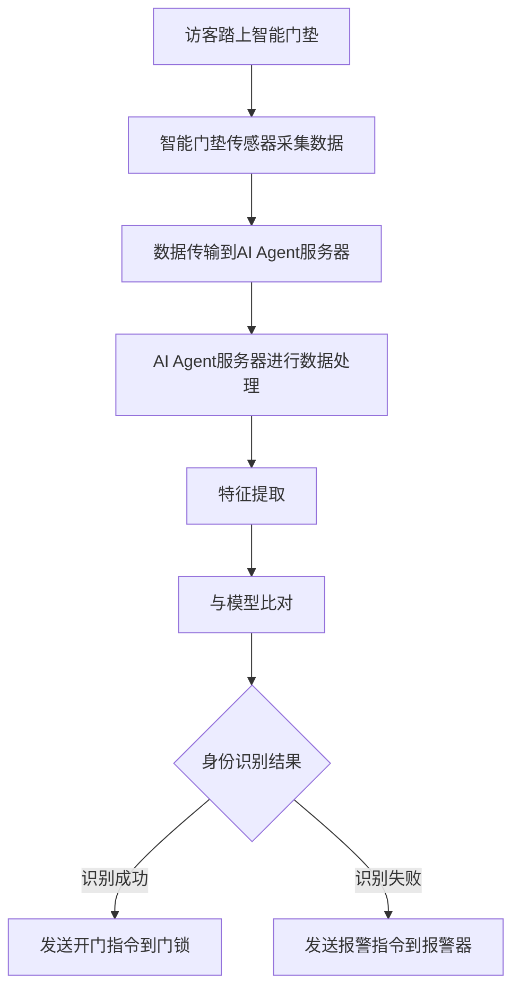

# AI Agent在智能门垫中的访客识别系统

> 关键词：AI Agent、智能门垫、访客识别系统、机器学习、计算机视觉、传感器技术、物联网

> 摘要：本文聚焦于AI Agent在智能门垫访客识别系统中的应用。首先介绍了该系统研究的背景、目的、预期读者等内容。接着深入阐述了AI Agent、智能门垫及访客识别系统的核心概念与联系，给出相应的原理和架构示意图。详细讲解了核心算法原理，包括使用Python代码示例。同时介绍了相关的数学模型和公式，并举例说明。通过项目实战，展示了开发环境搭建、源代码实现与解读。分析了该系统的实际应用场景，推荐了学习资源、开发工具框架以及相关论文著作。最后总结了未来发展趋势与挑战，还提供了常见问题解答和扩展阅读参考资料，旨在全面深入地探讨AI Agent在智能门垫访客识别系统中的应用与发展。

## 1. 背景介绍 
### 1.1 目的和范围
智能门垫访客识别系统的主要目的是利用先进的AI Agent技术，提升家庭和商业场所的安全性与便利性。传统的门禁系统通常依赖于刷卡、密码或摄像头等单一方式，存在一定的局限性。而智能门垫访客识别系统通过结合多种传感器技术和AI Agent的智能决策能力，能够更全面、准确地识别访客身份。

本系统的范围涵盖了从访客踏上智能门垫开始，到完成身份识别并做出相应决策的整个过程。包括数据采集、特征提取、模型训练、身份识别和决策执行等环节。

### 1.2 预期读者
本文预期读者包括对人工智能、物联网、智能家居等领域感兴趣的技术爱好者、从事相关领域研究和开发的专业人员，以及关注家庭和商业场所安全与便利的普通用户。对于技术爱好者，本文可以帮助他们了解AI Agent在实际应用中的具体实现方式；对于专业人员，提供了系统设计和开发的详细思路和技术细节；对于普通用户，能让他们了解智能门垫访客识别系统的工作原理和优势。

### 1.3 文档结构概述
本文首先介绍了研究的背景信息，包括目的、预期读者和文档结构。接着阐述了AI Agent、智能门垫及访客识别系统的核心概念与联系，为后续的技术讲解奠定基础。然后详细讲解了核心算法原理和具体操作步骤，通过Python代码示例进行说明。同时介绍了相关的数学模型和公式，并举例说明其应用。在项目实战部分，展示了开发环境搭建、源代码实现与解读。分析了该系统的实际应用场景，推荐了学习资源、开发工具框架以及相关论文著作。最后总结了未来发展趋势与挑战，提供了常见问题解答和扩展阅读参考资料。

### 1.4 术语表
#### 1.4.1 核心术语定义
- **AI Agent（人工智能智能体）**：是一种能够感知环境、根据感知信息做出决策并采取行动的智能实体。在智能门垫访客识别系统中，AI Agent负责处理传感器采集的数据，进行身份识别和决策制定。
- **智能门垫**：集成了多种传感器技术，如压力传感器、摄像头、生物特征传感器等，能够采集访客的相关信息，并将数据传输给AI Agent进行处理。
- **访客识别系统**：利用AI Agent和传感器技术，对访客的身份进行识别和验证的系统。该系统可以根据不同的识别结果，采取相应的措施，如开门、报警等。

#### 1.4.2 相关概念解释
- **机器学习**：是一门多领域交叉学科，涉及概率论、统计学、逼近论、凸分析、算法复杂度理论等多门学科。它专门研究计算机怎样模拟或实现人类的学习行为，以获取新的知识或技能，重新组织已有的知识结构使之不断改善自身的性能。在智能门垫访客识别系统中，机器学习算法用于训练模型，以提高身份识别的准确性。
- **计算机视觉**：是一门研究如何使机器“看”的科学，更进一步的说，就是指用摄影机和电脑代替人眼对目标进行识别、跟踪和测量等机器视觉，并进一步做图形处理，使电脑处理成为更适合人眼观察或传送给仪器检测的图像。在智能门垫访客识别系统中，计算机视觉技术用于处理摄像头采集的图像数据，提取访客的面部特征等信息。
- **传感器技术**：是关于从自然信源获取信息，并对之进行处理（变换）和识别的一门多学科交叉的现代科学与工程技术。在智能门垫中，传感器技术用于采集访客的压力、重量、生物特征等信息。

#### 1.4.3 缩略词列表
- **AI**：Artificial Intelligence，人工智能
- **ML**：Machine Learning，机器学习
- **CV**：Computer Vision，计算机视觉

## 2. 核心概念与联系 

### 核心概念原理
#### AI Agent原理
AI Agent的核心原理是感知、决策和行动的循环过程。它通过传感器感知环境信息，将这些信息输入到决策模块中，决策模块根据预设的规则或训练好的模型进行分析和判断，然后输出相应的决策结果，最后通过执行器采取行动。在智能门垫访客识别系统中，AI Agent通过压力传感器、摄像头等获取访客的相关信息，对这些信息进行处理和分析，判断访客的身份，并根据身份信息决定是否开门或采取其他措施。

#### 智能门垫原理
智能门垫集成了多种传感器，其原理是利用这些传感器采集访客的不同特征信息。压力传感器可以检测访客的重量和站立位置，摄像头可以捕捉访客的面部图像和身体姿态，生物特征传感器可以采集访客的指纹、掌纹等信息。这些传感器将采集到的数据传输到智能门垫的处理单元，处理单元对数据进行初步处理后，再传输给AI Agent进行进一步分析。

#### 访客识别系统原理
访客识别系统的原理是基于机器学习和计算机视觉等技术，对访客的特征信息进行提取和分析。首先，系统会收集大量的访客样本数据，包括面部图像、生物特征、压力数据等，并对这些数据进行标注。然后，使用机器学习算法对标注数据进行训练，得到一个识别模型。当有新的访客到来时，系统会采集访客的相关信息，提取特征并与模型进行比对，根据比对结果判断访客的身份。

### 架构的文本示意图
智能门垫访客识别系统主要由智能门垫、AI Agent服务器和执行设备（如门锁、报警器等）组成。智能门垫通过传感器采集访客的信息，将数据通过有线或无线方式传输到AI Agent服务器。AI Agent服务器对数据进行处理和分析，根据识别结果向执行设备发送相应的控制指令。

### Mermaid流程图


## 3. 核心算法原理 & 具体操作步骤 

### 核心算法原理
在智能门垫访客识别系统中，常用的核心算法包括机器学习算法和计算机视觉算法。这里以基于深度学习的卷积神经网络（CNN）为例，介绍访客面部识别的算法原理。

卷积神经网络是一种专门为处理具有网格结构数据（如图像）而设计的神经网络。它通过卷积层、池化层和全连接层等组件，自动提取图像的特征。

#### 卷积层
卷积层是CNN的核心组件之一，它通过卷积核（滤波器）在输入图像上滑动，进行卷积操作，提取图像的局部特征。卷积操作可以表示为：

$$y_{ij} = \sum_{m=0}^{M-1} \sum_{n=0}^{N-1} x_{i+m,j+n} \cdot k_{mn} + b$$

其中，$x$ 是输入图像，$k$ 是卷积核，$b$ 是偏置，$y$ 是卷积结果。

#### 池化层
池化层用于降低特征图的维度，减少计算量，同时增强模型的鲁棒性。常用的池化方法有最大池化和平均池化。最大池化是在每个池化窗口中选择最大值作为输出，平均池化是计算池化窗口中所有值的平均值作为输出。

#### 全连接层
全连接层将卷积层和池化层提取的特征进行整合，输出最终的分类结果。

### 具体操作步骤及Python源代码

#### 步骤1：数据准备
首先，需要收集大量的访客面部图像数据，并将其分为训练集和测试集。

```python
import os
import cv2
import numpy as np
from sklearn.model_selection import train_test_split

# 定义数据集路径
data_path = 'face_dataset'

# 读取图像数据和标签
images = []
labels = []
label_dict = {}
label_id = 0

for root, dirs, files in os.walk(data_path):
    for file in files:
        if file.endswith('.jpg') or file.endswith('.png'):
            img_path = os.path.join(root, file)
            img = cv2.imread(img_path, cv2.IMREAD_GRAYSCALE)
            images.append(img)
            label_name = os.path.basename(root)
            if label_name not in label_dict:
                label_dict[label_name] = label_id
                label_id += 1
            labels.append(label_dict[label_name])

# 将图像数据和标签转换为numpy数组
images = np.array(images)
labels = np.array(labels)

# 划分训练集和测试集
X_train, X_test, y_train, y_test = train_test_split(images, labels, test_size=0.2, random_state=42)
```

#### 步骤2：模型构建
使用Keras库构建一个简单的卷积神经网络模型。

```python
from tensorflow.keras.models import Sequential
from tensorflow.keras.layers import Conv2D, MaxPooling2D, Flatten, Dense

# 构建模型
model = Sequential()
model.add(Conv2D(32, (3, 3), activation='relu', input_shape=(100, 100, 1)))
model.add(MaxPooling2D((2, 2)))
model.add(Conv2D(64, (3, 3), activation='relu'))
model.add(MaxPooling2D((2, 2)))
model.add(Conv2D(128, (3, 3), activation='relu'))
model.add(MaxPooling2D((2, 2)))
model.add(Flatten())
model.add(Dense(128, activation='relu'))
model.add(Dense(len(label_dict), activation='softmax'))

# 编译模型
model.compile(optimizer='adam',
              loss='sparse_categorical_crossentropy',
              metrics=['accuracy'])
```

#### 步骤3：模型训练
使用训练集对模型进行训练。

```python
# 调整训练数据的形状
X_train = X_train.reshape(-1, 100, 100, 1)
X_test = X_test.reshape(-1, 100, 100, 1)

# 训练模型
model.fit(X_train, y_train, epochs=10, validation_data=(X_test, y_test))
```

#### 步骤4：模型评估
使用测试集对模型进行评估。

```python
# 评估模型
test_loss, test_acc = model.evaluate(X_test, y_test)
print(f"Test accuracy: {test_acc}")
```

#### 步骤5：访客识别
使用训练好的模型对新的访客图像进行识别。

```python
# 读取新的访客图像
new_img_path = 'new_visitor.jpg'
new_img = cv2.imread(new_img_path, cv2.IMREAD_GRAYSCALE)
new_img = cv2.resize(new_img, (100, 100))
new_img = new_img.reshape(1, 100, 100, 1)

# 进行预测
predictions = model.predict(new_img)
predicted_label = np.argmax(predictions)

# 查找对应的标签名称
reverse_label_dict = {v: k for k, v in label_dict.items()}
predicted_name = reverse_label_dict[predicted_label]

print(f"Predicted name: {predicted_name}")
```

## 4. 数学模型和公式 & 详细讲解 & 举例说明 

### 卷积操作公式
卷积操作是CNN中最核心的操作之一，其公式为：

$$y_{ij} = \sum_{m=0}^{M-1} \sum_{n=0}^{N-1} x_{i+m,j+n} \cdot k_{mn} + b$$

其中，$x$ 是输入图像，$k$ 是卷积核，$b$ 是偏置，$y$ 是卷积结果。$M$ 和 $N$ 分别是卷积核的高度和宽度，$i$ 和 $j$ 是输出特征图的坐标。

详细讲解：卷积操作的本质是将卷积核在输入图像上滑动，对每个位置的图像区域与卷积核进行逐元素相乘并求和，再加上偏置项，得到输出特征图的一个元素。卷积核可以看作是一个滤波器，用于提取图像的特定特征。

举例说明：假设输入图像 $x$ 是一个 $3\times3$ 的矩阵：

$$
x = 
\begin{bmatrix}
1 & 2 & 3 \\
4 & 5 & 6 \\
7 & 8 & 9
\end{bmatrix}
$$

卷积核 $k$ 是一个 $2\times2$ 的矩阵：

$$
k = 
\begin{bmatrix}
1 & 0 \\
0 & 1
\end{bmatrix}
$$

偏置 $b = 0$。

首先，将卷积核的左上角与输入图像的左上角对齐，进行逐元素相乘并求和：

$$y_{00} = 1\times1 + 2\times0 + 4\times0 + 5\times1 = 6$$

然后，将卷积核向右滑动一个位置，继续进行计算：

$$y_{01} = 2\times1 + 3\times0 + 5\times0 + 6\times1 = 8$$

以此类推，最终得到输出特征图：

$$
y = 
\begin{bmatrix}
6 & 8 \\
12 & 14
\end{bmatrix}
$$

### 交叉熵损失函数公式
在分类问题中，常用交叉熵损失函数来衡量模型预测结果与真实标签之间的差异。对于多分类问题，交叉熵损失函数的公式为：

$$L = -\frac{1}{N} \sum_{i=1}^{N} \sum_{j=1}^{C} y_{ij} \log(p_{ij})$$

其中，$N$ 是样本数量，$C$ 是类别数量，$y_{ij}$ 是第 $i$ 个样本的真实标签的第 $j$ 个分量（如果样本属于第 $j$ 类，则 $y_{ij} = 1$，否则 $y_{ij} = 0$），$p_{ij}$ 是模型对第 $i$ 个样本属于第 $j$ 类的预测概率。

详细讲解：交叉熵损失函数的目的是让模型的预测概率尽可能接近真实标签的分布。当模型的预测概率与真实标签完全一致时，交叉熵损失函数的值为 0；当预测概率与真实标签差异较大时，损失函数的值会增大。

举例说明：假设我们有 3 个样本，类别数量为 3，真实标签和模型预测概率如下：

真实标签：

$$
Y = 
\begin{bmatrix}
1 & 0 & 0 \\
0 & 1 & 0 \\
0 & 0 & 1
\end{bmatrix}
$$

模型预测概率：

$$
P = 
\begin{bmatrix}
0.8 & 0.1 & 0.1 \\
0.2 & 0.7 & 0.1 \\
0.1 & 0.2 & 0.7
\end{bmatrix}
$$

首先，计算每个样本的交叉熵损失：

对于第一个样本：

$$L_1 = - (1\times\log(0.8) + 0\times\log(0.1) + 0\times\log(0.1)) \approx 0.223$$

对于第二个样本：

$$L_2 = - (0\times\log(0.2) + 1\times\log(0.7) + 0\times\log(0.1)) \approx 0.357$$

对于第三个样本：

$$L_3 = - (0\times\log(0.1) + 0\times\log(0.2) + 1\times\log(0.7)) \approx 0.357$$

然后，计算平均交叉熵损失：

$$L = \frac{1}{3} (0.223 + 0.357 + 0.357) \approx 0.312$$

## 5. 项目实战：代码实际案例和详细解释说明 

### 5.1  开发环境搭建
#### 硬件环境
- 智能门垫：选择集成了压力传感器、摄像头和生物特征传感器的智能门垫。
- 服务器：可以使用一台性能较好的计算机作为AI Agent服务器，推荐配置为Intel Core i7以上处理器，16GB以上内存，500GB以上硬盘。
- 执行设备：门锁、报警器等。

#### 软件环境
- 操作系统：推荐使用Ubuntu 18.04或以上版本的Linux系统。
- 开发语言：Python 3.7或以上版本。
- 深度学习框架：TensorFlow 2.x或PyTorch。
- 其他库：OpenCV、NumPy、Scikit-learn等。

#### 安装步骤
1. 安装Python：可以从Python官方网站下载并安装Python 3.7或以上版本。
2. 安装深度学习框架：使用pip命令安装TensorFlow或PyTorch。例如，安装TensorFlow：

```bash
pip install tensorflow
```

3. 安装其他库：使用pip命令安装OpenCV、NumPy、Scikit-learn等库。

```bash
pip install opencv-python numpy scikit-learn
```

### 5.2  源代码详细实现和代码解读
#### 数据采集模块
```python
import cv2
import time
import numpy as np

# 初始化摄像头
cap = cv2.VideoCapture(0)

while True:
    ret, frame = cap.read()
    if not ret:
        break
    
    # 显示图像
    cv2.imshow('Frame', frame)
    
    # 采集图像数据
    image_data = np.array(frame)
    
    # 模拟压力传感器数据
    pressure_data = np.random.randint(0, 100, 1)[0]
    
    # 打印采集的数据
    print(f"Image data shape: {image_data.shape}")
    print(f"Pressure data: {pressure_data}")
    
    # 按 'q' 键退出
    if cv2.waitKey(1) & 0xFF == ord('q'):
        break

# 释放摄像头并关闭窗口
cap.release()
cv2.destroyAllWindows()
```

代码解读：这段代码使用OpenCV库初始化摄像头，循环读取摄像头的帧图像。同时，模拟了压力传感器的数据。采集到的图像数据和压力数据可以用于后续的处理和分析。

#### 特征提取模块
```python
import cv2
import numpy as np

def extract_features(image):
    # 转换为灰度图像
    gray = cv2.cvtColor(image, cv2.COLOR_BGR2GRAY)
    
    # 直方图均衡化
    equalized = cv2.equalizeHist(gray)
    
    # 特征提取（例如，使用HOG特征）
    hog = cv2.HOGDescriptor()
    features = hog.compute(equalized)
    
    return features

# 读取图像
image = cv2.imread('test_image.jpg')

# 提取特征
features = extract_features(image)

print(f"Features shape: {features.shape}")
```

代码解读：这段代码定义了一个特征提取函数 `extract_features`，它将输入的彩色图像转换为灰度图像，进行直方图均衡化，然后使用HOG特征提取方法提取图像的特征。最后，返回提取的特征。

#### 身份识别模块
```python
import tensorflow as tf
import numpy as np

# 加载训练好的模型
model = tf.keras.models.load_model('face_recognition_model.h5')

# 读取新的访客图像
new_img_path = 'new_visitor.jpg'
new_img = cv2.imread(new_img_path, cv2.IMREAD_GRAYSCALE)
new_img = cv2.resize(new_img, (100, 100))
new_img = new_img.reshape(1, 100, 100, 1)

# 进行预测
predictions = model.predict(new_img)
predicted_label = np.argmax(predictions)

# 查找对应的标签名称
label_dict = {'person1': 0, 'person2': 1}  # 假设的标签字典
reverse_label_dict = {v: k for k, v in label_dict.items()}
predicted_name = reverse_label_dict[predicted_label]

print(f"Predicted name: {predicted_name}")
```

代码解读：这段代码加载训练好的人脸识别模型，读取新的访客图像，对图像进行预处理，然后使用模型进行预测。最后，根据预测结果查找对应的标签名称。

### 5.3  代码解读与分析
#### 数据采集模块分析
数据采集模块的主要功能是从摄像头和传感器中获取访客的相关信息。使用OpenCV库可以方便地读取摄像头的帧图像，模拟压力传感器数据可以帮助我们测试系统的后续处理流程。在实际应用中，需要根据具体的传感器型号和接口，编写相应的驱动程序来获取真实的传感器数据。

#### 特征提取模块分析
特征提取模块的目的是从采集到的图像数据中提取有用的特征，以便后续的身份识别。这里使用了HOG特征提取方法，它可以有效地描述图像的局部纹理信息。在实际应用中，可以根据不同的需求选择不同的特征提取方法，如SIFT、SURF等。

#### 身份识别模块分析
身份识别模块使用训练好的模型对新的访客图像进行预测。在加载模型时，需要确保模型的路径正确。对新的访客图像进行预处理时，需要保证图像的尺寸和通道数与训练模型时的输入一致。最后，根据预测结果查找对应的标签名称，完成身份识别。

## 6. 实际应用场景 
### 家庭安防
在家庭场景中，智能门垫访客识别系统可以提高家庭的安全性。当有访客到来时，系统可以快速准确地识别访客身份。如果是家庭成员或授权访客，系统可以自动开门；如果是陌生人，系统可以向业主发送警报信息，提醒业主注意安全。同时，系统还可以记录访客的信息和到访时间，方便业主查看和管理。

### 商业场所
在商业场所，如写字楼、酒店等，智能门垫访客识别系统可以提高门禁管理的效率和安全性。对于员工，可以实现快速的身份验证，提高工作效率；对于访客，可以进行有效的身份登记和管理，确保场所的安全。此外，系统还可以与其他安防设备集成，如监控摄像头、报警器等，形成一个完整的安防体系。

### 智能社区
在智能社区中，智能门垫访客识别系统可以作为社区安防的重要组成部分。它可以与社区的门禁系统、物业管理系统等集成，实现对社区居民和访客的智能化管理。例如，当居民进入社区时，系统可以自动识别身份并记录相关信息；当有访客来访时，系统可以与业主进行远程视频通话，确认访客身份后再开门。

## 7. 工具和资源推荐
### 7.1 学习资源推荐
#### 7.1.1 书籍推荐
- 《深度学习》（Deep Learning）：由Ian Goodfellow、Yoshua Bengio和Aaron Courville三位深度学习领域的先驱所著，是深度学习领域的经典教材，涵盖了深度学习的基本原理、算法和应用。
- 《Python机器学习》（Python Machine Learning）：由Sebastian Raschka所著，介绍了使用Python进行机器学习的基本方法和技术，包括数据预处理、模型选择、评估和优化等内容。
- 《计算机视觉：算法与应用》（Computer Vision: Algorithms and Applications）：由Richard Szeliski所著，全面介绍了计算机视觉的基本算法和应用，包括图像滤波、特征提取、目标检测、图像分割等内容。

#### 7.1.2 在线课程
- Coursera上的“深度学习专项课程”（Deep Learning Specialization）：由Andrew Ng教授授课，包括深度学习的基础、卷积神经网络、循环神经网络等多个主题，是学习深度学习的优质课程。
- edX上的“计算机视觉：从基础到应用”（Computer Vision: From Fundamentals to Applications）：由MIT的教授授课，介绍了计算机视觉的基本原理和应用，包括图像特征提取、目标检测、图像分类等内容。
- 中国大学MOOC上的“人工智能基础”：由国内多所高校的教授授课，介绍了人工智能的基本概念、算法和应用，适合初学者学习。

#### 7.1.3 技术博客和网站
- Medium：是一个技术博客平台，上面有很多关于人工智能、机器学习、计算机视觉等领域的优质文章。
- Towards Data Science：是一个专注于数据科学和机器学习的技术博客，上面有很多实用的技术教程和案例分析。
- OpenCV官方文档：是学习计算机视觉的重要资源，提供了OpenCV库的详细文档和示例代码。

### 7.2 开发工具框架推荐
#### 7.2.1 IDE和编辑器
- PyCharm：是一款专门为Python开发设计的集成开发环境，提供了代码编辑、调试、版本控制等功能，适合Python开发者使用。
- Jupyter Notebook：是一个交互式的开发环境，支持Python、R等多种编程语言，适合数据科学和机器学习的开发和实验。
- Visual Studio Code：是一款轻量级的代码编辑器，支持多种编程语言和插件，具有丰富的扩展功能，适合快速开发和调试。

#### 7.2.2 调试和性能分析工具
- TensorBoard：是TensorFlow的可视化工具，可以帮助开发者可视化模型的训练过程、损失函数、准确率等指标，方便调试和优化模型。
- PyTorch Profiler：是PyTorch的性能分析工具，可以帮助开发者分析模型的性能瓶颈，优化代码的执行效率。
- cProfile：是Python的内置性能分析工具，可以帮助开发者分析Python代码的性能瓶颈，找出耗时较长的函数和代码段。

#### 7.2.3 相关框架和库
- TensorFlow：是一个开源的深度学习框架，由Google开发和维护，提供了丰富的深度学习模型和工具，支持GPU加速，适合大规模的深度学习开发。
- PyTorch：是一个开源的深度学习框架，由Facebook开发和维护，具有动态计算图的特点，适合快速迭代和实验，在学术界和工业界都有广泛的应用。
- OpenCV：是一个开源的计算机视觉库，提供了丰富的计算机视觉算法和工具，包括图像滤波、特征提取、目标检测、图像分割等内容，适合计算机视觉的开发和应用。

### 7.3 相关论文著作推荐
#### 7.3.1 经典论文
- LeCun, Y., Bottou, L., Bengio, Y., & Haffner, P. (1998). Gradient-based learning applied to document recognition. Proceedings of the IEEE, 86(11), 2278-2324. 这篇论文介绍了卷积神经网络（CNN）在文档识别中的应用，是CNN领域的经典论文。
- Krizhevsky, A., Sutskever, I., & Hinton, G. E. (2012). ImageNet classification with deep convolutional neural networks. Advances in neural information processing systems, 25. 这篇论文介绍了AlexNet网络，在ImageNet图像分类竞赛中取得了巨大的成功，开启了深度学习在计算机视觉领域的热潮。

#### 7.3.2 最新研究成果
- 关注顶级学术会议，如CVPR（Computer Vision and Pattern Recognition）、ICCV（International Conference on Computer Vision）、NeurIPS（Neural Information Processing Systems）等，这些会议上会发布很多关于人工智能、机器学习、计算机视觉等领域的最新研究成果。

#### 7.3.3 应用案例分析
- 可以关注一些知名企业的技术博客，如Google AI Blog、Facebook AI Research等，上面会分享很多人工智能技术在实际应用中的案例和经验。

## 8. 总结：未来发展趋势与挑战
### 未来发展趋势
#### 多模态融合
未来的智能门垫访客识别系统将不仅仅依赖于单一的传感器数据，而是会融合多种传感器的信息，如压力、重量、生物特征、图像等，实现更全面、准确的访客识别。通过多模态融合，可以提高系统的鲁棒性和准确性，减少误判的发生。

#### 智能化决策
随着AI Agent技术的不断发展，智能门垫访客识别系统将具备更强大的智能化决策能力。系统可以根据不同的场景和用户需求，自动调整识别策略和决策规则。例如，在不同的时间段、不同的天气条件下，系统可以采用不同的识别方法，提高识别的准确性和效率。

#### 与其他智能家居设备的集成
智能门垫访客识别系统将与其他智能家居设备进行更深入的集成，实现更智能化的家居控制。例如，当系统识别到业主回家时，可以自动打开灯光、调节温度、播放音乐等，为业主提供更加舒适、便捷的家居体验。

### 挑战
#### 数据隐私和安全
智能门垫访客识别系统需要采集大量的访客信息，包括生物特征、图像等，这些数据涉及到用户的隐私和安全。因此，如何保护这些数据的隐私和安全是一个重要的挑战。需要采用先进的加密技术和安全机制，确保数据在传输和存储过程中的安全性。

#### 环境适应性
智能门垫访客识别系统在不同的环境条件下可能会受到影响，如光照、温度、湿度等。如何提高系统的环境适应性，确保在各种环境条件下都能准确地识别访客身份，是一个需要解决的问题。

#### 成本问题
目前，智能门垫访客识别系统的成本相对较高，包括硬件成本和软件开发成本。如何降低系统的成本，提高系统的性价比，是推广和应用该系统的关键。

## 9. 附录：常见问题与解答
### 问题1：智能门垫访客识别系统的识别准确率有多高？
解答：智能门垫访客识别系统的识别准确率受到多种因素的影响，如传感器的精度、算法的性能、环境条件等。一般来说，经过优化和训练的系统，在理想的环境条件下，识别准确率可以达到90%以上。

### 问题2：系统如何保护访客的隐私和数据安全？
解答：系统采用了多种加密技术和安全机制来保护访客的隐私和数据安全。例如，在数据传输过程中，采用SSL/TLS加密协议进行加密；在数据存储过程中，采用加密算法对数据进行加密存储。同时，系统会严格控制数据的访问权限，只有授权人员才能访问和处理这些数据。

### 问题3：智能门垫访客识别系统可以与哪些设备集成？
解答：智能门垫访客识别系统可以与多种设备集成，如门锁、报警器、监控摄像头、智能家居设备等。通过与这些设备的集成，可以实现更智能化的门禁管理和家居控制。

### 问题4：系统在不同的环境条件下性能会受到影响吗？
解答：系统在不同的环境条件下性能可能会受到一定的影响。例如，光照过强或过弱可能会影响摄像头的图像采集效果，从而影响人脸识别的准确性；温度和湿度的变化可能会影响传感器的性能。为了提高系统的环境适应性，需要采用一些技术手段，如光照补偿、传感器校准等。

### 问题5：智能门垫访客识别系统的成本高吗？
解答：目前，智能门垫访客识别系统的成本相对较高，主要包括硬件成本和软件开发成本。随着技术的不断发展和市场的竞争，系统的成本有望逐渐降低。

## 10. 扩展阅读 & 参考资料
### 扩展阅读
- 《人工智能：一种现代的方法》（Artificial Intelligence: A Modern Approach）：全面介绍了人工智能的基本概念、算法和应用，是学习人工智能的经典教材。
- 《数据挖掘：概念与技术》（Data Mining: Concepts and Techniques）：介绍了数据挖掘的基本概念、算法和应用，适合对数据挖掘感兴趣的读者阅读。
- 《物联网：技术、应用与标准》（Internet of Things: Technologies, Applications, and Standards）：介绍了物联网的基本概念、技术和应用，适合对物联网感兴趣的读者阅读。

### 参考资料
- OpenCV官方文档：https://docs.opencv.org/
- TensorFlow官方文档：https://www.tensorflow.org/
- PyTorch官方文档：https://pytorch.org/
- Coursera官方网站：https://www.coursera.org/
- edX官方网站：https://www.edx.org/
- 中国大学MOOC官方网站：https://www.icourse163.org/