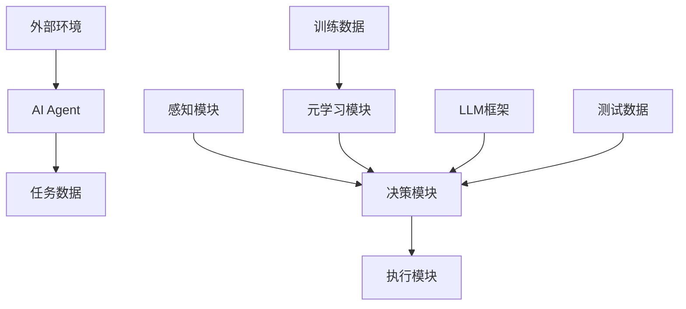

# AI Agent的元学习能力：快速适应新任务的LLM框架

> 关键词：AI Agent、元学习能力、LLM框架、快速适应、新任务

> 摘要：本文聚焦于AI Agent的元学习能力，深入探讨基于大语言模型（LLM）的框架如何使AI Agent能够快速适应新任务。详细阐述了相关核心概念、算法原理、数学模型，并通过项目实战展示其实现过程。同时分析了实际应用场景，推荐了学习资源、开发工具和相关论文著作。最后对未来发展趋势与挑战进行总结，为读者全面呈现AI Agent元学习能力及LLM框架的相关知识与技术。

## 1. 背景介绍 
### 1.1 目的和范围
随着人工智能技术的不断发展，AI Agent在各种领域的应用日益广泛。然而，传统的AI Agent在面对新任务时往往需要大量的重新训练和调整，效率低下。本文章的目的在于介绍一种具备元学习能力的LLM框架，使AI Agent能够快速适应新任务。范围涵盖了该框架的核心概念、算法原理、数学模型、项目实战、实际应用场景等多个方面，旨在为读者提供一个全面深入的了解。

### 1.2 预期读者
本文预期读者包括人工智能领域的研究人员、开发者、学生以及对AI Agent和大语言模型感兴趣的技术爱好者。对于想要深入了解如何提升AI Agent适应性和效率的读者具有较高的参考价值。

### 1.3 文档结构概述
本文首先介绍背景知识，包括目的、预期读者和文档结构概述等内容。接着阐述核心概念与联系，展示其原理和架构的文本示意图及Mermaid流程图。然后详细讲解核心算法原理和具体操作步骤，使用Python源代码进行阐述。随后介绍数学模型和公式，并举例说明。通过项目实战展示代码实际案例和详细解释。分析实际应用场景，推荐相关工具和资源。最后总结未来发展趋势与挑战，提供常见问题解答和扩展阅读参考资料。

### 1.4 术语表
#### 1.4.1 核心术语定义
- **AI Agent**：人工智能代理，是一种能够感知环境、做出决策并采取行动以实现特定目标的软件或硬件实体。
- **元学习**：也称为“学习如何学习”，是一种让模型能够快速学习新任务的技术，通过从多个任务中学习通用的学习策略。
- **LLM（大语言模型）**：基于大量文本数据训练的语言模型，具有强大的语言理解和生成能力，如GPT系列、BERT等。

#### 1.4.2 相关概念解释
- **快速适应**：指AI Agent在面对新任务时，能够在短时间内调整自身的学习策略和参数，以达到较好的任务执行效果。
- **新任务**：相对于AI Agent之前学习和执行过的任务而言，具有不同的任务目标、输入输出要求和数据分布的任务。

#### 1.4.3 缩略词列表
- **AI**：Artificial Intelligence（人工智能）
- **LLM**：Large Language Model（大语言模型）

## 2. 核心概念与联系 

### 核心概念原理
AI Agent的元学习能力是指其能够从多个任务中学习到通用的学习策略，从而在面对新任务时能够快速调整和适应。LLM框架则为AI Agent提供了强大的语言处理能力，使得AI Agent能够更好地理解和处理自然语言任务。

元学习的核心思想是通过在多个任务上进行训练，学习到一个初始的模型参数和学习策略，使得模型在新任务上能够更快地收敛到较好的性能。在LLM框架中，通常使用预训练的大语言模型作为基础，通过元学习算法对其进行微调，以适应不同的任务。

### 架构的文本示意图
```plaintext
+-------------------+
|  外部环境         |
+-------------------+
       |
       v
+-------------------+
|  AI Agent         |
|  - 感知模块       |
|  - 决策模块       |
|  - 执行模块       |
|  - 元学习模块     |
|  - LLM框架        |
+-------------------+
       |
       v
+-------------------+
|  任务数据         |
|  - 训练数据       |
|  - 测试数据       |
+-------------------+
```

### Mermaid流程图


## 3. 核心算法原理 & 具体操作步骤 

### 核心算法原理
元学习算法的一种常见形式是模型无关的元学习（Model-Agnostic Meta-Learning，MAML）。MAML的核心思想是找到一个初始的模型参数，使得模型在经过少量的梯度更新后，能够在新任务上取得较好的性能。

具体来说，MAML的训练过程包括两个阶段：

1. **内部循环**：在每个任务上进行少量的梯度更新，得到在该任务上的临时模型参数。
2. **外部循环**：在所有任务的临时模型参数上进行梯度更新，以更新初始的模型参数。

### Python源代码详细阐述
```python
import torch
import torch.nn as nn
import torch.optim as optim

# 定义一个简单的神经网络模型
class SimpleModel(nn.Module):
    def __init__(self, input_size, hidden_size, output_size):
        super(SimpleModel, self).__init__()
        self.fc1 = nn.Linear(input_size, hidden_size)
        self.relu = nn.ReLU()
        self.fc2 = nn.Linear(hidden_size, output_size)

    def forward(self, x):
        out = self.fc1(x)
        out = self.relu(out)
        out = self.fc2(out)
        return out

# 定义MAML算法
class MAML:
    def __init__(self, model, inner_lr, outer_lr, num_inner_steps):
        self.model = model
        self.inner_lr = inner_lr
        self.outer_lr = outer_lr
        self.num_inner_steps = num_inner_steps
        self.outer_optimizer = optim.Adam(self.model.parameters(), lr=outer_lr)

    def inner_loop(self, task_data):
        inner_model = SimpleModel(*list(self.model.parameters())[0].shape[:2], list(self.model.parameters())[-1].shape[0])
        inner_model.load_state_dict(self.model.state_dict())
        inner_optimizer = optim.SGD(inner_model.parameters(), lr=self.inner_lr)

        for _ in range(self.num_inner_steps):
            inputs, labels = task_data
            outputs = inner_model(inputs)
            loss = nn.CrossEntropyLoss()(outputs, labels)
            inner_optimizer.zero_grad()
            loss.backward()
            inner_optimizer.step()

        return inner_model

    def outer_loop(self, tasks):
        meta_loss = 0
        for task_data in tasks:
            inner_model = self.inner_loop(task_data)
            inputs, labels = task_data
            outputs = inner_model(inputs)
            loss = nn.CrossEntropyLoss()(outputs, labels)
            meta_loss += loss

        self.outer_optimizer.zero_grad()
        meta_loss.backward()
        self.outer_optimizer.step()

        return meta_loss.item()

# 示例使用
input_size = 10
hidden_size = 20
output_size = 5
model = SimpleModel(input_size, hidden_size, output_size)
maml = MAML(model, inner_lr=0.01, outer_lr=0.001, num_inner_steps=3)

# 模拟一些任务数据
tasks = []
for _ in range(5):
    inputs = torch.randn(100, input_size)
    labels = torch.randint(0, output_size, (100,))
    tasks.append((inputs, labels))

# 训练过程
for epoch in range(10):
    loss = maml.outer_loop(tasks)
    print(f'Epoch {epoch + 1}, Loss: {loss}')
```

### 具体操作步骤
1. **定义模型**：选择合适的神经网络模型，如上述示例中的`SimpleModel`。
2. **初始化MAML对象**：设置内部学习率、外部学习率和内部循环步数等参数。
3. **准备任务数据**：收集或生成多个任务的数据。
4. **进行训练**：在每个训练周期中，执行外部循环，对每个任务执行内部循环，更新模型参数。

## 4. 数学模型和公式 & 详细讲解 & 举例说明 

### 数学模型和公式
在MAML算法中，设 $\theta$ 为初始的模型参数，$\tau$ 为一个任务，$L(\theta, \tau)$ 为在任务 $\tau$ 上的损失函数。

#### 内部循环
在内部循环中，通过梯度下降更新模型参数，得到临时参数 $\theta'$：
$$
\theta' = \theta - \alpha \nabla_{\theta} L(\theta, \tau)
$$
其中 $\alpha$ 为内部学习率。

#### 外部循环
在外部循环中，通过最小化所有任务的临时参数上的损失函数来更新初始参数 $\theta$：
$$
\theta \leftarrow \theta - \beta \nabla_{\theta} \sum_{\tau \in \mathcal{T}} L(\theta', \tau)
$$
其中 $\beta$ 为外部学习率，$\mathcal{T}$ 为任务集合。

### 详细讲解
内部循环的目的是在每个任务上进行少量的梯度更新，使得模型能够快速适应该任务。外部循环则是通过综合所有任务的信息，更新初始的模型参数，使得模型在新任务上能够更快地收敛。

### 举例说明
假设我们有两个任务 $\tau_1$ 和 $\tau_2$，初始模型参数为 $\theta$。在内部循环中，对于任务 $\tau_1$，通过梯度下降得到临时参数 $\theta_1'$，对于任务 $\tau_2$，得到临时参数 $\theta_2'$。在外部循环中，计算 $\theta_1'$ 和 $\theta_2'$ 上的损失函数之和，然后通过梯度下降更新 $\theta$。

## 5. 项目实战：代码实际案例和详细解释说明 

### 5.1  开发环境搭建
1. **安装Python**：建议使用Python 3.7及以上版本。
2. **安装深度学习框架**：使用`pip`或`conda`安装PyTorch深度学习框架，具体安装命令可以参考PyTorch官方文档。
3. **安装其他依赖库**：根据项目需求，安装必要的依赖库，如`numpy`、`matplotlib`等。

### 5.2  源代码详细实现和代码解读
以下是一个更完整的项目实战代码示例，结合了LLM框架和MAML算法，实现AI Agent的元学习能力：

```python
import torch
import torch.nn as nn
import torch.optim as optim
from transformers import AutoModelForSequenceClassification, AutoTokenizer

# 定义AI Agent类
class AIAgent:
    def __init__(self, model_name, inner_lr, outer_lr, num_inner_steps):
        self.tokenizer = AutoTokenizer.from_pretrained(model_name)
        self.model = AutoModelForSequenceClassification.from_pretrained(model_name)
        self.inner_lr = inner_lr
        self.outer_lr = outer_lr
        self.num_inner_steps = num_inner_steps
        self.outer_optimizer = optim.Adam(self.model.parameters(), lr=outer_lr)

    def inner_loop(self, task_data):
        inner_model = AutoModelForSequenceClassification.from_pretrained(self.model.config._name_or_path)
        inner_model.load_state_dict(self.model.state_dict())
        inner_optimizer = optim.SGD(inner_model.parameters(), lr=self.inner_lr)

        for _ in range(self.num_inner_steps):
            texts, labels = task_data
            inputs = self.tokenizer(texts, return_tensors='pt', padding=True, truncation=True)
            outputs = inner_model(**inputs).logits
            loss = nn.CrossEntropyLoss()(outputs, labels)
            inner_optimizer.zero_grad()
            loss.backward()
            inner_optimizer.step()

        return inner_model

    def outer_loop(self, tasks):
        meta_loss = 0
        for task_data in tasks:
            inner_model = self.inner_loop(task_data)
            texts, labels = task_data
            inputs = self.tokenizer(texts, return_tensors='pt', padding=True, truncation=True)
            outputs = inner_model(**inputs).logits
            loss = nn.CrossEntropyLoss()(outputs, labels)
            meta_loss += loss

        self.outer_optimizer.zero_grad()
        meta_loss.backward()
        self.outer_optimizer.step()

        return meta_loss.item()

# 示例使用
model_name = 'bert-base-uncased'
agent = AIAgent(model_name, inner_lr=0.01, outer_lr=0.001, num_inner_steps=3)

# 模拟一些任务数据
tasks = []
for _ in range(5):
    texts = ['This is a sample text', 'Another sample text']
    labels = torch.randint(0, 2, (len(texts),))
    tasks.append((texts, labels))

# 训练过程
for epoch in range(10):
    loss = agent.outer_loop(tasks)
    print(f'Epoch {epoch + 1}, Loss: {loss}')
```

### 代码解读与分析
1. **初始化**：在`AIAgent`类的`__init__`方法中，加载预训练的LLM模型和对应的分词器，设置内部学习率、外部学习率和内部循环步数，并初始化外部优化器。
2. **内部循环**：在`inner_loop`方法中，复制当前模型的参数到一个新的模型中，使用SGD优化器在当前任务上进行少量的梯度更新。
3. **外部循环**：在`outer_loop`方法中，对每个任务执行内部循环，得到临时模型，计算临时模型在任务上的损失，累加所有任务的损失，然后使用外部优化器更新初始模型的参数。
4. **训练过程**：通过多次迭代执行外部循环，不断更新模型参数，直到损失收敛。

## 6. 实际应用场景 
### 自然语言处理任务
- **文本分类**：在不同领域的文本分类任务中，如新闻分类、情感分析等，AI Agent可以利用元学习能力快速适应新的分类任务，减少训练时间和数据需求。
- **命名实体识别**：对于不同领域的命名实体识别任务，如医疗、金融等，AI Agent可以快速学习到新领域的实体类型和识别规则。

### 智能客服
在智能客服系统中，AI Agent可以通过元学习能力快速适应不同客户的问题和需求，提供更加准确和个性化的服务。

### 机器人控制
在机器人控制领域，AI Agent可以根据不同的任务环境和目标，快速调整控制策略，实现高效的机器人运动控制。

## 7. 工具和资源推荐
### 7.1 学习资源推荐
#### 7.1.1 书籍推荐
- 《深度学习》（Deep Learning）：由Ian Goodfellow、Yoshua Bengio和Aaron Courville合著，是深度学习领域的经典教材，涵盖了神经网络、优化算法等基础知识。
- 《人工智能：一种现代的方法》（Artificial Intelligence: A Modern Approach）：由Stuart Russell和Peter Norvig合著，全面介绍了人工智能的各个领域，包括搜索算法、机器学习、自然语言处理等。

#### 7.1.2 在线课程
- Coursera上的“深度学习专项课程”（Deep Learning Specialization）：由Andrew Ng教授授课，包括神经网络基础、卷积神经网络、循环神经网络等内容。
- edX上的“人工智能导论”（Introduction to Artificial Intelligence）：由麻省理工学院（MIT）提供，介绍了人工智能的基本概念和算法。

#### 7.1.3 技术博客和网站
- Medium上的AI相关博客：有很多人工智能领域的专家和开发者分享他们的研究成果和实践经验。
- arXiv.org：一个预印本平台，提供了大量的人工智能相关的研究论文。

### 7.2 开发工具框架推荐
#### 7.2.1 IDE和编辑器
- PyCharm：一款专业的Python集成开发环境，提供了代码编辑、调试、版本控制等功能。
- Jupyter Notebook：一个交互式的开发环境，适合进行数据分析、模型训练和实验验证。

#### 7.2.2 调试和性能分析工具
- TensorBoard：一个用于可视化深度学习模型训练过程和性能指标的工具。
- PyTorch Profiler：可以帮助开发者分析PyTorch模型的性能瓶颈，优化代码效率。

#### 7.2.3 相关框架和库
- PyTorch：一个开源的深度学习框架，提供了丰富的神经网络层和优化算法。
- Transformers：由Hugging Face开发的自然语言处理库，提供了多种预训练的大语言模型和相关工具。

### 7.3 相关论文著作推荐
#### 7.3.1 经典论文
- "Model-Agnostic Meta-Learning for Fast Adaptation of Deep Networks"：介绍了MAML算法的原理和实现。
- "Attention Is All You Need"：提出了Transformer架构，是现代大语言模型的基础。

#### 7.3.2 最新研究成果
可以关注ICML（国际机器学习会议）、NeurIPS（神经信息处理系统大会）等顶级学术会议的最新论文，了解AI Agent元学习能力和LLM框架的最新研究进展。

#### 7.3.3 应用案例分析
一些工业界的技术博客和研究报告中会分享AI Agent在实际应用中的案例分析，可以从中学习到实际应用中的经验和技巧。

## 8. 总结：未来发展趋势与挑战
### 未来发展趋势
- **更强的泛化能力**：未来的AI Agent将具备更强的泛化能力，能够在更多不同类型的任务中快速适应，实现真正的通用人工智能。
- **与其他技术的融合**：AI Agent的元学习能力将与计算机视觉、强化学习等其他技术融合，实现更加复杂和智能的应用场景。
- **开源生态的发展**：随着开源社区的不断发展，将有更多的开源框架和工具出现，降低AI Agent开发的门槛，促进技术的普及和应用。

### 挑战
- **计算资源需求**：元学习和LLM框架通常需要大量的计算资源，如何降低计算成本是一个重要的挑战。
- **数据隐私和安全**：在AI Agent的训练和应用过程中，涉及到大量的数据，如何保护数据隐私和安全是一个亟待解决的问题。
- **可解释性**：AI Agent的决策过程往往是黑盒的，如何提高其可解释性，让用户更好地理解和信任AI Agent的决策是一个挑战。

## 9. 附录：常见问题与解答
### 问题1：元学习和传统学习有什么区别？
元学习的目标是学习如何学习，通过从多个任务中学习通用的学习策略，使得模型能够在新任务上快速适应。而传统学习通常是针对单个任务进行训练，当面对新任务时需要重新训练模型。

### 问题2：如何选择合适的内部学习率和外部学习率？
内部学习率和外部学习率的选择通常需要通过实验来确定。一般来说，内部学习率可以设置得相对较大，以便模型能够在少量的梯度更新后快速适应新任务；外部学习率可以设置得相对较小，以保证模型的稳定性。

### 问题3：LLM框架在元学习中有什么作用？
LLM框架提供了强大的语言处理能力，使得AI Agent能够更好地理解和处理自然语言任务。在元学习中，LLM框架可以作为基础模型，通过元学习算法对其进行微调，以适应不同的自然语言处理任务。

## 10. 扩展阅读 & 参考资料
- Goodfellow, I., Bengio, Y., & Courville, A. (2016). Deep Learning. MIT Press.
- Russell, S. J., & Norvig, P. (2020). Artificial Intelligence: A Modern Approach. Pearson.
- Finn, C., Abbeel, P., & Levine, S. (2017). Model-Agnostic Meta-Learning for Fast Adaptation of Deep Networks. arXiv preprint arXiv:1703.03400.
- Vaswani, A., Shazeer, N., Parmar, N., Uszkoreit, J., Jones, L., Gomez, A. N., ... & Polosukhin, I. (2017). Attention Is All You Need. arXiv preprint arXiv:1706.03762.
- Hugging Face官方文档：https://huggingface.co/docs
- PyTorch官方文档：https://pytorch.org/docs/stable/index.html