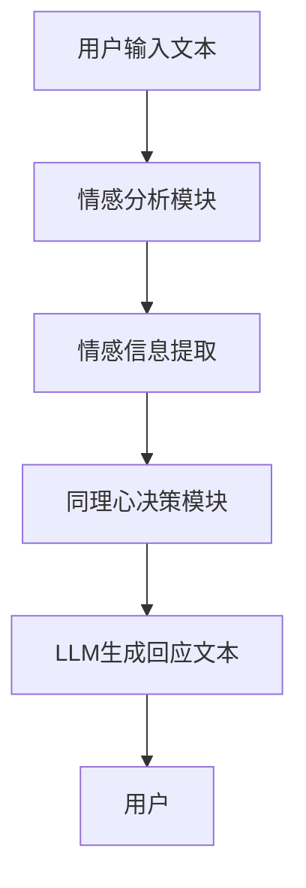

# AI Agent的同理心模拟：增强LLM的情感共鸣能力

> 关键词：AI Agent、同理心模拟、大语言模型（LLM）、情感共鸣、自然语言处理、情感分析、人工智能伦理

> 摘要：本文聚焦于AI Agent的同理心模拟，旨在深入探讨如何增强大语言模型（LLM）的情感共鸣能力。首先介绍了研究的背景，包括目的、预期读者、文档结构和相关术语。接着阐述了AI Agent、同理心模拟、LLM等核心概念及其联系，并通过文本示意图和Mermaid流程图进行直观展示。详细讲解了实现同理心模拟的核心算法原理和具体操作步骤，结合Python源代码进行分析。从数学模型和公式的角度对其进行了深入剖析，并举例说明。通过项目实战，给出了代码实际案例并进行详细解释。探讨了该技术在多个领域的实际应用场景，推荐了相关的学习资源、开发工具框架和论文著作。最后总结了未来发展趋势与挑战，提供了常见问题解答和扩展阅读参考资料，以期为相关领域的研究和实践提供全面且深入的指导。

## 1. 背景介绍 
### 1.1 目的和范围
随着人工智能技术的飞速发展，大语言模型（LLM）在自然语言处理领域取得了显著的成果。然而，现有的LLM在处理涉及人类情感和同理心的任务时仍存在不足。本研究的目的在于探索如何模拟AI Agent的同理心，增强LLM的情感共鸣能力，使AI Agent能够更好地理解和回应人类的情感需求。

本研究的范围涵盖了同理心模拟的理论基础、核心算法、数学模型、实际应用等方面。通过深入研究和实践，旨在为开发更具情感智能的AI Agent提供理论支持和技术指导。

### 1.2 预期读者
本文的预期读者包括人工智能领域的研究人员、开发者、学生，以及对AI Agent情感智能感兴趣的相关人士。对于希望深入了解同理心模拟技术、提升LLM情感共鸣能力的读者，本文将提供有价值的参考。

### 1.3 文档结构概述
本文共分为十个部分。第一部分为背景介绍，阐述研究的目的、范围、预期读者和文档结构。第二部分介绍核心概念与联系，包括AI Agent、同理心模拟、LLM等概念的原理和架构。第三部分详细讲解核心算法原理和具体操作步骤，并给出Python源代码。第四部分介绍数学模型和公式，并举例说明。第五部分通过项目实战，给出代码实际案例并进行详细解释。第六部分探讨实际应用场景。第七部分推荐相关的工具和资源。第八部分总结未来发展趋势与挑战。第九部分为附录，提供常见问题与解答。第十部分提供扩展阅读和参考资料。

### 1.4 术语表
#### 1.4.1 核心术语定义
- **AI Agent（人工智能智能体）**：是指能够感知环境、做出决策并采取行动以实现特定目标的人工智能实体。
- **同理心模拟**：指AI Agent通过分析和理解人类的情感状态，模拟出类似人类同理心的行为和反应。
- **大语言模型（LLM）**：是一种基于深度学习的语言模型，通过在大规模文本数据上进行训练，能够生成自然语言文本。
- **情感共鸣**：指个体在情感上对他人的情感状态产生理解和认同，并做出相应的情感反应。
- **自然语言处理（NLP）**：是人工智能领域的一个重要分支，主要研究如何让计算机处理和理解人类语言。

#### 1.4.2 相关概念解释
- **情感分析**：是自然语言处理的一个重要任务，旨在识别文本中表达的情感倾向，如积极、消极或中性。
- **情感嵌入**：是将情感信息表示为向量的一种方法，使得计算机能够对情感进行数学运算和处理。
- **强化学习**：是一种机器学习方法，通过智能体与环境的交互，根据环境反馈的奖励信号来学习最优策略。

#### 1.4.3 缩略词列表
- **LLM**：大语言模型（Large Language Model）
- **NLP**：自然语言处理（Natural Language Processing）
- **AI**：人工智能（Artificial Intelligence）

## 2. 核心概念与联系 
### 核心概念原理
#### AI Agent
AI Agent是人工智能系统中的一个重要概念，它可以被看作是一个具有自主性、反应性、社会性和适应性的智能实体。AI Agent能够感知周围环境的信息，根据这些信息做出决策，并采取相应的行动来实现特定的目标。在同理心模拟的场景中，AI Agent需要感知人类用户的情感状态，理解其情感需求，并做出具有同理心的回应。

#### 同理心模拟
同理心模拟是指AI Agent通过对人类情感的理解和分析，模拟出类似人类同理心的行为和反应。这需要AI Agent具备情感识别、情感理解和情感表达的能力。情感识别是指AI Agent能够准确地识别出人类用户的情感状态，如快乐、悲伤、愤怒等。情感理解是指AI Agent能够理解人类用户产生某种情感的原因和背景。情感表达是指AI Agent能够以合适的方式表达出对人类用户情感的理解和关心。

#### 大语言模型（LLM）
大语言模型是一种基于深度学习的语言模型，它通过在大规模文本数据上进行训练，学习到语言的统计规律和语义信息。LLM能够生成自然语言文本，回答问题，进行对话等。在同理心模拟中，LLM可以作为AI Agent的语言生成模块，根据情感分析的结果生成具有同理心的回应文本。

### 架构的文本示意图
```plaintext
用户输入文本 -> 情感分析模块 -> 情感信息提取 -> 同理心决策模块 -> LLM生成回应文本 -> 用户
```
这个示意图展示了AI Agent同理心模拟的基本架构。用户输入的文本首先经过情感分析模块，提取出其中的情感信息。然后，同理心决策模块根据情感信息做出决策，确定需要表达的同理心程度和方式。最后，LLM根据决策结果生成相应的回应文本，并反馈给用户。

### Mermaid流程图

这个流程图直观地展示了AI Agent同理心模拟的工作流程。从用户输入文本开始，经过情感分析、信息提取、决策和文本生成等步骤，最终将回应文本反馈给用户。

## 3. 核心算法原理 & 具体操作步骤 
### 核心算法原理
实现AI Agent的同理心模拟主要涉及以下几个核心算法：

#### 情感分析算法
情感分析算法用于识别文本中表达的情感倾向。常见的情感分析算法包括基于机器学习的方法和基于深度学习的方法。基于机器学习的方法通常使用特征工程和分类器，如朴素贝叶斯分类器、支持向量机等。基于深度学习的方法则使用神经网络，如卷积神经网络（CNN）、循环神经网络（RNN）及其变体（如LSTM、GRU）等。

#### 情感嵌入算法
情感嵌入算法用于将情感信息表示为向量。通过将情感信息嵌入到低维向量空间中，可以方便计算机对情感进行数学运算和处理。常见的情感嵌入算法包括Word2Vec、GloVe等。

#### 强化学习算法
强化学习算法用于训练AI Agent的同理心决策能力。在强化学习中，AI Agent通过与环境的交互，根据环境反馈的奖励信号来学习最优策略。在同理心模拟中，环境可以看作是用户的反馈，奖励信号可以根据用户对AI Agent回应的满意度来设置。

### 具体操作步骤
#### 步骤1：数据收集与预处理
收集包含情感信息的文本数据，如社交媒体评论、电影评论等。对数据进行预处理，包括清洗、分词、标注等操作。

#### 步骤2：情感分析模型训练
使用预处理后的数据训练情感分析模型。可以选择基于机器学习或深度学习的方法，根据具体情况选择合适的算法和模型。

#### 步骤3：情感嵌入
使用情感嵌入算法将情感信息表示为向量。可以使用预训练的词向量模型，也可以在自己的数据集上训练词向量模型。

#### 步骤4：同理心决策模型训练
使用强化学习算法训练同理心决策模型。设置合适的奖励函数，根据用户的反馈来调整AI Agent的决策策略。

#### 步骤5：LLM集成
将训练好的情感分析模型、同理心决策模型与LLM集成。当用户输入文本时，首先进行情感分析，提取情感信息，然后根据情感信息进行同理心决策，最后由LLM生成回应文本。

### Python源代码
以下是一个简单的情感分析示例，使用Python和Scikit-learn库：

```python
import numpy as np
from sklearn.feature_extraction.text import TfidfVectorizer
from sklearn.naive_bayes import MultinomialNB
from sklearn.pipeline import Pipeline

# 示例数据
texts = ["This movie is really great!", "I don't like this book at all.", "The food is delicious."]
labels = [1, 0, 1]  # 1表示积极，0表示消极

# 创建管道
pipeline = Pipeline([
    ('vectorizer', TfidfVectorizer()),
    ('classifier', MultinomialNB())
])

# 训练模型
pipeline.fit(texts, labels)

# 预测新文本的情感
new_text = "This song is amazing!"
prediction = pipeline.predict([new_text])
print("Predicted sentiment:", prediction[0])
```
在这个示例中，我们使用TfidfVectorizer将文本转换为特征向量，使用MultinomialNB作为分类器进行情感分析。最后，我们使用训练好的模型对新文本的情感进行预测。

## 4. 数学模型和公式 & 详细讲解 & 举例说明 
### 情感分析的数学模型
#### 朴素贝叶斯分类器
朴素贝叶斯分类器是一种基于贝叶斯定理的简单概率分类器。在情感分析中，朴素贝叶斯分类器可以用于预测文本的情感倾向。

贝叶斯定理的公式为：
$$P(c|x)=\frac{P(x|c)P(c)}{P(x)}$$
其中，$P(c|x)$ 表示在给定文本 $x$ 的情况下，属于类别 $c$ 的概率；$P(x|c)$ 表示在类别 $c$ 下出现文本 $x$ 的概率；$P(c)$ 表示类别 $c$ 的先验概率；$P(x)$ 表示文本 $x$ 出现的概率。

在朴素贝叶斯分类器中，假设文本中的每个特征（如单词）是相互独立的，即：
$$P(x|c)=\prod_{i=1}^{n}P(x_i|c)$$
其中，$x_i$ 表示文本 $x$ 中的第 $i$ 个特征。

#### 深度学习模型
深度学习模型如卷积神经网络（CNN）和循环神经网络（RNN）也可以用于情感分析。以CNN为例，其基本结构包括输入层、卷积层、池化层和全连接层。

卷积层的计算公式为：
$$y_{i,j}=\sum_{m=0}^{M-1}\sum_{n=0}^{N-1}x_{i+m,j+n}w_{m,n}+b$$
其中，$x$ 是输入特征图，$w$ 是卷积核，$b$ 是偏置，$y$ 是输出特征图。

### 情感嵌入的数学模型
#### Word2Vec
Word2Vec是一种常用的词向量模型，它可以将单词表示为低维向量。Word2Vec有两种主要的训练方法：连续词袋模型（CBOW）和跳字模型（Skip-gram）。

以Skip-gram模型为例，其目标是最大化给定中心词预测上下文词的概率。损失函数的公式为：
$$L = -\frac{1}{T}\sum_{t=1}^{T}\sum_{-c\leq j\leq c,j\neq 0}\log P(w_{t+j}|w_t)$$
其中，$T$ 是文本的长度，$c$ 是上下文窗口的大小，$w_t$ 是中心词，$w_{t+j}$ 是上下文词。

### 强化学习的数学模型
#### Q学习算法
Q学习算法是一种基于值函数的强化学习算法。在Q学习中，智能体通过学习一个Q值函数来确定最优策略。

Q值函数的更新公式为：
$$Q(s,a)\leftarrow Q(s,a)+\alpha[r+\gamma\max_{a'}Q(s',a') - Q(s,a)]$$
其中，$Q(s,a)$ 表示在状态 $s$ 下采取动作 $a$ 的Q值；$\alpha$ 是学习率；$r$ 是奖励信号；$\gamma$ 是折扣因子；$s'$ 是下一个状态。

### 举例说明
#### 情感分析
假设有一个文本分类任务，要判断文本是积极还是消极。我们有以下训练数据：
| 文本 | 情感标签 |
|---|---|
| "This movie is wonderful." | 积极 |
| "I hate this book." | 消极 |

使用朴素贝叶斯分类器进行训练，计算每个单词在不同类别下的概率，然后根据贝叶斯定理预测新文本的情感倾向。

#### 情感嵌入
使用Word2Vec训练词向量模型，将单词表示为向量。例如，“happy”和“glad”的向量可能会比较接近，因为它们在语义上都表示积极的情感。

#### 强化学习
在同理心模拟中，AI Agent根据用户的反馈获得奖励信号。例如，如果用户对AI Agent的回应表示满意，AI Agent将获得正奖励；如果用户不满意，AI Agent将获得负奖励。AI Agent通过不断调整自己的决策策略，以最大化长期奖励。

## 5. 项目实战：代码实际案例和详细解释说明 
### 5.1  开发环境搭建
#### 安装Python
首先，确保你已经安装了Python 3.x版本。可以从Python官方网站（https://www.python.org/downloads/）下载并安装。

#### 安装必要的库
使用以下命令安装必要的Python库：
```bash
pip install numpy scikit-learn transformers torch
```
- `numpy`：用于数值计算。
- `scikit-learn`：用于机器学习任务，如情感分析。
- `transformers`：用于使用预训练的大语言模型。
- `torch`：用于深度学习任务。

### 5.2  源代码详细实现和代码解读
以下是一个完整的AI Agent同理心模拟的代码示例：

```python
import numpy as np
from sklearn.feature_extraction.text import TfidfVectorizer
from sklearn.naive_bayes import MultinomialNB
from sklearn.pipeline import Pipeline
from transformers import AutoTokenizer, AutoModelForCausalLM
import torch

# 情感分析模型训练
texts = ["This movie is really great!", "I don't like this book at all.", "The food is delicious."]
labels = [1, 0, 1]  # 1表示积极，0表示消极

pipeline = Pipeline([
    ('vectorizer', TfidfVectorizer()),
    ('classifier', MultinomialNB())
])

pipeline.fit(texts, labels)

# 加载预训练的大语言模型
tokenizer = AutoTokenizer.from_pretrained("gpt2")
model = AutoModelForCausalLM.from_pretrained("gpt2")

# 同理心模拟函数
def empathy_simulation(user_input):
    # 情感分析
    sentiment = pipeline.predict([user_input])[0]
    
    # 根据情感生成提示
    if sentiment == 1:
        prompt = "用户表达了积极的情感，给予积极的回应：" + user_input
    else:
        prompt = "用户表达了消极的情感，给予安慰和理解的回应：" + user_input
    
    # 使用大语言模型生成回应
    input_ids = tokenizer.encode(prompt, return_tensors='pt')
    output = model.generate(input_ids, max_length=100, num_beams=5, no_repeat_ngram_size=2, early_stopping=True)
    response = tokenizer.decode(output[0], skip_special_tokens=True)
    
    return response

# 测试
user_input = "I'm so happy today!"
response = empathy_simulation(user_input)
print("用户输入:", user_input)
print("AI Agent回应:", response)
```
### 5.3  代码解读与分析
#### 情感分析部分
- 使用TfidfVectorizer将文本转换为特征向量，使用MultinomialNB作为分类器进行情感分析。
- 训练数据包括一些示例文本和对应的情感标签，通过`pipeline.fit`方法进行训练。

#### 大语言模型部分
- 使用`transformers`库加载预训练的GPT-2模型和对应的分词器。
- 当用户输入文本时，首先进行情感分析，根据情感结果生成不同的提示。
- 使用大语言模型根据提示生成回应文本，通过`model.generate`方法进行文本生成。

#### 同理心模拟函数
- `empathy_simulation`函数接受用户输入的文本，进行情感分析，生成提示，然后使用大语言模型生成回应文本。
- 最后将生成的回应文本返回。

## 6. 实际应用场景 
### 客户服务
在客户服务领域，AI Agent的同理心模拟可以提高客户满意度。当客户表达不满或遇到问题时，具有同理心的AI Agent能够更好地理解客户的情感需求，给予安慰和支持，提供更个性化的解决方案。例如，在在线购物平台的客服聊天中，AI Agent可以根据客户的语气和情感状态，及时调整回应策略，让客户感受到被关注和理解。

### 心理健康咨询
在心理健康咨询领域，AI Agent的同理心模拟可以作为辅助工具。对于一些轻度心理问题的用户，AI Agent可以倾听他们的心声，给予情感上的支持和鼓励。通过模拟同理心，AI Agent可以帮助用户缓解情绪，提供一些初步的心理调节建议。然而，需要注意的是，AI Agent不能替代专业的心理咨询师，只能作为一种辅助手段。

### 教育领域
在教育领域，AI Agent的同理心模拟可以改善学习体验。当学生遇到困难或挫折时，具有同理心的AI Agent可以给予鼓励和指导，增强学生的学习动力和自信心。例如，在在线学习平台中，AI Agent可以根据学生的学习状态和情绪变化，提供个性化的学习建议和支持。

### 社交机器人
在社交机器人领域，AI Agent的同理心模拟可以使机器人更加人性化。社交机器人可以与人类进行情感交流，理解人类的情感需求，做出相应的情感回应。这可以增强人类与机器人之间的互动和情感连接，提高机器人的社交能力。

## 7. 工具和资源推荐
### 7.1 学习资源推荐
#### 7.1.1 书籍推荐
- 《自然语言处理入门》：介绍了自然语言处理的基本概念、算法和技术，适合初学者。
- 《深度学习》：详细讲解了深度学习的原理和方法，包括神经网络、卷积神经网络、循环神经网络等。
- 《强化学习：原理与Python实现》：全面介绍了强化学习的理论和实践，提供了丰富的Python代码示例。

#### 7.1.2 在线课程
- Coursera上的“Natural Language Processing Specialization”：由顶尖大学的教授授课，系统地介绍了自然语言处理的各个方面。
- edX上的“Deep Learning for Natural Language Processing”：深入讲解了深度学习在自然语言处理中的应用。
- Udemy上的“Reinforcement Learning A-Z™: Learn How To Build Intelligent Agents”：通过实践项目，帮助学习者掌握强化学习的应用。

#### 7.1.3 技术博客和网站
- Medium上的“Towards Data Science”：有很多关于人工智能、自然语言处理的技术文章和案例分析。
- arXiv.org：提供了最新的学术论文，包括自然语言处理、人工智能等领域的研究成果。
- Hugging Face：一个专注于自然语言处理的开源社区，提供了丰富的预训练模型和工具。

### 7.2 开发工具框架推荐
#### 7.2.1 IDE和编辑器
- PyCharm：一款功能强大的Python集成开发环境，提供了代码编辑、调试、版本控制等功能。
- Jupyter Notebook：一个交互式的开发环境，适合进行数据探索、模型训练和实验。
- Visual Studio Code：一个轻量级的代码编辑器，支持多种编程语言和插件扩展。

#### 7.2.2 调试和性能分析工具
- TensorBoard：一个用于可视化深度学习模型训练过程和性能的工具。
- PyTorch Profiler：用于分析PyTorch模型的性能瓶颈，帮助优化代码。
- Scikit-learn的模型评估工具：提供了各种评估指标和工具，用于评估机器学习模型的性能。

#### 7.2.3 相关框架和库
- Transformers：由Hugging Face开发的用于自然语言处理的库，提供了大量的预训练模型和工具。
- PyTorch：一个开源的深度学习框架，广泛应用于自然语言处理、计算机视觉等领域。
- Scikit-learn：一个简单易用的机器学习库，提供了各种机器学习算法和工具。

### 7.3 相关论文著作推荐
#### 7.3.1 经典论文
- “Attention Is All You Need”：介绍了Transformer架构，是自然语言处理领域的重要突破。
- “Deep Residual Learning for Image Recognition”：提出了残差网络（ResNet），在深度学习领域具有重要影响。
- “Q-Learning”：首次提出了Q学习算法，是强化学习领域的经典论文。

#### 7.3.2 最新研究成果
- 在arXiv.org上搜索“empathy simulation in AI”、“emotional intelligence in LLM”等关键词，可以获取最新的研究成果。
- 关注顶级学术会议如ACL（Association for Computational Linguistics）、NeurIPS（Conference on Neural Information Processing Systems）等的论文。

#### 7.3.3 应用案例分析
- 一些知名科技公司的博客和技术报告，如Google AI Blog、OpenAI Blog等，会分享AI Agent应用的案例和经验。
- 相关的学术期刊和会议论文集，如ACM Transactions on Intelligent Systems and Technology、Proceedings of the ACM SIGKDD International Conference on Knowledge Discovery and Data Mining等，也会有应用案例的分析。

## 8. 总结：未来发展趋势与挑战
### 未来发展趋势
#### 多模态同理心模拟
未来的AI Agent可能会结合多种模态信息，如语音、图像、文本等，进行更全面的同理心模拟。通过综合分析多种模态的情感信息，AI Agent能够更准确地理解人类的情感状态，提供更具同理心的回应。

#### 个性化同理心
随着用户数据的积累和分析技术的发展，AI Agent将能够实现个性化的同理心模拟。根据用户的个人偏好、历史记录和情感模式，AI Agent可以提供更符合用户需求的情感支持和回应，增强用户与AI Agent之间的情感连接。

#### 跨文化同理心
在全球化的背景下，AI Agent需要具备跨文化的同理心模拟能力。不同文化背景下的情感表达方式和情感需求存在差异，AI Agent需要能够理解和适应这些差异，提供跨文化的情感共鸣服务。

### 挑战
#### 情感理解的准确性
虽然现有的情感分析技术取得了一定的进展，但在复杂语境和细微情感的理解上仍存在不足。提高情感理解的准确性是实现高质量同理心模拟的关键挑战之一。

#### 伦理和道德问题
AI Agent的同理心模拟可能会引发一系列伦理和道德问题。例如，AI Agent的情感回应是否真实可信，是否会对用户造成情感伤害等。需要建立相应的伦理准则和监管机制，确保AI Agent的合理使用。

#### 计算资源和效率
实现多模态、个性化的同理心模拟需要大量的计算资源和时间。如何在有限的计算资源下提高AI Agent的同理心模拟效率，是一个亟待解决的问题。

## 9. 附录：常见问题与解答
### 问题1：AI Agent的同理心模拟是否能够完全替代人类的同理心？
解答：目前来看，AI Agent的同理心模拟还不能完全替代人类的同理心。虽然AI Agent可以模拟出一定程度的情感共鸣，但它缺乏人类的真实情感体验和社会认知能力。在一些需要深入情感交流和复杂情感判断的场景中，人类的同理心仍然是不可或缺的。

### 问题2：如何评估AI Agent的同理心模拟效果？
解答：可以从多个方面评估AI Agent的同理心模拟效果。例如，通过用户反馈调查，了解用户对AI Agent回应的满意度和情感共鸣程度；使用情感分析指标，如准确率、召回率等，评估AI Agent对情感的识别和理解能力；进行人工评估，由专业人员对AI Agent的回应进行评价。

### 问题3：AI Agent的同理心模拟是否会泄露用户的隐私？
解答：在设计和开发AI Agent的同理心模拟系统时，需要充分考虑用户隐私保护。采取合适的技术措施，如数据加密、匿名化处理等，确保用户的个人信息和情感数据不被泄露。同时，遵守相关的法律法规和隐私政策，保障用户的合法权益。

## 10. 扩展阅读 & 参考资料
### 扩展阅读
- 《情感计算》：深入探讨了情感与计算的结合，介绍了情感计算的理论、方法和应用。
- 《人工智能时代的伦理与治理》：讨论了人工智能发展过程中面临的伦理和道德问题，以及相应的治理策略。
- 《人类语言的本质与演化》：从语言学的角度介绍了人类语言的特点和演化过程，有助于理解自然语言处理的原理。

### 参考资料
- [Hugging Face官方文档](https://huggingface.co/docs/transformers/index)
- [Scikit-learn官方文档](https://scikit-learn.org/stable/documentation.html)
- [PyTorch官方文档](https://pytorch.org/docs/stable/index.html)
- [arXiv.org](https://arxiv.org/)
- [ACM Digital Library](https://dl.acm.org/)