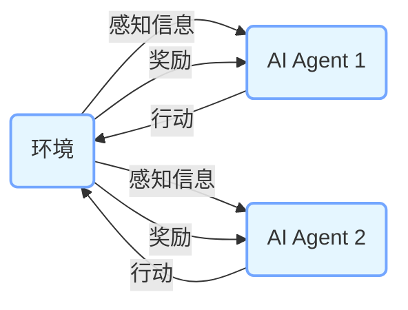

# AI Agent的多Agent博弈：策略学习与优化

> 关键词：AI Agent、多Agent博弈、策略学习、策略优化、博弈论

> 摘要：本文聚焦于AI Agent的多Agent博弈领域，深入探讨策略学习与优化的相关技术。首先介绍多Agent博弈的背景，包括其目的、预期读者等内容。接着阐述核心概念与联系，通过文本示意图和Mermaid流程图展示其原理和架构。详细讲解核心算法原理并给出Python源代码示例，同时介绍相关数学模型和公式。通过项目实战展示代码的实际应用和详细解读。分析多Agent博弈的实际应用场景，推荐学习所需的工具和资源，最后总结未来发展趋势与挑战，并提供常见问题解答和扩展阅读参考资料，旨在为读者全面呈现多Agent博弈中策略学习与优化的知识体系。

## 1. 背景介绍 
### 1.1 目的和范围
多Agent博弈在人工智能领域具有重要地位。其目的在于研究多个智能体在相互作用的环境中如何制定和优化策略，以实现自身的目标。在实际应用中，多Agent博弈可应用于多个领域，如机器人协作、网络安全、经济市场模拟等。本文章的范围将涵盖多Agent博弈的基本概念、核心算法、数学模型、实际案例以及未来发展趋势等方面，旨在为读者提供一个全面深入的多Agent博弈策略学习与优化的知识框架。

### 1.2 预期读者
本文预期读者包括对人工智能、机器学习、博弈论等领域感兴趣的科研人员、学生，以及从事相关领域开发的工程师。对于希望了解多Agent系统如何在复杂环境中进行决策和优化的人员，本文将提供有价值的参考。

### 1.3 文档结构概述
本文将按照以下结构展开：首先介绍多Agent博弈的背景信息，包括目的、预期读者等；接着阐述多Agent博弈的核心概念与联系，通过文本示意图和Mermaid流程图呈现其原理和架构；详细讲解核心算法原理并给出Python源代码示例，同时介绍相关数学模型和公式；通过项目实战展示代码的实际应用和详细解读；分析多Agent博弈的实际应用场景；推荐学习所需的工具和资源；最后总结未来发展趋势与挑战，并提供常见问题解答和扩展阅读参考资料。

### 1.4 术语表
#### 1.4.1 核心术语定义
- **AI Agent**：人工智能智能体，是一个能够感知环境并采取行动以实现特定目标的实体。
- **多Agent博弈**：多个AI Agent在相互作用的环境中进行决策和竞争的过程。
- **策略学习**：智能体通过学习来确定在不同情况下采取何种行动的过程。
- **策略优化**：对已有的策略进行改进，以提高智能体在博弈中的性能。

#### 1.4.2 相关概念解释
- **博弈论**：研究决策主体在相互作用时的策略选择和均衡问题的理论。
- **强化学习**：智能体通过与环境进行交互，根据环境反馈的奖励信号来学习最优策略的方法。

#### 1.4.3 缩略词列表
- **RL**：强化学习（Reinforcement Learning）
- **MDP**：马尔可夫决策过程（Markov Decision Process）

## 2. 核心概念与联系 

### 核心概念原理
在多Agent博弈中，每个AI Agent都有自己的目标和策略。这些智能体在一个共享的环境中相互作用，它们的决策会影响其他智能体的收益。博弈论为多Agent博弈提供了理论基础，通过分析不同智能体的策略组合和收益情况，来寻找最优的决策方案。

强化学习是多Agent博弈中常用的策略学习方法。智能体在环境中进行探索和试验，根据环境给予的奖励信号来调整自己的策略。通过不断的学习和优化，智能体可以逐渐找到在不同情况下的最优行动。

### 架构的文本示意图
多Agent博弈系统主要由多个AI Agent、环境和奖励机制组成。每个AI Agent都有自己的感知模块、决策模块和执行模块。感知模块用于获取环境信息，决策模块根据感知到的信息和自身的策略选择行动，执行模块将选择的行动应用到环境中。环境会根据智能体的行动产生相应的状态变化，并通过奖励机制给予智能体反馈。

### Mermaid流程图


## 3. 核心算法原理 & 具体操作步骤 

### 核心算法原理
在多Agent博弈中，常用的算法之一是Q学习算法。Q学习是一种无模型的强化学习算法，通过学习一个动作价值函数 $Q(s,a)$ 来确定在状态 $s$ 下采取动作 $a$ 的价值。智能体的目标是最大化长期累积奖励。

Q学习的更新公式为：
$$Q(s,a) \leftarrow Q(s,a) + \alpha [r + \gamma \max_{a'} Q(s',a') - Q(s,a)]$$
其中，$\alpha$ 是学习率，控制每次更新的步长；$\gamma$ 是折扣因子，用于权衡当前奖励和未来奖励的重要性；$r$ 是即时奖励；$s'$ 是下一个状态。

### Python源代码示例
```python
import numpy as np

# 定义Q学习类
class QLearningAgent:
    def __init__(self, num_states, num_actions, learning_rate=0.1, discount_factor=0.9):
        self.num_states = num_states
        self.num_actions = num_actions
        self.learning_rate = learning_rate
        self.discount_factor = discount_factor
        # 初始化Q表
        self.q_table = np.zeros((num_states, num_actions))

    def choose_action(self, state, epsilon=0.1):
        if np.random.uniform(0, 1) < epsilon:
            # 探索：随机选择动作
            action = np.random.choice(self.num_actions)
        else:
            # 利用：选择Q值最大的动作
            action = np.argmax(self.q_table[state, :])
        return action

    def update_q_table(self, state, action, reward, next_state):
        # 根据Q学习更新公式更新Q表
        max_q_next = np.max(self.q_table[next_state, :])
        self.q_table[state, action] += self.learning_rate * (reward + self.discount_factor * max_q_next - self.q_table[state, action])
```

### 具体操作步骤
1. **初始化**：初始化Q表，将所有的 $Q(s,a)$ 值设为0。
2. **选择动作**：智能体根据当前状态，使用 $\epsilon$-贪心策略选择动作。以 $\epsilon$ 的概率随机选择动作，以 $1 - \epsilon$ 的概率选择Q值最大的动作。
3. **执行动作**：智能体执行选择的动作，环境根据动作产生下一个状态和奖励。
4. **更新Q表**：根据Q学习的更新公式更新Q表。
5. **重复步骤2-4**：不断重复上述步骤，直到达到终止条件。

## 4. 数学模型和公式 & 详细讲解 & 举例说明 

### 数学模型
多Agent博弈可以用马尔可夫决策过程（MDP）来建模。一个MDP可以表示为一个五元组 $(S, A, P, R, \gamma)$，其中：
- $S$ 是状态空间，表示环境的所有可能状态。
- $A$ 是动作空间，表示智能体可以采取的所有可能动作。
- $P$ 是状态转移概率函数，表示在状态 $s$ 下采取动作 $a$ 转移到状态 $s'$ 的概率，即 $P(s'|s,a)$。
- $R$ 是奖励函数，表示在状态 $s$ 下采取动作 $a$ 转移到状态 $s'$ 时获得的奖励，即 $R(s,a,s')$。
- $\gamma$ 是折扣因子，用于权衡当前奖励和未来奖励的重要性。

### 公式详细讲解
在Q学习中，核心公式为：
$$Q(s,a) \leftarrow Q(s,a) + \alpha [r + \gamma \max_{a'} Q(s',a') - Q(s,a)]$$
- $Q(s,a)$ 表示在状态 $s$ 下采取动作 $a$ 的价值。
- $\alpha$ 是学习率，它控制每次更新的步长。如果 $\alpha$ 太大，学习过程可能会不稳定；如果 $\alpha$ 太小，学习速度会很慢。
- $\gamma$ 是折扣因子，它的取值范围是 $[0,1]$。$\gamma$ 越接近1，表示智能体更注重未来的奖励；$\gamma$ 越接近0，表示智能体更注重当前的奖励。
- $r$ 是即时奖励，是环境根据智能体的动作给予的反馈。
- $\max_{a'} Q(s',a')$ 表示在状态 $s'$ 下所有可能动作中Q值最大的那个动作的Q值。

### 举例说明
假设一个简单的多Agent博弈场景，有两个状态 $s_1$ 和 $s_2$，两个动作 $a_1$ 和 $a_2$。初始时，Q表如下：
| 状态 | $a_1$ | $a_2$ |
| ---- | ---- | ---- |
| $s_1$ | 0 | 0 |
| $s_2$ | 0 | 0 |

智能体在状态 $s_1$ 选择动作 $a_1$，环境反馈奖励 $r = 1$，并转移到状态 $s_2$。假设 $\alpha = 0.1$，$\gamma = 0.9$。

首先计算 $\max_{a'} Q(s_2,a')$，由于Q表中 $Q(s_2,a_1) = Q(s_2,a_2) = 0$，所以 $\max_{a'} Q(s_2,a') = 0$。

然后根据Q学习更新公式：
$$Q(s_1,a_1) \leftarrow Q(s_1,a_1) + 0.1 [1 + 0.9 \times 0 - Q(s_1,a_1)]$$
因为 $Q(s_1,a_1) = 0$，所以更新后的 $Q(s_1,a_1) = 0 + 0.1 \times (1 + 0 - 0) = 0.1$。

更新后的Q表如下：
| 状态 | $a_1$ | $a_2$ |
| ---- | ---- | ---- |
| $s_1$ | 0.1 | 0 |
| $s_2$ | 0 | 0 |

## 5. 项目实战：代码实际案例和详细解释说明 

### 5.1  开发环境搭建
- **Python环境**：建议使用Python 3.6及以上版本。可以从Python官方网站（https://www.python.org/downloads/） 下载安装。
- **相关库**：需要安装 `numpy` 库，用于数值计算。可以使用以下命令进行安装：
```sh
pip install numpy
```

### 5.2  源代码详细实现和代码解读
以下是一个简单的多Agent博弈的项目实战代码示例，模拟两个智能体在一个简单的环境中进行博弈。

```python
import numpy as np

# 定义Q学习类
class QLearningAgent:
    def __init__(self, num_states, num_actions, learning_rate=0.1, discount_factor=0.9):
        self.num_states = num_states
        self.num_actions = num_actions
        self.learning_rate = learning_rate
        self.discount_factor = discount_factor
        # 初始化Q表
        self.q_table = np.zeros((num_states, num_actions))

    def choose_action(self, state, epsilon=0.1):
        if np.random.uniform(0, 1) < epsilon:
            # 探索：随机选择动作
            action = np.random.choice(self.num_actions)
        else:
            # 利用：选择Q值最大的动作
            action = np.argmax(self.q_table[state, :])
        return action

    def update_q_table(self, state, action, reward, next_state):
        # 根据Q学习更新公式更新Q表
        max_q_next = np.max(self.q_table[next_state, :])
        self.q_table[state, action] += self.learning_rate * (reward + self.discount_factor * max_q_next - self.q_table[state, action])

# 定义环境类
class Environment:
    def __init__(self):
        self.num_states = 2
        self.num_actions = 2
        self.current_state = np.random.randint(0, self.num_states)

    def step(self, action1, action2):
        # 简单的奖励规则
        if action1 == 0 and action2 == 0:
            reward1 = 1
            reward2 = 1
        elif action1 == 0 and action2 == 1:
            reward1 = -1
            reward2 = 2
        elif action1 == 1 and action2 == 0:
            reward1 = 2
            reward2 = -1
        else:
            reward1 = -2
            reward2 = -2

        # 随机转移到下一个状态
        next_state = np.random.randint(0, self.num_states)
        return next_state, reward1, reward2

# 主函数
def main():
    # 初始化环境
    env = Environment()
    # 初始化两个智能体
    agent1 = QLearningAgent(env.num_states, env.num_actions)
    agent2 = QLearningAgent(env.num_states, env.num_actions)

    num_episodes = 1000
    for episode in range(num_episodes):
        state = env.current_state
        for step in range(10):
            # 两个智能体选择动作
            action1 = agent1.choose_action(state)
            action2 = agent2.choose_action(state)

            # 执行动作，获取下一个状态和奖励
            next_state, reward1, reward2 = env.step(action1, action2)

            # 更新两个智能体的Q表
            agent1.update_q_table(state, action1, reward1, next_state)
            agent2.update_q_table(state, action2, reward2, next_state)

            state = next_state

        if episode % 100 == 0:
            print(f"Episode {episode}: Agent 1 Q-table: {agent1.q_table}, Agent 2 Q-table: {agent2.q_table}")

if __name__ == "__main__":
    main()
```

### 5.3  代码解读与分析
- **QLearningAgent类**：实现了Q学习算法的核心功能，包括动作选择和Q表更新。
- **Environment类**：定义了环境的状态空间、动作空间和奖励规则。在 `step` 方法中，根据两个智能体的动作计算奖励，并随机转移到下一个状态。
- **main函数**：初始化环境和两个智能体，进行多轮训练。在每一轮训练中，两个智能体选择动作，执行动作并更新Q表。每100轮打印一次两个智能体的Q表，以便观察学习过程。

通过这个项目实战，我们可以看到两个智能体如何在相互作用的环境中学习和优化自己的策略。

## 6. 实际应用场景 
### 机器人协作
在机器人协作场景中，多个机器人可以看作是多个AI Agent。它们需要在一个共享的环境中完成任务，如搬运货物、搜索救援等。通过多Agent博弈的策略学习与优化，机器人可以根据其他机器人的行为和环境信息，选择最优的行动方案，提高协作效率。

### 网络安全
在网络安全领域，多Agent博弈可以用于入侵检测和防御。不同的安全智能体可以监测网络中的不同节点，通过博弈来确定最佳的防御策略。例如，当检测到网络攻击时，智能体可以根据攻击的类型和强度，选择合适的防御措施，如封锁端口、拦截数据包等。

### 经济市场模拟
在经济市场中，不同的参与者（如企业、投资者等）可以看作是AI Agent。它们在市场环境中进行决策，如定价、投资等。通过多Agent博弈的方法，可以模拟市场参与者的行为，预测市场趋势，为企业和投资者提供决策支持。

## 7. 工具和资源推荐
### 7.1 学习资源推荐
#### 7.1.1 书籍推荐
- 《强化学习：原理与Python实现》：全面介绍了强化学习的基本原理和算法，包括Q学习、深度Q网络等，同时提供了Python代码示例。
- 《博弈论教程》：系统地阐述了博弈论的基本概念、模型和分析方法，是学习多Agent博弈的经典教材。

#### 7.1.2 在线课程
- Coursera上的“Reinforcement Learning Specialization”：由知名教授授课，深入讲解强化学习的理论和实践。
- edX上的“Game Theory”：介绍博弈论的基本原理和应用，适合初学者学习。

#### 7.1.3 技术博客和网站
- OpenAI Blog：提供人工智能领域的最新研究成果和技术动态，包括多Agent博弈的相关内容。
- ArXiv.org：可以搜索到大量关于多Agent博弈和强化学习的学术论文。

### 7.2 开发工具框架推荐
#### 7.2.1 IDE和编辑器
- PyCharm：功能强大的Python集成开发环境，提供代码编辑、调试、版本控制等功能。
- Visual Studio Code：轻量级的代码编辑器，支持多种编程语言，有丰富的插件可以扩展功能。

#### 7.2.2 调试和性能分析工具
- PDB：Python自带的调试工具，可以帮助开发者查找代码中的错误。
- cProfile：Python的性能分析工具，可以分析代码的运行时间和函数调用情况。

#### 7.2.3 相关框架和库
- OpenAI Gym：提供了丰富的强化学习环境，可以用于测试和验证强化学习算法。
- Stable Baselines3：基于PyTorch的强化学习库，提供了多种预训练的强化学习算法。

### 7.3 相关论文著作推荐
#### 7.3.1 经典论文
- “Q-learning” by Watkins and Dayan：Q学习算法的经典论文，详细介绍了Q学习的原理和实现。
- “Multi-Agent Systems: A Modern Approach to Distributed Artificial Intelligence”：对多Agent系统进行了全面的介绍，包括多Agent博弈的相关理论和方法。

#### 7.3.2 最新研究成果
- 可以在顶级学术会议（如NeurIPS、ICML等）和期刊（如Journal of Artificial Intelligence Research）上查找关于多Agent博弈的最新研究成果。

#### 7.3.3 应用案例分析
- 可以在ACM Transactions on Intelligent Systems and Technology等期刊上找到多Agent博弈在不同领域的应用案例分析，了解实际应用中的技术和方法。

## 8. 总结：未来发展趋势与挑战
### 未来发展趋势
- **深度强化学习的应用**：随着深度学习技术的不断发展，深度强化学习将在多Agent博弈中得到更广泛的应用。通过将深度学习与强化学习相结合，可以处理更复杂的环境和任务，提高智能体的决策能力。
- **多智能体协作与竞争的融合**：未来的多Agent博弈将更加注重智能体之间的协作与竞争的融合。智能体不仅要考虑自身的利益，还要考虑整个系统的利益，实现共赢。
- **跨领域应用**：多Agent博弈将在更多领域得到应用，如医疗、交通、能源等。通过多Agent博弈的方法，可以优化这些领域的资源分配和决策过程，提高效率和效益。

### 挑战
- **计算复杂度**：多Agent博弈的计算复杂度通常较高，特别是在处理大规模的状态空间和动作空间时。如何降低计算复杂度，提高算法的效率是一个重要的挑战。
- **智能体间的通信与协调**：在多Agent系统中，智能体之间的通信与协调是一个关键问题。如何设计有效的通信协议和协调机制，确保智能体之间能够高效地协作是一个挑战。
- **环境不确定性**：实际环境中存在很多不确定性因素，如噪声、干扰等。如何使智能体在不确定的环境中学习和优化策略，提高系统的鲁棒性是一个挑战。

## 9. 附录：常见问题与解答
### 问题1：多Agent博弈和单Agent强化学习有什么区别？
答：单Agent强化学习中只有一个智能体与环境进行交互，智能体的决策只考虑自身的利益和环境的反馈。而在多Agent博弈中，有多个智能体在相互作用的环境中进行决策，每个智能体的决策不仅会受到环境的影响，还会受到其他智能体的影响。因此，多Agent博弈需要考虑智能体之间的策略互动和竞争。

### 问题2：Q学习算法在多Agent博弈中存在哪些局限性？
答：Q学习算法在多Agent博弈中存在一些局限性。首先，Q学习算法假设环境是静态的，而在多Agent博弈中，环境会随着其他智能体的行动而变化，这可能导致Q学习算法的性能下降。其次，Q学习算法在处理大规模的状态空间和动作空间时，计算复杂度较高，效率较低。

### 问题3：如何选择合适的学习率和折扣因子？
答：学习率和折扣因子的选择需要根据具体的问题和环境进行调整。一般来说，学习率 $\alpha$ 的取值范围在 $[0.1, 0.5]$ 之间，折扣因子 $\gamma$ 的取值范围在 $[0.9, 0.99]$ 之间。可以通过实验的方法，尝试不同的学习率和折扣因子，选择性能最优的参数组合。

## 10. 扩展阅读 & 参考资料
- Sutton, R. S., & Barto, A. G. (2018). Reinforcement learning: An introduction. MIT press.
- Osborne, M. J., & Rubinstein, A. (1994). A course in game theory. MIT press.
- OpenAI Gym官方文档：https://gym.openai.com/docs/
- Stable Baselines3官方文档：https://stable-baselines3.readthedocs.io/en/master/