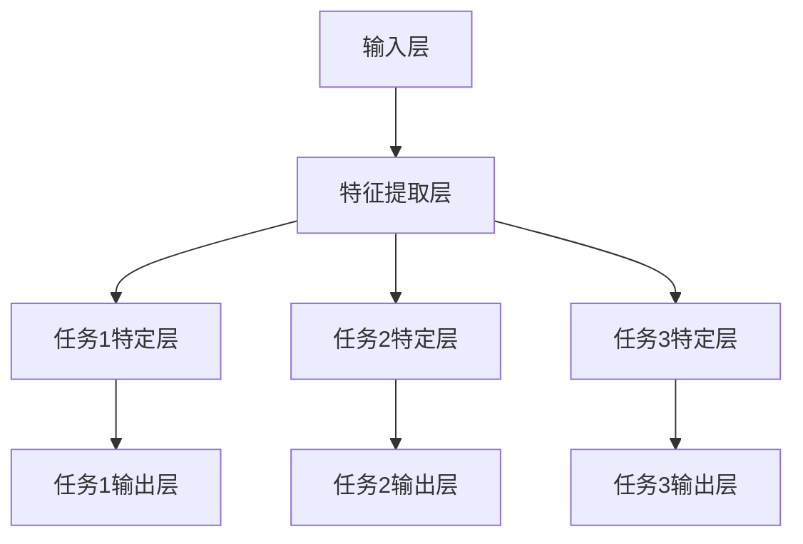

# AI Agent的多任务学习：构建通用智能助手

> 关键词：AI Agent、多任务学习、通用智能助手、任务调度、模型融合

> 摘要：本文聚焦于AI Agent的多任务学习，旨在探讨如何构建通用智能助手。首先介绍了相关背景知识，包括目的、预期读者、文档结构等内容。接着深入阐述了核心概念与联系，通过文本示意图和Mermaid流程图进行清晰展示。详细讲解了核心算法原理及具体操作步骤，并结合Python源代码进行说明。对涉及的数学模型和公式展开深入剖析，辅以举例说明。通过项目实战部分，给出代码实际案例并进行详细解释。探讨了实际应用场景，推荐了相关工具和资源。最后总结了未来发展趋势与挑战，提供常见问题解答和扩展阅读参考资料，为构建通用智能助手提供全面且深入的技术指导。

## 1. 背景介绍 
### 1.1 目的和范围
在当今数字化时代，人们对智能助手的需求日益增长，期望智能助手能够处理多种不同类型的任务，如文本生成、图像识别、语音交互等。AI Agent的多任务学习旨在让智能体具备同时处理多个任务的能力，构建出通用智能助手，以满足用户多样化的需求。本文的范围涵盖了AI Agent多任务学习的基本概念、算法原理、数学模型、项目实战以及实际应用场景等多个方面，旨在为读者全面呈现构建通用智能助手的技术路线和方法。

### 1.2 预期读者
本文预期读者包括人工智能领域的研究人员、开发者、软件架构师、对AI Agent和多任务学习感兴趣的技术爱好者等。无论是希望深入了解相关理论知识的科研人员，还是想要在实际项目中应用这些技术的开发者，都能从本文中获得有价值的信息和指导。

### 1.3 文档结构概述
本文将按照以下结构展开：首先介绍背景知识，包括目的、预期读者和文档结构等内容；接着阐述核心概念与联系，通过文本示意图和Mermaid流程图进行清晰展示；详细讲解核心算法原理及具体操作步骤，并结合Python源代码进行说明；对涉及的数学模型和公式展开深入剖析，辅以举例说明；通过项目实战部分，给出代码实际案例并进行详细解释；探讨实际应用场景；推荐相关工具和资源；最后总结未来发展趋势与挑战，提供常见问题解答和扩展阅读参考资料。

### 1.4 术语表
#### 1.4.1 核心术语定义
- **AI Agent**：即人工智能智能体，是一种能够感知环境、进行决策并采取行动以实现特定目标的智能实体。
- **多任务学习**：指让模型同时学习多个相关任务，通过共享参数等方式，提高模型在各个任务上的性能。
- **通用智能助手**：具备处理多种不同类型任务的能力，能够满足用户多样化需求的智能助手。

#### 1.4.2 相关概念解释
- **任务调度**：在多任务学习中，任务调度负责确定各个任务的执行顺序和资源分配，以确保系统的高效运行。
- **模型融合**：将多个不同的模型进行整合，综合利用它们的优势，提高整体性能。

#### 1.4.3 缩略词列表
- **CNN**：Convolutional Neural Network，卷积神经网络
- **RNN**：Recurrent Neural Network，循环神经网络
- **LSTM**：Long Short - Term Memory，长短期记忆网络

## 2. 核心概念与联系 

### 核心概念原理
AI Agent的多任务学习核心在于让智能体能够同时处理多个不同类型的任务。传统的机器学习模型通常是针对单一任务进行训练的，而多任务学习通过共享模型的部分参数，使得模型能够在多个任务之间进行知识迁移，从而提高模型的泛化能力和效率。

例如，在一个智能助手系统中，可能需要同时处理文本分类、情感分析和命名实体识别等任务。通过多任务学习，模型可以在这些任务之间共享底层的特征表示，避免了为每个任务单独训练模型所带来的计算资源浪费和训练时间过长的问题。

### 架构的文本示意图
一个典型的AI Agent多任务学习架构可以描述如下：

输入层接收来自不同任务的输入数据，这些数据可以是文本、图像、语音等不同类型。然后经过特征提取层，提取出数据的特征表示。特征提取层可以是共享的，也可以是部分共享的，这取决于任务之间的相关性。接下来，每个任务有自己的特定层，用于对特征进行进一步的处理和转换，以适应该任务的需求。最后，每个任务有自己的输出层，输出任务的预测结果。

### Mermaid流程图


## 3. 核心算法原理 & 具体操作步骤 

### 算法原理讲解
在AI Agent的多任务学习中，一种常见的算法是基于损失函数的多任务学习算法。该算法的核心思想是将多个任务的损失函数进行加权求和，得到一个总的损失函数，然后通过优化这个总的损失函数来训练模型。

假设我们有 $n$ 个任务，第 $i$ 个任务的损失函数为 $L_i$，对应的权重为 $w_i$，则总的损失函数 $L$ 可以表示为：

$L = \sum_{i = 1}^{n} w_i L_i$

在训练过程中，我们通过梯度下降等优化算法来最小化总的损失函数，从而更新模型的参数。

### Python源代码详细阐述
以下是一个简单的基于PyTorch的多任务学习示例代码：

```python
import torch
import torch.nn as nn
import torch.optim as optim

# 定义一个简单的多任务模型
class MultiTaskModel(nn.Module):
    def __init__(self):
        super(MultiTaskModel, self).__init__()
        # 共享的特征提取层
        self.shared_layer = nn.Linear(10, 20)
        # 任务1的特定层
        self.task1_layer = nn.Linear(20, 5)
        # 任务2的特定层
        self.task2_layer = nn.Linear(20, 3)

    def forward(self, x):
        # 特征提取
        shared_features = self.shared_layer(x)
        # 任务1的输出
        task1_output = self.task1_layer(shared_features)
        # 任务2的输出
        task2_output = self.task2_layer(shared_features)
        return task1_output, task2_output

# 初始化模型
model = MultiTaskModel()

# 定义损失函数和优化器
criterion1 = nn.CrossEntropyLoss()
criterion2 = nn.CrossEntropyLoss()
optimizer = optim.Adam(model.parameters(), lr=0.001)

# 模拟训练数据
num_samples = 100
input_data = torch.randn(num_samples, 10)
task1_labels = torch.randint(0, 5, (num_samples,))
task2_labels = torch.randint(0, 3, (num_samples,))

# 训练模型
num_epochs = 10
for epoch in range(num_epochs):
    optimizer.zero_grad()
    task1_output, task2_output = model(input_data)
    loss1 = criterion1(task1_output, task1_labels)
    loss2 = criterion2(task2_output, task2_labels)
    # 加权求和的总损失
    total_loss = loss1 + loss2
    total_loss.backward()
    optimizer.step()
    print(f'Epoch {epoch + 1}/{num_epochs}, Total Loss: {total_loss.item()}')
```

### 具体操作步骤
1. **数据准备**：收集和整理不同任务的训练数据，确保数据的质量和多样性。
2. **模型定义**：根据任务的需求，定义一个包含共享层和任务特定层的多任务模型。
3. **损失函数和优化器选择**：选择合适的损失函数和优化器，如交叉熵损失函数和Adam优化器。
4. **训练模型**：在训练过程中，计算每个任务的损失函数，然后将它们加权求和得到总损失函数，通过优化总损失函数来更新模型的参数。
5. **模型评估**：使用测试数据对训练好的模型进行评估，检查模型在各个任务上的性能。

## 4. 数学模型和公式 & 详细讲解 & 举例说明 

### 损失函数的数学模型
在多任务学习中，常用的损失函数有均方误差损失（MSE）、交叉熵损失（Cross - Entropy Loss）等。

#### 均方误差损失
均方误差损失常用于回归任务，其数学公式为：

$$MSE = \frac{1}{n} \sum_{i = 1}^{n} (y_i - \hat{y}_i)^2$$

其中，$n$ 是样本数量，$y_i$ 是真实值，$\hat{y}_i$ 是预测值。

#### 交叉熵损失
交叉熵损失常用于分类任务，其数学公式为：

$$CE = - \sum_{i = 1}^{n} y_i \log(\hat{y}_i)$$

其中，$n$ 是类别数量，$y_i$ 是真实标签的概率分布，$\hat{y}_i$ 是预测的概率分布。

### 加权求和的总损失函数
如前面所述，总损失函数是各个任务损失函数的加权求和：

$$L = \sum_{i = 1}^{n} w_i L_i$$

其中，$w_i$ 是第 $i$ 个任务的权重，$L_i$ 是第 $i$ 个任务的损失函数。

### 举例说明
假设我们有两个任务，任务1是回归任务，使用均方误差损失，任务2是分类任务，使用交叉熵损失。任务1的权重为0.6，任务2的权重为0.4。

任务1的损失函数 $L_1 = MSE$，任务2的损失函数 $L_2 = CE$。

则总损失函数 $L = 0.6L_1 + 0.4L_2$

在训练过程中，我们通过最小化 $L$ 来更新模型的参数。

## 5. 项目实战：代码实际案例和详细解释说明 

### 5.1  开发环境搭建
- **操作系统**：推荐使用Linux或macOS，也可以使用Windows。
- **Python环境**：建议使用Python 3.7及以上版本。
- **深度学习框架**：使用PyTorch，安装命令如下：
```bash
pip install torch torchvision
```
- **其他依赖库**：根据具体项目需求安装相关的库，如NumPy、Pandas等。

### 5.2  源代码详细实现和代码解读
以下是一个更完整的多任务学习项目示例，该项目同时处理文本分类和情感分析两个任务。

```python
import torch
import torch.nn as nn
import torch.optim as optim
from torch.utils.data import Dataset, DataLoader
import numpy as np
import pandas as pd

# 定义数据集类
class MultiTaskDataset(Dataset):
    def __init__(self, text_data, category_labels, sentiment_labels):
        self.text_data = text_data
        self.category_labels = category_labels
        self.sentiment_labels = sentiment_labels

    def __len__(self):
        return len(self.text_data)

    def __getitem__(self, idx):
        text = self.text_data[idx]
        category_label = self.category_labels[idx]
        sentiment_label = self.sentiment_labels[idx]
        return text, category_label, sentiment_label

# 定义多任务模型
class MultiTaskTextModel(nn.Module):
    def __init__(self, vocab_size, embedding_dim, hidden_dim, num_categories, num_sentiments):
        super(MultiTaskTextModel, self).__init__()
        # 嵌入层
        self.embedding = nn.Embedding(vocab_size, embedding_dim)
        # 循环层
        self.lstm = nn.LSTM(embedding_dim, hidden_dim, batch_first=True)
        # 分类任务的输出层
        self.category_layer = nn.Linear(hidden_dim, num_categories)
        # 情感分析任务的输出层
        self.sentiment_layer = nn.Linear(hidden_dim, num_sentiments)

    def forward(self, x):
        embedded = self.embedding(x)
        lstm_output, _ = self.lstm(embedded)
        lstm_output = lstm_output[:, -1, :]
        category_output = self.category_layer(lstm_output)
        sentiment_output = self.sentiment_layer(lstm_output)
        return category_output, sentiment_output

# 数据预处理
def preprocess_data(file_path):
    data = pd.read_csv(file_path)
    text_data = data['text'].values
    category_labels = data['category'].values
    sentiment_labels = data['sentiment'].values

    # 简单的文本编码
    vocab = {}
    index = 0
    encoded_text_data = []
    for text in text_data:
        encoded_text = []
        for word in text.split():
            if word not in vocab:
                vocab[word] = index
                index += 1
            encoded_text.append(vocab[word])
        encoded_text_data.append(encoded_text)

    encoded_text_data = np.array(encoded_text_data)
    return encoded_text_data, category_labels, sentiment_labels

# 主函数
def main():
    # 数据预处理
    file_path = 'data.csv'
    text_data, category_labels, sentiment_labels = preprocess_data(file_path)

    # 创建数据集和数据加载器
    dataset = MultiTaskDataset(text_data, category_labels, sentiment_labels)
    dataloader = DataLoader(dataset, batch_size=32, shuffle=True)

    # 初始化模型
    vocab_size = len(set([word for text in text_data for word in text]))
    embedding_dim = 100
    hidden_dim = 128
    num_categories = len(set(category_labels))
    num_sentiments = len(set(sentiment_labels))
    model = MultiTaskTextModel(vocab_size, embedding_dim, hidden_dim, num_categories, num_sentiments)

    # 定义损失函数和优化器
    criterion1 = nn.CrossEntropyLoss()
    criterion2 = nn.CrossEntropyLoss()
    optimizer = optim.Adam(model.parameters(), lr=0.001)

    # 训练模型
    num_epochs = 10
    for epoch in range(num_epochs):
        running_loss = 0.0
        for texts, category_labels, sentiment_labels in dataloader:
            optimizer.zero_grad()
            category_output, sentiment_output = model(texts)
            loss1 = criterion1(category_output, category_labels)
            loss2 = criterion2(sentiment_output, sentiment_labels)
            total_loss = loss1 + loss2
            total_loss.backward()
            optimizer.step()
            running_loss += total_loss.item()
        print(f'Epoch {epoch + 1}/{num_epochs}, Loss: {running_loss / len(dataloader)}')

if __name__ == '__main__':
    main()
```

### 5.3  代码解读与分析
- **数据集类**：`MultiTaskDataset` 类用于封装数据集，方便数据的加载和处理。
- **多任务模型**：`MultiTaskTextModel` 类定义了一个基于LSTM的多任务模型，包含嵌入层、循环层和两个任务的输出层。
- **数据预处理**：`preprocess_data` 函数用于对文本数据进行编码，将文本转换为数字序列。
- **训练过程**：在训练过程中，计算分类任务和情感分析任务的损失函数，然后将它们相加得到总损失函数，通过优化总损失函数来更新模型的参数。

## 6. 实际应用场景 
### 智能客服系统
在智能客服系统中，AI Agent需要同时处理用户的问题分类、意图识别和情感分析等多个任务。通过多任务学习，智能客服可以更准确地理解用户的需求，提供更个性化的服务。

### 智能家居控制
在智能家居系统中，AI Agent需要同时处理设备状态监测、用户语音指令识别和场景控制等多个任务。多任务学习可以提高智能家居系统的响应速度和智能化程度。

### 自动驾驶汽车
在自动驾驶汽车中，AI Agent需要同时处理目标检测、路径规划、交通信号识别等多个任务。多任务学习可以提高自动驾驶汽车的安全性和可靠性。

## 7. 工具和资源推荐
### 7.1 学习资源推荐
#### 7.1.1 书籍推荐
- 《深度学习》（Deep Learning）：由Ian Goodfellow、Yoshua Bengio和Aaron Courville所著，是深度学习领域的经典教材。
- 《Python深度学习》（Deep Learning with Python）：由Francois Chollet所著，详细介绍了如何使用Python和Keras进行深度学习开发。

#### 7.1.2 在线课程
- Coursera上的“深度学习专项课程”（Deep Learning Specialization）：由Andrew Ng教授授课，内容涵盖深度学习的各个方面。
- edX上的“人工智能基础”（Fundamentals of Artificial Intelligence）：介绍了人工智能的基本概念和方法。

#### 7.1.3 技术博客和网站
- Medium上的Towards Data Science：提供了大量关于数据科学、机器学习和人工智能的技术文章。
- AI开源社区GitHub：可以找到许多开源的AI项目和代码示例。

### 7.2 开发工具框架推荐
#### 7.2.1 IDE和编辑器
- PyCharm：一款功能强大的Python集成开发环境，适合Python开发。
- Visual Studio Code：轻量级的代码编辑器，支持多种编程语言和插件扩展。

#### 7.2.2 调试和性能分析工具
- TensorBoard：用于可视化深度学习模型的训练过程和性能指标。
- PyTorch Profiler：用于分析PyTorch模型的性能瓶颈。

#### 7.2.3 相关框架和库
- PyTorch：一个开源的深度学习框架，具有强大的自动求导功能和丰富的模型库。
- Hugging Face Transformers：提供了预训练的语言模型和相关工具，方便进行自然语言处理任务。

### 7.3 相关论文著作推荐
#### 7.3.1 经典论文
- “Multi-Task Learning” by Rich Caruana：该论文是多任务学习领域的经典之作，介绍了多任务学习的基本概念和方法。
- “Attention Is All You Need” by Ashish Vaswani et al.：提出了Transformer模型，为自然语言处理领域带来了重大突破。

#### 7.3.2 最新研究成果
- 关注顶级学术会议如NeurIPS、ICML、ACL等的最新论文，了解多任务学习领域的最新研究进展。

#### 7.3.3 应用案例分析
- 查看相关的行业报告和案例分析，了解多任务学习在实际应用中的效果和经验。

## 8. 总结：未来发展趋势与挑战
### 未来发展趋势
- **更强的通用性**：未来的通用智能助手将能够处理更多类型的任务，涵盖更广泛的领域，如医疗、金融、教育等。
- **更智能的任务调度**：任务调度算法将更加智能，能够根据任务的优先级、资源需求和实时状态进行动态调整，提高系统的效率和性能。
- **与人类的深度交互**：通用智能助手将能够更好地理解人类的语言、情感和意图，实现更加自然和高效的人机交互。

### 挑战
- **数据的多样性和质量**：多任务学习需要大量的多样化数据，数据的质量和标注的准确性对模型的性能有很大影响。
- **模型的可解释性**：随着模型的复杂度增加，模型的可解释性变得越来越重要，如何解释多任务学习模型的决策过程是一个挑战。
- **计算资源的需求**：多任务学习通常需要更多的计算资源，如何在有限的资源下提高模型的训练和推理效率是一个亟待解决的问题。

## 9. 附录：常见问题与解答
### 问题1：多任务学习中任务的权重如何确定？
答：任务的权重可以根据任务的重要性、数据量、任务的难度等因素来确定。可以通过手动设置权重，也可以使用自适应的方法，如基于任务的损失函数值动态调整权重。

### 问题2：多任务学习模型的训练时间会比单任务模型长吗？
答：一般情况下，多任务学习模型的训练时间会比单任务模型长，因为需要同时处理多个任务的损失函数。但是，由于多任务学习可以共享模型的部分参数，在某些情况下，也可能会减少训练时间。

### 问题3：多任务学习模型的性能一定比单任务模型好吗？
答：不一定。多任务学习模型的性能取决于任务之间的相关性、数据的质量和数量、模型的架构等因素。在任务之间相关性较强的情况下，多任务学习模型可能会比单任务模型表现更好；但在任务之间相关性较弱的情况下，单任务模型可能会更优。

## 10. 扩展阅读 & 参考资料
- Goodfellow, I., Bengio, Y., & Courville, A. (2016). Deep Learning. MIT Press.
- Chollet, F. (2018). Deep Learning with Python. Manning Publications.
- Caruana, R. (1997). Multi-Task Learning. Machine Learning, 28(1), 41 - 75.
- Vaswani, A., Shazeer, N., Parmar, N., et al. (2017). Attention Is All You Need. Advances in Neural Information Processing Systems.
- 相关的学术论文、技术博客和开源项目代码等。