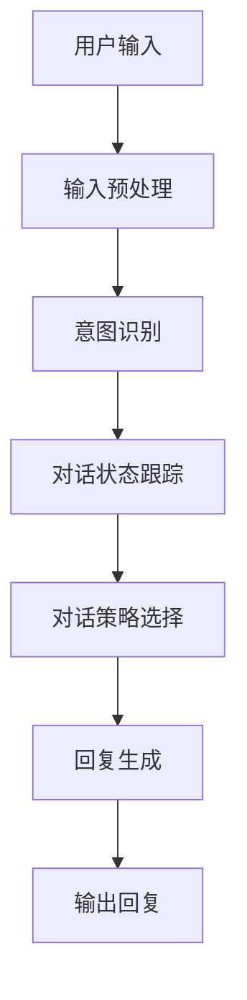

# AI Agent的对话管理策略与实现

> 关键词：AI Agent、对话管理、策略、实现、对话状态、对话策略、对话历史

> 摘要：本文围绕AI Agent的对话管理策略与实现展开深入探讨。首先介绍了AI Agent对话管理的背景，包括目的、预期读者等内容。接着阐述了对话管理的核心概念与联系，详细讲解了其原理和架构，并通过Mermaid流程图进行直观展示。核心算法原理部分使用Python源代码详细阐述，同时给出相关数学模型和公式并举例说明。在项目实战中，给出开发环境搭建步骤、源代码详细实现及解读。还探讨了AI Agent对话管理的实际应用场景，推荐了相关工具和资源。最后总结了未来发展趋势与挑战，提供常见问题与解答以及扩展阅读和参考资料，旨在为读者全面深入地了解AI Agent的对话管理提供系统的知识和实践指导。

## 1. 背景介绍 
### 1.1 目的和范围
随着人工智能技术的飞速发展，AI Agent在各个领域的应用越来越广泛，如智能客服、智能助手等。对话管理作为AI Agent的核心功能之一，负责管理对话的流程、理解用户意图、生成合适的回复，对于提升AI Agent的交互效果和用户体验至关重要。本文的目的在于深入探讨AI Agent的对话管理策略与实现方法，涵盖对话管理的基本概念、核心算法、数学模型、项目实战、应用场景等多个方面，旨在为相关研究人员和开发者提供全面而系统的知识和技术指导。

### 1.2 预期读者
本文预期读者包括对人工智能、自然语言处理、智能对话系统感兴趣的研究人员、开发者、学生等。对于希望深入了解AI Agent对话管理技术的专业人士，本文将提供深入的技术细节和实践案例；对于初学者，本文也将从基础概念出发，逐步引导读者理解和掌握相关知识和技术。

### 1.3 文档结构概述
本文将按照以下结构进行组织：首先介绍背景信息，包括目的、预期读者和文档结构概述等；接着阐述对话管理的核心概念与联系，包括相关原理和架构；然后详细讲解核心算法原理和具体操作步骤，并给出数学模型和公式；通过项目实战部分展示代码实际案例和详细解释说明；探讨实际应用场景；推荐相关工具和资源；总结未来发展趋势与挑战；提供常见问题与解答以及扩展阅读和参考资料。

### 1.4 术语表
#### 1.4.1 核心术语定义
- **AI Agent（人工智能代理）**：能够感知环境、进行推理和决策，并采取行动以实现特定目标的智能实体。
- **对话管理**：负责管理对话的流程、理解用户意图、维护对话状态，并根据对话状态生成合适的回复的过程。
- **对话状态**：表示对话在某一时刻的状态信息，包括用户意图、上下文信息、对话历史等。
- **对话策略**：根据对话状态选择合适的回复动作的规则或方法。
- **对话历史**：记录对话过程中用户和AI Agent的交互信息。

#### 1.4.2 相关概念解释
- **自然语言处理（NLP）**：涉及计算机与人类语言之间的交互，包括语言理解、语言生成等任务，是AI Agent对话管理的重要基础。
- **机器学习（ML）**：通过数据训练模型，使模型能够自动学习和优化，在对话管理中可用于意图识别、对话策略学习等。
- **深度学习（DL）**：机器学习的一个分支，通过深度神经网络处理复杂的数据，在自然语言处理和对话管理中取得了显著的成果。

#### 1.4.3 缩略词列表
- **NLP**：Natural Language Processing（自然语言处理）
- **ML**：Machine Learning（机器学习）
- **DL**：Deep Learning（深度学习）
- **RNN**：Recurrent Neural Network（循环神经网络）
- **LSTM**：Long Short - Term Memory（长短期记忆网络）
- **GRU**：Gated Recurrent Unit（门控循环单元）

## 2. 核心概念与联系 

### 核心概念原理
AI Agent的对话管理主要包括对话状态跟踪、意图识别、对话策略选择和回复生成四个主要环节。

#### 对话状态跟踪
对话状态跟踪的目的是维护对话在不同时刻的状态信息。对话状态可以包括多个方面，如用户的当前意图、已经提及的实体、对话的上下文信息等。通过跟踪对话状态，AI Agent能够理解对话的进展和用户的需求，为后续的意图识别和对话策略选择提供依据。

#### 意图识别
意图识别是指分析用户输入的文本，确定用户的意图。用户的意图可以是请求信息、完成任务、表达情感等多种类型。准确的意图识别是对话管理的关键，它直接影响到AI Agent的回复决策。

#### 对话策略选择
对话策略选择根据当前的对话状态和用户意图，选择合适的回复动作。对话策略可以是基于规则的，也可以是基于机器学习的。基于规则的策略通过预先定义的规则来选择回复动作，而基于机器学习的策略则通过训练模型来学习最优的回复策略。

#### 回复生成
回复生成根据选择的对话策略，生成具体的回复文本。回复文本需要符合自然语言的表达习惯，并且能够准确地满足用户的需求。

### 架构的文本示意图
AI Agent的对话管理架构可以分为以下几个层次：

- **输入层**：接收用户的输入文本，对输入文本进行预处理，如分词、词性标注等。
- **意图识别层**：分析用户输入的意图，确定用户的需求。
- **对话状态跟踪层**：维护对话的状态信息，根据用户意图和历史对话更新对话状态。
- **对话策略选择层**：根据当前对话状态和用户意图，选择合适的回复策略。
- **回复生成层**：根据选择的回复策略，生成具体的回复文本。
- **输出层**：将生成的回复文本返回给用户。

### Mermaid流程图


## 3. 核心算法原理 & 具体操作步骤 

### 意图识别算法原理
意图识别可以使用多种机器学习和深度学习算法，这里以基于深度学习的循环神经网络（RNN）为例进行讲解。

#### 原理
RNN是一种能够处理序列数据的神经网络，它通过在网络中引入循环结构，使得网络能够记忆之前的输入信息。在意图识别中，将用户输入的文本看作一个词序列，RNN可以对这个序列进行处理，提取文本的语义信息，从而判断用户的意图。

#### Python源代码实现
```python
import torch
import torch.nn as nn
import torch.optim as optim
from torch.utils.data import Dataset, DataLoader

# 定义数据集类
class IntentDataset(Dataset):
    def __init__(self, texts, labels):
        self.texts = texts
        self.labels = labels

    def __len__(self):
        return len(self.texts)

    def __getitem__(self, idx):
        text = self.texts[idx]
        label = self.labels[idx]
        return text, label

# 定义RNN模型
class RNNIntentClassifier(nn.Module):
    def __init__(self, vocab_size, embedding_dim, hidden_dim, output_dim):
        super(RNNIntentClassifier, self).__init__()
        self.embedding = nn.Embedding(vocab_size, embedding_dim)
        self.rnn = nn.RNN(embedding_dim, hidden_dim)
        self.fc = nn.Linear(hidden_dim, output_dim)

    def forward(self, x):
        embedded = self.embedding(x)
        output, hidden = self.rnn(embedded)
        hidden = hidden.squeeze(0)
        out = self.fc(hidden)
        return out

# 训练模型
def train_model(model, dataloader, criterion, optimizer, epochs):
    model.train()
    for epoch in range(epochs):
        total_loss = 0
        for texts, labels in dataloader:
            optimizer.zero_grad()
            outputs = model(texts)
            loss = criterion(outputs, labels)
            loss.backward()
            optimizer.step()
            total_loss += loss.item()
        print(f'Epoch {epoch + 1}/{epochs}, Loss: {total_loss / len(dataloader)}')

# 示例数据
texts = [torch.tensor([1, 2, 3]), torch.tensor([4, 5, 6])]
labels = torch.tensor([0, 1])

# 创建数据集和数据加载器
dataset = IntentDataset(texts, labels)
dataloader = DataLoader(dataset, batch_size=2)

# 初始化模型
vocab_size = 10
embedding_dim = 16
hidden_dim = 32
output_dim = 2
model = RNNIntentClassifier(vocab_size, embedding_dim, hidden_dim, output_dim)

# 定义损失函数和优化器
criterion = nn.CrossEntropyLoss()
optimizer = optim.Adam(model.parameters(), lr=0.001)

# 训练模型
train_model(model, dataloader, criterion, optimizer, epochs=10)
```

### 对话状态跟踪算法原理
对话状态跟踪可以使用基于规则的方法或基于机器学习的方法。这里以基于规则的方法为例进行讲解。

#### 原理
基于规则的对话状态跟踪方法通过预先定义的规则来更新对话状态。例如，当用户提到某个实体时，将该实体添加到对话状态的实体列表中；当用户表达某个意图时，更新对话状态的意图信息。

#### 具体操作步骤
1. 定义对话状态的初始值，包括实体列表、意图信息等。
2. 解析用户输入，提取实体和意图信息。
3. 根据预先定义的规则，更新对话状态。
4. 返回更新后的对话状态。

### 对话策略选择算法原理
对话策略选择可以使用基于规则的方法或基于强化学习的方法。这里以基于规则的方法为例进行讲解。

#### 原理
基于规则的对话策略选择方法通过预先定义的规则来选择回复动作。例如，如果用户的意图是请求信息，并且对话状态中已经包含相关信息，则直接返回该信息；如果对话状态中不包含相关信息，则询问用户更多细节。

#### 具体操作步骤
1. 获取当前的对话状态和用户意图。
2. 根据预先定义的规则，选择合适的回复动作。
3. 返回选择的回复动作。

### 回复生成算法原理
回复生成可以使用模板填充的方法或基于语言模型的方法。这里以模板填充的方法为例进行讲解。

#### 原理
模板填充的方法通过预先定义的回复模板，根据对话状态和用户意图填充模板中的变量，生成具体的回复文本。例如，如果用户的意图是请求信息，并且对话状态中包含相关信息，则使用“相关信息是 {信息内容}”的模板生成回复文本。

#### 具体操作步骤
1. 获取当前的对话状态和用户意图。
2. 根据对话状态和用户意图选择合适的回复模板。
3. 填充模板中的变量，生成具体的回复文本。
4. 返回生成的回复文本。

## 4. 数学模型和公式 & 详细讲解 & 举例说明 

### 意图识别的数学模型
在意图识别中，通常使用分类模型来判断用户的意图。假设用户输入的文本为 $x$，可能的意图类别为 $y_1, y_2, \cdots, y_n$，分类模型的目标是计算 $x$ 属于每个意图类别的概率 $P(y_i|x)$，$i = 1, 2, \cdots, n$。

#### 逻辑回归模型
逻辑回归是一种常用的分类模型，其数学公式为：
$$P(y = 1|x) = \frac{1}{1 + e^{-(w^T x + b)}}$$
其中，$w$ 是权重向量，$b$ 是偏置项，$x$ 是输入特征向量。

#### 举例说明
假设我们有一个二分类的意图识别任务，用户输入的文本经过特征提取后得到特征向量 $x = [0.1, 0.2, 0.3]$，权重向量 $w = [0.4, 0.5, 0.6]$，偏置项 $b = 0.1$。则用户输入属于类别 $y = 1$ 的概率为：
$$P(y = 1|x) = \frac{1}{1 + e^{-((0.4\times0.1 + 0.5\times0.2 + 0.6\times0.3)+ 0.1)}}$$
$$P(y = 1|x) = \frac{1}{1 + e^{-(0.04 + 0.1 + 0.18 + 0.1)}}$$
$$P(y = 1|x) = \frac{1}{1 + e^{-0.42}} \approx 0.6$$

### 对话状态跟踪的数学模型
对话状态可以用一个状态向量 $s$ 来表示，状态向量的更新可以表示为一个函数 $f$：
$$s_{t+1} = f(s_t, u_t)$$
其中，$s_t$ 是时刻 $t$ 的对话状态，$u_t$ 是时刻 $t$ 的用户输入。

#### 举例说明
假设对话状态 $s$ 包含两个元素：用户的意图 $i$ 和已经提及的实体 $e$。初始对话状态 $s_0 = (i_0, e_0) = (None, [])$，用户输入 $u_0$ 为“我想了解苹果手机的价格”。解析用户输入得到意图 $i_1$ 为“请求信息”，实体 $e_1$ 为“苹果手机”。则更新后的对话状态 $s_1 = (i_1, e_0 \cup \{e_1\}) = ($“请求信息”, ["苹果手机"]$)$。

### 对话策略选择的数学模型
对话策略选择可以看作是一个决策过程，在每个对话状态 $s$ 下，选择一个最优的回复动作 $a$。可以使用强化学习中的策略函数 $\pi(a|s)$ 来表示在状态 $s$ 下选择动作 $a$ 的概率。

#### Q - 学习算法
Q - 学习是一种常用的强化学习算法，其核心是学习一个 Q - 值函数 $Q(s, a)$，表示在状态 $s$ 下选择动作 $a$ 的期望累积奖励。Q - 值函数的更新公式为：
$$Q(s_t, a_t) \leftarrow Q(s_t, a_t) + \alpha[r_{t+1} + \gamma \max_{a} Q(s_{t+1}, a) - Q(s_t, a_t)]$$
其中，$\alpha$ 是学习率，$\gamma$ 是折扣因子，$r_{t+1}$ 是执行动作 $a_t$ 后得到的奖励。

#### 举例说明
假设我们有一个简单的对话场景，对话状态 $s$ 有两种可能：$s_1$ 和 $s_2$，回复动作 $a$ 有两种可能：$a_1$ 和 $a_2$。初始 Q - 值函数 $Q(s, a)$ 都为 0。在状态 $s_1$ 下选择动作 $a_1$，得到奖励 $r = 1$，进入状态 $s_2$。学习率 $\alpha = 0.1$，折扣因子 $\gamma = 0.9$。则 $Q(s_1, a_1)$ 的更新为：
$$Q(s_1, a_1) \leftarrow 0 + 0.1[1 + 0.9 \max_{a} Q(s_2, a) - 0]$$
假设 $\max_{a} Q(s_2, a) = 0$，则 $Q(s_1, a_1) \leftarrow 0.1$。

### 回复生成的数学模型
回复生成可以使用语言模型来计算生成回复文本的概率。假设回复文本为 $y = [y_1, y_2, \cdots, y_m]$，语言模型的目标是计算 $P(y|x)$，即给定用户输入 $x$ 下生成回复文本 $y$ 的概率。

#### n - 元语法模型
n - 元语法模型是一种简单的语言模型，其数学公式为：
$$P(y_i|y_1, y_2, \cdots, y_{i - 1}) \approx P(y_i|y_{i - n + 1}, y_{i - n + 2}, \cdots, y_{i - 1})$$
其中，$n$ 是元数。

#### 举例说明
假设我们使用二元语法模型（$n = 2$），回复文本 $y =$ “苹果手机价格”，已经生成的文本为“苹果手机”，则生成“价格”的概率为 $P($“价格”$|$“苹果手机”$)$。可以通过统计语料库中“苹果手机 价格”出现的频率与“苹果手机”出现的频率的比值来估计这个概率。

## 5. 项目实战：代码实际案例和详细解释说明 

### 5.1  开发环境搭建
#### 安装Python
首先需要安装Python环境，建议使用Python 3.6及以上版本。可以从Python官方网站（https://www.python.org/downloads/）下载安装包，按照安装向导进行安装。

#### 安装必要的库
使用pip命令安装必要的库，包括torch、numpy、nltk等。
```bash
pip install torch numpy nltk
```

#### 安装nltk数据
```python
import nltk
nltk.download('punkt')
```

### 5.2  源代码详细实现和代码解读
```python
import torch
import torch.nn as nn
import torch.optim as optim
from torch.utils.data import Dataset, DataLoader
import nltk
from nltk.tokenize import word_tokenize
import numpy as np

# 定义数据集类
class IntentDataset(Dataset):
    def __init__(self, texts, labels):
        self.texts = texts
        self.labels = labels

    def __len__(self):
        return len(self.texts)

    def __getitem__(self, idx):
        text = self.texts[idx]
        label = self.labels[idx]
        # 分词
        tokens = word_tokenize(text)
        # 将分词转换为词索引
        word_to_idx = {}
        for token in tokens:
            if token not in word_to_idx:
                word_to_idx[token] = len(word_to_idx)
        indices = [word_to_idx[token] for token in tokens]
        indices = torch.tensor(indices)
        label = torch.tensor(label)
        return indices, label

# 定义RNN模型
class RNNIntentClassifier(nn.Module):
    def __init__(self, vocab_size, embedding_dim, hidden_dim, output_dim):
        super(RNNIntentClassifier, self).__init__()
        self.embedding = nn.Embedding(vocab_size, embedding_dim)
        self.rnn = nn.RNN(embedding_dim, hidden_dim)
        self.fc = nn.Linear(hidden_dim, output_dim)

    def forward(self, x):
        embedded = self.embedding(x)
        output, hidden = self.rnn(embedded)
        hidden = hidden.squeeze(0)
        out = self.fc(hidden)
        return out

# 训练模型
def train_model(model, dataloader, criterion, optimizer, epochs):
    model.train()
    for epoch in range(epochs):
        total_loss = 0
        for texts, labels in dataloader:
            optimizer.zero_grad()
            outputs = model(texts)
            loss = criterion(outputs, labels)
            loss.backward()
            optimizer.step()
            total_loss += loss.item()
        print(f'Epoch {epoch + 1}/{epochs}, Loss: {total_loss / len(dataloader)}')

# 示例数据
texts = ["我想了解苹果手机的价格", "帮我预订一张机票"]
labels = [0, 1]

# 创建数据集和数据加载器
dataset = IntentDataset(texts, labels)
dataloader = DataLoader(dataset, batch_size=2)

# 初始化模型
vocab_size = 100
embedding_dim = 16
hidden_dim = 32
output_dim = 2
model = RNNIntentClassifier(vocab_size, embedding_dim, hidden_dim, output_dim)

# 定义损失函数和优化器
criterion = nn.CrossEntropyLoss()
optimizer = optim.Adam(model.parameters(), lr=0.001)

# 训练模型
train_model(model, dataloader, criterion, optimizer, epochs=10)
```

### 5.3  代码解读与分析
#### 数据集类 IntentDataset
- `__init__` 方法：初始化数据集，接收文本列表 `texts` 和标签列表 `labels`。
- `__len__` 方法：返回数据集的长度。
- `__getitem__` 方法：根据索引获取数据，对文本进行分词，并将分词转换为词索引，同时将标签转换为张量。

#### RNN模型 RNNIntentClassifier
- `__init__` 方法：初始化模型，包括嵌入层、RNN层和全连接层。
- `forward` 方法：定义模型的前向传播过程，将输入文本通过嵌入层、RNN层和全连接层，得到输出结果。

#### 训练函数 train_model
- 该函数用于训练模型，通过循环遍历数据集，计算损失，进行反向传播和参数更新。

## 6. 实际应用场景 
### 智能客服
在智能客服场景中，AI Agent的对话管理系统可以理解用户的问题，根据问题类型选择合适的回复策略，为用户提供准确的解决方案。例如，当用户咨询产品的功能和使用方法时，AI Agent可以查询知识库，返回相关的产品信息；当用户遇到问题需要报修时，AI Agent可以引导用户提供必要的信息，如设备型号、故障现象等，然后为用户安排维修服务。

### 智能助手
智能助手如语音助手、聊天机器人等，通过对话管理系统与用户进行交互。智能助手可以根据用户的语音或文本输入，理解用户的意图，执行相应的任务，如查询天气、设置提醒、播放音乐等。例如，当用户说“今天天气怎么样”时，智能助手可以调用天气查询接口，返回今天的天气信息。

### 教育培训
在教育培训领域，AI Agent的对话管理系统可以作为智能辅导工具，与学生进行交互。例如，当学生在学习过程中遇到问题时，AI Agent可以根据问题的类型和难度，提供相应的解答和指导；当学生完成作业或测试后，AI Agent可以对学生的答案进行评估和反馈，帮助学生提高学习效果。

### 金融服务
在金融服务领域，AI Agent的对话管理系统可以用于客户咨询、风险评估、投资建议等方面。例如，当客户咨询理财产品的信息时，AI Agent可以介绍产品的特点、收益、风险等情况；当客户进行投资决策时，AI Agent可以根据客户的风险承受能力和投资目标，提供个性化的投资建议。

## 7. 工具和资源推荐
### 7.1 学习资源推荐
#### 7.1.1 书籍推荐
- 《自然语言处理入门》：这本书系统地介绍了自然语言处理的基本概念、方法和技术，适合初学者入门。
- 《深度学习》：由Ian Goodfellow、Yoshua Bengio和Aaron Courville所著，是深度学习领域的经典教材，对于理解深度学习在对话管理中的应用有很大帮助。
- 《人工智能：一种现代的方法》：全面介绍了人工智能的各个领域，包括知识表示、推理、学习、自然语言处理等，对于深入理解AI Agent的对话管理有重要的指导意义。

#### 7.1.2 在线课程
- Coursera上的“Natural Language Processing Specialization”：由斯坦福大学的教授授课，系统地介绍了自然语言处理的各个方面，包括词法分析、句法分析、语义分析、对话系统等。
- edX上的“Deep Learning for Natural Language Processing”：深入探讨了深度学习在自然语言处理中的应用，包括循环神经网络、长短时记忆网络、注意力机制等。

#### 7.1.3 技术博客和网站
- Medium：上面有很多关于人工智能、自然语言处理和对话系统的技术文章和案例分享。
- arXiv：可以获取最新的学术研究论文，了解对话管理领域的最新研究成果。
- Hugging Face Blog：提供了关于自然语言处理模型和工具的最新信息和技术分享。

### 7.2 开发工具框架推荐
#### 7.2.1 IDE和编辑器
- PyCharm：一款功能强大的Python集成开发环境，提供代码编辑、调试、版本控制等功能，适合开发Python项目。
- Visual Studio Code：一款轻量级的代码编辑器，支持多种编程语言，通过安装插件可以实现丰富的功能，如代码自动补全、语法检查等。

#### 7.2.2 调试和性能分析工具
- PyTorch Profiler：用于分析PyTorch模型的性能，帮助开发者找出性能瓶颈，优化模型。
- TensorBoard：用于可视化深度学习模型的训练过程和结果，方便开发者观察模型的性能变化。

#### 7.2.3 相关框架和库
- PyTorch：一个开源的深度学习框架，提供了丰富的神经网络模块和优化算法，方便开发者实现深度学习模型。
- NLTK：自然语言处理工具包，提供了多种自然语言处理任务的工具和数据集，如分词、词性标注、命名实体识别等。
- spaCy：一个高效的自然语言处理库，提供了快速的分词、词性标注、依存句法分析等功能，适合处理大规模的文本数据。

### 7.3 相关论文著作推荐
#### 7.3.1 经典论文
- “Attention Is All You Need”：提出了Transformer模型，为自然语言处理领域带来了革命性的变化，在对话管理中也有广泛的应用。
- “Long Short-Term Memory”：介绍了长短期记忆网络（LSTM）的原理和应用，LSTM在处理序列数据方面具有很好的效果，在对话状态跟踪和意图识别中经常使用。

#### 7.3.2 最新研究成果
- 关注ACL（Association for Computational Linguistics）、EMNLP（Conference on Empirical Methods in Natural Language Processing）等自然语言处理领域的顶级会议，获取最新的研究成果。

#### 7.3.3 应用案例分析
- 可以参考各大科技公司的技术博客，如Google AI Blog、Microsoft Research Blog等，了解他们在对话管理方面的应用案例和技术实践。

## 8. 总结：未来发展趋势与挑战
### 未来发展趋势
#### 多模态对话管理
未来的AI Agent将不仅仅局限于文本和语音对话，还将支持图像、视频等多模态信息的交互。例如，用户可以通过上传图片来描述问题，AI Agent可以结合图像和文本信息进行理解和回复。

#### 个性化对话管理
根据用户的历史对话记录、偏好、兴趣等信息，为用户提供个性化的对话服务。例如，智能助手可以根据用户的日常习惯，在合适的时间提醒用户做相应的事情。

#### 知识图谱融合
将知识图谱与对话管理系统相结合，使AI Agent能够利用丰富的知识信息进行推理和回答。例如，当用户询问某个历史人物的信息时，AI Agent可以从知识图谱中获取相关信息，提供更全面、准确的回答。

#### 强化学习在对话策略优化中的应用
强化学习可以通过与环境的交互不断优化对话策略，提高AI Agent的对话效果。未来将有更多的研究和应用将强化学习应用于对话管理中，使AI Agent能够更好地适应不同的对话场景。

### 挑战
#### 自然语言理解的准确性
自然语言具有多样性和歧义性，准确理解用户的意图仍然是一个挑战。需要不断改进自然语言处理技术，提高意图识别和语义理解的准确性。

#### 对话策略的泛化能力
在不同的对话场景中，对话策略需要具有良好的泛化能力。如何设计出能够适应多种场景的对话策略，是目前面临的一个难题。

#### 多模态信息的融合处理
多模态信息的融合处理需要解决不同模态信息的特征提取、对齐和融合等问题，技术难度较大。

#### 隐私和安全问题
在对话管理过程中，涉及到用户的大量个人信息和隐私数据。如何保障用户的隐私和数据安全，是需要重视的问题。

## 9. 附录：常见问题与解答
### 问题1：如何提高意图识别的准确率？
- 可以通过增加训练数据的多样性和规模，使用更复杂的深度学习模型，如Transformer模型，进行数据增强和特征工程等方法来提高意图识别的准确率。

### 问题2：对话状态跟踪中如何处理复杂的上下文信息？
- 可以使用长短期记忆网络（LSTM）或门控循环单元（GRU）等能够处理序列数据的模型来跟踪对话状态，同时可以引入注意力机制来重点关注重要的上下文信息。

### 问题3：基于规则的对话策略和基于机器学习的对话策略各有什么优缺点？
- 基于规则的对话策略优点是易于理解和实现，可解释性强；缺点是灵活性差，难以应对复杂多变的对话场景。基于机器学习的对话策略优点是能够自动学习和优化，适应性强；缺点是可解释性差，训练数据要求高。

### 问题4：如何评估对话管理系统的性能？
- 可以使用多种指标来评估对话管理系统的性能，如准确率、召回率、F1值、对话成功率、用户满意度等。

## 10. 扩展阅读 & 参考资料
### 扩展阅读
- 《对话系统技术原理与应用》：深入介绍了对话系统的技术原理和应用案例，对于进一步了解AI Agent的对话管理有很大帮助。
- 《智能语音交互技术及应用》：介绍了智能语音交互的相关技术和应用，包括语音识别、语音合成、对话管理等方面。

### 参考资料
- 相关学术论文：可以从ACM Digital Library、IEEE Xplore等学术数据库中获取关于AI Agent对话管理的最新研究论文。
- 开源项目：可以参考GitHub上的开源对话管理项目，学习他人的实现经验和技术方法。