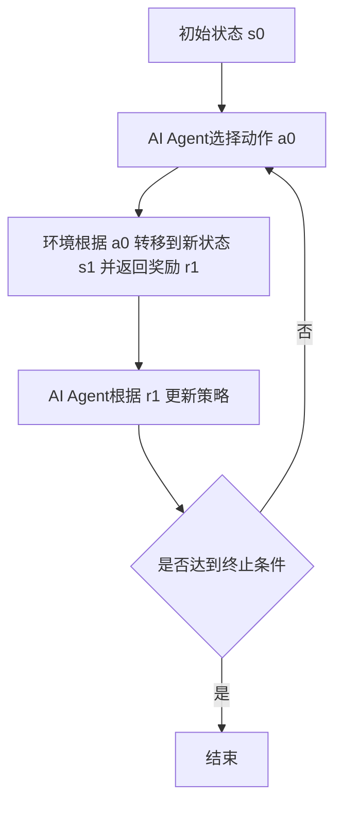

# AI Agent的强化学习在智能电网管理中的应用

> 关键词：AI Agent、强化学习、智能电网管理、电力系统、优化控制、分布式能源、电网稳定性

> 摘要：本文聚焦于AI Agent的强化学习在智能电网管理中的应用。随着智能电网的快速发展，其复杂性和不确定性不断增加，传统的管理方法面临诸多挑战。强化学习作为一种强大的人工智能技术，能够使AI Agent在动态环境中自主学习并做出最优决策。文章首先介绍了相关背景知识，包括研究目的、预期读者等内容；接着阐述了AI Agent和强化学习的核心概念及其联系；详细讲解了核心算法原理和具体操作步骤，并给出Python源代码示例；深入分析了相关的数学模型和公式；通过项目实战展示了代码实际案例及详细解释；探讨了该技术在智能电网管理中的实际应用场景；推荐了学习该领域所需的工具和资源；最后总结了未来发展趋势与挑战，还提供了常见问题解答及扩展阅读参考资料，旨在为智能电网管理领域的研究和实践提供全面且深入的技术指导。

## 1. 背景介绍 
### 1.1 目的和范围
智能电网是电力系统发展的必然趋势，它融合了先进的信息技术、通信技术和控制技术，实现了电力系统的智能化运行和管理。然而，智能电网中分布式能源的大规模接入、电力市场的动态变化以及用户需求的多样性，使得电网的运行和管理面临着前所未有的挑战。

本文章的目的在于深入探讨AI Agent的强化学习在智能电网管理中的应用，旨在为解决智能电网管理中的复杂问题提供新的思路和方法。具体范围涵盖了AI Agent和强化学习的基本概念、核心算法原理、数学模型、实际应用场景以及相关工具和资源推荐等方面。

### 1.2 预期读者
本文预期读者包括电力系统领域的科研人员、工程师、智能电网相关企业的技术人员、高校电力工程和人工智能专业的师生等。对于希望了解智能电网管理新方法、掌握AI Agent强化学习技术在该领域应用的读者具有较高的参考价值。

### 1.3 文档结构概述
本文共分为十个部分。第一部分介绍背景知识，包括目的和范围、预期读者、文档结构概述以及术语表；第二部分阐述核心概念与联系，给出相关的文本示意图和Mermaid流程图；第三部分详细讲解核心算法原理和具体操作步骤，并提供Python源代码；第四部分分析数学模型和公式，并举例说明；第五部分通过项目实战展示代码实际案例和详细解释；第六部分探讨实际应用场景；第七部分推荐工具和资源；第八部分总结未来发展趋势与挑战；第九部分为附录，提供常见问题与解答；第十部分为扩展阅读和参考资料。

### 1.4 术语表
#### 1.4.1 核心术语定义
- **AI Agent（人工智能智能体）**：是一种能够感知环境、做出决策并执行动作的智能实体，在智能电网管理中可用于模拟电力系统中的各种参与者，如发电单元、负荷等。
- **强化学习（Reinforcement Learning）**：是一种机器学习方法，智能体通过与环境进行交互，根据环境反馈的奖励信号来学习最优策略，以最大化长期累积奖励。
- **智能电网（Smart Grid）**：是将先进的传感测量技术、通信技术、信息技术、计算机技术和控制技术与物理电网高度集成而形成的新型电网，具有高效、可靠、安全、环保等特点。

#### 1.4.2 相关概念解释
- **分布式能源（Distributed Energy Resources，DER）**：指分布在用户端的能源综合利用系统，如太阳能光伏发电、风力发电、微型燃气轮机等。分布式能源的接入增加了智能电网的复杂性和不确定性。
- **电力市场（Electricity Market）**：是电力生产、传输、分配和消费等环节所形成的市场体系，包括发电侧市场、输电侧市场、配电侧市场和用户侧市场等。电力市场的动态变化对智能电网的运行和管理产生重要影响。
- **负荷预测（Load Forecasting）**：是指在充分考虑一些重要的系统运行特性、增容决策、自然条件与社会影响的条件下，研究或利用一套系统的方法，利用历史负荷数据预测未来某特定时刻的负荷数据。

#### 1.4.3 缩略词列表
- **DER**：Distributed Energy Resources（分布式能源）
- **RL**：Reinforcement Learning（强化学习）
- **MDP**：Markov Decision Process（马尔可夫决策过程）
- **Q - learning**：Q学习算法

## 2. 核心概念与联系 
### 核心概念原理
#### AI Agent
AI Agent是一种具有感知、决策和行动能力的智能实体。在智能电网管理中，AI Agent可以代表不同的电力系统组件，如发电设备、负荷、储能装置等。每个AI Agent都有自己的目标和任务，通过与环境和其他AI Agent进行交互来实现这些目标。

AI Agent的工作原理基于其内部的决策模型，该模型根据感知到的环境信息和自身的状态，选择合适的行动。例如，一个代表发电设备的AI Agent会根据当前的电网负荷需求、电价等信息，决定发电的功率和时间。

#### 强化学习
强化学习是一种通过智能体与环境进行交互来学习最优策略的机器学习方法。智能体在环境中执行动作，环境会根据智能体的动作返回一个奖励信号，智能体的目标是通过不断地尝试和学习，找到一种能够最大化长期累积奖励的策略。

强化学习的核心是马尔可夫决策过程（MDP），它由状态空间 $S$、动作空间 $A$、状态转移概率 $P(s'|s,a)$、奖励函数 $R(s,a,s')$ 和折扣因子 $\gamma$ 组成。智能体在每个时间步 $t$ 处于状态 $s_t \in S$，选择动作 $a_t \in A$，环境根据状态转移概率 $P(s_{t + 1}|s_t,a_t)$ 转移到新的状态 $s_{t + 1}$，并返回奖励 $r_{t+1}=R(s_t,a_t,s_{t + 1})$。智能体的策略 $\pi(a|s)$ 定义了在状态 $s$ 下选择动作 $a$ 的概率。

### 架构的文本示意图
```plaintext
+----------------------+
|      智能电网环境    |
|                      |
|  +----------------+  |
|  |    AI Agent 1  |  |
|  +----------------+  |
|  |    AI Agent 2  |  |
|  +----------------+  |
|          ...         |
|  +----------------+  |
|  |    AI Agent n  |  |
|  +----------------+  |
+----------------------+
```
在这个示意图中，智能电网环境是一个大的系统，其中包含多个AI Agent。每个AI Agent通过感知环境信息，根据自身的强化学习策略做出决策，并执行相应的动作，从而影响智能电网环境的状态。

### Mermaid流程图

该流程图展示了AI Agent在强化学习过程中的基本步骤。从初始状态开始，AI Agent选择动作，环境根据动作进行状态转移并返回奖励，AI Agent根据奖励更新策略，不断循环这个过程，直到达到终止条件。

## 3. 核心算法原理 & 具体操作步骤 
### 核心算法原理 - Q - learning
Q - learning是一种无模型的强化学习算法，它通过学习动作价值函数 $Q(s,a)$ 来找到最优策略。动作价值函数 $Q(s,a)$ 表示在状态 $s$ 下选择动作 $a$ 并遵循最优策略时的期望累积奖励。

Q - learning的更新公式为：
$$Q(s_t,a_t) \leftarrow Q(s_t,a_t)+\alpha\left[r_{t + 1}+\gamma\max_{a}Q(s_{t+1},a)-Q(s_t,a_t)\right]$$
其中，$\alpha$ 是学习率，控制每次更新的步长；$\gamma$ 是折扣因子，用于平衡即时奖励和未来奖励的重要性。

### 具体操作步骤
1. **初始化**：初始化动作价值函数 $Q(s,a)$ 为任意值，通常初始化为0。设置学习率 $\alpha$、折扣因子 $\gamma$ 和探索率 $\epsilon$。
2. **选择动作**：在状态 $s_t$ 下，以 $\epsilon$ 的概率随机选择一个动作（探索），以 $1 - \epsilon$ 的概率选择 $Q(s_t,a)$ 值最大的动作（利用）。
3. **执行动作**：执行选择的动作 $a_t$，环境根据动作转移到新状态 $s_{t + 1}$ 并返回奖励 $r_{t + 1}$。
4. **更新Q值**：根据Q - learning的更新公式更新 $Q(s_t,a_t)$ 的值。
5. **判断终止条件**：如果达到终止条件（如达到最大步数或达到目标状态），则结束训练；否则，将 $s_{t+1}$ 作为新的当前状态，重复步骤2 - 4。

### Python源代码实现
```python
import numpy as np

# 定义环境参数
num_states = 10
num_actions = 4
alpha = 0.1
gamma = 0.9
epsilon = 0.1
max_steps = 100

# 初始化Q表
Q = np.zeros((num_states, num_actions))

# 定义环境转移和奖励函数（示例）
def env_step(state, action):
    # 简单示例：随机转移到下一个状态
    next_state = np.random.randint(num_states)
    # 简单示例：奖励为随机值
    reward = np.random.randn()
    return next_state, reward

# Q - learning算法
for episode in range(1000):
    state = np.random.randint(num_states)
    for step in range(max_steps):
        # 选择动作
        if np.random.uniform(0, 1) < epsilon:
            action = np.random.randint(num_actions)
        else:
            action = np.argmax(Q[state, :])
        
        # 执行动作
        next_state, reward = env_step(state, action)
        
        # 更新Q值
        Q[state, action] = Q[state, action] + alpha * (reward + gamma * np.max(Q[next_state, :]) - Q[state, action])
        
        # 更新状态
        state = next_state
        
        # 判断终止条件
        if step == max_steps - 1:
            break
```
在这个代码示例中，我们实现了一个简单的Q - learning算法。首先定义了环境的参数，包括状态数、动作数、学习率、折扣因子和探索率等。然后初始化Q表，定义了环境的转移和奖励函数。在训练过程中，智能体根据探索率选择动作，执行动作后更新Q值，直到达到最大步数。

## 4. 数学模型和公式 & 详细讲解 & 举例说明 
### 马尔可夫决策过程（MDP）
马尔可夫决策过程（MDP）是强化学习的数学基础，它可以用一个五元组 $(S,A,P,R,\gamma)$ 来表示：
- **状态空间 $S$**：表示智能体可能处于的所有状态的集合。例如，在智能电网管理中，状态可以包括电网的负荷水平、发电设备的运行状态、储能装置的电量等。
- **动作空间 $A$**：表示智能体可以执行的所有动作的集合。例如，发电设备可以选择不同的发电功率，储能装置可以选择充电或放电等。
- **状态转移概率 $P(s'|s,a)$**：表示在状态 $s$ 下执行动作 $a$ 后转移到状态 $s'$ 的概率。例如，在某一时刻，发电设备以一定的功率发电，由于电网负荷的不确定性，下一个时刻电网的状态（如负荷水平）可能会有不同的变化，这些变化的概率由状态转移概率来描述。
- **奖励函数 $R(s,a,s')$**：表示在状态 $s$ 下执行动作 $a$ 并转移到状态 $s'$ 后获得的奖励。奖励函数是强化学习中引导智能体学习的关键，它可以根据具体的任务和目标来设计。例如，在智能电网管理中，如果发电设备能够在满足电网负荷需求的同时降低成本，就可以给予正奖励；如果导致电网不稳定或成本过高，则给予负奖励。
- **折扣因子 $\gamma$**：取值范围为 $[0,1]$，用于平衡即时奖励和未来奖励的重要性。$\gamma$ 越接近1，智能体越关注未来的奖励；$\gamma$ 越接近0，智能体越关注即时奖励。

### 价值函数
#### 状态价值函数 $V^{\pi}(s)$
状态价值函数 $V^{\pi}(s)$ 表示在策略 $\pi$ 下，从状态 $s$ 开始的期望累积奖励：
$$V^{\pi}(s)=\mathbb{E}_{\pi}\left[\sum_{t = 0}^{\infty}\gamma^{t}r_{t+1}|s_0 = s\right]$$
其中，$\mathbb{E}_{\pi}$ 表示在策略 $\pi$ 下的期望。

#### 动作价值函数 $Q^{\pi}(s,a)$
动作价值函数 $Q^{\pi}(s,a)$ 表示在策略 $\pi$ 下，在状态 $s$ 下执行动作 $a$ 后，从下一个状态开始的期望累积奖励：
$$Q^{\pi}(s,a)=\mathbb{E}_{\pi}\left[\sum_{t = 0}^{\infty}\gamma^{t}r_{t+1}|s_0 = s,a_0 = a\right]$$

### 最优价值函数和最优策略
最优状态价值函数 $V^{*}(s)$ 和最优动作价值函数 $Q^{*}(s,a)$ 分别定义为：
$$V^{*}(s)=\max_{\pi}V^{\pi}(s)$$
$$Q^{*}(s,a)=\max_{\pi}Q^{\pi}(s,a)$$
最优策略 $\pi^{*}$ 可以通过最优动作价值函数得到：
$$\pi^{*}(a|s)=\begin{cases}1, & a = \arg\max_{a}Q^{*}(s,a)\\0, & \text{otherwise}\end{cases}$$

### 举例说明
假设一个简单的智能电网场景，状态空间 $S=\{s_1,s_2\}$，动作空间 $A=\{a_1,a_2\}$，状态转移概率和奖励函数如下：
- $P(s_1|s_1,a_1)=0.8$，$P(s_2|s_1,a_1)=0.2$，$R(s_1,a_1,s_1)=1$，$R(s_1,a_1,s_2)= - 1$
- $P(s_1|s_1,a_2)=0.3$，$P(s_2|s_1,a_2)=0.7$，$R(s_1,a_2,s_1)=2$，$R(s_1,a_2,s_2)= - 2$

设折扣因子 $\gamma = 0.9$，我们可以通过迭代计算来求解最优动作价值函数 $Q^{*}(s,a)$。

初始时，$Q(s,a)$ 都为0。

第一轮迭代：
- 对于状态 $s_1$ 和动作 $a_1$：
  - $Q(s_1,a_1)=0.8\times(1 + 0.9\times\max_{a}Q(s_1,a))+0.2\times(-1 + 0.9\times\max_{a}Q(s_2,a))$
  - 由于初始时 $Q(s,a)$ 都为0，所以 $Q(s_1,a_1)=0.8\times(1 + 0)+0.2\times(-1 + 0)=0.6$
- 对于状态 $s_1$ 和动作 $a_2$：
  - $Q(s_1,a_2)=0.3\times(2 + 0.9\times\max_{a}Q(s_1,a))+0.7\times(-2 + 0.9\times\max_{a}Q(s_2,a))$
  - 同理，$Q(s_1,a_2)=0.3\times(2 + 0)+0.7\times(-2 + 0)= - 0.8$

经过多轮迭代，$Q(s,a)$ 会逐渐收敛到最优值，从而得到最优策略。

## 5. 项目实战：代码实际案例和详细解释说明 
### 5.1  开发环境搭建
#### 操作系统
可以选择Linux（如Ubuntu）、Windows或macOS等操作系统。本文以Ubuntu 20.04为例进行说明。

#### 编程语言和库
- **Python**：建议使用Python 3.7及以上版本。
- **NumPy**：用于数值计算。
- **Matplotlib**：用于数据可视化。

#### 安装步骤
1. 安装Python：
```bash
sudo apt update
sudo apt install python3 python3-pip
```
2. 安装NumPy和Matplotlib：
```bash
pip3 install numpy matplotlib
```

### 5.2  源代码详细实现和代码解读
以下是一个简单的智能电网负荷调度的项目实战代码：
```python
import numpy as np
import matplotlib.pyplot as plt

# 定义环境参数
num_states = 5  # 负荷状态数
num_actions = 3  # 发电动作数
alpha = 0.1
gamma = 0.9
epsilon = 0.1
max_episodes = 1000
max_steps = 50

# 初始化Q表
Q = np.zeros((num_states, num_actions))

# 定义环境转移和奖励函数
def env_step(state, action):
    # 简单的负荷转移模型
    if action == 0:  # 减少发电
        next_state = max(state - 1, 0)
    elif action == 1:  # 保持发电
        next_state = state
    else:  # 增加发电
        next_state = min(state + 1, num_states - 1)
    
    # 奖励函数：目标是使负荷状态接近中间值
    reward = -np.abs(next_state - (num_states - 1) / 2)
    return next_state, reward

# Q - learning算法
rewards_per_episode = []
for episode in range(max_episodes):
    state = np.random.randint(num_states)
    total_reward = 0
    for step in range(max_steps):
        # 选择动作
        if np.random.uniform(0, 1) < epsilon:
            action = np.random.randint(num_actions)
        else:
            action = np.argmax(Q[state, :])
        
        # 执行动作
        next_state, reward = env_step(state, action)
        
        # 更新Q值
        Q[state, action] = Q[state, action] + alpha * (reward + gamma * np.max(Q[next_state, :]) - Q[state, action])
        
        # 更新状态
        state = next_state
        
        # 累计奖励
        total_reward += reward
    
    rewards_per_episode.append(total_reward)

# 绘制奖励曲线
plt.plot(rewards_per_episode)
plt.xlabel('Episode')
plt.ylabel('Total Reward')
plt.title('Q - learning in Smart Grid Load Scheduling')
plt.show()
```
### 5.3  代码解读与分析
#### 代码功能概述
这段代码实现了一个简单的智能电网负荷调度的Q - learning算法。智能体的目标是通过调整发电动作，使电网的负荷状态接近中间值，从而获得最大的奖励。

#### 代码详细解读
1. **环境参数定义**：定义了状态数、动作数、学习率、折扣因子、探索率、最大训练轮数和每轮最大步数等参数。
2. **Q表初始化**：将Q表初始化为全0矩阵。
3. **环境转移和奖励函数**：`env_step` 函数根据当前状态和动作，计算下一个状态和奖励。奖励函数的设计是为了使负荷状态接近中间值。
4. **Q - learning算法**：在每一轮训练中，智能体根据探索率选择动作，执行动作后更新Q值，累计奖励。
5. **奖励曲线绘制**：使用Matplotlib库绘制每一轮训练的总奖励曲线，用于观察智能体的学习过程。

#### 分析
从奖励曲线可以看出，随着训练轮数的增加，总奖励逐渐增加，说明智能体在不断学习并找到更优的策略。通过调整学习率、折扣因子和探索率等参数，可以进一步优化智能体的学习效果。

## 6. 实际应用场景 
### 发电调度
在智能电网中，存在多种发电资源，如传统的火力发电、水电、风电、太阳能发电等。不同发电资源的成本、效率和稳定性各不相同，且风电和太阳能发电具有间歇性和不确定性。AI Agent的强化学习可以根据实时的电网负荷需求、发电资源的状态和市场电价等信息，动态调整发电计划，实现发电资源的优化配置，降低发电成本，提高电网的稳定性和可靠性。

例如，在风力资源丰富时，AI Agent可以优先调度风电，减少传统火力发电的使用；在用电高峰期，合理分配各种发电资源的发电功率，确保电网的供需平衡。

### 需求侧响应
需求侧响应是指通过激励措施引导用户改变用电行为，以实现电网的优化运行。AI Agent的强化学习可以根据用户的用电习惯、实时电价和电网负荷情况，向用户提供个性化的用电建议，鼓励用户在用电低谷期增加用电，在用电高峰期减少用电。

例如，智能家电可以作为AI Agent，根据电网的实时情况自动调整运行模式。当电网负荷过高时，智能空调可以适当提高设定温度，智能洗衣机可以延迟启动，从而减轻电网的压力。

### 储能管理
储能装置在智能电网中起着重要的作用，它可以在用电低谷期储存电能，在用电高峰期释放电能，提高电网的灵活性和稳定性。AI Agent的强化学习可以根据电网的负荷需求、发电情况和储能装置的状态，优化储能装置的充放电策略。

例如，当电网负荷较低且可再生能源发电过剩时，AI Agent可以控制储能装置充电；当电网负荷较高且可再生能源发电不足时，AI Agent可以控制储能装置放电，以满足电网的需求。

### 分布式能源管理
随着分布式能源的大规模接入，智能电网的结构变得更加复杂。AI Agent的强化学习可以用于分布式能源的协调控制，实现分布式能源的优化运行和与大电网的友好互动。

例如，对于分布式太阳能发电系统，AI Agent可以根据光照强度、电池电量和电网需求等信息，决定是将多余的电能并入电网还是储存起来。

## 7. 工具和资源推荐
### 7.1 学习资源推荐
#### 7.1.1 书籍推荐
- 《Reinforcement Learning: An Introduction》（《强化学习：原理与Python实现》）：这是一本强化学习领域的经典教材，详细介绍了强化学习的基本概念、算法和应用，适合初学者和有一定基础的读者。
- 《Artificial Intelligence: A Modern Approach》（《人工智能：一种现代的方法》）：全面介绍了人工智能的各个领域，包括强化学习，内容丰富，适合作为人工智能领域的参考书籍。
- 《Power System Analysis and Design》（《电力系统分析与设计》）：介绍了电力系统的基本原理、分析方法和设计技术，对于理解智能电网管理的背景知识非常有帮助。

#### 7.1.2 在线课程
- Coursera上的“Reinforcement Learning Specialization”：由美国斯坦福大学的教授授课，系统地介绍了强化学习的理论和实践，包括Q - learning、深度强化学习等内容。
- edX上的“Power Systems Engineering”：介绍了电力系统的基本原理、运行和控制，适合电力工程专业的学生和从业人员学习。
- 哔哩哔哩上的一些强化学习和智能电网相关的教学视频，如“李宏毅机器学习”系列课程中包含了强化学习的内容，“电力系统分析”相关视频可以帮助了解电力系统的基础知识。

#### 7.1.3 技术博客和网站
- OpenAI博客（https://openai.com/blog/）：OpenAI是人工智能领域的领先研究机构，其博客上经常发布关于强化学习、人工智能等方面的最新研究成果和技术文章。
- IEEE Xplore（https://ieeexplore.ieee.org/）：是电气和电子工程师协会（IEEE）的数字图书馆，提供了大量的电力系统、人工智能等领域的学术论文和技术报告。
- 知乎上的相关专栏和问答，如“强化学习”、“智能电网”等话题下有很多专业人士分享的经验和见解。

### 7.2 开发工具框架推荐
#### 7.2.1 IDE和编辑器
- PyCharm：是一款专门为Python开发设计的集成开发环境（IDE），具有强大的代码编辑、调试和自动完成等功能，适合开发强化学习和智能电网相关的Python代码。
- Visual Studio Code：是一款轻量级的代码编辑器，支持多种编程语言和插件，可通过安装Python插件来进行Python代码的开发和调试。

#### 7.2.2 调试和性能分析工具
- PDB：Python自带的调试器，可以在代码中设置断点，单步执行代码，查看变量的值等，帮助调试代码。
- cProfile：Python的性能分析工具，可以分析代码的运行时间和函数调用情况，找出代码中的性能瓶颈。

#### 7.2.3 相关框架和库
- OpenAI Gym：是一个用于开发和比较强化学习算法的工具包，提供了多种环境和接口，方便进行强化学习算法的实验和测试。
- TensorFlow和PyTorch：是深度学习领域的两个主流框架，可用于实现深度强化学习算法，如深度Q网络（DQN）等。
- Pandapower：是一个用于电力系统分析和优化的Python库，提供了电力系统建模、潮流计算、最优潮流等功能，可用于智能电网管理的研究和开发。

### 7.3 相关论文著作推荐
#### 7.3.1 经典论文
- Richard S. Sutton和Andrew G. Barto的“Reinforcement Learning: An Introduction”：是强化学习领域的奠基之作，系统地介绍了强化学习的基本理论和算法。
- M. P. Werbos的“Beyond Regression: New Tools for Prediction and Analysis in the Behavioral Sciences”：首次提出了强化学习中的时间差分学习方法，为强化学习的发展奠定了基础。

#### 7.3.2 最新研究成果
- 在IEEE Transactions on Power Systems、IEEE Transactions on Smart Grid等期刊上发表的关于AI Agent的强化学习在智能电网管理中的最新研究论文，这些论文反映了该领域的最新研究动态和技术进展。

#### 7.3.3 应用案例分析
- 一些实际的智能电网项目案例分析，如某地区智能电网的发电调度优化、需求侧响应实施等案例，通过这些案例可以了解AI Agent的强化学习在实际应用中的效果和经验。

## 8. 总结：未来发展趋势与挑战
### 未来发展趋势
#### 深度强化学习的应用
随着深度学习技术的不断发展，深度强化学习将在智能电网管理中得到更广泛的应用。深度强化学习可以处理高维、复杂的状态和动作空间，能够更好地应对智能电网中分布式能源接入、电力市场动态变化等复杂问题。例如，使用深度Q网络（DQN）、策略梯度算法等深度强化学习算法来优化发电调度、储能管理等任务。

#### 多智能体强化学习
智能电网是一个复杂的分布式系统，包含多个参与者和组件。多智能体强化学习可以用于协调多个AI Agent之间的行为，实现智能电网的全局优化。例如，多个发电设备的AI Agent可以通过协作来实现发电资源的最优分配，多个用户的AI Agent可以通过交互来实现需求侧响应的协同优化。

#### 与其他技术的融合
AI Agent的强化学习将与其他技术，如区块链、物联网、大数据等深度融合。区块链技术可以提高智能电网中数据的安全性和可信度，物联网技术可以实现电力系统设备的实时监测和控制，大数据技术可以为强化学习提供丰富的数据支持。例如，利用区块链技术实现分布式能源交易的安全结算，利用物联网传感器采集电网运行数据，利用大数据分析挖掘用户用电行为模式，为强化学习算法提供更准确的环境信息和决策依据。

### 挑战
#### 数据质量和安全性
智能电网管理中需要大量的数据来支持强化学习算法的训练和决策。然而，数据的质量和安全性是一个重要的挑战。数据可能存在噪声、缺失值等问题，影响强化学习算法的性能。同时，智能电网中的数据涉及到用户隐私和电网安全，需要采取有效的安全措施来保护数据的安全。

#### 算法的可解释性
强化学习算法通常是基于数据驱动的黑盒模型，其决策过程难以解释。在智能电网管理中，需要对算法的决策进行解释，以便管理人员理解和信任算法的决策结果。例如，在发电调度决策中，需要解释为什么选择了某个发电方案，这对于保障电网的安全稳定运行至关重要。

#### 环境的不确定性
智能电网的环境具有高度的不确定性，如可再生能源的间歇性、用户用电行为的随机性等。强化学习算法需要能够适应这种不确定性，在不确定的环境中学习到有效的策略。同时，环境的变化可能导致已有的策略失效，需要算法具有快速的自适应能力。

#### 计算资源需求
深度强化学习和多智能体强化学习算法通常需要大量的计算资源来进行训练和决策。在智能电网管理中，需要在有限的计算资源下实现高效的算法，这对于算法的优化和硬件平台的选择提出了更高的要求。

## 9. 附录：常见问题与解答
### 1. 什么是AI Agent？
AI Agent是一种能够感知环境、做出决策并执行动作的智能实体。在智能电网管理中，AI Agent可以代表不同的电力系统组件，如发电设备、负荷、储能装置等，通过与环境和其他AI Agent进行交互来实现特定的目标。

### 2. 强化学习和监督学习有什么区别？
监督学习是基于有标签的数据进行学习，目标是学习输入和输出之间的映射关系。而强化学习是通过智能体与环境进行交互，根据环境反馈的奖励信号来学习最优策略，没有明确的标签数据。强化学习更注重在动态环境中进行决策和优化。

### 3. 在智能电网管理中，如何设计奖励函数？
奖励函数的设计需要根据具体的任务和目标来确定。在智能电网管理中，奖励函数通常与电网的运行指标相关，如发电成本、电网稳定性、负荷平衡等。例如，如果目标是降低发电成本，可以将奖励函数设计为与发电成本成反比；如果目标是提高电网稳定性，可以将奖励函数设计为与电网的电压偏差、频率偏差等指标相关。

### 4. 如何选择合适的强化学习算法？
选择合适的强化学习算法需要考虑问题的特点和需求。如果问题的状态和动作空间较小，可以选择传统的强化学习算法，如Q - learning、SARSA等；如果问题的状态和动作空间较大，深度强化学习算法，如DQN、A2C、PPO等可能更合适。同时，还需要考虑算法的收敛速度、稳定性和可解释性等因素。

### 5. 强化学习在智能电网管理中的应用面临哪些挑战？
强化学习在智能电网管理中的应用面临数据质量和安全性、算法的可解释性、环境的不确定性和计算资源需求等挑战。需要采取相应的措施来解决这些问题，如数据预处理、可解释性技术的研究、自适应算法的设计和计算资源的优化等。

## 10. 扩展阅读 & 参考资料
### 扩展阅读
- 阅读更多关于人工智能、机器学习和电力系统的前沿研究成果，了解相关领域的最新技术和发展趋势。
- 关注智能电网示范项目的案例分析和经验总结，深入了解AI Agent的强化学习在实际应用中的效果和问题。

### 参考资料
- Richard S. Sutton, Andrew G. Barto. Reinforcement Learning: An Introduction. MIT Press, 2018.
- Stuart Russell, Peter Norvig. Artificial Intelligence: A Modern Approach. Pearson, 2020.
- J. Duncan Glover, M. Stanley Sarma, Thomas J. Overbye. Power System Analysis and Design. Cengage Learning, 2012.
- 相关的IEEE期刊论文、会议论文和技术报告。