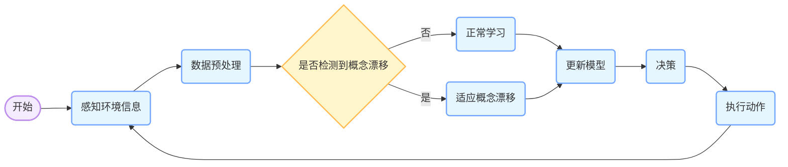

# AI Agent的持续学习与概念漂移适应

> 关键词：AI Agent、持续学习、概念漂移、机器学习、自适应算法、知识更新、模型稳定性

> 摘要：本文围绕AI Agent的持续学习与概念漂移适应展开深入探讨。首先介绍了相关背景知识，包括目的、预期读者、文档结构等。接着阐述了核心概念与联系，通过文本示意图和Mermaid流程图清晰展示其原理和架构。详细讲解了核心算法原理及具体操作步骤，结合Python源代码进行说明。对数学模型和公式进行了推导和举例。通过项目实战给出代码实际案例并详细解释。分析了实际应用场景，推荐了学习、开发工具及相关论文著作。最后总结了未来发展趋势与挑战，提供常见问题解答及扩展阅读参考资料，旨在帮助读者全面理解AI Agent在持续学习和概念漂移适应方面的技术要点和应用方法。

## 1. 背景介绍 
### 1.1 目的和范围
在当今快速发展的信息技术时代，AI Agent被广泛应用于各个领域，如自动驾驶、智能客服、金融风险预测等。然而，现实世界的数据是动态变化的，新的数据模式不断涌现，旧的数据模式逐渐失效，这就导致了概念漂移现象的出现。概念漂移会使得AI Agent基于历史数据训练的模型性能下降，无法准确地对新数据进行预测和决策。因此，AI Agent的持续学习与概念漂移适应成为了亟待解决的问题。

本文的目的在于深入探讨AI Agent如何实现持续学习以及如何有效地适应概念漂移，以提高AI Agent在动态环境中的性能和稳定性。范围涵盖了核心概念的阐述、相关算法原理的讲解、数学模型的推导、项目实战案例的分析以及实际应用场景的讨论等方面。

### 1.2 预期读者
本文预期读者包括人工智能领域的研究人员、工程师、数据科学家、机器学习爱好者以及相关专业的学生。对于想要深入了解AI Agent持续学习和概念漂移适应技术的读者，本文将提供系统而全面的知识体系和技术指导。

### 1.3 文档结构概述
本文将按照以下结构进行组织：
1. 背景介绍：介绍文章的目的、预期读者和文档结构概述，以及相关术语的定义和解释。
2. 核心概念与联系：阐述AI Agent、持续学习和概念漂移的核心概念，展示它们之间的联系，并通过文本示意图和Mermaid流程图进行可视化。
3. 核心算法原理 & 具体操作步骤：详细讲解实现AI Agent持续学习和概念漂移适应的核心算法原理，并给出具体的操作步骤，同时结合Python源代码进行说明。
4. 数学模型和公式 & 详细讲解 & 举例说明：推导相关的数学模型和公式，对其进行详细讲解，并通过具体例子进行说明。
5. 项目实战：代码实际案例和详细解释说明：搭建开发环境，给出具体的源代码实现，并对代码进行详细解读和分析。
6. 实际应用场景：分析AI Agent持续学习和概念漂移适应在不同领域的实际应用场景。
7. 工具和资源推荐：推荐相关的学习资源、开发工具框架以及论文著作。
8. 总结：未来发展趋势与挑战：总结AI Agent持续学习和概念漂移适应的未来发展趋势，并分析面临的挑战。
9. 附录：常见问题与解答：提供常见问题的解答，帮助读者更好地理解和应用相关技术。
10. 扩展阅读 & 参考资料：提供扩展阅读的建议和相关参考资料，方便读者进一步深入学习。

### 1.4 术语表
#### 1.4.1 核心术语定义
- **AI Agent**：人工智能智能体，是一种能够感知环境、做出决策并执行动作的智能实体。它可以是软件程序、机器人或其他智能设备。
- **持续学习**：也称为终身学习，是指AI Agent在其生命周期内不断地从新数据中学习，以更新和扩展其知识和技能，从而适应环境的变化。
- **概念漂移**：是指数据的统计特性随时间发生变化的现象。在机器学习中，概念漂移会导致模型的性能下降，因为模型是基于历史数据训练的，而新数据的分布可能与历史数据不同。

#### 1.4.2 相关概念解释
- **增量学习**：是持续学习的一种具体实现方式，它允许模型在新数据到来时，在不重新训练整个模型的情况下，对模型进行更新。
- **自适应学习**：强调模型能够根据环境的变化自动调整其学习策略和参数，以提高学习效果和性能。
- **模型稳定性**：是指模型在面对概念漂移时，能够保持其性能的相对稳定，不会出现大幅度的波动。

#### 1.4.3 缩略词列表
- **ML**：Machine Learning，机器学习
- **DL**：Deep Learning，深度学习
- **RL**：Reinforcement Learning，强化学习
- **SVM**：Support Vector Machine，支持向量机
- **DNN**：Deep Neural Network，深度神经网络

## 2. 核心概念与联系 

### 核心概念原理
#### AI Agent
AI Agent是一个具有自主性、反应性、社会性和适应性的智能实体。它通过传感器感知环境信息，然后根据自身的知识和策略进行决策，最后通过执行器执行相应的动作。AI Agent的决策过程通常基于机器学习、深度学习、强化学习等算法，以实现对环境的有效适应和优化。

#### 持续学习
持续学习的核心思想是让AI Agent在其生命周期内不断地从新数据中学习，以更新和扩展其知识和技能。持续学习需要解决以下几个关键问题：
1. **知识的保留**：在学习新数据的同时，要保留之前学习到的有用知识，避免遗忘。
2. **模型的更新**：要能够有效地更新模型，以适应新数据的分布。
3. **学习效率**：要在保证学习效果的前提下，提高学习效率，减少计算资源的消耗。

#### 概念漂移
概念漂移是指数据的统计特性随时间发生变化的现象。概念漂移可以分为以下几种类型：
1. **突然漂移**：数据的分布在某个时间点突然发生变化。
2. **渐进漂移**：数据的分布随着时间的推移逐渐发生变化。
3. **反复漂移**：数据的分布在不同的时间点反复发生变化。

### 架构的文本示意图
AI Agent的持续学习与概念漂移适应架构可以描述如下：

AI Agent包含感知模块、决策模块和执行模块。感知模块负责收集环境信息，将其转换为数据。决策模块基于这些数据进行决策，决策过程中涉及到持续学习和概念漂移适应的算法。执行模块根据决策结果执行相应的动作。

在持续学习方面，新数据不断输入到AI Agent中，通过增量学习或其他持续学习算法更新模型。同时，要对模型进行监控，以检测是否发生概念漂移。如果检测到概念漂移，需要采取相应的措施进行适应，如调整模型参数、重新训练模型等。

### Mermaid流程图


## 3. 核心算法原理 & 具体操作步骤 

### 核心算法原理
#### 增量学习算法
增量学习算法是持续学习的一种重要实现方式。其基本思想是在新数据到来时，只对模型进行局部更新，而不是重新训练整个模型。常见的增量学习算法包括增量支持向量机（Incremental SVM）、增量神经网络（Incremental Neural Network）等。

以下是一个简单的增量学习示例，使用Python实现增量线性回归：

```python
import numpy as np

class IncrementalLinearRegression:
    def __init__(self):
        self.w = None
        self.XTX_inv = None

    def fit(self, X, y):
        if self.w is None:
            # 初始化
            XTX = np.dot(X.T, X)
            self.XTX_inv = np.linalg.inv(XTX)
            XTy = np.dot(X.T, y)
            self.w = np.dot(self.XTX_inv, XTy)
        else:
            # 增量更新
            XTX_new = np.dot(X.T, X)
            XTy_new = np.dot(X.T, y)
            self.XTX_inv = np.linalg.inv(self.XTX_inv**(-1) + XTX_new)
            self.w = np.dot(self.XTX_inv, np.dot(self.XTX_inv**(-1), self.w) + XTy_new)

    def predict(self, X):
        return np.dot(X, self.w)
```

#### 概念漂移检测算法
概念漂移检测算法用于检测数据的分布是否发生变化。常见的概念漂移检测算法包括基于统计的方法（如卡方检验、Kullback - Leibler散度等）、基于机器学习的方法（如集成学习、聚类分析等）。

以下是一个简单的基于统计的概念漂移检测示例，使用Kullback - Leibler散度：

```python
import numpy as np
from scipy.stats import entropy

def kl_divergence(p, q):
    return entropy(p, q)

def detect_concept_drift(data_old, data_new, threshold):
    p_old = np.histogram(data_old, bins=10, density=True)[0]
    p_new = np.histogram(data_new, bins=10, density=True)[0]
    kl = kl_divergence(p_old, p_new)
    if kl > threshold:
        return True
    else:
        return False
```

### 具体操作步骤
1. **数据收集**：通过AI Agent的感知模块收集环境数据。
2. **数据预处理**：对收集到的数据进行清洗、归一化等预处理操作。
3. **概念漂移检测**：使用概念漂移检测算法检测数据的分布是否发生变化。
4. **持续学习**：如果没有检测到概念漂移，使用增量学习算法对模型进行正常更新；如果检测到概念漂移，采取相应的适应措施，如调整模型参数、重新训练模型等。
5. **决策与执行**：基于更新后的模型进行决策，并通过执行模块执行相应的动作。

## 4. 数学模型和公式 & 详细讲解 & 举例说明 

### 增量线性回归的数学模型和公式
#### 数学模型
线性回归的数学模型可以表示为：

$$y = Xw + \epsilon$$

其中，$y$ 是目标变量，$X$ 是特征矩阵，$w$ 是权重向量，$\epsilon$ 是误差项。

#### 公式推导
最小二乘法的目标是最小化误差平方和：

$$J(w) = \sum_{i=1}^{n}(y_i - x_i^Tw)^2=(y - Xw)^T(y - Xw)$$

对 $J(w)$ 求导并令其等于0，可得：

$$\frac{\partial J(w)}{\partial w}=-2X^T(y - Xw)=0$$

解得：

$$w=(X^TX)^{-1}X^Ty$$

在增量学习中，当有新数据 $(X_{new}, y_{new})$ 到来时，更新后的权重向量可以通过以下公式计算：

$$(X^TX + X_{new}^TX_{new})^{-1}(X^Ty + X_{new}^Ty_{new})$$

#### 举例说明
假设有以下数据：

```python
import numpy as np

# 旧数据
X_old = np.array([[1], [2], [3]])
y_old = np.array([2, 4, 6])

# 新数据
X_new = np.array([[4]])
y_new = np.array([8])

# 初始化增量线性回归模型
model = IncrementalLinearRegression()

# 拟合旧数据
model.fit(X_old, y_old)

# 预测旧数据
y_pred_old = model.predict(X_old)
print("旧数据预测结果:", y_pred_old)

# 拟合新数据
model.fit(X_new, y_new)

# 预测新数据
y_pred_new = model.predict(X_new)
print("新数据预测结果:", y_pred_new)
```

### 概念漂移检测的数学模型和公式
#### 数学模型
Kullback - Leibler散度用于衡量两个概率分布之间的差异，其定义为：

$$D_{KL}(P||Q)=\sum_{i}P(i)\log\frac{P(i)}{Q(i)}$$

其中，$P$ 和 $Q$ 是两个概率分布。

#### 公式讲解
Kullback - Leibler散度的值越大，说明两个概率分布之间的差异越大。当Kullback - Leibler散度超过某个阈值时，就可以认为发生了概念漂移。

#### 举例说明
假设有以下数据：

```python
# 旧数据
data_old = np.random.normal(0, 1, 100)

# 新数据（发生漂移）
data_new = np.random.normal(5, 1, 100)

# 检测概念漂移
threshold = 0.5
drift = detect_concept_drift(data_old, data_new, threshold)
print("是否发生概念漂移:", drift)
```

## 5. 项目实战：代码实际案例和详细解释说明 

### 5.1  开发环境搭建
本次项目实战使用Python进行开发，需要安装以下库：
- `numpy`：用于数值计算。
- `scikit-learn`：用于机器学习算法。
- `matplotlib`：用于数据可视化。

可以使用以下命令安装这些库：

```sh
pip install numpy scikit-learn matplotlib
```

### 5.2  源代码详细实现和代码解读
以下是一个完整的项目实战代码，实现了AI Agent的持续学习和概念漂移适应：

```python
import numpy as np
from sklearn.linear_model import SGDRegressor
import matplotlib.pyplot as plt

# 生成模拟数据
def generate_data(n_samples, concept_drift_step=None):
    X = np.random.randn(n_samples, 1)
    if concept_drift_step is not None:
        y = np.where(np.arange(n_samples) < concept_drift_step, X.flatten() * 2, X.flatten() * 5)
    else:
        y = X.flatten() * 2
    return X, y

# 初始化模型
model = SGDRegressor()

# 数据参数
n_samples = 1000
concept_drift_step = 500

# 生成数据
X, y = generate_data(n_samples, concept_drift_step)

# 持续学习
predictions = []
for i in range(n_samples):
    X_i = X[i].reshape(1, -1)
    y_i = y[i].reshape(1)
    if i > 0:
        # 预测
        pred = model.predict(X_i)
        predictions.append(pred[0])
    # 学习
    model.partial_fit(X_i, y_i)

# 可视化结果
plt.figure(figsize=(10, 6))
plt.plot(y, label='True values')
plt.plot(predictions, label='Predictions')
plt.axvline(x=concept_drift_step, color='r', linestyle='--', label='Concept drift')
plt.xlabel('Time step')
plt.ylabel('Value')
plt.title('AI Agent Continuous Learning with Concept Drift')
plt.legend()
plt.show()
```

### 5.3  代码解读与分析
1. **数据生成**：`generate_data` 函数用于生成模拟数据，其中 `concept_drift_step` 参数指定了概念漂移发生的时间点。
2. **模型初始化**：使用 `SGDRegressor` 作为持续学习的模型，`SGDRegressor` 是一个支持增量学习的线性回归模型。
3. **持续学习过程**：在每个时间步，模型对当前数据进行预测，并将预测结果保存下来。然后，模型使用当前数据进行增量学习。
4. **可视化结果**：使用 `matplotlib` 库将真实值、预测值和概念漂移发生的时间点进行可视化，方便观察模型在概念漂移情况下的性能。

从可视化结果可以看出，在概念漂移发生之前，模型的预测结果与真实值比较接近；在概念漂移发生之后，模型的预测结果会逐渐适应新的数据模式。

## 6. 实际应用场景 
### 金融风险预测
在金融领域，市场环境和客户行为是不断变化的。例如，经济形势的变化、政策的调整等都可能导致金融风险的分布发生变化。AI Agent可以通过持续学习和概念漂移适应技术，不断更新风险预测模型，以准确地预测金融风险，为金融机构的决策提供支持。

### 自动驾驶
在自动驾驶中，道路条件、交通规则和其他车辆的行为都是动态变化的。AI Agent需要实时感知环境信息，并根据环境的变化调整驾驶策略。持续学习和概念漂移适应技术可以帮助AI Agent更好地适应不同的驾驶场景，提高自动驾驶的安全性和可靠性。

### 智能客服
智能客服需要处理各种用户问题，用户的问题类型和语言习惯可能会随着时间的推移发生变化。通过持续学习和概念漂移适应，智能客服可以不断更新自己的知识和回答策略，提高服务质量和用户满意度。

### 工业生产
在工业生产中，设备的运行状态、原材料的质量等都可能发生变化。AI Agent可以通过持续学习和概念漂移适应技术，实时监测设备的运行状态，预测设备故障，优化生产流程，提高生产效率和产品质量。

## 7. 工具和资源推荐
### 7.1 学习资源推荐
#### 7.1.1 书籍推荐
- 《机器学习》（周志华）：介绍了机器学习的基本概念、算法和应用，是机器学习领域的经典教材。
- 《深度学习》（Ian Goodfellow、Yoshua Bengio和Aaron Courville）：全面介绍了深度学习的理论和实践，是深度学习领域的权威著作。
- 《强化学习：原理与Python实现》（智能系统学习与应用系列）：详细介绍了强化学习的基本原理和算法，并通过Python代码进行实现。

#### 7.1.2 在线课程
- Coursera上的“机器学习”课程（Andrew Ng教授）：是一门经典的机器学习在线课程，适合初学者学习。
- edX上的“深度学习微硕士学位课程”：提供了深度学习的系统学习资源，包括多个课程和项目实践。
- 哔哩哔哩上的“机器学习白板推导系列”：通过白板推导的方式，详细讲解了机器学习的各种算法原理，通俗易懂。

#### 7.1.3 技术博客和网站
- Medium：有许多人工智能领域的技术博客，涵盖了持续学习、概念漂移等方面的最新研究成果和实践经验。
- arXiv：是一个预印本数据库，提供了大量的人工智能相关的研究论文，可以及时了解最新的研究动态。
- Kaggle：是一个数据科学竞赛平台，上面有许多关于机器学习和人工智能的开源项目和代码，可以学习和参考。

### 7.2 开发工具框架推荐
#### 7.2.1 IDE和编辑器
- PyCharm：是一款专业的Python集成开发环境，提供了丰富的代码编辑、调试和分析功能。
- Jupyter Notebook：是一个交互式的开发环境，适合进行数据探索、模型训练和可视化等工作。
- Visual Studio Code：是一个轻量级的代码编辑器，支持多种编程语言，有丰富的插件可以扩展功能。

#### 7.2.2 调试和性能分析工具
- PDB：是Python自带的调试器，可以帮助开发者调试Python代码。
- TensorBoard：是TensorFlow提供的可视化工具，可以用于可视化模型的训练过程、性能指标等。
- cProfile：是Python的性能分析工具，可以帮助开发者找出代码中的性能瓶颈。

#### 7.2.3 相关框架和库
- TensorFlow：是一个开源的深度学习框架，提供了丰富的深度学习模型和工具。
- PyTorch：是另一个流行的深度学习框架，具有动态计算图的特点，适合快速迭代和实验。
- Scikit-learn：是一个简单易用的机器学习库，提供了多种机器学习算法和工具。

### 7.3 相关论文著作推荐
#### 7.3.1 经典论文
- “Learning from Time-Changing Data with Adaptive Windowing”：提出了一种基于自适应窗口的概念漂移处理方法。
- “A Survey on Concept Drift Adaptation”：对概念漂移适应的相关技术进行了全面的综述。
- “Continual Learning in Neural Networks”：探讨了神经网络中的持续学习问题。

#### 7.3.2 最新研究成果
- 可以关注NeurIPS、ICML、CVPR等顶级人工智能会议的最新论文，了解持续学习和概念漂移适应领域的最新研究进展。

#### 7.3.3 应用案例分析
- 可以参考一些实际应用案例的研究论文，了解AI Agent的持续学习和概念漂移适应技术在不同领域的应用方法和效果。

## 8. 总结：未来发展趋势与挑战
### 未来发展趋势
#### 多模态持续学习
未来的AI Agent将不仅仅处理单一模态的数据，而是需要处理图像、语音、文本等多模态的数据。多模态持续学习将成为一个重要的研究方向，以实现更全面、更智能的感知和决策。

#### 元学习与持续学习的结合
元学习可以快速学习新的任务和概念，将元学习与持续学习相结合，可以提高AI Agent的学习效率和适应性，使其能够更快地适应概念漂移。

#### 基于区块链的持续学习
区块链技术可以提供数据的安全性和可追溯性。将区块链技术应用于持续学习中，可以保证数据的真实性和完整性，同时实现数据的共享和协作学习。

### 挑战
#### 知识遗忘问题
在持续学习过程中，AI Agent可能会遗忘之前学习到的有用知识，导致模型性能下降。如何有效地解决知识遗忘问题，是持续学习面临的一个重要挑战。

#### 计算资源消耗
持续学习需要不断地更新模型，这会消耗大量的计算资源。如何在保证学习效果的前提下，降低计算资源的消耗，是一个亟待解决的问题。

#### 概念漂移的准确检测
准确地检测概念漂移是实现概念漂移适应的前提。然而，由于数据的复杂性和不确定性，概念漂移的准确检测仍然是一个具有挑战性的问题。

## 9. 附录：常见问题与解答
### 1. 持续学习和传统机器学习有什么区别？
传统机器学习通常是基于固定的数据集进行训练，训练完成后模型的参数就固定下来了。而持续学习允许模型在新数据到来时不断地进行更新和学习，以适应环境的变化。

### 2. 如何选择合适的概念漂移检测算法？
选择合适的概念漂移检测算法需要考虑数据的特点、应用场景和计算资源等因素。例如，如果数据是高维的，可以选择基于机器学习的方法；如果数据的分布比较简单，可以选择基于统计的方法。

### 3. 持续学习会导致模型过拟合吗？
持续学习过程中，如果模型更新过于频繁或者学习率设置不当，可能会导致模型过拟合。因此，需要合理控制模型的更新频率和学习率，以避免过拟合的问题。

### 4. 如何评估AI Agent在持续学习和概念漂移适应方面的性能？
可以使用一些指标来评估AI Agent的性能，如准确率、召回率、均方误差等。同时，还可以观察模型在概念漂移发生前后的性能变化，以及模型的稳定性和适应性。

## 10. 扩展阅读 & 参考资料
### 扩展阅读
- 《人工智能：一种现代的方法》（Stuart Russell和Peter Norvig）：全面介绍了人工智能的各个领域，包括机器学习、知识表示、自然语言处理等。
- 《智能时代》（吴军）：探讨了人工智能对社会和经济的影响，以及未来的发展趋势。

### 参考资料
- 相关的学术论文、技术报告和开源项目。
- 各人工智能领域的官方文档和教程。