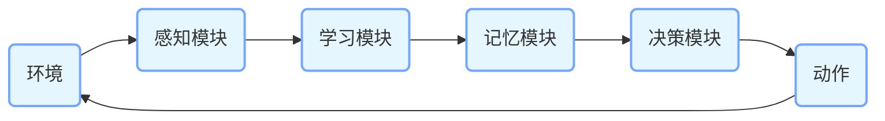

# AI Agent的生物启发式认知架构实现

> 关键词：AI Agent、生物启发式、认知架构、人工智能、神经网络、机器学习、生物智能

> 摘要：本文围绕AI Agent的生物启发式认知架构实现展开深入探讨。首先介绍了相关背景，包括研究目的、预期读者等内容。接着详细阐述了核心概念及联系，通过文本示意图和Mermaid流程图呈现其原理和架构。对核心算法原理进行讲解，并结合Python源代码说明具体操作步骤。深入分析了相关的数学模型和公式，辅以举例说明。通过项目实战，展示了开发环境搭建、源代码实现及解读。探讨了实际应用场景，推荐了学习资源、开发工具框架和相关论文著作。最后总结了未来发展趋势与挑战，提供常见问题解答及扩展阅读参考资料，旨在全面深入地呈现AI Agent生物启发式认知架构实现的相关知识和技术。

## 1. 背景介绍 
### 1.1 目的和范围
随着人工智能技术的不断发展，AI Agent在各个领域的应用日益广泛。传统的AI Agent架构在处理复杂任务和环境时存在一定的局限性，而生物智能具有高度的适应性、学习能力和智能表现。本研究的目的在于探索如何借鉴生物的认知机制，构建AI Agent的生物启发式认知架构，以提高AI Agent的智能水平和适应性。研究范围涵盖了从生物认知原理的分析到AI Agent架构的设计、实现和验证等多个方面。

### 1.2 预期读者
本文预期读者包括人工智能领域的研究人员、开发者、相关专业的学生以及对生物启发式人工智能感兴趣的技术爱好者。希望通过本文，读者能够深入了解AI Agent生物启发式认知架构的原理、实现方法和应用场景，为进一步的研究和实践提供参考。

### 1.3 文档结构概述
本文首先介绍背景知识，包括研究目的、读者群体和文档结构。接着阐述核心概念与联系，展示其原理和架构。然后讲解核心算法原理及具体操作步骤，分析数学模型和公式。通过项目实战呈现代码实现和解读。探讨实际应用场景，推荐相关工具和资源。最后总结未来趋势与挑战，提供常见问题解答和扩展阅读参考资料。

### 1.4 术语表
#### 1.4.1 核心术语定义
- **AI Agent**：人工智能代理，是能够感知环境、做出决策并执行动作的智能实体。
- **生物启发式**：借鉴生物系统的结构、功能、行为等特征来设计和实现人工系统的方法。
- **认知架构**：描述智能体如何组织和处理信息，以实现认知功能的框架。

#### 1.4.2 相关概念解释
- **生物智能**：指生物在长期进化过程中形成的智能能力，包括感知、学习、记忆、决策等。
- **神经网络**：一种模仿人类神经系统的计算模型，由大量的神经元组成，用于处理和分析数据。
- **机器学习**：让计算机通过数据和经验自动学习和改进性能的技术。

#### 1.4.3 缩略词列表
- **ANN**：Artificial Neural Network，人工神经网络
- **RL**：Reinforcement Learning，强化学习

## 2. 核心概念与联系 

### 生物启发式认知架构的原理
生物启发式认知架构的核心思想是借鉴生物的认知机制，如人类的感知、学习、记忆和决策过程，来设计AI Agent的架构。生物的神经系统通过神经元之间的连接和信号传递来处理信息，具有高度的并行性和适应性。AI Agent的生物启发式认知架构试图模拟这种神经系统的结构和功能，以实现更智能的行为。

### 架构的文本示意图
生物启发式认知架构主要由感知模块、学习模块、记忆模块和决策模块组成。感知模块负责从环境中获取信息，类似于生物的感官系统。学习模块对感知到的信息进行处理和学习，更新自身的知识和技能，就像生物通过学习来适应环境。记忆模块存储学习到的知识和经验，为后续的决策提供支持。决策模块根据感知信息和记忆中的知识，做出合理的决策并执行相应的动作。

### Mermaid流程图

这个流程图展示了生物启发式认知架构中各个模块之间的关系和信息流动。环境中的信息首先被感知模块获取，然后传递给学习模块进行处理和学习。学习到的知识和经验存储在记忆模块中，决策模块根据感知信息和记忆中的知识做出决策，执行相应的动作，动作又会对环境产生影响，形成一个闭环的反馈系统。

## 3. 核心算法原理 & 具体操作步骤 

### 核心算法原理
在生物启发式认知架构中，常用的算法包括人工神经网络（ANN）和强化学习（RL）。人工神经网络用于模拟生物神经元的信息处理过程，通过学习输入和输出之间的映射关系，实现对复杂模式的识别和分类。强化学习则用于智能体在环境中进行决策和学习，通过与环境的交互获得奖励信号，不断优化自己的行为策略。

### Python源代码详细阐述
以下是一个简单的使用Python和PyTorch库实现的基于人工神经网络的感知模块示例：
```python
import torch
import torch.nn as nn

# 定义一个简单的神经网络模型
class PerceptionModel(nn.Module):
    def __init__(self, input_size, hidden_size, output_size):
        super(PerceptionModel, self).__init__()
        self.fc1 = nn.Linear(input_size, hidden_size)
        self.relu = nn.ReLU()
        self.fc2 = nn.Linear(hidden_size, output_size)

    def forward(self, x):
        out = self.fc1(x)
        out = self.relu(out)
        out = self.fc2(out)
        return out

# 初始化模型
input_size = 10
hidden_size = 20
output_size = 5
model = PerceptionModel(input_size, hidden_size, output_size)

# 生成随机输入数据
input_data = torch.randn(1, input_size)

# 前向传播
output = model(input_data)
print("Perception output:", output)
```
### 具体操作步骤
1. **定义神经网络模型**：在上述代码中，我们定义了一个简单的两层神经网络模型`PerceptionModel`，包括一个输入层、一个隐藏层和一个输出层。
2. **初始化模型参数**：设置输入大小、隐藏层大小和输出大小，并实例化模型。
3. **生成输入数据**：使用`torch.randn`函数生成随机输入数据。
4. **前向传播**：将输入数据传入模型的`forward`方法，得到输出结果。

## 4. 数学模型和公式 & 详细讲解 & 举例说明 

### 人工神经网络的数学模型
人工神经网络的基本单元是神经元，神经元的输出可以通过以下公式计算：
$$
z = \sum_{i=1}^{n} w_i x_i + b
$$
其中，$x_i$ 是输入信号，$w_i$ 是对应的权重，$b$ 是偏置，$z$ 是神经元的加权输入。然后，通过激活函数 $f$ 对 $z$ 进行非线性变换，得到神经元的输出 $y$：
$$
y = f(z)
$$
常见的激活函数包括Sigmoid函数、ReLU函数等。Sigmoid函数的定义为：
$$
f(z) = \frac{1}{1 + e^{-z}}
$$
ReLU函数的定义为：
$$
f(z) = \max(0, z)
$$

### 详细讲解
在人工神经网络中，权重 $w_i$ 和偏置 $b$ 是需要学习的参数。通过大量的训练数据，使用优化算法（如随机梯度下降）来调整这些参数，使得神经网络的输出尽可能接近真实的标签。激活函数的作用是引入非线性因素，使得神经网络能够处理更复杂的模式和关系。

### 举例说明
假设我们有一个简单的两层神经网络，输入层有2个神经元，隐藏层有3个神经元，输出层有1个神经元。输入数据为 $x = [x_1, x_2]$，隐藏层第 $j$ 个神经元的加权输入为：
$$
z_j = w_{1j} x_1 + w_{2j} x_2 + b_j, \quad j = 1, 2, 3
$$
使用ReLU激活函数，隐藏层第 $j$ 个神经元的输出为：
$$
h_j = \max(0, z_j), \quad j = 1, 2, 3
$$
输出层神经元的加权输入为：
$$
z_{out} = \sum_{j=1}^{3} w_{j,out} h_j + b_{out}
$$
最终的输出为：
$$
y = f(z_{out})
$$

## 5. 项目实战：代码实际案例和详细解释说明 

### 5.1  开发环境搭建
#### 安装Python
首先，确保你已经安装了Python 3.x版本。可以从Python官方网站（https://www.python.org/downloads/） 下载并安装适合你操作系统的Python版本。

#### 安装必要的库
在本项目中，我们需要使用PyTorch、NumPy等库。可以使用以下命令进行安装：
```sh
pip install torch numpy
```

### 5.2  源代码详细实现和代码解读
以下是一个完整的基于生物启发式认知架构的AI Agent项目示例，包括感知、学习、记忆和决策模块：
```python
import torch
import torch.nn as nn
import torch.optim as optim
import numpy as np

# 感知模块
class PerceptionModel(nn.Module):
    def __init__(self, input_size, hidden_size, output_size):
        super(PerceptionModel, self).__init__()
        self.fc1 = nn.Linear(input_size, hidden_size)
        self.relu = nn.ReLU()
        self.fc2 = nn.Linear(hidden_size, output_size)

    def forward(self, x):
        out = self.fc1(x)
        out = self.relu(out)
        out = self.fc2(out)
        return out

# 学习模块
class LearningModule:
    def __init__(self, model, learning_rate):
        self.model = model
        self.optimizer = optim.Adam(model.parameters(), lr=learning_rate)
        self.criterion = nn.MSELoss()

    def train(self, inputs, targets):
        self.optimizer.zero_grad()
        outputs = self.model(inputs)
        loss = self.criterion(outputs, targets)
        loss.backward()
        self.optimizer.step()
        return loss.item()

# 记忆模块
class MemoryModule:
    def __init__(self, capacity):
        self.capacity = capacity
        self.memory = []

    def add(self, experience):
        if len(self.memory) >= self.capacity:
            self.memory.pop(0)
        self.memory.append(experience)

    def sample(self, batch_size):
        indices = np.random.choice(len(self.memory), batch_size, replace=False)
        batch = [self.memory[i] for i in indices]
        inputs = torch.stack([torch.tensor(exp[0], dtype=torch.float32) for exp in batch])
        targets = torch.stack([torch.tensor(exp[1], dtype=torch.float32) for exp in batch])
        return inputs, targets

# 决策模块
class DecisionModule:
    def __init__(self, model):
        self.model = model

    def make_decision(self, input_data):
        input_tensor = torch.tensor(input_data, dtype=torch.float32).unsqueeze(0)
        output = self.model(input_tensor)
        action = torch.argmax(output).item()
        return action

# 主程序
if __name__ == "__main__":
    # 初始化参数
    input_size = 10
    hidden_size = 20
    output_size = 5
    learning_rate = 0.001
    memory_capacity = 1000
    batch_size = 32
    num_episodes = 100

    # 初始化模型
    perception_model = PerceptionModel(input_size, hidden_size, output_size)
    learning_module = LearningModule(perception_model, learning_rate)
    memory_module = MemoryModule(memory_capacity)
    decision_module = DecisionModule(perception_model)

    # 模拟训练过程
    for episode in range(num_episodes):
        # 生成随机输入数据
        input_data = np.random.rand(input_size)
        # 生成随机目标数据
        target_data = np.random.rand(output_size)
        # 记忆经验
        memory_module.add((input_data, target_data))
        if len(memory_module.memory) >= batch_size:
            # 从记忆中采样
            inputs, targets = memory_module.sample(batch_size)
            # 训练模型
            loss = learning_module.train(inputs, targets)
            print(f"Episode {episode}: Loss = {loss}")

        # 做出决策
        action = decision_module.make_decision(input_data)
        print(f"Episode {episode}: Action = {action}")
```
### 5.3  代码解读与分析
#### 感知模块
`PerceptionModel` 类定义了一个简单的两层神经网络，用于从环境中感知信息。通过`forward`方法实现前向传播，将输入数据转换为输出特征。

#### 学习模块
`LearningModule` 类负责模型的训练。使用Adam优化器和均方误差损失函数（MSE）来更新模型的参数。`train` 方法接受输入数据和目标数据，计算损失并进行反向传播和参数更新。

#### 记忆模块
`MemoryModule` 类用于存储智能体的经验。`add` 方法将新的经验添加到记忆中，如果记忆容量超过限制，则删除最早的经验。`sample` 方法从记忆中随机采样一批经验，用于训练模型。

#### 决策模块
`DecisionModule` 类根据感知模块的输出做出决策。`make_decision` 方法接受输入数据，通过模型计算输出，并选择输出中值最大的索引作为动作。

#### 主程序
主程序中初始化了各个模块，并模拟了训练过程。在每个训练周期中，生成随机输入和目标数据，将经验存储到记忆中。如果记忆中的经验足够，从记忆中采样并训练模型。最后，根据输入数据做出决策。

## 6. 实际应用场景 
### 机器人控制
在机器人领域，生物启发式认知架构可以帮助机器人更好地感知环境、学习和适应不同的任务。例如，机器人可以通过感知模块获取周围环境的信息，如障碍物的位置、目标的方向等。学习模块可以根据这些信息学习如何避开障碍物、到达目标。记忆模块可以存储机器人的历史经验，以便在后续任务中快速做出决策。决策模块则根据感知和记忆的结果，控制机器人的运动和动作。

### 智能游戏
在智能游戏中，AI Agent可以使用生物启发式认知架构来提高游戏表现。例如，在策略游戏中，AI Agent可以通过感知模块了解游戏地图、资源分布和对手的行动。学习模块可以学习不同策略的效果，根据游戏情况调整自己的策略。记忆模块可以存储游戏的历史数据，帮助AI Agent预测对手的行为。决策模块则根据这些信息做出决策，如选择建造建筑、出兵攻击等。

### 自动驾驶
在自动驾驶领域，生物启发式认知架构可以提高自动驾驶车辆的安全性和智能性。感知模块可以通过传感器获取道路信息、交通信号和其他车辆的位置。学习模块可以学习如何根据不同的路况和交通规则进行驾驶。记忆模块可以存储驾驶经验，帮助车辆在类似情况下做出更好的决策。决策模块则根据感知和记忆的结果，控制车辆的加速、减速、转向等操作。

## 7. 工具和资源推荐
### 7.1 学习资源推荐
#### 7.1.1 书籍推荐
- 《深度学习》（Deep Learning）：由Ian Goodfellow、Yoshua Bengio和Aaron Courville合著，是深度学习领域的经典教材，全面介绍了深度学习的理论和应用。
- 《人工智能：一种现代的方法》（Artificial Intelligence: A Modern Approach）：由Stuart Russell和Peter Norvig编写，是人工智能领域的权威著作，涵盖了人工智能的各个方面。
- 《神经网络与深度学习》：由邱锡鹏编写，详细介绍了神经网络和深度学习的基本原理、算法和应用。

#### 7.1.2 在线课程
- Coursera上的“深度学习专项课程”（Deep Learning Specialization）：由Andrew Ng教授讲授，包括深度学习的基础知识、卷积神经网络、循环神经网络等内容。
- edX上的“人工智能导论”（Introduction to Artificial Intelligence）：由麻省理工学院（MIT）的教授讲授，介绍了人工智能的基本概念、算法和应用。
- B站的“动手学深度学习”系列课程：由李沐等人讲解，结合实际代码演示，深入介绍深度学习的实践方法。

#### 7.1.3 技术博客和网站
- Medium：有许多人工智能领域的专家和爱好者在Medium上分享最新的研究成果和技术经验。
- arXiv：是一个预印本平台，提供了大量的人工智能相关的研究论文。
- 机器之心：专注于人工智能领域的资讯和技术解读，提供了丰富的行业动态和技术文章。

### 7.2 开发工具框架推荐
#### 7.2.1 IDE和编辑器
- PyCharm：是一款专业的Python集成开发环境（IDE），提供了丰富的代码编辑、调试和版本控制功能。
- Visual Studio Code：是一款轻量级的代码编辑器，支持多种编程语言和插件扩展，适合快速开发和调试。
- Jupyter Notebook：是一个交互式的开发环境，适合进行数据探索、模型训练和可视化等工作。

#### 7.2.2 调试和性能分析工具
- TensorBoard：是TensorFlow的可视化工具，可以帮助用户监控模型的训练过程、查看模型的结构和性能指标。
- PyTorch Profiler：是PyTorch的性能分析工具，可以帮助用户分析模型的运行时间、内存使用等情况，优化模型的性能。
- cProfile：是Python的内置性能分析工具，可以帮助用户分析Python代码的运行时间和函数调用情况。

#### 7.2.3 相关框架和库
- PyTorch：是一个开源的深度学习框架，提供了丰富的神经网络层、优化算法和数据处理工具，支持GPU加速。
- TensorFlow：是另一个广泛使用的深度学习框架，具有强大的分布式训练和部署能力，提供了高级的API和工具。
- Scikit-learn：是一个用于机器学习的Python库，提供了各种机器学习算法和工具，如分类、回归、聚类等。

### 7.3 相关论文著作推荐
#### 7.3.1 经典论文
- “Gradient-Based Learning Applied to Document Recognition”：由Yann LeCun等人发表，介绍了卷积神经网络（CNN）在手写数字识别中的应用，是CNN领域的经典论文。
- “Playing Atari with Deep Reinforcement Learning”：由Volodymyr Mnih等人发表，提出了深度强化学习算法DQN，在Atari游戏中取得了很好的效果。
- “Attention Is All You Need”：由Ashish Vaswani等人发表，提出了Transformer模型，在自然语言处理领域取得了重大突破。

#### 7.3.2 最新研究成果
- 关注顶级学术会议如NeurIPS（神经信息处理系统大会）、ICML（国际机器学习会议）、CVPR（计算机视觉与模式识别会议）等的最新论文，了解人工智能领域的最新研究动态。
- 参考知名学术期刊如Journal of Artificial Intelligence Research（JAIR）、Artificial Intelligence等的最新文章，获取高质量的研究成果。

#### 7.3.3 应用案例分析
- 许多科技公司和研究机构会在其官方网站或博客上分享人工智能的应用案例，如Google AI Blog、OpenAI Blog等。
- 一些行业报告和白皮书也会对人工智能的应用案例进行分析和总结，可以从中了解到人工智能在不同领域的实际应用情况。

## 8. 总结：未来发展趋势与挑战
### 未来发展趋势
- **融合多种生物机制**：未来的生物启发式认知架构可能会融合更多的生物机制，如生物的情感、动机等，以实现更接近人类智能的AI Agent。
- **跨领域应用拓展**：生物启发式认知架构将在更多的领域得到应用，如医疗保健、金融、教育等，为这些领域带来新的发展机遇。
- **与其他技术的结合**：与量子计算、区块链等技术的结合，将进一步提升AI Agent的性能和安全性。

### 挑战
- **生物机制的理解和模拟**：目前对生物智能的理解还不够深入，如何准确地模拟生物的认知机制是一个挑战。
- **计算资源的需求**：生物启发式认知架构通常需要大量的计算资源来实现，如何优化算法和模型，降低计算成本是一个关键问题。
- **伦理和社会问题**：随着AI Agent的智能水平不断提高，可能会带来一些伦理和社会问题，如隐私保护、就业影响等，需要制定相应的政策和法规来应对。

## 9. 附录：常见问题与解答
### 问题1：生物启发式认知架构与传统的AI架构有什么区别？
解答：生物启发式认知架构借鉴了生物的认知机制，如感知、学习、记忆和决策等，具有更高的适应性和智能水平。传统的AI架构通常基于固定的算法和模型，在处理复杂任务和环境时可能存在一定的局限性。

### 问题2：如何评估生物启发式认知架构的性能？
解答：可以从多个方面评估生物启发式认知架构的性能，如智能体的任务完成率、学习速度、决策准确性等。还可以使用一些指标来评估模型的复杂度、计算效率等。

### 问题3：生物启发式认知架构的实现难度大吗？
解答：生物启发式认知架构的实现难度相对较大，需要对生物智能和人工智能有深入的理解。同时，还需要掌握相关的算法和技术，如神经网络、强化学习等。但是，随着技术的不断发展，实现难度也在逐渐降低。

## 10. 扩展阅读 & 参考资料
### 扩展阅读
- 《生命3.0：人工智能时代人类的进化与重生》（Life 3.0: Being Human in the Age of Artificial Intelligence）：作者Max Tegmark探讨了人工智能对人类未来的影响和挑战。
- 《人类简史：从动物到上帝》（Sapiens: A Brief History of Humankind）：作者Yuval Noah Harari从人类进化的角度探讨了人类的智能和文化发展。

### 参考资料
- Goodfellow, I., Bengio, Y., & Courville, A. (2016). Deep Learning. MIT Press.
- Russell, S. J., & Norvig, P. (2016). Artificial Intelligence: A Modern Approach. Pearson.
- LeCun, Y., Bottou, L., Bengio, Y., & Haffner, P. (1998). Gradient-based learning applied to document recognition. Proceedings of the IEEE, 86(11), 2278-2324.
- Mnih, V., Kavukcuoglu, K., Silver, D., Rusu, A. A., Veness, J., Bellemare, M. G., ... & Petersen, S. (2013). Playing atari with deep reinforcement learning. arXiv preprint arXiv:1312.5602.
- Vaswani, A., Shazeer, N., Parmar, N., Uszkoreit, J., Jones, L., Gomez, A. N., ... & Polosukhin, I. (2017). Attention is all you need. Advances in neural information processing systems, 5998-6008.