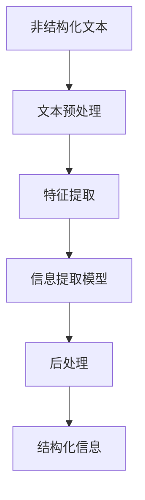

# AI Agent的知识获取：从非结构化文本中提取信息

> 关键词：AI Agent、非结构化文本、信息提取、自然语言处理、知识获取

> 摘要：本文聚焦于AI Agent从非结构化文本中提取信息这一关键技术领域。详细探讨了相关的核心概念、算法原理、数学模型，通过实际项目案例展示了信息提取的具体实现过程。同时，介绍了该技术的实际应用场景，推荐了相关的学习资源、开发工具和论文著作。最后对未来发展趋势与挑战进行了总结，并提供了常见问题解答和参考资料，旨在为读者全面深入地了解这一领域提供指导。

## 1. 背景介绍 
### 1.1 目的和范围
在当今数字化时代，大量的信息以非结构化文本的形式存在，如新闻报道、社交媒体帖子、学术论文等。AI Agent作为一种智能体，需要从这些海量的非结构化文本中提取有价值的信息，以实现知识获取和智能决策。本文的目的在于深入探讨AI Agent从非结构化文本中提取信息的技术原理、方法和应用，范围涵盖了从核心概念的介绍到实际项目案例的分析，以及未来发展趋势的展望。

### 1.2 预期读者
本文预期读者包括人工智能领域的研究人员、开发者、数据科学家，以及对自然语言处理和信息提取技术感兴趣的技术爱好者。对于希望深入了解AI Agent如何处理非结构化文本并提取信息的读者，本文将提供全面而深入的知识和实践指导。

### 1.3 文档结构概述
本文将按照以下结构进行组织：首先介绍相关的核心概念和联系，包括信息提取的原理和架构；接着详细阐述核心算法原理和具体操作步骤，并用Python源代码进行说明；然后介绍数学模型和公式，并举例说明；通过项目实战展示代码实际案例和详细解释；介绍实际应用场景；推荐相关的工具和资源；最后总结未来发展趋势与挑战，提供常见问题解答和参考资料。

### 1.4 术语表
#### 1.4.1 核心术语定义
- **AI Agent（人工智能智能体）**：是一种能够感知环境、进行决策并采取行动的智能实体，旨在实现特定的目标。
- **非结构化文本**：指没有固定格式和结构的文本数据，如自由文本、段落、文档等，与结构化数据（如表格、数据库记录）相对。
- **信息提取**：从非结构化文本中识别和提取出特定类型的信息，如实体、关系、事件等。
- **自然语言处理（NLP）**：是人工智能的一个子领域，研究如何让计算机理解、处理和生成人类语言。

#### 1.4.2 相关概念解释
- **实体识别**：是信息提取的一个重要任务，旨在识别文本中提到的实体，如人名、地名、组织机构名等。
- **关系抽取**：用于识别文本中实体之间的关系，如“张三是李四的朋友”中的“朋友”关系。
- **事件抽取**：从文本中识别出事件的相关信息，包括事件的主体、客体、时间、地点等。

#### 1.4.3 缩略词列表
- **NLP**：Natural Language Processing（自然语言处理）
- **NER**：Named Entity Recognition（命名实体识别）
- **RE**：Relation Extraction（关系抽取）
- **EE**：Event Extraction（事件抽取）

## 2. 核心概念与联系 

### 核心概念原理
AI Agent从非结构化文本中提取信息的核心原理基于自然语言处理技术。自然语言处理通过对文本的语法、语义和语用分析，将非结构化的文本转换为计算机能够理解和处理的结构化信息。信息提取的主要任务包括实体识别、关系抽取和事件抽取。

实体识别是指在文本中识别出具有特定语义的实体，如人名、地名、组织机构名等。关系抽取则是在识别出实体的基础上，确定实体之间的关系。事件抽取是从文本中识别出事件的相关信息，包括事件的主体、客体、时间、地点等。

### 架构的文本示意图
AI Agent从非结构化文本中提取信息的架构主要包括以下几个部分：

1. **文本预处理**：对原始的非结构化文本进行清洗、分词、词性标注等操作，将文本转换为适合后续处理的格式。
2. **特征提取**：从预处理后的文本中提取特征，如词向量、词性特征、句法特征等。
3. **信息提取模型**：使用机器学习或深度学习模型对特征进行处理，实现实体识别、关系抽取和事件抽取等任务。
4. **后处理**：对信息提取模型的输出进行后处理，如实体消歧、关系合并等，提高信息提取的准确性和一致性。

### Mermaid流程图


## 3. 核心算法原理 & 具体操作步骤 

### 命名实体识别（NER）算法原理
命名实体识别是信息提取的基础任务之一，其目的是识别文本中的命名实体。常见的NER算法包括基于规则的方法、基于机器学习的方法和基于深度学习的方法。

基于深度学习的方法在NER任务中取得了很好的效果，其中最常用的模型是BiLSTM-CRF模型。BiLSTM（双向长短期记忆网络）可以捕捉文本的上下文信息，CRF（条件随机场）可以对标签序列进行全局优化。

### Python源代码实现
```python
import torch
import torch.nn as nn
import torch.optim as optim
from torch.utils.data import Dataset, DataLoader

# 定义数据集类
class NERDataset(Dataset):
    def __init__(self, texts, labels):
        self.texts = texts
        self.labels = labels

    def __len__(self):
        return len(self.texts)

    def __getitem__(self, idx):
        text = self.texts[idx]
        label = self.labels[idx]
        return text, label

# 定义BiLSTM-CRF模型
class BiLSTM_CRF(nn.Module):
    def __init__(self, vocab_size, embedding_dim, hidden_dim, tag_to_ix):
        super(BiLSTM_CRF, self).__init__()
        self.embedding = nn.Embedding(vocab_size, embedding_dim)
        self.lstm = nn.LSTM(embedding_dim, hidden_dim // 2,
                            num_layers=1, bidirectional=True)
        self.hidden2tag = nn.Linear(hidden_dim, len(tag_to_ix))
        self.transitions = nn.Parameter(
            torch.randn(len(tag_to_ix), len(tag_to_ix)))
        self.tag_to_ix = tag_to_ix
        self.START_TAG = "<START>"
        self.STOP_TAG = "<STOP>"

    def _forward_alg(self, feats):
        # 前向算法实现
        init_alphas = torch.full((1, len(self.tag_to_ix)), -10000.)
        init_alphas[0][self.tag_to_ix[self.START_TAG]] = 0.
        forward_var = init_alphas
        for feat in feats:
            alphas_t = []
            for next_tag in range(len(self.tag_to_ix)):
                emit_score = feat[next_tag].view(
                    1, -1).expand(1, len(self.tag_to_ix))
                trans_score = self.transitions[next_tag].view(1, -1)
                next_tag_var = forward_var + trans_score + emit_score
                alphas_t.append(log_sum_exp(next_tag_var).view(1))
            forward_var = torch.cat(alphas_t).view(1, -1)
        terminal_var = forward_var + self.transitions[self.tag_to_ix[self.STOP_TAG]]
        alpha = log_sum_exp(terminal_var)
        return alpha

    def _get_lstm_features(self, sentence):
        # 获取LSTM特征
        embeds = self.embedding(sentence).view(len(sentence), 1, -1)
        lstm_out, _ = self.lstm(embeds)
        lstm_out = lstm_out.view(len(sentence), self.hidden_dim)
        lstm_feats = self.hidden2tag(lstm_out)
        return lstm_feats

    def _score_sentence(self, feats, tags):
        # 计算句子的得分
        score = torch.zeros(1)
        tags = torch.cat([torch.tensor([self.tag_to_ix[self.START_TAG]], dtype=torch.long), tags])
        for i, feat in enumerate(feats):
            score = score + \
                    self.transitions[tags[i + 1], tags[i]] + feat[tags[i + 1]]
        score = score + self.transitions[self.tag_to_ix[self.STOP_TAG], tags[-1]]
        return score

    def _viterbi_decode(self, feats):
        # Viterbi解码
        backpointers = []
        init_vvars = torch.full((1, len(self.tag_to_ix)), -10000.)
        init_vvars[0][self.tag_to_ix[self.START_TAG]] = 0
        forward_var = init_vvars
        for feat in feats:
            bptrs_t = []
            viterbivars_t = []
            for next_tag in range(len(self.tag_to_ix)):
                next_tag_var = forward_var + self.transitions[next_tag]
                best_tag_id = argmax(next_tag_var)
                bptrs_t.append(best_tag_id)
                viterbivars_t.append(next_tag_var[0][best_tag_id].view(1))
            forward_var = (torch.cat(viterbivars_t) + feat).view(1, -1)
            backpointers.append(bptrs_t)
        terminal_var = forward_var + self.transitions[self.tag_to_ix[self.STOP_TAG]]
        best_tag_id = argmax(terminal_var)
        path_score = terminal_var[0][best_tag_id]
        best_path = [best_tag_id]
        for bptrs_t in reversed(backpointers):
            best_tag_id = bptrs_t[best_tag_id]
            best_path.append(best_tag_id)
        start = best_path.pop()
        assert start == self.tag_to_ix[self.START_TAG]
        best_path.reverse()
        return path_score, best_path

    def neg_log_likelihood(self, sentence, tags):
        # 计算负对数似然损失
        feats = self._get_lstm_features(sentence)
        forward_score = self._forward_alg(feats)
        gold_score = self._score_sentence(feats, tags)
        return forward_score - gold_score

    def forward(self, sentence):
        # 前向传播
        lstm_feats = self._get_lstm_features(sentence)
        score, tag_seq = self._viterbi_decode(lstm_feats)
        return score, tag_seq

# 辅助函数
def argmax(vec):
    _, idx = torch.max(vec, 1)
    return idx.item()

def log_sum_exp(vec):
    max_score = vec[0, argmax(vec)]
    max_score_broadcast = max_score.view(1, -1).expand(1, vec.size()[1])
    return max_score + \
           torch.log(torch.sum(torch.exp(vec - max_score_broadcast)))

# 训练模型
def train_model(model, dataloader, optimizer, epochs):
    for epoch in range(epochs):
        total_loss = 0
        for texts, labels in dataloader:
            optimizer.zero_grad()
            loss = model.neg_log_likelihood(texts, labels)
            loss.backward()
            optimizer.step()
            total_loss += loss.item()
        print(f'Epoch {epoch + 1}, Loss: {total_loss}')

# 示例数据
texts = [torch.tensor([1, 2, 3]), torch.tensor([4, 5, 6])]
labels = [torch.tensor([0, 1, 2]), torch.tensor([2, 1, 0])]
vocab_size = 10
embedding_dim = 5
hidden_dim = 4
tag_to_ix = {"B-PER": 0, "I-PER": 1, "O": 2, "<START>": 3, "<STOP>": 4}

# 创建数据集和数据加载器
dataset = NERDataset(texts, labels)
dataloader = DataLoader(dataset, batch_size=1)

# 创建模型和优化器
model = BiLSTM_CRF(vocab_size, embedding_dim, hidden_dim, tag_to_ix)
optimizer = optim.SGD(model.parameters(), lr=0.01, weight_decay=1e-4)

# 训练模型
train_model(model, dataloader, optimizer, epochs=5)
```

### 具体操作步骤
1. **数据准备**：收集包含命名实体的文本数据，并进行标注，将标注数据划分为训练集、验证集和测试集。
2. **模型定义**：定义BiLSTM-CRF模型，包括嵌入层、LSTM层、线性层和CRF层。
3. **训练模型**：使用训练集数据对模型进行训练，通过反向传播更新模型参数。
4. **模型评估**：使用验证集和测试集数据对模型进行评估，计算模型的准确率、召回率和F1值等指标。
5. **模型应用**：使用训练好的模型对新的文本数据进行命名实体识别。

## 4. 数学模型和公式 & 详细讲解 & 举例说明 

### 条件随机场（CRF）数学模型
条件随机场是一种判别式概率图模型，常用于序列标注任务。在NER任务中，CRF可以对标签序列进行全局优化，考虑标签之间的依赖关系。

设 $x = (x_1, x_2, \cdots, x_n)$ 是输入的文本序列，$y = (y_1, y_2, \cdots, y_n)$ 是对应的标签序列。CRF的条件概率分布可以表示为：

$$P(y|x) = \frac{1}{Z(x)} \exp \left( \sum_{i=1}^{n} \sum_{k} \lambda_k t_k(y_{i - 1}, y_i, x, i) + \sum_{i=1}^{n} \sum_{l} \mu_l s_l(y_i, x, i) \right)$$

其中，$Z(x)$ 是归一化因子，$t_k(y_{i - 1}, y_i, x, i)$ 是转移特征函数，$s_l(y_i, x, i)$ 是状态特征函数，$\lambda_k$ 和 $\mu_l$ 是对应的权重参数。

### 详细讲解
- **转移特征函数**：用于捕捉标签之间的转移概率，例如，“B-PER” 后面更可能跟 “I-PER” 而不是 “O”。
- **状态特征函数**：用于捕捉输入文本和标签之间的关系，例如，某个词更可能对应某个标签。
- **归一化因子**：用于保证概率分布的总和为1。

### 举例说明
假设我们有一个简单的文本序列 $x = [“John”, “Smith”]$，标签集合为 $\{“B - PER”, “I - PER”, “O”\}$。转移特征函数可以定义为：

- $t_1(y_{i - 1}, y_i) = 1$，如果 $y_{i - 1} = “B - PER”$ 且 $y_i = “I - PER”$，否则为0。
- $t_2(y_{i - 1}, y_i) = 1$，如果 $y_{i - 1} = “O”$ 且 $y_i = “B - PER”$，否则为0。

状态特征函数可以定义为：

- $s_1(y_i, x, i) = 1$，如果 $y_i = “B - PER”$ 且 $x_i = “John”$，否则为0。
- $s_2(y_i, x, i) = 1$，如果 $y_i = “I - PER”$ 且 $x_i = “Smith”$，否则为0。

通过调整权重参数 $\lambda_k$ 和 $\mu_l$，可以使模型学习到不同特征的重要性，从而提高命名实体识别的准确率。

## 5. 项目实战：代码实际案例和详细解释说明 

### 5.1  开发环境搭建
1. **安装Python**：推荐使用Python 3.7及以上版本。
2. **安装深度学习框架**：使用PyTorch作为深度学习框架，可以通过以下命令安装：
```sh
pip install torch
```
3. **安装其他依赖库**：根据具体需求安装其他依赖库，如`numpy`、`pandas`等。

### 5.2  源代码详细实现和代码解读
以下是一个完整的从非结构化文本中提取命名实体的项目实战代码：

```python
import torch
import torch.nn as nn
import torch.optim as optim
from torch.utils.data import Dataset, DataLoader
from collections import Counter
import numpy as np

# 定义数据集类
class NERDataset(Dataset):
    def __init__(self, texts, labels, word_to_ix, tag_to_ix):
        self.texts = texts
        self.labels = labels
        self.word_to_ix = word_to_ix
        self.tag_to_ix = tag_to_ix

    def __len__(self):
        return len(self.texts)

    def __getitem__(self, idx):
        text = self.texts[idx]
        label = self.labels[idx]
        text_ids = [self.word_to_ix[word] if word in self.word_to_ix else self.word_to_ix["<UNK>"] for word in text]
        label_ids = [self.tag_to_ix[tag] for tag in label]
        return torch.tensor(text_ids), torch.tensor(label_ids)

# 定义BiLSTM-CRF模型
class BiLSTM_CRF(nn.Module):
    def __init__(self, vocab_size, embedding_dim, hidden_dim, tag_to_ix):
        super(BiLSTM_CRF, self).__init__()
        self.embedding = nn.Embedding(vocab_size, embedding_dim)
        self.lstm = nn.LSTM(embedding_dim, hidden_dim // 2,
                            num_layers=1, bidirectional=True)
        self.hidden2tag = nn.Linear(hidden_dim, len(tag_to_ix))
        self.transitions = nn.Parameter(
            torch.randn(len(tag_to_ix), len(tag_to_ix)))
        self.tag_to_ix = tag_to_ix
        self.START_TAG = "<START>"
        self.STOP_TAG = "<STOP>"

    def _forward_alg(self, feats):
        init_alphas = torch.full((1, len(self.tag_to_ix)), -10000.)
        init_alphas[0][self.tag_to_ix[self.START_TAG]] = 0.
        forward_var = init_alphas
        for feat in feats:
            alphas_t = []
            for next_tag in range(len(self.tag_to_ix)):
                emit_score = feat[next_tag].view(
                    1, -1).expand(1, len(self.tag_to_ix))
                trans_score = self.transitions[next_tag].view(1, -1)
                next_tag_var = forward_var + trans_score + emit_score
                alphas_t.append(log_sum_exp(next_tag_var).view(1))
            forward_var = torch.cat(alphas_t).view(1, -1)
        terminal_var = forward_var + self.transitions[self.tag_to_ix[self.STOP_TAG]]
        alpha = log_sum_exp(terminal_var)
        return alpha

    def _get_lstm_features(self, sentence):
        embeds = self.embedding(sentence).view(len(sentence), 1, -1)
        lstm_out, _ = self.lstm(embeds)
        lstm_out = lstm_out.view(len(sentence), self.hidden_dim)
        lstm_feats = self.hidden2tag(lstm_out)
        return lstm_feats

    def _score_sentence(self, feats, tags):
        score = torch.zeros(1)
        tags = torch.cat([torch.tensor([self.tag_to_ix[self.START_TAG]], dtype=torch.long), tags])
        for i, feat in enumerate(feats):
            score = score + \
                    self.transitions[tags[i + 1], tags[i]] + feat[tags[i + 1]]
        score = score + self.transitions[self.tag_to_ix[self.STOP_TAG], tags[-1]]
        return score

    def _viterbi_decode(self, feats):
        backpointers = []
        init_vvars = torch.full((1, len(self.tag_to_ix)), -10000.)
        init_vvars[0][self.tag_to_ix[self.START_TAG]] = 0
        forward_var = init_vvars
        for feat in feats:
            bptrs_t = []
            viterbivars_t = []
            for next_tag in range(len(self.tag_to_ix)):
                next_tag_var = forward_var + self.transitions[next_tag]
                best_tag_id = argmax(next_tag_var)
                bptrs_t.append(best_tag_id)
                viterbivars_t.append(next_tag_var[0][best_tag_id].view(1))
            forward_var = (torch.cat(viterbivars_t) + feat).view(1, -1)
            backpointers.append(bptrs_t)
        terminal_var = forward_var + self.transitions[self.tag_to_ix[self.STOP_TAG]]
        best_tag_id = argmax(terminal_var)
        path_score = terminal_var[0][best_tag_id]
        best_path = [best_tag_id]
        for bptrs_t in reversed(backpointers):
            best_tag_id = bptrs_t[best_tag_id]
            best_path.append(best_tag_id)
        start = best_path.pop()
        assert start == self.tag_to_ix[self.START_TAG]
        best_path.reverse()
        return path_score, best_path

    def neg_log_likelihood(self, sentence, tags):
        feats = self._get_lstm_features(sentence)
        forward_score = self._forward_alg(feats)
        gold_score = self._score_sentence(feats, tags)
        return forward_score - gold_score

    def forward(self, sentence):
        lstm_feats = self._get_lstm_features(sentence)
        score, tag_seq = self._viterbi_decode(lstm_feats)
        return score, tag_seq

# 辅助函数
def argmax(vec):
    _, idx = torch.max(vec, 1)
    return idx.item()

def log_sum_exp(vec):
    max_score = vec[0, argmax(vec)]
    max_score_broadcast = max_score.view(1, -1).expand(1, vec.size()[1])
    return max_score + \
           torch.log(torch.sum(torch.exp(vec - max_score_broadcast)))

# 数据预处理
def prepare_data(texts, labels):
    word_counter = Counter()
    tag_counter = Counter()
    for text in texts:
        for word in text:
            word_counter[word] += 1
    for label in labels:
        for tag in label:
            tag_counter[tag] += 1
    word_to_ix = {"<UNK>": 0}
    for word in word_counter:
        word_to_ix[word] = len(word_to_ix)
    tag_to_ix = {}
    for tag in tag_counter:
        tag_to_ix[tag] = len(tag_to_ix)
    tag_to_ix["<START>"] = len(tag_to_ix)
    tag_to_ix["<STOP>"] = len(tag_to_ix)
    return word_to_ix, tag_to_ix

# 训练模型
def train_model(model, dataloader, optimizer, epochs):
    for epoch in range(epochs):
        total_loss = 0
        for texts, labels in dataloader:
            optimizer.zero_grad()
            loss = model.neg_log_likelihood(texts[0], labels[0])
            loss.backward()
            optimizer.step()
            total_loss += loss.item()
        print(f'Epoch {epoch + 1}, Loss: {total_loss}')

# 示例数据
texts = [["John", "Smith", "is", "a", "software", "engineer"], ["Apple", "is", "a", "tech", "company"]]
labels = [["B-PER", "I-PER", "O", "O", "O", "O"], ["B-ORG", "O", "O", "O", "O"]]

# 数据预处理
word_to_ix, tag_to_ix = prepare_data(texts, labels)

# 创建数据集和数据加载器
dataset = NERDataset(texts, labels, word_to_ix, tag_to_ix)
dataloader = DataLoader(dataset, batch_size=1)

# 创建模型和优化器
vocab_size = len(word_to_ix)
embedding_dim = 5
hidden_dim = 4
model = BiLSTM_CRF(vocab_size, embedding_dim, hidden_dim, tag_to_ix)
optimizer = optim.SGD(model.parameters(), lr=0.01, weight_decay=1e-4)

# 训练模型
train_model(model, dataloader, optimizer, epochs=5)

# 预测
test_text = ["John", "works", "at", "Apple"]
test_text_ids = [word_to_ix[word] if word in word_to_ix else word_to_ix["<UNK>"] for word in test_text]
test_text_tensor = torch.tensor(test_text_ids)
_, tag_seq = model(test_text_tensor)
ix_to_tag = {v: k for k, v in tag_to_ix.items()}
predicted_tags = [ix_to_tag[tag_id] for tag_id in tag_seq]
print(f"Predicted tags: {predicted_tags}")
```

### 代码解读与分析
1. **数据预处理**：`prepare_data` 函数用于统计文本中的单词和标签，构建单词到索引和标签到索引的映射表。
2. **数据集类**：`NERDataset` 类用于封装数据集，将文本和标签转换为索引序列。
3. **模型定义**：`BiLSTM_CRF` 类定义了BiLSTM-CRF模型，包括嵌入层、LSTM层、线性层和CRF层。
4. **训练模型**：`train_model` 函数用于训练模型，通过反向传播更新模型参数。
5. **预测**：使用训练好的模型对新的文本数据进行命名实体识别，将预测的标签索引转换为标签名称。

## 6. 实际应用场景 
### 信息检索
在信息检索系统中，AI Agent可以从非结构化文本中提取关键信息，如实体、主题等，从而提高信息检索的准确性和效率。例如，在搜索引擎中，通过提取网页文本中的关键信息，可以更好地理解网页内容，为用户提供更相关的搜索结果。

### 智能客服
在智能客服系统中，AI Agent可以从用户的非结构化文本中提取关键信息，如问题类型、用户需求等，从而更好地理解用户意图，提供更准确的回答和解决方案。例如，在电商客服中，通过提取用户文本中的商品名称、订单号等信息，可以快速定位用户问题，提高客服效率。

### 舆情监测
在舆情监测系统中，AI Agent可以从社交媒体、新闻报道等非结构化文本中提取关键信息，如事件主体、事件类型、情感倾向等，从而实时监测舆情动态，为企业和政府提供决策支持。例如，在企业舆情监测中，通过提取负面信息，可以及时采取措施，降低企业声誉风险。

### 知识图谱构建
在知识图谱构建中，AI Agent可以从非结构化文本中提取实体、关系等信息，将这些信息整合到知识图谱中，从而丰富知识图谱的内容。例如，在学术知识图谱构建中，通过提取学术论文中的作者、机构、研究成果等信息，可以构建更加完善的学术知识图谱。

## 7. 工具和资源推荐
### 7.1 学习资源推荐
#### 7.1.1 书籍推荐
- 《自然语言处理入门》：这本书详细介绍了自然语言处理的基础知识和常用技术，适合初学者入门。
- 《深度学习》：由Ian Goodfellow、Yoshua Bengio和Aaron Courville合著，是深度学习领域的经典教材，对于理解深度学习模型在信息提取中的应用有很大帮助。
- 《Python自然语言处理》：介绍了如何使用Python进行自然语言处理，包括文本预处理、信息提取等任务。

#### 7.1.2 在线课程
- Coursera上的“Natural Language Processing Specialization”：由顶尖大学的教授授课，系统地介绍了自然语言处理的各个方面。
- edX上的“Deep Learning for Natural Language Processing”：专注于深度学习在自然语言处理中的应用，包括命名实体识别、关系抽取等任务。
- 中国大学MOOC上的“自然语言处理”：由国内知名高校的教师授课，内容丰富，适合国内学习者。

#### 7.1.3 技术博客和网站
- Medium上的自然语言处理相关博客：有很多专业人士分享自然语言处理的最新研究成果和实践经验。
- arXiv.org：一个预印本平台，提供了大量的自然语言处理领域的研究论文。
- Hugging Face的博客：分享了很多关于深度学习模型和自然语言处理的技术文章。

### 7.2 开发工具框架推荐
#### 7.2.1 IDE和编辑器
- PyCharm：是一款功能强大的Python集成开发环境，提供了代码编辑、调试、版本控制等功能。
- Visual Studio Code：轻量级的代码编辑器，支持多种编程语言，有丰富的插件扩展功能。
- Jupyter Notebook：交互式的开发环境，适合进行数据探索和模型实验。

#### 7.2.2 调试和性能分析工具
- PyTorch Profiler：可以帮助开发者分析PyTorch模型的性能瓶颈，优化模型训练和推理速度。
- TensorBoard：是TensorFlow的可视化工具，也可以用于PyTorch模型的可视化和性能分析。
- cProfile：Python的内置性能分析工具，可以分析Python代码的执行时间和调用关系。

#### 7.2.3 相关框架和库
- PyTorch：是一个开源的深度学习框架，提供了丰富的深度学习模型和工具，适合进行信息提取任务。
- AllenNLP：是一个用于自然语言处理的深度学习框架，提供了预训练模型和工具，方便开发者进行信息提取任务。
- SpaCy：是一个快速、高效的自然语言处理库，提供了命名实体识别、词性标注等功能。

### 7.3 相关论文著作推荐
#### 7.3.1 经典论文
- “Bidirectional LSTM-CRF Models for Sequence Tagging”：介绍了BiLSTM-CRF模型在序列标注任务中的应用，是命名实体识别领域的经典论文。
- “Attention Is All You Need”：提出了Transformer模型，为自然语言处理带来了革命性的变化。
- “Convolutional Neural Networks for Sentence Classification”：介绍了卷积神经网络在文本分类任务中的应用。

#### 7.3.2 最新研究成果
- 关注ACL（Association for Computational Linguistics）、EMNLP（Conference on Empirical Methods in Natural Language Processing）等自然语言处理领域的顶级会议，了解最新的研究成果。
- 在arXiv.org上搜索自然语言处理领域的最新预印本论文。

#### 7.3.3 应用案例分析
- 阅读一些实际应用案例的论文，了解AI Agent从非结构化文本中提取信息在不同领域的应用实践和经验。
- 关注一些知名企业的技术博客，如Google AI Blog、Facebook AI Research等，了解他们在信息提取方面的应用案例。

## 8. 总结：未来发展趋势与挑战
### 未来发展趋势
- **多模态信息提取**：未来的AI Agent将不仅能够从文本中提取信息，还能够从图像、音频、视频等多模态数据中提取信息，实现更加全面和准确的知识获取。
- **强化学习与信息提取的结合**：强化学习可以用于优化信息提取的策略，使AI Agent能够在不同的环境中自适应地进行信息提取，提高信息提取的效率和准确性。
- **大规模预训练模型的应用**：大规模预训练模型如BERT、GPT等在自然语言处理领域取得了很好的效果，未来将进一步应用于信息提取任务，提高信息提取的性能。
- **知识图谱与信息提取的融合**：知识图谱可以为信息提取提供先验知识，帮助AI Agent更好地理解文本中的语义信息，提高信息提取的准确性和可解释性。

### 挑战
- **数据质量和标注成本**：非结构化文本数据的质量参差不齐，需要进行大量的预处理和标注工作，标注成本较高。如何提高数据质量和降低标注成本是一个挑战。
- **语义理解的复杂性**：自然语言的语义非常复杂，存在歧义、隐喻等现象，AI Agent在理解语义信息时面临很大的挑战。如何提高AI Agent的语义理解能力是一个关键问题。
- **可解释性和可信度**：深度学习模型在信息提取任务中取得了很好的效果，但这些模型往往是黑盒模型，缺乏可解释性和可信度。如何提高模型的可解释性和可信度是一个重要的研究方向。
- **隐私和安全问题**：在信息提取过程中，可能会涉及到用户的隐私信息，如何保护用户的隐私和数据安全是一个必须考虑的问题。

## 9. 附录：常见问题与解答
### 问题1：如何选择合适的信息提取算法？
解答：选择合适的信息提取算法需要考虑多个因素，如数据类型、任务复杂度、性能要求等。如果数据量较小，可以选择基于规则的方法；如果数据量较大，可以选择基于机器学习或深度学习的方法。对于命名实体识别任务，BiLSTM-CRF模型是一个不错的选择；对于关系抽取任务，可以使用基于注意力机制的深度学习模型。

### 问题2：如何处理数据不平衡问题？
解答：数据不平衡是信息提取任务中常见的问题，可以采用以下方法进行处理：
- **数据增强**：通过对少数类样本进行复制、替换等操作，增加少数类样本的数量。
- **调整权重**：在模型训练过程中，对少数类样本的损失函数进行加权，提高模型对少数类样本的关注度。
- **采用集成学习**：使用多个模型进行集成，提高模型的泛化能力。

### 问题3：如何评估信息提取模型的性能？
解答：评估信息提取模型的性能可以使用以下指标：
- **准确率（Accuracy）**：预测正确的样本数占总样本数的比例。
- **召回率（Recall）**：预测正确的正样本数占实际正样本数的比例。
- **F1值（F1-score）**：准确率和召回率的调和平均数，综合考虑了准确率和召回率。
- **Precision-Recall曲线（PR曲线）**：展示了不同阈值下准确率和召回率的变化关系。
- **ROC曲线（Receiver Operating Characteristic curve）**：展示了不同阈值下真阳性率和假阳性率的变化关系。

### 问题4：如何提高信息提取模型的可解释性？
解答：提高信息提取模型的可解释性可以采用以下方法：
- **特征重要性分析**：分析模型中各个特征的重要性，了解模型决策的依据。
- **可视化**：将模型的决策过程进行可视化，如使用热力图、树状图等展示模型的决策逻辑。
- **基于规则的解释**：将模型的决策过程转化为规则，使决策过程更加直观和可解释。
- **局部解释方法**：如LIME（Local Interpretable Model-agnostic Explanations）和SHAP（SHapley Additive exPlanations），可以对模型的局部决策进行解释。

## 10. 扩展阅读 & 参考资料
### 扩展阅读
- 《人工智能：现代方法》：全面介绍了人工智能的各个领域，包括自然语言处理、机器学习等，对于深入理解AI Agent的原理和应用有很大帮助。
- 《统计自然语言处理基础》：详细介绍了统计自然语言处理的理论和方法，是自然语言处理领域的经典教材。
- 《深度学习实战》：通过实际案例介绍了深度学习在各个领域的应用，包括信息提取任务。

### 参考资料
- 相关学术论文和研究报告，如ACL、EMNLP等会议的论文。
- 开源代码库，如GitHub上的自然语言处理相关项目。
- 官方文档，如PyTorch、AllenNLP、SpaCy等框架和库的官方文档。