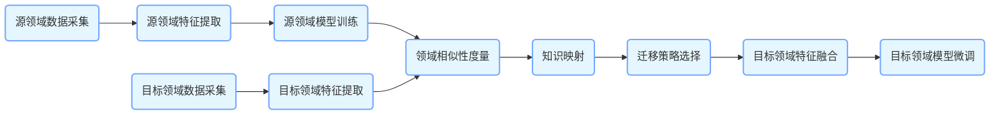

# AI Agent的知识迁移能力：跨领域学习

> 关键词：AI Agent、知识迁移能力、跨领域学习、迁移学习、泛化能力、领域适应、多领域融合

> 摘要：本文聚焦于AI Agent的知识迁移能力，深入探讨其在跨领域学习中的原理、算法、数学模型以及实际应用。随着人工智能技术的发展，AI Agent需要在不同领域中灵活应用知识，知识迁移能力成为关键。文章详细介绍了相关核心概念和联系，阐述了核心算法原理及操作步骤，通过数学模型和公式进行理论支撑，结合项目实战案例进行代码实现和解读，分析了实际应用场景，并推荐了相关的学习资源、开发工具和论文著作。最后对AI Agent知识迁移能力的未来发展趋势与挑战进行总结，为相关领域的研究和实践提供全面的参考。

## 1. 背景介绍 
### 1.1 目的和范围
在当今复杂多变的现实世界中，单一领域的AI Agent往往无法满足多样化的需求。例如，在医疗领域，AI不仅需要处理医学图像识别，还需要理解病历文本并进行疾病诊断；在交通领域，自动驾驶系统需要融合视觉、雷达等多源信息进行决策。因此，研究AI Agent的知识迁移能力，实现跨领域学习具有重要的现实意义。

本文的范围涵盖了AI Agent知识迁移能力的基本概念、核心算法、数学模型、项目实战以及实际应用场景等多个方面，旨在全面深入地探讨如何提升AI Agent在跨领域学习中的性能。

### 1.2 预期读者
本文预期读者包括人工智能领域的研究人员、工程师、开发者，以及对AI Agent知识迁移和跨领域学习感兴趣的学生和爱好者。对于研究人员，本文提供了最新的理论和技术进展；对于工程师和开发者，本文给出了具体的算法实现和项目实战案例；对于学生和爱好者，本文有助于他们理解AI Agent知识迁移的基本概念和原理。

### 1.3 文档结构概述
本文共分为十个部分。第一部分为背景介绍，阐述了研究的目的、范围、预期读者和文档结构概述。第二部分介绍核心概念与联系，包括知识迁移、跨领域学习等概念的原理和架构，并给出相应的示意图和流程图。第三部分讲解核心算法原理及具体操作步骤，通过Python源代码详细阐述。第四部分介绍数学模型和公式，并进行详细讲解和举例说明。第五部分为项目实战，包括开发环境搭建、源代码详细实现和代码解读。第六部分分析实际应用场景。第七部分推荐相关的工具和资源，包括学习资源、开发工具框架和论文著作。第八部分总结未来发展趋势与挑战。第九部分为附录，解答常见问题。第十部分提供扩展阅读和参考资料。

### 1.4 术语表
#### 1.4.1 核心术语定义
- **AI Agent（人工智能智能体）**：是一种能够感知环境、进行决策并采取行动以实现特定目标的智能实体。它可以是软件程序、机器人等不同形式。
- **知识迁移能力**：指AI Agent将在一个领域中学习到的知识、技能或模式应用到另一个不同领域的能力。
- **跨领域学习**：AI Agent在多个不同领域之间进行学习和知识交流，以提高其在各个领域的性能和适应性。
- **迁移学习**：是一种机器学习技术，旨在利用已有的知识和经验来加速在新任务或新领域中的学习过程。
- **领域适应**：使AI Agent能够在不同领域之间进行自适应调整，以减少领域差异对学习和决策的影响。

#### 1.4.2 相关概念解释
- **泛化能力**：AI Agent在训练数据之外的新数据上表现出良好性能的能力，与知识迁移能力密切相关，良好的泛化能力有助于实现跨领域学习。
- **多领域融合**：将来自不同领域的知识、数据和技术进行整合，以实现更复杂和智能的任务。

#### 1.4.3 缩略词列表
- **ML（Machine Learning，机器学习）**
- **DL（Deep Learning，深度学习）**
- **RL（Reinforcement Learning，强化学习）**
- **DNN（Deep Neural Network，深度神经网络）**
- **CNN（Convolutional Neural Network，卷积神经网络）**
- **RNN（Recurrent Neural Network，循环神经网络）**

## 2. 核心概念与联系 

### 知识迁移的基本原理
知识迁移的核心思想是利用不同领域之间的相似性，将在源领域中学习到的有用信息应用到目标领域中。这种相似性可以体现在数据的特征分布、任务的结构或语义等方面。例如，在图像分类任务中，不同类型的图像可能具有相似的纹理、形状等特征，通过提取这些共享特征，AI Agent可以将在一种图像类型上学习到的分类模型迁移到其他图像类型上。

### 跨领域学习的架构
跨领域学习的架构通常包括源领域模块、目标领域模块和迁移模块。源领域模块负责在源领域中进行学习和知识获取，目标领域模块则针对目标领域的任务进行训练和优化。迁移模块的作用是在源领域和目标领域之间建立联系，将源领域的知识迁移到目标领域。

以下是跨领域学习架构的文本示意图：

```plaintext
源领域模块
|-- 数据采集
|-- 特征提取
|-- 模型训练

迁移模块
|-- 领域相似性度量
|-- 知识映射
|-- 迁移策略选择

目标领域模块
|-- 数据采集
|-- 特征融合
|-- 模型微调
```

### Mermaid流程图


### 核心概念之间的联系
知识迁移是跨领域学习的关键手段，通过迁移学习和领域适应等技术，AI Agent可以在不同领域之间实现知识的共享和复用。泛化能力是知识迁移和跨领域学习的基础，只有具备良好的泛化能力，AI Agent才能在新的领域中表现出较好的性能。多领域融合则是跨领域学习的高级目标，通过整合不同领域的知识和技术，实现更复杂和智能的任务。

## 3. 核心算法原理 & 具体操作步骤 

### 基于特征的迁移学习算法
基于特征的迁移学习算法的核心思想是提取源领域和目标领域中共享的特征表示，然后在这些共享特征上进行模型训练。以下是一个基于Python和Scikit-learn库的简单示例：

```python
import numpy as np
from sklearn.linear_model import LogisticRegression
from sklearn.decomposition import PCA

# 生成源领域数据
np.random.seed(42)
X_source = np.random.randn(100, 10)
y_source = np.random.randint(0, 2, 100)

# 生成目标领域数据
X_target = np.random.randn(50, 10)
y_target = np.random.randint(0, 2, 50)

# 特征提取：使用主成分分析（PCA）提取共享特征
pca = PCA(n_components=2)
X_source_pca = pca.fit_transform(X_source)
X_target_pca = pca.transform(X_target)

# 在源领域上训练模型
model = LogisticRegression()
model.fit(X_source_pca, y_source)

# 在目标领域上进行预测
y_pred = model.predict(X_target_pca)

print("预测结果:", y_pred)
```

### 具体操作步骤
1. **数据采集**：收集源领域和目标领域的数据。
2. **特征提取**：使用合适的特征提取方法，如主成分分析（PCA）、自编码器等，提取源领域和目标领域的共享特征。
3. **模型训练**：在源领域的共享特征上训练一个模型。
4. **模型迁移**：将训练好的模型应用到目标领域的共享特征上进行预测。
5. **模型微调**：如果目标领域有标注数据，可以对迁移后的模型进行微调，以提高其在目标领域的性能。

### 基于模型的迁移学习算法
基于模型的迁移学习算法是直接复用源领域的模型结构和参数，然后在目标领域上进行微调。以下是一个基于PyTorch的简单示例：

```python
import torch
import torch.nn as nn
import torch.optim as optim
from torchvision import models

# 加载预训练的ResNet模型
model = models.resnet18(pretrained=True)

# 修改最后一层全连接层以适应目标任务
num_ftrs = model.fc.in_features
model.fc = nn.Linear(num_ftrs, 2)  # 假设目标任务是二分类问题

# 定义损失函数和优化器
criterion = nn.CrossEntropyLoss()
optimizer = optim.SGD(model.parameters(), lr=0.001, momentum=0.9)

# 模拟目标领域数据
X_target = torch.randn(10, 3, 224, 224)
y_target = torch.randint(0, 2, (10,))

# 训练模型
for epoch in range(10):
    optimizer.zero_grad()
    outputs = model(X_target)
    loss = criterion(outputs, y_target)
    loss.backward()
    optimizer.step()
    print(f'Epoch {epoch + 1}, Loss: {loss.item()}')
```

### 具体操作步骤
1. **模型加载**：加载预训练的源领域模型。
2. **模型修改**：根据目标领域的任务需求，修改模型的最后一层或几层。
3. **数据准备**：准备目标领域的数据。
4. **模型微调**：使用目标领域的数据对修改后的模型进行微调。
5. **模型评估**：在目标领域的测试数据上评估微调后的模型性能。

## 4. 数学模型和公式 & 详细讲解 & 举例说明 

### 领域适应的数学模型
领域适应的目标是最小化源领域和目标领域之间的分布差异。假设源领域的数据分布为 $P_s(x,y)$，目标领域的数据分布为 $P_t(x,y)$，其中 $x$ 是输入特征，$y$ 是标签。领域适应的优化目标可以表示为：

$$\min_{\theta} L_t(\theta) + \lambda D(P_s(x), P_t(x))$$

其中 $L_t(\theta)$ 是目标领域的损失函数，$\theta$ 是模型的参数，$\lambda$ 是平衡系数，$D(P_s(x), P_t(x))$ 是源领域和目标领域特征分布之间的距离度量，常用的距离度量包括最大均值差异（MMD）、Kullback-Leibler散度（KL散度）等。

### 最大均值差异（MMD）
最大均值差异（MMD）是一种常用的分布差异度量方法，它通过计算两个分布在再生核希尔伯特空间（RKHS）中的均值差异来衡量分布的相似性。给定源领域样本 $X_s = \{x_{s1}, x_{s2}, \cdots, x_{sn_s}\}$ 和目标领域样本 $X_t = \{x_{t1}, x_{t2}, \cdots, x_{tn_t}\}$，MMD的计算公式为：

$$MMD^2(X_s, X_t) = \left\|\frac{1}{n_s} \sum_{i=1}^{n_s} \phi(x_{si}) - \frac{1}{n_t} \sum_{j=1}^{n_t} \phi(x_{tj})\right\|^2_{\mathcal{H}}$$

其中 $\phi(x)$ 是将样本 $x$ 映射到再生核希尔伯特空间 $\mathcal{H}$ 的映射函数。在实际计算中，MMD可以通过核函数 $k(x_i, x_j) = \langle \phi(x_i), \phi(x_j) \rangle_{\mathcal{H}}$ 来计算：

$$MMD^2(X_s, X_t) = \frac{1}{n_s^2} \sum_{i=1}^{n_s} \sum_{j=1}^{n_s} k(x_{si}, x_{sj}) + \frac{1}{n_t^2} \sum_{i=1}^{n_t} \sum_{j=1}^{n_t} k(x_{ti}, x_{tj}) - \frac{2}{n_s n_t} \sum_{i=1}^{n_s} \sum_{j=1}^{n_t} k(x_{si}, x_{tj})$$

### 举例说明
假设我们有两个一维的数据集 $X_s = \{1, 2, 3\}$ 和 $X_t = \{4, 5, 6\}$，使用高斯核函数 $k(x_i, x_j) = \exp\left(-\frac{\|x_i - x_j\|^2}{2\sigma^2}\right)$，其中 $\sigma = 1$。

首先计算 $\frac{1}{n_s^2} \sum_{i=1}^{n_s} \sum_{j=1}^{n_s} k(x_{si}, x_{sj})$：

$$
\begin{align*}
&\frac{1}{3^2} \left(k(1, 1) + k(1, 2) + k(1, 3) + k(2, 1) + k(2, 2) + k(2, 3) + k(3, 1) + k(3, 2) + k(3, 3)\right)\\
=&\frac{1}{9} \left(1 + \exp\left(-\frac{1}{2}\right) + \exp(-2) + \exp\left(-\frac{1}{2}\right) + 1 + \exp\left(-\frac{1}{2}\right) + \exp(-2) + \exp\left(-\frac{1}{2}\right) + 1\right)\\
\approx& 0.85
\end{align*}
$$

同理计算 $\frac{1}{n_t^2} \sum_{i=1}^{n_t} \sum_{j=1}^{n_t} k(x_{ti}, x_{tj})$ 和 $\frac{2}{n_s n_t} \sum_{i=1}^{n_s} \sum_{j=1}^{n_t} k(x_{si}, x_{tj})$，最后得到 $MMD^2(X_s, X_t)$ 的值。

### 迁移学习的误差界理论
迁移学习的误差界理论可以帮助我们理解知识迁移的有效性和局限性。假设源领域和目标领域的风险分别为 $R_s(f)$ 和 $R_t(f)$，其中 $f$ 是学习到的模型。迁移学习的误差界可以表示为：

$$R_t(f) \leq R_s(f) + \lambda D(P_s(x), P_t(x)) + \epsilon$$

其中 $\epsilon$ 是与模型复杂度和样本数量相关的项。这个误差界表明，目标领域的风险可以通过源领域的风险、领域分布差异和一个额外的误差项来界定。

## 5. 项目实战：代码实际案例和详细解释说明 

### 5.1  开发环境搭建
#### 硬件环境
- **CPU**：Intel Core i7及以上
- **GPU**：NVIDIA GeForce GTX 1080及以上（可选，用于加速深度学习训练）
- **内存**：16GB及以上

#### 软件环境
- **操作系统**：Ubuntu 18.04或Windows 10
- **Python版本**：Python 3.7及以上
- **深度学习框架**：PyTorch 1.7及以上、TensorFlow 2.0及以上（根据具体需求选择）
- **其他库**：Scikit-learn、NumPy、Pandas、Matplotlib等

### 5.2  源代码详细实现和代码解读
#### 项目背景
我们要实现一个图像分类任务的跨领域学习项目，源领域是CIFAR-10数据集，目标领域是STL-10数据集。我们将使用基于模型的迁移学习方法，复用预训练的ResNet模型，并在目标领域上进行微调。

#### 代码实现
```python
import torch
import torch.nn as nn
import torch.optim as optim
from torchvision import datasets, transforms
from torchvision.models import resnet18
from torch.utils.data import DataLoader

# 数据预处理
transform = transforms.Compose([
    transforms.Resize((224, 224)),
    transforms.ToTensor(),
    transforms.Normalize((0.5, 0.5, 0.5), (0.5, 0.5, 0.5))
])

# 加载源领域数据（CIFAR-10）
cifar10_train = datasets.CIFAR10(root='./data', train=True,
                                 download=True, transform=transform)
cifar10_train_loader = DataLoader(cifar10_train, batch_size=32, shuffle=True)

# 加载目标领域数据（STL-10）
stl10_train = datasets.STL10(root='./data', split='train',
                             download=True, transform=transform)
stl10_train_loader = DataLoader(stl10_train, batch_size=32, shuffle=True)

# 加载预训练的ResNet模型
model = resnet18(pretrained=True)

# 修改最后一层全连接层以适应目标任务
num_ftrs = model.fc.in_features
model.fc = nn.Linear(num_ftrs, 10)  # STL-10数据集有10个类别

# 定义损失函数和优化器
criterion = nn.CrossEntropyLoss()
optimizer = optim.SGD(model.parameters(), lr=0.001, momentum=0.9)

# 在源领域上进行训练（可选）
for epoch in range(5):
    running_loss = 0.0
    for i, data in enumerate(cifar10_train_loader, 0):
        inputs, labels = data
        optimizer.zero_grad()
        outputs = model(inputs)
        loss = criterion(outputs, labels)
        loss.backward()
        optimizer.step()
        running_loss += loss.item()
    print(f'Epoch {epoch + 1}, CIFAR-10 Loss: {running_loss / len(cifar10_train_loader)}')

# 在目标领域上进行微调
for epoch in range(10):
    running_loss = 0.0
    for i, data in enumerate(stl10_train_loader, 0):
        inputs, labels = data
        optimizer.zero_grad()
        outputs = model(inputs)
        loss = criterion(outputs, labels)
        loss.backward()
        optimizer.step()
        running_loss += loss.item()
    print(f'Epoch {epoch + 1}, STL-10 Loss: {running_loss / len(stl10_train_loader)}')
```

### 5.3  代码解读与分析
1. **数据预处理**：使用 `transforms.Compose` 定义了一系列的数据预处理操作，包括图像缩放、转换为张量和归一化。
2. **数据加载**：使用 `torchvision.datasets` 加载CIFAR-10和STL-10数据集，并使用 `DataLoader` 进行批量加载。
3. **模型加载和修改**：加载预训练的ResNet18模型，并修改最后一层全连接层的输出维度以适应目标任务。
4. **训练过程**：首先在源领域（CIFAR-10）上进行训练（可选），然后在目标领域（STL-10）上进行微调。在每个epoch中，计算损失并进行反向传播和参数更新。
5. **损失打印**：在每个epoch结束后，打印源领域和目标领域的训练损失，以便观察训练过程的进展。

通过这种方式，我们利用了预训练模型在源领域中学习到的特征，加速了在目标领域中的训练过程，提高了模型的性能。

## 6. 实际应用场景 
### 医疗领域
在医疗领域，AI Agent的知识迁移能力可以用于疾病诊断、医学图像分析等任务。例如，在不同医院或地区，由于设备、患者群体等因素的差异，医学图像的数据分布可能会有所不同。通过知识迁移，AI Agent可以将在一个医院或地区训练好的疾病诊断模型应用到其他医院或地区，减少重新训练模型的成本和时间。此外，知识迁移还可以用于将图像诊断知识迁移到文本诊断任务中，实现多模态的医疗诊断。

### 交通领域
在交通领域，自动驾驶系统需要处理不同场景下的感知和决策任务。例如，在城市道路和高速公路上，交通环境和驾驶规则有很大的差异。通过知识迁移，AI Agent可以将在城市道路上学习到的驾驶经验迁移到高速公路上，或者将在晴天环境下学习到的感知模型迁移到雨天、夜间等不同天气条件下，提高自动驾驶系统的泛化能力和适应性。

### 金融领域
在金融领域，知识迁移可以用于风险评估、投资决策等任务。例如，不同国家或地区的金融市场具有不同的特点和规律。通过知识迁移，AI Agent可以将在一个国家或地区金融市场上学习到的风险评估模型应用到其他国家或地区，或者将股票市场的投资决策知识迁移到债券市场、期货市场等不同金融领域，提高金融决策的准确性和效率。

### 教育领域
在教育领域，知识迁移可以用于个性化学习、智能辅导等任务。例如，不同学科之间可能存在一些共同的知识和技能。通过知识迁移，AI Agent可以将学生在一个学科中学习到的学习方法和策略迁移到其他学科中，提高学生的学习效果。此外，知识迁移还可以用于将教师在传统课堂上的教学经验迁移到在线教育平台上，实现更高效的教学。

## 7. 工具和资源推荐
### 7.1 学习资源推荐
#### 7.1.1 书籍推荐
- 《深度学习》（Deep Learning）：由Ian Goodfellow、Yoshua Bengio和Aaron Courville所著，是深度学习领域的经典教材，涵盖了深度学习的基本原理、算法和应用。
- 《机器学习》（Machine Learning）：由Tom M. Mitchell所著，是机器学习领域的经典教材，对机器学习的基本概念、算法和理论进行了系统的介绍。
- 《迁移学习》（Transfer Learning）：由Sinno Jialin Pan和Qiang Yang所著，是迁移学习领域的权威著作，详细介绍了迁移学习的理论、算法和应用。

#### 7.1.2 在线课程
- Coursera上的“深度学习专项课程”（Deep Learning Specialization）：由Andrew Ng教授授课，包括神经网络和深度学习、改善深层神经网络、结构化机器学习项目、卷积神经网络、序列模型等多个课程，系统地介绍了深度学习的各个方面。
- edX上的“强化学习基础”（Foundations of Reinforcement Learning）：由Pieter Abbeel教授授课，介绍了强化学习的基本概念、算法和应用。
- 中国大学MOOC上的“机器学习”：由周志华教授授课，对机器学习的基本原理、算法和应用进行了详细的讲解。

#### 7.1.3 技术博客和网站
- Medium：是一个技术博客平台，上面有很多关于人工智能、机器学习、深度学习等领域的优秀文章。
- arXiv：是一个预印本服务器，上面可以找到很多最新的人工智能研究论文。
- Towards Data Science：是一个专注于数据科学和人工智能的博客网站，提供了很多实用的技术文章和案例分析。

### 7.2 开发工具框架推荐
#### 7.2.1 IDE和编辑器
- PyCharm：是一款专门为Python开发设计的集成开发环境（IDE），具有强大的代码编辑、调试和项目管理功能。
- Jupyter Notebook：是一个交互式的开发环境，适合进行数据探索、模型实验和代码演示。
- Visual Studio Code：是一款轻量级的代码编辑器，支持多种编程语言和插件扩展，具有丰富的开发工具和功能。

#### 7.2.2 调试和性能分析工具
- PyTorch Profiler：是PyTorch框架提供的性能分析工具，可以帮助开发者分析模型训练和推理过程中的性能瓶颈。
- TensorBoard：是TensorFlow框架提供的可视化工具，可以用于可视化模型训练过程中的损失、准确率等指标，以及模型的结构和参数分布。
- NVIDIA Nsight Systems：是NVIDIA提供的性能分析工具，主要用于分析GPU加速的深度学习应用的性能。

#### 7.2.3 相关框架和库
- PyTorch：是一个开源的深度学习框架，具有动态计算图、丰富的模型库和优化器等特点，广泛应用于学术界和工业界。
- TensorFlow：是另一个开源的深度学习框架，具有强大的分布式训练和部署能力，被许多大型科技公司所采用。
- Scikit-learn：是一个用于机器学习的Python库，提供了丰富的机器学习算法和工具，适合初学者和快速原型开发。

### 7.3 相关论文著作推荐
#### 7.3.1 经典论文
- “A Survey on Transfer Learning”：由Sinno Jialin Pan和Qiang Yang发表，是迁移学习领域的经典综述论文，对迁移学习的定义、分类、算法和应用进行了全面的介绍。
- “Domain Adaptation via Transfer Component Analysis”：由Sinno Jialin Pan等人发表，提出了基于迁移成分分析（TCA）的领域适应方法，是领域适应领域的经典论文。
- “Deep Domain Confusion: Maximizing for Domain Invariance”：由Eric Tzeng等人发表，提出了基于深度领域混淆（DDC）的深度迁移学习方法，为深度迁移学习的发展奠定了基础。

#### 7.3.2 最新研究成果
- 关注NeurIPS、ICML、CVPR、ICCV等顶级人工智能会议的最新论文，这些会议上的研究成果代表了人工智能领域的最新发展趋势。
- 关注人工智能领域的顶级期刊，如Journal of Artificial Intelligence Research（JAIR）、Artificial Intelligence等，上面发表的论文具有较高的学术水平和研究价值。

#### 7.3.3 应用案例分析
- 关注工业界的技术博客和开源项目，如Google AI Blog、Facebook AI Research等，这些地方会分享很多人工智能在实际应用中的案例和经验。
- 关注知名企业的研究报告和白皮书，如IBM、Microsoft等，这些报告和白皮书会介绍人工智能在不同行业的应用案例和解决方案。

## 8. 总结：未来发展趋势与挑战
### 未来发展趋势
- **多模态知识迁移**：随着人工智能技术的发展，AI Agent将不仅仅处理单一模态的数据，如文本、图像、语音等，而是需要进行多模态知识迁移。例如，将图像识别知识和语音识别知识迁移到视频理解任务中，实现更智能的多模态交互。
- **跨语言知识迁移**：在全球化的背景下，跨语言知识迁移具有重要的应用价值。AI Agent需要能够将一种语言中的知识迁移到其他语言中，实现跨语言的信息检索、机器翻译等任务。
- **元学习与知识迁移的结合**：元学习可以快速学习如何学习，将元学习与知识迁移相结合，可以使AI Agent更快地适应新的领域和任务，提高知识迁移的效率和效果。
- **强化学习中的知识迁移**：强化学习在机器人控制、自动驾驶等领域有广泛的应用。将知识迁移技术应用到强化学习中，可以加速智能体在不同环境中的学习过程，提高强化学习的泛化能力。

### 挑战
- **领域差异的处理**：不同领域之间的差异可能非常大，包括数据分布、任务结构、语义含义等方面。如何有效地处理这些领域差异，是知识迁移面临的一个重要挑战。
- **知识的表示和共享**：如何将不同领域的知识进行有效的表示和共享，以便在不同领域之间进行迁移，是一个关键问题。目前的知识表示方法还存在一定的局限性，需要进一步研究和改进。
- **隐私和安全问题**：在知识迁移过程中，可能会涉及到数据的隐私和安全问题。例如，源领域的数据可能包含敏感信息，如何在迁移过程中保护这些信息的安全，是一个需要解决的问题。
- **可解释性问题**：AI Agent的知识迁移过程往往是复杂和黑盒的，缺乏可解释性。如何提高知识迁移的可解释性，使人们能够理解和信任AI Agent的决策，是未来研究的一个重要方向。

## 9. 附录：常见问题与解答
### 问题1：知识迁移和传统机器学习有什么区别？
传统机器学习通常假设训练数据和测试数据来自相同的分布，而知识迁移则允许在不同领域或不同分布的数据之间进行学习和应用。知识迁移可以利用已有的知识和经验来加速在新任务或新领域中的学习过程，而传统机器学习需要从头开始训练模型。

### 问题2：如何选择合适的迁移学习方法？
选择合适的迁移学习方法需要考虑多个因素，如源领域和目标领域的相似性、数据的可用性、任务的类型等。如果源领域和目标领域的特征分布相似，可以选择基于特征的迁移学习方法；如果源领域和目标领域的任务结构相似，可以选择基于模型的迁移学习方法。此外，还可以根据数据的标注情况选择不同的迁移学习策略，如无监督迁移学习、半监督迁移学习等。

### 问题3：知识迁移会导致过拟合吗？
知识迁移可能会导致过拟合问题，特别是当源领域和目标领域的差异较大时。为了避免过拟合，可以采取一些措施，如选择合适的迁移学习方法、进行模型正则化、增加目标领域的训练数据等。

### 问题4：如何评估知识迁移的效果？
评估知识迁移的效果可以使用多种指标，如准确率、召回率、F1值等。此外，还可以使用领域适应的评估指标，如最大均值差异（MMD）、分类器的置信度等。在实际应用中，可以根据具体的任务需求选择合适的评估指标。

## 10. 扩展阅读 & 参考资料
### 扩展阅读
- 《人工智能：一种现代的方法》（Artificial Intelligence: A Modern Approach）：全面介绍了人工智能的各个方面，包括知识表示、推理、机器学习、自然语言处理等。
- 《神经网络与深度学习》：由邱锡鹏教授所著，详细介绍了神经网络和深度学习的基本原理、算法和应用。
- 《强化学习：原理与Python实现》：由智能系统实验室所著，对强化学习的基本概念、算法和应用进行了系统的介绍，并提供了Python实现代码。

### 参考资料
- 相关的学术论文和研究报告，如上述提到的经典论文和最新研究成果。
- 开源代码库和项目，如GitHub上的相关人工智能项目。
- 官方文档和技术手册，如PyTorch、TensorFlow等深度学习框架的官方文档。