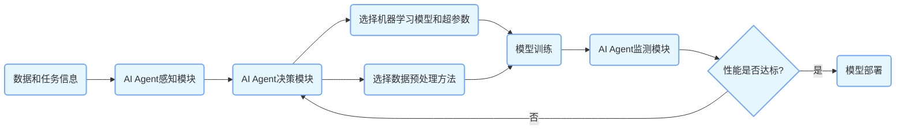

# AI Agent的自动机器学习(AutoML)应用

> 关键词：AI Agent、自动机器学习、AutoML、模型选择、超参数调优

> 摘要：本文深入探讨了AI Agent在自动机器学习（AutoML）中的应用。首先介绍了AutoML的背景和相关概念，包括其目的、预期读者等。接着阐述了AI Agent与AutoML的核心概念及联系，通过详细的算法原理和具体操作步骤进行讲解，同时给出了相关的数学模型和公式。在项目实战部分，提供了代码实际案例并进行详细解释说明。之后探讨了AutoML的实际应用场景，推荐了相关的学习资源、开发工具框架以及论文著作。最后总结了AutoML的未来发展趋势与挑战，并给出了常见问题与解答以及扩展阅读和参考资料，旨在帮助读者全面了解AI Agent的自动机器学习应用。

## 1. 背景介绍 
### 1.1 目的和范围
自动机器学习（AutoML）的目的在于降低机器学习的技术门槛，让更多非专业人士也能够利用机器学习解决实际问题。传统的机器学习开发过程需要专业的数据科学家进行数据预处理、特征工程、模型选择、超参数调优等一系列复杂的操作，这不仅耗时耗力，还对开发者的专业知识要求较高。AutoML通过自动化这些流程，使得即使是没有深厚机器学习背景的用户也能快速得到有效的机器学习模型。

本文的范围主要聚焦于AI Agent在AutoML中的应用，涵盖了从核心概念到算法原理、数学模型、项目实战以及实际应用场景等多个方面，旨在全面深入地探讨这一领域的相关知识。

### 1.2 预期读者
本文预期读者包括但不限于以下几类人群：
- 对机器学习和人工智能领域感兴趣的初学者，希望通过本文了解AutoML的基本概念和应用。
- 数据科学家和机器学习工程师，想要深入研究AI Agent在AutoML中的具体实现和优化方法。
- 企业的技术决策者和业务人员，希望了解AutoML如何应用于实际业务场景，以提高效率和竞争力。
- 研究机构的科研人员，关注AutoML领域的最新研究进展和发展趋势。

### 1.3 文档结构概述
本文将按照以下结构进行组织：
- 背景介绍：阐述AutoML的目的、范围、预期读者以及文档结构概述，并给出相关术语的定义和解释。
- 核心概念与联系：介绍AI Agent和AutoML的核心概念，以及它们之间的联系，并通过文本示意图和Mermaid流程图进行展示。
- 核心算法原理 & 具体操作步骤：详细讲解AI Agent在AutoML中应用的核心算法原理，并给出具体的操作步骤，同时使用Python源代码进行阐述。
- 数学模型和公式 & 详细讲解 & 举例说明：介绍AutoML中涉及的数学模型和公式，并进行详细讲解和举例说明。
- 项目实战：代码实际案例和详细解释说明：通过实际项目案例，展示如何使用AI Agent进行AutoML开发，包括开发环境搭建、源代码详细实现和代码解读。
- 实际应用场景：探讨AutoML在不同领域的实际应用场景。
- 工具和资源推荐：推荐相关的学习资源、开发工具框架以及论文著作。
- 总结：未来发展趋势与挑战：总结AutoML的未来发展趋势和面临的挑战。
- 附录：常见问题与解答：解答读者在学习和实践过程中常见的问题。
- 扩展阅读 & 参考资料：提供相关的扩展阅读资料和参考书目。

### 1.4 术语表
#### 1.4.1 核心术语定义
- **AI Agent（人工智能智能体）**：是一种能够感知环境、做出决策并采取行动的智能实体。它可以根据环境的变化自动调整自己的行为，以实现特定的目标。
- **自动机器学习（AutoML）**：是一种通过自动化的方式来完成机器学习流程的技术，包括数据预处理、特征工程、模型选择、超参数调优等。
- **模型选择**：在众多的机器学习模型中选择最适合当前任务的模型。
- **超参数调优**：对机器学习模型的超参数进行优化，以提高模型的性能。

#### 1.4.2 相关概念解释
- **数据预处理**：对原始数据进行清洗、转换、归一化等操作，以提高数据的质量和可用性。
- **特征工程**：从原始数据中提取有用的特征，以提高模型的性能。
- **机器学习模型**：用于对数据进行建模和预测的数学模型，如决策树、神经网络、支持向量机等。

#### 1.4.3 缩略词列表
- **AutoML**：Automatic Machine Learning（自动机器学习）
- **AI**：Artificial Intelligence（人工智能）

## 2. 核心概念与联系 

### 2.1 AI Agent的核心概念
AI Agent是一个能够感知环境、做出决策并采取行动的智能实体。它通常由以下几个部分组成：
- **感知模块**：用于感知环境的状态和信息。
- **决策模块**：根据感知到的信息，做出相应的决策。
- **行动模块**：根据决策结果，采取相应的行动。

AI Agent可以分为不同的类型，如反应式智能体、基于模型的智能体、基于目标的智能体和基于效用的智能体等。不同类型的AI Agent适用于不同的应用场景。

### 2.2 AutoML的核心概念
AutoML是一种通过自动化的方式来完成机器学习流程的技术。它的主要目标是降低机器学习的技术门槛，让更多非专业人士也能够利用机器学习解决实际问题。AutoML的主要流程包括：
- **数据预处理**：对原始数据进行清洗、转换、归一化等操作，以提高数据的质量和可用性。
- **特征工程**：从原始数据中提取有用的特征，以提高模型的性能。
- **模型选择**：在众多的机器学习模型中选择最适合当前任务的模型。
- **超参数调优**：对机器学习模型的超参数进行优化，以提高模型的性能。

### 2.3 AI Agent与AutoML的联系
AI Agent可以在AutoML中发挥重要作用。例如，AI Agent可以根据数据的特点和任务的要求，自动选择合适的机器学习模型和超参数。AI Agent还可以在模型训练过程中进行实时监测和调整，以提高模型的性能。

下面是AI Agent与AutoML联系的文本示意图：

AI Agent通过感知模块获取数据和任务信息，决策模块根据这些信息选择合适的机器学习模型和超参数，行动模块执行相应的操作，如数据预处理、模型训练等。在模型训练过程中，AI Agent可以实时监测模型的性能，并根据监测结果调整模型和超参数，以提高模型的性能。

### 2.4 Mermaid流程图


## 3. 核心算法原理 & 具体操作步骤 

### 3.1 核心算法原理
AI Agent在AutoML中应用的核心算法主要包括模型选择算法和超参数调优算法。

#### 3.1.1 模型选择算法
模型选择算法的目标是在众多的机器学习模型中选择最适合当前任务的模型。常用的模型选择算法包括：
- **穷举搜索**：对所有可能的模型进行评估，选择性能最好的模型。
- **随机搜索**：随机选择一些模型进行评估，选择性能最好的模型。
- **贝叶斯优化**：根据模型的先验知识和历史评估结果，选择最有潜力的模型进行评估。

#### 3.1.2 超参数调优算法
超参数调优算法的目标是对机器学习模型的超参数进行优化，以提高模型的性能。常用的超参数调优算法包括：
- **网格搜索**：对所有可能的超参数组合进行评估，选择性能最好的组合。
- **随机搜索**：随机选择一些超参数组合进行评估，选择性能最好的组合。
- **贝叶斯优化**：根据超参数的先验知识和历史评估结果，选择最有潜力的超参数组合进行评估。

### 3.2 具体操作步骤
下面是AI Agent在AutoML中应用的具体操作步骤：
1. **数据收集和预处理**：收集相关的数据，并对数据进行清洗、转换、归一化等操作。
2. **AI Agent初始化**：初始化AI Agent的感知模块、决策模块和行动模块。
3. **模型选择**：AI Agent根据数据的特点和任务的要求，选择合适的机器学习模型。
4. **超参数调优**：AI Agent对选择的模型进行超参数调优，以提高模型的性能。
5. **模型训练**：使用调优后的超参数对模型进行训练。
6. **模型评估**：对训练好的模型进行评估，检查模型的性能是否达标。
7. **模型部署**：如果模型的性能达标，则将模型部署到实际应用中。

### 3.3 Python源代码实现
下面是一个使用Python实现AI Agent在AutoML中应用的示例代码：

```python
import numpy as np
from sklearn.datasets import load_iris
from sklearn.model_selection import train_test_split
from sklearn.ensemble import RandomForestClassifier
from sklearn.svm import SVC
from sklearn.model_selection import GridSearchCV

# 数据收集和预处理
iris = load_iris()
X = iris.data
y = iris.target
X_train, X_test, y_train, y_test = train_test_split(X, y, test_size=0.2, random_state=42)

# AI Agent初始化
class AIAgent:
    def __init__(self):
        self.models = [RandomForestClassifier(), SVC()]
        self.param_grids = [
            {'n_estimators': [50, 100, 200], 'max_depth': [None, 10, 20]},
            {'C': [0.1, 1, 10], 'kernel': ['linear', 'rbf']}
        ]

    def select_model(self, X, y):
        best_score = -np.inf
        best_model = None
        for i in range(len(self.models)):
            model = self.models[i]
            param_grid = self.param_grids[i]
            grid_search = GridSearchCV(model, param_grid, cv=3)
            grid_search.fit(X, y)
            if grid_search.best_score_ > best_score:
                best_score = grid_search.best_score_
                best_model = grid_search.best_estimator_
        return best_model

# AI Agent实例化
agent = AIAgent()

# 模型选择
best_model = agent.select_model(X_train, y_train)

# 模型训练
best_model.fit(X_train, y_train)

# 模型评估
score = best_model.score(X_test, y_test)
print(f"模型评估得分: {score}")
```

在这个示例代码中，我们首先收集了鸢尾花数据集，并对数据进行了划分。然后定义了一个AI Agent类，该类包含了多个机器学习模型和对应的超参数网格。在`select_model`方法中，AI Agent使用网格搜索算法对每个模型进行超参数调优，并选择性能最好的模型。最后，我们使用选择的模型进行训练和评估。

## 4. 数学模型和公式 & 详细讲解 & 举例说明 

### 4.1 模型选择的数学模型和公式
在模型选择中，我们通常使用交叉验证来评估模型的性能。交叉验证的基本思想是将数据集划分为多个子集，然后在不同的子集上进行训练和测试，最后取所有测试结果的平均值作为模型的性能指标。

假设我们有一个数据集 $D$，将其划分为 $k$ 个子集 $D_1, D_2, \cdots, D_k$。对于每个子集 $D_i$，我们使用其余的 $k-1$ 个子集进行训练，得到一个模型 $M_i$，然后在 $D_i$ 上进行测试，得到一个测试结果 $s_i$。模型的性能指标 $S$ 可以定义为：

$$S = \frac{1}{k} \sum_{i=1}^{k} s_i$$

例如，在上面的示例代码中，我们使用了3折交叉验证（$k=3$），通过网格搜索算法对每个模型进行超参数调优，并选择性能最好的模型。

### 4.2 超参数调优的数学模型和公式
在超参数调优中，我们通常使用目标函数来评估超参数组合的性能。目标函数的输入是超参数组合，输出是模型的性能指标。我们的目标是找到使目标函数值最大的超参数组合。

假设我们有一个目标函数 $f(\theta)$，其中 $\theta$ 是超参数组合。我们的目标是找到 $\theta^*$，使得：

$$\theta^* = \arg \max_{\theta} f(\theta)$$

常用的超参数调优算法，如网格搜索、随机搜索和贝叶斯优化，都是通过不同的方法来搜索 $\theta^*$。

例如，在上面的示例代码中，我们使用了网格搜索算法，对每个模型的超参数网格进行遍历，计算每个超参数组合的性能指标，然后选择性能最好的超参数组合。

### 4.3 举例说明
下面我们通过一个具体的例子来说明模型选择和超参数调优的过程。

假设我们有一个二分类问题，数据集包含1000个样本，每个样本有10个特征。我们选择了两个模型：逻辑回归和支持向量机。逻辑回归的超参数包括正则化系数 $C$，支持向量机的超参数包括正则化系数 $C$ 和核函数类型。

我们使用5折交叉验证来评估模型的性能，目标函数是准确率。我们使用网格搜索算法对每个模型的超参数进行调优。

逻辑回归的超参数网格为：$C = [0.1, 1, 10]$。
支持向量机的超参数网格为：$C = [0.1, 1, 10]$，核函数类型 $= ['linear', 'rbf']$。

通过网格搜索算法，我们计算每个超参数组合的准确率，然后选择准确率最高的超参数组合和对应的模型。

## 5. 项目实战：代码实际案例和详细解释说明 

### 5.1  开发环境搭建
在进行AutoML项目实战之前，我们需要搭建开发环境。以下是具体的步骤：

#### 5.1.1 安装Python
首先，我们需要安装Python。建议安装Python 3.7及以上版本。可以从Python官方网站（https://www.python.org/downloads/）下载并安装Python。

#### 5.1.2 安装必要的库
我们需要安装一些必要的Python库，如`scikit-learn`、`numpy`、`pandas`等。可以使用`pip`命令进行安装：

```sh
pip install scikit-learn numpy pandas
```

### 5.2  源代码详细实现和代码解读
下面我们以一个房价预测问题为例，展示如何使用AI Agent进行AutoML开发。

```python
import numpy as np
import pandas as pd
from sklearn.datasets import fetch_california_housing
from sklearn.model_selection import train_test_split
from sklearn.ensemble import RandomForestRegressor
from sklearn.linear_model import LinearRegression
from sklearn.model_selection import GridSearchCV
from sklearn.metrics import mean_squared_error

# 数据收集和预处理
housing = fetch_california_housing()
X = housing.data
y = housing.target
X_train, X_test, y_train, y_test = train_test_split(X, y, test_size=0.2, random_state=42)

# AI Agent初始化
class AIAgent:
    def __init__(self):
        self.models = [RandomForestRegressor(), LinearRegression()]
        self.param_grids = [
            {'n_estimators': [50, 100, 200], 'max_depth': [None, 10, 20]},
            {}
        ]

    def select_model(self, X, y):
        best_score = np.inf
        best_model = None
        for i in range(len(self.models)):
            model = self.models[i]
            param_grid = self.param_grids[i]
            grid_search = GridSearchCV(model, param_grid, cv=3, scoring='neg_mean_squared_error')
            grid_search.fit(X, y)
            if -grid_search.best_score_ < best_score:
                best_score = -grid_search.best_score_
                best_model = grid_search.best_estimator_
        return best_model

# AI Agent实例化
agent = AIAgent()

# 模型选择
best_model = agent.select_model(X_train, y_train)

# 模型训练
best_model.fit(X_train, y_train)

# 模型评估
y_pred = best_model.predict(X_test)
mse = mean_squared_error(y_test, y_pred)
print(f"均方误差: {mse}")
```

### 5.3  代码解读与分析
#### 5.3.1 数据收集和预处理
```python
housing = fetch_california_housing()
X = housing.data
y = housing.target
X_train, X_test, y_train, y_test = train_test_split(X, y, test_size=0.2, random_state=42)
```
这段代码使用`fetch_california_housing`函数从`sklearn`库中获取加利福尼亚房价数据集。然后将数据集划分为训练集和测试集，测试集占总数据集的20%。

#### 5.3.2 AI Agent初始化
```python
class AIAgent:
    def __init__(self):
        self.models = [RandomForestRegressor(), LinearRegression()]
        self.param_grids = [
            {'n_estimators': [50, 100, 200], 'max_depth': [None, 10, 20]},
            {}
        ]
```
这段代码定义了一个AI Agent类，在初始化方法中，我们定义了两个机器学习模型：随机森林回归器和线性回归器。同时，我们为随机森林回归器定义了超参数网格，而线性回归器没有需要调优的超参数，所以其超参数网格为空。

#### 5.3.3 模型选择
```python
def select_model(self, X, y):
    best_score = np.inf
    best_model = None
    for i in range(len(self.models)):
        model = self.models[i]
        param_grid = self.param_grids[i]
        grid_search = GridSearchCV(model, param_grid, cv=3, scoring='neg_mean_squared_error')
        grid_search.fit(X, y)
        if -grid_search.best_score_ < best_score:
            best_score = -grid_search.best_score_
            best_model = grid_search.best_estimator_
    return best_model
```
这段代码定义了`select_model`方法，在该方法中，我们使用网格搜索算法对每个模型进行超参数调优，并选择均方误差最小的模型作为最佳模型。

#### 5.3.4 模型训练和评估
```python
# AI Agent实例化
agent = AIAgent()

# 模型选择
best_model = agent.select_model(X_train, y_train)

# 模型训练
best_model.fit(X_train, y_train)

# 模型评估
y_pred = best_model.predict(X_test)
mse = mean_squared_error(y_test, y_pred)
print(f"均方误差: {mse}")
```
这段代码实例化了AI Agent，调用`select_model`方法选择最佳模型，然后使用训练集对最佳模型进行训练，最后使用测试集对模型进行评估，计算均方误差。

## 6. 实际应用场景 
### 6.1 金融领域
在金融领域，AutoML可以用于风险评估、信贷审批、股票价格预测等任务。例如，银行可以使用AutoML自动选择合适的模型和超参数，对客户的信用风险进行评估，提高信贷审批的效率和准确性。

### 6.2 医疗领域
在医疗领域，AutoML可以用于疾病诊断、药物研发、医疗影像分析等任务。例如，医院可以使用AutoML自动选择合适的模型和超参数，对患者的医疗影像进行分析，辅助医生进行疾病诊断。

### 6.3 零售领域
在零售领域，AutoML可以用于商品推荐、销售预测、客户细分等任务。例如，电商平台可以使用AutoML自动选择合适的模型和超参数，对用户的购买行为进行分析，为用户提供个性化的商品推荐。

### 6.4 工业领域
在工业领域，AutoML可以用于设备故障预测、生产过程优化、质量控制等任务。例如，工厂可以使用AutoML自动选择合适的模型和超参数，对设备的运行状态进行监测，提前预测设备故障，减少停机时间。

## 7. 工具和资源推荐
### 7.1 学习资源推荐
#### 7.1.1 书籍推荐
- 《机器学习》（周志华）：这本书是机器学习领域的经典教材，涵盖了机器学习的基本概念、算法和应用。
- 《Python机器学习》（Sebastian Raschka）：这本书介绍了如何使用Python进行机器学习开发，包括数据预处理、模型选择、超参数调优等内容。
- 《深度学习》（Ian Goodfellow、Yoshua Bengio、Aaron Courville）：这本书是深度学习领域的经典教材，涵盖了深度学习的基本概念、算法和应用。

#### 7.1.2 在线课程
- Coursera上的“机器学习”课程（Andrew Ng）：这是一门非常经典的机器学习课程，介绍了机器学习的基本概念、算法和应用。
- edX上的“深度学习”课程（Geoffrey Hinton）：这是一门深度学习领域的权威课程，由深度学习领域的先驱Geoffrey Hinton授课。
- 吴恩达的“机器学习专项课程”：该课程深入介绍了机器学习的各个方面，包括监督学习、无监督学习、深度学习等。

#### 7.1.3 技术博客和网站
- Medium：这是一个技术博客平台，上面有很多关于机器学习和人工智能的优秀文章。
- Towards Data Science：这是一个专注于数据科学和机器学习的网站，上面有很多高质量的技术文章和教程。
- Kaggle：这是一个数据科学竞赛平台，上面有很多关于机器学习和人工智能的数据集、代码和竞赛。

### 7.2 开发工具框架推荐
#### 7.2.1 IDE和编辑器
- PyCharm：这是一个专业的Python集成开发环境，提供了丰富的功能和插件，方便进行Python开发。
- Jupyter Notebook：这是一个交互式的开发环境，适合进行数据探索和模型实验。
- Visual Studio Code：这是一个轻量级的代码编辑器，支持多种编程语言，并且有丰富的插件。

#### 7.2.2 调试和性能分析工具
- PySnooper：这是一个简单易用的Python调试工具，可以帮助开发者快速定位代码中的问题。
- cProfile：这是Python标准库中的性能分析工具，可以帮助开发者分析代码的性能瓶颈。
- TensorBoard：这是一个深度学习可视化工具，可以帮助开发者可视化模型的训练过程和性能。

#### 7.2.3 相关框架和库
- scikit-learn：这是一个常用的机器学习框架，提供了丰富的机器学习算法和工具。
- TensorFlow：这是一个开源的深度学习框架，由Google开发，广泛应用于深度学习领域。
- PyTorch：这是一个开源的深度学习框架，由Facebook开发，具有动态计算图等特点。

### 7.3 相关论文著作推荐
#### 7.3.1 经典论文
- “AutoML: A Survey of the State-of-the-Art”：这篇论文对AutoML的发展现状进行了全面的综述。
- “Algorithms for Hyper-Parameter Optimization”：这篇论文介绍了超参数优化的算法。
- “A Hyperparameter Optimization Algorithm for Deep Neural Networks”：这篇论文提出了一种用于深度神经网络的超参数优化算法。

#### 7.3.2 最新研究成果
- 可以关注顶级学术会议，如NeurIPS、ICML、CVPR等，上面有很多关于AutoML的最新研究成果。
- 可以关注顶级学术期刊，如Journal of Artificial Intelligence Research（JAIR）、Artificial Intelligence等，上面也有很多关于AutoML的高质量研究论文。

#### 7.3.3 应用案例分析
- 可以在Kaggle上查找AutoML的应用案例，上面有很多真实的数据集和代码，以及详细的分析和解释。
- 可以关注一些企业的技术博客，如Google AI Blog、Facebook AI Research等，上面有很多关于AutoML在实际应用中的案例分析。

## 8. 总结：未来发展趋势与挑战
### 8.1 未来发展趋势
- **自动化程度不断提高**：未来，AutoML将实现更高程度的自动化，不仅能够自动完成模型选择和超参数调优，还能够自动进行数据预处理、特征工程等复杂任务。
- **与其他技术的融合**：AutoML将与深度学习、强化学习、迁移学习等技术进行深度融合，提高模型的性能和泛化能力。
- **应用领域不断拓展**：AutoML将在更多的领域得到应用，如物联网、智能家居、自动驾驶等，为这些领域的发展提供有力支持。

### 8.2 挑战
- **计算资源需求高**：AutoML需要进行大量的模型训练和超参数调优，对计算资源的需求较高，这限制了其在一些资源受限环境中的应用。
- **模型可解释性差**：一些复杂的机器学习模型，如深度学习模型，其可解释性较差，这在一些对模型可解释性要求较高的领域，如医疗、金融等，存在一定的应用障碍。
- **数据隐私和安全问题**：AutoML需要处理大量的数据，这涉及到数据隐私和安全问题。如何在保证数据隐私和安全的前提下，进行有效的AutoML开发，是一个亟待解决的问题。

## 9. 附录：常见问题与解答
### 9.1 AutoML是否可以完全替代数据科学家？
AutoML虽然可以自动化一些机器学习流程，但不能完全替代数据科学家。数据科学家在数据理解、业务需求分析、模型解释等方面具有重要作用，而这些是AutoML目前无法完全替代的。

### 9.2 AutoML在处理大规模数据集时性能如何？
AutoML在处理大规模数据集时，由于需要进行大量的模型训练和超参数调优，性能可能会受到一定影响。可以采用分布式计算、采样等技术来提高性能。

### 9.3 如何选择合适的AutoML工具？
选择合适的AutoML工具需要考虑多个因素，如工具的功能、易用性、性能、可扩展性等。可以根据具体的应用场景和需求来选择合适的工具。

## 10. 扩展阅读 & 参考资料
### 10.1 扩展阅读
- 《人工智能：一种现代的方法》（Stuart Russell、Peter Norvig）：这本书是人工智能领域的经典教材，涵盖了人工智能的各个方面。
- 《数据挖掘：概念与技术》（Jiawei Han、Jian Pei、Jianwen Yin）：这本书介绍了数据挖掘的基本概念、算法和应用。
- 《Python数据科学手册》（Jake VanderPlas）：这本书介绍了如何使用Python进行数据科学开发，包括数据处理、数据分析、数据可视化等内容。

### 10.2 参考资料
- 相关的学术论文和研究报告。
- 开源项目的文档和代码。
- 技术博客和论坛上的讨论和分享。