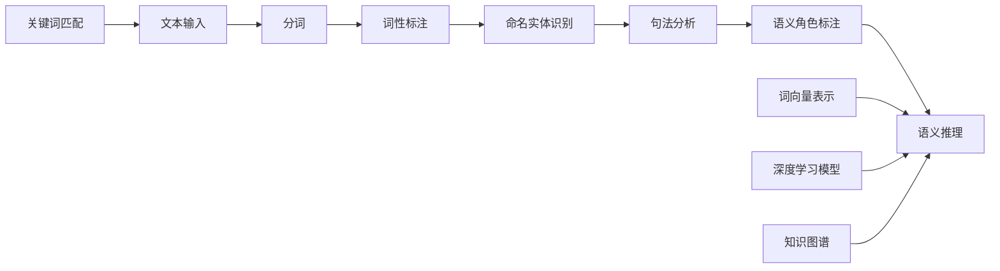

# AI Agent的语义理解：超越关键词匹配

> 关键词：AI Agent、语义理解、关键词匹配、自然语言处理、知识图谱、深度学习、上下文感知

> 摘要：本文聚焦于AI Agent的语义理解，深入探讨其如何超越传统的关键词匹配。首先介绍了语义理解在AI Agent领域的背景和重要性，阐述了核心概念及其联系，详细讲解了相关的核心算法原理与具体操作步骤，并结合数学模型和公式进行理论分析。通过项目实战展示了语义理解在实际中的应用，探讨了其广泛的实际应用场景。同时推荐了学习、开发相关的工具和资源，最后总结了未来发展趋势与挑战，还提供了常见问题解答和扩展阅读参考资料，旨在全面呈现AI Agent语义理解的深度与广度，帮助读者深入理解这一前沿技术。

## 1. 背景介绍 
### 1.1 目的和范围
随着人工智能技术的飞速发展，AI Agent在各个领域的应用日益广泛，如智能客服、智能助手、信息检索等。然而，传统的基于关键词匹配的方法在处理自然语言时存在明显的局限性，无法准确理解用户输入的语义。本文章的目的在于深入探讨AI Agent如何实现超越关键词匹配的语义理解，涵盖自然语言处理、机器学习、知识图谱等多个相关领域的技术和方法，旨在为读者提供全面且深入的技术解析和应用指导。

### 1.2 预期读者
本文预期读者包括对人工智能、自然语言处理领域感兴趣的技术爱好者、从事相关领域研究和开发的专业人员、高校计算机科学及相关专业的师生等。无论您是初学者希望了解AI Agent语义理解的基本概念，还是有一定经验的开发者想要深入探索相关技术的实现细节，都能从本文中获得有价值的信息。

### 1.3 文档结构概述
本文将按照以下结构展开：首先介绍语义理解相关的背景知识，包括目的、预期读者等；接着阐述核心概念及其联系，通过文本示意图和Mermaid流程图进行直观展示；然后详细讲解核心算法原理和具体操作步骤，并结合Python源代码进行说明；再介绍相关的数学模型和公式，并举例说明；通过项目实战展示代码实现和详细解释；探讨实际应用场景；推荐学习、开发相关的工具和资源；最后总结未来发展趋势与挑战，提供常见问题解答和扩展阅读参考资料。

### 1.4 术语表
#### 1.4.1 核心术语定义
- **AI Agent**：即人工智能代理，是一种能够感知环境、进行决策并采取行动以实现特定目标的智能实体。
- **语义理解**：指计算机能够理解自然语言中所表达的意义，包括词语、句子和篇章的含义，以及它们之间的逻辑关系。
- **关键词匹配**：一种简单的文本处理方法，通过在文本中查找预定义的关键词来进行信息检索和处理。

#### 1.4.2 相关概念解释
- **自然语言处理（NLP）**：是人工智能领域的一个重要分支，主要研究如何让计算机处理和理解人类语言，包括文本分类、情感分析、机器翻译等任务。
- **知识图谱**：是一种以图的形式表示知识的结构化数据，用于存储实体、概念及其之间的关系，有助于提高语义理解的准确性。
- **深度学习**：是机器学习的一个分支，通过构建多层神经网络来学习数据的特征和模式，在自然语言处理中取得了显著的成果。

#### 1.4.3 缩略词列表
- **NLP**：自然语言处理（Natural Language Processing）
- **RNN**：循环神经网络（Recurrent Neural Network）
- **LSTM**：长短期记忆网络（Long Short-Term Memory）
- **GRU**：门控循环单元（Gated Recurrent Unit）
- **BERT**：基于Transformer的双向编码器表示（Bidirectional Encoder Representations from Transformers）

## 2. 核心概念与联系 
### 2.1 语义理解的基本原理
语义理解的目标是让计算机能够像人类一样理解自然语言的含义。传统的关键词匹配方法仅仅关注文本中出现的关键词，而忽略了词语之间的语义关系和上下文信息。例如，对于句子“苹果公司发布了新的iPhone”和“苹果是一种水果”，关键词匹配可能会将两个句子中的“苹果”视为相同的含义，而语义理解则需要区分出它们不同的语义。

语义理解通常涉及以下几个步骤：
1. **分词**：将文本分割成一个个词语或短语。
2. **词性标注**：确定每个词语的词性，如名词、动词、形容词等。
3. **命名实体识别**：识别文本中的命名实体，如人名、地名、组织机构名等。
4. **句法分析**：分析句子的语法结构，确定词语之间的关系。
5. **语义角色标注**：确定句子中每个词语的语义角色，如施事、受事等。
6. **语义推理**：根据上下文和知识库进行推理，理解文本的深层含义。

### 2.2 关键词匹配的局限性
关键词匹配是一种简单而直接的文本处理方法，它通过在文本中查找预定义的关键词来进行信息检索和处理。然而，这种方法存在以下局限性：
1. **语义歧义**：同一个关键词可能有不同的语义，关键词匹配无法区分这些歧义。例如，“银行”既可以指金融机构，也可以指河边。
2. **同义词和近义词问题**：关键词匹配只能匹配完全相同的关键词，对于同义词和近义词无法进行有效的处理。例如，“汽车”和“轿车”意思相近，但关键词匹配可能无法将它们视为相同的概念。
3. **上下文理解不足**：关键词匹配只关注单个关键词，忽略了上下文信息，无法理解文本的整体含义。例如，对于句子“他去银行存钱”和“他在银行旁边散步”，关键词匹配无法区分“银行”在不同上下文中的不同含义。

### 2.3 超越关键词匹配的语义理解方法
为了超越关键词匹配的局限性，需要采用更高级的语义理解方法，主要包括以下几种：
1. **词向量表示**：将词语表示为低维向量，通过向量之间的距离来衡量词语之间的语义相似度。常见的词向量模型有Word2Vec、GloVe等。
2. **深度学习模型**：如循环神经网络（RNN）、长短期记忆网络（LSTM）、门控循环单元（GRU）和Transformer等，这些模型能够学习文本的序列信息和上下文信息，从而提高语义理解的准确性。
3. **知识图谱**：将实体、概念及其之间的关系以图的形式表示，为语义理解提供丰富的背景知识。例如，在知识图谱中可以明确“苹果公司”和“苹果（水果）”的不同含义。

### 2.4 核心概念联系的文本示意图
```plaintext
语义理解
|-- 分词
|-- 词性标注
|-- 命名实体识别
|-- 句法分析
|-- 语义角色标注
|-- 语义推理
|
|-- 超越关键词匹配方法
    |-- 词向量表示
    |-- 深度学习模型
    |   |-- RNN
    |   |-- LSTM
    |   |-- GRU
    |   |-- Transformer
    |-- 知识图谱
```

### 2.5 Mermaid流程图


## 3. 核心算法原理 & 具体操作步骤 
### 3.1 词向量表示算法 - Word2Vec
#### 3.1.1 算法原理
Word2Vec是一种用于学习词向量的无监督学习算法，其基本思想是通过预测上下文来学习词语的表示。Word2Vec有两种主要的模型架构：连续词袋模型（CBOW）和跳字模型（Skip-gram）。

- **连续词袋模型（CBOW）**：根据上下文词语预测中心词语。例如，对于句子“我 喜欢 吃 苹果”，以“吃”为中心词语，其上下文词语为“我”、“喜欢”、“苹果”，CBOW模型通过这些上下文词语来预测中心词语“吃”。
- **跳字模型（Skip-gram）**：根据中心词语预测上下文词语。同样对于句子“我 喜欢 吃 苹果”，跳字模型通过中心词语“吃”来预测其上下文词语“我”、“喜欢”、“苹果”。

#### 3.1.2 Python源代码实现
```python
from gensim.models import Word2Vec
import numpy as np

# 示例文本数据
sentences = [["我", "喜欢", "吃", "苹果"], ["他", "喜欢", "喝", "牛奶"]]

# 训练Word2Vec模型
model = Word2Vec(sentences, min_count=1)

# 获取词语的词向量
word_vector = model.wv['苹果']
print("苹果的词向量:", word_vector)

# 查找最相似的词语
similar_words = model.wv.most_similar('苹果')
print("与苹果最相似的词语:", similar_words)
```
#### 3.1.3 具体操作步骤
1. **数据准备**：将文本数据进行分词处理，得到一个个词语的列表。
2. **模型训练**：使用Word2Vec模型对分词后的文本数据进行训练，设置合适的参数，如窗口大小、词向量维度等。
3. **词向量获取**：训练完成后，可以获取每个词语的词向量，用于后续的语义分析。
4. **相似度计算**：通过计算词向量之间的相似度，可以查找与某个词语最相似的其他词语。

### 3.2 深度学习模型 - LSTM
#### 3.2.1 算法原理
长短期记忆网络（LSTM）是一种特殊的循环神经网络（RNN），它能够解决传统RNN在处理长序列时的梯度消失问题。LSTM通过引入门控机制来控制信息的流动，包括输入门、遗忘门和输出门。

- **遗忘门**：决定上一时刻的细胞状态有多少信息需要被遗忘。
- **输入门**：决定当前时刻的输入有多少信息需要被添加到细胞状态中。
- **输出门**：决定当前时刻的细胞状态有多少信息需要被输出。

#### 3.2.2 Python源代码实现
```python
import tensorflow as tf
from tensorflow.keras.layers import LSTM, Dense
from tensorflow.keras.models import Sequential
import numpy as np

# 示例数据
input_data = np.random.rand(100, 10, 5)  # 100个样本，每个样本长度为10，特征维度为5
target_data = np.random.randint(0, 2, 100)  # 100个样本的标签

# 构建LSTM模型
model = Sequential()
model.add(LSTM(64, input_shape=(10, 5)))
model.add(Dense(1, activation='sigmoid'))

# 编译模型
model.compile(optimizer='adam', loss='binary_crossentropy', metrics=['accuracy'])

# 训练模型
model.fit(input_data, target_data, epochs=10, batch_size=32)
```
#### 3.2.3 具体操作步骤
1. **数据准备**：将文本数据转换为适合LSTM模型输入的格式，通常是将词语转换为词向量，然后将句子转换为词向量序列。
2. **模型构建**：使用Keras或其他深度学习框架构建LSTM模型，设置合适的参数，如LSTM单元数、输出层的激活函数等。
3. **模型编译**：选择合适的优化器、损失函数和评估指标，对模型进行编译。
4. **模型训练**：使用准备好的数据对模型进行训练，设置合适的训练轮数和批次大小。

## 4. 数学模型和公式 & 详细讲解 & 举例说明 
### 4.1 Word2Vec的数学模型和公式
#### 4.1.1 连续词袋模型（CBOW）
在CBOW模型中，给定上下文词语 $w_{c - m}, \cdots, w_{c - 1}, w_{c + 1}, \cdots, w_{c + m}$（其中 $m$ 是窗口大小，$c$ 是中心词语的位置），目标是预测中心词语 $w_c$。

CBOW模型的目标函数是最大化以下对数似然函数：
$$
\mathcal{L} = \sum_{t = 1}^{T} \log p(w_t | w_{t - m}, \cdots, w_{t - 1}, w_{t + 1}, \cdots, w_{t + m})
$$
其中 $T$ 是文本的长度。

$p(w_t | w_{t - m}, \cdots, w_{t - 1}, w_{t + 1}, \cdots, w_{t + m})$ 可以通过softmax函数计算：
$$
p(w_t | w_{t - m}, \cdots, w_{t - 1}, w_{t + 1}, \cdots, w_{t + m}) = \frac{\exp(\mathbf{v}_{w_t}^T \cdot \mathbf{\hat{h}})}{\sum_{w = 1}^{V} \exp(\mathbf{v}_{w}^T \cdot \mathbf{\hat{h}})}
$$
其中 $\mathbf{v}_{w}$ 是词语 $w$ 的输出向量，$\mathbf{\hat{h}}$ 是上下文词语的平均词向量。

#### 4.1.2 跳字模型（Skip-gram）
在跳字模型中，给定中心词语 $w_c$，目标是预测其上下文词语 $w_{c - m}, \cdots, w_{c - 1}, w_{c + 1}, \cdots, w_{c + m}$。

跳字模型的目标函数是最大化以下对数似然函数：
$$
\mathcal{L} = \sum_{t = 1}^{T} \sum_{-m \leq j \leq m, j \neq 0} \log p(w_{t + j} | w_t)
$$
其中 $p(w_{t + j} | w_t)$ 同样通过softmax函数计算：
$$
p(w_{t + j} | w_t) = \frac{\exp(\mathbf{v}_{w_{t + j}}^T \cdot \mathbf{v}_{w_t})}{\sum_{w = 1}^{V} \exp(\mathbf{v}_{w}^T \cdot \mathbf{v}_{w_t})}
$$
其中 $\mathbf{v}_{w}$ 是词语 $w$ 的输出向量，$\mathbf{v}_{w_t}$ 是中心词语 $w_t$ 的输入向量。

#### 4.1.3 举例说明
假设我们有一个包含3个词语的句子“我 喜欢 苹果”，窗口大小 $m = 1$。对于CBOW模型，以“喜欢”为中心词语，上下文词语为“我”和“苹果”。我们需要计算给定“我”和“苹果”的情况下，预测“喜欢”的概率。对于跳字模型，以“喜欢”为中心词语，我们需要计算给定“喜欢”的情况下，预测“我”和“苹果”的概率。

### 4.2 LSTM的数学模型和公式
#### 4.2.1 遗忘门
遗忘门的计算公式为：
$$
\mathbf{f}_t = \sigma(\mathbf{W}_f \cdot [\mathbf{h}_{t - 1}, \mathbf{x}_t] + \mathbf{b}_f)
$$
其中 $\mathbf{f}_t$ 是遗忘门的输出，$\sigma$ 是sigmoid函数，$\mathbf{W}_f$ 是遗忘门的权重矩阵，$\mathbf{h}_{t - 1}$ 是上一时刻的隐藏状态，$\mathbf{x}_t$ 是当前时刻的输入，$\mathbf{b}_f$ 是遗忘门的偏置向量。

#### 4.2.2 输入门
输入门的计算公式为：
$$
\mathbf{i}_t = \sigma(\mathbf{W}_i \cdot [\mathbf{h}_{t - 1}, \mathbf{x}_t] + \mathbf{b}_i)
$$
其中 $\mathbf{i}_t$ 是输入门的输出，$\mathbf{W}_i$ 是输入门的权重矩阵，$\mathbf{b}_i$ 是输入门的偏置向量。

#### 4.2.3 细胞状态更新
细胞状态的更新公式为：
$$
\tilde{\mathbf{C}}_t = \tanh(\mathbf{W}_C \cdot [\mathbf{h}_{t - 1}, \mathbf{x}_t] + \mathbf{b}_C)
$$
$$
\mathbf{C}_t = \mathbf{f}_t \odot \mathbf{C}_{t - 1} + \mathbf{i}_t \odot \tilde{\mathbf{C}}_t
$$
其中 $\tilde{\mathbf{C}}_t$ 是候选细胞状态，$\tanh$ 是双曲正切函数，$\mathbf{W}_C$ 是细胞状态的权重矩阵，$\mathbf{b}_C$ 是细胞状态的偏置向量，$\odot$ 表示逐元素相乘。

#### 4.2.4 输出门
输出门的计算公式为：
$$
\mathbf{o}_t = \sigma(\mathbf{W}_o \cdot [\mathbf{h}_{t - 1}, \mathbf{x}_t] + \mathbf{b}_o)
$$
$$
\mathbf{h}_t = \mathbf{o}_t \odot \tanh(\mathbf{C}_t)
$$
其中 $\mathbf{o}_t$ 是输出门的输出，$\mathbf{W}_o$ 是输出门的权重矩阵，$\mathbf{b}_o$ 是输出门的偏置向量。

#### 4.2.5 举例说明
假设我们有一个LSTM单元，输入 $\mathbf{x}_t$ 的维度为5，隐藏状态 $\mathbf{h}_{t - 1}$ 的维度为10。遗忘门的权重矩阵 $\mathbf{W}_f$ 的维度为 $10 \times (5 + 10)$，偏置向量 $\mathbf{b}_f$ 的维度为10。通过上述公式，我们可以计算出遗忘门的输出 $\mathbf{f}_t$，进而更新细胞状态和隐藏状态。

## 5. 项目实战：代码实际案例和详细解释说明 
### 5.1  开发环境搭建
#### 5.1.1 安装Python
首先需要安装Python，建议使用Python 3.6及以上版本。可以从Python官方网站（https://www.python.org/downloads/）下载并安装。

#### 5.1.2 安装必要的库
使用pip命令安装以下必要的库：
```sh
pip install numpy tensorflow gensim
```
- **numpy**：用于数值计算。
- **tensorflow**：深度学习框架，用于构建和训练深度学习模型。
- **gensim**：用于词向量的训练和处理。

### 5.2  源代码详细实现和代码解读
#### 5.2.1 语义分类任务示例
以下是一个基于LSTM的语义分类任务的示例代码：
```python
import numpy as np
from tensorflow.keras.preprocessing.text import Tokenizer
from tensorflow.keras.preprocessing.sequence import pad_sequences
from tensorflow.keras.layers import LSTM, Dense, Embedding
from tensorflow.keras.models import Sequential
from sklearn.model_selection import train_test_split

# 示例数据
texts = ["我喜欢吃苹果", "他喜欢喝牛奶", "苹果是一种水果", "牛奶很有营养"]
labels = [0, 0, 1, 1]  # 0表示食物偏好，1表示食物属性

# 分词和向量化
tokenizer = Tokenizer()
tokenizer.fit_on_texts(texts)
sequences = tokenizer.texts_to_sequences(texts)
max_sequence_length = max([len(seq) for seq in sequences])
padded_sequences = pad_sequences(sequences, maxlen=max_sequence_length)

# 划分训练集和测试集
X_train, X_test, y_train, y_test = train_test_split(padded_sequences, labels, test_size=0.2, random_state=42)

# 构建LSTM模型
vocab_size = len(tokenizer.word_index) + 1
embedding_dim = 100
model = Sequential()
model.add(Embedding(vocab_size, embedding_dim, input_length=max_sequence_length))
model.add(LSTM(64))
model.add(Dense(1, activation='sigmoid'))

# 编译模型
model.compile(optimizer='adam', loss='binary_crossentropy', metrics=['accuracy'])

# 训练模型
model.fit(X_train, np.array(y_train), epochs=10, batch_size=32, validation_data=(X_test, np.array(y_test)))
```
#### 5.2.2 代码解读
1. **数据准备**：
    - 使用 `Tokenizer` 对文本数据进行分词和向量化处理，将文本转换为整数序列。
    - 使用 `pad_sequences` 对序列进行填充，使所有序列的长度相同。
    - 使用 `train_test_split` 函数将数据划分为训练集和测试集。
2. **模型构建**：
    - 使用 `Embedding` 层将整数序列转换为词向量表示。
    - 使用 `LSTM` 层学习文本的序列信息。
    - 使用 `Dense` 层进行分类，激活函数为 `sigmoid` 用于二分类任务。
3. **模型编译**：选择 `adam` 优化器，`binary_crossentropy` 损失函数和 `accuracy` 评估指标。
4. **模型训练**：使用训练集对模型进行训练，并在测试集上进行验证。

### 5.3  代码解读与分析
#### 5.3.1 模型性能分析
通过训练过程中的损失函数和评估指标（如准确率）可以评估模型的性能。在训练过程中，损失函数应该逐渐下降，准确率应该逐渐提高。如果模型在训练集上表现良好，但在测试集上表现较差，可能存在过拟合问题。

#### 5.3.2 改进方向
- **调整模型参数**：可以尝试调整LSTM单元数、词向量维度、训练轮数等参数，以提高模型的性能。
- **使用预训练词向量**：可以使用预训练的词向量（如Word2Vec、GloVe）代替随机初始化的词向量，以提高模型的泛化能力。
- **增加数据量**：如果数据量较小，可以尝试收集更多的数据进行训练，以提高模型的性能。

## 6. 实际应用场景 
### 6.1 智能客服
在智能客服系统中，AI Agent需要理解用户的问题并提供准确的回答。传统的关键词匹配方法可能无法准确理解用户的问题，而语义理解可以帮助AI Agent更好地理解用户的意图。例如，用户可能会问“你们的产品有哪些售后服务？”和“产品售后都有啥？”，语义理解可以将这两个问题视为相同的意图，从而提供统一的回答。

### 6.2 智能助手
智能助手（如Siri、小爱同学等）需要根据用户的语音指令完成各种任务。语义理解可以帮助智能助手准确理解用户的指令，例如，用户说“播放周杰伦的歌曲”，智能助手可以通过语义理解准确识别出用户的意图是播放周杰伦的歌曲，并执行相应的操作。

### 6.3 信息检索
在信息检索系统中，语义理解可以帮助提高检索的准确性。传统的关键词匹配可能会返回一些与用户需求无关的结果，而语义理解可以根据用户的查询意图，返回更相关的结果。例如，用户查询“苹果公司的新产品”，语义理解可以准确识别出用户想要了解苹果公司的新产品信息，而不是苹果（水果）的相关信息。

### 6.4 文本分类
在文本分类任务中，语义理解可以帮助准确判断文本的类别。例如，在情感分析中，通过语义理解可以判断文本是积极的、消极的还是中性的。在新闻分类中，可以根据文本的语义将新闻分为不同的类别，如政治、经济、娱乐等。

### 6.5 机器翻译
在机器翻译中，语义理解是非常重要的。翻译不仅仅是将词语进行简单的替换，还需要理解源语言的语义，并将其准确地翻译成目标语言。例如，“I love you” 翻译成中文不仅仅是 “我爱你”，还需要根据上下文和语气进行准确的翻译。

## 7. 工具和资源推荐
### 7.1 学习资源推荐
#### 7.1.1 书籍推荐
- 《深度学习》（Deep Learning）：由Ian Goodfellow、Yoshua Bengio和Aaron Courville合著，是深度学习领域的经典教材，涵盖了深度学习的基本原理、算法和应用。
- 《自然语言处理入门》：何晗著，适合初学者快速入门自然语言处理领域，介绍了自然语言处理的基本概念、算法和实践方法。
- 《Python自然语言处理》（Natural Language Processing with Python）：由Steven Bird、Ewan Klein和Edward Loper合著，通过Python代码详细介绍了自然语言处理的各种技术和应用。

#### 7.1.2 在线课程
- Coursera上的“深度学习专项课程”（Deep Learning Specialization）：由Andrew Ng教授授课，系统地介绍了深度学习的理论和实践，包括神经网络、卷积神经网络、循环神经网络等。
- edX上的“自然语言处理”（Natural Language Processing）：由哥伦比亚大学的教授授课，深入讲解了自然语言处理的各种技术和算法。
- 哔哩哔哩（B 站）上有许多关于自然语言处理和深度学习的视频教程，适合初学者学习。

#### 7.1.3 技术博客和网站
- Medium：有许多关于人工智能、自然语言处理的技术博客，作者们会分享最新的研究成果和实践经验。
- arXiv：是一个预印本数据库，提供了大量关于人工智能、自然语言处理的学术论文。
- 开源中国（OSChina）：有许多关于开源技术的文章和教程，包括自然语言处理和深度学习相关的内容。

### 7.2 开发工具框架推荐
#### 7.2.1 IDE和编辑器
- PyCharm：是一款专业的Python集成开发环境，提供了丰富的功能，如代码编辑、调试、版本控制等，适合Python开发。
- Jupyter Notebook：是一个交互式的开发环境，适合数据探索、模型训练和可视化等任务。
- Visual Studio Code：是一款轻量级的代码编辑器，支持多种编程语言，有丰富的插件可以扩展功能。

#### 7.2.2 调试和性能分析工具
- TensorBoard：是TensorFlow提供的可视化工具，可以用于查看模型的训练过程、损失函数曲线、准确率曲线等，帮助调试和优化模型。
- PyTorch Profiler：是PyTorch提供的性能分析工具，可以帮助分析模型的性能瓶颈，优化模型的运行效率。
- cProfile：是Python内置的性能分析工具，可以用于分析Python代码的性能瓶颈。

#### 7.2.3 相关框架和库
- TensorFlow：是一个开源的深度学习框架，提供了丰富的工具和接口，支持多种深度学习模型的构建和训练。
- PyTorch：是另一个开源的深度学习框架，具有简洁的API和动态图的特点，适合快速开发和实验。
- spaCy：是一个高效的自然语言处理库，提供了分词、词性标注、命名实体识别等多种自然语言处理功能。
- NLTK：是一个流行的自然语言处理库，提供了丰富的语料库和工具，适合自然语言处理的教学和研究。

### 7.3 相关论文著作推荐
#### 7.3.1 经典论文
- “Efficient Estimation of Word Representations in Vector Space”：介绍了Word2Vec算法，是词向量表示领域的经典论文。
- “Long Short-Term Memory”：介绍了LSTM算法，解决了传统RNN在处理长序列时的梯度消失问题。
- “Attention Is All You Need”：介绍了Transformer模型，是自然语言处理领域的重要突破。

#### 7.3.2 最新研究成果
- 关注ACL（Association for Computational Linguistics）、EMNLP（Conference on Empirical Methods in Natural Language Processing）等自然语言处理领域的顶级会议，这些会议上会发表最新的研究成果。
- 关注顶级学术期刊，如Journal of Artificial Intelligence Research（JAIR）、Artificial Intelligence等，这些期刊上会发表高质量的人工智能和自然语言处理研究论文。

#### 7.3.3 应用案例分析
- 许多科技公司会在其官方博客或技术论坛上分享AI Agent语义理解的应用案例，如Google、Microsoft、百度等公司的技术博客。
- 一些开源项目也会提供详细的应用案例和代码实现，如AllenNLP、Hugging Face等开源项目。

## 8. 总结：未来发展趋势与挑战
### 8.1 未来发展趋势
#### 8.1.1 多模态语义理解
未来的AI Agent将不仅仅局限于文本的语义理解，还将结合图像、语音、视频等多种模态的信息进行综合理解。例如，在智能客服系统中，用户可能会通过语音、图像等多种方式表达自己的需求，AI Agent需要能够理解这些多模态信息，并提供准确的回答。

#### 8.1.2 常识推理和知识融合
目前的语义理解技术在处理常识和背景知识方面还存在不足。未来的AI Agent将更加注重常识推理和知识融合，通过知识图谱等技术将大量的常识和背景知识融入到语义理解中，从而提高理解的准确性和深度。

#### 8.1.3 个性化语义理解
不同的用户可能有不同的语言习惯和需求，未来的AI Agent将能够根据用户的个性化信息进行语义理解。例如，根据用户的历史对话记录、偏好等信息，提供更加个性化的回答和服务。

#### 8.1.4 跨语言语义理解
随着全球化的发展，跨语言的交流和信息处理越来越频繁。未来的AI Agent将能够实现跨语言的语义理解，打破语言障碍，促进不同语言之间的交流和合作。

### 8.2 挑战
#### 8.2.1 数据质量和规模
语义理解需要大量高质量的数据进行训练，但是数据的收集、标注和清洗是一个非常耗时和费力的过程。此外，数据的质量也会直接影响模型的性能，如何获取高质量、大规模的数据是一个挑战。

#### 8.2.2 计算资源和效率
深度学习模型在语义理解中取得了很好的效果，但是这些模型通常需要大量的计算资源和时间进行训练。如何在有限的计算资源下提高模型的训练效率和推理速度是一个挑战。

#### 8.2.3 语义表示的准确性
目前的语义表示方法还存在一定的局限性，无法完全准确地表示自然语言的语义。如何设计更加准确、有效的语义表示方法是一个挑战。

#### 8.2.4 伦理和法律问题
随着AI Agent的广泛应用，伦理和法律问题也日益凸显。例如，AI Agent的回答可能会存在偏见、歧视等问题，如何确保AI Agent的行为符合伦理和法律要求是一个挑战。

## 9. 附录：常见问题与解答
### 9.1 什么是语义理解？
语义理解是指计算机能够理解自然语言中所表达的意义，包括词语、句子和篇章的含义，以及它们之间的逻辑关系。它不仅仅是对文本表面的关键词进行匹配，还需要考虑上下文信息、语义关系等因素。

### 9.2 为什么要超越关键词匹配？
关键词匹配存在语义歧义、同义词和近义词问题、上下文理解不足等局限性，无法准确理解自然语言的含义。而语义理解可以通过词向量表示、深度学习模型、知识图谱等方法，更好地处理这些问题，提高理解的准确性。

### 9.3 如何选择合适的语义理解算法？
选择合适的语义理解算法需要考虑多个因素，如数据规模、任务类型、计算资源等。对于小规模数据和简单任务，可以选择一些简单的算法，如词向量表示和传统机器学习算法。对于大规模数据和复杂任务，建议使用深度学习模型，如LSTM、Transformer等。

### 9.4 语义理解在实际应用中存在哪些问题？
语义理解在实际应用中存在数据质量和规模、计算资源和效率、语义表示的准确性、伦理和法律等问题。例如，数据质量不高可能会导致模型性能下降，计算资源不足可能会影响模型的训练和推理速度。

### 9.5 如何提高语义理解的性能？
可以通过以下方法提高语义理解的性能：
1. **增加数据量**：收集更多高质量的数据进行训练。
2. **调整模型参数**：尝试不同的模型参数，找到最优的参数组合。
3. **使用预训练模型**：利用预训练的词向量或模型，提高模型的泛化能力。
4. **融合多种技术**：结合词向量表示、深度学习模型、知识图谱等多种技术，提高语义理解的准确性。

## 10. 扩展阅读 & 参考资料
### 10.1 扩展阅读
- 《人工智能：一种现代方法》（Artificial Intelligence: A Modern Approach）：全面介绍了人工智能的基本概念、算法和应用，适合深入学习人工智能的读者。
- 《深度学习实战》（Deep Learning in Practice）：通过实际案例介绍了深度学习的应用和实践技巧，有助于提高读者的实践能力。
- 《自然语言处理综论》（Speech and Language Processing）：是自然语言处理领域的经典教材，涵盖了自然语言处理的各个方面，包括语音处理、句法分析、语义理解等。

### 10.2 参考资料
1. Goodfellow, I., Bengio, Y., & Courville, A. (2016). Deep Learning. MIT Press.
2. Bird, S., Klein, E., & Loper, E. (2009). Natural Language Processing with Python. O'Reilly Media.
3. Mikolov, T., Chen, K., Corrado, G., & Dean, J. (2013). Efficient Estimation of Word Representations in Vector Space. arXiv preprint arXiv:1301.3781.
4. Hochreiter, S., & Schmidhuber, J. (1997). Long Short-Term Memory. Neural Computation, 9(8), 1735-1780.
5. Vaswani, A., Shazeer, N., Parmar, N., Uszkoreit, J., Jones, L., Gomez, A. N., ... & Polosukhin, I. (2017). Attention Is All You Need. Advances in Neural Information Processing Systems, 5998-6008.