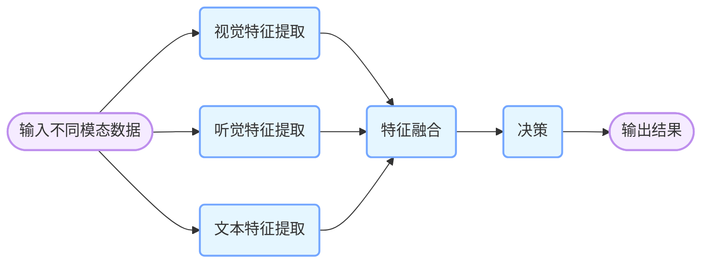

# AI Agent的跨模态学习：促进多种感官信息的融合

> 关键词：AI Agent、跨模态学习、感官信息融合、多模态数据、深度学习、特征提取、信息交互

> 摘要：本文围绕AI Agent的跨模态学习展开，旨在深入探讨如何促进多种感官信息的融合。首先介绍了跨模态学习的背景，包括目的、预期读者等内容。接着阐述了核心概念与联系，剖析其原理与架构，并给出相应的示意图和流程图。详细讲解了核心算法原理和具体操作步骤，借助Python源代码进行说明。通过数学模型和公式对其进行理论支撑，并举例说明。以项目实战展示代码实现和详细解释。探讨了实际应用场景，推荐了相关的工具和资源。最后总结了未来发展趋势与挑战，提供常见问题解答和扩展阅读参考资料，全面呈现AI Agent跨模态学习在促进多种感官信息融合方面的重要性和技术要点。

## 1. 背景介绍 
### 1.1 目的和范围
在人工智能的发展进程中，AI Agent需要模拟人类的感知和认知能力，而人类是通过多种感官（如视觉、听觉、触觉等）来获取信息并进行交互的。单一模态的信息往往存在局限性，无法全面、准确地理解复杂的环境和任务。因此，AI Agent的跨模态学习的目的在于实现多种感官信息的有效融合，使AI Agent能够更全面、深入地理解世界，提高其在各种任务中的表现，如智能机器人的环境感知与交互、智能安防的多源信息分析等。

本文章的范围涵盖了AI Agent跨模态学习的基本概念、核心算法、数学模型、实际应用等多个方面，旨在为读者提供一个全面、系统的关于AI Agent跨模态学习促进多种感官信息融合的知识体系。

### 1.2 预期读者
本文预期读者包括人工智能领域的研究人员、开发者、学生以及对AI Agent跨模态学习感兴趣的技术爱好者。对于研究人员，本文可以提供新的研究思路和方法；对于开发者，有助于他们在实际项目中应用跨模态学习技术；对于学生，能够帮助他们深入理解跨模态学习的原理和应用；对于技术爱好者，可以拓宽他们的技术视野。

### 1.3 文档结构概述
本文将按照以下结构进行阐述：首先介绍背景信息，包括目的、预期读者和文档结构概述等。接着深入探讨核心概念与联系，通过文本示意图和Mermaid流程图展示其原理和架构。详细讲解核心算法原理和具体操作步骤，使用Python源代码进行说明。通过数学模型和公式对跨模态学习进行理论分析，并举例说明。以项目实战展示代码实现和详细解释。探讨实际应用场景，推荐相关的工具和资源。最后总结未来发展趋势与挑战，提供常见问题解答和扩展阅读参考资料。

### 1.4 术语表
#### 1.4.1 核心术语定义
- **AI Agent**：即人工智能代理，是一种能够感知环境、进行决策并采取行动的智能实体。它可以根据不同的任务和环境需求，自主地执行各种操作。
- **跨模态学习**：指的是将来自不同模态（如视觉、听觉、文本等）的数据进行联合学习，挖掘不同模态数据之间的内在联系和互补信息，以提高模型的性能和对复杂信息的理解能力。
- **多模态数据**：包含多种不同类型信息的数据，例如同时包含图像、音频和文本的数据集。

#### 1.4.2 相关概念解释
- **特征提取**：从原始数据中提取出具有代表性和区分性的特征的过程。在跨模态学习中，需要从不同模态的数据中提取出能够反映其本质特征的信息，以便后续的融合和分析。
- **信息融合**：将来自不同模态的信息进行整合，以获得更全面、准确的信息表示。信息融合可以在不同的层次上进行，如特征层、决策层等。

#### 1.4.3 缩略词列表
- **CNN**：Convolutional Neural Network，卷积神经网络，常用于处理图像等视觉数据。
- **RNN**：Recurrent Neural Network，循环神经网络，常用于处理序列数据，如音频、文本等。
- **Transformer**：一种基于注意力机制的深度学习模型，在自然语言处理和计算机视觉等领域有广泛应用。

## 2. 核心概念与联系 
### 核心概念原理
AI Agent的跨模态学习的核心在于理解不同模态数据之间的关系，并将它们有效地融合起来。不同模态的数据具有不同的特征和表示方式，例如图像数据通常用像素值表示，音频数据用声波信号表示，文本数据用词语和句子表示。跨模态学习的目标是找到一种合适的方式，将这些不同表示的数据映射到一个共同的特征空间中，以便进行比较、分析和融合。

在跨模态学习中，需要解决的关键问题包括：如何从不同模态的数据中提取有效的特征；如何衡量不同模态数据之间的相似度和相关性；如何将不同模态的特征进行融合，以获得更具代表性和判别性的特征表示。

### 架构的文本示意图
以下是一个简单的AI Agent跨模态学习的架构示意图：

输入层：包含多个不同模态的数据输入，如视觉图像、听觉音频、文本信息等。

特征提取层：针对不同模态的数据，使用相应的特征提取模型（如CNN提取图像特征、RNN提取音频和文本特征等）提取各自的特征。

特征融合层：将不同模态的特征进行融合，可以采用多种融合方法，如拼接、加权求和等。

决策层：根据融合后的特征进行决策，例如分类、预测等任务。

输出层：输出最终的决策结果。

### Mermaid流程图


## 3. 核心算法原理 & 具体操作步骤 
### 核心算法原理
在AI Agent的跨模态学习中，一种常用的方法是基于深度学习的方法。下面以基于CNN和RNN的跨模态学习为例，介绍其核心算法原理。

首先，对于视觉数据，使用CNN进行特征提取。CNN通过卷积层、池化层等操作，自动提取图像中的特征。例如，在卷积层中，使用不同的卷积核与图像进行卷积运算，提取图像的局部特征。

对于音频和文本数据，使用RNN进行特征提取。RNN可以处理序列数据，通过循环结构，能够捕捉序列中的上下文信息。例如，在处理文本数据时，RNN可以根据前面的词语预测后面的词语。

在特征融合阶段，可以采用拼接的方法将不同模态的特征进行融合。即将不同模态的特征向量按照一定的顺序连接起来，形成一个新的特征向量。

### 具体操作步骤
1. **数据预处理**：对不同模态的数据进行预处理，例如对图像进行裁剪、缩放、归一化等操作，对音频进行采样、降噪等操作，对文本进行分词、词嵌入等操作。
2. **特征提取**：
    - 使用CNN提取视觉特征。以下是一个简单的Python代码示例：
```python
import torch
import torch.nn as nn

class CNNFeatureExtractor(nn.Module):
    def __init__(self):
        super(CNNFeatureExtractor, self).__init__()
        self.conv1 = nn.Conv2d(3, 16, kernel_size=3, padding=1)
        self.relu1 = nn.ReLU()
        self.pool1 = nn.MaxPool2d(kernel_size=2, stride=2)
        self.conv2 = nn.Conv2d(16, 32, kernel_size=3, padding=1)
        self.relu2 = nn.ReLU()
        self.pool2 = nn.MaxPool2d(kernel_size=2, stride=2)

    def forward(self, x):
        x = self.conv1(x)
        x = self.relu1(x)
        x = self.pool1(x)
        x = self.conv2(x)
        x = self.relu2(x)
        x = self.pool2(x)
        return x
```
    - 使用RNN提取音频或文本特征。以下是一个简单的RNN代码示例：
```python
import torch
import torch.nn as nn

class RNNFeatureExtractor(nn.Module):
    def __init__(self, input_size, hidden_size, num_layers):
        super(RNNFeatureExtractor, self).__init__()
        self.rnn = nn.RNN(input_size, hidden_size, num_layers, batch_first=True)

    def forward(self, x):
        out, _ = self.rnn(x)
        return out[:, -1, :]
```
3. **特征融合**：将不同模态的特征进行拼接。以下是一个简单的代码示例：
```python
import torch

def feature_fusion(visual_feature, audio_feature, text_feature):
    fused_feature = torch.cat((visual_feature, audio_feature, text_feature), dim=1)
    return fused_feature
```
4. **决策**：根据融合后的特征进行决策，例如使用全连接层进行分类。以下是一个简单的代码示例：
```python
import torch
import torch.nn as nn

class DecisionMaker(nn.Module):
    def __init__(self, input_size, num_classes):
        super(DecisionMaker, self).__init__()
        self.fc = nn.Linear(input_size, num_classes)

    def forward(self, x):
        x = self.fc(x)
        return x
```

## 4. 数学模型和公式 & 详细讲解 & 举例说明 
### 数学模型和公式
在跨模态学习中，涉及到多个数学模型和公式。

#### 特征提取阶段
- **CNN特征提取**：在卷积层中，卷积操作可以用以下公式表示：
$$y_{i,j}^k = \sum_{m=0}^{M-1}\sum_{n=0}^{N-1} x_{i+m,j+n}^l \cdot w_{m,n}^k + b^k$$
其中，$y_{i,j}^k$ 是卷积层输出特征图中第 $k$ 个通道在位置 $(i,j)$ 的值，$x_{i+m,j+n}^l$ 是输入特征图中第 $l$ 个通道在位置 $(i+m,j+n)$ 的值，$w_{m,n}^k$ 是卷积核中第 $k$ 个通道在位置 $(m,n)$ 的权重，$b^k$ 是第 $k$ 个通道的偏置。

- **RNN特征提取**：RNN的状态更新公式可以表示为：
$$h_t = \tanh(W_{hh}h_{t-1} + W_{xh}x_t + b_h)$$
其中，$h_t$ 是时间步 $t$ 的隐藏状态，$h_{t-1}$ 是上一个时间步的隐藏状态，$x_t$ 是时间步 $t$ 的输入，$W_{hh}$ 和 $W_{xh}$ 是权重矩阵，$b_h$ 是偏置。

#### 特征融合阶段
假设视觉特征向量为 $\mathbf{v} \in \mathbb{R}^{d_v}$，音频特征向量为 $\mathbf{a} \in \mathbb{R}^{d_a}$，文本特征向量为 $\mathbf{t} \in \mathbb{R}^{d_t}$，则融合后的特征向量 $\mathbf{f}$ 可以表示为：
$$\mathbf{f} = [\mathbf{v}; \mathbf{a}; \mathbf{t}] \in \mathbb{R}^{d_v + d_a + d_t}$$

#### 决策阶段
假设融合后的特征向量为 $\mathbf{f}$，全连接层的权重矩阵为 $W \in \mathbb{R}^{C \times (d_v + d_a + d_t)}$，偏置向量为 $\mathbf{b} \in \mathbb{R}^C$，则决策输出 $\mathbf{y}$ 可以表示为：
$$\mathbf{y} = W\mathbf{f} + \mathbf{b}$$
其中，$C$ 是类别数。

### 详细讲解
- **特征提取阶段**：CNN的卷积操作通过卷积核在输入特征图上滑动，提取局部特征。不同的卷积核可以提取不同类型的特征，如边缘、纹理等。RNN的状态更新公式通过不断地更新隐藏状态，捕捉序列数据中的上下文信息。

- **特征融合阶段**：拼接是一种简单而有效的特征融合方法，将不同模态的特征向量按顺序连接起来，保留了各模态的原始信息。

- **决策阶段**：全连接层将融合后的特征映射到不同的类别上，通过权重矩阵和偏置向量进行线性变换。

### 举例说明
假设我们有一个图像分类任务，同时结合了音频和文本信息。图像的输入尺寸为 $3\times 32\times 32$，经过CNN特征提取后得到的视觉特征向量维度为 $d_v = 128$。音频的输入序列长度为 $T = 100$，特征维度为 $d_a' = 64$，经过RNN特征提取后得到的音频特征向量维度为 $d_a = 64$。文本的输入序列长度为 $L = 20$，特征维度为 $d_t' = 32$，经过RNN特征提取后得到的文本特征向量维度为 $d_t = 32$。

则融合后的特征向量维度为 $d_v + d_a + d_t = 128 + 64 + 32 = 224$。假设类别数 $C = 10$，则全连接层的权重矩阵 $W$ 的维度为 $10\times 224$，偏置向量 $\mathbf{b}$ 的维度为 $10$。

## 5. 项目实战：代码实际案例和详细解释说明 
### 5.1  开发环境搭建
1. **安装Python**：建议使用Python 3.7及以上版本。可以从Python官方网站（https://www.python.org/downloads/）下载并安装。
2. **安装深度学习框架**：这里我们使用PyTorch作为深度学习框架。可以使用以下命令进行安装：
```sh
pip install torch torchvision
```
3. **安装其他依赖库**：如NumPy、Matplotlib等，可以使用以下命令进行安装：
```sh
pip install numpy matplotlib
```

### 5.2  源代码详细实现和代码解读
以下是一个完整的AI Agent跨模态学习的代码示例：

```python
import torch
import torch.nn as nn
import torch.optim as optim
from torch.utils.data import DataLoader, Dataset
import numpy as np

# 定义数据集类
class MultiModalDataset(Dataset):
    def __init__(self, visual_data, audio_data, text_data, labels):
        self.visual_data = visual_data
        self.audio_data = audio_data
        self.text_data = text_data
        self.labels = labels

    def __len__(self):
        return len(self.labels)

    def __getitem__(self, idx):
        visual_sample = self.visual_data[idx]
        audio_sample = self.audio_data[idx]
        text_sample = self.text_data[idx]
        label = self.labels[idx]
        return visual_sample, audio_sample, text_sample, label

# 定义CNN特征提取器
class CNNFeatureExtractor(nn.Module):
    def __init__(self):
        super(CNNFeatureExtractor, self).__init__()
        self.conv1 = nn.Conv2d(3, 16, kernel_size=3, padding=1)
        self.relu1 = nn.ReLU()
        self.pool1 = nn.MaxPool2d(kernel_size=2, stride=2)
        self.conv2 = nn.Conv2d(16, 32, kernel_size=3, padding=1)
        self.relu2 = nn.ReLU()
        self.pool2 = nn.MaxPool2d(kernel_size=2, stride=2)

    def forward(self, x):
        x = self.conv1(x)
        x = self.relu1(x)
        x = self.pool1(x)
        x = self.conv2(x)
        x = self.relu2(x)
        x = self.pool2(x)
        x = x.view(x.size(0), -1)
        return x

# 定义RNN特征提取器
class RNNFeatureExtractor(nn.Module):
    def __init__(self, input_size, hidden_size, num_layers):
        super(RNNFeatureExtractor, self).__init__()
        self.rnn = nn.RNN(input_size, hidden_size, num_layers, batch_first=True)

    def forward(self, x):
        out, _ = self.rnn(x)
        return out[:, -1, :]

# 定义特征融合和决策模型
class MultiModalModel(nn.Module):
    def __init__(self, visual_feature_size, audio_feature_size, text_feature_size, num_classes):
        super(MultiModalModel, self).__init__()
        self.cnn = CNNFeatureExtractor()
        self.rnn_audio = RNNFeatureExtractor(input_size=64, hidden_size=64, num_layers=1)
        self.rnn_text = RNNFeatureExtractor(input_size=32, hidden_size=32, num_layers=1)
        self.fc = nn.Linear(visual_feature_size + audio_feature_size + text_feature_size, num_classes)

    def forward(self, visual_input, audio_input, text_input):
        visual_feature = self.cnn(visual_input)
        audio_feature = self.rnn_audio(audio_input)
        text_feature = self.rnn_text(text_input)
        fused_feature = torch.cat((visual_feature, audio_feature, text_feature), dim=1)
        output = self.fc(fused_feature)
        return output

# 生成示例数据
visual_data = torch.randn(100, 3, 32, 32)
audio_data = torch.randn(100, 100, 64)
text_data = torch.randn(100, 20, 32)
labels = torch.randint(0, 10, (100,))

# 创建数据集和数据加载器
dataset = MultiModalDataset(visual_data, audio_data, text_data, labels)
dataloader = DataLoader(dataset, batch_size=10, shuffle=True)

# 初始化模型、损失函数和优化器
model = MultiModalModel(visual_feature_size=32 * 8 * 8, audio_feature_size=64, text_feature_size=32, num_classes=10)
criterion = nn.CrossEntropyLoss()
optimizer = optim.Adam(model.parameters(), lr=0.001)

# 训练模型
num_epochs = 10
for epoch in range(num_epochs):
    running_loss = 0.0
    for visual_batch, audio_batch, text_batch, label_batch in dataloader:
        optimizer.zero_grad()
        outputs = model(visual_batch, audio_batch, text_batch)
        loss = criterion(outputs, label_batch)
        loss.backward()
        optimizer.step()
        running_loss += loss.item()
    print(f'Epoch {epoch + 1}, Loss: {running_loss / len(dataloader)}')
```

### 5.3  代码解读与分析
1. **数据集类**：`MultiModalDataset` 类继承自 `torch.utils.data.Dataset`，用于加载和处理多模态数据。`__len__` 方法返回数据集的长度，`__getitem__` 方法根据索引返回对应的多模态数据和标签。
2. **特征提取器**：`CNNFeatureExtractor` 类使用CNN提取视觉特征，`RNNFeatureExtractor` 类使用RNN提取音频和文本特征。
3. **多模态模型**：`MultiModalModel` 类将CNN和RNN特征提取器组合在一起，对不同模态的数据进行特征提取和融合，最后通过全连接层进行分类。
4. **数据生成和加载**：生成示例的视觉、音频、文本数据和标签，创建数据集和数据加载器。
5. **训练过程**：使用交叉熵损失函数和Adam优化器进行训练，迭代多个epoch，不断更新模型的参数。

## 6. 实际应用场景 
### 智能机器人
在智能机器人领域，AI Agent的跨模态学习可以使机器人更好地感知和理解周围环境。例如，机器人可以通过视觉识别物体的形状和颜色，通过听觉感知声音的来源和内容，通过触觉感知物体的硬度和纹理。将这些多模态信息融合后，机器人可以更准确地完成任务，如抓取物体、导航等。

### 智能安防
在智能安防系统中，跨模态学习可以提高安防监控的准确性和可靠性。例如，结合视频监控的视觉信息和音频监控的声音信息，可以更全面地监测异常事件。当视频中出现可疑人员的同时，音频中出现异常的声音，系统可以更准确地判断是否存在安全威胁。

### 智能医疗
在智能医疗领域，跨模态学习可以帮助医生更准确地诊断疾病。例如，结合医学影像（如X光、CT等）的视觉信息和患者的病历文本信息，可以更全面地了解患者的病情。同时，还可以结合患者的生理信号（如心电图、脑电图等）的音频或数值信息，提高诊断的准确性。

### 虚拟现实和增强现实
在虚拟现实（VR）和增强现实（AR）领域，跨模态学习可以提供更沉浸式的用户体验。例如，在VR环境中，结合视觉的虚拟场景和听觉的声音效果，可以让用户更身临其境地感受虚拟世界。在AR应用中，结合现实场景的视觉信息和相关的文本或音频提示信息，可以为用户提供更丰富的信息和交互体验。

## 7. 工具和资源推荐
### 7.1 学习资源推荐
#### 7.1.1 书籍推荐
- 《深度学习》（Deep Learning）：由Ian Goodfellow、Yoshua Bengio和Aaron Courville合著，是深度学习领域的经典教材，全面介绍了深度学习的基本概念、算法和应用。
- 《模式识别与机器学习》（Pattern Recognition and Machine Learning）：由Christopher M. Bishop编写，涵盖了模式识别和机器学习的各个方面，包括概率模型、神经网络等内容，对于理解跨模态学习的理论基础有很大帮助。
- 《多模态机器学习：基础与应用》（Multimodal Machine Learning: Foundations and Applications）：专门介绍多模态机器学习的书籍，详细阐述了多模态数据的处理、融合和应用等方面的内容。

#### 7.1.2 在线课程
- Coursera上的“深度学习专项课程”（Deep Learning Specialization）：由Andrew Ng教授主讲，包括深度学习的基础、卷积神经网络、循环神经网络等多个模块，对于初学者来说是一个很好的入门课程。
- edX上的“人工智能导论”（Introduction to Artificial Intelligence）：介绍了人工智能的基本概念、算法和应用，包括多模态学习的相关内容。
- 哔哩哔哩（Bilibili）上有很多关于深度学习和跨模态学习的优质视频教程，可以根据自己的需求进行选择学习。

#### 7.1.3 技术博客和网站
- Medium：是一个技术博客平台，有很多关于人工智能、深度学习和跨模态学习的优质文章。
- arXiv：是一个预印本服务器，提供了大量的学术论文，包括跨模态学习领域的最新研究成果。
- AI开源社区：如GitHub、GitLab等，上面有很多开源的跨模态学习项目和代码，可以学习和参考。

### 7.2 开发工具框架推荐
#### 7.2.1 IDE和编辑器
- PyCharm：是一款专门为Python开发设计的集成开发环境（IDE），具有代码编辑、调试、版本控制等功能，非常适合深度学习项目的开发。
- Jupyter Notebook：是一个交互式的开发环境，可以在浏览器中编写和运行代码，方便进行数据探索和模型实验。
- Visual Studio Code：是一款轻量级的代码编辑器，支持多种编程语言和插件，具有丰富的扩展功能，适合快速开发和调试。

#### 7.2.2 调试和性能分析工具
- TensorBoard：是TensorFlow的可视化工具，可以用于可视化模型的训练过程、损失曲线、准确率等指标，帮助开发者更好地理解和调试模型。
- PyTorch Profiler：是PyTorch的性能分析工具，可以分析模型的计算时间、内存使用等情况，帮助开发者优化模型的性能。
- NVIDIA Nsight Systems：是NVIDIA提供的性能分析工具，可用于分析GPU加速的深度学习模型的性能瓶颈。

#### 7.2.3 相关框架和库
- PyTorch：是一个开源的深度学习框架，具有动态图计算、自动求导等特点，非常适合快速开发和实验跨模态学习模型。
- TensorFlow：是另一个广泛使用的深度学习框架，提供了丰富的工具和库，支持分布式训练和模型部署。
- OpenCV：是一个计算机视觉库，提供了很多图像处理和计算机视觉算法，可用于处理视觉数据。
- librosa：是一个音频处理库，可用于音频特征提取、音频分类等任务。

### 7.3 相关论文著作推荐
#### 7.3.1 经典论文
- “Multimodal Machine Learning: A Survey and Taxonomy”：该论文对多模态机器学习进行了全面的综述和分类，介绍了多模态学习的基本概念、方法和应用。
- “Show, Attend and Tell: Neural Image Caption Generation with Visual Attention”：提出了一种基于注意力机制的图像描述生成方法，展示了跨模态学习在图像和文本融合方面的应用。
- “Listen, Attend and Spell: A Neural Network for Large Vocabulary Conversational Speech Recognition”：提出了一种用于语音识别的神经网络模型，结合了听觉和文本信息，体现了跨模态学习在语音处理中的重要性。

#### 7.3.2 最新研究成果
- 可以通过arXiv、IEEE Xplore、ACM Digital Library等学术数据库搜索最新的跨模态学习研究论文，关注领域内的最新进展和技术突破。

#### 7.3.3 应用案例分析
- 可以参考一些实际应用案例的论文，如智能机器人、智能安防、智能医疗等领域的跨模态学习应用案例，了解如何将理论和技术应用到实际场景中。

## 8. 总结：未来发展趋势与挑战
### 未来发展趋势
1. **更复杂的模态融合**：未来的跨模态学习将不仅仅局限于视觉、听觉和文本等常见模态的融合，还将涉及更多复杂的模态，如触觉、嗅觉等，以实现更全面、真实的感知和交互。
2. **跨模态预训练模型**：类似于自然语言处理中的预训练模型（如BERT、GPT等），跨模态预训练模型将成为未来的研究热点。通过在大规模多模态数据上进行预训练，可以学习到更通用的跨模态特征表示，提高模型的性能和泛化能力。
3. **与其他技术的融合**：跨模态学习将与其他技术（如强化学习、迁移学习等）进行更深入的融合，以实现更智能、高效的AI Agent。例如，将跨模态学习与强化学习相结合，可以使AI Agent在复杂环境中更好地进行决策和行动。
4. **跨模态知识图谱**：构建跨模态知识图谱，将不同模态的数据和知识进行整合和关联，为AI Agent提供更丰富、全面的知识支持，促进跨模态学习的发展。

### 挑战
1. **数据获取和标注**：获取高质量的多模态数据是一个挑战，尤其是对于一些复杂的模态（如触觉、嗅觉等）。同时，对多模态数据进行标注也需要大量的人力和时间成本。
2. **模态间的语义鸿沟**：不同模态的数据具有不同的语义和表示方式，如何有效地弥合模态间的语义鸿沟，实现不同模态数据之间的准确关联和理解，是跨模态学习面临的关键挑战之一。
3. **计算资源和效率**：跨模态学习通常需要处理大量的数据和复杂的模型，对计算资源的需求较高。如何提高计算效率，降低计算成本，是一个亟待解决的问题。
4. **模型的可解释性**：随着跨模态学习模型的复杂度不断增加，模型的可解释性变得越来越重要。如何解释跨模态学习模型的决策过程和结果，是一个具有挑战性的问题。

## 9. 附录：常见问题与解答
### 1. 跨模态学习和单模态学习有什么区别？
单模态学习只处理单一类型的数据，如只处理图像或只处理文本。而跨模态学习处理多种不同类型的数据，通过挖掘不同模态数据之间的内在联系和互补信息，提高模型的性能和对复杂信息的理解能力。跨模态学习可以获得更全面、准确的信息表示，而单模态学习可能存在信息不完整的问题。

### 2. 如何选择合适的特征融合方法？
选择合适的特征融合方法需要考虑多个因素，如数据的特点、任务的需求、模型的复杂度等。常见的特征融合方法包括拼接、加权求和、注意力机制等。拼接方法简单直接，保留了各模态的原始信息；加权求和方法可以根据不同模态的重要性进行加权融合；注意力机制可以自适应地分配不同模态的权重，提高融合的效果。可以通过实验比较不同融合方法的性能，选择最适合的方法。

### 3. 跨模态学习在实际应用中可能会遇到哪些问题？
在实际应用中，跨模态学习可能会遇到数据质量问题、模态间的不一致性问题、计算资源限制问题等。数据质量问题包括数据缺失、噪声等，需要进行数据预处理和清洗。模态间的不一致性问题指的是不同模态的数据在时间、空间等方面存在差异，需要进行对齐和同步。计算资源限制问题可能导致模型训练时间过长或无法训练，需要进行模型优化和资源管理。

### 4. 如何评估跨模态学习模型的性能？
可以使用多种指标来评估跨模态学习模型的性能，如准确率、召回率、F1值、均方误差等。具体选择哪些指标需要根据任务的类型和需求来确定。例如，对于分类任务，可以使用准确率、召回率、F1值等指标；对于回归任务，可以使用均方误差等指标。此外，还可以通过可视化和人工评估等方式来评估模型的性能。

## 10. 扩展阅读 & 参考资料
### 扩展阅读
- 《人工智能：现代方法》（Artificial Intelligence: A Modern Approach）：全面介绍了人工智能的各个领域和方法，对于深入理解AI Agent和跨模态学习有很大帮助。
- 《深度学习实战》（Deep Learning in Practice）：通过实际案例介绍了深度学习的应用和实现，包括跨模态学习的相关案例。

### 参考资料
- Goodfellow, I., Bengio, Y., & Courville, A. (2016). Deep Learning. MIT Press.
- Bishop, C. M. (2006). Pattern Recognition and Machine Learning. Springer.
- Baltrušaitis, T., Ahuja, C., & Morency, L.-P. (2018). Multimodal Machine Learning: A Survey and Taxonomy. IEEE Transactions on Pattern Analysis and Machine Intelligence, 41(2), 423-443.
- Xu, K., Ba, J., Kiros, R., Cho, K., Courville, A., Salakhudinov, R., ... & Bengio, Y. (2015). Show, Attend and Tell: Neural Image Caption Generation with Visual Attention. In Proceedings of the 2015 IEEE International Conference on Computer Vision (ICCV) (pp. 2048-2057).
- Chan, W., Jaitly, N., Le, Q. V., & Vinyals, O. (2016). Listen, Attend and Spell: A Neural Network for Large Vocabulary Conversational Speech Recognition. In Proceedings of the 2016 IEEE International Conference on Acoustics, Speech and Signal Processing (ICASSP) (pp. 4960-4964).