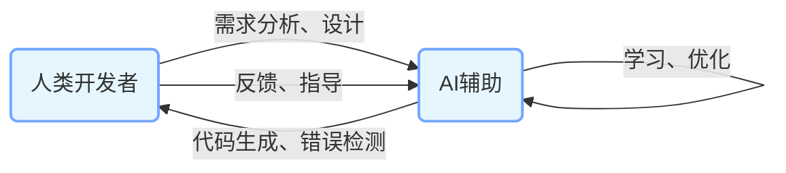

# AI与人类开发者的协作模式

> 关键词：AI、人类开发者、协作模式、软件开发、智能辅助、协同创新

> 摘要：本文深入探讨了AI与人类开发者的协作模式。在当今快速发展的科技时代，AI技术的崛起为软件开发领域带来了新的机遇与变革。通过研究AI与人类开发者协作的背景、核心概念、算法原理、数学模型等内容，结合项目实战案例和实际应用场景，详细阐述了两者协作的多种方式和优势。同时，推荐了相关的学习资源、开发工具和研究论文，分析了未来发展趋势与挑战，旨在为理解和促进AI与人类开发者的有效协作提供全面而深入的参考。

## 1. 背景介绍 
### 1.1 目的和范围
本文章的目的在于全面探讨AI与人类开发者的协作模式，深入剖析这种协作在软件开发及相关领域的应用、优势和发展趋势。范围涵盖了从基础概念的介绍到具体算法原理的阐述，从项目实战案例的分析到未来发展的展望，旨在为相关领域的研究者、开发者和从业者提供一个系统、全面的参考。

### 1.2 预期读者
本文预期读者包括但不限于计算机科学领域的研究者、软件开发工程师、人工智能爱好者、技术管理者以及对AI与人类协作模式感兴趣的各界人士。通过阅读本文，读者可以深入了解AI与人类开发者协作的相关知识和技术，为其在实际工作和研究中提供有益的指导。

### 1.3 文档结构概述
本文将按照以下结构进行阐述：首先介绍AI与人类开发者协作的背景信息，包括目的、预期读者和文档结构概述等；接着讲解核心概念与联系，通过文本示意图和Mermaid流程图展示其原理和架构；然后详细阐述核心算法原理和具体操作步骤，使用Python源代码进行说明；再介绍相关的数学模型和公式，并举例说明；通过项目实战案例展示代码的实际应用和详细解释；探讨实际应用场景；推荐相关的工具和资源；最后总结未来发展趋势与挑战，提供常见问题解答和扩展阅读参考资料。

### 1.4 术语表
#### 1.4.1 核心术语定义
- **AI（Artificial Intelligence）**：即人工智能，是指通过计算机技术模拟人类智能的理论、方法、技术及应用系统。
- **人类开发者**：指具备软件开发、编程等相关技能和知识，从事软件项目开发、维护和优化等工作的专业人员。
- **协作模式**：指AI与人类开发者之间相互配合、协同工作的方式和机制。

#### 1.4.2 相关概念解释
- **智能辅助**：AI为人类开发者提供辅助性的功能，如代码自动补全、错误检测等，帮助人类开发者提高工作效率和质量。
- **协同创新**：AI与人类开发者共同参与创新过程，发挥各自的优势，创造出更具创新性的软件产品和解决方案。

#### 1.4.3 缩略词列表
- **ML（Machine Learning）**：机器学习，是AI的一个重要分支，通过数据和算法让计算机自动学习和改进。
- **NLP（Natural Language Processing）**：自然语言处理，研究如何让计算机理解和处理人类语言。

## 2. 核心概念与联系 

### 核心概念原理
AI与人类开发者的协作模式基于两者的优势互补。人类开发者具有创造力、判断力、情感理解和领域知识等优势，能够进行复杂的需求分析、系统设计和创新思维。而AI具有强大的计算能力、数据处理能力和模式识别能力，能够快速处理大量数据、执行重复性任务和提供智能辅助。

在协作过程中，AI可以通过学习人类开发者的行为模式和代码风格，为其提供个性化的辅助。例如，在代码编写过程中，AI可以根据上下文自动补全代码，减少开发者的输入工作量；在代码审查阶段，AI可以快速检测代码中的语法错误和潜在的安全漏洞，提高代码质量。

人类开发者则可以为AI提供指导和反馈，帮助AI不断优化和改进。例如，当AI给出的建议不符合实际需求时，人类开发者可以进行调整和纠正，同时将正确的知识和经验传授给AI，促进AI的学习和成长。

### 架构的文本示意图
```plaintext
+-------------------+        +-------------------+
|      人类开发者     | <----> |        AI         |
+-------------------+        +-------------------+
| 创造力            |        | 计算能力          |
| 判断力            |        | 数据处理能力      |
| 情感理解          |        | 模式识别能力      |
| 领域知识          |        | 智能辅助能力      |
+-------------------+        +-------------------+
```

### Mermaid流程图


## 3. 核心算法原理 & 具体操作步骤 

### 核心算法原理
在AI与人类开发者的协作中，常用的算法包括机器学习算法和自然语言处理算法。

#### 机器学习算法
以代码自动补全为例，常用的机器学习算法是循环神经网络（RNN）及其变体，如长短时记忆网络（LSTM）和门控循环单元（GRU）。这些算法可以处理序列数据，通过学习大量的代码语料库，预测下一个可能的代码片段。

#### 自然语言处理算法
在需求理解和沟通方面，自然语言处理算法可以帮助AI理解人类开发者用自然语言表达的需求。例如，使用词嵌入技术将文本转换为向量表示，然后通过深度学习模型进行文本分类、情感分析等任务。

### 具体操作步骤
以下是一个简单的代码自动补全的Python实现示例：

```python
import torch
import torch.nn as nn
import torch.optim as optim
from torch.utils.data import Dataset, DataLoader

# 定义代码语料库
corpus = [
    "print('Hello, World!')",
    "a = 10",
    "b = a + 5",
    "if a > b:",
    "    print('a is greater than b')",
    "else:",
    "    print('a is less than or equal to b')"
]

# 构建字符到索引的映射
chars = sorted(list(set(''.join(corpus))))
char_to_idx = {ch: i for i, ch in enumerate(chars)}
idx_to_char = {i: ch for i, ch in enumerate(chars)}

# 定义数据集类
class CodeDataset(Dataset):
    def __init__(self, corpus, seq_length):
        self.corpus = corpus
        self.seq_length = seq_length
        self.data = []
        for code in corpus:
            for i in range(len(code) - seq_length):
                input_seq = code[i:i+seq_length]
                target_seq = code[i+seq_length]
                self.data.append((input_seq, target_seq))

    def __len__(self):
        return len(self.data)

    def __getitem__(self, idx):
        input_seq, target_seq = self.data[idx]
        input_idx = [char_to_idx[ch] for ch in input_seq]
        target_idx = char_to_idx[target_seq]
        return torch.tensor(input_idx), torch.tensor(target_idx)

# 定义LSTM模型
class LSTMModel(nn.Module):
    def __init__(self, input_size, hidden_size, output_size):
        super(LSTMModel, self).__init__()
        self.embedding = nn.Embedding(input_size, hidden_size)
        self.lstm = nn.LSTM(hidden_size, hidden_size)
        self.fc = nn.Linear(hidden_size, output_size)

    def forward(self, x):
        x = self.embedding(x)
        x = x.unsqueeze(1)
        out, _ = self.lstm(x)
        out = self.fc(out.squeeze(1))
        return out

# 训练模型
seq_length = 5
dataset = CodeDataset(corpus, seq_length)
dataloader = DataLoader(dataset, batch_size=1, shuffle=True)

input_size = len(char_to_idx)
hidden_size = 128
output_size = len(char_to_idx)
model = LSTMModel(input_size, hidden_size, output_size)
criterion = nn.CrossEntropyLoss()
optimizer = optim.Adam(model.parameters(), lr=0.001)

num_epochs = 100
for epoch in range(num_epochs):
    for inputs, targets in dataloader:
        optimizer.zero_grad()
        outputs = model(inputs)
        loss = criterion(outputs, targets)
        loss.backward()
        optimizer.step()

    if (epoch + 1) % 10 == 0:
        print(f'Epoch [{epoch+1}/{num_epochs}], Loss: {loss.item():.4f}')

# 代码自动补全函数
def autocomplete(input_text, model, char_to_idx, idx_to_char, seq_length):
    input_idx = [char_to_idx[ch] for ch in input_text[-seq_length:]]
    input_tensor = torch.tensor(input_idx).unsqueeze(0)
    with torch.no_grad():
        output = model(input_tensor)
        _, predicted_idx = torch.max(output, 1)
        predicted_char = idx_to_char[predicted_idx.item()]
    return input_text + predicted_char

# 测试自动补全
input_text = "print('Hel"
autocompleted_text = autocomplete(input_text, model, char_to_idx, idx_to_char, seq_length)
print(f'Autocompleted text: {autocompleted_text}')
```

### 代码解释
1. **数据预处理**：首先定义了一个简单的代码语料库，然后构建字符到索引的映射，方便将字符转换为数字表示。
2. **数据集类**：定义了一个`CodeDataset`类，用于将代码语料库转换为训练数据，每个样本包含一个输入序列和一个目标字符。
3. **LSTM模型**：定义了一个LSTM模型，包括嵌入层、LSTM层和全连接层。
4. **训练模型**：使用交叉熵损失函数和Adam优化器对模型进行训练，训练过程中不断更新模型的参数。
5. **代码自动补全函数**：定义了一个`autocomplete`函数，根据输入的文本预测下一个字符，并将其添加到输入文本中。
6. **测试自动补全**：使用一个示例输入文本进行测试，输出自动补全后的文本。

## 4. 数学模型和公式 & 详细讲解 & 举例说明 

### 数学模型
在上述代码自动补全的示例中，使用的LSTM模型的数学模型可以表示为：

#### 嵌入层
嵌入层将输入的字符索引转换为向量表示，其数学公式为：

$$\mathbf{e}_t = \mathbf{E} \mathbf{x}_t$$

其中，$\mathbf{e}_t$ 是时间步 $t$ 的嵌入向量，$\mathbf{E}$ 是嵌入矩阵，$\mathbf{x}_t$ 是时间步 $t$ 的输入字符索引。

#### LSTM层
LSTM层的计算包括输入门、遗忘门、细胞状态和输出门，其数学公式如下：

$$\mathbf{i}_t = \sigma(\mathbf{W}_{ii} \mathbf{e}_t + \mathbf{W}_{hi} \mathbf{h}_{t-1} + \mathbf{b}_i)$$
$$\mathbf{f}_t = \sigma(\mathbf{W}_{if} \mathbf{e}_t + \mathbf{W}_{hf} \mathbf{h}_{t-1} + \mathbf{b}_f)$$
$$\mathbf{C}_t^{\sim} = \tanh(\mathbf{W}_{ic} \mathbf{e}_t + \mathbf{W}_{hc} \mathbf{h}_{t-1} + \mathbf{b}_c)$$
$$\mathbf{C}_t = \mathbf{f}_t \odot \mathbf{C}_{t-1} + \mathbf{i}_t \odot \mathbf{C}_t^{\sim}$$
$$\mathbf{o}_t = \sigma(\mathbf{W}_{io} \mathbf{e}_t + \mathbf{W}_{ho} \mathbf{h}_{t-1} + \mathbf{b}_o)$$
$$\mathbf{h}_t = \mathbf{o}_t \odot \tanh(\mathbf{C}_t)$$

其中，$\mathbf{i}_t$ 是输入门，$\mathbf{f}_t$ 是遗忘门，$\mathbf{C}_t^{\sim}$ 是候选细胞状态，$\mathbf{C}_t$ 是细胞状态，$\mathbf{o}_t$ 是输出门，$\mathbf{h}_t$ 是隐藏状态，$\sigma$ 是Sigmoid函数，$\tanh$ 是双曲正切函数，$\odot$ 是逐元素相乘，$\mathbf{W}$ 是权重矩阵，$\mathbf{b}$ 是偏置向量。

#### 全连接层
全连接层将LSTM层的输出映射到输出空间，其数学公式为：

$$\mathbf{y}_t = \mathbf{W}_{fc} \mathbf{h}_t + \mathbf{b}_{fc}$$

其中，$\mathbf{y}_t$ 是时间步 $t$ 的输出向量，$\mathbf{W}_{fc}$ 是全连接层的权重矩阵，$\mathbf{b}_{fc}$ 是偏置向量。

### 详细讲解
- **嵌入层**：嵌入层的作用是将离散的字符索引转换为连续的向量表示，这样可以更好地捕捉字符之间的语义关系。
- **LSTM层**：LSTM层通过门控机制解决了传统RNN的梯度消失问题，能够更好地处理长序列数据。输入门控制新信息的进入，遗忘门控制旧信息的保留，细胞状态存储长期信息，输出门控制输出信息。
- **全连接层**：全连接层将LSTM层的输出映射到输出空间，通常使用Softmax函数将输出转换为概率分布，用于分类任务。

### 举例说明
假设输入的字符索引为 $\mathbf{x}_t = [3]$，嵌入矩阵 $\mathbf{E}$ 的形状为 $(10, 128)$，则嵌入向量 $\mathbf{e}_t$ 的形状为 $(128)$。

在LSTM层中，假设输入门的权重矩阵 $\mathbf{W}_{ii}$ 的形状为 $(128, 128)$，隐藏状态 $\mathbf{h}_{t-1}$ 的形状为 $(128)$，则输入门 $\mathbf{i}_t$ 的形状为 $(128)$。

最后，在全连接层中，假设权重矩阵 $\mathbf{W}_{fc}$ 的形状为 $(128, 10)$，则输出向量 $\mathbf{y}_t$ 的形状为 $(10)$。

## 5. 项目实战：代码实际案例和详细解释说明 

### 5.1  开发环境搭建
为了实现AI与人类开发者的协作项目，我们需要搭建相应的开发环境。以下是具体的步骤：

#### 安装Python
首先，确保你已经安装了Python。可以从Python官方网站（https://www.python.org/downloads/）下载适合你操作系统的Python版本，并按照安装向导进行安装。

#### 安装深度学习框架
我们使用PyTorch作为深度学习框架，可以通过以下命令安装：

```sh
pip install torch torchvision
```

#### 安装其他依赖库
根据项目的需求，可能还需要安装其他依赖库，如`numpy`、`matplotlib`等，可以使用以下命令安装：

```sh
pip install numpy matplotlib
```

### 5.2  源代码详细实现和代码解读
以下是一个更完整的AI与人类开发者协作的项目示例，实现一个智能代码审查系统。

```python
import torch
import torch.nn as nn
import torch.optim as optim
from torch.utils.data import Dataset, DataLoader
import re

# 定义代码语料库
corpus = [
    "print('Hello, World!')",
    "a = 10",
    "b = a + 5",
    "if a > b:",
    "    print('a is greater than b')",
    "else:",
    "    print('a is less than or equal to b')"
]

# 构建字符到索引的映射
chars = sorted(list(set(''.join(corpus))))
char_to_idx = {ch: i for i, ch in enumerate(chars)}
idx_to_char = {i: ch for i, ch in enumerate(chars)}

# 定义数据集类
class CodeDataset(Dataset):
    def __init__(self, corpus, seq_length):
        self.corpus = corpus
        self.seq_length = seq_length
        self.data = []
        for code in corpus:
            for i in range(len(code) - seq_length):
                input_seq = code[i:i+seq_length]
                target_seq = code[i+seq_length]
                self.data.append((input_seq, target_seq))

    def __len__(self):
        return len(self.data)

    def __getitem__(self, idx):
        input_seq, target_seq = self.data[idx]
        input_idx = [char_to_idx[ch] for ch in input_seq]
        target_idx = char_to_idx[target_seq]
        return torch.tensor(input_idx), torch.tensor(target_idx)

# 定义LSTM模型
class LSTMModel(nn.Module):
    def __init__(self, input_size, hidden_size, output_size):
        super(LSTMModel, self).__init__()
        self.embedding = nn.Embedding(input_size, hidden_size)
        self.lstm = nn.LSTM(hidden_size, hidden_size)
        self.fc = nn.Linear(hidden_size, output_size)

    def forward(self, x):
        x = self.embedding(x)
        x = x.unsqueeze(1)
        out, _ = self.lstm(x)
        out = self.fc(out.squeeze(1))
        return out

# 训练模型
seq_length = 5
dataset = CodeDataset(corpus, seq_length)
dataloader = DataLoader(dataset, batch_size=1, shuffle=True)

input_size = len(char_to_idx)
hidden_size = 128
output_size = len(char_to_idx)
model = LSTMModel(input_size, hidden_size, output_size)
criterion = nn.CrossEntropyLoss()
optimizer = optim.Adam(model.parameters(), lr=0.001)

num_epochs = 100
for epoch in range(num_epochs):
    for inputs, targets in dataloader:
        optimizer.zero_grad()
        outputs = model(inputs)
        loss = criterion(outputs, targets)
        loss.backward()
        optimizer.step()

    if (epoch + 1) % 10 == 0:
        print(f'Epoch [{epoch+1}/{num_epochs}], Loss: {loss.item():.4f}')

# 代码审查函数
def code_review(code, model, char_to_idx, idx_to_char, seq_length):
    errors = []
    for i in range(len(code) - seq_length):
        input_seq = code[i:i+seq_length]
        target_char = code[i+seq_length]
        input_idx = [char_to_idx[ch] for ch in input_seq]
        input_tensor = torch.tensor(input_idx).unsqueeze(0)
        with torch.no_grad():
            output = model(input_tensor)
            _, predicted_idx = torch.max(output, 1)
            predicted_char = idx_to_char[predicted_idx.item()]
        if predicted_char != target_char:
            errors.append((i+seq_length, target_char, predicted_char))
    return errors

# 测试代码审查
test_code = "print('Helo, World!')"
errors = code_review(test_code, model, char_to_idx, idx_to_char, seq_length)
if errors:
    print("Code review found the following errors:")
    for pos, actual, predicted in errors:
        print(f"At position {pos}, expected '{predicted}' but found '{actual}'")
else:
    print("Code review passed. No errors found.")
```

### 5.3  代码解读与分析
1. **数据预处理**：与前面的代码自动补全示例类似，首先定义了一个代码语料库，然后构建字符到索引的映射。
2. **数据集类**：定义了一个`CodeDataset`类，用于将代码语料库转换为训练数据。
3. **LSTM模型**：定义了一个LSTM模型，包括嵌入层、LSTM层和全连接层。
4. **训练模型**：使用交叉熵损失函数和Adam优化器对模型进行训练，训练过程中不断更新模型的参数。
5. **代码审查函数**：定义了一个`code_review`函数，用于对输入的代码进行审查。函数遍历代码中的每个字符，根据前面的字符预测下一个字符，并与实际字符进行比较，如果不一致则记录为错误。
6. **测试代码审查**：使用一个示例代码进行测试，输出代码审查的结果。

### 分析
这个智能代码审查系统通过训练一个LSTM模型来学习代码的模式和规律，然后利用这个模型对输入的代码进行审查，找出可能存在的错误。这种方法可以帮助人类开发者快速发现代码中的语法错误和潜在的逻辑问题，提高代码质量和开发效率。

## 6. 实际应用场景 
### 软件开发
在软件开发过程中，AI可以为人类开发者提供多种辅助功能。例如，在代码编写阶段，AI可以根据上下文自动补全代码，减少开发者的输入工作量；在代码审查阶段，AI可以快速检测代码中的语法错误、潜在的安全漏洞和代码风格问题，提高代码质量；在需求分析阶段，AI可以帮助人类开发者理解用户需求，将自然语言描述的需求转换为形式化的规格说明。

### 智能编程教育
AI与人类开发者的协作模式可以应用于智能编程教育领域。AI可以作为智能辅导工具，为学生提供个性化的学习建议和指导。例如，当学生编写代码遇到困难时，AI可以分析学生的代码，找出问题所在，并提供相应的解决方案；AI还可以根据学生的学习进度和能力水平，生成个性化的学习任务和练习，帮助学生提高编程技能。

### 创新研发
在创新研发过程中，AI与人类开发者可以协同创新，发挥各自的优势。人类开发者具有丰富的领域知识和创新思维，能够提出新颖的创意和解决方案；而AI可以通过数据分析和模型训练，为人类开发者提供更多的灵感和参考。例如，在人工智能算法的研发中，人类开发者可以设计算法的架构和思路，AI可以通过大量的实验和优化，帮助人类开发者找到最优的参数和配置。

### 软件维护和优化
在软件维护和优化阶段，AI可以帮助人类开发者快速定位和解决问题。例如，AI可以通过分析软件的运行日志和性能数据，找出软件中的瓶颈和问题所在，并提供相应的优化建议；AI还可以自动生成测试用例，对软件进行全面的测试，确保软件的稳定性和可靠性。

## 7. 工具和资源推荐
### 7.1 学习资源推荐
#### 7.1.1 书籍推荐
- 《Python深度学习》（Francois Chollet 著）：介绍了Python和深度学习的基础知识，以及如何使用Keras和TensorFlow等框架进行深度学习模型的开发。
- 《人工智能：一种现代的方法》（Stuart Russell 和 Peter Norvig 著）：是人工智能领域的经典教材，全面介绍了人工智能的基本概念、算法和应用。
- 《机器学习》（周志华 著）：详细介绍了机器学习的基本理论和算法，是学习机器学习的优秀教材。

#### 7.1.2 在线课程
- Coursera上的“深度学习专项课程”（Deep Learning Specialization）：由Andrew Ng教授主讲，包括神经网络和深度学习、改善深层神经网络、结构化机器学习项目、卷积神经网络和序列模型等课程。
- edX上的“人工智能导论”（Introduction to Artificial Intelligence）：由麻省理工学院（MIT）提供，介绍了人工智能的基本概念、算法和应用。
- 中国大学MOOC上的“机器学习”：由清华大学等高校提供，详细介绍了机器学习的基本理论和算法。

#### 7.1.3 技术博客和网站
- Medium（https://medium.com/）：是一个技术博客平台，有很多关于AI和机器学习的优质文章。
- Towards Data Science（https://towardsdatascience.com/）：专注于数据科学和机器学习领域，提供了很多实用的技术文章和案例分析。
- arXiv（https://arxiv.org/）：是一个预印本服务器，提供了大量的学术论文，包括AI和机器学习领域的最新研究成果。

### 7.2 开发工具框架推荐
#### 7.2.1 IDE和编辑器
- PyCharm：是一款专门为Python开发设计的集成开发环境（IDE），提供了丰富的代码编辑、调试和版本控制等功能。
- Visual Studio Code：是一款轻量级的代码编辑器，支持多种编程语言，有丰富的插件和扩展，可以方便地进行AI和机器学习开发。
- Jupyter Notebook：是一个交互式的笔记本环境，适合进行数据探索、模型训练和可视化等工作。

#### 7.2.2 调试和性能分析工具
- TensorBoard：是TensorFlow提供的一个可视化工具，可以帮助开发者监控模型的训练过程、查看模型的结构和性能指标等。
- PyTorch Profiler：是PyTorch提供的一个性能分析工具，可以帮助开发者找出代码中的性能瓶颈和优化点。
- cProfile：是Python标准库中的一个性能分析工具，可以帮助开发者分析代码的运行时间和函数调用情况。

#### 7.2.3 相关框架和库
- PyTorch：是一个开源的深度学习框架，提供了丰富的深度学习模型和工具，支持GPU加速。
- TensorFlow：是另一个广泛使用的开源深度学习框架，具有强大的分布式训练和部署能力。
- Scikit-learn：是一个用于机器学习的Python库，提供了丰富的机器学习算法和工具，适合初学者和快速原型开发。

### 7.3 相关论文著作推荐
#### 7.3.1 经典论文
- “Long Short-Term Memory”（Sepp Hochreiter 和 Jürgen Schmidhuber 著）：介绍了长短时记忆网络（LSTM）的基本原理和算法，是深度学习领域的经典论文。
- “Attention Is All You Need”（Ashish Vaswani 等 著）：提出了Transformer模型，是自然语言处理领域的重要突破。
- “ImageNet Classification with Deep Convolutional Neural Networks”（Alex Krizhevsky 等 著）：介绍了AlexNet模型，开创了深度学习在计算机视觉领域的应用先河。

#### 7.3.2 最新研究成果
- 可以通过arXiv、ACM Digital Library、IEEE Xplore等学术数据库查找AI和机器学习领域的最新研究成果。

#### 7.3.3 应用案例分析
- 《AI 未来进行式》（李开复、王咏刚 著）：介绍了AI在医疗、交通、金融等领域的应用案例和发展趋势。
- 《智能时代》（吴军 著）：探讨了AI对社会和经济的影响，以及如何在智能时代中把握机遇。

## 8. 总结：未来发展趋势与挑战
### 未来发展趋势
#### 更深度的协作
未来，AI与人类开发者的协作将更加深入和紧密。AI将不仅仅是提供辅助功能，而是能够与人类开发者进行更高级的交互和合作。例如，AI可以理解人类开发者的意图和情感，根据开发者的需求提供个性化的服务和支持；AI还可以与人类开发者共同参与决策过程，提出创新性的解决方案。

#### 跨领域的融合
AI与人类开发者的协作将不再局限于软件开发领域，而是会扩展到更多的领域，如医疗、交通、金融等。在这些领域中，AI可以结合人类开发者的专业知识和经验，开发出更具创新性和实用性的应用和解决方案。

#### 自动化和智能化的开发流程
随着AI技术的不断发展，软件开发流程将变得更加自动化和智能化。AI可以自动完成代码生成、测试、部署等任务，减少人类开发者的工作量和错误率；AI还可以通过学习和优化，不断提高软件开发的效率和质量。

### 挑战
#### 技术挑战
虽然AI技术取得了很大的进展，但仍然存在一些技术挑战。例如，AI在处理复杂的语义理解和推理任务时还存在困难；AI模型的可解释性和可靠性也是一个重要的问题，需要进一步研究和解决。

#### 伦理和法律挑战
AI与人类开发者的协作也带来了一些伦理和法律问题。例如，AI生成的代码和作品的版权归属问题；AI在决策过程中可能存在的偏见和歧视问题等。这些问题需要建立相应的伦理和法律框架来进行规范和管理。

#### 人类开发者的适应和转型
随着AI技术的广泛应用，人类开发者需要不断学习和适应新的技术和工作方式。他们需要具备更强的创新能力、问题解决能力和跨领域的知识，以更好地与AI协作。同时，社会也需要提供相应的培训和教育资源，帮助人类开发者实现转型和发展。

## 9. 附录：常见问题与解答
### 问题1：AI会取代人类开发者吗？
答：目前来看，AI不会完全取代人类开发者。虽然AI在某些方面具有优势，如计算能力和数据处理能力，但人类开发者具有创造力、判断力、情感理解和领域知识等优势，这些是AI目前无法替代的。AI与人类开发者的协作模式是互补的，两者可以共同发挥优势，提高软件开发的效率和质量。

### 问题2：如何提高AI与人类开发者的协作效率？
答：可以从以下几个方面提高AI与人类开发者的协作效率：
- 选择合适的AI工具和技术，根据具体的需求和场景选择最适合的AI算法和模型。
- 加强人类开发者与AI之间的沟通和交互，确保AI能够理解人类开发者的意图和需求。
- 不断优化和改进AI模型，提高其性能和准确性。
- 培养人类开发者的AI素养，使其能够更好地利用AI工具和技术。

### 问题3：AI与人类开发者协作存在哪些风险？
答：AI与人类开发者协作存在以下风险：
- 技术风险：AI模型可能存在错误和偏差，导致生成的结果不准确或不可靠。
- 伦理和法律风险：AI生成的代码和作品的版权归属、AI在决策过程中可能存在的偏见和歧视等问题。
- 安全风险：AI系统可能存在安全漏洞，被攻击者利用，导致数据泄露和系统故障。

### 问题4：如何解决AI与人类开发者协作中的伦理和法律问题？
答：解决AI与人类开发者协作中的伦理和法律问题需要多方面的努力：
- 建立相应的伦理和法律框架，明确AI在各个领域的应用规范和责任。
- 加强对AI系统的监管和审查，确保其符合伦理和法律要求。
- 提高人类开发者的伦理和法律意识，使其在使用AI技术时遵守相关规定。
- 促进国际间的合作和交流，共同制定和完善AI伦理和法律标准。

## 10. 扩展阅读 & 参考资料
### 扩展阅读
- 《奇点临近》（Ray Kurzweil 著）：探讨了人工智能的发展趋势和对人类社会的影响。
- 《人类简史：从动物到上帝》（Yuval Noah Harari 著）：从人类历史的角度探讨了人类与技术的关系。

### 参考资料
- 相关学术论文和研究报告
- 各大技术公司的官方文档和博客文章
- 开源代码库和项目文档