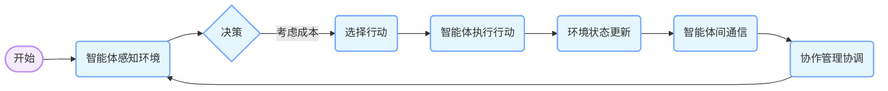

# AI优化的约翰·伯格成本控制策略：多智能体协作

> 关键词：AI优化、约翰·伯格成本控制策略、多智能体协作、成本优化、智能体交互

> 摘要：本文聚焦于AI优化领域中运用约翰·伯格成本控制策略实现多智能体协作的相关内容。首先介绍了该研究的背景、目的、预期读者等信息，接着深入剖析了多智能体协作与成本控制的核心概念及联系，详细阐述了核心算法原理与具体操作步骤，借助数学模型和公式进行理论支撑，并结合实际案例进行说明。同时，展示了项目实战中的代码实现与解读，探讨了其实际应用场景，推荐了相关的学习资源、开发工具和论文著作。最后对未来发展趋势与挑战进行总结，并提供常见问题解答与参考资料，旨在为相关领域的研究者和从业者提供全面而深入的技术指导。

## 1. 背景介绍 
### 1.1 目的和范围
在当今AI技术飞速发展的时代，如何有效地控制成本并提高系统性能成为了关键问题。约翰·伯格成本控制策略在传统领域已被证明具有一定的有效性，将其引入AI优化的多智能体协作场景中，旨在通过智能体之间的协作，实现资源的合理分配和成本的有效控制。本研究的范围涵盖了多智能体协作的基本原理、相关算法、数学模型，以及在实际项目中的应用等方面。

### 1.2 预期读者
本文预期读者包括AI领域的研究人员、程序员、软件架构师、CTO等技术专业人士，以及对AI优化和成本控制感兴趣的学生和爱好者。希望通过本文的阐述，能为他们在相关领域的研究和实践提供有价值的参考。

### 1.3 文档结构概述
本文首先介绍背景信息，为读者提供研究的基础和动机。接着详细阐述核心概念与联系，帮助读者理解多智能体协作和成本控制的基本原理。然后讲解核心算法原理和具体操作步骤，通过Python代码进行示例。随后利用数学模型和公式对相关理论进行深入分析，并举例说明。在项目实战部分，展示代码实现和详细解读。之后探讨实际应用场景，推荐相关工具和资源。最后总结未来发展趋势与挑战，提供常见问题解答和参考资料。

### 1.4 术语表
#### 1.4.1 核心术语定义
- **AI优化**：通过各种技术和算法，提高人工智能系统的性能和效率，使其在处理任务时更加准确和快速。
- **约翰·伯格成本控制策略**：一种基于成本效益分析的策略，旨在通过合理的资源分配和决策，实现成本的最小化和效益的最大化。
- **多智能体协作**：多个智能体（具有自主决策和行动能力的实体）通过交互和协调，共同完成一个或多个任务的过程。
- **智能体**：能够感知环境、做出决策并采取行动的实体，在AI系统中可以是软件程序、机器人等。

#### 1.4.2 相关概念解释
- **成本**：在AI系统中，成本可以包括计算资源的使用、数据传输的开销、能源消耗等方面的费用。
- **协作机制**：智能体之间进行信息交换、协调行动的方式和规则，以实现共同的目标。
- **资源分配**：根据任务需求和智能体的能力，将有限的资源合理地分配给各个智能体，以提高系统的整体性能。

#### 1.4.3 缩略词列表
- **AI**：Artificial Intelligence（人工智能）
- **MAS**：Multi - Agent System（多智能体系统）

## 2. 核心概念与联系 
### 核心概念原理
多智能体协作是一种分布式的问题解决方法，其中每个智能体都有自己的目标和能力。在AI优化的场景中，多个智能体通过协作可以更有效地利用资源，提高系统的整体性能。约翰·伯格成本控制策略则强调在决策过程中考虑成本因素，通过合理的资源分配和行动选择，实现成本的最小化。

多智能体协作的核心在于智能体之间的交互和协调。智能体通过感知环境和其他智能体的状态，做出相应的决策，并采取行动。这种交互可以是直接的通信，也可以是通过环境的间接影响。例如，在一个物流配送系统中，多个配送机器人（智能体）可以通过通信协调各自的路线，避免冲突，提高配送效率。

约翰·伯格成本控制策略在多智能体协作中的应用，主要体现在智能体的决策过程中。智能体在选择行动时，不仅要考虑任务的完成情况，还要考虑成本因素。例如，在选择计算资源时，智能体需要权衡计算速度和成本，选择最优的资源配置。

### 架构的文本示意图
多智能体协作的架构可以分为以下几个层次：
1. **智能体层**：包含多个独立的智能体，每个智能体具有感知、决策和行动的能力。
2. **通信层**：负责智能体之间的信息交换，包括消息的发送和接收。
3. **协作管理层**：协调智能体之间的行动，解决冲突，确保系统的整体目标得以实现。
4. **环境层**：智能体所处的环境，提供智能体感知的信息和行动的空间。

### Mermaid流程图


## 3. 核心算法原理 & 具体操作步骤 
### 核心算法原理
在多智能体协作中应用约翰·伯格成本控制策略，一种常见的算法是基于强化学习的方法。强化学习是一种通过智能体与环境的交互来学习最优策略的方法，智能体在每个时间步根据当前状态选择一个行动，并根据环境的反馈（奖励）来调整自己的策略。

在本算法中，智能体的目标是在完成任务的同时，最小化成本。因此，奖励函数不仅要考虑任务的完成情况，还要考虑成本因素。例如，在一个任务分配问题中，奖励函数可以定义为：

$$R = R_{task} - \alpha C$$

其中，$R_{task}$ 是与任务完成情况相关的奖励，$C$ 是执行任务的成本，$\alpha$ 是一个权重系数，用于平衡任务奖励和成本。

### 具体操作步骤
1. **初始化**：初始化智能体的策略网络和环境状态。
2. **智能体感知环境**：智能体获取当前环境的状态信息。
3. **决策**：智能体根据当前状态和策略网络，选择一个行动。
4. **执行行动**：智能体执行选择的行动，并更新环境状态。
5. **获取奖励**：根据环境的反馈，计算智能体的奖励。
6. **更新策略**：智能体根据奖励和当前状态，更新自己的策略网络。
7. **重复步骤2 - 6**：直到任务完成或达到最大时间步。

### Python源代码示例
```python
import numpy as np
import torch
import torch.nn as nn
import torch.optim as optim

# 定义智能体的策略网络
class PolicyNetwork(nn.Module):
    def __init__(self, input_size, output_size):
        super(PolicyNetwork, self).__init__()
        self.fc1 = nn.Linear(input_size, 128)
        self.fc2 = nn.Linear(128, output_size)

    def forward(self, x):
        x = torch.relu(self.fc1(x))
        x = torch.softmax(self.fc2(x), dim=-1)
        return x

# 定义环境
class Environment:
    def __init__(self):
        self.state = np.random.rand(10)  # 随机初始化环境状态
        self.task_completed = False
        self.cost = 0

    def step(self, action):
        # 模拟环境状态更新
        self.state += action * 0.1
        # 模拟任务完成情况
        if np.sum(self.state) > 10:
            self.task_completed = True
        # 模拟成本增加
        self.cost += np.abs(action).sum() * 0.1
        # 计算奖励
        if self.task_completed:
            reward_task = 100
        else:
            reward_task = 0
        alpha = 0.1
        reward = reward_task - alpha * self.cost
        return self.state, reward, self.task_completed

# 训练智能体
def train():
    input_size = 10
    output_size = 5
    policy_network = PolicyNetwork(input_size, output_size)
    optimizer = optim.Adam(policy_network.parameters(), lr=0.001)
    env = Environment()
    max_steps = 100

    for step in range(max_steps):
        state = torch.FloatTensor(env.state)
        action_probs = policy_network(state)
        action = torch.multinomial(action_probs, 1).item()
        next_state, reward, done = env.step(action)
        next_state = torch.FloatTensor(next_state)

        # 计算损失
        log_prob = torch.log(action_probs[action])
        loss = -log_prob * reward

        # 更新策略网络
        optimizer.zero_grad()
        loss.backward()
        optimizer.step()

        if done:
            break

if __name__ == "__main__":
    train()
```

## 4. 数学模型和公式 & 详细讲解 & 举例说明 
### 数学模型
在多智能体协作中应用约翰·伯格成本控制策略的数学模型可以描述为一个马尔可夫决策过程（MDP）。MDP由一个四元组 $(S, A, P, R)$ 组成，其中：
- $S$ 是状态空间，表示环境的所有可能状态。
- $A$ 是行动空间，表示智能体可以采取的所有可能行动。
- $P$ 是状态转移概率，表示在当前状态 $s \in S$ 下采取行动 $a \in A$ 后转移到下一个状态 $s' \in S$ 的概率，即 $P(s'|s, a)$。
- $R$ 是奖励函数，表示在当前状态 $s$ 下采取行动 $a$ 后获得的奖励，即 $R(s, a)$。

### 数学公式
在基于强化学习的算法中，智能体的目标是最大化长期累积奖励。长期累积奖励可以定义为：

$$G_t = \sum_{k = 0}^{\infty} \gamma^k R_{t + k + 1}$$

其中，$G_t$ 是在时间步 $t$ 的长期累积奖励，$\gamma \in [0, 1]$ 是折扣因子，用于权衡当前奖励和未来奖励的重要性。

智能体的策略 $\pi(a|s)$ 表示在状态 $s$ 下选择行动 $a$ 的概率。智能体的目标是找到最优策略 $\pi^*$，使得长期累积奖励的期望值最大，即：

$$\pi^* = \arg \max_{\pi} \mathbb{E}[G_t | \pi]$$

### 详细讲解
在上述公式中，折扣因子 $\gamma$ 起到了重要的作用。当 $\gamma$ 接近 1 时，智能体更注重未来的奖励；当 $\gamma$ 接近 0 时，智能体更注重当前的奖励。

状态转移概率 $P(s'|s, a)$ 描述了环境的动态特性。在实际应用中，这个概率可能是已知的，也可能需要通过学习来估计。

奖励函数 $R(s, a)$ 是智能体学习的指导信号。在约翰·伯格成本控制策略中，奖励函数需要考虑任务完成情况和成本因素，以引导智能体在完成任务的同时最小化成本。

### 举例说明
假设一个物流配送系统，智能体是配送机器人。状态 $s$ 可以表示机器人的位置、货物的状态等信息；行动 $a$ 可以表示机器人的移动方向、是否装载或卸载货物等。状态转移概率 $P(s'|s, a)$ 可以根据机器人的运动学模型和环境的物理特性来确定。

奖励函数 $R(s, a)$ 可以设计为：如果机器人成功将货物送达目的地，则给予一个较大的正奖励；如果机器人在运动过程中消耗了过多的能量（成本），则给予一个负奖励。通过这种方式，机器人可以学习到在完成配送任务的同时，尽量减少能量消耗的策略。

## 5. 项目实战：代码实际案例和详细解释说明 
### 5.1  开发环境搭建
#### 安装Python
首先需要安装Python环境，建议使用Python 3.7及以上版本。可以从Python官方网站（https://www.python.org/downloads/） 下载安装包，按照安装向导进行安装。

#### 安装依赖库
在本项目中，需要使用到 `torch` 库进行深度学习相关的操作。可以使用以下命令进行安装：
```sh
pip install torch
```

### 5.2  源代码详细实现和代码解读
```python
import numpy as np
import torch
import torch.nn as nn
import torch.optim as optim

# 定义智能体的策略网络
class PolicyNetwork(nn.Module):
    def __init__(self, input_size, output_size):
        super(PolicyNetwork, self).__init__()
        self.fc1 = nn.Linear(input_size, 128)
        self.fc2 = nn.Linear(128, output_size)

    def forward(self, x):
        x = torch.relu(self.fc1(x))
        x = torch.softmax(self.fc2(x), dim=-1)
        return x

# 定义环境
class Environment:
    def __init__(self):
        self.state = np.random.rand(10)  # 随机初始化环境状态
        self.task_completed = False
        self.cost = 0

    def step(self, action):
        # 模拟环境状态更新
        self.state += action * 0.1
        # 模拟任务完成情况
        if np.sum(self.state) > 10:
            self.task_completed = True
        # 模拟成本增加
        self.cost += np.abs(action).sum() * 0.1
        # 计算奖励
        if self.task_completed:
            reward_task = 100
        else:
            reward_task = 0
        alpha = 0.1
        reward = reward_task - alpha * self.cost
        return self.state, reward, self.task_completed

# 训练智能体
def train():
    input_size = 10
    output_size = 5
    policy_network = PolicyNetwork(input_size, output_size)
    optimizer = optim.Adam(policy_network.parameters(), lr=0.001)
    env = Environment()
    max_steps = 100

    for step in range(max_steps):
        state = torch.FloatTensor(env.state)
        action_probs = policy_network(state)
        action = torch.multinomial(action_probs, 1).item()
        next_state, reward, done = env.step(action)
        next_state = torch.FloatTensor(next_state)

        # 计算损失
        log_prob = torch.log(action_probs[action])
        loss = -log_prob * reward

        # 更新策略网络
        optimizer.zero_grad()
        loss.backward()
        optimizer.step()

        if done:
            break

if __name__ == "__main__":
    train()
```

### 代码解读与分析
#### 策略网络 `PolicyNetwork`
- `__init__` 方法：初始化策略网络的结构，包含一个输入层到隐藏层的线性变换 `fc1` 和一个隐藏层到输出层的线性变换 `fc2`。
- `forward` 方法：定义了前向传播过程，先通过 `relu` 激活函数对输入进行非线性变换，然后通过 `softmax` 函数将输出转换为概率分布。

#### 环境类 `Environment`
- `__init__` 方法：初始化环境的状态、任务完成标志和成本。
- `step` 方法：根据智能体的行动更新环境状态，判断任务是否完成，计算成本，并根据任务完成情况和成本计算奖励。

#### 训练函数 `train`
- 初始化策略网络、优化器和环境。
- 在每个时间步，智能体根据当前状态选择一个行动，执行行动并更新环境状态，计算奖励。
- 根据奖励和行动的概率计算损失，并使用优化器更新策略网络的参数。
- 如果任务完成，则提前结束训练。

## 6. 实际应用场景 
### 物流配送领域
在物流配送系统中，多个配送机器人（智能体）可以通过协作完成货物的配送任务。通过应用约翰·伯格成本控制策略，机器人可以在选择配送路线时，考虑运输成本（如能源消耗、时间成本等），避免不必要的绕行和等待，提高配送效率，降低成本。

### 智能电网领域
在智能电网中，多个分布式发电单元（智能体）可以通过协作实现电力的优化分配。发电单元可以根据电网的需求和自身的发电成本，调整发电功率，以最小化整个电网的运行成本。

### 制造业领域
在制造业中，多个生产设备（智能体）可以通过协作完成产品的生产任务。设备可以根据生产任务的要求和自身的运行成本，合理安排生产计划，提高生产效率，降低生产成本。

## 7. 工具和资源推荐
### 7.1 学习资源推荐
#### 7.1.1 书籍推荐
- 《人工智能：一种现代的方法》：全面介绍了人工智能的基本概念、算法和应用，是学习人工智能的经典教材。
- 《强化学习：原理与Python实现》：详细讲解了强化学习的原理和算法，并通过Python代码进行实现，适合学习强化学习的读者。

#### 7.1.2 在线课程
- Coursera上的“人工智能基础”课程：由知名教授授课，系统地介绍了人工智能的基础知识和应用。
- edX上的“强化学习”课程：深入讲解了强化学习的理论和实践，提供了丰富的案例和实验。

#### 7.1.3 技术博客和网站
- Medium：有许多关于AI优化和多智能体协作的技术文章和案例分享。
- arXiv：提供了最新的AI研究论文，可以了解到该领域的前沿动态。

### 7.2 开发工具框架推荐
#### 7.2.1 IDE和编辑器
- PyCharm：功能强大的Python集成开发环境，提供了代码编辑、调试、版本控制等功能。
- Visual Studio Code：轻量级的代码编辑器，支持多种编程语言，有丰富的插件扩展功能。

#### 7.2.2 调试和性能分析工具
- PyTorch Profiler：用于分析PyTorch代码的性能瓶颈，帮助优化代码。
- TensorBoard：可以可视化训练过程中的各种指标，方便调试和分析。

#### 7.2.3 相关框架和库
- PyTorch：深度学习框架，提供了丰富的神经网络模块和优化算法，方便实现强化学习算法。
- OpenAI Gym：提供了一系列的强化学习环境，方便进行算法的测试和验证。

### 7.3 相关论文著作推荐
#### 7.3.1 经典论文
- “Multi - Agent Systems: A Modern Approach to Distributed Artificial Intelligence”：系统地介绍了多智能体系统的基本概念、理论和应用。
- “Reinforcement Learning: An Introduction”：强化学习领域的经典论文，对强化学习的理论和算法进行了深入的探讨。

#### 7.3.2 最新研究成果
- 在arXiv和顶级AI会议（如NeurIPS、ICML等）上搜索关于多智能体协作和成本控制的最新研究论文，了解该领域的前沿动态。

#### 7.3.3 应用案例分析
- 相关的行业报告和研究论文中会有关于多智能体协作在实际应用中的案例分析，可以从中学习到实际应用中的经验和技巧。

## 8. 总结：未来发展趋势与挑战
### 未来发展趋势
- **更加复杂的协作场景**：随着AI技术的发展，多智能体协作将应用于更加复杂的场景，如自动驾驶、智能城市等。在这些场景中，智能体需要处理更多的不确定性和动态变化，协作的难度和复杂度将大大增加。
- **与其他技术的融合**：多智能体协作将与区块链、物联网等技术深度融合，实现更加安全、高效的协作。例如，区块链技术可以提供可信的协作环境，物联网技术可以提供更丰富的感知信息。
- **强化学习算法的改进**：为了更好地实现成本控制和优化，强化学习算法将不断改进和创新。例如，引入更多的先验知识、采用多目标优化等方法，提高算法的性能和效率。

### 挑战
- **通信和协调问题**：在多智能体协作中，智能体之间的通信和协调是关键问题。如何确保智能体之间能够及时、准确地交换信息，解决冲突和协调行动，是需要解决的挑战之一。
- **计算资源和成本**：随着智能体数量的增加和协作场景的复杂化，计算资源的需求也会大幅增加。如何在有限的计算资源下实现高效的协作，同时控制成本，是一个重要的挑战。
- **安全和隐私问题**：在多智能体协作中，智能体之间需要交换大量的信息，这涉及到安全和隐私问题。如何保护智能体的隐私和数据安全，防止信息泄露和攻击，是需要解决的重要问题。

## 9. 附录：常见问题与解答
### 问题1：多智能体协作和单智能体系统有什么区别？
解答：单智能体系统只有一个智能体，其决策和行动主要基于自身的感知和能力。而多智能体协作系统包含多个智能体，智能体之间需要通过交互和协调来共同完成任务。多智能体协作可以利用智能体之间的互补性，提高系统的整体性能，但也面临着通信、协调等方面的挑战。

### 问题2：如何选择合适的奖励函数？
解答：奖励函数的设计需要根据具体的任务和目标来确定。在应用约翰·伯格成本控制策略时，奖励函数需要考虑任务完成情况和成本因素。一般来说，可以先定义与任务完成相关的奖励，然后根据成本的大小给予相应的惩罚。可以通过实验和调优来确定合适的奖励函数参数。

### 问题3：多智能体协作在实际应用中会遇到哪些困难？
解答：在实际应用中，多智能体协作可能会遇到通信延迟、信息不完全、智能体故障等问题。此外，智能体之间的冲突和协调也是一个难题。为了解决这些问题，需要设计有效的通信协议、协调机制和容错策略。

## 10. 扩展阅读 & 参考资料
### 扩展阅读
- 《多智能体系统导论》
- 《人工智能与机器学习中的数学方法》

### 参考资料
- [OpenAI Gym官方文档](https://gym.openai.com/docs/)
- [PyTorch官方文档](https://pytorch.org/docs/stable/index.html)
- 相关的学术论文和研究报告。