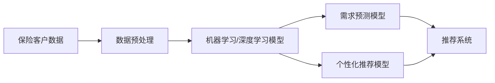

# AI在保险产品需求预测与个性化推荐中的深度应用

> 关键词：人工智能、保险产品、需求预测、个性化推荐、数据分析、机器学习、深度学习

> 摘要：本文聚焦于AI在保险产品需求预测与个性化推荐中的深度应用。随着保险市场的竞争日益激烈，精准把握客户需求并提供个性化的保险产品推荐成为提升保险企业竞争力的关键。文章首先介绍了研究的背景、目的、预期读者等信息，接着阐述了AI相关的核心概念及其联系，详细讲解了核心算法原理和具体操作步骤，包括使用Python代码进行示例。同时，对涉及的数学模型和公式进行了详细说明并举例。通过项目实战展示了AI在保险领域的实际应用过程，分析了实际应用场景。此外，还推荐了相关的学习资源、开发工具框架以及论文著作。最后总结了未来发展趋势与挑战，解答了常见问题并提供了扩展阅读和参考资料，旨在为保险行业利用AI实现需求预测和个性化推荐提供全面的技术指导和理论支持。

## 1. 背景介绍 
### 1.1 目的和范围
在当今数字化时代，保险行业面临着巨大的变革。客户对于保险产品的需求日益多样化和个性化，传统的营销和产品推荐方式已经难以满足市场的需求。本研究的目的在于深入探讨如何利用人工智能（AI）技术，尤其是机器学习和深度学习算法，对保险客户的需求进行准确预测，并基于此为客户提供个性化的保险产品推荐。

本研究的范围涵盖了保险行业的各个领域，包括人寿保险、财产保险、健康保险等。研究将聚焦于如何收集和分析客户数据，运用AI算法进行需求建模和预测，以及如何将预测结果应用于个性化推荐系统的开发和优化。

### 1.2 预期读者
本文的预期读者主要包括保险行业的从业者，如保险产品经理、市场营销人员、数据分析人员等，他们可以从本文中获取关于如何利用AI技术提升保险业务效率和客户满意度的实用信息和技术指导。同时，对AI技术在金融领域应用感兴趣的研究人员、学者以及相关专业的学生也可以从本文中获得有价值的参考。

### 1.3 文档结构概述
本文将按照以下结构进行组织：
1. **背景介绍**：阐述研究的目的、范围、预期读者和文档结构概述，并对相关术语进行解释。
2. **核心概念与联系**：介绍AI、机器学习、深度学习等核心概念，以及它们在保险产品需求预测与个性化推荐中的联系，并通过文本示意图和Mermaid流程图进行说明。
3. **核心算法原理 & 具体操作步骤**：详细讲解用于需求预测和个性化推荐的核心算法原理，如决策树、神经网络等，并使用Python源代码进行示例。
4. **数学模型和公式 & 详细讲解 & 举例说明**：介绍相关的数学模型和公式，如线性回归、逻辑回归等，并通过具体例子进行详细讲解。
5. **项目实战：代码实际案例和详细解释说明**：通过一个实际的保险项目，展示如何搭建开发环境、实现源代码，并对代码进行详细解读和分析。
6. **实际应用场景**：分析AI在保险产品需求预测与个性化推荐中的实际应用场景，如客户细分、风险评估等。
7. **工具和资源推荐**：推荐相关的学习资源、开发工具框架以及论文著作。
8. **总结：未来发展趋势与挑战**：总结AI在保险行业的未来发展趋势，并分析可能面临的挑战。
9. **附录：常见问题与解答**：解答读者在阅读过程中可能遇到的常见问题。
10. **扩展阅读 & 参考资料**：提供相关的扩展阅读材料和参考资料。

### 1.4 术语表
#### 1.4.1 核心术语定义
- **人工智能（AI）**：指计算机系统能够执行通常需要人类智能才能完成的任务，如学习、推理、解决问题等。
- **机器学习（ML）**：是AI的一个子集，专注于让计算机通过数据学习模式和规律，而无需明确的编程指令。
- **深度学习（DL）**：是机器学习的一个分支，基于人工神经网络，尤其是深度神经网络，能够自动从大量数据中学习复杂的模式和特征。
- **需求预测**：指通过对历史数据和相关因素的分析，预测客户未来对保险产品的需求。
- **个性化推荐**：根据客户的个人特征、偏好和行为，为客户推荐符合其需求的保险产品。

#### 1.4.2 相关概念解释
- **数据挖掘**：从大量数据中发现有价值的信息和知识的过程，是机器学习和数据分析的重要手段。
- **特征工程**：指从原始数据中提取和选择有用的特征，以提高机器学习模型的性能。
- **模型评估**：对机器学习模型的性能进行评估和验证，以确保模型的准确性和可靠性。

#### 1.4.3 缩略词列表
- **AI**：Artificial Intelligence（人工智能）
- **ML**：Machine Learning（机器学习）
- **DL**：Deep Learning（深度学习）
- **API**：Application Programming Interface（应用程序编程接口）
- **KPI**：Key Performance Indicator（关键绩效指标）

## 2. 核心概念与联系 

### 核心概念原理
#### 人工智能（AI）
人工智能是一门研究如何使计算机系统能够模拟人类智能的学科。它的核心目标是让计算机能够感知环境、学习知识、做出决策和解决问题。AI的实现方式包括符号推理、机器学习、深度学习等多种技术。

#### 机器学习（ML）
机器学习是AI的一个重要分支，它通过让计算机从数据中学习模式和规律，从而实现对未知数据的预测和分类。机器学习的主要任务包括监督学习、无监督学习和强化学习。监督学习是指在有标记数据的情况下，学习输入数据和输出标签之间的映射关系；无监督学习是指在无标记数据的情况下，发现数据中的模式和结构；强化学习是指通过智能体与环境的交互，学习最优的行为策略。

#### 深度学习（DL）
深度学习是机器学习的一个子领域，它基于人工神经网络，尤其是深度神经网络。深度神经网络由多个层次的神经元组成，能够自动从大量数据中学习复杂的模式和特征。深度学习在图像识别、语音识别、自然语言处理等领域取得了巨大的成功。

#### 需求预测
需求预测是指通过对历史数据和相关因素的分析，预测客户未来对保险产品的需求。需求预测的方法包括时间序列分析、回归分析、机器学习等。准确的需求预测可以帮助保险企业合理安排资源、优化产品设计和制定营销策略。

#### 个性化推荐
个性化推荐是指根据客户的个人特征、偏好和行为，为客户推荐符合其需求的保险产品。个性化推荐的方法包括基于内容的推荐、协同过滤推荐、混合推荐等。个性化推荐可以提高客户的满意度和忠诚度，增加保险产品的销售量。

### 架构的文本示意图
```plaintext
保险客户数据（人口统计学信息、行为数据、历史购买记录等）
|
|__ 数据预处理（清洗、特征提取、特征选择等）
|
|__ 机器学习/深度学习模型（决策树、神经网络、支持向量机等）
|       |
|       |__ 需求预测模型（预测客户未来的保险需求）
|       |
|       |__ 个性化推荐模型（根据客户需求推荐保险产品）
|
|__ 推荐系统（将预测结果展示给客户）
```

### Mermaid流程图


## 3. 核心算法原理 & 具体操作步骤 

### 决策树算法原理
决策树是一种常用的机器学习算法，它通过对数据的特征进行递归划分，构建一棵决策树。决策树的每个内部节点表示一个特征上的测试，每个分支表示一个测试输出，每个叶节点表示一个类别或值。决策树的优点是易于理解和解释，能够处理非线性数据。

### Python源代码示例
```python
from sklearn.datasets import load_iris
from sklearn.model_selection import train_test_split
from sklearn.tree import DecisionTreeClassifier
from sklearn.metrics import accuracy_score

# 加载数据集
iris = load_iris()
X = iris.data
y = iris.target

# 划分训练集和测试集
X_train, X_test, y_train, y_test = train_test_split(X, y, test_size=0.3, random_state=42)

# 创建决策树分类器
clf = DecisionTreeClassifier()

# 训练模型
clf.fit(X_train, y_train)

# 预测
y_pred = clf.predict(X_test)

# 评估模型
accuracy = accuracy_score(y_test, y_pred)
print(f"Accuracy: {accuracy}")
```

### 操作步骤
1. **数据加载**：使用`sklearn.datasets`中的`load_iris`函数加载鸢尾花数据集。
2. **数据划分**：使用`train_test_split`函数将数据集划分为训练集和测试集。
3. **模型创建**：创建一个`DecisionTreeClassifier`对象。
4. **模型训练**：使用`fit`方法对模型进行训练。
5. **模型预测**：使用`predict`方法对测试集进行预测。
6. **模型评估**：使用`accuracy_score`函数计算模型的准确率。

### 神经网络算法原理
神经网络是一种模仿人类神经系统的计算模型，它由多个神经元组成的层次结构。神经网络的输入层接收输入数据，隐藏层对输入数据进行特征提取和转换，输出层输出预测结果。神经网络的训练过程是通过反向传播算法来调整神经元之间的连接权重，以最小化预测结果与真实标签之间的误差。

### Python源代码示例
```python
import tensorflow as tf
from tensorflow.keras.datasets import mnist
from tensorflow.keras.models import Sequential
from tensorflow.keras.layers import Dense, Flatten
from tensorflow.keras.utils import to_categorical

# 加载数据集
(train_images, train_labels), (test_images, test_labels) = mnist.load_data()

# 数据预处理
train_images = train_images / 255.0
test_images = test_images / 255.0
train_labels = to_categorical(train_labels)
test_labels = to_categorical(test_labels)

# 创建神经网络模型
model = Sequential([
    Flatten(input_shape=(28, 28)),
    Dense(128, activation='relu'),
    Dense(10, activation='softmax')
])

# 编译模型
model.compile(optimizer='adam',
              loss='categorical_crossentropy',
              metrics=['accuracy'])

# 训练模型
model.fit(train_images, train_labels, epochs=5, batch_size=32)

# 评估模型
test_loss, test_acc = model.evaluate(test_images, test_labels)
print(f"Test accuracy: {test_acc}")
```

### 操作步骤
1. **数据加载**：使用`tensorflow.keras.datasets`中的`mnist.load_data`函数加载MNIST手写数字数据集。
2. **数据预处理**：将图像数据归一化到0-1之间，并将标签进行one-hot编码。
3. **模型创建**：使用`Sequential`模型创建一个简单的神经网络模型，包括一个`Flatten`层、一个`Dense`层和一个`Dense`输出层。
4. **模型编译**：使用`compile`方法指定优化器、损失函数和评估指标。
5. **模型训练**：使用`fit`方法对模型进行训练。
6. **模型评估**：使用`evaluate`方法对模型进行评估。

## 4. 数学模型和公式 & 详细讲解 & 举例说明 

### 线性回归模型
#### 数学公式
线性回归是一种用于预测连续数值的机器学习模型，它的基本形式为：
$$y = \theta_0 + \theta_1x_1 + \theta_2x_2 + \cdots + \theta_nx_n + \epsilon$$
其中，$y$ 是预测值，$x_1, x_2, \cdots, x_n$ 是输入特征，$\theta_0, \theta_1, \cdots, \theta_n$ 是模型的参数，$\epsilon$ 是误差项。

#### 详细讲解
线性回归的目标是找到一组最优的参数 $\theta$，使得预测值 $y$ 与真实值之间的误差最小。通常使用最小二乘法来求解最优参数，即最小化误差平方和：
$$J(\theta) = \frac{1}{2m}\sum_{i=1}^{m}(h_{\theta}(x^{(i)}) - y^{(i)})^2$$
其中，$m$ 是样本数量，$h_{\theta}(x^{(i)})$ 是第 $i$ 个样本的预测值，$y^{(i)}$ 是第 $i$ 个样本的真实值。

#### 举例说明
假设我们有一组房屋面积和房价的数据，我们想要使用线性回归模型来预测房价。我们可以将房屋面积作为输入特征 $x$，房价作为输出 $y$，则线性回归模型可以表示为：
$$y = \theta_0 + \theta_1x$$
我们可以使用最小二乘法来求解 $\theta_0$ 和 $\theta_1$ 的最优值，从而得到一个能够预测房价的线性回归模型。

### 逻辑回归模型
#### 数学公式
逻辑回归是一种用于分类的机器学习模型，它的基本形式为：
$$h_{\theta}(x) = \frac{1}{1 + e^{-\theta^Tx}}$$
其中，$h_{\theta}(x)$ 是预测的概率，$\theta$ 是模型的参数，$x$ 是输入特征。

#### 详细讲解
逻辑回归的目标是找到一组最优的参数 $\theta$，使得预测的概率 $h_{\theta}(x)$ 与真实标签之间的误差最小。通常使用对数损失函数来求解最优参数，即最小化对数损失：
$$J(\theta) = -\frac{1}{m}\sum_{i=1}^{m}[y^{(i)}\log(h_{\theta}(x^{(i)})) + (1 - y^{(i)})\log(1 - h_{\theta}(x^{(i)}))]$$
其中，$m$ 是样本数量，$y^{(i)}$ 是第 $i$ 个样本的真实标签。

#### 举例说明
假设我们有一组客户的特征数据和是否购买保险的标签数据，我们想要使用逻辑回归模型来预测客户是否会购买保险。我们可以将客户的特征作为输入特征 $x$，是否购买保险的标签作为输出 $y$，则逻辑回归模型可以表示为：
$$h_{\theta}(x) = \frac{1}{1 + e^{-\theta^Tx}}$$
我们可以使用对数损失函数来求解 $\theta$ 的最优值，从而得到一个能够预测客户是否会购买保险的逻辑回归模型。

## 5. 项目实战：代码实际案例和详细解释说明 

### 5.1  开发环境搭建
#### 安装Python
首先，我们需要安装Python开发环境。可以从Python官方网站（https://www.python.org/downloads/）下载适合自己操作系统的Python版本，并按照安装向导进行安装。

#### 安装必要的库
在项目中，我们需要使用一些Python库，如`pandas`、`numpy`、`scikit-learn`、`tensorflow`等。可以使用以下命令来安装这些库：
```sh
pip install pandas numpy scikit-learn tensorflow
```

#### 数据集准备
我们使用一个虚构的保险客户数据集，该数据集包含客户的人口统计学信息、行为数据和历史购买记录等。可以将数据集保存为CSV文件，并使用`pandas`库来读取和处理数据。

### 5.2  源代码详细实现和代码解读
```python
import pandas as pd
from sklearn.model_selection import train_test_split
from sklearn.ensemble import RandomForestClassifier
from sklearn.metrics import accuracy_score

# 读取数据集
data = pd.read_csv('insurance_data.csv')

# 数据预处理
# 假设数据集中有一些缺失值，我们可以使用均值填充
data.fillna(data.mean(), inplace=True)

# 分离特征和标签
X = data.drop('target', axis=1)
y = data['target']

# 划分训练集和测试集
X_train, X_test, y_train, y_test = train_test_split(X, y, test_size=0.2, random_state=42)

# 创建随机森林分类器
clf = RandomForestClassifier(n_estimators=100, random_state=42)

# 训练模型
clf.fit(X_train, y_train)

# 预测
y_pred = clf.predict(X_test)

# 评估模型
accuracy = accuracy_score(y_test, y_pred)
print(f"Accuracy: {accuracy}")
```

### 5.3  代码解读与分析
1. **数据读取**：使用`pandas`库的`read_csv`函数读取保险客户数据集。
2. **数据预处理**：使用`fillna`方法填充数据集中的缺失值。
3. **特征和标签分离**：使用`drop`方法将目标列从特征数据中分离出来。
4. **数据集划分**：使用`train_test_split`函数将数据集划分为训练集和测试集。
5. **模型创建**：创建一个`RandomForestClassifier`对象，指定树的数量为100。
6. **模型训练**：使用`fit`方法对模型进行训练。
7. **模型预测**：使用`predict`方法对测试集进行预测。
8. **模型评估**：使用`accuracy_score`函数计算模型的准确率。

## 6. 实际应用场景 
### 客户细分
AI可以通过对客户的人口统计学信息、行为数据和历史购买记录等进行分析，将客户划分为不同的细分群体。例如，根据客户的年龄、收入、职业等特征，将客户分为年轻高收入群体、中年中等收入群体等。不同的细分群体具有不同的保险需求，保险企业可以针对不同的细分群体制定个性化的营销策略和产品推荐。

### 风险评估
AI可以通过对客户的风险因素进行分析，评估客户的风险水平。例如，对于人寿保险，AI可以根据客户的年龄、健康状况、家族病史等因素，评估客户的死亡风险；对于财产保险，AI可以根据客户的房屋位置、建筑结构、使用情况等因素，评估客户的财产损失风险。基于风险评估结果，保险企业可以制定合理的保险费率和保险条款。

### 个性化推荐
AI可以根据客户的个人特征、偏好和行为，为客户推荐符合其需求的保险产品。例如，对于年轻的上班族，AI可以推荐意外险、医疗险等；对于有家庭的中年客户，AI可以推荐人寿保险、教育金保险等。个性化推荐可以提高客户的满意度和忠诚度，增加保险产品的销售量。

### 客户服务优化
AI可以通过自然语言处理技术，实现智能客服系统。智能客服系统可以自动回答客户的问题，提供保险产品信息和理赔指导等服务。同时，AI还可以通过对客户的反馈和投诉进行分析，发现客户的痛点和需求，从而优化客户服务流程和提高服务质量。

## 7. 工具和资源推荐
### 7.1 学习资源推荐
#### 7.1.1 书籍推荐
- 《机器学习》（周志华著）：这是一本经典的机器学习教材，系统地介绍了机器学习的基本概念、算法和应用。
- 《深度学习》（Ian Goodfellow、Yoshua Bengio和Aaron Courville著）：这是一本深度学习领域的权威著作，全面介绍了深度学习的理论和实践。
- 《Python机器学习》（Sebastian Raschka和Vahid Mirjalili著）：这本书结合Python语言，详细介绍了机器学习的算法和实现。

#### 7.1.2 在线课程
- Coursera上的“机器学习”课程（Andrew Ng教授授课）：这是一门非常受欢迎的机器学习课程，讲解深入浅出，适合初学者。
- edX上的“深度学习微硕士项目”：该项目涵盖了深度学习的多个领域，提供了丰富的实践项目和案例。
- 中国大学MOOC上的“人工智能基础”课程：这是一门国内高校开设的人工智能基础课程，内容丰富，易于理解。

#### 7.1.3 技术博客和网站
- Medium：这是一个技术博客平台，有很多关于AI和机器学习的优质文章。
- Towards Data Science：这是一个专注于数据科学和机器学习的网站，提供了大量的技术文章和案例。
- 机器之心：这是一个国内的AI技术媒体，及时报道AI领域的最新动态和研究成果。

### 7.2 开发工具框架推荐
#### 7.2.1 IDE和编辑器
- PyCharm：这是一款专业的Python集成开发环境，提供了丰富的功能和插件，适合开发大型Python项目。
- Jupyter Notebook：这是一个交互式的开发环境，适合进行数据探索和模型实验。
- Visual Studio Code：这是一款轻量级的代码编辑器，支持多种编程语言，具有丰富的插件生态系统。

#### 7.2.2 调试和性能分析工具
- TensorBoard：这是TensorFlow提供的一个可视化工具，用于监控和分析深度学习模型的训练过程。
- Scikit-learn的`cross_val_score`函数：该函数可以用于模型的交叉验证和性能评估。
- Profiler：Python的内置性能分析工具，可以帮助我们找出代码中的性能瓶颈。

#### 7.2.3 相关框架和库
- Scikit-learn：这是一个常用的机器学习库，提供了丰富的机器学习算法和工具。
- TensorFlow：这是一个开源的深度学习框架，广泛应用于图像识别、语音识别、自然语言处理等领域。
- PyTorch：这是另一个流行的深度学习框架，具有简洁的API和动态计算图的特点。

### 7.3 相关论文著作推荐
#### 7.3.1 经典论文
- “A Decision-Theoretic Generalization of On-Line Learning and an Application to Boosting”（Yoav Freund和Robert E. Schapire著）：这篇论文提出了AdaBoost算法，是机器学习领域的经典之作。
- “ImageNet Classification with Deep Convolutional Neural Networks”（Alex Krizhevsky、Ilya Sutskever和Geoffrey E. Hinton著）：这篇论文提出了AlexNet模型，开启了深度学习在图像识别领域的革命。
- “Attention Is All You Need”（Ashish Vaswani等人著）：这篇论文提出了Transformer模型，在自然语言处理领域取得了巨大的成功。

#### 7.3.2 最新研究成果
- 每年的NeurIPS（神经信息处理系统大会）、ICML（国际机器学习会议）、CVPR（计算机视觉与模式识别会议）等学术会议上都会发布AI领域的最新研究成果。
- arXiv.org是一个预印本平台，上面有很多最新的AI研究论文。

#### 7.3.3 应用案例分析
- 《AI in Insurance: Transforming the Industry with Artificial Intelligence》：这本书介绍了AI在保险行业的应用案例和实践经验。
- 一些保险企业的官方网站和行业报告中也会分享AI在保险产品需求预测和个性化推荐方面的应用案例。

## 8. 总结：未来发展趋势与挑战
### 未来发展趋势
- **多模态数据融合**：未来，AI将不仅仅依赖于结构化的客户数据，还将融合图像、语音、文本等多模态数据，以更全面地了解客户需求。
- **强化学习的应用**：强化学习将在保险领域得到更广泛的应用，例如优化保险费率、制定理赔策略等。
- **与区块链技术的结合**：区块链技术的去中心化、不可篡改等特点与AI相结合，可以提高保险数据的安全性和可信度，促进保险行业的创新发展。
- **智能化保险生态系统的构建**：AI将推动保险行业向智能化生态系统发展，实现保险产品设计、销售、理赔等环节的自动化和智能化。

### 挑战
- **数据隐私和安全**：保险行业涉及大量的客户敏感信息，如何在利用AI技术的同时保护客户数据的隐私和安全是一个重要的挑战。
- **算法可解释性**：一些复杂的AI算法，如深度学习模型，往往是黑盒模型，难以解释其决策过程和结果。在保险行业，算法的可解释性至关重要，因为需要向客户和监管机构解释保险决策的依据。
- **人才短缺**：AI技术在保险行业的应用需要既懂保险业务又懂AI技术的复合型人才，目前这类人才相对短缺，制约了AI在保险行业的推广和应用。
- **监管政策**：随着AI在保险行业的应用越来越广泛，需要相应的监管政策来规范其发展，确保AI技术的应用符合法律法规和道德标准。

## 9. 附录：常见问题与解答
### 问题1：AI在保险产品需求预测和个性化推荐中需要多少数据？
答：所需的数据量取决于具体的应用场景和算法。一般来说，数据量越大，模型的性能越好。但同时也需要注意数据的质量和多样性，确保数据能够准确反映客户的需求和行为。

### 问题2：如何评估AI模型在保险领域的性能？
答：可以使用多种指标来评估AI模型的性能，如准确率、召回率、F1值、均方误差等。具体选择哪种指标取决于具体的应用场景和任务。例如，在分类任务中，准确率和召回率是常用的评估指标；在回归任务中，均方误差是常用的评估指标。

### 问题3：AI模型在保险领域的可解释性如何保证？
答：可以采用一些方法来提高AI模型的可解释性，如使用可解释的模型（如决策树）、特征重要性分析、局部可解释模型等。此外，还可以通过可视化工具将模型的决策过程和结果直观地展示给用户。

### 问题4：AI在保险行业的应用会导致大量保险从业人员失业吗？
答：AI在保险行业的应用会对保险从业人员的工作产生一定的影响，但不会导致大量失业。相反，AI技术可以帮助保险从业人员提高工作效率和质量，让他们能够将更多的精力放在客户服务和业务创新上。同时，AI技术的应用也会创造一些新的就业机会，如AI算法工程师、数据分析师等。

## 10. 扩展阅读 & 参考资料
### 扩展阅读
- 《智能保险：科技重塑保险未来》
- 《金融科技：框架与实践》
- 《人工智能时代的保险创新》

### 参考资料
- [1] 周志华. 机器学习[M]. 清华大学出版社, 2016.
- [2] Ian Goodfellow, Yoshua Bengio, Aaron Courville. 深度学习[M]. 人民邮电出版社, 2017.
- [3] Sebastian Raschka, Vahid Mirjalili. Python机器学习[M]. 机械工业出版社, 2018.
- [4] 各学术会议论文集和相关期刊文章。