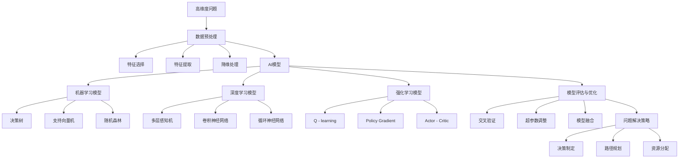

# AI在高维度问题解决中的策略创新

> 关键词：人工智能、高维度问题、策略创新、机器学习、优化算法、深度强化学习、复杂系统

> 摘要：本文聚焦于AI在高维度问题解决中的策略创新。随着科技发展，众多领域面临的问题维度不断增加，传统方法在处理高维度问题时面临效率和效果的挑战。AI凭借其强大的学习和自适应能力，为高维度问题的解决带来了新的思路和方法。文章深入探讨了AI相关的核心概念、算法原理、数学模型，并通过项目实战展示其应用，分析实际应用场景，推荐相关工具和资源，最后总结未来发展趋势与挑战，旨在为相关领域的研究和实践提供全面而深入的参考。

## 1. 背景介绍 
### 1.1 目的和范围
随着科学技术的飞速发展，许多领域如金融、物理、生物信息学、自动驾驶等都面临着高维度问题的挑战。高维度问题的复杂性使得传统的问题解决方法往往难以取得理想的效果。本文章的目的在于深入探讨AI在高维度问题解决中的策略创新，涵盖从基础概念到实际应用的各个方面，包括核心算法原理、数学模型、项目实战案例等，旨在为研究人员、工程师和对该领域感兴趣的读者提供全面的知识和实践指导。

### 1.2 预期读者
本文预期读者包括但不限于人工智能领域的研究人员、软件开发工程师、数据科学家、相关专业的学生以及对AI在高维度问题解决方面感兴趣的技术爱好者。希望通过本文，能够帮助不同层次的读者深入理解AI在高维度问题解决中的策略和方法，并为他们的研究和实践提供有益的参考。

### 1.3 文档结构概述
本文将按照以下结构展开：首先介绍背景信息，包括目的、预期读者和文档结构概述；接着阐述AI在高维度问题解决中的核心概念与联系，通过文本示意图和Mermaid流程图进行详细说明；然后讲解核心算法原理和具体操作步骤，结合Python源代码进行深入分析；之后介绍相关的数学模型和公式，并举例说明；再通过项目实战展示AI在高维度问题解决中的具体应用，包括开发环境搭建、源代码实现和代码解读；随后分析实际应用场景；推荐相关的工具和资源；总结未来发展趋势与挑战；附录部分解答常见问题；最后提供扩展阅读和参考资料。

### 1.4 术语表
#### 1.4.1 核心术语定义
- **高维度问题**：指问题的特征空间维度较高，通常意味着问题具有大量的变量或参数，使得问题的复杂性和计算量大幅增加。
- **人工智能（AI）**：是一门研究如何使计算机系统能够模拟人类智能的学科，包括机器学习、深度学习、自然语言处理等多个领域。
- **机器学习**：是AI的一个重要分支，通过让计算机从数据中学习模式和规律，从而实现预测、分类、聚类等任务。
- **深度强化学习**：结合了深度学习和强化学习的方法，通过智能体与环境的交互，不断优化策略以获得最大的累积奖励。
- **优化算法**：用于寻找函数的最优解或近似最优解的算法，在高维度问题中，优化算法的效率和性能至关重要。

#### 1.4.2 相关概念解释
- **维度灾难**：在高维度空间中，数据的分布变得稀疏，计算复杂度呈指数级增长，导致传统算法的性能急剧下降。
- **特征工程**：是指从原始数据中提取和选择有意义的特征，以提高模型的性能和效率，在高维度问题中，特征工程尤为重要。
- **策略网络**：在深度强化学习中，用于生成智能体的行动策略的神经网络。

#### 1.4.3 缩略词列表
- **AI**：Artificial Intelligence（人工智能）
- **ML**：Machine Learning（机器学习）
- **RL**：Reinforcement Learning（强化学习）
- **DRL**：Deep Reinforcement Learning（深度强化学习）
- **ANN**：Artificial Neural Network（人工神经网络）

## 2. 核心概念与联系 

### 核心概念原理
在高维度问题解决中，AI涉及多个核心概念，这些概念相互关联，共同构成了解决高维度问题的策略体系。

- **机器学习**：通过对大量数据的学习，发现数据中的模式和规律，从而对未知数据进行预测和分类。在高维度问题中，机器学习可以帮助我们从复杂的数据中提取有用的信息，降低问题的维度。
- **深度学习**：是机器学习的一个分支，通过构建多层神经网络，自动学习数据的特征表示。深度学习在处理高维度数据时具有强大的能力，能够捕捉到数据中的复杂模式。
- **强化学习**：智能体通过与环境的交互，不断尝试不同的行动，并根据环境反馈的奖励信号来优化自己的策略。在高维度问题中，强化学习可以帮助我们找到最优的决策策略。

### 架构的文本示意图
```plaintext
高维度问题
|
|-- 数据预处理
|   |-- 特征选择
|   |-- 特征提取
|   |-- 降维处理
|
|-- AI模型
|   |-- 机器学习模型
|   |   |-- 决策树
|   |   |-- 支持向量机
|   |   |-- 随机森林
|   |
|   |-- 深度学习模型
|   |   |-- 多层感知机
|   |   |-- 卷积神经网络
|   |   |-- 循环神经网络
|   |
|   |-- 强化学习模型
|   |   |-- Q - learning
|   |   |-- Policy Gradient
|   |   |-- Actor - Critic
|
|-- 模型评估与优化
|   |-- 交叉验证
|   |-- 超参数调整
|   |-- 模型融合
|
|-- 问题解决策略
|   |-- 决策制定
|   |-- 路径规划
|   |-- 资源分配
```

### Mermaid流程图


## 3. 核心算法原理 & 具体操作步骤 

### 特征选择算法 - 过滤法
过滤法是一种基于特征的统计特性进行特征选择的方法，常用的统计指标包括方差、相关性等。以下是使用Python实现基于方差的特征选择的代码：

```python
import numpy as np
from sklearn.feature_selection import VarianceThreshold

# 生成示例数据
X = np.array([[0, 2, 0, 3], [0, 1, 4, 3], [0, 1, 1, 3]])

# 创建方差阈值选择器
selector = VarianceThreshold(threshold=0.2)

# 进行特征选择
X_selected = selector.fit_transform(X)

print("原始数据形状:", X.shape)
print("选择后的数据形状:", X_selected.shape)
```

### 深度强化学习算法 - Policy Gradient
Policy Gradient算法通过直接优化策略网络的参数来最大化累积奖励。以下是一个简单的Policy Gradient算法的Python实现：

```python
import torch
import torch.nn as nn
import torch.optim as optim
import numpy as np

# 定义策略网络
class PolicyNetwork(nn.Module):
    def __init__(self, input_dim, output_dim):
        super(PolicyNetwork, self).__init__()
        self.fc1 = nn.Linear(input_dim, 128)
        self.fc2 = nn.Linear(128, output_dim)
        self.softmax = nn.Softmax(dim=1)

    def forward(self, x):
        x = torch.relu(self.fc1(x))
        x = self.softmax(self.fc2(x))
        return x

# 定义环境和参数
input_dim = 4
output_dim = 2
policy_net = PolicyNetwork(input_dim, output_dim)
optimizer = optim.Adam(policy_net.parameters(), lr=0.01)

# 训练过程
num_episodes = 100
for episode in range(num_episodes):
    # 初始化环境
    state = np.random.randn(input_dim)
    state = torch.FloatTensor(state).unsqueeze(0)
    log_probs = []
    rewards = []

    # 模拟一个episode
    for step in range(10):
        action_probs = policy_net(state)
        action = torch.multinomial(action_probs, 1).item()
        log_prob = torch.log(action_probs.squeeze(0)[action])
        log_probs.append(log_prob)

        # 模拟奖励
        reward = np.random.randint(0, 10)
        rewards.append(reward)

        # 更新状态
        state = np.random.randn(input_dim)
        state = torch.FloatTensor(state).unsqueeze(0)

    # 计算总奖励
    total_reward = sum(rewards)

    # 计算损失
    discounts = [0.9 ** i for i in range(len(rewards))]
    discounted_rewards = [r * d for r, d in zip(rewards, discounts)]
    discounted_rewards = torch.FloatTensor(discounted_rewards)
    policy_loss = []
    for log_prob, reward in zip(log_probs, discounted_rewards):
        policy_loss.append(-log_prob * reward)
    policy_loss = torch.cat(policy_loss).sum()

    # 优化策略网络
    optimizer.zero_grad()
    policy_loss.backward()
    optimizer.step()

    print(f"Episode {episode}: Total Reward = {total_reward}")
```

### 具体操作步骤
1. **数据准备**：收集和整理高维度数据，确保数据的质量和完整性。
2. **特征选择与提取**：使用过滤法、包裹法或嵌入法等特征选择方法，选择对问题有重要影响的特征；使用主成分分析（PCA）、线性判别分析（LDA）等特征提取方法，降低数据的维度。
3. **模型选择与训练**：根据问题的特点选择合适的AI模型，如机器学习模型、深度学习模型或强化学习模型，并使用训练数据对模型进行训练。
4. **模型评估与优化**：使用测试数据对训练好的模型进行评估，根据评估结果调整模型的超参数，优化模型的性能。
5. **问题解决与应用**：使用优化后的模型解决高维度问题，并将结果应用到实际场景中。

## 4. 数学模型和公式 & 详细讲解 & 举例说明 

### 主成分分析（PCA）
PCA是一种常用的降维方法，其核心思想是找到数据的主成分，使得数据在这些主成分上的方差最大。

#### 数学公式
设原始数据矩阵为 $X \in \mathbb{R}^{n \times d}$，其中 $n$ 是样本数量，$d$ 是特征维度。PCA的目标是找到一组正交的单位向量 $u_1, u_2, \cdots, u_k$（$k \leq d$），使得数据在这些向量上的投影方差最大。

首先计算数据的协方差矩阵 $S$：
$$S = \frac{1}{n - 1}X^T X$$

然后求解协方差矩阵 $S$ 的特征值和特征向量：
$$S u_i = \lambda_i u_i$$

其中 $\lambda_i$ 是特征值，$u_i$ 是对应的特征向量。将特征值从大到小排序，选择前 $k$ 个特征向量组成投影矩阵 $U = [u_1, u_2, \cdots, u_k]$。

最后将原始数据投影到新的低维空间：
$$Y = X U$$

#### 详细讲解
PCA通过找到数据的主成分，将高维度数据投影到低维度空间，从而实现降维。主成分是数据方差最大的方向，保留了数据的主要信息。

#### 举例说明
假设有一个二维数据集 $X = \begin{bmatrix} 1 & 2 \\ 2 & 4 \\ 3 & 6 \\ 4 & 8 \end{bmatrix}$，我们可以使用PCA将其降维到一维。

首先计算协方差矩阵：
$$S = \frac{1}{3} \begin{bmatrix} 1 & 2 & 3 & 4 \\ 2 & 4 & 6 & 8 \end{bmatrix} \begin{bmatrix} 1 & 2 \\ 2 & 4 \\ 3 & 6 \\ 4 & 8 \end{bmatrix} = \begin{bmatrix} \frac{30}{3} & \frac{60}{3} \\ \frac{60}{3} & \frac{120}{3} \end{bmatrix} = \begin{bmatrix} 10 & 20 \\ 20 & 40 \end{bmatrix}$$

然后求解特征值和特征向量：
特征值 $\lambda_1 = 50$，对应的特征向量 $u_1 = \begin{bmatrix} 0.4472 \\ 0.8944 \end{bmatrix}$；
特征值 $\lambda_2 = 0$，对应的特征向量 $u_2 = \begin{bmatrix} -0.8944 \\ 0.4472 \end{bmatrix}$。

选择特征值最大的特征向量 $u_1$ 作为投影向量，将原始数据投影到一维空间：
$$Y = X u_1 = \begin{bmatrix} 1 & 2 \\ 2 & 4 \\ 3 & 6 \\ 4 & 8 \end{bmatrix} \begin{bmatrix} 0.4472 \\ 0.8944 \end{bmatrix} = \begin{bmatrix} 2.236 \\ 4.472 \\ 6.708 \\ 8.944 \end{bmatrix}$$

### 深度强化学习中的策略梯度定理
在深度强化学习中，策略梯度定理用于计算策略网络参数的梯度，从而优化策略。

#### 数学公式
设策略网络的参数为 $\theta$，策略函数为 $\pi_{\theta}(a|s)$，状态价值函数为 $V^{\pi_{\theta}}(s)$，动作价值函数为 $Q^{\pi_{\theta}}(s, a)$。

策略梯度定理的公式为：
$$\nabla_{\theta} J(\theta) = \mathbb{E}_{\tau \sim \pi_{\theta}} \left[ \sum_{t = 0}^{T - 1} \nabla_{\theta} \log \pi_{\theta}(a_t|s_t) Q^{\pi_{\theta}}(s_t, a_t) \right]$$

其中 $J(\theta)$ 是策略的目标函数，$\tau$ 是一个轨迹，$T$ 是轨迹的长度。

#### 详细讲解
策略梯度定理表明，策略网络参数的梯度可以通过计算每个时间步的对数策略梯度与动作价值函数的乘积的期望来得到。通过不断更新策略网络的参数，使得策略的目标函数 $J(\theta)$ 最大化。

#### 举例说明
假设我们有一个简单的强化学习环境，状态空间为 $\{s_1, s_2\}$，动作空间为 $\{a_1, a_2\}$。策略网络的参数为 $\theta$，策略函数为 $\pi_{\theta}(a|s)$。

在一个轨迹 $\tau = (s_0, a_0, r_0, s_1, a_1, r_1)$ 中，我们可以计算策略梯度：
$$\nabla_{\theta} J(\theta) \approx \nabla_{\theta} \log \pi_{\theta}(a_0|s_0) Q^{\pi_{\theta}}(s_0, a_0) + \nabla_{\theta} \log \pi_{\theta}(a_1|s_1) Q^{\pi_{\theta}}(s_1, a_1)$$

通过多次采样轨迹，计算策略梯度的平均值，然后使用梯度上升法更新策略网络的参数 $\theta$。

## 5. 项目实战：代码实际案例和详细解释说明 

### 5.1  开发环境搭建
- **操作系统**：推荐使用Ubuntu 18.04或更高版本，或者Windows 10。
- **Python版本**：Python 3.7或更高版本。
- **依赖库安装**：使用pip安装以下库：
```bash
pip install numpy pandas scikit-learn torch matplotlib
```

### 5.2  源代码详细实现和代码解读
#### 项目背景
我们将使用一个高维度的分类问题作为示例，数据集为鸢尾花数据集的扩展版本，特征维度从4维扩展到20维。

#### 代码实现
```python
import numpy as np
import pandas as pd
from sklearn.datasets import make_classification
from sklearn.model_selection import train_test_split
from sklearn.preprocessing import StandardScaler
from sklearn.ensemble import RandomForestClassifier
from sklearn.metrics import accuracy_score
import torch
import torch.nn as nn
import torch.optim as optim
from torch.utils.data import DataLoader, TensorDataset

# 生成高维度数据集
X, y = make_classification(n_samples=1000, n_features=20, n_informative=10, n_classes=3, random_state=42)

# 数据划分
X_train, X_test, y_train, y_test = train_test_split(X, y, test_size=0.2, random_state=42)

# 数据标准化
scaler = StandardScaler()
X_train = scaler.fit_transform(X_train)
X_test = scaler.transform(X_test)

# 随机森林分类器
rf_classifier = RandomForestClassifier(n_estimators=100, random_state=42)
rf_classifier.fit(X_train, y_train)
rf_predictions = rf_classifier.predict(X_test)
rf_accuracy = accuracy_score(y_test, rf_predictions)
print(f"Random Forest Accuracy: {rf_accuracy}")

# 深度学习分类器
X_train_tensor = torch.FloatTensor(X_train)
y_train_tensor = torch.LongTensor(y_train)
X_test_tensor = torch.FloatTensor(X_test)
y_test_tensor = torch.LongTensor(y_test)

train_dataset = TensorDataset(X_train_tensor, y_train_tensor)
train_loader = DataLoader(train_dataset, batch_size=32, shuffle=True)

class NeuralNetwork(nn.Module):
    def __init__(self, input_dim, output_dim):
        super(NeuralNetwork, self).__init__()
        self.fc1 = nn.Linear(input_dim, 128)
        self.fc2 = nn.Linear(128, 64)
        self.fc3 = nn.Linear(64, output_dim)
        self.relu = nn.ReLU()

    def forward(self, x):
        x = self.relu(self.fc1(x))
        x = self.relu(self.fc2(x))
        x = self.fc3(x)
        return x

input_dim = X_train.shape[1]
output_dim = len(np.unique(y_train))
model = NeuralNetwork(input_dim, output_dim)
criterion = nn.CrossEntropyLoss()
optimizer = optim.Adam(model.parameters(), lr=0.001)

num_epochs = 100
for epoch in range(num_epochs):
    for inputs, labels in train_loader:
        optimizer.zero_grad()
        outputs = model(inputs)
        loss = criterion(outputs, labels)
        loss.backward()
        optimizer.step()

    if (epoch + 1) % 10 == 0:
        print(f"Epoch {epoch + 1}/{num_epochs}, Loss: {loss.item()}")

with torch.no_grad():
    outputs = model(X_test_tensor)
    _, predicted = torch.max(outputs.data, 1)
    dl_accuracy = (predicted == y_test_tensor).sum().item() / len(y_test_tensor)
    print(f"Deep Learning Accuracy: {dl_accuracy}")
```

#### 代码解读
1. **数据生成与划分**：使用 `make_classification` 函数生成高维度的分类数据集，然后将数据集划分为训练集和测试集。
2. **数据标准化**：使用 `StandardScaler` 对数据进行标准化处理，使得数据的均值为0，标准差为1。
3. **随机森林分类器**：使用 `RandomForestClassifier` 构建随机森林分类器，对训练数据进行训练，并在测试数据上进行预测，计算准确率。
4. **深度学习分类器**：
    - 定义神经网络模型 `NeuralNetwork`，包含三个全连接层。
    - 使用 `CrossEntropyLoss` 作为损失函数，`Adam` 作为优化器。
    - 训练神经网络模型，每个epoch打印一次损失值。
    - 在测试数据上进行预测，计算准确率。

### 5.3  代码解读与分析
- **随机森林分类器**：随机森林是一种集成学习方法，通过组合多个决策树来提高分类性能。在高维度问题中，随机森林可以自动选择重要的特征，具有较好的鲁棒性。
- **深度学习分类器**：深度学习模型可以自动学习数据的特征表示，在高维度数据上具有强大的建模能力。通过多层神经网络的非线性变换，可以捕捉到数据中的复杂模式。

比较随机森林和深度学习模型的准确率，可以发现深度学习模型在高维度问题上可能具有更好的性能，但需要更多的计算资源和训练时间。

## 6. 实际应用场景 
### 金融领域
在金融领域，高维度问题广泛存在，如股票价格预测、风险评估、投资组合优化等。AI可以通过分析大量的金融数据，包括历史价格、财务报表、宏观经济指标等，建立预测模型和风险评估模型，帮助投资者做出更明智的决策。

### 物理领域
在物理研究中，如量子物理、天体物理等，涉及到大量的高维度数据和复杂的物理模型。AI可以帮助物理学家分析和理解这些数据，发现新的物理规律和现象，加速科学研究的进程。

### 生物信息学领域
生物信息学中，基因序列分析、蛋白质结构预测等问题都是高维度问题。AI可以通过对生物数据的分析和建模，帮助生物学家更好地理解生命的奥秘，开发新的药物和治疗方法。

### 自动驾驶领域
在自动驾驶中，车辆需要处理大量的传感器数据，包括摄像头、雷达、激光雷达等，这些数据具有高维度和实时性的特点。AI可以通过对这些数据的分析和处理，实现车辆的环境感知、决策规划和控制，提高自动驾驶的安全性和可靠性。

## 7. 工具和资源推荐
### 7.1 学习资源推荐
#### 7.1.1 书籍推荐
- 《机器学习》（周志华）：全面介绍了机器学习的基本概念、算法和应用，是机器学习领域的经典教材。
- 《深度学习》（Ian Goodfellow、Yoshua Bengio、Aaron Courville）：系统地介绍了深度学习的理论和实践，是深度学习领域的权威著作。
- 《强化学习：原理与Python实现》（杉山将）：详细介绍了强化学习的基本原理和算法，并提供了Python代码实现。

#### 7.1.2 在线课程
- Coursera上的“机器学习”课程（Andrew Ng）：由机器学习领域的知名学者Andrew Ng授课，内容全面，适合初学者。
- edX上的“深度学习微硕士”课程：提供了深度学习的深入学习内容，包括多个方向的课程。
- Udemy上的“强化学习实战”课程：通过实际项目讲解强化学习的应用，具有很强的实践性。

#### 7.1.3 技术博客和网站
- Medium：上面有很多关于AI和机器学习的技术博客，涵盖了最新的研究成果和实践经验。
- arXiv：是一个预印本平台，提供了大量的AI和机器学习领域的研究论文。
- Kaggle：是一个数据科学竞赛平台，上面有很多高维度问题的数据集和解决方案，可以学习到实际应用中的技巧和方法。

### 7.2 开发工具框架推荐
#### 7.2.1 IDE和编辑器
- PyCharm：是一款专业的Python集成开发环境，具有强大的代码编辑、调试和分析功能。
- Jupyter Notebook：是一个交互式的开发环境，适合进行数据探索和模型实验。
- Visual Studio Code：是一款轻量级的代码编辑器，支持多种编程语言和插件，具有良好的扩展性。

#### 7.2.2 调试和性能分析工具
- TensorBoard：是TensorFlow的可视化工具，可以帮助用户可视化模型的训练过程、网络结构和性能指标。
- PyTorch Profiler：是PyTorch的性能分析工具，可以帮助用户分析模型的性能瓶颈，优化代码。
- cProfile：是Python的内置性能分析工具，可以帮助用户分析Python代码的性能。

#### 7.2.3 相关框架和库
- Scikit-learn：是一个简单易用的机器学习库，提供了各种机器学习算法和工具，适合快速实现和实验。
- PyTorch：是一个开源的深度学习框架，具有动态图的特点，适合研究和开发。
- TensorFlow：是一个广泛使用的深度学习框架，具有强大的分布式计算能力和社区支持。

### 7.3 相关论文著作推荐
#### 7.3.1 经典论文
- “Gradient-Based Learning Applied to Document Recognition”（Yann LeCun、Léon Bottou、Yoshua Bengio、Patrick Haffner）：介绍了卷积神经网络的经典论文，对深度学习的发展产生了深远的影响。
- “Human - Level Control Through Deep Reinforcement Learning”（Volodymyr Mnih、Koray Kavukcuoglu、David Silver等）：介绍了深度强化学习在Atari游戏中的应用，开创了深度强化学习的先河。
- “A Decision - Theoretic Generalization of On - Line Learning and an Application to Boosting”（Yoav Freund、Robert E. Schapire）：介绍了Adaboost算法的经典论文，是集成学习领域的重要成果。

#### 7.3.2 最新研究成果
- 关注NeurIPS、ICML、CVPR等顶级学术会议的最新论文，了解AI在高维度问题解决中的最新研究进展。
- 关注知名学术期刊，如Journal of Artificial Intelligence Research（JAIR）、Artificial Intelligence等，获取最新的研究成果。

#### 7.3.3 应用案例分析
- 分析Kaggle上的优秀解决方案，了解AI在实际高维度问题中的应用案例和解决思路。
- 参考工业界的实际应用案例，如Google、Facebook等公司的技术博客，了解AI在大规模高维度问题中的应用实践。

## 8. 总结：未来发展趋势与挑战
### 未来发展趋势
- **多模态融合**：将不同类型的数据，如图像、文本、音频等进行融合，利用多模态信息解决高维度问题，提高问题解决的准确性和可靠性。
- **强化学习与环境交互的智能化**：强化学习智能体将能够更好地理解环境，与环境进行更复杂的交互，在高维度动态环境中实现更优的决策。
- **可解释性AI**：随着AI在关键领域的应用越来越广泛，对AI模型的可解释性要求也越来越高。未来，将有更多的研究致力于开发可解释的AI模型，使得AI在高维度问题解决中的决策过程更加透明。
- **AI与其他领域的交叉融合**：AI将与量子计算、生物学、物理学等领域进行更深入的交叉融合，为解决高维度问题带来新的思路和方法。

### 挑战
- **计算资源的限制**：高维度问题的解决通常需要大量的计算资源，包括GPU、TPU等。如何在有限的计算资源下提高AI算法的效率是一个亟待解决的问题。
- **数据的质量和隐私问题**：高维度数据的质量和隐私保护是一个重要的挑战。数据中可能存在噪声、缺失值等问题，同时，数据的隐私保护也需要得到重视。
- **模型的可解释性和泛化能力**：AI模型在高维度问题中往往具有复杂的结构，其决策过程难以解释。此外，模型的泛化能力也是一个挑战，如何使模型在不同的数据集和环境中都能表现良好是一个关键问题。
- **伦理和社会问题**：随着AI在高维度问题解决中的应用越来越广泛，也带来了一系列的伦理和社会问题，如算法偏见、失业风险等。如何解决这些问题，确保AI的发展符合人类的利益和价值观是一个重要的挑战。

## 9. 附录：常见问题与解答
### 问题1：高维度问题为什么难以解决？
答：高维度问题难以解决的主要原因是维度灾难。在高维度空间中，数据的分布变得稀疏，计算复杂度呈指数级增长，传统算法的性能急剧下降。此外，高维度数据中可能存在大量的噪声和冗余信息，增加了问题的复杂性。

### 问题2：如何选择合适的特征选择方法？
答：选择合适的特征选择方法需要考虑多个因素，如数据的特点、问题的类型、计算资源等。过滤法简单高效，适用于大规模数据集；包裹法和嵌入法可以考虑特征之间的相关性和模型的性能，但计算复杂度较高。在实际应用中，可以尝试多种方法，比较它们的效果，选择最优的特征选择方法。

### 问题3：深度强化学习在高维度问题中的应用有哪些挑战？
答：深度强化学习在高维度问题中的应用面临以下挑战：
- **计算复杂度高**：高维度状态和动作空间使得策略网络和价值网络的参数数量大幅增加，计算复杂度高。
- **样本效率低**：深度强化学习通常需要大量的样本进行训练，在高维度问题中，样本的收集和存储成本较高。
- **探索与利用的平衡**：在高维度环境中，智能体如何在探索新的动作和利用已有的经验之间找到平衡是一个挑战。

### 问题4：如何提高AI模型在高维度问题中的可解释性？
答：提高AI模型在高维度问题中的可解释性可以从以下几个方面入手：
- **选择可解释的模型**：如决策树、线性回归等，这些模型的决策过程相对简单，容易解释。
- **特征重要性分析**：通过分析特征的重要性，了解模型是如何利用特征进行决策的。
- **模型可视化**：使用可视化工具，如TensorBoard，可视化模型的结构和训练过程，帮助理解模型的行为。
- **开发可解释的AI算法**：研究和开发新的可解释的AI算法，使得模型的决策过程更加透明。

## 10. 扩展阅读 & 参考资料
### 扩展阅读
- 《AI未来进行式》（李开复、王咏刚）：介绍了AI的发展现状和未来趋势，以及AI在各个领域的应用案例。
- 《超级智能：路线图、危险性与应对策略》（尼克·波斯特洛姆）：探讨了超级智能的发展对人类社会的影响，以及如何应对超级智能带来的挑战。
- 《思考，快与慢》（丹尼尔·卡尼曼）：介绍了人类思维的两种模式，对理解AI的决策过程和人类的认知有一定的帮助。

### 参考资料
- 相关学术论文和研究报告，如NeurIPS、ICML、CVPR等会议的论文。
- 开源代码库，如GitHub上的相关项目。
- 官方文档和教程，如Scikit-learn、PyTorch、TensorFlow等框架的官方文档。