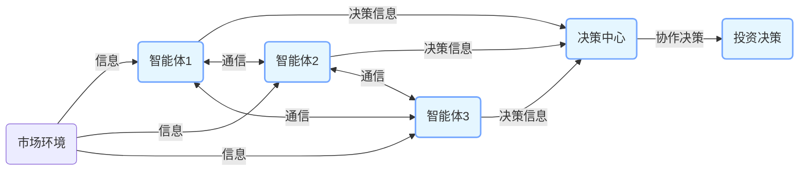

# AI多智能体优化价值投资的资金流向分析

> 关键词：AI多智能体、价值投资、资金流向分析、优化策略、投资决策

> 摘要：本文聚焦于AI多智能体在价值投资的资金流向分析中的应用。通过深入探讨AI多智能体的核心概念、算法原理以及数学模型，结合实际项目案例，阐述了如何利用这一技术优化价值投资决策。详细分析了资金流向的规律和特点，旨在为投资者提供更科学、更有效的投资策略，同时探讨了该技术在实际应用场景中的潜力和挑战，最后对其未来发展趋势进行了展望。

## 1. 背景介绍 
### 1.1 目的和范围
在当今复杂多变的金融市场中，价值投资作为一种重要的投资理念，旨在寻找被低估的资产并长期持有。然而，准确分析资金流向对于价值投资决策至关重要。资金流向反映了市场参与者的行为和预期，能够为投资者提供关于资产价值和市场趋势的重要信息。本文的目的在于研究如何利用AI多智能体技术优化价值投资的资金流向分析，提高投资决策的准确性和有效性。

本文的范围涵盖了AI多智能体的基本概念、算法原理、数学模型，以及在价值投资中的实际应用。通过理论分析和实际案例相结合的方式，全面探讨了AI多智能体在资金流向分析中的作用和优势。

### 1.2 预期读者
本文预期读者包括金融投资者、金融分析师、AI技术研究人员、金融科技从业者以及对价值投资和AI技术感兴趣的相关人士。对于投资者来说，本文可以帮助他们更好地理解资金流向分析的方法和技术，从而优化投资决策；对于技术研究人员和从业者，本文可以提供关于AI多智能体在金融领域应用的理论和实践参考。

### 1.3 文档结构概述
本文将按照以下结构进行组织：
1. **背景介绍**：阐述本文的目的、范围、预期读者和文档结构概述，并对相关术语进行定义和解释。
2. **核心概念与联系**：介绍AI多智能体的核心概念、原理和架构，以及与价值投资和资金流向分析的联系。
3. **核心算法原理 & 具体操作步骤**：详细讲解AI多智能体的核心算法原理，并给出具体的操作步骤和Python源代码示例。
4. **数学模型和公式 & 详细讲解 & 举例说明**：介绍AI多智能体在资金流向分析中的数学模型和公式，并通过具体例子进行详细讲解。
5. **项目实战：代码实际案例和详细解释说明**：通过一个实际项目案例，展示AI多智能体在价值投资的资金流向分析中的应用，包括开发环境搭建、源代码实现和代码解读。
6. **实际应用场景**：探讨AI多智能体在价值投资中的实际应用场景和优势。
7. **工具和资源推荐**：推荐相关的学习资源、开发工具框架和论文著作。
8. **总结：未来发展趋势与挑战**：总结AI多智能体在价值投资的资金流向分析中的应用现状，展望未来发展趋势，并分析面临的挑战。
9. **附录：常见问题与解答**：对常见问题进行解答，帮助读者更好地理解本文内容。
10. **扩展阅读 & 参考资料**：提供相关的扩展阅读材料和参考资料，方便读者进一步深入学习。

### 1.4 术语表
#### 1.4.1 核心术语定义
- **AI多智能体**：由多个智能体组成的系统，每个智能体具有自主决策和行动的能力，通过相互协作和交互来完成复杂的任务。
- **价值投资**：一种投资理念，通过分析资产的内在价值，寻找被低估的资产并长期持有，以获取投资收益。
- **资金流向**：指资金在不同资产、市场和投资者之间的流动方向和规模。
- **投资决策**：投资者根据各种信息和分析，做出关于投资资产、投资时机和投资规模的决策。

#### 1.4.2 相关概念解释
- **智能体**：具有感知、决策和行动能力的实体，可以是软件程序、机器人或其他智能设备。
- **多智能体系统**：由多个智能体组成的系统，智能体之间通过通信和协作来完成共同的任务。
- **强化学习**：一种机器学习方法，智能体通过与环境进行交互，根据环境反馈的奖励信号来学习最优的行为策略。

#### 1.4.3 缩略词列表
- **AI**：Artificial Intelligence（人工智能）
- **RL**：Reinforcement Learning（强化学习）
- **MDP**：Markov Decision Process（马尔可夫决策过程）

## 2. 核心概念与联系 

### 2.1 AI多智能体的核心概念
AI多智能体系统是由多个智能体组成的分布式系统。每个智能体具有一定的自主性和智能性，能够感知环境信息，根据自身的目标和策略进行决策，并采取相应的行动。智能体之间可以通过通信和协作来实现共同的目标。

智能体的基本结构包括感知模块、决策模块和行动模块。感知模块用于获取环境信息，决策模块根据感知信息和自身的目标进行决策，行动模块根据决策结果采取相应的行动。

### 2.2 价值投资与资金流向分析的联系
价值投资的核心是寻找被低估的资产，而资金流向分析可以为价值投资提供重要的信息。资金流向反映了市场参与者的行为和预期，如果某一资产有大量资金流入，可能意味着市场对该资产的预期较好，其价值可能被低估；反之，如果某一资产有大量资金流出，可能意味着市场对该资产的预期较差，其价值可能被高估。

因此，通过分析资金流向，投资者可以更好地判断资产的价值和市场趋势，从而优化价值投资决策。

### 2.3 核心概念原理和架构的文本示意图
AI多智能体在价值投资的资金流向分析中的原理和架构可以描述如下：

多个智能体分布在市场环境中，每个智能体负责收集不同类型的信息，如市场行情、公司财务数据、政策信息等。智能体通过感知模块获取这些信息，并将其传递给决策模块。决策模块根据自身的目标和策略对信息进行分析和处理，做出关于资金流向的决策。智能体之间通过通信模块进行信息交流和协作，共同优化投资决策。

### 2.4 Mermaid流程图


## 3. 核心算法原理 & 具体操作步骤 

### 3.1 核心算法原理
AI多智能体在资金流向分析中常用的算法是强化学习算法。强化学习是一种通过智能体与环境进行交互，根据环境反馈的奖励信号来学习最优行为策略的机器学习方法。

在资金流向分析中，智能体的目标是最大化投资收益。智能体通过感知市场环境信息，如资产价格、资金流向等，做出投资决策。环境根据智能体的决策给出相应的奖励，如投资收益。智能体根据奖励信号不断调整自己的决策策略，以达到最优的投资效果。

### 3.2 具体操作步骤
1. **定义智能体和环境**：定义多个智能体，每个智能体负责收集不同类型的信息。定义市场环境，包括资产价格、资金流向等信息。
2. **初始化智能体策略**：为每个智能体初始化一个初始的决策策略。
3. **智能体与环境交互**：智能体感知环境信息，根据自身的策略做出投资决策。环境根据智能体的决策给出相应的奖励。
4. **更新智能体策略**：智能体根据奖励信号更新自己的决策策略，以提高投资收益。
5. **重复步骤3和4**：不断重复智能体与环境的交互和策略更新过程，直到达到收敛条件。

### 3.3 Python源代码示例
```python
import numpy as np

# 定义智能体类
class Agent:
    def __init__(self, num_actions, learning_rate=0.1, discount_factor=0.9):
        self.num_actions = num_actions
        self.learning_rate = learning_rate
        self.discount_factor = discount_factor
        self.q_table = np.zeros((1, num_actions))  # 初始化Q表

    def choose_action(self, state):
        # 选择动作
        if np.random.uniform(0, 1) < 0.1:  # 探索
            action = np.random.choice(self.num_actions)
        else:  # 利用
            action = np.argmax(self.q_table[state])
        return action

    def update_q_table(self, state, action, reward, next_state):
        # 更新Q表
        max_q_next = np.max(self.q_table[next_state])
        self.q_table[state, action] += self.learning_rate * (reward + self.discount_factor * max_q_next - self.q_table[state, action])

# 定义环境类
class Environment:
    def __init__(self):
        self.state = 0  # 初始状态
        self.num_actions = 2  # 动作数量

    def step(self, action):
        # 执行动作并返回奖励和下一个状态
        if action == 0:
            reward = 1
        else:
            reward = -1
        next_state = 0
        return next_state, reward

# 主函数
def main():
    agent = Agent(num_actions=2)
    env = Environment()

    num_episodes = 1000
    for episode in range(num_episodes):
        state = 0
        done = False
        while not done:
            action = agent.choose_action(state)
            next_state, reward = env.step(action)
            agent.update_q_table(state, action, reward, next_state)
            state = next_state
            if episode % 100 == 0:
                print(f"Episode: {episode}, Action: {action}, Reward: {reward}")

if __name__ == "__main__":
    main()
```

## 4. 数学模型和公式 & 详细讲解 & 举例说明 

### 4.1 马尔可夫决策过程（MDP）模型
在强化学习中，通常使用马尔可夫决策过程（MDP）来描述智能体与环境的交互过程。MDP可以用一个五元组 $<S, A, P, R, \gamma>$ 来表示，其中：
- $S$ 是状态集合，表示环境的所有可能状态。
- $A$ 是动作集合，表示智能体可以采取的所有动作。
- $P(s'|s, a)$ 是状态转移概率，表示在状态 $s$ 下采取动作 $a$ 后转移到状态 $s'$ 的概率。
- $R(s, a)$ 是奖励函数，表示在状态 $s$ 下采取动作 $a$ 后获得的奖励。
- $\gamma$ 是折扣因子，用于权衡当前奖励和未来奖励的重要性。

### 4.2 Q学习算法公式
Q学习是一种常用的强化学习算法，用于学习最优的动作价值函数 $Q(s, a)$。Q学习的更新公式为：
$$Q(s, a) \leftarrow Q(s, a) + \alpha [R(s, a) + \gamma \max_{a'} Q(s', a') - Q(s, a)]$$
其中，$\alpha$ 是学习率，$R(s, a)$ 是在状态 $s$ 下采取动作 $a$ 后获得的奖励，$s'$ 是下一个状态，$\gamma$ 是折扣因子。

### 4.3 详细讲解
在资金流向分析中，状态 $s$ 可以表示市场环境的各种信息，如资产价格、资金流向等；动作 $a$ 可以表示投资决策，如买入、卖出等；奖励 $R(s, a)$ 可以表示投资收益。

智能体通过不断与环境交互，根据Q学习算法更新Q表，从而学习到最优的投资策略。

### 4.4 举例说明
假设市场环境有两种状态：上涨和下跌，智能体有两种动作：买入和卖出。初始时，Q表的值都为0。

当市场处于上涨状态时，智能体选择买入动作，获得奖励1；选择卖出动作，获得奖励 -1。智能体根据Q学习算法更新Q表，不断调整自己的决策策略。经过多次迭代，智能体将学习到在上涨状态下买入的最优策略。

## 5. 项目实战：代码实际案例和详细解释说明 

### 5.1 开发环境搭建
1. **安装Python**：确保系统中安装了Python 3.x版本。
2. **安装必要的库**：使用pip安装numpy、pandas等必要的库。
```bash
pip install numpy pandas
```

### 5.2 源代码详细实现和代码解读
```python
import numpy as np
import pandas as pd

# 定义智能体类
class Agent:
    def __init__(self, num_actions, learning_rate=0.1, discount_factor=0.9):
        self.num_actions = num_actions
        self.learning_rate = learning_rate
        self.discount_factor = discount_factor
        self.q_table = np.zeros((1, num_actions))  # 初始化Q表

    def choose_action(self, state):
        # 选择动作
        if np.random.uniform(0, 1) < 0.1:  # 探索
            action = np.random.choice(self.num_actions)
        else:  # 利用
            action = np.argmax(self.q_table[state])
        return action

    def update_q_table(self, state, action, reward, next_state):
        # 更新Q表
        max_q_next = np.max(self.q_table[next_state])
        self.q_table[state, action] += self.learning_rate * (reward + self.discount_factor * max_q_next - self.q_table[state, action])

# 定义环境类
class Environment:
    def __init__(self, data):
        self.data = data
        self.current_step = 0
        self.num_actions = 2  # 动作数量
        self.state = self.get_state()

    def get_state(self):
        # 获取当前状态
        return self.data[self.current_step]

    def step(self, action):
        # 执行动作并返回奖励和下一个状态
        if action == 0:  # 买入
            reward = self.data[self.current_step + 1] - self.data[self.current_step]
        else:  # 卖出
            reward = self.data[self.current_step] - self.data[self.current_step + 1]
        self.current_step += 1
        next_state = self.get_state()
        return next_state, reward

# 主函数
def main():
    # 加载数据
    data = pd.read_csv('stock_prices.csv')['Close'].values

    agent = Agent(num_actions=2)
    env = Environment(data)

    num_episodes = 1000
    for episode in range(num_episodes):
        state = env.get_state()
        done = False
        while not done:
            action = agent.choose_action(state)
            next_state, reward = env.step(action)
            agent.update_q_table(state, action, reward, next_state)
            state = next_state
            if env.current_step == len(data) - 1:
                done = True
            if episode % 100 == 0:
                print(f"Episode: {episode}, Action: {action}, Reward: {reward}")

if __name__ == "__main__":
    main()
```

### 5.3 代码解读与分析
- **智能体类（Agent）**：定义了智能体的基本属性和方法，包括Q表的初始化、动作选择和Q表更新。
- **环境类（Environment）**：定义了环境的基本属性和方法，包括数据加载、状态获取和动作执行。
- **主函数（main）**：加载股票价格数据，初始化智能体和环境，进行多次迭代训练，智能体不断与环境交互并更新Q表。

通过这个项目实战，我们可以看到如何利用AI多智能体技术进行资金流向分析和投资决策优化。

## 6. 实际应用场景 
### 6.1 股票投资
在股票投资中，AI多智能体可以通过分析资金流向来判断股票的价值和市场趋势。智能体可以收集不同来源的信息，如公司财务报表、新闻资讯、社交媒体情绪等，综合分析后做出投资决策。例如，当某只股票有大量资金流入，且公司基本面良好时，智能体可以建议买入该股票；反之，当有大量资金流出，且公司面临负面消息时，智能体可以建议卖出该股票。

### 6.2 基金投资
对于基金投资，AI多智能体可以分析资金在不同基金之间的流向。通过监测基金的申购和赎回情况，以及基金的业绩表现，智能体可以评估基金的吸引力和风险。例如，如果某只基金持续有大量资金流入，且业绩表现良好，智能体可以建议投资者增持该基金；如果某只基金资金流出严重，且业绩不佳，智能体可以建议投资者减持或赎回该基金。

### 6.3 债券投资
在债券投资中，AI多智能体可以分析资金在不同债券品种之间的流向。考虑债券的利率、信用评级、期限等因素，智能体可以判断债券的价值和风险。例如，当市场利率下降时，资金可能会流向长期债券，智能体可以根据资金流向和市场情况，建议投资者调整债券投资组合。

### 6.4 资产配置
AI多智能体还可以用于优化资产配置。通过分析不同资产类别（如股票、债券、现金等）的资金流向和市场表现，智能体可以根据投资者的风险偏好和投资目标，制定合理的资产配置方案。例如，对于风险偏好较高的投资者，智能体可以在股票市场资金流入较多时，增加股票资产的配置比例；对于风险偏好较低的投资者，智能体可以在市场不稳定时，增加债券和现金资产的配置比例。

## 7. 工具和资源推荐
### 7.1 学习资源推荐
#### 7.1.1 书籍推荐
- 《人工智能：一种现代的方法》：全面介绍了人工智能的基本概念、算法和应用，是学习人工智能的经典教材。
- 《强化学习：原理与Python实现》：详细讲解了强化学习的原理和算法，并通过Python代码进行实现，对于理解AI多智能体中的强化学习算法有很大帮助。
- 《价值投资：从格雷厄姆到巴菲特》：系统阐述了价值投资的理论和方法，为价值投资提供了理论基础。

#### 7.1.2 在线课程
- Coursera上的“Artificial Intelligence”课程：由斯坦福大学教授授课，内容涵盖人工智能的各个方面。
- edX上的“Reinforcement Learning”课程：深入讲解强化学习的理论和实践。
- 中国大学MOOC上的“金融投资学”课程：介绍了金融投资的基本概念和方法，对于理解价值投资和资金流向分析有帮助。

#### 7.1.3 技术博客和网站
- Medium：有很多关于AI和金融科技的技术博客，提供了最新的研究成果和实践经验。
- Towards Data Science：专注于数据科学和人工智能领域的技术文章，包含很多关于强化学习和多智能体系统的内容。
- 雪球网：提供了丰富的金融投资资讯和数据分析工具，对于了解资金流向和市场动态有帮助。

### 7.2 开发工具框架推荐
#### 7.2.1 IDE和编辑器
- PyCharm：一款功能强大的Python集成开发环境，提供了代码编辑、调试、版本控制等功能，适合Python开发。
- Jupyter Notebook：一种交互式的开发环境，适合进行数据分析和模型实验，方便展示代码和结果。

#### 7.2.2 调试和性能分析工具
- PDB：Python自带的调试工具，可以帮助开发者定位代码中的问题。
- cProfile：Python的性能分析工具，可以分析代码的运行时间和内存使用情况，帮助优化代码性能。

#### 7.2.3 相关框架和库
- OpenAI Gym：一个开源的强化学习环境库，提供了各种模拟环境，方便开发者进行强化学习算法的实验和测试。
- Stable Baselines：一个基于OpenAI Gym的强化学习库，提供了多种预训练的强化学习算法模型，方便开发者快速上手。
- Pandas：一个强大的数据分析库，用于数据处理和分析，在金融数据处理中非常有用。

### 7.3 相关论文著作推荐
#### 7.3.1 经典论文
- “Q-Learning”：由Watkins和Dayan发表的经典论文，首次提出了Q学习算法，是强化学习领域的重要里程碑。
- “Multi-Agent Systems: A Modern Approach to Distributed Artificial Intelligence”：全面介绍了多智能体系统的理论和方法，是多智能体系统领域的经典著作。

#### 7.3.2 最新研究成果
- 关注顶级学术会议如NeurIPS、ICML、AAAI等上发表的关于AI多智能体和金融科技的研究论文，了解最新的研究进展和技术趋势。

#### 7.3.3 应用案例分析
- 一些金融科技公司和研究机构会发布关于AI多智能体在金融投资领域的应用案例分析报告，可以从中学习实际应用中的经验和方法。

## 8. 总结：未来发展趋势与挑战
### 8.1 未来发展趋势
- **更加智能化和自适应**：未来的AI多智能体系统将更加智能化和自适应，能够根据市场环境的变化自动调整投资策略。智能体将具备更强的学习能力和推理能力，能够更好地理解和预测市场趋势。
- **多学科融合**：AI多智能体在价值投资中的应用将与其他学科如经济学、金融学、数学等进行更深入的融合。通过综合运用不同学科的知识和方法，提高投资决策的准确性和有效性。
- **与区块链技术结合**：区块链技术的去中心化、透明性和不可篡改的特点，与AI多智能体在资金流向分析中的应用有很好的结合点。未来可能会出现基于区块链的AI多智能体投资平台，提高投资的安全性和可信度。
- **个性化投资服务**：根据投资者的不同风险偏好、投资目标和资产状况，提供个性化的投资服务。AI多智能体可以通过分析投资者的行为数据和市场信息，为每个投资者量身定制投资策略。

### 8.2 挑战
- **数据质量和安全**：AI多智能体的决策依赖于大量的数据，数据的质量和安全直接影响投资决策的准确性和可靠性。如何获取高质量的数据，以及如何保障数据的安全和隐私，是面临的重要挑战。
- **模型可解释性**：AI多智能体的决策过程往往比较复杂，模型的可解释性较差。在金融投资领域，投资者需要了解投资决策的依据和风险，因此如何提高模型的可解释性是一个亟待解决的问题。
- **市场不确定性**：金融市场具有高度的不确定性和复杂性，AI多智能体很难完全准确地预测市场趋势。如何应对市场的不确定性，提高投资决策的鲁棒性，是需要面对的挑战。
- **法律法规和监管**：AI多智能体在金融投资中的应用涉及到法律法规和监管问题。如何确保AI多智能体的应用符合相关法律法规和监管要求，是需要解决的重要问题。

## 9. 附录：常见问题与解答
### 9.1 问题1：AI多智能体在资金流向分析中的准确性如何保证？
解答：AI多智能体的准确性主要依赖于数据质量、算法模型和训练过程。首先，要确保获取到高质量、准确的数据，包括市场行情、公司财务数据等。其次，选择合适的算法模型，如强化学习算法，并进行合理的参数调整。最后，通过大量的训练和优化，不断提高智能体的学习能力和决策准确性。

### 9.2 问题2：AI多智能体在不同市场环境下的表现如何？
解答：AI多智能体在不同市场环境下的表现会有所差异。在稳定的市场环境中，智能体可以通过学习历史数据和市场规律，做出较为准确的投资决策。但在市场波动较大、不确定性较高的环境中，智能体的表现可能会受到影响。为了提高智能体在不同市场环境下的适应性，可以采用多策略融合、自适应学习等方法。

### 9.3 问题3：如何评估AI多智能体在价值投资中的效果？
解答：可以从多个方面评估AI多智能体在价值投资中的效果。一是投资收益，比较智能体的投资收益与市场基准和其他投资策略的收益；二是风险指标，如波动率、最大回撤等，评估智能体的风险控制能力；三是决策准确性，通过分析智能体的投资决策与实际市场走势的符合程度来评估。

### 9.4 问题4：AI多智能体在价值投资中的应用是否会取代人类投资者？
解答：AI多智能体在价值投资中的应用不会完全取代人类投资者。虽然AI多智能体可以通过数据分析和算法模型提供更科学、更高效的投资决策建议，但人类投资者具有独特的判断力、经验和直觉。在实际投资中，人类投资者可以结合AI多智能体的建议，做出更加合理的投资决策。

## 10. 扩展阅读 & 参考资料
### 10.1 扩展阅读
- 《智能金融：AI如何重塑金融未来》：探讨了AI在金融领域的应用和发展趋势，为进一步了解AI多智能体在价值投资中的应用提供了更广阔的视野。
- 《金融科技前沿：理论与实务》：介绍了金融科技的最新发展和应用案例，对于深入理解AI多智能体在金融投资中的应用有帮助。

### 10.2 参考资料
- [OpenAI Gym官方文档](https://gym.openai.com/)
- [Stable Baselines官方文档](https://stable-baselines.readthedocs.io/)
- [Pandas官方文档](https://pandas.pydata.org/)
- [Coursera官方网站](https://www.coursera.org/)
- [edX官方网站](https://www.edx.org/)
- [中国大学MOOC官方网站](https://www.icourse163.org/)