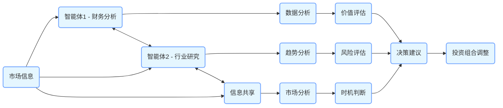

# AI多智能体系统在价值投资中的应用概述

> 关键词：AI多智能体系统、价值投资、投资决策、市场预测、智能交互

> 摘要：本文旨在全面探讨AI多智能体系统在价值投资领域的应用。首先介绍了相关背景，包括目的范围、预期读者等内容。接着阐述了AI多智能体系统与价值投资的核心概念及联系，详细讲解了核心算法原理与具体操作步骤，通过数学模型和公式进行深入分析并举例说明。然后结合项目实战，展示代码实际案例并进行详细解释。还探讨了其实际应用场景，推荐了相关的工具和资源。最后总结了未来发展趋势与挑战，列出常见问题与解答及扩展阅读参考资料，为深入研究和应用AI多智能体系统于价值投资提供全面的参考。

## 1. 背景介绍 
### 1.1 目的和范围
在当今复杂多变的金融市场环境下，价值投资作为一种重要的投资策略，旨在寻找被低估的资产并长期持有以获取收益。然而，传统的价值投资方法往往面临信息处理能力有限、难以应对市场动态变化等挑战。AI多智能体系统作为一种新兴的技术手段，具有分布式、自组织、智能交互等特点，为价值投资带来了新的机遇和解决方案。

本文的目的在于深入探讨AI多智能体系统在价值投资中的应用，包括其原理、方法、实际案例以及未来发展趋势等方面。范围涵盖了AI多智能体系统的基本概念、核心算法，价值投资的基本理论，以及两者结合在投资决策、市场预测等领域的具体应用。

### 1.2 预期读者
本文预期读者包括金融投资领域的从业者，如基金经理、投资顾问、分析师等，他们可以通过了解AI多智能体系统在价值投资中的应用，提升投资决策的科学性和准确性；计算机科学和人工智能领域的研究人员和开发者，有助于他们拓展研究方向和应用场景；以及对金融科技和价值投资感兴趣的学生和爱好者，为他们提供系统的学习资料和研究思路。

### 1.3 文档结构概述
本文将按照以下结构进行组织：首先介绍AI多智能体系统和价值投资的背景知识，包括术语定义和相关概念解释；接着阐述两者的核心概念与联系，通过文本示意图和Mermaid流程图进行直观展示；然后详细讲解核心算法原理和具体操作步骤，结合Python源代码进行说明；再通过数学模型和公式对其进行深入分析并举例；之后展示项目实战中的代码实际案例并详细解释；探讨实际应用场景；推荐相关的工具和资源；最后总结未来发展趋势与挑战，列出常见问题与解答及扩展阅读参考资料。

### 1.4 术语表
#### 1.4.1 核心术语定义
- **AI多智能体系统（AI Multi - Agent System）**：由多个智能体组成的系统，每个智能体具有一定的自主性、智能性和交互能力，它们通过相互协作和通信来完成共同的任务或实现特定的目标。
- **价值投资（Value Investing）**：一种投资策略，投资者通过分析资产的内在价值，寻找被市场低估的资产进行投资，期望在资产价格回归其内在价值时获得收益。
- **智能体（Agent）**：在AI多智能体系统中，是一个具有感知、决策和行动能力的实体，能够根据环境信息和自身的目标进行自主决策和行动。
- **投资组合（Investment Portfolio）**：投资者将资金分配到不同的资产上所形成的资产集合，目的是通过分散投资降低风险并实现预期的收益目标。

#### 1.4.2 相关概念解释
- **分布式计算（Distributed Computing）**：将计算任务分配到多个计算节点上进行并行处理的计算模式，AI多智能体系统通常采用分布式计算来提高系统的效率和可扩展性。
- **机器学习（Machine Learning）**：让计算机通过数据学习模式和规律，从而实现预测和决策的技术，AI多智能体系统中的智能体可以利用机器学习算法进行信息处理和决策。
- **市场有效性（Market Efficiency）**：指市场价格反映所有可用信息的程度，价值投资基于市场并非完全有效的假设，认为存在被低估的资产。

#### 1.4.3 缩略词列表
- **AI**：Artificial Intelligence（人工智能）
- **MAS**：Multi - Agent System（多智能体系统）
- **ML**：Machine Learning（机器学习）
- **ETF**：Exchange - Traded Fund（交易型开放式指数基金）

## 2. 核心概念与联系 

### 2.1 AI多智能体系统原理
AI多智能体系统由多个智能体组成，每个智能体具有一定的自主性和智能性。智能体可以感知环境信息，根据自身的目标和规则进行决策，并采取相应的行动。智能体之间通过通信机制进行交互和协作，共同完成系统的任务。

智能体的基本结构包括感知模块、决策模块和行动模块。感知模块负责收集环境信息，决策模块根据感知到的信息和自身的目标进行决策，行动模块则根据决策结果执行相应的行动。

### 2.2 价值投资原理
价值投资的核心思想是寻找被市场低估的资产。投资者通过对资产的基本面进行分析，包括财务报表、行业前景、管理层能力等方面，评估资产的内在价值。当资产的市场价格低于其内在价值时，投资者认为该资产具有投资价值，会选择买入并长期持有，等待资产价格回归其内在价值。

### 2.3 两者的联系
AI多智能体系统可以为价值投资提供强大的支持。智能体可以通过感知模块收集大量的市场信息，包括股价、财务数据、新闻资讯等。决策模块可以利用机器学习算法对这些信息进行分析和处理，评估资产的内在价值和投资风险。行动模块可以根据决策结果进行投资操作，如买入、卖出或持有资产。

多个智能体之间的协作可以实现信息共享和互补，提高投资决策的准确性和效率。例如，一个智能体专注于财务数据分析，另一个智能体专注于行业趋势研究，它们通过通信机制共享信息，共同为投资决策提供依据。

### 2.4 文本示意图
AI多智能体系统在价值投资中的应用可以用以下文本示意图表示：

智能体1（财务分析） -- 信息收集（财务报表、指标） -- 数据分析（机器学习算法） -- 价值评估 -- 决策建议 -- 投资组合调整

智能体2（行业研究） -- 信息收集（行业报告、新闻） -- 趋势分析（机器学习算法） -- 风险评估 -- 决策建议 -- 投资组合调整

智能体3（市场监测） -- 信息收集（股价、成交量） -- 市场分析（机器学习算法） -- 时机判断 -- 决策建议 -- 投资组合调整

多个智能体通过通信机制进行信息共享和协作，共同为价值投资决策提供支持。

### 2.5 Mermaid流程图


## 3. 核心算法原理 & 具体操作步骤 

### 3.1 核心算法原理
在AI多智能体系统应用于价值投资中，常用的核心算法包括机器学习算法和多智能体协作算法。

#### 3.1.1 机器学习算法
- **回归分析**：用于预测资产的内在价值。通过对历史财务数据和市场数据进行回归分析，建立资产价值与相关因素之间的数学模型。例如，使用线性回归模型预测股票的每股收益：

```python
import numpy as np
from sklearn.linear_model import LinearRegression

# 示例数据：自变量（财务指标）和因变量（每股收益）
X = np.array([[1, 2], [2, 3], [3, 4], [4, 5]])
y = np.array([3, 5, 7, 9])

# 创建线性回归模型
model = LinearRegression()

# 训练模型
model.fit(X, y)

# 预测新数据
new_X = np.array([[5, 6]])
prediction = model.predict(new_X)
print("预测的每股收益:", prediction)
```

- **分类算法**：用于对资产进行分类，如判断股票是否具有投资价值。常用的分类算法有逻辑回归、决策树、支持向量机等。以下是一个使用逻辑回归进行股票投资价值分类的示例：

```python
from sklearn.linear_model import LogisticRegression
from sklearn.model_selection import train_test_split
from sklearn.datasets import make_classification

# 生成示例数据
X, y = make_classification(n_samples=100, n_features=4, random_state=0)

# 划分训练集和测试集
X_train, X_test, y_train, y_test = train_test_split(X, y, test_size=0.2, random_state=0)

# 创建逻辑回归模型
model = LogisticRegression()

# 训练模型
model.fit(X_train, y_train)

# 预测测试集数据
y_pred = model.predict(X_test)
print("预测结果:", y_pred)
```

#### 3.1.2 多智能体协作算法
- **合同网协议（Contract Net Protocol）**：用于智能体之间的任务分配和协作。当一个智能体有任务需要完成时，它会发布任务招标，其他智能体根据自身能力进行投标，任务发布者选择最合适的投标者并签订合同，投标者完成任务后向任务发布者汇报结果。

### 3.2 具体操作步骤

#### 3.2.1 数据收集
智能体通过各种渠道收集市场信息，包括财务报表、行业报告、新闻资讯、股价数据等。可以使用网络爬虫技术从互联网上获取相关数据，也可以从金融数据提供商购买数据。

#### 3.2.2 数据预处理
对收集到的数据进行清洗、转换和归一化处理，以提高数据的质量和可用性。例如，处理缺失值、异常值，将数据转换为适合机器学习算法处理的格式。

```python
import pandas as pd
from sklearn.preprocessing import StandardScaler

# 示例数据
data = pd.DataFrame({'A': [1, 2, 3, 4, 5], 'B': [2, 4, 6, 8, 10]})

# 处理缺失值
data = data.dropna()

# 数据归一化
scaler = StandardScaler()
scaled_data = scaler.fit_transform(data)
print("归一化后的数据:", scaled_data)
```

#### 3.2.3 模型训练
使用机器学习算法对预处理后的数据进行训练，建立资产价值评估模型和投资决策模型。根据不同的任务选择合适的算法，如回归分析用于价值评估，分类算法用于投资决策。

#### 3.2.4 智能体协作
多个智能体之间通过通信机制进行信息共享和协作。例如，一个智能体完成财务分析后，将结果发送给其他智能体，其他智能体根据这些信息进行进一步的分析和决策。

#### 3.2.5 投资决策与执行
根据智能体的决策建议，进行投资组合的调整和投资操作的执行。例如，当智能体判断某只股票具有投资价值时，买入该股票；当判断某只股票的投资风险增加时，卖出该股票。

## 4. 数学模型和公式 & 详细讲解 & 举例说明 

### 4.1 回归分析模型
回归分析是一种常用的预测模型，用于建立自变量和因变量之间的关系。线性回归模型的一般形式为：

$$y = \beta_0 + \beta_1x_1 + \beta_2x_2 + \cdots + \beta_nx_n + \epsilon$$

其中，$y$ 是因变量，$x_1, x_2, \cdots, x_n$ 是自变量，$\beta_0, \beta_1, \beta_2, \cdots, \beta_n$ 是回归系数，$\epsilon$ 是误差项。

回归系数的估计通常使用最小二乘法，即通过最小化误差项的平方和来求解回归系数。最小二乘法的目标函数为：

$$\min_{\beta_0, \beta_1, \cdots, \beta_n} \sum_{i=1}^{m} (y_i - (\beta_0 + \beta_1x_{i1} + \beta_2x_{i2} + \cdots + \beta_nx_{in}))^2$$

其中，$m$ 是样本数量，$y_i$ 是第 $i$ 个样本的因变量值，$x_{i1}, x_{i2}, \cdots, x_{in}$ 是第 $i$ 个样本的自变量值。

**举例说明**：假设我们要预测股票的每股收益（$y$）与公司的营业收入（$x_1$）和净利润（$x_2$）之间的关系。我们收集了 $m$ 个样本数据，使用线性回归模型进行拟合。通过最小二乘法求解回归系数 $\beta_0, \beta_1, \beta_2$，得到回归方程。然后，对于新的公司营业收入和净利润数据，我们可以使用回归方程预测该股票的每股收益。

### 4.2 分类算法模型
逻辑回归是一种常用的分类算法，用于二分类问题。逻辑回归模型的基本形式为：

$$P(y = 1|x) = \frac{1}{1 + e^{-(\beta_0 + \beta_1x_1 + \beta_2x_2 + \cdots + \beta_nx_n)}}$$

其中，$P(y = 1|x)$ 是给定自变量 $x$ 时，因变量 $y$ 取值为 1 的概率，$\beta_0, \beta_1, \beta_2, \cdots, \beta_n$ 是回归系数。

逻辑回归模型的目标是通过最大化似然函数来估计回归系数。似然函数的形式为：

$$L(\beta) = \prod_{i=1}^{m} P(y_i|x_i)^{y_i} (1 - P(y_i|x_i))^{1 - y_i}$$

其中，$m$ 是样本数量，$y_i$ 是第 $i$ 个样本的因变量值，$x_i$ 是第 $i$ 个样本的自变量值。

**举例说明**：假设我们要判断一只股票是否具有投资价值（$y$，$y = 1$ 表示有投资价值，$y = 0$ 表示没有投资价值），自变量包括公司的财务指标、行业前景等（$x_1, x_2, \cdots, x_n$）。我们使用逻辑回归模型对历史数据进行训练，得到回归系数。对于新的股票数据，我们可以使用逻辑回归模型计算该股票具有投资价值的概率，根据概率进行分类决策。

### 4.3 多智能体协作模型
合同网协议的数学模型可以用以下步骤表示：

1. **任务发布**：任务发布者 $A$ 发布任务 $T$，并定义任务的需求和奖励。
2. **投标**：其他智能体 $B_1, B_2, \cdots, B_n$ 根据自身能力和资源评估是否投标。每个智能体 $B_i$ 计算投标的效用 $U_i$，效用函数可以表示为：

$$U_i = R_i - C_i$$

其中，$R_i$ 是投标成功后智能体 $B_i$ 获得的奖励，$C_i$ 是智能体 $B_i$ 完成任务的成本。

3. **合同签订**：任务发布者 $A$ 根据投标智能体的效用值选择最合适的投标者 $B_j$，并签订合同。
4. **任务执行**：投标者 $B_j$ 完成任务 $T$，并向任务发布者 $A$ 汇报结果。

**举例说明**：假设有一个智能体系统，其中一个智能体需要对某只股票进行深入的行业分析任务。该智能体发布任务招标，其他智能体根据自身的行业研究能力和资源进行投标。每个智能体计算自己投标的效用值，任务发布者选择效用值最大的智能体签订合同，该智能体完成行业分析任务后向任务发布者汇报结果。

## 5. 项目实战：代码实际案例和详细解释说明 

### 5.1  开发环境搭建
#### 5.1.1 安装Python
首先需要安装Python编程语言，建议使用Python 3.x 版本。可以从Python官方网站（https://www.python.org/downloads/） 下载安装包，按照安装向导进行安装。

#### 5.1.2 安装必要的库
在价值投资项目中，需要安装一些常用的Python库，如 `pandas` 用于数据处理，`numpy` 用于数值计算，`scikit - learn` 用于机器学习，`matplotlib` 用于数据可视化等。可以使用 `pip` 命令进行安装：

```sh
pip install pandas numpy scikit-learn matplotlib
```

### 5.2  源代码详细实现和代码解读
以下是一个简单的AI多智能体系统在价值投资中的项目实战代码示例，包括数据收集、预处理、模型训练和投资决策等步骤。

```python
import pandas as pd
import numpy as np
from sklearn.linear_model import LinearRegression
from sklearn.model_selection import train_test_split
from sklearn.metrics import mean_squared_error
import matplotlib.pyplot as plt

# 5.2.1 数据收集（示例数据）
# 假设我们有一个包含股票财务数据和股价的数据文件 'stock_data.csv'
data = pd.read_csv('stock_data.csv')

# 5.2.2 数据预处理
# 选择特征和目标变量
X = data[['Revenue', 'Profit']]  # 营业收入和净利润作为特征
y = data['StockPrice']  # 股价作为目标变量

# 处理缺失值
X = X.dropna()
y = y[X.index]

# 数据归一化
from sklearn.preprocessing import StandardScaler
scaler = StandardScaler()
X_scaled = scaler.fit_transform(X)

# 5.2.3 划分训练集和测试集
X_train, X_test, y_train, y_test = train_test_split(X_scaled, y, test_size=0.2, random_state=0)

# 5.2.4 模型训练
# 创建线性回归模型
model = LinearRegression()

# 训练模型
model.fit(X_train, y_train)

# 5.2.5 模型评估
# 预测测试集数据
y_pred = model.predict(X_test)

# 计算均方误差
mse = mean_squared_error(y_test, y_pred)
print("均方误差:", mse)

# 5.2.6 投资决策（简单示例）
# 假设我们有一个新的股票数据
new_data = pd.DataFrame({'Revenue': [1000], 'Profit': [200]})
new_data_scaled = scaler.transform(new_data)
predicted_price = model.predict(new_data_scaled)
print("预测的股票价格:", predicted_price)

# 简单的投资决策：如果预测价格高于当前市场价格，则买入
current_market_price = 150
if predicted_price > current_market_price:
    print("建议买入该股票")
else:
    print("建议不买入该股票")

# 5.2.7 数据可视化
plt.scatter(y_test, y_pred)
plt.xlabel('实际股价')
plt.ylabel('预测股价')
plt.title('实际股价 vs 预测股价')
plt.show()
```

### 5.3  代码解读与分析
- **数据收集**：使用 `pandas` 库的 `read_csv` 函数读取包含股票财务数据和股价的数据文件。
- **数据预处理**：选择营业收入和净利润作为特征，股价作为目标变量。处理缺失值，使用 `StandardScaler` 对特征数据进行归一化处理，以提高模型的训练效果。
- **划分训练集和测试集**：使用 `train_test_split` 函数将数据划分为训练集和测试集，比例为 80% 训练集和 20% 测试集。
- **模型训练**：创建线性回归模型，并使用训练集数据进行训练。
- **模型评估**：使用测试集数据进行预测，计算均方误差来评估模型的性能。
- **投资决策**：对于新的股票数据，进行预测并根据预测价格和当前市场价格进行简单的投资决策。
- **数据可视化**：使用 `matplotlib` 库绘制实际股价和预测股价的散点图，直观展示模型的预测效果。

## 6. 实际应用场景 
### 6.1 投资组合优化
AI多智能体系统可以帮助投资者优化投资组合。不同的智能体可以负责分析不同类型的资产，如股票、债券、基金等。通过智能体之间的协作和信息共享，可以综合考虑各种因素，如资产的风险、收益、相关性等，构建最优的投资组合。例如，一个智能体分析股票市场的行业趋势，另一个智能体分析债券市场的利率走势，它们共同为投资组合的资产配置提供决策依据。

### 6.2 市场预测
智能体可以收集和分析大量的市场信息，包括宏观经济数据、行业动态、公司财务报表等，使用机器学习算法进行市场预测。例如，预测股票价格的走势、市场的涨跌趋势等。多个智能体可以从不同的角度进行分析，提高预测的准确性。例如，一个智能体专注于技术分析，另一个智能体专注于基本面分析，它们的预测结果相互补充。

### 6.3 风险评估
AI多智能体系统可以对投资风险进行评估。智能体可以分析资产的历史数据、市场波动情况、行业竞争态势等因素，计算资产的风险指标，如波动率、夏普比率等。通过多智能体的协作，可以全面评估投资组合的风险状况，并及时调整投资策略以降低风险。例如，当某个智能体检测到市场风险增加时，通知其他智能体调整投资组合中的资产配置。

### 6.4 交易决策支持
在交易过程中，智能体可以根据实时市场信息和投资策略提供交易决策支持。例如，当股票价格达到预设的买入或卖出阈值时，智能体可以及时发出交易信号。多个智能体可以相互协作，确保交易决策的合理性和及时性。例如，一个智能体负责监测股价，另一个智能体负责分析市场情绪，它们共同判断是否进行交易。

## 7. 工具和资源推荐
### 7.1 学习资源推荐
#### 7.1.1 书籍推荐
- 《人工智能：一种现代的方法》：全面介绍了人工智能的基本概念、算法和应用，是人工智能领域的经典教材。
- 《Python数据分析实战》：详细介绍了使用Python进行数据分析的方法和技巧，包括数据处理、可视化、机器学习等方面。
- 《价值投资：从格雷厄姆到巴菲特》：系统阐述了价值投资的理论和实践，是价值投资领域的权威著作。

#### 7.1.2 在线课程
- Coursera上的“人工智能基础”课程：由知名高校教授授课，讲解人工智能的基本原理和算法。
- edX上的“Python数据科学”课程：提供了丰富的Python数据处理和分析的教学内容。
- Udemy上的“价值投资实战”课程：结合实际案例，讲解价值投资的策略和方法。

#### 7.1.3 技术博客和网站
- Medium：有许多关于人工智能和金融科技的技术博客，提供了最新的研究成果和实践经验。
- Towards Data Science：专注于数据科学和机器学习领域，有很多高质量的技术文章。
- Seeking Alpha：提供金融市场的分析和投资建议，是价值投资者的重要信息来源。

### 7.2 开发工具框架推荐
#### 7.2.1 IDE和编辑器
- PyCharm：功能强大的Python集成开发环境，提供代码编辑、调试、版本控制等功能。
- Jupyter Notebook：交互式的开发环境，适合数据探索和模型训练，方便代码的展示和分享。
- Visual Studio Code：轻量级的代码编辑器，支持多种编程语言和插件扩展。

#### 7.2.2 调试和性能分析工具
- `pdb`：Python自带的调试工具，可以帮助开发者定位和解决代码中的问题。
- `cProfile`：Python的性能分析工具，可以分析代码的运行时间和函数调用情况，帮助优化代码性能。
- TensorBoard：用于可视化深度学习模型的训练过程和性能指标，方便开发者进行模型调优。

#### 7.2.3 相关框架和库
- `pandas`：用于数据处理和分析的Python库，提供了高效的数据结构和数据操作方法。
- `numpy`：用于数值计算的Python库，提供了强大的数组和矩阵运算功能。
- `scikit - learn`：用于机器学习的Python库，包含了各种常用的机器学习算法和工具。
- `tensorflow` 和 `pytorch`：深度学习框架，用于构建和训练复杂的神经网络模型。

### 7.3 相关论文著作推荐
#### 7.3.1 经典论文
- “A Mathematical Theory of Communication”（Claude E. Shannon）：信息论的奠基之作，对人工智能和机器学习中的信息处理有重要影响。
- “Pattern Recognition and Machine Learning”（Christopher M. Bishop）：机器学习领域的经典著作，系统介绍了机器学习的基本理论和算法。
- “The Intelligent Investor”（Benjamin Graham）：价值投资领域的经典著作，阐述了价值投资的基本原则和方法。

#### 7.3.2 最新研究成果
- 关注顶级学术会议如NeurIPS（神经信息处理系统大会）、ICML（国际机器学习会议）等的论文，了解人工智能和机器学习领域的最新研究成果。
- 关注金融领域的学术期刊如《Journal of Finance》、《Review of Financial Studies》等，了解价值投资和金融科技的最新研究进展。

#### 7.3.3 应用案例分析
- 一些知名金融机构和科技公司的研究报告和案例分享，如摩根大通、谷歌等，介绍了AI多智能体系统在金融投资领域的实际应用案例和效果。

## 8. 总结：未来发展趋势与挑战
### 8.1 未来发展趋势
#### 8.1.1 更智能的智能体
未来的智能体将具备更强的学习能力和推理能力，能够自动从复杂的市场信息中提取有价值的知识，并进行更准确的决策。例如，智能体可以通过强化学习不断优化自己的投资策略，适应市场的变化。

#### 8.1.2 多领域融合
AI多智能体系统将与其他领域的技术如区块链、物联网等深度融合。例如，区块链技术可以提供更安全、透明的交易环境，物联网技术可以提供更多的实时市场数据，为价值投资提供更全面的支持。

#### 8.1.3 个性化投资服务
根据投资者的风险偏好、投资目标和财务状况，提供个性化的投资服务。智能体可以为不同的投资者定制专属的投资组合和投资策略，提高投资的针对性和有效性。

### 8.2 挑战
#### 8.2.1 数据质量和安全
AI多智能体系统依赖大量的市场数据进行决策，数据的质量和安全至关重要。不准确或不完整的数据可能导致错误的决策，而数据泄露和恶意攻击可能给投资者带来损失。

#### 8.2.2 模型解释性
机器学习模型，尤其是深度学习模型，往往是黑盒模型，难以解释其决策过程和依据。在价值投资中，投资者需要了解模型的决策原理，以便做出合理的投资决策。

#### 8.2.3 法律法规和监管
AI多智能体系统在价值投资中的应用涉及到法律法规和监管问题。例如，智能体的投资决策是否符合金融市场的监管要求，如何对智能体的行为进行监管等。

## 9. 附录：常见问题与解答
### 9.1 什么是AI多智能体系统？
AI多智能体系统是由多个智能体组成的系统，每个智能体具有一定的自主性、智能性和交互能力，它们通过相互协作和通信来完成共同的任务或实现特定的目标。

### 9.2 AI多智能体系统在价值投资中有哪些优势？
AI多智能体系统可以收集和分析大量的市场信息，提高信息处理能力；通过多智能体的协作和信息共享，提高投资决策的准确性和效率；能够实时监测市场变化，及时调整投资策略。

### 9.3 如何评估AI多智能体系统在价值投资中的性能？
可以从多个方面评估，如投资组合的收益率、风险指标（如波动率、夏普比率等）、模型的预测准确性（如均方误差、准确率等）。

### 9.4 AI多智能体系统在价值投资中会完全取代人类投资者吗？
不会。虽然AI多智能体系统具有强大的信息处理和决策能力，但人类投资者的经验、直觉和判断力仍然是不可替代的。在实际应用中，通常是人机协作，发挥各自的优势。

### 9.5 如何确保AI多智能体系统在价值投资中的数据安全？
可以采取多种措施，如数据加密、访问控制、安全审计等。同时，选择可靠的数据源和数据存储平台，定期进行数据备份和恢复测试。

## 10. 扩展阅读 & 参考资料
- 《Artificial Intelligence: A Modern Approach》（Stuart Russell, Peter Norvig）
- 《Python for Data Analysis》（Wes McKinney）
- 《The Intelligent Investor》（Benjamin Graham）
- Coursera、edX、Udemy等在线课程平台的相关课程
- Medium、Towards Data Science、Seeking Alpha等技术博客和网站
- NeurIPS、ICML等学术会议的论文
- 《Journal of Finance》、《Review of Financial Studies》等金融学术期刊
- 摩根大通、谷歌等公司的研究报告和案例分享