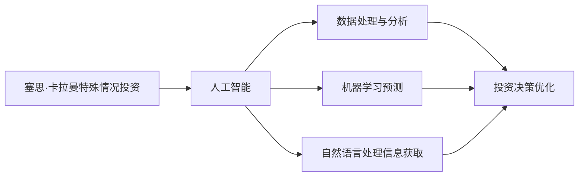

# AI如何优化塞思·卡拉曼的特殊情况投资

> 关键词：AI、塞思·卡拉曼、特殊情况投资、优化策略、机器学习、数据挖掘、投资决策

> 摘要：本文聚焦于AI如何优化塞思·卡拉曼的特殊情况投资。首先介绍塞思·卡拉曼特殊情况投资的背景及核心思想，接着深入探讨AI相关核心概念及其与特殊情况投资的联系。详细阐述AI优化投资所涉及的核心算法原理和具体操作步骤，用数学模型和公式进行理论支撑并举例说明。通过项目实战展示AI在特殊情况投资中的代码实现和解读。分析AI优化特殊情况投资的实际应用场景，推荐相关工具和资源。最后总结未来发展趋势与挑战，提供常见问题解答和扩展阅读参考资料，旨在为投资者利用AI提升特殊情况投资水平提供全面且深入的指导。

## 1. 背景介绍 
### 1.1 目的和范围
目的在于探究人工智能（AI）技术如何有效优化塞思·卡拉曼所倡导的特殊情况投资策略。塞思·卡拉曼是价值投资领域的杰出代表，其特殊情况投资策略关注企业重组、并购、破产清算等特殊事件带来的投资机会。本研究的范围涵盖从AI的基础概念、算法原理到实际应用于特殊情况投资的各个环节，包括如何利用AI进行数据处理、分析和决策，以及在实际投资项目中的具体操作和效果评估。

### 1.2 预期读者
预期读者主要包括金融投资者，尤其是对价值投资和特殊情况投资感兴趣的专业人士和个人投资者；金融科技领域的从业者，如数据科学家、算法工程师等，他们关注AI在金融领域的应用；以及相关专业的学者和研究人员，希望通过本研究深入了解AI与特殊情况投资的结合。

### 1.3 文档结构概述
本文首先介绍背景信息，包括目的、读者群体和文档结构。接着阐述AI与塞思·卡拉曼特殊情况投资的核心概念及它们之间的联系。然后详细讲解AI优化投资的核心算法原理和具体操作步骤，通过数学模型和公式进行理论分析并举例。随后通过项目实战展示代码实现和解读。分析AI在特殊情况投资中的实际应用场景，推荐相关工具和资源。最后总结未来发展趋势与挑战，提供常见问题解答和扩展阅读参考资料。

### 1.4 术语表
#### 1.4.1 核心术语定义
- **塞思·卡拉曼特殊情况投资**：塞思·卡拉曼提出的一种投资策略，重点关注企业因重组、并购、破产清算等特殊事件而出现的被低估的投资机会，通过深入分析企业基本面和特殊事件的影响，寻找具有潜在价值的投资标的。
- **人工智能（AI）**：研究、开发用于模拟、延伸和扩展人的智能的理论、方法、技术及应用系统的一门新的技术科学，包括机器学习、深度学习、自然语言处理等多个领域。
- **机器学习**：一门多领域交叉学科，涉及概率论、统计学、逼近论、凸分析、算法复杂度理论等多门学科。它专门研究计算机怎样模拟或实现人类的学习行为，以获取新的知识或技能，重新组织已有的知识结构使之不断改善自身的性能。
- **特殊情况**：指企业面临的非日常经营的重大事件，如并购、重组、破产、分拆、管理层变动等，这些事件可能对企业的价值和股价产生重大影响。

#### 1.4.2 相关概念解释
- **数据挖掘**：从大量的数据中通过算法搜索隐藏于其中信息的过程，常用于发现数据中的模式、趋势和关系，为投资决策提供依据。
- **投资决策**：投资者为了实现其预期的投资目标，运用一定的科学理论、方法和手段，通过一定的程序对投资的必要性、投资目标、投资规模、投资方向、投资结构、投资成本与收益等经济活动中的重大问题所进行的分析、判断和方案选择。
- **价值投资**：一种常见的投资方式，该理论认为股票价格围绕“内在价值”上下波动，而内在价值可以用一定的方法测定；股票价格长期来看有向“内在价值”回归的趋势；当股票价格低于内在价值时，就出现了投资机会。

#### 1.4.3 缩略词列表
- **AI**：Artificial Intelligence（人工智能）
- **ML**：Machine Learning（机器学习）
- **DL**：Deep Learning（深度学习）
- **NLP**：Natural Language Processing（自然语言处理）

## 2. 核心概念与联系 

### 塞思·卡拉曼特殊情况投资的核心原理
塞思·卡拉曼的特殊情况投资基于价值投资的理念，他认为市场并非总是有效的，在企业面临特殊情况时，市场可能无法及时、准确地反映企业的真实价值。特殊情况投资通过深入研究企业的基本面、特殊事件的性质和影响，寻找被市场低估的投资机会。例如，当企业进行并购时，可能会因为市场对并购的不确定性和复杂性存在担忧，导致股价暂时下跌，但如果并购能够实现协同效应，提升企业的长期价值，那么此时就可能存在投资机会。

### 人工智能的核心概念
人工智能是一个广泛的领域，包括机器学习、深度学习、自然语言处理等多个子领域。机器学习是AI的核心技术之一，它通过让计算机从数据中学习模式和规律，从而进行预测和决策。深度学习是机器学习的一个分支，它通过构建多层神经网络，自动从大量数据中提取特征和模式，在图像识别、语音识别等领域取得了巨大成功。自然语言处理则专注于让计算机理解和处理人类语言，例如文本分类、情感分析等。

### 人工智能与特殊情况投资的联系
人工智能可以为塞思·卡拉曼的特殊情况投资提供强大的支持。首先，AI可以处理和分析大量的金融数据，包括企业财务报表、新闻报道、行业数据等，帮助投资者快速准确地了解企业的基本面和特殊事件的情况。其次，机器学习算法可以通过对历史数据的学习，预测特殊事件对企业价值和股价的影响，为投资决策提供参考。例如，通过分析过去企业并购案例的数据，预测当前并购事件成功的概率和对股价的影响。此外，自然语言处理技术可以帮助投资者快速获取和分析新闻报道、分析师报告等文本信息，了解市场对特殊事件的看法和情绪。

### 文本示意图
```plaintext
塞思·卡拉曼特殊情况投资
    |
    | 结合
    V
人工智能
    |
    | 应用于
    V
投资决策优化
```

### Mermaid流程图


## 3. 核心算法原理 & 具体操作步骤 

### 核心算法原理

#### 机器学习中的回归算法
回归算法是一种常见的机器学习算法，用于预测连续值的输出。在特殊情况投资中，我们可以使用回归算法来预测企业的财务指标或股价。例如，线性回归算法的基本原理是通过找到一条最佳拟合直线，使得数据点到直线的误差平方和最小。

以下是一个简单的线性回归算法的Python实现：
```python
import numpy as np
from sklearn.linear_model import LinearRegression

# 生成一些示例数据
X = np.array([[1], [2], [3], [4], [5]])
y = np.array([2, 4, 6, 8, 10])

# 创建线性回归模型
model = LinearRegression()

# 训练模型
model.fit(X, y)

# 进行预测
new_X = np.array([[6]])
prediction = model.predict(new_X)
print("预测结果:", prediction)
```
在这个示例中，我们使用了`sklearn`库中的`LinearRegression`类来实现线性回归算法。首先，我们生成了一些示例数据`X`和`y`，然后创建了一个线性回归模型并进行训练，最后使用训练好的模型对新的数据进行预测。

#### 分类算法
分类算法用于将数据分为不同的类别。在特殊情况投资中，我们可以使用分类算法来预测特殊事件的结果，例如并购是否成功、企业是否会破产等。常见的分类算法包括逻辑回归、决策树、支持向量机等。

以下是一个使用逻辑回归算法进行分类的Python示例：
```python
from sklearn.datasets import make_classification
from sklearn.linear_model import LogisticRegression
from sklearn.model_selection import train_test_split
from sklearn.metrics import accuracy_score

# 生成一些示例分类数据
X, y = make_classification(n_samples=100, n_features=10, n_informative=5, n_redundant=0, random_state=42)

# 划分训练集和测试集
X_train, X_test, y_train, y_test = train_test_split(X, y, test_size=0.2, random_state=42)

# 创建逻辑回归模型
model = LogisticRegression()

# 训练模型
model.fit(X_train, y_train)

# 进行预测
y_pred = model.predict(X_test)

# 计算准确率
accuracy = accuracy_score(y_test, y_pred)
print("准确率:", accuracy)
```
在这个示例中，我们使用了`sklearn`库中的`LogisticRegression`类来实现逻辑回归算法。首先，我们生成了一些示例分类数据，然后将数据划分为训练集和测试集，创建逻辑回归模型并进行训练，最后使用训练好的模型对测试集进行预测，并计算预测的准确率。

### 具体操作步骤

#### 数据收集
首先需要收集与特殊情况投资相关的数据，包括企业财务报表、新闻报道、行业数据、特殊事件相关信息等。可以从金融数据库、新闻网站、公司公告等渠道获取数据。

#### 数据预处理
收集到的数据可能存在缺失值、异常值等问题，需要进行数据预处理。常见的数据预处理步骤包括数据清洗、数据归一化、特征选择等。例如，使用`pandas`库可以方便地进行数据清洗和处理：
```python
import pandas as pd

# 读取数据
data = pd.read_csv('data.csv')

# 处理缺失值
data = data.dropna()

# 数据归一化
from sklearn.preprocessing import StandardScaler
scaler = StandardScaler()
data_scaled = scaler.fit_transform(data)
```

#### 模型训练
选择合适的机器学习算法，使用预处理后的数据进行模型训练。例如，使用上述的线性回归或逻辑回归算法进行训练。

#### 模型评估
使用测试集对训练好的模型进行评估，计算模型的准确率、召回率、均方误差等指标，评估模型的性能。

#### 投资决策
根据模型的预测结果，结合塞思·卡拉曼的特殊情况投资理念，进行投资决策。例如，如果模型预测并购事件成功的概率较高，且企业的基本面良好，那么可以考虑投资该企业的股票。

## 4. 数学模型和公式 & 详细讲解 & 举例说明 

### 线性回归数学模型和公式

线性回归的数学模型可以表示为：
$$y = \beta_0 + \beta_1x_1 + \beta_2x_2 + \cdots + \beta_nx_n + \epsilon$$
其中，$y$ 是因变量，$x_1, x_2, \cdots, x_n$ 是自变量，$\beta_0, \beta_1, \beta_2, \cdots, \beta_n$ 是模型的系数，$\epsilon$ 是误差项。

线性回归的目标是找到一组系数 $\beta_0, \beta_1, \beta_2, \cdots, \beta_n$，使得误差平方和最小，即：
$$\min_{\beta_0, \beta_1, \cdots, \beta_n} \sum_{i=1}^{m} (y_i - (\beta_0 + \beta_1x_{i1} + \beta_2x_{i2} + \cdots + \beta_nx_{in}))^2$$
其中，$m$ 是样本数量，$y_i$ 是第 $i$ 个样本的因变量值，$x_{i1}, x_{i2}, \cdots, x_{in}$ 是第 $i$ 个样本的自变量值。

#### 举例说明
假设我们要预测企业的股价 $y$ 与企业的净利润 $x_1$ 和营业收入 $x_2$ 之间的关系。我们收集了 $m$ 个企业的数据，将其代入上述线性回归模型中，通过最小化误差平方和，求解出系数 $\beta_0, \beta_1, \beta_2$。然后，对于一个新的企业，我们可以根据其净利润和营业收入，使用求解出的系数预测其股价。

### 逻辑回归数学模型和公式

逻辑回归的数学模型基于逻辑函数（也称为Sigmoid函数）：
$$\sigma(z) = \frac{1}{1 + e^{-z}}$$
其中，$z = \beta_0 + \beta_1x_1 + \beta_2x_2 + \cdots + \beta_nx_n$。

逻辑回归的目标是通过最大化似然函数来估计模型的系数 $\beta_0, \beta_1, \beta_2, \cdots, \beta_n$。似然函数可以表示为：
$$L(\beta) = \prod_{i=1}^{m} P(y_i|x_i; \beta)^{y_i} (1 - P(y_i|x_i; \beta))^{1 - y_i}$$
其中，$P(y_i|x_i; \beta) = \sigma(\beta_0 + \beta_1x_{i1} + \beta_2x_{i2} + \cdots + \beta_nx_{in})$ 是第 $i$ 个样本的预测概率，$y_i$ 是第 $i$ 个样本的真实标签（0或1）。

为了方便计算，通常对似然函数取对数，得到对数似然函数：
$$\log L(\beta) = \sum_{i=1}^{m} [y_i \log P(y_i|x_i; \beta) + (1 - y_i) \log (1 - P(y_i|x_i; \beta))]$$

#### 举例说明
假设我们要预测企业是否会破产（$y$ 取值为0或1），自变量包括企业的资产负债率 $x_1$、流动比率 $x_2$ 等。我们收集了 $m$ 个企业的数据，将其代入逻辑回归模型中，通过最大化对数似然函数，求解出系数 $\beta_0, \beta_1, \beta_2$。然后，对于一个新的企业，我们可以根据其资产负债率和流动比率，使用求解出的系数计算其破产的概率。

## 5. 项目实战：代码实际案例和详细解释说明 

### 5.1  开发环境搭建

#### 安装Python
首先需要安装Python，建议使用Python 3.x 版本。可以从Python官方网站（https://www.python.org/downloads/） 下载并安装。

#### 安装必要的库
使用`pip` 命令安装必要的库，包括`pandas`、`numpy`、`scikit-learn`等：
```sh
pip install pandas numpy scikit-learn
```

### 5.2  源代码详细实现和代码解读

#### 数据收集和预处理
假设我们要预测企业的股价与企业的净利润和营业收入之间的关系，我们可以使用以下代码进行数据收集和预处理：
```python
import pandas as pd
from sklearn.preprocessing import StandardScaler

# 读取数据
data = pd.read_csv('stock_data.csv')

# 处理缺失值
data = data.dropna()

# 提取特征和目标变量
X = data[['net_profit', 'revenue']]
y = data['stock_price']

# 数据归一化
scaler = StandardScaler()
X_scaled = scaler.fit_transform(X)
```
在这段代码中，我们首先使用`pandas`库读取数据文件`stock_data.csv`，然后处理缺失值，提取特征和目标变量，最后使用`StandardScaler`类对特征数据进行归一化处理。

#### 模型训练和评估
使用线性回归模型进行训练和评估：
```python
from sklearn.model_selection import train_test_split
from sklearn.linear_model import LinearRegression
from sklearn.metrics import mean_squared_error

# 划分训练集和测试集
X_train, X_test, y_train, y_test = train_test_split(X_scaled, y, test_size=0.2, random_state=42)

# 创建线性回归模型
model = LinearRegression()

# 训练模型
model.fit(X_train, y_train)

# 进行预测
y_pred = model.predict(X_test)

# 计算均方误差
mse = mean_squared_error(y_test, y_pred)
print("均方误差:", mse)
```
在这段代码中，我们首先使用`train_test_split`函数将数据划分为训练集和测试集，然后创建线性回归模型并进行训练，使用训练好的模型对测试集进行预测，最后计算预测结果的均方误差。

### 5.3  代码解读与分析

#### 数据预处理的重要性
数据预处理是机器学习中非常重要的一步，它可以提高模型的性能和稳定性。在上述代码中，我们处理了缺失值和进行了数据归一化，缺失值的处理可以避免模型在训练过程中出现错误，数据归一化可以使不同特征的数据具有相同的尺度，避免某些特征对模型的影响过大。

#### 模型评估指标的选择
均方误差是一种常见的回归模型评估指标，它衡量了预测值与真实值之间的平均误差。在实际应用中，还可以选择其他评估指标，如平均绝对误差、决定系数等，根据具体的问题和需求选择合适的评估指标。

#### 模型的局限性
线性回归模型是一种简单的模型，它假设特征与目标变量之间存在线性关系。在实际应用中，这种假设可能不成立，因此可能需要使用更复杂的模型，如非线性回归模型、深度学习模型等。

## 6. 实际应用场景 

### 并购事件中的应用
在企业并购事件中，AI可以帮助投资者快速收集和分析相关信息，包括并购双方的财务状况、行业前景、并购的协同效应等。通过机器学习算法预测并购成功的概率和对股价的影响，投资者可以根据预测结果做出投资决策。例如，如果AI预测并购成功的概率较高，且并购后企业的价值将得到提升，投资者可以考虑在并购公告发布后买入相关企业的股票。

### 企业重组中的应用
当企业进行重组时，AI可以分析重组方案的合理性和可行性，评估重组对企业未来业绩的影响。通过对历史重组案例的学习，预测当前重组事件可能带来的投资机会。例如，如果AI预测企业重组后将实现业务的优化和成本的降低，投资者可以关注该企业的股票。

### 破产清算中的应用
在企业面临破产清算时，AI可以帮助投资者评估企业的资产价值和债务情况，预测破产清算的结果和对债权人的赔偿情况。投资者可以根据这些信息决定是否参与破产清算相关的投资，如购买破产企业的债权等。

### 管理层变动中的应用
企业管理层的变动可能会对企业的发展战略和经营业绩产生影响。AI可以通过分析管理层的背景、过往业绩等信息，预测管理层变动对企业未来发展的影响。投资者可以根据预测结果调整投资组合，例如，如果AI预测新的管理层能够带领企业实现更好的发展，投资者可以增加对该企业的投资。

## 7. 工具和资源推荐
### 7.1 学习资源推荐
#### 7.1.1 书籍推荐
- 《机器学习》（周志华著）：全面介绍了机器学习的基本概念、算法和应用，是机器学习领域的经典教材。
- 《Python数据分析实战》（韦斯·麦金尼著）：详细介绍了使用Python进行数据分析的方法和技巧，包括数据处理、可视化等内容。
- 《价值投资：从格雷厄姆到巴菲特》（布鲁斯·格林沃尔德著）：深入阐述了价值投资的理论和实践，包括塞思·卡拉曼的特殊情况投资理念。

#### 7.1.2 在线课程
- Coursera平台上的“机器学习”课程（由吴恩达教授授课）：该课程是机器学习领域的经典在线课程，系统地介绍了机器学习的基本概念、算法和应用。
- edX平台上的“Python for Data Science”课程：该课程介绍了使用Python进行数据分析的基本方法和工具。
- 中国大学MOOC平台上的“金融投资学”课程：该课程介绍了金融投资的基本理论和实践，包括特殊情况投资的相关内容。

#### 7.1.3 技术博客和网站
- Medium（https://medium.com/）：一个技术博客平台，有很多关于AI、金融科技等领域的优质文章。
- Towards Data Science（https://towardsdatascience.com/）：专注于数据科学和机器学习领域的技术博客，提供了很多实用的教程和案例。
- Seeking Alpha（https://seekingalpha.com/）：一个金融投资领域的网站，提供了大量的股票分析、投资策略等内容。

### 7.2 开发工具框架推荐
#### 7.2.1 IDE和编辑器
- PyCharm：一款专业的Python集成开发环境，提供了丰富的功能和插件，方便Python开发。
- Jupyter Notebook：一个交互式的开发环境，适合进行数据探索和模型实验。
- Visual Studio Code：一款轻量级的代码编辑器，支持多种编程语言，有丰富的插件和扩展。

#### 7.2.2 调试和性能分析工具
- PDB：Python自带的调试工具，可以帮助开发者调试代码。
- cProfile：Python的性能分析工具，可以分析代码的运行时间和性能瓶颈。
- TensorBoard：TensorFlow的可视化工具，可以帮助开发者可视化模型的训练过程和性能。

#### 7.2.3 相关框架和库
- Scikit-learn：一个简单易用的机器学习库，提供了各种机器学习算法和工具。
- TensorFlow：一个开源的深度学习框架，广泛应用于图像识别、语音识别等领域。
- PyTorch：另一个开源的深度学习框架，具有简洁易用的特点。

### 7.3 相关论文著作推荐
#### 7.3.1 经典论文
- Fama, E. F., & French, K. R. (1992). The cross-section of expected stock returns. Journal of Finance, 47(2), 427-465. 该论文提出了著名的Fama-French三因子模型，对资产定价理论产生了深远影响。
- Jensen, M. C. (1968). The performance of mutual funds in the period 1945–1964. Journal of Finance, 23(2), 389-416. 该论文对共同基金的业绩进行了实证研究，提出了Jensen指数。

#### 7.3.2 最新研究成果
- Recent advances in machine learning for financial forecasting（《机器学习在金融预测中的最新进展》）：该研究探讨了机器学习在金融预测中的应用，包括股票价格预测、信用风险评估等。
- Artificial intelligence in investment decision-making（《人工智能在投资决策中的应用》）：该研究分析了人工智能在投资决策中的作用和挑战。

#### 7.3.3 应用案例分析
- Case studies on special situation investing with AI（《基于AI的特殊情况投资案例分析》）：该案例分析了AI在特殊情况投资中的具体应用和效果。
- How AI is transforming the investment landscape（《AI如何改变投资格局》）：该案例介绍了AI在投资领域的应用案例和发展趋势。

## 8. 总结：未来发展趋势与挑战

### 未来发展趋势

#### AI技术的不断进步
随着AI技术的不断发展，如深度学习、强化学习等技术的不断创新，AI在特殊情况投资中的应用将更加广泛和深入。例如，强化学习可以用于优化投资策略，根据市场情况实时调整投资组合。

#### 数据的丰富和整合
随着金融数据的不断丰富和整合，AI可以获取更多、更全面的信息，提高投资决策的准确性和可靠性。例如，将企业的财务数据、新闻报道、社交媒体数据等多源数据进行整合分析。

#### 人机协作的加强
未来，AI将与人类投资者形成更加紧密的协作关系。AI可以提供数据支持和分析建议，人类投资者可以结合自己的经验和判断力进行最终的投资决策。

### 挑战

#### 数据质量和隐私问题
数据质量是AI应用的关键，如果数据存在错误、缺失或偏差，将影响模型的性能和决策的准确性。同时，金融数据涉及大量的隐私信息，如何在保护隐私的前提下使用数据是一个重要的挑战。

#### 模型的可解释性
AI模型，尤其是深度学习模型，通常是黑箱模型，难以解释其决策过程和依据。在投资决策中，投资者需要了解模型的决策逻辑，以便做出合理的判断。

#### 市场的不确定性
金融市场具有高度的不确定性，特殊情况投资更是受到多种因素的影响。AI模型可能无法完全准确地预测市场的变化和特殊事件的结果，投资者需要认识到模型的局限性。

## 9. 附录：常见问题与解答

### 问题1：AI在特殊情况投资中的准确性如何保证？
解答：为了保证AI在特殊情况投资中的准确性，需要从多个方面入手。首先，要确保数据的质量，对数据进行清洗、预处理和验证。其次，选择合适的模型和算法，并进行充分的模型训练和调优。此外，还需要进行模型评估和验证，使用多种评估指标来评估模型的性能。最后，结合人类投资者的经验和判断力，对模型的预测结果进行综合分析。

### 问题2：AI会完全取代人类投资者吗？
解答：AI不会完全取代人类投资者。虽然AI可以处理和分析大量的数据，提供准确的预测和建议，但投资决策不仅仅是基于数据和模型，还涉及到人类的经验、判断力、风险偏好等因素。人类投资者可以在复杂的市场环境中做出更加灵活和综合的决策，同时也可以对AI模型的结果进行监督和调整。因此，未来AI将与人类投资者形成互补和协作的关系。

### 问题3：如何选择适合特殊情况投资的AI模型？
解答：选择适合特殊情况投资的AI模型需要考虑多个因素。首先，要根据投资问题的性质和特点选择合适的模型类型，如回归模型用于预测连续值，分类模型用于预测类别。其次，要考虑数据的规模和特征，不同的模型对数据的要求不同。此外，还需要进行模型比较和评估，选择性能最优的模型。最后，要结合实际应用场景和投资目标，选择最适合的模型。

### 问题4：AI在特殊情况投资中面临哪些法律和监管问题？
解答：AI在特殊情况投资中面临一些法律和监管问题。例如，数据的使用和隐私保护需要遵守相关法律法规，防止数据泄露和滥用。模型的开发和使用也需要符合监管要求，确保模型的公平性、透明度和可靠性。此外，AI投资策略的披露和合规性也是需要关注的问题。投资者和金融机构需要密切关注相关法律法规的变化，确保AI在特殊情况投资中的合法合规应用。

## 10. 扩展阅读 & 参考资料

### 扩展阅读
- 《聪明的投资者》（本杰明·格雷厄姆著）：价值投资领域的经典著作，深入阐述了价值投资的理念和方法。
- 《金融炼金术》（乔治·索罗斯著）：介绍了索罗斯的投资哲学和实践，对金融市场的运行机制有独特的见解。
- 《算法时代：人工智能与金融科技的崛起》（李开复、王咏刚著）：探讨了AI在金融科技领域的应用和发展趋势。

### 参考资料
- 塞思·卡拉曼的著作《安全边际》，详细阐述了他的特殊情况投资理念和方法。
- 相关学术期刊，如《Journal of Finance》、《Review of Financial Studies》等，发表了大量关于金融投资和AI应用的研究论文。
- 金融数据提供商，如Bloomberg、Wind等，提供了丰富的金融数据和研究报告。