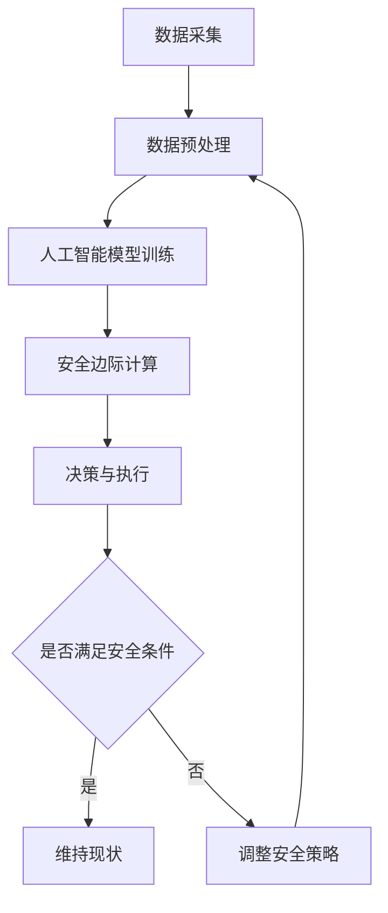

# AI实现的自适应安全边际计算模型

> 关键词：人工智能、自适应安全边际、计算模型、安全分析、风险评估

> 摘要：本文围绕AI实现的自适应安全边际计算模型展开深入探讨。首先介绍了该模型提出的背景、目的、预期读者和文档结构等内容。详细阐述了核心概念与联系，包括相关原理和架构。通过Python源代码对核心算法原理及具体操作步骤进行了详细讲解，并给出了对应的数学模型和公式，结合举例说明加深理解。在项目实战部分，展示了开发环境搭建、源代码实现与解读。分析了该模型的实际应用场景，推荐了相关的学习资源、开发工具框架和论文著作。最后总结了其未来发展趋势与挑战，提供了常见问题解答和扩展阅读参考资料，旨在全面深入地介绍AI实现的自适应安全边际计算模型，为相关领域的研究和实践提供有价值的参考。

## 1. 背景介绍 
### 1.1 目的和范围
在当今数字化快速发展的时代，各个领域面临着日益复杂的安全挑战。无论是金融交易中的风险控制、工业生产中的设备安全，还是网络空间的信息安全等，都需要一种能够准确评估和动态调整安全策略的方法。AI实现的自适应安全边际计算模型的目的就在于利用人工智能的强大能力，根据不同场景下的实时数据和变化情况，自适应地计算安全边际，从而为系统的安全运行提供更精准的保障。

本模型的范围涵盖了多个领域，包括但不限于金融、工业、医疗、交通等。在金融领域，可用于评估投资组合的风险和安全边界；在工业领域，能对生产设备的运行状态进行实时监测和安全评估；在医疗领域，可辅助医疗决策，确保患者的治疗安全；在交通领域，可用于自动驾驶系统的安全分析等。

### 1.2 预期读者
本文的预期读者包括从事人工智能、安全分析、风险评估等领域的研究人员、工程师和技术爱好者。对于希望深入了解如何利用AI技术进行安全边际计算的专业人士，本文将提供系统的理论知识和实践指导。同时，对于相关领域的管理人员和决策者，也能通过本文了解该模型的应用价值和潜在影响，为制定合理的安全策略和决策提供参考。

### 1.3 文档结构概述
本文将按照以下结构进行阐述：首先介绍背景信息，包括目的、预期读者和文档结构概述等。接着深入探讨核心概念与联系，包括相关原理和架构，并通过示意图和流程图进行直观展示。然后详细讲解核心算法原理及具体操作步骤，结合Python源代码进行说明。随后给出数学模型和公式，并举例说明。在项目实战部分，展示开发环境搭建、源代码实现与解读。分析实际应用场景，推荐相关的学习资源、开发工具框架和论文著作。最后总结未来发展趋势与挑战，提供常见问题解答和扩展阅读参考资料。

### 1.4 术语表
#### 1.4.1 核心术语定义
- **人工智能（AI）**：是一门研究如何使计算机能够模拟人类智能的学科，包括机器学习、深度学习、自然语言处理等多种技术。
- **自适应安全边际**：指在不同的环境和条件下，能够自动调整的安全范围或界限，以确保系统在各种情况下都能保持安全运行。
- **计算模型**：是对计算过程的一种抽象描述，用于解决特定的问题或完成特定的任务。

#### 1.4.2 相关概念解释
- **安全分析**：对系统或环境的安全状况进行评估和分析，识别潜在的安全风险和威胁。
- **风险评估**：对可能发生的风险进行量化和评估，确定风险的等级和影响程度。

#### 1.4.3 缩略词列表
- **ML**：Machine Learning，机器学习
- **DL**：Deep Learning，深度学习
- **NLP**：Natural Language Processing，自然语言处理

## 2. 核心概念与联系 
### 2.1 自适应安全边际的原理
自适应安全边际的核心原理在于根据系统的实时状态和环境变化，动态地调整安全范围。传统的安全边际往往是固定的，无法适应复杂多变的情况。而自适应安全边际则利用人工智能技术，对大量的实时数据进行分析和学习，从而预测可能出现的风险，并相应地调整安全界限。

例如，在金融市场中，股票价格的波动是复杂多变的。传统的风险评估方法可能设定一个固定的止损点，但在市场剧烈波动时，这个固定的止损点可能无法有效地保护投资者的利益。而自适应安全边际计算模型可以根据市场的实时数据，如股票价格、成交量、市场情绪等，动态地调整止损点，从而更好地控制风险。

### 2.2 人工智能在安全边际计算中的作用
人工智能技术为自适应安全边际计算提供了强大的支持。机器学习算法可以从大量的历史数据中学习模式和规律，从而对未来的风险进行预测。深度学习算法则可以处理复杂的非线性数据，提高预测的准确性。自然语言处理技术可以对文本数据进行分析，如新闻报道、社交媒体评论等，获取更多的市场信息和情绪指标。

通过人工智能技术，自适应安全边际计算模型可以实时地感知环境变化，快速地做出反应，调整安全策略，从而提高系统的安全性和可靠性。

### 2.3 核心架构
下面是AI实现的自适应安全边际计算模型的核心架构示意图：

```plaintext
+-------------------+
|  数据采集层       |
|  (传感器、网络    |
|   接口等)         |
+-------------------+
|  数据预处理层     |
|  (清洗、归一化    |
|   特征提取等)     |
+-------------------+
|  人工智能模型层   |
|  (机器学习、深    |
|   度学习算法)     |
+-------------------+
|  安全边际计算层   |
|  (根据模型输出    |
|   计算安全边际)   |
+-------------------+
|  决策与执行层     |
|  (根据安全边际    |
|   做出决策并执行) |
+-------------------+
```

### 2.4 Mermaid流程图


## 3. 核心算法原理 & 具体操作步骤 
### 3.1 核心算法原理
本模型主要采用机器学习中的回归算法和深度学习中的神经网络算法来实现自适应安全边际的计算。以回归算法为例，其基本思想是通过对历史数据的学习，建立输入变量（如市场指标、设备状态等）与输出变量（如风险值、安全边际等）之间的函数关系。

以下是一个简单的线性回归算法的Python实现示例：

```python
import numpy as np
from sklearn.linear_model import LinearRegression

# 生成示例数据
X = np.array([[1], [2], [3], [4], [5]])
y = np.array([2, 4, 6, 8, 10])

# 创建线性回归模型
model = LinearRegression()

# 训练模型
model.fit(X, y)

# 预测新数据
new_X = np.array([[6]])
prediction = model.predict(new_X)
print("预测结果:", prediction)
```

### 3.2 具体操作步骤
1. **数据采集**：从各种数据源中收集相关的数据，如传感器数据、网络数据、文本数据等。
2. **数据预处理**：对采集到的数据进行清洗、归一化、特征提取等操作，以提高数据的质量和可用性。
3. **模型训练**：选择合适的人工智能模型，如机器学习算法或深度学习算法，对预处理后的数据进行训练。
4. **安全边际计算**：根据训练好的模型，对实时数据进行预测，并计算相应的安全边际。
5. **决策与执行**：根据计算得到的安全边际，做出相应的决策，如调整安全策略、发出警报等。

## 4. 数学模型和公式 & 详细讲解 & 举例说明 
### 4.1 线性回归数学模型
线性回归的数学模型可以表示为：

$$y = \beta_0 + \beta_1x_1 + \beta_2x_2 + \cdots + \beta_nx_n + \epsilon$$

其中，$y$ 是因变量（如风险值、安全边际等），$x_1, x_2, \cdots, x_n$ 是自变量（如市场指标、设备状态等），$\beta_0, \beta_1, \beta_2, \cdots, \beta_n$ 是回归系数，$\epsilon$ 是误差项。

### 4.2 详细讲解
线性回归的目标是通过最小化误差项的平方和来估计回归系数。误差项的平方和可以表示为：

$$S(\beta) = \sum_{i=1}^{m}(y_i - \hat{y}_i)^2$$

其中，$m$ 是样本数量，$y_i$ 是实际值，$\hat{y}_i$ 是预测值。

通过最小化 $S(\beta)$，可以得到回归系数的最优估计值。在Python中，`sklearn` 库的 `LinearRegression` 类已经实现了这个过程，我们只需要调用相应的方法即可。

### 4.3 举例说明
假设我们有一个简单的数据集，包含房屋面积和房价两个变量。我们希望通过房屋面积来预测房价。

| 房屋面积（平方米） | 房价（万元） |
|--------------------|--------------|
| 50                 | 100          |
| 60                 | 120          |
| 70                 | 140          |
| 80                 | 160          |
| 90                 | 180          |

我们可以使用线性回归模型来拟合这个数据集，并预测新的房屋面积对应的房价。

```python
import numpy as np
from sklearn.linear_model import LinearRegression

# 数据
X = np.array([[50], [60], [70], [80], [90]])
y = np.array([100, 120, 140, 160, 180])

# 创建线性回归模型
model = LinearRegression()

# 训练模型
model.fit(X, y)

# 预测新数据
new_X = np.array([[100]])
prediction = model.predict(new_X)
print("预测房价:", prediction, "万元")
```

## 5. 项目实战：代码实际案例和详细解释说明 
### 5.1  开发环境搭建
1. **安装Python**：可以从Python官方网站（https://www.python.org/downloads/）下载并安装Python 3.x版本。
2. **安装必要的库**：使用 `pip` 命令安装 `numpy`、`pandas`、`sklearn`、`tensorflow` 等库。
```sh
pip install numpy pandas sklearn tensorflow
```

### 5.2  源代码详细实现和代码解读
以下是一个基于深度学习的自适应安全边际计算模型的示例代码：

```python
import numpy as np
import pandas as pd
from sklearn.model_selection import train_test_split
from tensorflow.keras.models import Sequential
from tensorflow.keras.layers import Dense

# 生成示例数据
data = pd.DataFrame({
    'feature1': np.random.rand(1000),
    'feature2': np.random.rand(1000),
    'risk': np.random.rand(1000)
})

# 划分特征和标签
X = data[['feature1', 'feature2']].values
y = data['risk'].values

# 划分训练集和测试集
X_train, X_test, y_train, y_test = train_test_split(X, y, test_size=0.2, random_state=42)

# 构建神经网络模型
model = Sequential()
model.add(Dense(64, input_dim=2, activation='relu'))
model.add(Dense(32, activation='relu'))
model.add(Dense(1, activation='linear'))

# 编译模型
model.compile(loss='mean_squared_error', optimizer='adam')

# 训练模型
model.fit(X_train, y_train, epochs=50, batch_size=32, validation_data=(X_test, y_test))

# 预测风险值
predictions = model.predict(X_test)

# 计算安全边际
safety_margin = 1 - predictions

print("安全边际:", safety_margin)
```

### 5.3  代码解读与分析
1. **数据生成**：使用 `pandas` 库生成示例数据，包含两个特征和一个风险值。
2. **数据划分**：使用 `sklearn` 库的 `train_test_split` 函数将数据划分为训练集和测试集。
3. **模型构建**：使用 `tensorflow.keras` 库构建一个简单的神经网络模型，包含输入层、隐藏层和输出层。
4. **模型编译**：使用均方误差作为损失函数，Adam优化器进行模型训练。
5. **模型训练**：使用训练集对模型进行训练，并在测试集上进行验证。
6. **预测风险值**：使用训练好的模型对测试集进行预测，得到风险值。
7. **计算安全边际**：根据预测的风险值计算安全边际。

## 6. 实际应用场景 
### 6.1 金融领域
在金融领域，AI实现的自适应安全边际计算模型可以用于投资组合的风险评估和管理。通过对市场数据、宏观经济指标、公司财务数据等进行实时分析，模型可以动态地计算投资组合的安全边际，帮助投资者及时调整投资策略，降低风险。

例如，在股票投资中，模型可以根据股票的价格波动、成交量、市盈率等指标，预测股票的风险值，并计算相应的安全边际。当安全边际低于某个阈值时，投资者可以及时卖出股票，避免损失。

### 6.2 工业领域
在工业领域，该模型可以用于设备的状态监测和故障预测。通过对设备的传感器数据进行实时分析，模型可以预测设备的故障概率，并计算相应的安全边际。当安全边际低于某个阈值时，系统可以及时发出警报，提醒维修人员进行检修，避免设备故障导致的生产事故。

例如，在电力系统中，模型可以对发电机的温度、振动、电流等参数进行实时监测，预测发电机的故障概率，并计算安全边际。当安全边际较低时，系统可以自动调整发电机的运行参数，或者安排维修人员进行检修。

### 6.3 医疗领域
在医疗领域，该模型可以用于医疗决策的辅助。通过对患者的病历数据、检查结果、生命体征等进行分析，模型可以预测患者的疾病风险，并计算相应的安全边际。医生可以根据安全边际，制定更合理的治疗方案，提高治疗效果。

例如，在心脏病的诊断和治疗中，模型可以对患者的心电图、血压、血脂等指标进行分析，预测患者的心脏病发作风险，并计算安全边际。医生可以根据安全边际，决定是否需要采取进一步的治疗措施，如药物治疗、手术治疗等。

### 6.4 交通领域
在交通领域，该模型可以用于自动驾驶系统的安全分析。通过对车辆的传感器数据、路况信息、交通规则等进行实时分析，模型可以预测车辆发生事故的概率，并计算相应的安全边际。当安全边际较低时，自动驾驶系统可以自动调整行驶策略，如减速、避让等，确保行车安全。

例如，在自动驾驶汽车中，模型可以对前方车辆的距离、速度、行驶方向等信息进行实时监测，预测碰撞的概率，并计算安全边际。当安全边际较低时，汽车可以自动刹车或避让，避免碰撞事故的发生。

## 7. 工具和资源推荐
### 7.1 学习资源推荐
#### 7.1.1 书籍推荐
- 《机器学习》（周志华）：全面介绍了机器学习的基本概念、算法和应用，是机器学习领域的经典教材。
- 《深度学习》（Ian Goodfellow、Yoshua Bengio、Aaron Courville）：深入探讨了深度学习的原理、算法和实践，是深度学习领域的权威著作。
- 《Python机器学习实战》（Sebastian Raschka）：通过实际案例介绍了如何使用Python实现机器学习算法，适合初学者入门。

#### 7.1.2 在线课程
- Coursera上的“机器学习”课程（Andrew Ng教授）：是一门经典的机器学习入门课程，讲解清晰，内容丰富。
- edX上的“深度学习”课程（MIT）：深入介绍了深度学习的理论和实践，适合有一定基础的学习者。
- 哔哩哔哩上的“Python数据分析与机器学习实战”课程：以实际案例为导向，讲解了Python在数据分析和机器学习中的应用。

#### 7.1.3 技术博客和网站
- Medium：是一个技术博客平台，有很多关于人工智能、机器学习、深度学习等领域的优质文章。
- Towards Data Science：专注于数据科学和机器学习领域的技术博客，提供了很多实用的教程和案例。
- 机器之心：是一个专注于人工智能领域的资讯平台，提供了最新的技术动态和研究成果。

### 7.2 开发工具框架推荐
#### 7.2.1 IDE和编辑器
- PyCharm：是一款专业的Python集成开发环境，提供了丰富的功能和插件，适合大型项目的开发。
- Jupyter Notebook：是一个交互式的开发环境，适合数据探索和模型实验。
- Visual Studio Code：是一款轻量级的代码编辑器，支持多种编程语言和插件，适合快速开发和调试。

#### 7.2.2 调试和性能分析工具
- TensorBoard：是TensorFlow提供的一个可视化工具，可以用于查看模型的训练过程、性能指标等。
- Py-Spy：是一个用于Python代码性能分析的工具，可以帮助开发者找出代码中的性能瓶颈。
- cProfile：是Python标准库中的一个性能分析工具，可以对Python程序的运行时间进行分析。

#### 7.2.3 相关框架和库
- TensorFlow：是一个开源的机器学习框架，提供了丰富的工具和接口，适合大规模的深度学习项目。
- PyTorch：是一个基于Python的深度学习框架，具有动态图的特点，适合快速开发和实验。
- Scikit-learn：是一个简单易用的机器学习库，提供了各种机器学习算法和工具，适合初学者和小型项目。

### 7.3 相关论文著作推荐
#### 7.3.1 经典论文
- “Gradient-Based Learning Applied to Document Recognition”（Yann LeCun、Léon Bottou、Yoshua Bengio、Patrick Haffner）：介绍了卷积神经网络（CNN）在手写数字识别中的应用，是深度学习领域的经典论文。
- “Deep Residual Learning for Image Recognition”（Kaiming He、Xiangyu Zhang、Shaoqing Ren、Jian Sun）：提出了残差网络（ResNet），解决了深度神经网络训练中的梯度消失问题。
- “Attention Is All You Need”（Ashish Vaswani、Noam Shazeer、Niki Parmar等）：提出了Transformer模型，在自然语言处理领域取得了巨大的成功。

#### 7.3.2 最新研究成果
- 关注顶级学术会议，如NeurIPS（神经信息处理系统大会）、ICML（国际机器学习会议）、CVPR（计算机视觉与模式识别会议）等，这些会议上的论文通常代表了人工智能领域的最新研究成果。
- 关注顶级学术期刊，如Journal of Artificial Intelligence Research（JAIR）、Artificial Intelligence（AI）等，这些期刊上的论文也具有较高的学术水平。

#### 7.3.3 应用案例分析
- 可以参考一些实际应用案例的分析报告，如金融领域的风险评估案例、工业领域的设备故障预测案例等。这些案例分析可以帮助我们更好地理解AI实现的自适应安全边际计算模型在实际应用中的具体方法和效果。

## 8. 总结：未来发展趋势与挑战
### 8.1 未来发展趋势
- **与其他技术的融合**：AI实现的自适应安全边际计算模型将与物联网、区块链、大数据等技术深度融合，实现更全面、更精准的安全监测和风险评估。例如，物联网技术可以提供更多的实时数据，区块链技术可以保证数据的安全性和可信度，大数据技术可以对海量数据进行高效处理和分析。
- **应用领域的拓展**：该模型将在更多的领域得到应用，如能源、教育、农业等。在能源领域，可用于电网的安全运行和能源管理；在教育领域，可用于学生的学习风险评估和个性化教育；在农业领域，可用于农作物的病虫害预测和安全种植。
- **模型的优化和创新**：随着人工智能技术的不断发展，自适应安全边际计算模型将不断优化和创新。例如，采用更先进的深度学习算法、强化学习算法等，提高模型的预测准确性和自适应能力。

### 8.2 挑战
- **数据质量和隐私问题**：模型的性能高度依赖于数据的质量和数量。然而，在实际应用中，数据可能存在噪声、缺失值等问题，影响模型的训练效果。同时，数据的隐私保护也是一个重要的问题，如何在保证数据安全的前提下，充分利用数据是一个挑战。
- **模型的可解释性**：深度学习模型通常是黑盒模型，难以解释其决策过程和结果。在安全关键领域，如医疗、交通等，模型的可解释性至关重要。如何提高模型的可解释性，让用户信任模型的决策是一个亟待解决的问题。
- **计算资源和效率问题**：深度学习模型的训练和推理需要大量的计算资源和时间。在实际应用中，如何在有限的计算资源下，提高模型的训练和推理效率是一个挑战。

## 9. 附录：常见问题与解答
### 9.1 如何选择合适的人工智能模型？
选择合适的人工智能模型需要考虑多个因素，如数据的特点、问题的类型、计算资源等。如果数据是结构化的，且问题是回归或分类问题，可以选择传统的机器学习算法，如线性回归、逻辑回归、决策树等。如果数据是非结构化的，如图像、文本等，或者问题比较复杂，可以选择深度学习算法，如卷积神经网络（CNN）、循环神经网络（RNN）、Transformer等。

### 9.2 如何处理数据中的缺失值和噪声？
处理数据中的缺失值和噪声可以采用多种方法。对于缺失值，可以采用删除法、填充法等。删除法是直接删除包含缺失值的样本或特征；填充法是用均值、中位数、众数等统计量来填充缺失值。对于噪声，可以采用平滑滤波、异常值检测等方法进行处理。

### 9.3 如何评估模型的性能？
评估模型的性能需要根据问题的类型选择合适的评估指标。对于回归问题，常用的评估指标有均方误差（MSE）、均方根误差（RMSE）、平均绝对误差（MAE）等；对于分类问题，常用的评估指标有准确率（Accuracy）、精确率（Precision）、召回率（Recall）、F1值等。

## 10. 扩展阅读 & 参考资料
### 10.1 扩展阅读
- 《人工智能简史》（尼克）：介绍了人工智能的发展历程和重要事件，帮助读者了解人工智能的全貌。
- 《数据挖掘：概念与技术》（Jiawei Han、Jian Pei、Jianwen Yin）：深入探讨了数据挖掘的理论和方法，适合对数据挖掘感兴趣的读者。
- 《智能时代》（吴军）：阐述了人工智能对社会和经济的影响，以及未来的发展趋势。

### 10.2 参考资料
- 相关学术论文和研究报告。
- 开源项目的文档和代码。
- 相关技术论坛和社区的讨论。