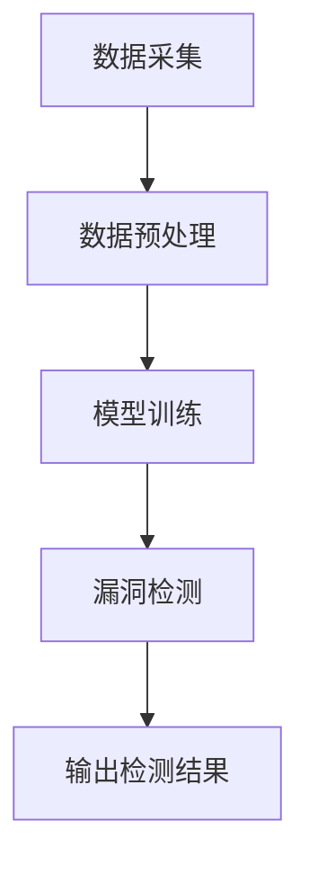

# AI技术在代码安全扫描中的实践

> 关键词：AI技术、代码安全扫描、漏洞检测、机器学习、深度学习

> 摘要：本文深入探讨了AI技术在代码安全扫描中的实践应用。首先介绍了代码安全扫描的背景和重要性，阐述了AI技术在该领域的核心概念与联系。接着详细讲解了相关核心算法原理，并给出具体操作步骤及Python源代码示例。同时，对涉及的数学模型和公式进行了详细说明并举例。通过项目实战展示了代码安全扫描的实际实现过程及代码解读。还探讨了AI技术在代码安全扫描中的实际应用场景，推荐了相关的学习资源、开发工具框架和论文著作。最后总结了未来发展趋势与挑战，并提供了常见问题与解答以及扩展阅读和参考资料，旨在为读者全面呈现AI技术在代码安全扫描中的实践情况。

## 1. 背景介绍 
### 1.1 目的和范围
随着软件系统的复杂性不断增加以及网络攻击手段的日益多样化，代码安全问题变得愈发重要。一个小小的代码漏洞可能会导致严重的安全事故，如数据泄露、系统瘫痪等。代码安全扫描的目的就是在软件开发的各个阶段，及时发现并修复潜在的安全漏洞，确保软件系统的安全性和稳定性。

本文的范围主要聚焦于AI技术在代码安全扫描中的应用。我们将探讨如何利用机器学习、深度学习等AI技术来提高代码安全扫描的准确性、效率和全面性，涉及从核心概念、算法原理到实际项目应用等多个方面。

### 1.2 预期读者
本文预期读者包括软件开发者、安全工程师、人工智能研究人员以及对代码安全和AI技术感兴趣的技术爱好者。对于软件开发者来说，了解AI技术在代码安全扫描中的应用可以帮助他们在开发过程中更好地保障代码的安全性；安全工程师可以借鉴相关技术和方法，提升安全检测的能力；人工智能研究人员可以从代码安全扫描这个应用场景中获取新的研究思路；技术爱好者则可以通过本文对AI技术在代码安全领域的应用有一个全面的认识。

### 1.3 文档结构概述
本文将按照以下结构展开：首先介绍代码安全扫描的背景知识，包括目的、预期读者和文档结构概述等；接着阐述AI技术在代码安全扫描中的核心概念与联系，通过文本示意图和Mermaid流程图进行说明；然后详细讲解核心算法原理，并给出具体操作步骤和Python源代码；之后介绍相关的数学模型和公式，并举例说明；通过项目实战展示代码安全扫描的实际实现过程和代码解读；探讨AI技术在代码安全扫描中的实际应用场景；推荐相关的学习资源、开发工具框架和论文著作；最后总结未来发展趋势与挑战，提供常见问题与解答以及扩展阅读和参考资料。

### 1.4 术语表
#### 1.4.1 核心术语定义
- **代码安全扫描**：指对源代码或二进制代码进行分析，以发现其中可能存在的安全漏洞和风险的过程。
- **AI技术**：即人工智能技术，是研究、开发用于模拟、延伸和扩展人的智能的理论、方法、技术及应用系统的一门新的技术科学，包括机器学习、深度学习等。
- **漏洞**：指软件系统中存在的缺陷或弱点，攻击者可以利用这些漏洞来获取系统的控制权、窃取数据等。
- **机器学习**：是一门多领域交叉学科，涉及概率论、统计学、逼近论、凸分析、算法复杂度理论等多门学科。它专门研究计算机怎样模拟或实现人类的学习行为，以获取新的知识或技能，重新组织已有的知识结构使之不断改善自身的性能。
- **深度学习**：是机器学习的一个分支领域，它是一种基于对数据进行表征学习的方法。深度学习通过构建具有很多层的神经网络模型，自动从大量数据中学习特征和模式。

#### 1.4.2 相关概念解释
- **静态代码分析**：指在不运行代码的情况下，对代码进行分析，检查代码中可能存在的语法错误、逻辑错误和安全漏洞等。静态代码分析可以在软件开发的早期阶段发现问题，提高开发效率和代码质量。
- **动态代码分析**：指在代码运行的过程中，对代码的行为进行监测和分析，以发现可能存在的安全漏洞。动态代码分析可以检测到一些静态代码分析无法发现的问题，如运行时的内存泄漏、缓冲区溢出等。
- **威胁建模**：是一种识别、评估和规划如何缓解软件系统中潜在安全威胁的过程。通过威胁建模，可以确定软件系统可能面临的威胁，评估威胁的严重程度，并制定相应的防范措施。

#### 1.4.3 缩略词列表
- **AI**：Artificial Intelligence（人工智能）
- **ML**：Machine Learning（机器学习）
- **DL**：Deep Learning（深度学习）
- **SAST**：Static Application Security Testing（静态应用安全测试）
- **DAST**：Dynamic Application Security Testing（动态应用安全测试）

## 2. 核心概念与联系 
### 核心概念原理
在代码安全扫描中，AI技术主要通过机器学习和深度学习算法来实现。机器学习算法可以通过对大量已知安全漏洞的代码样本进行学习，建立漏洞检测模型。当对新的代码进行扫描时，将代码的特征输入到模型中，模型根据学习到的知识判断代码是否存在安全漏洞。

深度学习算法则可以自动从代码中提取更复杂的特征。例如，使用卷积神经网络（CNN）可以对代码的结构和语法进行分析，使用循环神经网络（RNN）可以处理代码中的序列信息。通过这些深度神经网络，能够更准确地检测出各种类型的安全漏洞。

### 架构的文本示意图
AI技术在代码安全扫描中的架构主要包括数据采集、数据预处理、模型训练和漏洞检测四个部分。

数据采集部分负责收集大量的代码样本，包括存在安全漏洞的代码和安全的代码。这些代码样本可以来自开源项目、安全漏洞数据库等。

数据预处理部分对采集到的代码样本进行清洗、标注和特征提取等操作。清洗操作主要是去除代码中的噪声和无用信息；标注操作是为每个代码样本标记是否存在安全漏洞以及漏洞的类型；特征提取操作则是从代码中提取出能够反映代码特征的信息，如代码的语法结构、函数调用关系等。

模型训练部分使用经过预处理的代码样本对机器学习或深度学习模型进行训练。训练过程中，模型不断调整自身的参数，以提高对安全漏洞的检测准确率。

漏洞检测部分将待检测的代码进行预处理，提取特征后输入到训练好的模型中，模型根据输入的特征判断代码是否存在安全漏洞，并输出检测结果。

### Mermaid流程图


## 3. 核心算法原理 & 具体操作步骤 
### 核心算法原理
在代码安全扫描中，常用的机器学习算法包括决策树、支持向量机（SVM）、随机森林等，深度学习算法包括卷积神经网络（CNN）、循环神经网络（RNN）等。下面以决策树算法为例，介绍其原理。

决策树是一种基于树结构进行决策的算法。它通过对数据的特征进行划分，将数据集逐步分割成更小的子集，直到每个子集都属于同一类别或满足某个终止条件。在代码安全扫描中，决策树算法可以根据代码的特征（如函数调用次数、变量使用情况等）构建决策树模型，然后根据模型对新的代码进行分类，判断其是否存在安全漏洞。

### 具体操作步骤
1. **数据采集**：收集大量的代码样本，包括存在安全漏洞的代码和安全的代码。
2. **数据预处理**：
    - **清洗**：去除代码中的注释、空行等无用信息。
    - **标注**：为每个代码样本标记是否存在安全漏洞以及漏洞的类型。
    - **特征提取**：从代码中提取出能够反映代码特征的信息，如代码的行数、函数调用次数、变量使用情况等。
3. **模型训练**：
    - **划分数据集**：将预处理后的代码样本划分为训练集和测试集。
    - **选择算法**：选择决策树算法作为模型。
    - **训练模型**：使用训练集对决策树模型进行训练。
4. **漏洞检测**：
    - **预处理待检测代码**：对待检测的代码进行清洗、特征提取等操作。
    - **输入模型**：将提取的特征输入到训练好的决策树模型中。
    - **获取结果**：根据模型的输出结果判断代码是否存在安全漏洞。

### Python源代码示例
```python
import pandas as pd
from sklearn.tree import DecisionTreeClassifier
from sklearn.model_selection import train_test_split
from sklearn.metrics import accuracy_score

# 数据采集和预处理
# 假设已经有一个包含代码特征和标签的数据集
data = pd.read_csv('code_security_data.csv')
X = data.drop('label', axis=1)  # 特征
y = data['label']  # 标签

# 划分数据集
X_train, X_test, y_train, y_test = train_test_split(X, y, test_size=0.2, random_state=42)

# 模型训练
model = DecisionTreeClassifier()
model.fit(X_train, y_train)

# 漏洞检测
y_pred = model.predict(X_test)

# 评估模型
accuracy = accuracy_score(y_test, y_pred)
print(f"模型准确率: {accuracy}")
```

## 4. 数学模型和公式 & 详细讲解 & 举例说明 
### 决策树算法的数学模型和公式
决策树算法的核心是如何选择最优的划分特征和划分点。常用的划分标准有信息增益、信息增益率、基尼指数等。下面以信息增益为例进行讲解。

#### 信息熵
信息熵是用来衡量数据集中的不确定性的指标。设数据集 $D$ 中第 $k$ 类样本所占的比例为 $p_k$（$k = 1, 2, \cdots, K$），则数据集 $D$ 的信息熵定义为：
$$
H(D) = -\sum_{k=1}^{K} p_k \log_2 p_k
$$

#### 信息增益
信息增益是指在使用某个特征进行划分后，数据集的信息熵减少的程度。设特征 $A$ 有 $V$ 个可能的取值 $\{a^1, a^2, \cdots, a^V\}$，使用特征 $A$ 对数据集 $D$ 进行划分后，得到 $V$ 个子数据集 $\{D^1, D^2, \cdots, D^V\}$，其中 $D^v$ 表示 $D$ 中在特征 $A$ 上取值为 $a^v$ 的样本子集。则特征 $A$ 对数据集 $D$ 的信息增益定义为：
$$
Gain(D, A) = H(D) - \sum_{v=1}^{V} \frac{|D^v|}{|D|} H(D^v)
$$

其中，$|D|$ 表示数据集 $D$ 的样本数量，$|D^v|$ 表示子数据集 $D^v$ 的样本数量。

### 详细讲解
信息熵 $H(D)$ 越大，表示数据集 $D$ 中的不确定性越大；信息熵越小，表示数据集 $D$ 中的不确定性越小。信息增益 $Gain(D, A)$ 越大，表示使用特征 $A$ 进行划分后，数据集的信息熵减少得越多，即使用特征 $A$ 进行划分能够更好地降低数据集的不确定性。

在决策树算法中，每次选择信息增益最大的特征作为划分特征，直到满足某个终止条件（如所有样本都属于同一类别、数据集为空等）。

### 举例说明
假设有一个数据集 $D$ 包含 10 个样本，其中 6 个样本属于类别 1，4 个样本属于类别 2。则数据集 $D$ 的信息熵为：
$$
\begin{align*}
H(D) &= -\left(\frac{6}{10} \log_2 \frac{6}{10} + \frac{4}{10} \log_2 \frac{4}{10}\right) \\
&\approx - (0.6 \times (-0.737) + 0.4 \times (-1.322)) \\
&\approx 0.971
\end{align*}
$$

假设现在有一个特征 $A$，它有两个可能的取值 $\{a^1, a^2\}$。使用特征 $A$ 对数据集 $D$ 进行划分后，得到两个子数据集 $D^1$ 和 $D^2$，其中 $D^1$ 包含 4 个样本，3 个属于类别 1，1 个属于类别 2；$D^2$ 包含 6 个样本，3 个属于类别 1，3 个属于类别 2。则子数据集 $D^1$ 和 $D^2$ 的信息熵分别为：
$$
\begin{align*}
H(D^1) &= -\left(\frac{3}{4} \log_2 \frac{3}{4} + \frac{1}{4} \log_2 \frac{1}{4}\right) \\
&\approx - (0.75 \times (-0.415) + 0.25 \times (-2)) \\
&\approx 0.811
\end{align*}
$$
$$
\begin{align*}
H(D^2) &= -\left(\frac{3}{6} \log_2 \frac{3}{6} + \frac{3}{6} \log_2 \frac{3}{6}\right) \\
&= - (0.5 \times (-1) + 0.5 \times (-1)) \\
&= 1
\end{align*}
$$

特征 $A$ 对数据集 $D$ 的信息增益为：
$$
\begin{align*}
Gain(D, A) &= H(D) - \left(\frac{|D^1|}{|D|} H(D^1) + \frac{|D^2|}{|D|} H(D^2)\right) \\
&= 0.971 - \left(\frac{4}{10} \times 0.811 + \frac{6}{10} \times 1\right) \\
&\approx 0.971 - (0.324 + 0.6) \\
&\approx 0.047
\end{align*}
$$

## 5. 项目实战：代码实际案例和详细解释说明 
### 5.1  开发环境搭建
#### 操作系统
本项目可以在 Windows、Linux 或 macOS 等操作系统上进行开发。建议使用 Linux 系统，如 Ubuntu 18.04 及以上版本，因为 Linux 系统在开发和部署方面具有很多优势。

#### Python 环境
安装 Python 3.6 及以上版本。可以从 Python 官方网站（https://www.python.org/downloads/） 下载并安装。安装完成后，建议使用虚拟环境来管理项目的依赖包，避免不同项目之间的依赖冲突。可以使用 `venv` 或 `conda` 来创建虚拟环境。

#### 依赖包安装
在虚拟环境中安装项目所需的依赖包，主要包括 `pandas`、`scikit-learn` 等。可以使用以下命令进行安装：
```sh
pip install pandas scikit-learn
```

### 5.2  源代码详细实现和代码解读
```python
import pandas as pd
from sklearn.tree import DecisionTreeClassifier
from sklearn.model_selection import train_test_split
from sklearn.metrics import accuracy_score

# 数据采集和预处理
# 假设已经有一个包含代码特征和标签的数据集
data = pd.read_csv('code_security_data.csv')
X = data.drop('label', axis=1)  # 特征
y = data['label']  # 标签

# 划分数据集
X_train, X_test, y_train, y_test = train_test_split(X, y, test_size=0.2, random_state=42)

# 模型训练
model = DecisionTreeClassifier()
model.fit(X_train, y_train)

# 漏洞检测
y_pred = model.predict(X_test)

# 评估模型
accuracy = accuracy_score(y_test, y_pred)
print(f"模型准确率: {accuracy}")
```

#### 代码解读
1. **数据采集和预处理**：
    - `pd.read_csv('code_security_data.csv')`：使用 `pandas` 库读取包含代码特征和标签的数据集文件。
    - `X = data.drop('label', axis=1)`：将数据集中的标签列（`label`）去掉，得到特征矩阵 $X$。
    - `y = data['label']`：提取数据集中的标签列，得到标签向量 $y$。

2. **划分数据集**：
    - `train_test_split(X, y, test_size=0.2, random_state=42)`：使用 `sklearn` 库中的 `train_test_split` 函数将数据集划分为训练集和测试集，其中测试集占总数据集的 20%。

3. **模型训练**：
    - `model = DecisionTreeClassifier()`：创建一个决策树分类器模型。
    - `model.fit(X_train, y_train)`：使用训练集对决策树模型进行训练。

4. **漏洞检测**：
    - `y_pred = model.predict(X_test)`：使用训练好的模型对测试集进行预测，得到预测结果 $y_{pred}$。

5. **评估模型**：
    - `accuracy = accuracy_score(y_test, y_pred)`：使用 `sklearn` 库中的 `accuracy_score` 函数计算模型的准确率。
    - `print(f"模型准确率: {accuracy}")`：打印模型的准确率。

### 5.3  代码解读与分析
#### 优点
- **简单易懂**：决策树算法的原理相对简单，易于理解和实现。
- **可解释性强**：决策树模型的决策过程可以直观地展示出来，便于解释和分析。
- **处理非线性数据**：决策树算法可以处理非线性数据，能够自动发现数据中的复杂关系。

#### 缺点
- **容易过拟合**：决策树模型容易过拟合训练数据，导致在测试数据上的性能下降。
- **对数据的变化敏感**：决策树模型对数据的变化比较敏感，数据的微小变化可能会导致决策树的结构发生较大变化。

#### 改进措施
- **剪枝**：通过剪枝操作可以减少决策树的复杂度，避免过拟合。
- **集成学习**：可以使用集成学习方法，如随机森林、梯度提升树等，将多个决策树模型组合起来，提高模型的性能和稳定性。

## 6. 实际应用场景 
### 软件开发过程中的代码审查
在软件开发过程中，开发团队可以使用AI技术进行代码安全扫描，及时发现代码中的安全漏洞。在代码审查阶段，将代码提交到安全扫描平台，平台使用训练好的AI模型对代码进行分析，发现潜在的安全问题并给出相应的修复建议。这样可以在软件开发的早期阶段解决安全问题，降低安全风险。

### 开源项目的安全评估
对于开源项目，由于其代码是公开的，可能会存在各种安全漏洞。使用AI技术进行代码安全扫描可以对开源项目进行全面的安全评估。安全研究人员可以使用AI模型对开源项目的代码进行分析，发现其中的安全漏洞，并及时通知项目维护者进行修复。这有助于提高开源项目的安全性，保护用户的利益。

### 企业内部系统的安全防护
企业内部的软件系统往往包含大量的敏感数据和业务逻辑，一旦出现安全漏洞，可能会给企业带来巨大的损失。企业可以使用AI技术对内部系统的代码进行定期的安全扫描，及时发现并修复潜在的安全漏洞。同时，还可以建立实时的安全监测机制，对系统的运行状态进行实时监测，一旦发现异常行为，及时采取措施进行防范。

### 安全审计和合规性检查
在一些行业中，如金融、医疗等，对软件系统的安全性和合规性有严格的要求。使用AI技术进行代码安全扫描可以帮助企业进行安全审计和合规性检查。通过对代码的分析，检查代码是否符合相关的安全标准和法规要求，确保企业的软件系统安全合规。

## 7. 工具和资源推荐
### 7.1 学习资源推荐
#### 7.1.1 书籍推荐
- 《机器学习》（周志华著）：这本书是机器学习领域的经典教材，系统地介绍了机器学习的基本概念、算法和应用。书中包含了大量的实例和代码，适合初学者和有一定基础的读者学习。
- 《深度学习》（Ian Goodfellow、Yoshua Bengio和Aaron Courville著）：这本书是深度学习领域的权威著作，全面介绍了深度学习的理论、算法和应用。书中包含了很多前沿的研究成果，适合对深度学习有一定了解的读者深入学习。
- 《Python机器学习实战》（Sebastian Raschka著）：这本书结合Python语言，介绍了机器学习的基本算法和应用。书中包含了大量的Python代码示例，适合想要通过实践学习机器学习的读者。

#### 7.1.2 在线课程
- Coursera平台上的“机器学习”课程（Andrew Ng教授主讲）：这是一门非常经典的机器学习课程，由斯坦福大学的Andrew Ng教授主讲。课程内容丰富，讲解详细，适合初学者学习。
- edX平台上的“深度学习基础”课程（Michael Nielsen著）：这门课程系统地介绍了深度学习的基本概念、算法和应用。课程包含了很多实践项目，适合想要深入学习深度学习的读者。
- 中国大学MOOC平台上的“人工智能基础”课程：这门课程介绍了人工智能的基本概念、算法和应用。课程内容通俗易懂，适合对人工智能感兴趣的初学者学习。

#### 7.1.3 技术博客和网站
- Medium（https://medium.com/）：这是一个技术博客平台，上面有很多关于AI技术、代码安全等方面的文章。可以关注一些知名的博主，获取最新的技术动态和研究成果。
- Towards Data Science（https://towardsdatascience.com/）：这是一个专注于数据科学和机器学习的网站，上面有很多高质量的技术文章和教程。可以在这里学习到最新的AI技术和应用案例。
- 开源中国（https://www.oschina.net/）：这是一个国内的开源技术社区，上面有很多关于代码安全、AI技术等方面的文章和资源。可以在这里了解到国内的技术动态和开源项目。

### 7.2 开发工具框架推荐
#### 7.2.1 IDE和编辑器
- PyCharm：这是一款专门为Python开发设计的集成开发环境（IDE），具有代码编辑、调试、版本控制等功能。PyCharm支持多种Python框架和库，能够提高开发效率。
- Visual Studio Code：这是一款轻量级的代码编辑器，支持多种编程语言和插件。Visual Studio Code具有丰富的扩展功能，可以通过安装插件来实现代码调试、代码格式化等功能。
- Jupyter Notebook：这是一个交互式的开发环境，适合进行数据探索、模型训练和可视化等工作。Jupyter Notebook可以将代码、文本和可视化结果整合在一起，方便展示和分享。

#### 7.2.2 调试和性能分析工具
- PDB：这是Python自带的调试工具，可以在代码中设置断点，单步执行代码，查看变量的值等。PDB可以帮助开发者快速定位和解决代码中的问题。
- cProfile：这是Python自带的性能分析工具，可以统计代码的执行时间和函数调用次数等信息。cProfile可以帮助开发者找出代码中的性能瓶颈，进行优化。
- Py-Spy：这是一个开源的Python性能分析工具，可以实时监控Python程序的性能。Py-Spy可以生成火焰图，直观地展示代码的性能瓶颈。

#### 7.2.3 相关框架和库
- Scikit-learn：这是一个开源的机器学习框架，提供了丰富的机器学习算法和工具。Scikit-learn可以用于数据预处理、模型训练、模型评估等任务。
- TensorFlow：这是一个开源的深度学习框架，由Google开发。TensorFlow可以用于构建和训练各种深度学习模型，如卷积神经网络、循环神经网络等。
- PyTorch：这是一个开源的深度学习框架，由Facebook开发。PyTorch具有动态计算图的特点，易于使用和调试。PyTorch可以用于构建和训练各种深度学习模型。

### 7.3 相关论文著作推荐
#### 7.3.1 经典论文
- “A Decision-Theoretic Generalization of On-Line Learning and an Application to Boosting”（Yoav Freund和Robert E. Schapire著）：这篇论文提出了Adaboost算法，是集成学习领域的经典论文。Adaboost算法通过组合多个弱分类器来构建一个强分类器，具有很高的分类准确率。
- “Gradient-Based Learning Applied to Document Recognition”（Yann LeCun、Léon Bottou、Yoshua Bengio和Patrick Haffner著）：这篇论文提出了卷积神经网络（CNN）的经典模型LeNet，是深度学习领域的经典论文。LeNet在手写数字识别任务中取得了很好的效果，为后来的CNN发展奠定了基础。
- “Long Short-Term Memory”（Sepp Hochreiter和Jürgen Schmidhuber著）：这篇论文提出了长短期记忆网络（LSTM），是循环神经网络（RNN）领域的经典论文。LSTM通过引入门控机制，解决了RNN中的梯度消失和梯度爆炸问题，能够处理长序列数据。

#### 7.3.2 最新研究成果
- 在顶级学术会议（如NeurIPS、ICML、CVPR等）上发表的关于AI技术在代码安全扫描中的研究论文。这些会议上的论文通常代表了该领域的最新研究成果和发展趋势。
- 在知名学术期刊（如Journal of Artificial Intelligence Research、Artificial Intelligence等）上发表的相关研究论文。这些期刊上的论文经过了严格的同行评审，具有较高的学术水平。

#### 7.3.3 应用案例分析
- 一些大型科技公司（如Google、Microsoft、Facebook等）发布的关于AI技术在代码安全扫描中的应用案例。这些案例通常具有较高的实用性和参考价值，可以帮助我们了解AI技术在实际应用中的效果和挑战。
- 一些安全研究机构（如OWASP、CERT等）发布的关于代码安全扫描的报告和案例分析。这些报告和案例分析可以帮助我们了解当前代码安全领域的现状和趋势。

## 8. 总结：未来发展趋势与挑战
### 未来发展趋势
#### 多模态融合
未来的代码安全扫描将不仅仅依赖于代码的文本信息，还会结合代码的执行过程、系统的运行状态等多模态信息进行分析。通过多模态融合，可以更全面地了解代码的安全状况，提高漏洞检测的准确率。

#### 自动化和智能化
随着AI技术的不断发展，代码安全扫描将越来越自动化和智能化。未来的安全扫描工具将能够自动学习和适应新的安全威胁，自动生成修复建议，减少人工干预，提高安全扫描的效率。

#### 与DevOps集成
将代码安全扫描与DevOps流程集成，实现安全左移。在软件开发的各个阶段，如代码编写、测试、部署等，都进行实时的安全扫描，及时发现并解决安全问题，确保软件的安全性。

#### 跨语言和跨平台支持
随着软件系统的复杂性不断增加，代码可能会使用多种编程语言和运行在不同的平台上。未来的代码安全扫描工具将需要支持跨语言和跨平台的代码分析，以满足不同场景的需求。

### 挑战
#### 数据质量和标注
AI技术在代码安全扫描中需要大量的高质量数据进行训练。然而，获取和标注这些数据是一个具有挑战性的任务。代码数据的标注需要专业的安全知识和经验，而且数据的质量也会影响模型的性能。

#### 对抗攻击
攻击者可能会采用对抗攻击的手段来绕过代码安全扫描工具的检测。例如，攻击者可以对代码进行微小的修改，使得代码在不改变功能的情况下，能够绕过安全扫描工具的检测。如何应对对抗攻击是未来代码安全扫描领域需要解决的一个重要问题。

#### 隐私和合规性
在代码安全扫描过程中，可能会涉及到用户的隐私和数据合规性问题。例如，扫描工具可能会收集和分析用户的代码数据，这些数据可能包含敏感信息。如何在保证代码安全扫描效果的同时，保护用户的隐私和数据合规性是一个需要解决的问题。

#### 模型可解释性
深度学习模型在代码安全扫描中取得了很好的效果，但这些模型通常是黑盒模型，缺乏可解释性。在实际应用中，用户需要了解模型的决策过程和依据，以便对扫描结果进行评估和判断。如何提高模型的可解释性是未来代码安全扫描领域需要研究的一个重要方向。

## 9. 附录：常见问题与解答
### 1. AI技术在代码安全扫描中的准确率有多高？
AI技术在代码安全扫描中的准确率受到多种因素的影响，如数据质量、模型选择、特征提取等。一般来说，通过合理选择模型和优化特征提取方法，可以将准确率提高到一个较高的水平。但需要注意的是，没有一种方法可以保证100%的准确率，因为代码安全问题是复杂多变的。

### 2. 如何选择适合的AI算法进行代码安全扫描？
选择适合的AI算法需要考虑多个因素，如数据类型、数据规模、问题复杂度等。对于简单的代码安全扫描任务，可以选择一些传统的机器学习算法，如决策树、支持向量机等；对于复杂的任务，可以选择深度学习算法，如卷积神经网络、循环神经网络等。同时，还可以通过实验比较不同算法的性能，选择最优的算法。

### 3. 代码安全扫描工具会影响软件开发的效率吗？
在一定程度上，代码安全扫描工具可能会影响软件开发的效率。因为安全扫描需要消耗一定的时间和资源。但是，通过合理配置扫描工具和优化扫描流程，可以将这种影响降到最低。而且，在软件开发的早期阶段发现并解决安全问题，可以避免后期出现严重的安全事故，从而提高软件开发的整体效率。

### 4. 如何保证代码安全扫描工具的安全性？
为了保证代码安全扫描工具的安全性，需要采取以下措施：
- 定期更新扫描工具，以修复已知的安全漏洞。
- 对扫描工具的源代码进行安全审计，确保代码的安全性。
- 对扫描工具的运行环境进行安全防护，防止外部攻击。
- 对扫描工具的使用进行权限管理，确保只有授权人员可以使用。

### 5. 代码安全扫描工具可以检测所有类型的安全漏洞吗？
目前的代码安全扫描工具还不能检测所有类型的安全漏洞。因为安全漏洞的类型是不断变化和发展的，而且有些漏洞可能需要结合具体的应用场景和上下文才能发现。代码安全扫描工具可以检测一些常见的安全漏洞，如缓冲区溢出、SQL注入、跨站脚本攻击等，但对于一些复杂的、新型的安全漏洞，可能需要人工分析和测试。

## 10. 扩展阅读 & 参考资料
### 扩展阅读
- 《人工智能：现代方法》（Stuart J. Russell和Peter Norvig著）：这本书是人工智能领域的经典教材，全面介绍了人工智能的基本概念、算法和应用。通过阅读这本书，可以对人工智能有一个更深入的了解。
- 《代码整洁之道》（Robert C. Martin著）：这本书介绍了编写高质量代码的原则和方法。通过阅读这本书，可以提高代码的可读性和可维护性，减少代码中的安全隐患。
- 《黑客与画家》（Paul Graham著）：这本书从黑客和画家的角度出发，探讨了软件开发的艺术和技巧。通过阅读这本书，可以了解到软件开发的不同视角和方法。

### 参考资料
- OWASP官方网站（https://owasp.org/）：OWASP是一个非营利性的安全组织，致力于提高软件的安全性。其官方网站上提供了很多关于代码安全的资源和资料。
- CVE官方网站（https://cve.mitre.org/）：CVE是一个公共的漏洞和暴露数据库，记录了各种软件系统中发现的安全漏洞。可以通过该网站了解到最新的安全漏洞信息。
- NVD官方网站（https://nvd.nist.gov/）：NVD是美国国家标准与技术研究院（NIST）维护的一个国家漏洞数据库，提供了安全漏洞的详细信息和评估报告。可以通过该网站获取权威的安全漏洞信息。