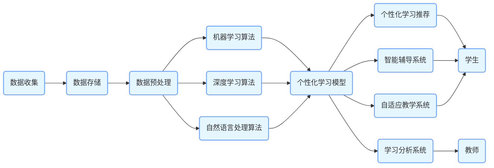

# AI技术在教育科技软件中的应用

> 关键词：AI技术、教育科技软件、个性化学习、智能辅导、学习分析、自适应教学、教育信息化

> 摘要：本文深入探讨了AI技术在教育科技软件中的应用。随着科技的飞速发展，AI与教育的融合成为必然趋势。文章首先介绍了相关背景，包括目的、预期读者等内容。接着阐述了AI技术与教育科技软件结合的核心概念与联系，详细讲解了核心算法原理及具体操作步骤，并给出了数学模型和公式。通过项目实战案例展示了代码实现及解读，分析了实际应用场景。同时推荐了相关的工具和资源，最后总结了未来发展趋势与挑战，解答常见问题并提供扩展阅读和参考资料，旨在全面呈现AI技术在教育科技软件领域的应用现状与潜力。

## 1. 背景介绍 
### 1.1 目的和范围
随着信息技术的不断进步，教育领域也在经历着深刻的变革。AI技术在教育科技软件中的应用旨在提高教育质量、促进个性化学习、优化教学过程，让教育更加高效、公平和有趣。本文的范围涵盖了AI技术在教育科技软件中的多个方面，包括智能辅导系统、学习分析、自适应教学等，探讨其原理、应用案例以及未来发展方向。

### 1.2 预期读者
本文预期读者包括教育科技领域的从业者，如软件开发者、教育技术专家、教育管理者等；也适用于对AI技术在教育领域应用感兴趣的研究人员、教师以及关注教育信息化发展的普通读者。

### 1.3 文档结构概述
本文将按照以下结构展开：首先介绍相关背景知识，包括目的、读者群体等；接着阐述AI技术与教育科技软件结合的核心概念与联系，展示其架构和流程；然后详细讲解核心算法原理及具体操作步骤，给出数学模型和公式；通过项目实战案例展示代码实现及解读；分析实际应用场景；推荐相关的工具和资源；最后总结未来发展趋势与挑战，解答常见问题并提供扩展阅读和参考资料。

### 1.4 术语表
#### 1.4.1 核心术语定义
- **AI技术（Artificial Intelligence Technology）**：指让计算机模拟人类智能的技术，包括机器学习、深度学习、自然语言处理等多个领域。
- **教育科技软件（Educational Technology Software）**：用于支持教育教学活动的软件，借助信息技术实现教学管理、学习辅助等功能。
- **个性化学习（Personalized Learning）**：根据学生的学习风格、能力水平、兴趣爱好等个体差异，为学生提供定制化的学习内容和学习路径。
- **智能辅导系统（Intelligent Tutoring System）**：利用AI技术模拟人类教师的辅导行为，为学生提供个性化的学习指导和反馈。
- **学习分析（Learning Analytics）**：通过收集、分析学生的学习数据，了解学生的学习过程和行为，为教学决策提供依据。
- **自适应教学（Adaptive Instruction）**：根据学生的学习情况实时调整教学内容和策略，以适应学生的学习需求。

#### 1.4.2 相关概念解释
- **机器学习（Machine Learning）**：AI的一个重要分支，通过让计算机从数据中学习模式和规律，实现预测和决策。
- **深度学习（Deep Learning）**：一种基于神经网络的机器学习方法，能够自动从大量数据中提取复杂的特征。
- **自然语言处理（Natural Language Processing）**：研究如何让计算机理解和处理人类语言，包括文本分析、语音识别等。

#### 1.4.3 缩略词列表
- **AI**：Artificial Intelligence（人工智能）
- **ML**：Machine Learning（机器学习）
- **DL**：Deep Learning（深度学习）
- **NLP**：Natural Language Processing（自然语言处理）
- **ITS**：Intelligent Tutoring System（智能辅导系统）
- **LA**：Learning Analytics（学习分析）

## 2. 核心概念与联系 

### 核心概念原理
AI技术在教育科技软件中的应用主要基于以下几个核心概念：

- **个性化学习原理**：每个学生都有独特的学习风格、能力水平和兴趣爱好。AI技术可以通过收集学生的学习数据，如学习进度、答题正确率、学习时间等，利用机器学习算法分析这些数据，为学生构建个性化的学习模型。根据这个模型，系统可以为学生推荐适合他们的学习内容、学习方法和学习资源，实现个性化学习。

- **智能辅导原理**：智能辅导系统利用自然语言处理技术理解学生的问题和需求，通过知识表示和推理技术，从知识库中提取相关的知识和解决方案，为学生提供准确、及时的辅导。同时，系统还可以根据学生的学习情况和反馈，调整辅导策略和方法，提高辅导效果。

- **学习分析原理**：学习分析通过收集学生在学习过程中的各种数据，包括在线学习行为、作业完成情况、考试成绩等，利用数据分析和挖掘技术，发现学生的学习模式、行为规律和潜在问题。这些分析结果可以为教师提供教学决策支持，帮助教师调整教学策略和方法，提高教学质量。

- **自适应教学原理**：自适应教学系统根据学生的学习情况实时调整教学内容和策略。当学生表现出较高的学习能力时，系统可以提供更具挑战性的学习任务；当学生遇到困难时，系统可以提供更多的辅导和支持。通过这种方式，系统可以满足不同学生的学习需求，提高学习效率。

### 架构的文本示意图
AI技术在教育科技软件中的应用架构主要包括以下几个层次：

- **数据层**：负责收集和存储学生的学习数据，包括学习记录、作业、考试成绩、在线行为等。这些数据可以来自各种渠道，如学习管理系统、在线学习平台、智能设备等。

- **算法层**：利用机器学习、深度学习、自然语言处理等AI算法对数据层的数据进行分析和处理。例如，通过聚类算法将学生分为不同的学习群体，通过预测算法预测学生的学习成绩和学习需求，通过自然语言处理算法理解学生的问题和需求。

- **应用层**：将算法层的分析结果应用到具体的教育教学场景中，实现个性化学习、智能辅导、学习分析、自适应教学等功能。例如，根据学生的学习模型推荐个性化的学习内容，利用智能辅导系统为学生提供实时的辅导和反馈，通过学习分析系统为教师提供教学决策支持。

- **用户界面层**：为教师、学生和管理人员提供友好的交互界面，方便他们使用教育科技软件。用户界面层可以采用Web界面、移动应用等多种形式，提供可视化的学习和教学工具。

### Mermaid流程图


这个流程图展示了AI技术在教育科技软件中的应用流程。首先，从各种渠道收集学生的学习数据并存储起来。然后对数据进行预处理，以便后续的算法处理。接着，利用机器学习、深度学习和自然语言处理等算法对数据进行分析，构建个性化学习模型。最后，将模型应用到个性化学习推荐、智能辅导系统、学习分析系统和自适应教学系统中，为学生和教师提供服务。

## 3. 核心算法原理 & 具体操作步骤 

### 核心算法原理

#### 机器学习算法 - 决策树算法
决策树是一种常用的机器学习算法，用于分类和回归任务。在教育科技软件中，决策树可以用于对学生进行分类，例如根据学生的学习成绩、学习时间等特征将学生分为不同的学习群体。

决策树的基本思想是通过对数据的特征进行划分，构建一个树形结构。每个内部节点表示一个特征上的测试，每个分支表示测试的一个输出，每个叶节点表示一个类别或一个值。决策树的构建过程是一个递归的过程，通过选择最优的特征进行划分，直到满足停止条件。

#### 深度学习算法 - 神经网络算法
神经网络是一种模仿人类神经系统的机器学习模型，由多个神经元组成。在教育科技软件中，神经网络可以用于处理复杂的学习数据，例如图像、语音等。

神经网络的基本结构包括输入层、隐藏层和输出层。输入层接收数据，隐藏层对数据进行处理和变换，输出层输出结果。神经网络的训练过程是通过反向传播算法来调整神经元之间的权重，使得网络的输出结果与真实结果之间的误差最小。

#### 自然语言处理算法 - 词向量算法
词向量是一种将文本中的词语表示为向量的方法。在教育科技软件中，词向量可以用于处理学生的问题和需求，例如通过计算词语之间的相似度来理解学生的问题。

词向量的基本思想是将词语映射到一个低维的向量空间中，使得语义相似的词语在向量空间中距离较近。常见的词向量算法包括Word2Vec、GloVe等。

### 具体操作步骤

#### 决策树算法的Python实现
```python
from sklearn.datasets import load_iris
from sklearn.model_selection import train_test_split
from sklearn.tree import DecisionTreeClassifier
from sklearn.metrics import accuracy_score

# 加载数据集
iris = load_iris()
X = iris.data
y = iris.target

# 划分训练集和测试集
X_train, X_test, y_train, y_test = train_test_split(X, y, test_size=0.3, random_state=42)

# 创建决策树分类器
clf = DecisionTreeClassifier()

# 训练模型
clf.fit(X_train, y_train)

# 预测
y_pred = clf.predict(X_test)

# 计算准确率
accuracy = accuracy_score(y_test, y_pred)
print(f"Accuracy: {accuracy}")
```
在这个示例中，我们使用了鸢尾花数据集来演示决策树算法的使用。首先，我们加载数据集并将其划分为训练集和测试集。然后，我们创建一个决策树分类器并使用训练集进行训练。最后，我们使用测试集进行预测，并计算预测的准确率。

#### 神经网络算法的Python实现
```python
import tensorflow as tf
from tensorflow.keras.datasets import mnist
from tensorflow.keras.models import Sequential
from tensorflow.keras.layers import Dense, Flatten

# 加载数据集
(x_train, y_train), (x_test, y_test) = mnist.load_data()

# 数据预处理
x_train = x_train / 255.0
x_test = x_test / 255.0

# 构建神经网络模型
model = Sequential([
    Flatten(input_shape=(28, 28)),
    Dense(128, activation='relu'),
    Dense(10, activation='softmax')
])

# 编译模型
model.compile(optimizer='adam',
              loss='sparse_categorical_crossentropy',
              metrics=['accuracy'])

# 训练模型
model.fit(x_train, y_train, epochs=5)

# 评估模型
test_loss, test_acc = model.evaluate(x_test, y_test)
print(f"Test accuracy: {test_acc}")
```
在这个示例中，我们使用了MNIST手写数字数据集来演示神经网络算法的使用。首先，我们加载数据集并对数据进行预处理。然后，我们构建一个简单的神经网络模型，包括一个Flatten层、一个全连接层和一个输出层。接着，我们编译模型并使用训练集进行训练。最后，我们使用测试集评估模型的性能。

#### 词向量算法的Python实现
```python
from gensim.models import Word2Vec
import numpy as np

# 示例文本数据
sentences = [['this', 'is', 'a', 'sample'], ['another', 'example']]

# 训练Word2Vec模型
model = Word2Vec(sentences, min_count=1)

# 获取词语的向量表示
vector = model.wv['sample']
print(f"Vector for 'sample': {vector}")

# 计算词语之间的相似度
similarity = model.wv.similarity('this', 'is')
print(f"Similarity between 'this' and 'is': {similarity}")
```
在这个示例中，我们使用了Gensim库来实现Word2Vec算法。首先，我们定义了一个示例文本数据。然后，我们使用这些数据训练Word2Vec模型。最后，我们获取词语的向量表示并计算词语之间的相似度。

## 4. 数学模型和公式 & 详细讲解 & 举例说明 

### 决策树算法的数学模型和公式

#### 信息熵
信息熵是用来衡量数据的不确定性的指标。对于一个分类问题，假设数据集 $D$ 中包含 $n$ 个类别，第 $i$ 个类别的样本数为 $n_i$，则数据集 $D$ 的信息熵 $H(D)$ 定义为：
$$H(D)=-\sum_{i=1}^{n}p_i\log_2p_i$$
其中，$p_i=\frac{n_i}{|D|}$ 表示第 $i$ 个类别的样本在数据集中所占的比例。

#### 信息增益
信息增益是用来衡量特征对分类的贡献程度的指标。对于一个特征 $A$，数据集 $D$ 在特征 $A$ 上的信息增益 $G(D,A)$ 定义为：
$$G(D,A)=H(D)-\sum_{v=1}^{V}\frac{|D^v|}{|D|}H(D^v)$$
其中，$V$ 是特征 $A$ 的取值个数，$D^v$ 是数据集 $D$ 中特征 $A$ 取值为 $v$ 的样本子集。

#### 举例说明
假设我们有一个数据集 $D$ 包含 10 个样本，其中 6 个属于类别 1，4 个属于类别 2。则数据集 $D$ 的信息熵为：
$$p_1=\frac{6}{10}=0.6$$
$$p_2=\frac{4}{10}=0.4$$
$$H(D)=-0.6\log_20.6 - 0.4\log_20.4\approx 0.971$$

假设我们有一个特征 $A$，它有两个取值 $A_1$ 和 $A_2$。在特征 $A$ 取值为 $A_1$ 的样本子集中，有 4 个样本，其中 3 个属于类别 1，1 个属于类别 2；在特征 $A$ 取值为 $A_2$ 的样本子集中，有 6 个样本，其中 3 个属于类别 1，3 个属于类别 2。则特征 $A$ 的信息增益为：
$$H(D^{A_1})=- \frac{3}{4}\log_2\frac{3}{4}-\frac{1}{4}\log_2\frac{1}{4}\approx 0.811$$
$$H(D^{A_2})=- \frac{3}{6}\log_2\frac{3}{6}-\frac{3}{6}\log_2\frac{3}{6}=1$$
$$G(D,A)=0.971 - (\frac{4}{10}\times 0.811+\frac{6}{10}\times 1)\approx 0.126$$

### 神经网络算法的数学模型和公式

#### 神经元模型
神经网络中的神经元是一个基本的计算单元，它接收多个输入信号 $x_1,x_2,\cdots,x_n$，并将这些输入信号进行加权求和，然后通过一个激活函数进行变换，得到输出信号 $y$。神经元的数学模型可以表示为：
$$y = f(\sum_{i=1}^{n}w_ix_i + b)$$
其中，$w_i$ 是输入信号 $x_i$ 的权重，$b$ 是偏置，$f$ 是激活函数。

#### 常见的激活函数
- **Sigmoid函数**：
$$\sigma(x)=\frac{1}{1 + e^{-x}}$$
- **ReLU函数**：
$$ReLU(x)=\max(0,x)$$

#### 反向传播算法
反向传播算法是神经网络训练的核心算法，它通过计算误差的梯度，来更新神经元之间的权重和偏置，使得网络的输出结果与真实结果之间的误差最小。假设网络的输出为 $\hat{y}$，真实结果为 $y$，误差函数为 $E(\hat{y},y)$，则权重 $w$ 的更新公式为：
$$w = w - \eta\frac{\partial E}{\partial w}$$
其中，$\eta$ 是学习率。

#### 举例说明
假设我们有一个简单的神经网络，包含一个输入层、一个隐藏层和一个输出层。输入层有 2 个神经元，隐藏层有 3 个神经元，输出层有 1 个神经元。输入信号为 $x_1 = 0.5$，$x_2 = 0.3$，真实结果为 $y = 0.8$。权重和偏置的初始值如下：
$$w_{11}=0.2, w_{12}=0.3, w_{13}=0.4$$
$$w_{21}=0.5, w_{22}=0.6, w_{23}=0.7$$
$$w_{31}=0.8, w_{32}=0.9, w_{33}=1.0$$
$$b_1 = 0.1, b_2 = 0.2, b_3 = 0.3$$
$$b_4 = 0.4$$

首先，我们计算隐藏层神经元的输入和输出：
$$z_1 = w_{11}x_1 + w_{21}x_2 + b_1 = 0.2\times0.5 + 0.5\times0.3 + 0.1 = 0.35$$
$$z_2 = w_{12}x_1 + w_{22}x_2 + b_2 = 0.3\times0.5 + 0.6\times0.3 + 0.2 = 0.43$$
$$z_3 = w_{13}x_1 + w_{23}x_2 + b_3 = 0.4\times0.5 + 0.7\times0.3 + 0.3 = 0.61$$

假设激活函数为Sigmoid函数，则隐藏层神经元的输出为：
$$a_1 = \sigma(z_1)=\frac{1}{1 + e^{-0.35}}\approx 0.587$$
$$a_2 = \sigma(z_2)=\frac{1}{1 + e^{-0.43}}\approx 0.607$$
$$a_3 = \sigma(z_3)=\frac{1}{1 + e^{-0.61}}\approx 0.648$$

然后，我们计算输出层神经元的输入和输出：
$$z_4 = w_{31}a_1 + w_{32}a_2 + w_{33}a_3 + b_4 = 0.8\times0.587 + 0.9\times0.607 + 1.0\times0.648 + 0.4 = 2.013$$
$$\hat{y} = \sigma(z_4)=\frac{1}{1 + e^{-2.013}}\approx 0.881$$

假设误差函数为均方误差函数：
$$E(\hat{y},y)=\frac{1}{2}(\hat{y}-y)^2=\frac{1}{2}(0.881 - 0.8)^2 = 0.003$$

接下来，我们使用反向传播算法更新权重和偏置。这里省略具体的计算过程，只给出更新公式的应用。

### 词向量算法的数学模型和公式

#### 词向量的目标函数
词向量的目标是将词语映射到一个低维的向量空间中，使得语义相似的词语在向量空间中距离较近。Word2Vec算法的目标函数可以表示为：
$$\max\prod_{t=1}^{T}\prod_{-c\leq j\leq c,j\neq0}p(w_{t+j}|w_t)$$
其中，$T$ 是文本的长度，$c$ 是上下文窗口的大小，$w_t$ 是当前词语，$w_{t+j}$ 是上下文词语。

#### 负采样
为了提高训练效率，Word2Vec算法采用了负采样的方法。负采样的基本思想是在训练过程中，随机选择一些负样本，使得模型能够区分正样本和负样本。负采样的目标函数可以表示为：
$$\max\log\sigma(v_{w_O}^Tv_{w_I})+\sum_{i=1}^{k}\log\sigma(-v_{w_{N_i}}^Tv_{w_I})$$
其中，$v_{w_O}$ 是目标词语的向量，$v_{w_I}$ 是上下文词语的向量，$w_{N_i}$ 是负样本词语，$k$ 是负样本的数量。

#### 举例说明
假设我们有一个文本 “this is a sample sentence”，上下文窗口的大小为 2。对于词语 “sample”，它的上下文词语为 “is”、“a”、“sentence”。在训练过程中，我们会随机选择一些负样本，例如 “apple”、“book” 等。然后，我们通过优化目标函数来更新词语的向量表示，使得 “sample” 与它的上下文词语在向量空间中距离较近，与负样本词语距离较远。

## 5. 项目实战：代码实际案例和详细解释说明 

### 5.1  开发环境搭建
为了实现一个简单的基于AI技术的教育科技软件，我们将使用Python语言和一些常用的机器学习和深度学习库。以下是开发环境的搭建步骤：

#### 安装Python
首先，确保你已经安装了Python。可以从Python官方网站（https://www.python.org/downloads/） 下载并安装适合你操作系统的Python版本。建议使用Python 3.6及以上版本。

#### 安装必要的库
我们将使用以下库：
- **NumPy**：用于数值计算。
- **Pandas**：用于数据处理和分析。
- **Scikit-learn**：用于机器学习算法的实现。
- **TensorFlow**：用于深度学习算法的实现。
- **Gensim**：用于自然语言处理和词向量的实现。

可以使用以下命令来安装这些库：
```sh
pip install numpy pandas scikit-learn tensorflow gensim
```

### 5.2  源代码详细实现和代码解读

#### 项目概述
我们将实现一个简单的智能辅导系统，用于解答学生关于数学题的问题。系统将接收学生输入的数学题，使用自然语言处理技术理解问题，然后通过机器学习算法给出答案和解题思路。

#### 代码实现
```python
import numpy as np
import pandas as pd
from sklearn.feature_extraction.text import TfidfVectorizer
from sklearn.svm import SVC
from gensim.models import Word2Vec
import re

# 加载数据集
data = pd.read_csv('math_questions.csv')
questions = data['question'].tolist()
answers = data['answer'].tolist()

# 数据预处理
def preprocess_text(text):
    text = text.lower()
    text = re.sub(r'[^\w\s]', '', text)
    return text

preprocessed_questions = [preprocess_text(q) for q in questions]

# 训练Word2Vec模型
sentences = [q.split() for q in preprocessed_questions]
word2vec_model = Word2Vec(sentences, min_count=1)

# 提取特征
vectorizer = TfidfVectorizer()
X = vectorizer.fit_transform(preprocessed_questions)

# 训练分类器
clf = SVC()
clf.fit(X, answers)

# 定义智能辅导系统
def intelligent_tutoring_system(question):
    preprocessed_question = preprocess_text(question)
    question_vector = vectorizer.transform([preprocessed_question])
    answer = clf.predict(question_vector)[0]
    return answer

# 测试智能辅导系统
test_question = "What is the sum of 2 and 3?"
answer = intelligent_tutoring_system(test_question)
print(f"Question: {test_question}")
print(f"Answer: {answer}")
```

#### 代码解读
1. **数据加载**：我们使用Pandas库加载包含数学问题和答案的数据集。
2. **数据预处理**：定义了一个`preprocess_text`函数，用于将文本转换为小写并去除标点符号。
3. **训练Word2Vec模型**：将预处理后的问题拆分为单词列表，然后使用这些列表训练Word2Vec模型。
4. **提取特征**：使用TfidfVectorizer提取问题的特征向量。
5. **训练分类器**：使用支持向量机（SVM）作为分类器，训练模型以预测问题的答案。
6. **定义智能辅导系统**：定义了一个`intelligent_tutoring_system`函数，用于接收学生的问题，进行预处理和特征提取，然后使用训练好的分类器预测答案。
7. **测试智能辅导系统**：定义了一个测试问题，调用智能辅导系统函数并打印答案。

### 5.3  代码解读与分析
- **数据预处理的重要性**：数据预处理是机器学习和自然语言处理中的重要步骤。通过将文本转换为小写并去除标点符号，可以减少数据的噪声，提高模型的性能。
- **特征提取的选择**：TfidfVectorizer是一种常用的特征提取方法，它可以将文本转换为数值特征向量。在这个项目中，我们使用TfidfVectorizer提取问题的特征，以便分类器能够处理文本数据。
- **分类器的选择**：支持向量机（SVM）是一种强大的分类算法，它可以在高维空间中找到最优的分类超平面。在这个项目中，我们使用SVM作为分类器，训练模型以预测问题的答案。
- **Word2Vec模型的作用**：Word2Vec模型可以将词语表示为向量，使得语义相似的词语在向量空间中距离较近。虽然在这个项目中我们没有直接使用Word2Vec模型的向量，但它可以作为一种辅助工具，用于进一步优化模型的性能。

## 6. 实际应用场景 
### 个性化学习平台
AI技术可以根据学生的学习风格、能力水平和兴趣爱好，为学生提供个性化的学习内容和学习路径。例如，一些在线学习平台会收集学生的学习数据，如学习进度、答题正确率、学习时间等，利用机器学习算法分析这些数据，为学生构建个性化的学习模型。根据这个模型，系统可以为学生推荐适合他们的课程、学习资料和学习方法，实现个性化学习。

### 智能辅导系统
智能辅导系统可以模拟人类教师的辅导行为，为学生提供个性化的学习指导和反馈。例如，一些数学智能辅导系统可以接收学生输入的数学题，使用自然语言处理技术理解问题，然后通过机器学习算法给出答案和解题思路。同时，系统还可以根据学生的学习情况和反馈，调整辅导策略和方法，提高辅导效果。

### 学习分析系统
学习分析系统可以通过收集、分析学生的学习数据，了解学生的学习过程和行为，为教学决策提供依据。例如，学校可以使用学习分析系统收集学生的在线学习行为、作业完成情况、考试成绩等数据，利用数据分析和挖掘技术，发现学生的学习模式、行为规律和潜在问题。这些分析结果可以为教师提供教学决策支持，帮助教师调整教学策略和方法，提高教学质量。

### 自适应教学系统
自适应教学系统可以根据学生的学习情况实时调整教学内容和策略。例如，一些自适应教学软件可以在学生学习过程中，根据学生的答题情况和学习进度，自动调整教学难度和内容。当学生表现出较高的学习能力时，系统可以提供更具挑战性的学习任务；当学生遇到困难时，系统可以提供更多的辅导和支持。通过这种方式，系统可以满足不同学生的学习需求，提高学习效率。

### 虚拟学习助手
虚拟学习助手可以使用自然语言处理技术与学生进行交互，解答学生的问题，提供学习建议和指导。例如，一些教育科技软件中的虚拟学习助手可以接收学生的语音或文本问题，使用自然语言处理算法理解问题，然后从知识库中提取相关的知识和解决方案，为学生提供准确、及时的回答。同时，虚拟学习助手还可以根据学生的学习情况和反馈，不断学习和优化自己的回答，提高服务质量。

## 7. 工具和资源推荐
### 7.1 学习资源推荐
#### 7.1.1 书籍推荐
- 《人工智能：一种现代的方法》（Artificial Intelligence: A Modern Approach）：这是一本经典的人工智能教材，全面介绍了人工智能的各个领域，包括搜索算法、知识表示、机器学习、自然语言处理等。
- 《Python机器学习》（Python Machine Learning）：这本书详细介绍了Python在机器学习中的应用，包括各种机器学习算法的实现和应用案例。
- 《深度学习》（Deep Learning）：由深度学习领域的三位顶尖专家编写，系统地介绍了深度学习的理论和实践，是深度学习领域的权威著作。
- 《自然语言处理入门》（Natural Language Processing in Action）：这本书深入浅出地介绍了自然语言处理的基本概念、算法和应用，适合初学者阅读。

#### 7.1.2 在线课程
- **Coursera平台**：提供了许多关于人工智能、机器学习和深度学习的在线课程，如吴恩达的《机器学习》课程、斯坦福大学的《深度学习专项课程》等。
- **edX平台**：提供了一些高质量的人工智能和机器学习课程，如麻省理工学院的《人工智能导论》课程、伯克利大学的《深度学习基础》课程等。
- **Udemy平台**：有大量关于人工智能和教育科技的课程，涵盖了从基础到高级的不同层次，适合不同水平的学习者。

#### 7.1.3 技术博客和网站
- **Medium**：是一个技术博客平台，有许多关于人工智能、教育科技的优质文章，作者来自世界各地的技术专家和研究人员。
- **Towards Data Science**：专注于数据科学和人工智能领域，提供了许多关于机器学习、深度学习、自然语言处理等方面的技术文章和案例分析。
- **AI Education Research**：专门关注人工智能在教育领域的应用研究，分享最新的研究成果和实践经验。

### 7.2 开发工具框架推荐
#### 7.2.1 IDE和编辑器
- **PyCharm**：是一款专业的Python集成开发环境（IDE），提供了丰富的功能和插件，适合开发Python项目，尤其是人工智能和机器学习项目。
- **Jupyter Notebook**：是一个交互式的开发环境，支持Python、R等多种编程语言，适合进行数据分析、模型训练和可视化等工作。
- **Visual Studio Code**：是一款轻量级的代码编辑器，支持多种编程语言和插件，具有良好的扩展性和用户体验，适合快速开发和调试代码。

#### 7.2.2 调试和性能分析工具
- **TensorBoard**：是TensorFlow提供的一个可视化工具，用于监控和分析深度学习模型的训练过程，包括损失函数、准确率、梯度等指标的变化情况。
- **Scikit-learn的模型评估工具**：Scikit-learn库提供了许多模型评估工具，如交叉验证、混淆矩阵、ROC曲线等，用于评估机器学习模型的性能。
- **Profiling工具**：Python的`cProfile`和`line_profiler`等工具可以用于分析代码的性能瓶颈，找出耗时较长的代码段，进行优化。

#### 7.2.3 相关框架和库
- **TensorFlow**：是一个开源的深度学习框架，由Google开发和维护，提供了丰富的深度学习模型和工具，支持分布式训练和移动端部署。
- **PyTorch**：是另一个流行的深度学习框架，由Facebook开发和维护，具有动态计算图的特点，适合快速原型开发和研究。
- **Scikit-learn**：是一个简单易用的机器学习库，提供了各种机器学习算法和工具，如分类、回归、聚类、降维等，适合初学者和快速开发。
- **NLTK**：是一个自然语言处理库，提供了丰富的自然语言处理工具和语料库，如分词、词性标注、命名实体识别等，适合进行自然语言处理任务。

### 7.3 相关论文著作推荐
#### 7.3.1 经典论文
- **“Learning Representations by Back-propagating Errors”**：这是一篇关于神经网络和反向传播算法的经典论文，由Geoffrey Hinton等人发表，奠定了深度学习的基础。
- **“ImageNet Classification with Deep Convolutional Neural Networks”**：这篇论文介绍了AlexNet卷积神经网络，在2012年的ImageNet图像分类竞赛中取得了巨大成功，标志着深度学习在计算机视觉领域的崛起。
- **“Attention Is All You Need”**：这篇论文提出了Transformer模型，引入了注意力机制，在自然语言处理领域取得了突破性进展，成为了当前许多自然语言处理模型的基础。

#### 7.3.2 最新研究成果
- **“Adaptive Learning Systems in Education: A Systematic Review”**：这篇论文对自适应学习系统在教育领域的应用进行了系统的综述，分析了当前的研究现状和未来的发展趋势。
- **“AI-Enhanced Learning: A Meta-analysis of the Empirical Evidence”**：这篇论文通过元分析的方法，对AI技术在学习中的应用效果进行了评估，为AI技术在教育领域的应用提供了实证依据。
- **“The Role of Artificial Intelligence in Personalized Learning: A Review”**：这篇论文探讨了人工智能在个性化学习中的作用，分析了个性化学习的理论基础和技术实现方法。

#### 7.3.3 应用案例分析
- **“Case Studies of AI-Enabled Educational Technologies in K-12 Classrooms”**：这篇论文介绍了AI技术在K-12课堂中的应用案例，分析了这些技术的应用效果和存在的问题，为教育实践者提供了参考。
- **“Implementing AI in Higher Education: A Case Study of a University’s Experience”**：这篇论文以一所大学为例，介绍了AI技术在高等教育中的应用实践，分享了实施过程中的经验和教训。
- **“AI-Powered Tutoring Systems: Case Studies and Best Practices”**：这篇论文介绍了一些AI智能辅导系统的应用案例，分析了这些系统的设计思路和实现方法，为开发智能辅导系统提供了参考。

## 8. 总结：未来发展趋势与挑战
### 未来发展趋势
#### 更深入的个性化学习
未来，AI技术将能够更深入地了解每个学生的学习特点和需求，提供更加个性化的学习方案。通过对学生的学习数据进行更细致的分析，系统可以准确地把握学生的知识漏洞和学习瓶颈，为学生提供针对性的学习资源和辅导，实现真正意义上的因材施教。

#### 智能教育机器人的广泛应用
智能教育机器人将逐渐走进课堂和家庭，成为学生的学习伙伴。这些机器人可以与学生进行自然的语言交互，解答学生的问题，提供学习指导和陪伴。同时，机器人还可以通过感知学生的情绪和行为，调整教学方式和内容，提高学习的趣味性和效果。

#### 教育与虚拟现实（VR）、增强现实（AR）的融合
VR和AR技术可以为学生创造沉浸式的学习环境，使学习更加生动有趣。结合AI技术，系统可以根据学生的学习情况和需求，动态调整VR和AR场景，提供个性化的学习体验。例如，在历史、地理等学科的学习中，学生可以通过VR技术身临其境地感受历史事件和地理环境。

#### 跨学科融合的教育模式
AI技术将促进教育的跨学科融合，打破传统学科之间的界限。通过整合不同学科的知识和方法，培养学生的综合素养和创新能力。例如，在STEM教育中，AI技术可以帮助学生更好地理解科学、技术、工程和数学之间的联系，提高学生的解决问题能力。

#### 全球教育资源的共享与协作
AI技术将打破地域限制，实现全球教育资源的共享与协作。学生可以通过在线平台获取来自世界各地的优质教育资源，与不同地区的学生和教师进行交流和合作。这将促进教育的公平性和国际化发展。

### 挑战
#### 数据隐私和安全问题
随着AI技术在教育领域的广泛应用，学生的学习数据将大量产生和存储。这些数据包含了学生的个人信息和学习情况，一旦泄露，将对学生的隐私和安全造成威胁。因此，如何保护学生的数据隐私和安全是一个亟待解决的问题。

#### 技术的可解释性和透明度
AI技术的一些算法，如深度学习算法，往往是黑盒模型，其决策过程难以解释。在教育领域，教师和学生需要了解系统的决策依据，以便更好地理解和应用系统的结果。因此，提高AI技术的可解释性和透明度是一个重要的挑战。

#### 教师的技术素养和适应能力
AI技术的应用需要教师具备一定的技术素养和适应能力。然而，目前许多教师对AI技术的了解和掌握程度有限，缺乏应用AI技术进行教学的经验和能力。因此，如何提高教师的技术素养和适应能力，使他们能够有效地应用AI技术进行教学，是一个关键的问题。

#### 伦理和道德问题
AI技术的应用可能会带来一些伦理和道德问题，如算法偏见、教育公平性问题等。例如，如果AI系统的算法存在偏见，可能会导致对某些学生的不公平评价和待遇。因此，如何确保AI技术在教育领域的应用符合伦理和道德原则，是一个需要深入思考的问题。

#### 技术成本和资源限制
AI技术的研发和应用需要大量的资金和资源投入。对于一些教育资源相对匮乏的地区和学校来说，可能无法承担这些成本。因此，如何降低AI技术的应用成本，使更多的学生和学校能够受益于AI技术，是一个需要解决的问题。

## 9. 附录：常见问题与解答
### 1. AI技术在教育科技软件中的应用是否会取代教师？
不会。AI技术在教育科技软件中的应用是为了辅助教师教学，提高教学效率和质量，而不是取代教师。教师在教育过程中具有不可替代的作用，如情感关怀、价值观引导、个性化的教学指导等。AI技术可以帮助教师更好地了解学生的学习情况，提供个性化的教学资源和支持，但无法完全替代教师的角色。

### 2. 如何确保AI技术在教育科技软件中的应用符合教育规律？
在开发和应用AI技术的教育科技软件时，需要充分考虑教育规律和教学需求。一方面，要与教育专家和教师合作，确保软件的功能和设计符合教育教学的基本原则和方法；另一方面，要进行大量的实验和验证，通过实践来检验软件的效果和适用性。同时，要不断收集用户的反馈，对软件进行优化和改进。

### 3. AI技术在教育科技软件中的应用对学生的学习能力有哪些影响？
AI技术在教育科技软件中的应用可以对学生的学习能力产生多方面的影响。首先，个性化学习可以满足学生的不同需求，提高学生的学习兴趣和积极性，从而有助于培养学生的自主学习能力。其次，智能辅导系统可以及时提供反馈和指导，帮助学生更好地理解和掌握知识，提高学生的学习效果。此外，学习分析系统可以帮助学生了解自己的学习情况和问题，培养学生的自我反思和自我管理能力。

### 4. 如何选择适合的AI技术和教育科技软件？
选择适合的AI技术和教育科技软件需要考虑多个因素。首先，要根据教学目标和需求来选择，确保软件的功能和应用场景与教学内容相匹配。其次，要考虑软件的易用性和稳定性，确保教师和学生能够方便地使用软件。此外，还要考虑软件的安全性和数据隐私保护措施，确保学生的信息安全。最后，可以参考其他学校或教师的使用经验和评价，选择口碑较好的软件。

### 5. AI技术在教育科技软件中的应用是否会增加学生的学习负担？
如果应用得当，AI技术在教育科技软件中的应用不会增加学生的学习负担，反而可以减轻学生的学习负担。例如，个性化学习可以根据学生的实际情况提供适合的学习内容和学习方法，避免学生进行不必要的重复学习；智能辅导系统可以及时解决学生的问题，减少学生的学习困惑。然而，如果软件的设计不合理或使用不当，可能会给学生带来额外的负担，如过多的在线作业、复杂的操作流程等。因此，在应用AI技术的教育科技软件时，需要合理设计和使用，确保不会增加学生的学习负担。

## 10. 扩展阅读 & 参考资料
### 扩展阅读
- 《教育中的人工智能：机遇与挑战》（Artificial Intelligence in Education: Opportunities and Challenges）：这本书深入探讨了AI技术在教育领域的应用现状、机遇和挑战，提供了许多实际案例和解决方案。
- 《智能教育：从理念到实践》（Intelligent Education: From Concept to Practice）：介绍了智能教育的概念、理论和实践，分析了AI技术在教育中的应用模式和发展趋势。
- 《教育科技的未来：AI与教育的融合》（The Future of Educational Technology: The Integration of AI and Education）：探讨了AI技术与教育科技的融合趋势，展望了未来教育的发展方向。

### 参考资料
- 相关学术期刊文章，如《Journal of Educational Technology & Society》、《Artificial Intelligence in Education》等。
- 教育科技公司的官方网站和技术文档，如Coursera、EdX等在线学习平台的相关资料。
- 政府部门和国际组织发布的关于教育信息化和AI技术应用的政策文件和报告。