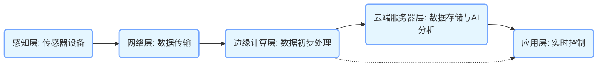

# AI技术在物联网软件开发中的应用

> 关键词：AI技术、物联网、软件开发、机器学习、数据分析、智能决策、边缘计算

> 摘要：本文深入探讨了AI技术在物联网软件开发中的应用。首先介绍了相关背景，包括目的、预期读者等内容。接着阐述了AI与物联网的核心概念及联系，通过文本示意图和Mermaid流程图进行直观展示。详细讲解了核心算法原理，并结合Python源代码说明具体操作步骤。呈现了相关的数学模型和公式，并举例解释。通过项目实战，展示了开发环境搭建、源代码实现及解读分析。分析了AI技术在物联网软件开发中的实际应用场景。推荐了学习资源、开发工具框架及相关论文著作。最后总结了未来发展趋势与挑战，还提供了常见问题解答及扩展阅读和参考资料，旨在全面剖析AI技术在物联网软件开发领域的应用。

## 1. 背景介绍 
### 1.1 目的和范围
随着科技的飞速发展，物联网（Internet of Things，IoT）已经成为连接物理世界和数字世界的重要桥梁。物联网通过各种传感器和设备收集大量的数据，然而如何高效地处理、分析这些数据，并从中提取有价值的信息，成为了物联网发展面临的关键问题。AI技术，特别是机器学习、深度学习等领域的发展，为解决这些问题提供了强大的工具。本文的目的在于深入探讨AI技术在物联网软件开发中的应用，范围涵盖从基础概念、算法原理到实际应用案例等多个方面，旨在为相关领域的开发者、研究者和从业者提供全面而深入的参考。

### 1.2 预期读者
本文预期读者包括物联网软件开发工程师、AI研究人员、对物联网和AI技术融合感兴趣的技术爱好者、相关领域的学生以及企业中负责技术决策的管理人员等。无论您是初学者想要了解基础知识，还是有一定经验的专业人士希望深入研究技术细节，本文都能为您提供有价值的信息。

### 1.3 文档结构概述
本文将按照以下结构展开：首先介绍相关背景知识，包括目的、预期读者、文档结构概述和术语表。接着阐述AI与物联网的核心概念及联系，通过直观的示意图和流程图进行展示。详细讲解核心算法原理，并结合Python源代码说明具体操作步骤。呈现相关的数学模型和公式，并举例解释。通过项目实战，展示开发环境搭建、源代码实现及解读分析。分析AI技术在物联网软件开发中的实际应用场景。推荐学习资源、开发工具框架及相关论文著作。最后总结未来发展趋势与挑战，还提供常见问题解答及扩展阅读和参考资料。

### 1.4 术语表
#### 1.4.1 核心术语定义
- **物联网（IoT）**：通过各种信息传感器、射频识别技术、全球定位系统、红外感应器、激光扫描器等各种装置与技术，实时采集任何需要监控、连接、互动的物体或过程，采集其声、光、热、电、力学、化学、生物、位置等各种需要的信息，通过各类可能的网络接入，实现物与物、物与人的泛在连接，实现对物品和过程的智能化感知、识别和管理。
- **AI技术（Artificial Intelligence）**：即人工智能，它是研究、开发用于模拟、延伸和扩展人的智能的理论、方法、技术及应用系统的一门新的技术科学。
- **机器学习（Machine Learning）**：是一门多领域交叉学科，涉及概率论、统计学、逼近论、凸分析、算法复杂度理论等多门学科。它专门研究计算机怎样模拟或实现人类的学习行为，以获取新的知识或技能，重新组织已有的知识结构使之不断改善自身的性能。
- **深度学习（Deep Learning）**：是机器学习的一个分支领域，它是一种基于对数据进行表征学习的方法。深度学习通过构建具有很多层的神经网络模型，自动从大量数据中学习特征和模式。

#### 1.4.2 相关概念解释
- **边缘计算（Edge Computing）**：是一种分散式运算的架构，将应用程序、数据资料与服务的运算，由网络中心节点，移往网络逻辑上的边缘节点来处理。在物联网中，边缘计算可以在靠近数据源的地方对数据进行初步处理，减少数据传输量，提高系统的响应速度。
- **传感器（Sensor）**：是一种检测装置，能感受到被测量的信息，并能将感受到的信息，按一定规律变换成为电信号或其他所需形式的信息输出，以满足信息的传输、处理、存储、显示、记录和控制等要求。在物联网中，传感器是获取数据的重要设备。

#### 1.4.3 缩略词列表
- **IoT**：Internet of Things（物联网）
- **AI**：Artificial Intelligence（人工智能）
- **ML**：Machine Learning（机器学习）
- **DL**：Deep Learning（深度学习）
- **EC**：Edge Computing（边缘计算）

## 2. 核心概念与联系 
### 核心概念原理
物联网的核心原理是通过各种传感器和设备收集物理世界的数据，然后将这些数据通过网络传输到云端或本地服务器进行处理和分析。传感器负责感知环境中的各种物理量，如温度、湿度、压力、光照等，并将其转换为数字信号。网络层负责将传感器收集的数据传输到处理中心，常见的网络技术包括Wi-Fi、蓝牙、ZigBee、LoRa等。处理中心则对收集到的数据进行存储、分析和处理，以实现各种应用功能，如设备监控、智能控制、预测维护等。

AI技术的核心原理是让计算机模拟人类的智能行为，通过学习和推理来解决各种问题。机器学习是AI的重要分支，它通过让计算机从大量数据中学习模式和规律，从而实现对未知数据的预测和分类。深度学习则是一种基于神经网络的机器学习方法，它通过构建多层神经网络，自动从数据中学习复杂的特征和模式，在图像识别、语音识别、自然语言处理等领域取得了巨大的成功。

### 架构的文本示意图
物联网与AI技术融合的架构可以分为以下几个层次：
1. **感知层**：由各种传感器和设备组成，负责收集物理世界的数据。
2. **网络层**：负责将感知层收集的数据传输到边缘节点或云端服务器。
3. **边缘计算层**：在靠近数据源的地方对数据进行初步处理和分析，减少数据传输量，提高系统的响应速度。
4. **云端服务器层**：对大量的数据进行存储、处理和分析，利用AI技术挖掘数据中的价值。
5. **应用层**：将处理和分析后的数据应用于各种实际场景，如智能家居、智能交通、工业自动化等。

### Mermaid流程图


## 3. 核心算法原理 & 具体操作步骤 
### 核心算法原理
在物联网软件开发中，常用的AI算法包括机器学习算法和深度学习算法。以下以简单的线性回归算法为例，介绍机器学习算法的原理。

线性回归是一种用于建立自变量（特征）和因变量（目标）之间线性关系的算法。假设我们有一组数据 $(x_1, y_1), (x_2, y_2), \cdots, (x_n, y_n)$，其中 $x_i$ 是自变量，$y_i$ 是因变量。线性回归的目标是找到一条直线 $y = \theta_0 + \theta_1x$，使得所有数据点到这条直线的误差平方和最小。误差平方和可以表示为：

$$J(\theta_0, \theta_1) = \frac{1}{2n}\sum_{i = 1}^{n}(y_i - (\theta_0 + \theta_1x_i))^2$$

我们的目标是找到 $\theta_0$ 和 $\theta_1$ 的值，使得 $J(\theta_0, \theta_1)$ 最小。可以使用梯度下降算法来求解这个问题。梯度下降算法的基本思想是通过不断迭代更新 $\theta_0$ 和 $\theta_1$ 的值，使得 $J(\theta_0, \theta_1)$ 逐渐减小。

### 具体操作步骤及Python源代码
以下是使用Python实现线性回归算法的具体步骤和代码：

```python
import numpy as np
import matplotlib.pyplot as plt

# 生成一些示例数据
np.random.seed(0)
x = np.linspace(0, 10, 100)
y = 2 * x + 1 + np.random.randn(100)

# 初始化参数
theta0 = 0
theta1 = 0

# 定义学习率和迭代次数
learning_rate = 0.01
num_iterations = 1000

# 定义梯度下降函数
def gradient_descent(x, y, theta0, theta1, learning_rate, num_iterations):
    n = len(x)
    for iteration in range(num_iterations):
        # 计算预测值
        y_pred = theta0 + theta1 * x
        
        # 计算误差
        error = y_pred - y
        
        # 计算梯度
        d_theta0 = (1/n) * np.sum(error)
        d_theta1 = (1/n) * np.sum(error * x)
        
        # 更新参数
        theta0 = theta0 - learning_rate * d_theta0
        theta1 = theta1 - learning_rate * d_theta1
        
    return theta0, theta1

# 执行梯度下降算法
theta0, theta1 = gradient_descent(x, y, theta0, theta1, learning_rate, num_iterations)

# 打印最终的参数值
print(f"theta0: {theta0}, theta1: {theta1}")

# 绘制原始数据和拟合直线
plt.scatter(x, y)
plt.plot(x, theta0 + theta1 * x, color='red')
plt.show()
```

### 代码解释
1. **数据生成**：使用 `np.linspace` 生成一组自变量 $x$，然后根据线性关系 $y = 2x + 1$ 加上一些随机噪声生成因变量 $y$。
2. **参数初始化**：将 $\theta_0$ 和 $\theta_1$ 初始化为 0。
3. **定义学习率和迭代次数**：学习率控制每次参数更新的步长，迭代次数控制梯度下降算法的迭代次数。
4. **梯度下降函数**：在每次迭代中，计算预测值 $y_{pred}$，然后计算误差 $error$。根据误差计算 $\theta_0$ 和 $\theta_1$ 的梯度 $d_{\theta_0}$ 和 $d_{\theta_1}$，最后更新 $\theta_0$ 和 $\theta_1$ 的值。
5. **执行梯度下降算法**：调用 `gradient_descent` 函数，得到最终的 $\theta_0$ 和 $\theta_1$ 的值。
6. **绘制结果**：使用 `matplotlib` 绘制原始数据点和拟合直线。

## 4. 数学模型和公式 & 详细讲解 & 举例说明 
### 线性回归的数学模型和公式
线性回归的数学模型可以表示为：

$$y = \theta_0 + \theta_1x_1 + \theta_2x_2 + \cdots + \theta_nx_n + \epsilon$$

其中，$y$ 是因变量，$x_1, x_2, \cdots, x_n$ 是自变量，$\theta_0, \theta_1, \cdots, \theta_n$ 是模型的参数，$\epsilon$ 是误差项，表示模型无法解释的随机误差。

在简单线性回归中，只有一个自变量，即 $n = 1$，模型可以简化为：

$$y = \theta_0 + \theta_1x + \epsilon$$

### 详细讲解
线性回归的目标是找到一组参数 $\theta_0, \theta_1, \cdots, \theta_n$，使得模型的预测值 $\hat{y}$ 尽可能接近真实值 $y$。通常使用最小二乘法来估计参数，即最小化误差平方和：

$$J(\theta) = \frac{1}{2m}\sum_{i = 1}^{m}(y^{(i)} - \hat{y}^{(i)})^2$$

其中，$m$ 是样本数量，$y^{(i)}$ 是第 $i$ 个样本的真实值，$\hat{y}^{(i)}$ 是第 $i$ 个样本的预测值。

为了找到使 $J(\theta)$ 最小的参数 $\theta$，可以使用梯度下降算法。梯度下降算法的更新公式为：

$$\theta_j := \theta_j - \alpha\frac{\partial J(\theta)}{\partial \theta_j}$$

其中，$\alpha$ 是学习率，$\frac{\partial J(\theta)}{\partial \theta_j}$ 是 $J(\theta)$ 关于 $\theta_j$ 的偏导数。

### 举例说明
假设我们有以下数据集：

| $x$ | $y$ |
|---|---|
| 1 | 3 |
| 2 | 5 |
| 3 | 7 |
| 4 | 9 |

我们的目标是使用线性回归模型 $y = \theta_0 + \theta_1x$ 来拟合这些数据。

首先，计算误差平方和 $J(\theta_0, \theta_1)$：

$$J(\theta_0, \theta_1) = \frac{1}{2\times4}[(3 - (\theta_0 + \theta_1\times1))^2 + (5 - (\theta_0 + \theta_1\times2))^2 + (7 - (\theta_0 + \theta_1\times3))^2 + (9 - (\theta_0 + \theta_1\times4))^2]$$

然后，使用梯度下降算法来更新 $\theta_0$ 和 $\theta_1$ 的值。假设学习率 $\alpha = 0.01$，迭代次数为 1000 次。

经过迭代计算，最终可以得到 $\theta_0$ 和 $\theta_1$ 的值，使得 $J(\theta_0, \theta_1)$ 最小。在这个例子中，$\theta_0$ 接近 1，$\theta_1$ 接近 2，这与我们的数据生成规律 $y = 2x + 1$ 相符。

## 5. 项目实战：代码实际案例和详细解释说明 
### 5.1  开发环境搭建
在进行物联网软件开发并应用AI技术时，需要搭建相应的开发环境。以下是一个常见的开发环境搭建步骤：

#### 硬件环境
- **传感器设备**：根据具体的应用场景选择合适的传感器，如温度传感器、湿度传感器、加速度传感器等。常见的传感器开发板有Arduino、Raspberry Pi等。
- **服务器**：可以选择云服务器或本地服务器，如阿里云、腾讯云等云服务提供商的服务器，或者使用自己搭建的Linux服务器。

#### 软件环境
- **操作系统**：服务器端可以选择Linux操作系统，如Ubuntu、CentOS等；开发设备可以根据需要选择Windows、Mac OS或Linux。
- **编程语言**：Python是物联网和AI开发中常用的编程语言，因为它有丰富的库和工具。
- **开发工具**：可以使用PyCharm、VS Code等集成开发环境（IDE）进行Python代码的开发。
- **数据库**：选择合适的数据库来存储物联网数据，如MySQL、InfluxDB等。

### 5.2  源代码详细实现和代码解读
以下是一个简单的物联网数据采集和AI分析的项目示例，假设我们使用Raspberry Pi连接温度传感器，采集温度数据并使用线性回归算法进行预测。

#### 数据采集代码
```python
import time
import random
import pymysql

# 模拟温度传感器数据采集
def read_temperature():
    return random.uniform(20, 30)

# 连接数据库
conn = pymysql.connect(host='localhost', user='root', password='password', database='iot_data')
cursor = conn.cursor()

# 创建数据表（如果不存在）
create_table_query = """
CREATE TABLE IF NOT EXISTS temperature_data (
    id INT AUTO_INCREMENT PRIMARY KEY,
    timestamp TIMESTAMP DEFAULT CURRENT_TIMESTAMP,
    temperature FLOAT
)
"""
cursor.execute(create_table_query)
conn.commit()

# 采集数据并存储到数据库
try:
    while True:
        temperature = read_temperature()
        insert_query = "INSERT INTO temperature_data (temperature) VALUES (%s)"
        cursor.execute(insert_query, (temperature,))
        conn.commit()
        print(f"Temperature: {temperature}°C, saved to database.")
        time.sleep(60)  # 每分钟采集一次数据
except KeyboardInterrupt:
    print("Data collection stopped.")
finally:
    cursor.close()
    conn.close()
```

#### 代码解读
1. **数据采集函数**：`read_temperature` 函数模拟温度传感器的数据采集，返回一个随机的温度值。
2. **数据库连接**：使用 `pymysql` 库连接到MySQL数据库，并创建一个游标对象。
3. **数据表创建**：执行SQL语句创建一个名为 `temperature_data` 的数据表，用于存储温度数据。
4. **数据采集和存储**：使用一个无限循环每分钟采集一次温度数据，并将数据插入到数据表中。
5. **异常处理**：使用 `try-except-finally` 语句捕获 `KeyboardInterrupt` 异常，确保在程序中断时关闭数据库连接。

#### AI分析代码
```python
import pymysql
import numpy as np
from sklearn.linear_model import LinearRegression

# 连接数据库
conn = pymysql.connect(host='localhost', user='root', password='password', database='iot_data')
cursor = conn.cursor()

# 查询温度数据
select_query = "SELECT timestamp, temperature FROM temperature_data"
cursor.execute(select_query)
data = cursor.fetchall()

# 提取时间戳和温度数据
timestamps = np.array([i[0].timestamp() for i in data]).reshape(-1, 1)
temperatures = np.array([i[1] for i in data])

# 创建线性回归模型
model = LinearRegression()
model.fit(timestamps, temperatures)

# 预测未来温度
future_timestamp = np.array([max(timestamps).item() + 3600]).reshape(-1, 1)
future_temperature = model.predict(future_timestamp)

print(f"Predicted temperature after 1 hour: {future_temperature[0]}°C")

# 关闭数据库连接
cursor.close()
conn.close()
```

#### 代码解读
1. **数据库连接**：使用 `pymysql` 库连接到MySQL数据库，并创建一个游标对象。
2. **数据查询**：执行SQL语句查询 `temperature_data` 表中的时间戳和温度数据。
3. **数据处理**：将时间戳和温度数据转换为NumPy数组，并将时间戳数组进行重塑，以适应线性回归模型的输入要求。
4. **模型训练**：使用 `sklearn` 库中的 `LinearRegression` 类创建一个线性回归模型，并使用历史数据进行训练。
5. **预测未来温度**：选择一个未来的时间戳，使用训练好的模型进行预测。
6. **关闭数据库连接**：在程序结束时关闭数据库连接。

### 5.3  代码解读与分析
#### 数据采集部分
- **数据模拟**：在实际应用中，`read_temperature` 函数应该替换为实际的传感器数据读取函数，以获取真实的温度数据。
- **数据库操作**：使用 `pymysql` 库进行数据库操作，确保数据的安全存储。在实际应用中，可能需要考虑数据库的性能优化和数据备份等问题。

#### AI分析部分
- **数据预处理**：将时间戳转换为数值类型，并进行重塑，以适应线性回归模型的输入要求。在实际应用中，可能需要对数据进行更多的预处理，如归一化、特征工程等。
- **模型选择**：线性回归模型是一个简单的模型，适用于数据具有线性关系的情况。在实际应用中，可能需要根据数据的特点选择更复杂的模型，如决策树、神经网络等。

## 6. 实际应用场景 
### 智能家居
在智能家居领域，AI技术与物联网的结合可以实现更加智能化的家居控制。通过安装在各个房间的传感器，如温度传感器、湿度传感器、光照传感器等，实时采集环境数据。AI算法可以根据这些数据自动调整空调、加湿器、灯光等设备的运行状态，以提供更加舒适的居住环境。例如，当温度传感器检测到室内温度过高时，AI系统可以自动调节空调的温度和风速；当光照传感器检测到室内光线较暗时，AI系统可以自动打开灯光。

### 智能交通
在智能交通领域，AI技术与物联网的结合可以实现交通流量的实时监测和智能调度。通过安装在道路上的传感器，如摄像头、雷达等，实时采集交通流量、车速等数据。AI算法可以根据这些数据预测交通拥堵情况，并及时调整交通信号灯的时间，以优化交通流量。例如，当某个路口的交通流量较大时，AI系统可以自动延长该路口的绿灯时间，减少车辆等待时间。

### 工业自动化
在工业自动化领域，AI技术与物联网的结合可以实现设备的实时监测和预测维护。通过安装在设备上的传感器，如振动传感器、温度传感器、压力传感器等，实时采集设备的运行状态数据。AI算法可以根据这些数据预测设备的故障发生概率，并及时提醒维护人员进行维护，以减少设备停机时间和维修成本。例如，当振动传感器检测到设备的振动异常时，AI系统可以自动分析可能的故障原因，并及时发出警报。

### 农业智能化
在农业智能化领域，AI技术与物联网的结合可以实现农作物生长环境的实时监测和智能灌溉。通过安装在农田里的传感器，如土壤湿度传感器、光照传感器、气象站等，实时采集土壤湿度、光照强度、气象条件等数据。AI算法可以根据这些数据自动调整灌溉系统的运行时间和水量，以提高农作物的产量和质量。例如，当土壤湿度传感器检测到土壤水分不足时，AI系统可以自动启动灌溉系统进行灌溉。

## 7. 工具和资源推荐
### 7.1 学习资源推荐
#### 7.1.1 书籍推荐
- 《Python机器学习基础教程》：这本书详细介绍了Python在机器学习领域的应用，包括各种机器学习算法的原理和实现。
- 《深度学习》：由深度学习领域的三位顶尖专家Ian Goodfellow、Yoshua Bengio和Aaron Courville撰写，是深度学习领域的经典著作。
- 《物联网：技术、应用与创新》：全面介绍了物联网的技术体系、应用场景和创新模式，适合对物联网感兴趣的读者。

#### 7.1.2 在线课程
- Coursera上的“机器学习”课程：由斯坦福大学教授Andrew Ng主讲，是机器学习领域的经典课程。
- edX上的“深度学习”课程：由百度首席科学家吴恩达主讲，深入介绍了深度学习的原理和应用。
- 中国大学MOOC上的“物联网技术与应用”课程：介绍了物联网的基本概念、关键技术和应用案例。

#### 7.1.3 技术博客和网站
- Medium：是一个汇聚了众多技术专家和开发者的博客平台，上面有很多关于AI和物联网的优质文章。
- 开源中国：提供了丰富的技术资讯和开源项目，对于了解AI和物联网的最新发展动态有很大帮助。
- 博客园：是国内知名的技术博客网站，有很多开发者分享自己的技术经验和项目实践。

### 7.2 开发工具框架推荐
#### 7.2.1 IDE和编辑器
- PyCharm：是一款专门为Python开发设计的集成开发环境，具有强大的代码编辑、调试和分析功能。
- VS Code：是一款轻量级的代码编辑器，支持多种编程语言，并且有丰富的插件扩展功能。
- Jupyter Notebook：是一个交互式的编程环境，适合进行数据分析和模型训练。

#### 7.2.2 调试和性能分析工具
- PDB：是Python自带的调试工具，可以帮助开发者逐步调试代码，查找问题。
- Py-Spy：是一个性能分析工具，可以实时分析Python程序的性能瓶颈。
- TensorBoard：是TensorFlow提供的可视化工具，可以帮助开发者可视化训练过程和模型结构。

#### 7.2.3 相关框架和库
- TensorFlow：是一个开源的机器学习框架，由Google开发，广泛应用于深度学习领域。
- PyTorch：是一个开源的深度学习框架，由Facebook开发，具有动态计算图的特点，易于使用和调试。
- Scikit-learn：是一个开源的机器学习库，提供了各种机器学习算法的实现，适合初学者使用。

### 7.3 相关论文著作推荐
#### 7.3.1 经典论文
- “Gradient-based learning applied to document recognition”：由Yann LeCun等人撰写，介绍了卷积神经网络（CNN）在手写字符识别中的应用，是深度学习领域的经典论文。
- “ImageNet Classification with Deep Convolutional Neural Networks”：由Alex Krizhevsky等人撰写，介绍了AlexNet网络在ImageNet图像分类任务中的应用，开启了深度学习在计算机视觉领域的热潮。
- “Long Short-Term Memory”：由Sepp Hochreiter和Jürgen Schmidhuber撰写，介绍了长短期记忆网络（LSTM）的原理和应用，是深度学习在自然语言处理领域的重要突破。

#### 7.3.2 最新研究成果
- 关注顶级学术会议，如NeurIPS（神经信息处理系统大会）、ICML（国际机器学习会议）、CVPR（计算机视觉与模式识别会议）等，这些会议上会发布很多关于AI和物联网的最新研究成果。
- 关注学术期刊，如Journal of Artificial Intelligence Research（JAIR）、IEEE Transactions on Neural Networks and Learning Systems等，这些期刊上会发表很多高质量的学术论文。

#### 7.3.3 应用案例分析
- 可以参考一些知名企业的技术博客和案例分享，如Google AI Blog、Facebook AI Research等，了解他们在AI和物联网领域的应用实践和经验分享。
- 关注行业报告和研究机构的分析，如Gartner、IDC等，了解AI和物联网技术在不同行业的应用趋势和发展前景。

## 8. 总结：未来发展趋势与挑战
### 未来发展趋势
#### 边缘AI的兴起
随着物联网设备的不断增加，数据量也在急剧增长。将AI算法部署在边缘设备上，可以在靠近数据源的地方对数据进行实时处理和分析，减少数据传输量，提高系统的响应速度和隐私性。边缘AI将成为未来物联网发展的重要趋势。

#### 多模态数据融合
物联网中涉及到多种类型的数据，如文本、图像、音频、视频等。未来的AI技术将更加注重多模态数据的融合，通过综合分析不同类型的数据，提高系统的智能水平和决策能力。

#### 强化学习的应用
强化学习是一种通过智能体与环境进行交互来学习最优策略的机器学习方法。在物联网中，强化学习可以应用于智能控制、资源管理等领域，实现系统的自适应优化。

#### 量子计算与AI的结合
量子计算具有强大的计算能力，可以加速AI算法的训练和推理过程。未来，量子计算与AI的结合将为物联网软件开发带来新的突破。

### 挑战
#### 数据隐私和安全
物联网中涉及到大量的个人隐私和敏感数据，如健康数据、位置数据等。如何保障数据的隐私和安全，防止数据泄露和滥用，是物联网发展面临的重要挑战。

#### 算法可解释性
AI算法，特别是深度学习算法，通常被认为是“黑盒”模型，其决策过程难以解释。在一些关键领域，如医疗、金融等，算法的可解释性至关重要。如何提高AI算法的可解释性，是当前研究的热点问题。

#### 标准和规范的缺失
物联网涉及到多个领域和行业，目前缺乏统一的标准和规范。这导致不同厂商的设备和系统之间难以互操作，限制了物联网的发展。

#### 人才短缺
AI和物联网领域的发展需要大量的专业人才，包括算法工程师、软件开发工程师、数据分析师等。目前，相关领域的人才短缺问题较为突出，制约了行业的发展。

## 9. 附录：常见问题与解答
### 1. AI技术在物联网软件开发中需要处理大量的数据，如何提高数据处理效率？
可以采用以下方法提高数据处理效率：
- **边缘计算**：在靠近数据源的地方对数据进行初步处理和分析，减少数据传输量。
- **数据压缩**：采用合适的数据压缩算法，减少数据的存储空间和传输带宽。
- **并行计算**：利用多核处理器或分布式计算平台，并行处理数据，提高处理速度。

### 2. 如何选择适合物联网应用的AI算法？
选择适合物联网应用的AI算法需要考虑以下因素：
- **数据特点**：根据数据的类型、规模、分布等特点选择合适的算法。例如，对于结构化数据可以选择传统的机器学习算法，对于非结构化数据可以选择深度学习算法。
- **应用场景**：根据应用场景的需求选择合适的算法。例如，对于实时性要求较高的场景可以选择简单高效的算法，对于精度要求较高的场景可以选择复杂的算法。
- **资源限制**：考虑物联网设备的计算资源、存储资源和通信资源等限制，选择适合的算法。

### 3. 如何保障物联网中AI系统的安全性？
可以从以下几个方面保障物联网中AI系统的安全性：
- **数据加密**：对传输和存储的数据进行加密，防止数据泄露。
- **访问控制**：设置严格的访问权限，限制对AI系统的访问。
- **模型安全**：采用安全的模型训练和部署方法，防止模型被攻击和篡改。
- **安全监测**：实时监测AI系统的运行状态，及时发现和处理安全漏洞。

### 4. AI技术在物联网软件开发中会带来哪些伦理和社会问题？
AI技术在物联网软件开发中可能会带来以下伦理和社会问题：
- **隐私侵犯**：物联网中收集的大量个人数据可能会被滥用，侵犯个人隐私。
- **就业影响**：AI技术的应用可能会导致一些传统工作岗位的减少，对就业市场产生影响。
- **算法偏见**：AI算法可能会存在偏见，导致不公平的决策结果。
- **社会信任**：AI系统的可靠性和安全性可能会影响社会对其的信任度。

## 10. 扩展阅读 & 参考资料
### 扩展阅读
- 《人工智能时代：迎接人类的未来》：探讨了AI技术对人类社会的影响和挑战，以及我们应该如何应对。
- 《物联网革命：连接未来的技术与应用》：介绍了物联网的发展历程、技术体系和应用前景。
- 《机器学习实战》：通过实际案例介绍了机器学习算法的应用和实现，适合初学者深入学习。

### 参考资料
- 相关学术论文和研究报告，如IEEE、ACM等学术组织发表的论文。
- 开源项目的文档和代码，如TensorFlow、PyTorch等开源框架的官方文档。
- 行业标准和规范，如ISO、IEC等国际标准组织发布的相关标准。