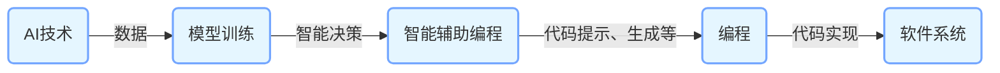

# AI技术对编程的影响与应对策略

> 关键词：AI技术、编程、影响、应对策略、代码生成、智能辅助、未来趋势

> 摘要：本文深入探讨了AI技术对编程领域的多方面影响，从代码生成、编程效率提升到编程思维的转变等角度进行了详细分析。同时，针对这些影响提出了一系列切实可行的应对策略，以帮助程序员更好地适应AI时代的编程发展。通过实际案例、算法原理、数学模型等多维度的阐述，旨在为读者全面呈现AI技术与编程之间的关系以及未来的发展方向，使读者能够清晰地认识到当前的机遇与挑战，并掌握有效的应对方法。

## 1. 背景介绍 
### 1.1 目的和范围
随着AI技术的飞速发展，其在各个领域都产生了深远的影响，编程领域也不例外。本文章的目的在于深入剖析AI技术对编程的具体影响，包括积极和消极方面，并基于此提出相应的应对策略。范围涵盖了从基础的编程流程到高级的软件架构设计，以及程序员个人的职业发展等多个层面。

### 1.2 预期读者
本文预期读者主要包括程序员、软件工程师、软件架构师、CTO等编程相关从业者，以及对AI技术和编程领域发展趋势感兴趣的研究人员和学生。

### 1.3 文档结构概述
本文首先介绍背景信息，让读者对研究的目的和范围有清晰的认识。接着阐述AI技术与编程相关的核心概念及其联系，通过示意图和流程图直观呈现。然后深入讲解核心算法原理和具体操作步骤，结合Python源代码进行详细阐述。再介绍相关的数学模型和公式，并举例说明。之后通过项目实战展示代码实际案例并进行详细解释。随后探讨AI技术在编程中的实际应用场景。推荐相关的工具和资源，包括学习资源、开发工具框架和论文著作等。最后总结未来发展趋势与挑战，列出常见问题与解答，并提供扩展阅读和参考资料。

### 1.4 术语表
#### 1.4.1 核心术语定义
- **AI技术**：即人工智能技术，是研究、开发用于模拟、延伸和扩展人的智能的理论、方法、技术及应用系统的一门新的技术科学。
- **编程**：是让计算机代为解决某个问题，对某个计算体系规定一定的运算方式，使计算体系按照该计算方式运行，并最终得到相应结果的过程。
- **代码生成**：指利用AI技术自动生成符合特定需求的代码片段或完整程序。
- **智能辅助编程**：通过AI算法为程序员在编程过程中提供智能提示、错误检测、代码优化等辅助功能。

#### 1.4.2 相关概念解释
- **机器学习**：是AI技术的一个重要分支，它是一门多领域交叉学科，涉及概率论、统计学、逼近论、凸分析、算法复杂度理论等多门学科。它专门研究计算机怎样模拟或实现人类的学习行为，以获取新的知识或技能，重新组织已有的知识结构使之不断改善自身的性能。
- **深度学习**：是机器学习的一个子集，它是一种基于对数据进行表征学习的方法。深度学习通过构建具有很多层的神经网络模型，自动从大量数据中学习到复杂的模式和特征。

#### 1.4.3 缩略词列表
- **AI**：Artificial Intelligence（人工智能）
- **ML**：Machine Learning（机器学习）
- **DL**：Deep Learning（深度学习）

## 2. 核心概念与联系 

### 核心概念原理
#### AI技术原理
AI技术的核心是通过对大量数据的学习和分析，构建模型来模拟人类的智能行为。其中，机器学习和深度学习是实现AI的重要手段。机器学习通过各种算法对数据进行训练，使模型能够从数据中学习到规律和模式，从而对新的数据进行预测和分类。深度学习则通过构建深度神经网络，自动提取数据中的特征，在图像识别、自然语言处理等领域取得了显著的成果。

#### 编程原理
编程是将人类的思维逻辑转化为计算机能够理解和执行的指令的过程。程序员使用各种编程语言，按照一定的语法规则编写代码，实现特定的功能。编程语言提供了数据类型、控制结构、函数等基本元素，程序员通过组合这些元素来构建复杂的程序。

### 架构的文本示意图
```plaintext
AI技术 <---- 数据 ----> 模型训练 ----> 智能决策
                          |
                          v
编程 <---- 代码实现 ----> 软件系统
```

### Mermaid流程图


## 3. 核心算法原理 & 具体操作步骤 

### 代码生成算法原理
代码生成是AI技术在编程领域的一个重要应用，其中基于Transformer架构的语言模型是常用的代码生成算法。Transformer架构通过自注意力机制能够捕捉输入序列中不同位置之间的依赖关系，从而生成高质量的代码。

以下是一个简单的基于Python的代码生成示例，使用Hugging Face的transformers库：

```python
from transformers import AutoTokenizer, AutoModelForCausalLM

# 加载预训练的代码生成模型
tokenizer = AutoTokenizer.from_pretrained("Salesforce/codegen-350M-mono")
model = AutoModelForCausalLM.from_pretrained("Salesforce/codegen-350M-mono")

# 定义输入的提示文本
prompt = "def add_numbers(a, b):"

# 将提示文本转换为模型输入的张量
input_ids = tokenizer(prompt, return_tensors="pt").input_ids

# 生成代码
generated_ids = model.generate(input_ids, max_length=100, num_beams=5, no_repeat_ngram_size=2, early_stopping=True)

# 将生成的张量转换为文本
generated_code = tokenizer.decode(generated_ids[0], skip_special_tokens=True)

print(generated_code)
```

### 具体操作步骤
1. **安装必要的库**：使用`pip install transformers`安装Hugging Face的transformers库。
2. **加载预训练模型**：选择合适的代码生成模型，如上述示例中的`Salesforce/codegen-350M-mono`，并使用`AutoTokenizer`和`AutoModelForCausalLM`加载模型和分词器。
3. **定义输入提示**：根据需要生成的代码功能，编写相应的提示文本。
4. **输入处理**：将提示文本转换为模型能够处理的张量格式。
5. **代码生成**：使用模型的`generate`方法生成代码，可通过调整参数如`max_length`、`num_beams`等来控制生成的代码长度和质量。
6. **结果解码**：将生成的张量转换为文本格式并输出。

## 4. 数学模型和公式 & 详细讲解 & 举例说明 

### 自注意力机制数学模型
自注意力机制是Transformer架构的核心，其数学模型可以用以下公式表示：

$$
\text{Attention}(Q, K, V) = \text{softmax}(\frac{QK^T}{\sqrt{d_k}})V
$$

其中：
- $Q$ 是查询矩阵，形状为 $(n, d_k)$，$n$ 是序列长度，$d_k$ 是查询向量的维度。
- $K$ 是键矩阵，形状为 $(n, d_k)$。
- $V$ 是值矩阵，形状为 $(n, d_v)$，$d_v$ 是值向量的维度。
- $\frac{QK^T}{\sqrt{d_k}}$ 是计算查询和键之间的相似度得分，除以 $\sqrt{d_k}$ 是为了防止点积结果过大。
- $\text{softmax}$ 函数将相似度得分转换为概率分布，用于对值矩阵进行加权求和。

### 详细讲解
自注意力机制的核心思想是通过计算输入序列中不同位置之间的相似度，为每个位置分配不同的权重，从而更好地捕捉序列中的依赖关系。具体步骤如下：
1. **生成查询、键和值矩阵**：将输入序列通过线性变换得到查询、键和值矩阵。
2. **计算相似度得分**：计算查询矩阵和键矩阵的点积，得到相似度得分矩阵。
3. **缩放和归一化**：将相似度得分矩阵除以 $\sqrt{d_k}$ 并通过 $\text{softmax}$ 函数进行归一化，得到权重矩阵。
4. **加权求和**：将权重矩阵与值矩阵相乘，得到最终的输出。

### 举例说明
假设输入序列为 $[x_1, x_2, x_3]$，每个 $x_i$ 的维度为 $d$。通过线性变换得到查询矩阵 $Q = [q_1, q_2, q_3]$，键矩阵 $K = [k_1, k_2, k_3]$，值矩阵 $V = [v_1, v_2, v_3]$。计算相似度得分矩阵 $S$：

$$
S = \begin{bmatrix}
q_1^Tk_1 & q_1^Tk_2 & q_1^Tk_3 \\
q_2^Tk_1 & q_2^Tk_2 & q_2^Tk_3 \\
q_3^Tk_1 & q_3^Tk_2 & q_3^Tk_3
\end{bmatrix}
$$

然后进行缩放和归一化，得到权重矩阵 $W$。最后将 $W$ 与 $V$ 相乘，得到输出：

$$
\text{Output} = WV
$$

## 5. 项目实战：代码实际案例和详细解释说明 

### 5.1  开发环境搭建
1. **安装Python**：从Python官方网站（https://www.python.org/downloads/）下载并安装Python 3.x版本。
2. **创建虚拟环境**：使用`venv`模块创建虚拟环境，以隔离项目的依赖。
```bash
python -m venv myenv
```
3. **激活虚拟环境**：
- 在Windows上：
```bash
myenv\Scripts\activate
```
- 在Linux/Mac上：
```bash
source myenv/bin/activate
```
4. **安装必要的库**：使用`pip`安装项目所需的库，如`transformers`、`torch`等。
```bash
pip install transformers torch
```

### 5.2  源代码详细实现和代码解读
以下是一个使用AI技术进行智能代码补全的项目示例：

```python
import torch
from transformers import AutoTokenizer, AutoModelWithLMHead

# 加载预训练的语言模型和分词器
tokenizer = AutoTokenizer.from_pretrained("gpt2")
model = AutoModelWithLMHead.from_pretrained("gpt2")

def code_completion(prompt, max_length=50):
    # 将提示文本转换为模型输入的张量
    input_ids = tokenizer.encode(prompt, return_tensors="pt")
    
    # 生成代码
    output = model.generate(input_ids, max_length=max_length, num_beams=5, no_repeat_ngram_size=2, early_stopping=True)
    
    # 将生成的张量转换为文本
    generated_text = tokenizer.decode(output[0], skip_special_tokens=True)
    
    return generated_text

# 定义输入的提示文本
prompt = "def calculate_area(radius):"

# 进行代码补全
completed_code = code_completion(prompt)

print(completed_code)
```

### 代码解读与分析
1. **导入必要的库**：导入`torch`和`transformers`库中的`AutoTokenizer`和`AutoModelWithLMHead`。
2. **加载预训练模型和分词器**：使用`AutoTokenizer`和`AutoModelWithLMHead`加载预训练的GPT-2模型和对应的分词器。
3. **定义代码补全函数**：`code_completion`函数接受提示文本和最大生成长度作为参数。在函数内部，将提示文本编码为张量，使用模型的`generate`方法生成代码，最后将生成的张量解码为文本。
4. **调用代码补全函数**：定义输入的提示文本，调用`code_completion`函数进行代码补全，并输出结果。

## 6. 实际应用场景 
### 代码生成
AI技术可以根据用户的需求自动生成代码，大大提高了编程效率。例如，在开发Web应用时，AI可以根据用户输入的需求描述生成HTML、CSS和JavaScript代码。

### 智能辅助编程
在编程过程中，AI可以为程序员提供智能提示、错误检测和代码优化建议。例如，当程序员编写代码时，AI可以根据上下文自动补全代码，提示可能的函数和变量名，检查代码中的语法错误和潜在的逻辑错误，并提供优化建议。

### 软件测试
AI技术可以用于自动化软件测试，通过生成测试用例、执行测试和分析测试结果，提高软件测试的效率和准确性。例如，使用AI技术可以自动生成边界值测试用例，发现软件中的潜在漏洞。

### 代码重构
AI可以分析现有代码的结构和性能，提出代码重构的建议，帮助程序员优化代码。例如，AI可以识别代码中的重复部分，建议使用函数或类进行封装，提高代码的可维护性和复用性。

## 7. 工具和资源推荐
### 7.1 学习资源推荐
#### 7.1.1 书籍推荐
- 《人工智能：一种现代的方法》：全面介绍了人工智能的基本概念、算法和应用，是人工智能领域的经典教材。
- 《Python深度学习》：详细介绍了使用Python进行深度学习的方法和技巧，适合初学者入门。
- 《代码大全》：是一本关于软件开发实践的经典书籍，涵盖了代码设计、编写、测试等方面的内容。

#### 7.1.2 在线课程
- Coursera上的“机器学习”课程：由斯坦福大学的Andrew Ng教授授课，是机器学习领域的经典课程。
- edX上的“人工智能基础”课程：介绍了人工智能的基本概念和算法，适合初学者学习。
- Udemy上的“Python编程从入门到精通”课程：全面介绍了Python编程的基础知识和应用。

#### 7.1.3 技术博客和网站
- Medium：有许多关于AI和编程的技术博客，提供了最新的技术文章和实践经验。
- Stack Overflow：是一个程序员社区，提供了大量的编程问题和解决方案。
- GitHub：是一个开源代码托管平台，可以学习到许多优秀的开源项目和代码。

### 7.2 开发工具框架推荐
#### 7.2.1 IDE和编辑器
- PyCharm：是一款专门为Python开发设计的集成开发环境，提供了丰富的代码编辑、调试和版本控制功能。
- Visual Studio Code：是一款轻量级的代码编辑器，支持多种编程语言，拥有丰富的插件生态系统。
- IntelliJ IDEA：是一款功能强大的Java集成开发环境，也支持其他编程语言。

#### 7.2.2 调试和性能分析工具
- PDB：是Python自带的调试工具，可以帮助程序员定位代码中的错误。
- cProfile：是Python的性能分析工具，可以分析代码的运行时间和内存使用情况。
- VisualVM：是一个可视化的Java性能分析工具，可以实时监控Java应用的性能。

#### 7.2.3 相关框架和库
- TensorFlow：是一个开源的机器学习框架，提供了丰富的工具和库，用于构建和训练深度学习模型。
- PyTorch：是另一个流行的深度学习框架，具有动态计算图的特点，易于使用和调试。
- scikit-learn：是一个用于机器学习的Python库，提供了各种机器学习算法和工具。

### 7.3 相关论文著作推荐
#### 7.3.1 经典论文
- “Attention Is All You Need”：介绍了Transformer架构，是自然语言处理领域的经典论文。
- “ImageNet Classification with Deep Convolutional Neural Networks”：介绍了AlexNet卷积神经网络，开创了深度学习在图像识别领域的先河。
- “Gradient-Based Learning Applied to Document Recognition”：介绍了LeNet卷积神经网络，是早期的卷积神经网络之一。

#### 7.3.2 最新研究成果
- 关注顶级学术会议如NeurIPS、ICML、CVPR等的最新研究成果，了解AI技术的最新发展动态。
- 阅读相关学术期刊如Journal of Artificial Intelligence Research、Artificial Intelligence等的最新论文。

#### 7.3.3 应用案例分析
- 研究一些知名公司如Google、Microsoft、Facebook等在AI和编程领域的应用案例，学习他们的实践经验和技术方案。

## 8. 总结：未来发展趋势与挑战
### 未来发展趋势
- **更智能的代码生成**：AI技术将不断提高代码生成的质量和效率，能够生成更加复杂和高质量的代码，甚至可以根据自然语言描述直接生成完整的软件系统。
- **个性化的智能辅助编程**：根据程序员的编程习惯和偏好，提供个性化的智能辅助功能，如个性化的代码提示、优化建议等。
- **AI与编程的深度融合**：AI技术将渗透到编程的各个环节，从需求分析、设计到测试和维护，实现全流程的智能化。
- **跨领域应用**：AI技术将与其他领域如物联网、大数据、区块链等深度融合，创造出更多的创新应用。

### 挑战
- **技术层面**：目前AI技术在代码生成和智能辅助编程方面还存在一些问题，如生成的代码质量不稳定、对复杂业务逻辑的理解能力有限等。需要进一步研究和改进AI算法，提高其性能和准确性。
- **安全和隐私问题**：AI技术在处理代码和数据时，可能会面临安全和隐私风险。例如，生成的代码可能存在安全漏洞，数据泄露可能导致知识产权的损失。需要加强安全和隐私保护措施。
- **人才培养**：AI技术的快速发展对程序员的技能要求提出了更高的挑战，需要培养既懂编程又懂AI的复合型人才。目前相关人才短缺，需要加强教育和培训。
- **社会影响**：AI技术的广泛应用可能会导致一些程序员岗位的减少，引发社会就业问题。需要制定相应的政策和措施，促进就业结构的调整和转型。

## 9. 附录：常见问题与解答
### 1. AI生成的代码可以直接用于生产环境吗？
一般情况下，AI生成的代码不能直接用于生产环境。虽然AI技术在代码生成方面取得了很大的进展，但生成的代码可能存在质量问题，如逻辑错误、安全漏洞等。需要程序员对生成的代码进行仔细的审查和测试，确保其符合生产环境的要求。

### 2. AI技术会取代程序员吗？
AI技术不会完全取代程序员。虽然AI可以自动生成代码和提供智能辅助，但编程不仅仅是代码的编写，还涉及到需求分析、系统设计、架构规划等多个方面，这些都需要程序员的专业知识和经验。AI技术更多的是作为程序员的辅助工具，提高编程效率和质量。

### 3. 如何学习AI技术在编程中的应用？
可以通过阅读相关的书籍和论文、参加在线课程、实践项目等方式学习AI技术在编程中的应用。同时，关注行业的最新发展动态，学习优秀的开源项目和案例，不断积累经验。

### 4. AI技术在编程中的应用存在哪些风险？
AI技术在编程中的应用存在安全风险、隐私风险和质量风险等。例如，生成的代码可能存在安全漏洞，数据泄露可能导致知识产权的损失，生成的代码质量可能不稳定等。需要采取相应的措施进行风险防范。

## 10. 扩展阅读 & 参考资料
### 扩展阅读
- 《AI未来进行式》：探讨了AI技术对未来社会的影响和发展趋势。
- 《智能时代》：介绍了AI技术在各个领域的应用和发展前景。
- 《人类简史：从动物到上帝》：从人类发展的角度探讨了技术对人类社会的影响。

### 参考资料
- Hugging Face官方文档：https://huggingface.co/docs/transformers/index
- TensorFlow官方文档：https://www.tensorflow.org/
- PyTorch官方文档：https://pytorch.org/
- scikit-learn官方文档：https://scikit-learn.org/stable/