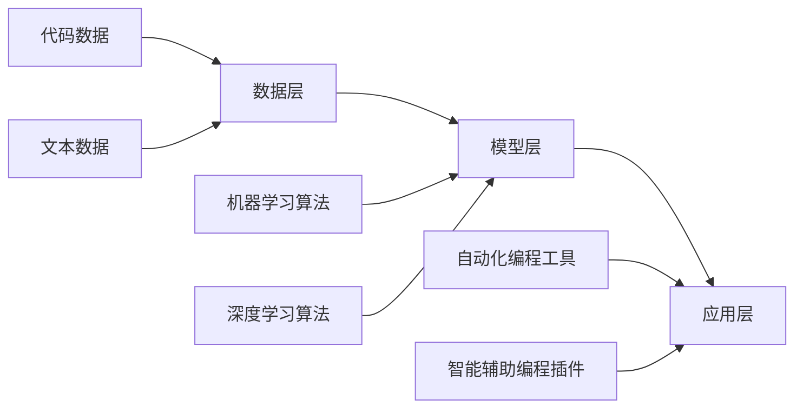

# AI技术的应用：编程的未来趋势

> 关键词：AI技术、编程、未来趋势、自动化编程、智能辅助编程

> 摘要：本文深入探讨了AI技术在编程领域的应用以及其代表的未来趋势。从AI技术在编程中的核心概念和联系出发，详细阐述了相关的算法原理、数学模型。通过项目实战案例展示了AI在编程中的具体实现和应用。分析了AI在编程中的实际应用场景，推荐了学习相关技术的工具和资源。最后总结了AI技术在编程领域的未来发展趋势与挑战，并对常见问题进行解答，为读者全面了解AI技术在编程领域的发展提供了有价值的参考。

## 1. 背景介绍 
### 1.1 目的和范围
本文章的目的在于全面且深入地探讨AI技术在编程领域的应用以及未来的发展趋势。范围涵盖了AI技术在编程中的核心概念、算法原理、数学模型、实际应用场景等多个方面，旨在为读者提供一个系统的关于AI技术与编程结合的知识体系，帮助读者理解AI技术如何改变编程的方式和未来的发展方向。

### 1.2 预期读者
本文预期读者包括程序员、软件开发者、软件架构师、CTO等IT领域的专业人士，也适合对AI技术和编程感兴趣的学生、研究人员以及想要了解行业发展趋势的相关人员。

### 1.3 文档结构概述
本文首先介绍背景信息，包括目的、预期读者和文档结构概述等。接着阐述AI技术在编程中的核心概念与联系，通过文本示意图和Mermaid流程图进行直观展示。然后详细讲解核心算法原理和具体操作步骤，并结合Python源代码进行说明。之后介绍数学模型和公式，通过具体例子加深理解。通过项目实战展示代码实际案例并进行详细解释。分析实际应用场景，推荐相关的工具和资源。最后总结未来发展趋势与挑战，解答常见问题，并提供扩展阅读和参考资料。

### 1.4 术语表
#### 1.4.1 核心术语定义
- **AI技术（Artificial Intelligence Technology）**：人工智能技术，是一门研究如何使计算机能够模拟人类智能的技术，包括机器学习、深度学习、自然语言处理等多个领域。
- **编程（Programming）**：编写计算机程序的过程，通过特定的编程语言来实现特定的功能和任务。
- **自动化编程（Automated Programming）**：利用AI技术自动生成代码的过程，减少人工编写代码的工作量。
- **智能辅助编程（Intelligent Assisted Programming）**：AI技术为程序员提供辅助，如代码提示、错误检查、代码优化等功能。

#### 1.4.2 相关概念解释
- **机器学习（Machine Learning）**：AI技术的一个重要分支，通过让计算机从数据中学习模式和规律，从而实现预测和决策等功能。
- **深度学习（Deep Learning）**：一种基于神经网络的机器学习方法，通过多层神经网络来学习数据的特征和表示。
- **自然语言处理（Natural Language Processing）**：研究如何使计算机能够理解和处理人类语言的技术，包括文本分类、情感分析、机器翻译等任务。

#### 1.4.3 缩略词列表
- **AI**：Artificial Intelligence（人工智能）
- **ML**：Machine Learning（机器学习）
- **DL**：Deep Learning（深度学习）
- **NLP**：Natural Language Processing（自然语言处理）

## 2. 核心概念与联系 
### 核心概念原理
AI技术在编程领域的应用主要基于机器学习、深度学习和自然语言处理等核心技术。机器学习通过对大量代码数据的学习，让计算机能够自动发现代码中的模式和规律，从而实现代码的自动生成和优化。深度学习则通过构建深层神经网络，学习代码的语义和结构信息，提高代码生成的质量和准确性。自然语言处理技术则使得程序员能够用自然语言描述需求，计算机将其转化为代码。

### 架构的文本示意图
AI技术在编程中的应用架构主要包括数据层、模型层和应用层。数据层负责收集和整理大量的代码数据和相关的文本数据，为模型训练提供基础。模型层利用机器学习和深度学习算法对数据进行训练，构建代码生成模型、代码优化模型等。应用层则将训练好的模型应用到实际的编程场景中，如自动化编程工具、智能辅助编程插件等。

### Mermaid流程图


## 3. 核心算法原理 & 具体操作步骤 
### 算法原理讲解
在AI技术应用于编程中，一个常见的算法是基于深度学习的序列到序列（Sequence-to-Sequence）模型，用于代码生成。下面我们使用Python和PyTorch库来详细阐述其原理和实现。

序列到序列模型主要由编码器（Encoder）和解码器（Decoder）两部分组成。编码器将输入的序列（如自然语言描述或代码片段）编码为一个固定长度的向量表示，解码器则根据这个向量表示生成目标序列（如代码）。

```python
import torch
import torch.nn as nn

# 定义编码器
class Encoder(nn.Module):
    def __init__(self, input_size, hidden_size):
        super(Encoder, self).__init__()
        self.hidden_size = hidden_size
        self.embedding = nn.Embedding(input_size, hidden_size)
        self.gru = nn.GRU(hidden_size, hidden_size)

    def forward(self, input, hidden):
        embedded = self.embedding(input).view(1, 1, -1)
        output = embedded
        output, hidden = self.gru(output, hidden)
        return output, hidden

    def initHidden(self):
        return torch.zeros(1, 1, self.hidden_size)

# 定义解码器
class Decoder(nn.Module):
    def __init__(self, hidden_size, output_size):
        super(Decoder, self).__init__()
        self.hidden_size = hidden_size
        self.embedding = nn.Embedding(output_size, hidden_size)
        self.gru = nn.GRU(hidden_size, hidden_size)
        self.out = nn.Linear(hidden_size, output_size)
        self.softmax = nn.LogSoftmax(dim=1)

    def forward(self, input, hidden):
        output = self.embedding(input).view(1, 1, -1)
        output = nn.functional.relu(output)
        output, hidden = self.gru(output, hidden)
        output = self.softmax(self.out(output[0]))
        return output, hidden

    def initHidden(self):
        return torch.zeros(1, 1, self.hidden_size)
```

### 具体操作步骤
1. **数据准备**：收集大量的代码数据和对应的自然语言描述数据，将其进行清洗和预处理，如分词、编码等。
2. **模型训练**：初始化编码器和解码器模型，定义损失函数和优化器，然后使用训练数据对模型进行训练。
```python
# 初始化模型
encoder = Encoder(input_size, hidden_size)
decoder = Decoder(hidden_size, output_size)

# 定义损失函数和优化器
criterion = nn.NLLLoss()
encoder_optimizer = torch.optim.SGD(encoder.parameters(), lr=learning_rate)
decoder_optimizer = torch.optim.SGD(decoder.parameters(), lr=learning_rate)

# 训练循环
for iter in range(n_iters):
    # 选择一个训练样本
    input_tensor, target_tensor = random_training_pair()

    # 初始化隐藏状态
    encoder_hidden = encoder.initHidden()

    encoder_optimizer.zero_grad()
    decoder_optimizer.zero_grad()

    input_length = input_tensor.size(0)
    target_length = target_tensor.size(0)

    encoder_outputs = torch.zeros(max_length, encoder.hidden_size)

    loss = 0

    # 编码器前向传播
    for ei in range(input_length):
        encoder_output, encoder_hidden = encoder(
            input_tensor[ei], encoder_hidden)
        encoder_outputs[ei] = encoder_output[0, 0]

    decoder_input = torch.tensor([[SOS_token]])

    decoder_hidden = encoder_hidden

    # 解码器前向传播
    for di in range(target_length):
        decoder_output, decoder_hidden = decoder(
            decoder_input, decoder_hidden)
        topv, topi = decoder_output.topk(1)
        decoder_input = topi.squeeze().detach()  # detach from history as input

        loss += criterion(decoder_output, target_tensor[di])
        if decoder_input.item() == EOS_token:
            break

    # 反向传播和优化
    loss.backward()

    encoder_optimizer.step()
    decoder_optimizer.step()
```
3. **模型评估**：使用测试数据对训练好的模型进行评估，计算模型的准确率、召回率等指标。
4. **模型应用**：将训练好的模型集成到编程工具中，实现代码生成等功能。

## 4. 数学模型和公式 & 详细讲解 & 举例说明 
### 数学模型
在序列到序列模型中，主要涉及到的数学模型是循环神经网络（RNN）及其变体，如门控循环单元（GRU）。

### 公式
GRU的更新公式如下：

重置门 $r_t$：
$$r_t = \sigma(W_r[x_t, h_{t-1}] + b_r)$$

更新门 $z_t$：
$$z_t = \sigma(W_z[x_t, h_{t-1}] + b_z)$$

候选隐藏状态 $\tilde{h}_t$：
$$\tilde{h}_t = \tanh(W_{\tilde{h}}[r_t \odot h_{t-1}, x_t] + b_{\tilde{h}})$$

隐藏状态 $h_t$：
$$h_t = (1 - z_t) \odot h_{t-1} + z_t \odot \tilde{h}_t$$

其中，$x_t$ 是当前时刻的输入，$h_{t-1}$ 是上一时刻的隐藏状态，$W$ 和 $b$ 是可学习的参数，$\sigma$ 是 sigmoid 函数，$\odot$ 表示逐元素相乘。

### 详细讲解
重置门 $r_t$ 控制上一时刻的隐藏状态 $h_{t-1}$ 有多少信息被重置。更新门 $z_t$ 控制上一时刻的隐藏状态 $h_{t-1}$ 有多少信息被保留，以及候选隐藏状态 $\tilde{h}_t$ 有多少信息被更新到当前时刻的隐藏状态 $h_t$ 中。

### 举例说明
假设我们有一个简单的输入序列 $x = [x_1, x_2, x_3]$，初始隐藏状态 $h_0 = [0, 0, 0]$。在第一个时间步 $t = 1$，我们计算重置门 $r_1$、更新门 $z_1$ 和候选隐藏状态 $\tilde{h}_1$，然后根据更新门 $z_1$ 计算当前时刻的隐藏状态 $h_1$。接着在 $t = 2$ 时，使用 $h_1$ 作为上一时刻的隐藏状态，重复上述计算过程，直到处理完整个输入序列。

## 5. 项目实战：代码实际案例和详细解释说明 
### 5.1  开发环境搭建
- **操作系统**：推荐使用Ubuntu 18.04或以上版本的Linux系统，或者Windows 10及以上版本。
- **Python版本**：Python 3.7及以上版本。
- **深度学习框架**：PyTorch 1.7及以上版本。
- **开发工具**：推荐使用PyCharm或VS Code作为集成开发环境。

### 5.2  源代码详细实现和代码解读
以下是一个简单的基于序列到序列模型的代码生成示例：

```python
import torch
import torch.nn as nn
import random

# 定义一些常量
SOS_token = 0
EOS_token = 1
MAX_LENGTH = 10

# 定义编码器
class Encoder(nn.Module):
    def __init__(self, input_size, hidden_size):
        super(Encoder, self).__init__()
        self.hidden_size = hidden_size
        self.embedding = nn.Embedding(input_size, hidden_size)
        self.gru = nn.GRU(hidden_size, hidden_size)

    def forward(self, input, hidden):
        embedded = self.embedding(input).view(1, 1, -1)
        output = embedded
        output, hidden = self.gru(output, hidden)
        return output, hidden

    def initHidden(self):
        return torch.zeros(1, 1, self.hidden_size)

# 定义解码器
class Decoder(nn.Module):
    def __init__(self, hidden_size, output_size):
        super(Decoder, self).__init__()
        self.hidden_size = hidden_size
        self.embedding = nn.Embedding(output_size, hidden_size)
        self.gru = nn.GRU(hidden_size, hidden_size)
        self.out = nn.Linear(hidden_size, output_size)
        self.softmax = nn.LogSoftmax(dim=1)

    def forward(self, input, hidden):
        output = self.embedding(input).view(1, 1, -1)
        output = nn.functional.relu(output)
        output, hidden = self.gru(output, hidden)
        output = self.softmax(self.out(output[0]))
        return output, hidden

    def initHidden(self):
        return torch.zeros(1, 1, self.hidden_size)

# 生成随机训练样本
def random_training_pair():
    input_tensor = torch.tensor([random.randint(2, 9) for _ in range(random.randint(1, MAX_LENGTH))])
    target_tensor = torch.tensor([random.randint(2, 9) for _ in range(random.randint(1, MAX_LENGTH))])
    return input_tensor, target_tensor

# 训练模型
def train(input_tensor, target_tensor, encoder, decoder, encoder_optimizer, decoder_optimizer, criterion):
    encoder_hidden = encoder.initHidden()

    encoder_optimizer.zero_grad()
    decoder_optimizer.zero_grad()

    input_length = input_tensor.size(0)
    target_length = target_tensor.size(0)

    encoder_outputs = torch.zeros(MAX_LENGTH, encoder.hidden_size)

    loss = 0

    # 编码器前向传播
    for ei in range(input_length):
        encoder_output, encoder_hidden = encoder(
            input_tensor[ei], encoder_hidden)
        encoder_outputs[ei] = encoder_output[0, 0]

    decoder_input = torch.tensor([[SOS_token]])

    decoder_hidden = encoder_hidden

    # 解码器前向传播
    for di in range(target_length):
        decoder_output, decoder_hidden = decoder(
            decoder_input, decoder_hidden)
        topv, topi = decoder_output.topk(1)
        decoder_input = topi.squeeze().detach()  # detach from history as input

        loss += criterion(decoder_output, target_tensor[di])
        if decoder_input.item() == EOS_token:
            break

    # 反向传播和优化
    loss.backward()

    encoder_optimizer.step()
    decoder_optimizer.step()

    return loss.item() / target_length

# 主训练循环
def trainIters(encoder, decoder, n_iters, print_every=1000, learning_rate=0.01):
    plot_losses = []
    print_loss_total = 0  # Reset every print_every
    plot_loss_total = 0  # Reset every plot_every

    encoder_optimizer = torch.optim.SGD(encoder.parameters(), lr=learning_rate)
    decoder_optimizer = torch.optim.SGD(decoder.parameters(), lr=learning_rate)
    criterion = nn.NLLLoss()

    for iter in range(1, n_iters + 1):
        input_tensor, target_tensor = random_training_pair()
        loss = train(input_tensor, target_tensor, encoder, decoder, encoder_optimizer, decoder_optimizer, criterion)
        print_loss_total += loss
        plot_loss_total += loss

        if iter % print_every == 0:
            print_loss_avg = print_loss_total / print_every
            print_loss_total = 0
            print('(%d %d%%) %.4f' % (iter, iter / n_iters * 100, print_loss_avg))

# 初始化模型并训练
input_size = 10
hidden_size = 256
output_size = 10

encoder = Encoder(input_size, hidden_size)
decoder = Decoder(hidden_size, output_size)

trainIters(encoder, decoder, 75000, print_every=5000)
```

### 5.3  代码解读与分析
- **编码器（Encoder）**：将输入的序列编码为一个固定长度的向量表示。通过嵌入层将输入的单词索引转换为向量，然后使用GRU进行序列处理。
- **解码器（Decoder）**：根据编码器输出的向量表示生成目标序列。同样使用嵌入层和GRU，最后通过线性层和softmax函数输出每个单词的概率。
- **训练过程**：通过随机生成训练样本，使用编码器和解码器进行前向传播，计算损失函数，然后进行反向传播和优化。

## 6. 实际应用场景 
### 自动化编程
AI技术可以根据自然语言描述自动生成代码，大大提高编程效率。例如，开发人员只需要描述想要实现的功能，AI工具就可以自动生成对应的代码。

### 智能辅助编程
AI可以为程序员提供代码提示、错误检查、代码优化等功能。当程序员编写代码时，AI工具可以根据上下文自动提示可能的代码片段，检查代码中的语法错误和逻辑错误，并提供优化建议。

### 代码审查
AI技术可以自动审查代码，发现潜在的安全漏洞、性能问题等。通过对代码的静态分析和机器学习模型的训练，AI可以快速准确地识别代码中的问题。

### 代码迁移
在不同的编程语言和框架之间进行代码迁移时，AI可以帮助自动转换代码。通过学习不同语言和框架的语法和语义，AI可以将一种语言的代码转换为另一种语言的代码。

## 7. 工具和资源推荐
### 7.1 学习资源推荐
#### 7.1.1 书籍推荐
- 《深度学习》（Deep Learning）：由Ian Goodfellow、Yoshua Bengio和Aaron Courville所著，是深度学习领域的经典教材。
- 《Python深度学习》（Deep Learning with Python）：由Francois Chollet所著，介绍了如何使用Python和Keras进行深度学习开发。
- 《人工智能：一种现代的方法》（Artificial Intelligence: A Modern Approach）：由Stuart Russell和Peter Norvig所著，是人工智能领域的权威教材。

#### 7.1.2 在线课程
- Coursera上的“深度学习专项课程”（Deep Learning Specialization）：由Andrew Ng教授授课，系统地介绍了深度学习的理论和实践。
- edX上的“人工智能基础”（Fundamentals of Artificial Intelligence）：提供了人工智能的基础知识和算法。
- Udemy上的“Python编程从入门到实践”（Python Programming from Beginner to Advanced）：适合初学者学习Python编程。

#### 7.1.3 技术博客和网站
- Medium：有很多AI和编程领域的优秀博客文章。
- Towards Data Science：专注于数据科学和AI领域的技术分享。
- Stack Overflow：程序员交流和解决问题的社区，有很多关于AI和编程的问题和解答。

### 7.2 开发工具框架推荐
#### 7.2.1 IDE和编辑器
- PyCharm：功能强大的Python集成开发环境，提供了代码编辑、调试、版本控制等功能。
- VS Code：轻量级的代码编辑器，支持多种编程语言和插件扩展。
- Jupyter Notebook：交互式的开发环境，适合进行数据分析和模型训练。

#### 7.2.2 调试和性能分析工具
- Py-Spy：用于分析Python代码的性能瓶颈。
- TensorBoard：用于可视化深度学习模型的训练过程和性能指标。
- PDB：Python内置的调试器，用于调试Python代码。

#### 7.2.3 相关框架和库
- PyTorch：开源的深度学习框架，提供了丰富的神经网络层和优化算法。
- TensorFlow：Google开发的深度学习框架，广泛应用于工业界和学术界。
- Scikit-learn：用于机器学习的Python库，提供了多种机器学习算法和工具。

### 7.3 相关论文著作推荐
#### 7.3.1 经典论文
- “Attention Is All You Need”：提出了Transformer架构，在自然语言处理领域取得了巨大成功。
- “Generative Adversarial Networks”：介绍了生成对抗网络（GAN）的原理和应用。
- “ImageNet Classification with Deep Convolutional Neural Networks”：介绍了AlexNet卷积神经网络，推动了深度学习在计算机视觉领域的发展。

#### 7.3.2 最新研究成果
- 关注顶级学术会议如NeurIPS、ICML、CVPR等的最新论文，了解AI技术在编程领域的最新研究进展。
- 关注知名学术期刊如Journal of Artificial Intelligence Research（JAIR）、Artificial Intelligence等的最新文章。

#### 7.3.3 应用案例分析
- 分析一些开源的AI编程项目，如OpenAI的Codex，了解其实现原理和应用场景。
- 研究一些企业在AI编程方面的实践案例，如Google、Microsoft等公司的相关项目。

## 8. 总结：未来发展趋势与挑战
### 未来发展趋势
- **更强大的自动化编程能力**：AI技术将不断进步，能够处理更复杂的编程任务，生成更高质量的代码。
- **智能编程助手的普及**：智能编程助手将成为程序员的标配，提供实时的帮助和支持。
- **跨领域融合**：AI技术将与其他领域如物联网、区块链等深度融合，创造出更多的创新应用。
- **个性化编程体验**：根据程序员的习惯和偏好，提供个性化的编程建议和服务。

### 挑战
- **数据隐私和安全问题**：AI编程需要大量的代码数据，如何保护这些数据的隐私和安全是一个重要挑战。
- **模型可解释性**：深度学习模型往往是黑盒模型，难以解释其决策过程，这在一些关键领域如金融、医疗等应用时会受到限制。
- **伦理和法律问题**：AI生成的代码可能存在版权、责任等伦理和法律问题，需要建立相应的规范和制度。
- **技术人才短缺**：AI编程需要既懂AI技术又懂编程的复合型人才，目前这类人才相对短缺。

## 9. 附录：常见问题与解答
### 问题1：AI技术在编程中能完全替代程序员吗？
答：目前还不能。虽然AI技术可以自动生成代码和提供辅助，但编程不仅仅是代码的编写，还包括需求分析、系统设计、架构规划等多个环节，这些需要程序员的专业知识和经验。AI技术可以提高编程效率，但不能完全替代程序员。

### 问题2：AI生成的代码质量如何保证？
答：可以通过以下几种方式保证AI生成的代码质量：一是使用大量高质量的代码数据进行模型训练，提高模型的学习能力；二是对生成的代码进行人工审查和测试，发现和修正其中的问题；三是不断优化和改进AI模型，提高其生成代码的准确性和可靠性。

### 问题3：学习AI编程需要具备哪些基础知识？
答：需要具备一定的编程基础，如Python编程；了解机器学习和深度学习的基本概念和算法；掌握线性代数、概率论等数学知识。

## 10. 扩展阅读 & 参考资料
- Goodfellow, I., Bengio, Y., & Courville, A. (2016). Deep Learning. MIT Press.
- Chollet, F. (2017). Deep Learning with Python. Manning Publications.
- Russell, S. J., & Norvig, P. (2010). Artificial Intelligence: A Modern Approach. Pearson Education.
- Vaswani, A., Shazeer, N., Parmar, N., Uszkoreit, J., Jones, L., Gomez, A. N., ... & Polosukhin, I. (2017). Attention is all you need. Advances in neural information processing systems, 5998-6008.
- Goodfellow, I. J., Pouget-Abadie, J., Mirza, M., Xu, B., Warde-Farley, D., Ozair, S., ... & Bengio, Y. (2014). Generative adversarial nets. Advances in neural information processing systems, 2672-2680.
- Krizhevsky, A., Sutskever, I., & Hinton, G. E. (2012). ImageNet classification with deep convolutional neural networks. Advances in neural information processing systems, 1097-1105.